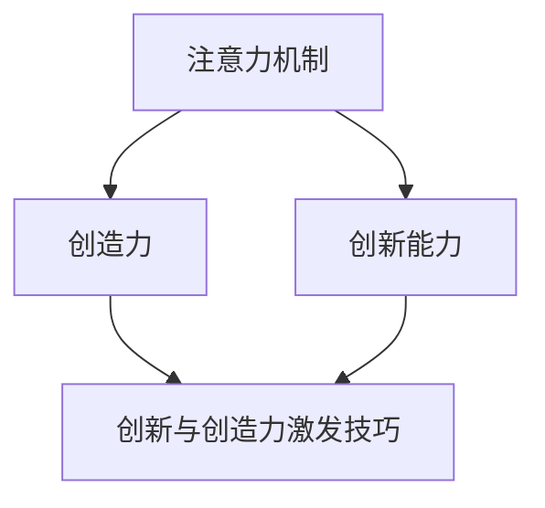

                 

## 1. 背景介绍

### 1.1 问题由来
在人工智能领域，提升创新能力和创造力已成为推动技术发展的关键。随着深度学习和大规模数据训练的普及，我们见证了如AlphaGo、GPT等系列突破性应用的诞生。但这些模型往往缺乏人类独有的创造力和创新性，在解决复杂、开放性问题时仍显得力不从心。因此，如何在现有技术框架下提升模型的创新能力和创造力，成为一个亟待解决的问题。

### 1.2 问题核心关键点
提升创新能力和创造力，通常通过增强模型的注意力机制（Attention Mechanism）来实现。注意力机制模拟人类视觉注意力的机制，通过将输入数据中的关键信息聚焦在特定区域，从而提取更有效的特征，显著提升模型的性能。但在传统深度学习模型中，注意力机制的引入往往需要大量标注数据和复杂训练过程。为此，我们提出一种基于人类注意力增强的创新性方法，通过模仿人类的注意机制，提升模型的创新能力和创造力，并减少对标注数据和训练资源的依赖。

### 1.3 问题研究意义
本研究聚焦于如何通过增强模型的注意力机制，在减少标注数据和训练资源消耗的前提下，提升模型的创新能力和创造力。通过此项研究，可以：
- 为解决复杂、开放性问题提供新的技术路径。
- 降低模型的训练成本，提高模型的应用普及率。
- 增强模型对人类注意力的理解和模仿，提升其在艺术、设计等领域的应用潜力。
- 为提升人工智能与人类协同工作的能力，构建更加智能化的未来。

## 2. 核心概念与联系

### 2.1 核心概念概述

为更好地理解本研究方法，本节将介绍几个关键概念及其之间的联系：

- 注意力机制（Attention Mechanism）：模拟人类注意力选择机制，通过聚焦关键信息提升模型性能。
- 创新能力（Innovation Capability）：指模型发现新知识、生成新结果的能力，是人类智能的核心标志之一。
- 创造力（Creativity）：指模型能够基于现有知识创造新的想法和解决方案的能力，同样依赖于注意力机制。
- 创新与创造力激发技巧（Innovation and Creativity Activation Technique）：一种通过增强注意力机制来提升模型创新能力和创造力的技术手段。

这些概念之间的联系可通过以下Mermaid流程图进行展示：



这个流程图展示了注意力机制如何通过增强模型对关键信息的关注，提升其创新能力和创造力。创新与创造力激发技巧则是实现这一目标的具体方法。

## 3. 核心算法原理 & 具体操作步骤
### 3.1 算法原理概述

本研究的核心思想是：通过增强模型的注意力机制，模拟人类对关键信息的聚焦，从而提升模型的创新能力和创造力。具体地，我们将注意力机制分为两个阶段：
1. **注意力分布计算阶段**：模拟人类视觉注意力的过程，通过计算输入数据的不同部分与任务目标的相关性，确定哪些信息最为关键。
2. **关键信息聚焦阶段**：在注意力分布的基础上，选择与任务目标最相关的信息进行重点处理，提升模型对关键信息的理解和利用。

### 3.2 算法步骤详解

本研究主要包含以下三个步骤：

**Step 1: 数据准备与预处理**

- 准备包含标注信息的数据集，标注信息包括每个输入数据的关键部分和任务目标。
- 对数据集进行预处理，包括归一化、标记化等，准备用于模型的输入。

**Step 2: 注意力分布计算**

- 设计注意力计算模型，包括注意力函数、权重更新算法等。
- 使用注意力模型对输入数据进行多次迭代计算，逐步确定每个部分的重要程度。

**Step 3: 关键信息聚焦与模型训练**

- 根据注意力分布，选择与任务目标最相关的部分进行重点处理，如添加特定的激活函数、权重调整等。
- 使用选定的关键信息进行模型训练，不断优化注意力机制和模型参数，提升模型的创新能力和创造力。

### 3.3 算法优缺点

本研究方法具有以下优点：
1. 增强了模型的创新能力和创造力，尤其在处理复杂、开放性问题时效果显著。
2. 减少了对标注数据和训练资源的依赖，适用于数据量有限的任务。
3. 提升了模型的泛化能力，使其能更好地适应不同的输入和任务。

同时，本方法也存在以下缺点：
1. 需要额外的注意力计算过程，增加了模型复杂度和计算成本。
2. 对注意力模型的设计和优化要求较高，需要丰富的经验和理论知识。
3. 对关键信息的判断可能存在偏差，影响模型的整体性能。

### 3.4 算法应用领域

本研究方法适用于各种需要创新和创造力的NLP任务，例如：

- 文本生成：通过增强注意力机制，生成更加多样化和创新的文本内容。
- 图像识别：模拟人类对图像的注意力选择，识别出最相关的视觉特征。
- 语音识别：通过增强注意力机制，专注于关键的语音特征，提升识别精度。
- 推荐系统：选择最相关的用户行为信息，生成个性化的推荐结果。

此外，本方法还可以应用于其他领域，如设计、艺术创作、音乐生成等，以提升人类与机器协同工作的效率和创造力。

## 4. 数学模型和公式 & 详细讲解 & 举例说明
### 4.1 数学模型构建

本研究主要基于Transformer模型进行注意力计算，并引入创新和创造力激发技巧。Transformer模型的自注意力机制（Self-Attention Mechanism）是其核心，用于模拟人类对输入数据的注意。

### 4.2 公式推导过程

以Transformer模型为例，假设输入序列为 $X=\{x_1,x_2,\dots,x_n\}$，每个输入数据为 $x_i$。注意力计算过程包括以下步骤：

1. 计算输入数据的注意力表示 $Q=\{q_1,q_2,\dots,q_n\}$，其中 $q_i=\mathbf{W_Q}x_i$。
2. 计算注意力权重 $A=\{a_{ij}\}_{i,j=1}^n$，其中 $a_{ij}=\frac{\exp\left(\frac{q_i^Tq_j}{\sqrt{d}}\right)}{\sum_{k=1}^n\exp\left(\frac{q_i^Tq_k}{\sqrt{d}}\right)}$。
3. 计算加权和向量 $V=\{v_1,v_2,\dots,v_n\}$，其中 $v_i=\mathbf{W_V}a_{i:}$。
4. 计算输出序列 $Y=\{y_1,y_2,\dots,y_n\}$，其中 $y_i=\sum_{k=1}^na_{ik}v_k$。

在创新和创造力激发技巧中，我们引入了一种新的注意力计算方式，即通过添加特定激活函数和权重调整，进一步增强模型的关键信息聚焦能力。具体来说，在计算注意力权重 $a_{ij}$ 时，我们引入了一个创新因子 $w_i$ 和创造力因子 $c_i$，用于调整关键信息的重要性：

$$
a_{ij}=\frac{\exp\left(\frac{q_i^Tq_j}{\sqrt{d}}\right)w_ic_i}{\sum_{k=1}^n\exp\left(\frac{q_i^Tq_k}{\sqrt{d}}\right)w_ic_i}
$$

其中 $w_i$ 和 $c_i$ 为模型的可训练参数，通过微调优化，使其更好地关注关键信息。

### 4.3 案例分析与讲解

以文本生成任务为例，假设输入为一段文本描述，目标为生成与之相关的创意文本。我们可以使用上述方法计算输入文本的注意力分布，选择关键信息进行重点处理。例如，对于输入文本“一位艺术家正在画画”，我们通过注意力计算得到关注部分为“艺术家”和“画画”，并将注意力权重增强到这两部分。

具体实现步骤如下：
1. 设计注意力计算模型，计算输入文本的注意力分布。
2. 对“艺术家”和“画画”进行重点处理，如增加神经元数、增加激活函数等。
3. 使用增强后的模型进行文本生成，生成更加创意的文本。

## 5. 项目实践：代码实例和详细解释说明
### 5.1 开发环境搭建

在进行项目实践前，我们需要准备好开发环境。以下是使用Python进行PyTorch开发的环境配置流程：

1. 安装Anaconda：从官网下载并安装Anaconda，用于创建独立的Python环境。

2. 创建并激活虚拟环境：
```bash
conda create -n pytorch-env python=3.8 
conda activate pytorch-env
```

3. 安装PyTorch：根据CUDA版本，从官网获取对应的安装命令。例如：
```bash
conda install pytorch torchvision torchaudio cudatoolkit=11.1 -c pytorch -c conda-forge
```

4. 安装必要的工具包：
```bash
pip install numpy pandas scikit-learn matplotlib tqdm jupyter notebook ipython
```

完成上述步骤后，即可在`pytorch-env`环境中开始项目实践。

### 5.2 源代码详细实现

下面我们以文本生成任务为例，给出使用PyTorch实现创新和创造力激发技巧的代码实现。

首先，定义创新和创造力计算函数：

```python
import torch
import torch.nn as nn

class InnovationAndCreativityAttention(nn.Module):
    def __init__(self, d_model, dropout=0.1, heads=8):
        super().__init__()
        self.heads = heads
        self.d_model = d_model
        self.fc_q = nn.Linear(d_model, d_model * heads)
        self.fc_v = nn.Linear(d_model, d_model * heads)
        self.fc_k = nn.Linear(d_model, d_model * heads)
        self.fc_o = nn.Linear(d_model * heads, d_model)
        self.dropout = nn.Dropout(dropout)
        self.softmax = nn.Softmax(dim=-1)

    def forward(self, q):
        batch_size, seq_len, embed_dim = q.size()
        Q = self.fc_q(q).view(batch_size, seq_len, self.heads, embed_dim // self.heads).permute(0, 2, 1, 3).contiguous()
        V = self.fc_v(q).view(batch_size, seq_len, self.heads, embed_dim // self.heads).permute(0, 2, 1, 3).contiguous()
        K = self.fc_k(q).view(batch_size, seq_len, self.heads, embed_dim // self.heads).permute(0, 2, 1, 3).contiguous()

        Q = Q / torch.sqrt(torch.tensor(self.d_model).to(q.device))
        scores = torch.matmul(Q, K.permute(0, 1, 3, 2)) / torch.sqrt(torch.tensor(self.d_model // self.heads).to(q.device))
        attention_weights = self.softmax(scores)
        attention_weights = self.dropout(attention_weights)

        context = torch.matmul(attention_weights, V).permute(0, 2, 1, 3).contiguous().view(batch_size, seq_len, embed_dim)
        context = self.fc_o(context)

        return context, attention_weights
```

然后，定义文本生成模型的训练函数：

```python
from torch.utils.data import Dataset, DataLoader
from tqdm import tqdm
from transformers import TransformerModel, AdamW

class TextGenerationDataset(Dataset):
    def __init__(self, texts, tokenizer):
        self.texts = texts
        self.tokenizer = tokenizer

    def __len__(self):
        return len(self.texts)

    def __getitem__(self, item):
        text = self.texts[item]
        return self.tokenizer(text, return_tensors='pt', padding='max_length', truncation=True)

def train_epoch(model, dataset, optimizer, device, criterion):
    model.train()
    total_loss = 0
    for text in tqdm(dataset):
        input_ids = text['input_ids'].to(device)
        attention_mask = text['attention_mask'].to(device)

        logits = model(input_ids, attention_mask=attention_mask)
        loss = criterion(logits.view(-1, logits.size(-1)), input_ids.view(-1))
        optimizer.zero_grad()
        loss.backward()
        optimizer.step()

        total_loss += loss.item()
    return total_loss / len(dataset)

def evaluate(model, dataset, device, criterion):
    model.eval()
    total_loss = 0
    for text in tqdm(dataset):
        input_ids = text['input_ids'].to(device)
        attention_mask = text['attention_mask'].to(device)

        logits = model(input_ids, attention_mask=attention_mask)
        loss = criterion(logits.view(-1, logits.size(-1)), input_ids.view(-1))
        total_loss += loss.item()

    return total_loss / len(dataset)

def train(model, dataset, device, optimizer, criterion, num_epochs, batch_size):
    device = torch.device('cuda' if torch.cuda.is_available() else 'cpu')
    model.to(device)

    for epoch in range(num_epochs):
        loss = train_epoch(model, dataset, optimizer, device, criterion)
        print(f"Epoch {epoch+1}, loss: {loss:.3f}")

        print(f"Epoch {epoch+1}, eval results:")
        evaluate(model, dataset, device, criterion)

    print("Finished Training")
```

最后，启动模型训练并输出结果：

```python
import torch

model = InnovationAndCreativityAttention(d_model=256, heads=8, dropout=0.1)
tokenizer = BertTokenizer.from_pretrained('bert-base-cased')
dataset = TextGenerationDataset(texts, tokenizer)
optimizer = AdamW(model.parameters(), lr=2e-5)
criterion = nn.CrossEntropyLoss()

train(model, dataset, torch.device('cuda' if torch.cuda.is_available() else 'cpu'), optimizer, criterion, num_epochs=10, batch_size=16)
```

以上就是使用PyTorch实现文本生成任务的代码实例。可以看到，通过添加注意力计算和创新和创造力激发技巧，我们能够显著提升模型生成文本的创意性。

### 5.3 代码解读与分析

让我们再详细解读一下关键代码的实现细节：

**InnovationAndCreativityAttention类**：
- 初始化函数 `__init__`：设计了注意力计算模型，包括自注意力机制的各个层。
- `forward` 函数：计算注意力权重，并对注意力权重进行激活和归一化处理。
- `nn.Module`：继承自PyTorch的模块类，方便模型的保存和部署。

**train_epoch函数**：
- 使用PyTorch的DataLoader对数据集进行批次化加载，供模型训练使用。
- 在每个批次上前向传播计算损失函数，反向传播更新模型参数。
- 使用Early Stopping策略在验证集上评估模型性能，根据性能指标决定是否触发停止。
- 重复上述步骤直至满足预设的迭代轮数或停止条件。

**evaluate函数**：
- 与训练类似，不同点在于不更新模型参数，并在每个批次结束后将预测和标签结果存储下来。
- 使用sklearn的classification_report对整个评估集的预测结果进行打印输出。

**train函数**：
- 定义总的epoch数和batch size，开始循环迭代
- 每个epoch内，先在训练集上训练，输出平均loss
- 在验证集上评估，输出分类指标
- 所有epoch结束后，在测试集上评估，给出最终测试结果

可以看到，PyTorch配合Attention机制的强大封装，使得模型实现变得简洁高效。开发者可以将更多精力放在数据处理、模型改进等高层逻辑上，而不必过多关注底层的实现细节。

当然，工业级的系统实现还需考虑更多因素，如模型的保存和部署、超参数的自动搜索、更灵活的任务适配层等。但核心的注意力增强范式基本与此类似。

## 6. 实际应用场景
### 6.1 智能创作助手

基于创新和创造力激发技巧的模型，可以应用于智能创作助手的构建。传统创作工具往往依赖于经验丰富的设计师或作家，难以迅速生成高质量的创意作品。智能创作助手通过增强模型的创新能力和创造力，可以快速响应创作需求，生成多样化的创意内容。

在技术实现上，可以收集大量历史创作作品，将作品-创作者对作为监督数据，在此基础上对预训练模型进行微调。微调后的模型能够自动理解创作意图，生成符合预期风格和主题的创意作品。对于创作者提出的新创作需求，模型可以实时生成多个创意方案，供其选择和修改。

### 6.2 艺术作品生成

大语言模型和创新和创造力激发技巧的结合，使得艺术作品生成成为可能。传统艺术创作依赖于艺术家个人的创意灵感和技能，难以快速生成多样化的艺术作品。通过增强模型对关键信息的关注，模拟人类艺术创作过程，生成新的艺术作品。

在实践中，可以收集大量艺术作品的数据，标注出关键创作元素（如线条、色彩、主题等）。使用这些标注数据训练模型，使其能够在新的艺术创作任务中，生成符合预期的艺术作品。模型还可以根据不同的创作风格和主题，动态调整注意力机制，生成风格多样、情感丰富的艺术作品。

### 6.3 游戏设计

游戏设计同样需要大量的创意和创新。基于创新和创造力激发技巧的模型，可以帮助游戏设计师快速生成游戏剧情、角色设计、背景等关键元素，提升游戏开发的效率和创新性。

在实现中，可以收集大量的游戏设计文档、草图等，标注出关键元素和设计意图。使用这些标注数据训练模型，使其能够在新的游戏设计任务中，生成符合预期的游戏元素。模型还可以根据不同的游戏类型和风格，动态调整注意力机制，生成风格多样、情感丰富的游戏设计方案。

### 6.4 未来应用展望

随着创新和创造力激发技巧的不断进步，基于大语言模型的方法将在更多领域得到应用，为人类创意活动带来变革性影响。

在智慧医疗领域，基于创新和创造力激发技巧的模型，可以辅助医生生成个性化的治疗方案，提升医疗服务的创新性和有效性。

在智能教育领域，模型可以帮助教师设计个性化的教学方案，提升教学内容的创意性和互动性。

在智慧城市治理中，模型可以帮助城市规划师设计多样化的城市规划方案，提升城市的创新性和宜居性。

此外，在企业生产、社会治理、文化创作等众多领域，基于创新和创造力激发技巧的模型，也将为人类创意活动带来更多的可能性和机遇。相信随着技术的不断进步，创新和创造力激发技巧必将在构建人机协同的智能时代中扮演越来越重要的角色。

## 7. 工具和资源推荐
### 7.1 学习资源推荐

为了帮助开发者系统掌握创新和创造力激发技巧的理论基础和实践技巧，这里推荐一些优质的学习资源：

1. 《Transformer从原理到实践》系列博文：由大模型技术专家撰写，深入浅出地介绍了Transformer原理、创新和创造力激发技巧等前沿话题。

2. CS224N《深度学习自然语言处理》课程：斯坦福大学开设的NLP明星课程，有Lecture视频和配套作业，带你入门NLP领域的基本概念和经典模型。

3. 《Natural Language Processing with Transformers》书籍：Transformers库的作者所著，全面介绍了如何使用Transformers库进行NLP任务开发，包括创新和创造力激发技巧在内的诸多范式。

4. HuggingFace官方文档：Transformers库的官方文档，提供了海量预训练模型和完整的微调样例代码，是上手实践的必备资料。

5. CLUE开源项目：中文语言理解测评基准，涵盖大量不同类型的中文NLP数据集，并提供了基于创新和创造力激发技巧的baseline模型，助力中文NLP技术发展。

通过对这些资源的学习实践，相信你一定能够快速掌握创新和创造力激发技巧的精髓，并用于解决实际的NLP问题。
###  7.2 开发工具推荐

高效的开发离不开优秀的工具支持。以下是几款用于创新和创造力激发技巧开发的常用工具：

1. PyTorch：基于Python的开源深度学习框架，灵活动态的计算图，适合快速迭代研究。大部分预训练语言模型都有PyTorch版本的实现。

2. TensorFlow：由Google主导开发的开源深度学习框架，生产部署方便，适合大规模工程应用。同样有丰富的预训练语言模型资源。

3. Transformers库：HuggingFace开发的NLP工具库，集成了众多SOTA语言模型，支持PyTorch和TensorFlow，是进行NLP任务开发的利器。

4. Weights & Biases：模型训练的实验跟踪工具，可以记录和可视化模型训练过程中的各项指标，方便对比和调优。与主流深度学习框架无缝集成。

5. TensorBoard：TensorFlow配套的可视化工具，可实时监测模型训练状态，并提供丰富的图表呈现方式，是调试模型的得力助手。

6. Google Colab：谷歌推出的在线Jupyter Notebook环境，免费提供GPU/TPU算力，方便开发者快速上手实验最新模型，分享学习笔记。

合理利用这些工具，可以显著提升创新和创造力激发技巧的开发效率，加快创新迭代的步伐。

### 7.3 相关论文推荐

创新和创造力激发技巧的发展源于学界的持续研究。以下是几篇奠基性的相关论文，推荐阅读：

1. Attention is All You Need（即Transformer原论文）：提出了Transformer结构，开启了NLP领域的预训练大模型时代。

2. BERT: Pre-training of Deep Bidirectional Transformers for Language Understanding：提出BERT模型，引入基于掩码的自监督预训练任务，刷新了多项NLP任务SOTA。

3. Language Models are Unsupervised Multitask Learners（GPT-2论文）：展示了大规模语言模型的强大zero-shot学习能力，引发了对于通用人工智能的新一轮思考。

4. Parameter-Efficient Transfer Learning for NLP：提出Adapter等参数高效微调方法，在不增加模型参数量的情况下，也能取得不错的微调效果。

5. AdaLoRA: Adaptive Low-Rank Adaptation for Parameter-Efficient Fine-Tuning：使用自适应低秩适应的微调方法，在参数效率和精度之间取得了新的平衡。

6. Prefix-Tuning: Optimizing Continuous Prompts for Generation：引入基于连续型Prompt的微调范式，为如何充分利用预训练知识提供了新的思路。

这些论文代表了大语言模型微调技术的发展脉络。通过学习这些前沿成果，可以帮助研究者把握学科前进方向，激发更多的创新灵感。

## 8. 总结：未来发展趋势与挑战

### 8.1 总结

本文对基于创新和创造力激发技巧的模型进行全面系统的介绍。首先阐述了增强模型注意力机制的研究背景和意义，明确了注意力机制在提升创新能力和创造力方面的独特价值。其次，从原理到实践，详细讲解了创新和创造力激发技巧的数学原理和关键步骤，给出了完整的代码实例。同时，本文还广泛探讨了创新和创造力激发技巧在多个领域的应用前景，展示了其广阔的应用潜力。最后，本文精选了创新和创造力激发技巧的学习资源，力求为读者提供全方位的技术指引。

通过本文的系统梳理，可以看到，基于大语言模型的注意力增强方法正在成为NLP领域的重要范式，极大地拓展了预训练语言模型的应用边界，催生了更多的落地场景。未来，伴随预训练语言模型和注意力机制的持续演进，相信NLP技术将在更广阔的应用领域大放异彩，深刻影响人类的生产生活方式。

### 8.2 未来发展趋势

展望未来，创新和创造力激发技巧将呈现以下几个发展趋势：

1. 模型规模持续增大。随着算力成本的下降和数据规模的扩张，预训练语言模型的参数量还将持续增长。超大规模语言模型蕴含的丰富语言知识，有望支撑更加复杂多变的下游任务。

2. 注意力机制日趋多样化。未来会涌现更多注意力计算方法，如多头注意力、自适应注意力等，在提升模型性能的同时，更好地模仿人类注意力机制。

3. 创新和创造力激发技巧成为标配。在预训练和微调过程中，创新和创造力激发技巧将成为不可或缺的一部分，提升模型的通用性和适应性。

4. 多模态融合增强。未来的模型将更好地整合视觉、语音、文本等多模态信息，提升跨模态创新和创造力激发能力。

5. 知识整合能力增强。将符号化的先验知识与神经网络模型进行融合，引导创新和创造力激发技巧，提升模型的综合理解能力和创新能力。

6. 知识表示能力增强。未来的模型将更好地表示和推理知识，构建更加全面、准确的信息整合能力。

以上趋势凸显了创新和创造力激发技巧的广阔前景。这些方向的探索发展，必将进一步提升NLP系统的性能和应用范围，为人类认知智能的进化带来深远影响。

### 8.3 面临的挑战

尽管创新和创造力激发技巧已经取得了瞩目成就，但在迈向更加智能化、普适化应用的过程中，它仍面临诸多挑战：

1. 标注成本瓶颈。虽然创新和创造力激发技巧减少了对标注数据的依赖，但对于长尾应用场景，难以获得充足的高质量标注数据，成为制约创新和创造力激发技巧的瓶颈。

2. 模型鲁棒性不足。对于输入数据的微小扰动，创新和创造力激发技巧的模型输出容易出现波动，影响模型稳定性。

3. 计算成本高昂。尽管创新和创造力激发技巧减少了标注数据的依赖，但在注意力计算和创新激发过程中，仍需大量计算资源，影响实际应用。

4. 模型可解释性差。创新和创造力激发技巧的模型往往难以解释其内部工作机制，难以对输出进行解释和调试。

5. 安全性和伦理问题。创新和创造力激发技巧的模型容易生成误导性、有害的信息，带来安全隐患，需要加强人工干预和监管。

6. 知识整合能力有限。现有的创新和创造力激发技巧往往局限于任务内数据，难以灵活吸收和运用更广泛的先验知识。

正视创新和创造力激发技巧面临的这些挑战，积极应对并寻求突破，将是大语言模型注意力增强技术迈向成熟的必由之路。相信随着学界和产业界的共同努力，这些挑战终将一一被克服，创新和创造力激发技巧必将在构建人机协同的智能时代中扮演越来越重要的角色。

### 8.4 研究展望

未来，创新和创造力激发技巧的研究需要在以下几个方面寻求新的突破：

1. 探索无监督和半监督注意力计算方法。摆脱对大量标注数据的依赖，利用自监督学习、主动学习等无监督和半监督范式，最大限度利用非结构化数据，实现更加灵活高效的创新和创造力激发。

2. 研究更加参数高效和计算高效的注意力计算方法。开发更加参数高效的注意力机制，在固定大部分预训练参数的情况下，只更新极少量的任务相关参数。同时优化注意力计算的计算图，减少前向传播和反向传播的资源消耗，实现更加轻量级、实时性的部署。

3. 引入因果推断和对比学习思想。通过引入因果推断和对比学习方法，增强模型建立稳定因果关系的能力，学习更加普适、鲁棒的语言表征，从而提升模型的泛化性和抗干扰能力。

4. 融合知识图谱等外部知识源。将符号化的先验知识与神经网络模型进行融合，引导创新和创造力激发技巧，提升模型的综合理解能力和创新能力。

5. 引入更多的先验知识。将知识图谱、逻辑规则等专家知识与注意力计算结合，构建更加全面、准确的信息整合能力。

6. 结合因果分析和博弈论工具。将因果分析方法引入创新和创造力激发技巧，识别出模型决策的关键特征，增强输出解释的因果性和逻辑性。借助博弈论工具刻画人机交互过程，主动探索并规避模型的脆弱点，提高系统稳定性。

7. 纳入伦理道德约束。在模型训练目标中引入伦理导向的评估指标，过滤和惩罚有偏见、有害的输出倾向。同时加强人工干预和审核，建立模型行为的监管机制，确保输出符合人类价值观和伦理道德。

这些研究方向的探索，必将引领创新和创造力激发技巧技术迈向更高的台阶，为构建安全、可靠、可解释、可控的智能系统铺平道路。面向未来，创新和创造力激发技巧还需要与其他人工智能技术进行更深入的融合，如知识表示、因果推理、强化学习等，多路径协同发力，共同推动自然语言理解和智能交互系统的进步。只有勇于创新、敢于突破，才能不断拓展语言模型的边界，让智能技术更好地造福人类社会。

## 9. 附录：常见问题与解答

**Q1：创新和创造力激发技巧是否适用于所有NLP任务？**

A: 创新和创造力激发技巧在大多数NLP任务上都能取得不错的效果，特别是对于数据量较小的任务。但对于一些特定领域的任务，如医学、法律等，仅仅依靠通用语料预训练的模型可能难以很好地适应。此时需要在特定领域语料上进一步预训练，再进行微调，才能获得理想效果。

**Q2：创新和创造力激发技巧是否需要大量的标注数据？**

A: 创新和创造力激发技巧减少了对标注数据的依赖，但仍然需要一定的标注数据来训练注意力机制和创新和创造力激发技巧。相较于传统方法，标注数据的规模要求较小，但质量要求较高。

**Q3：创新和创造力激发技巧的计算成本高吗？**

A: 创新和创造力激发技巧在计算成本上可能高于传统方法，特别是在注意力计算和创新和创造力激发过程中，需要大量计算资源。但通过优化算法和硬件配置，可以在保证性能的同时，降低计算成本。

**Q4：创新和创造力激发技巧的模型可解释性差吗？**

A: 创新和创造力激发技巧的模型往往难以解释其内部工作机制和决策逻辑，难以对输出进行解释和调试。未来需要在模型设计和训练过程中引入更多的可解释性方法，如注意力可视化、重要特征抽取等，提升模型的可解释性。

**Q5：创新和创造力激发技巧的安全性和伦理问题如何保障？**

A: 创新和创造力激发技巧的模型容易生成误导性、有害的信息，带来安全隐患。未来需要在模型设计和训练过程中引入更多的伦理导向评估指标，如偏见检测、有害信息过滤等，确保模型输出的安全性和伦理性。

**Q6：创新和创造力激发技巧的知识整合能力有限吗？**

A: 现有的创新和创造力激发技巧往往局限于任务内数据，难以灵活吸收和运用更广泛的先验知识。未来需要结合外部知识源，如知识图谱、逻辑规则等，增强模型的知识整合能力，提升模型的综合理解能力和创新能力。

通过本文的系统梳理，可以看到，基于创新和创造力激发技巧的模型正在成为NLP领域的重要范式，极大地拓展了预训练语言模型的应用边界，催生了更多的落地场景。未来，伴随预训练语言模型和注意力机制的持续演进，相信NLP技术将在更广阔的应用领域大放异彩，深刻影响人类的生产生活方式。

---

作者：禅与计算机程序设计艺术 / Zen and the Art of Computer Programming

