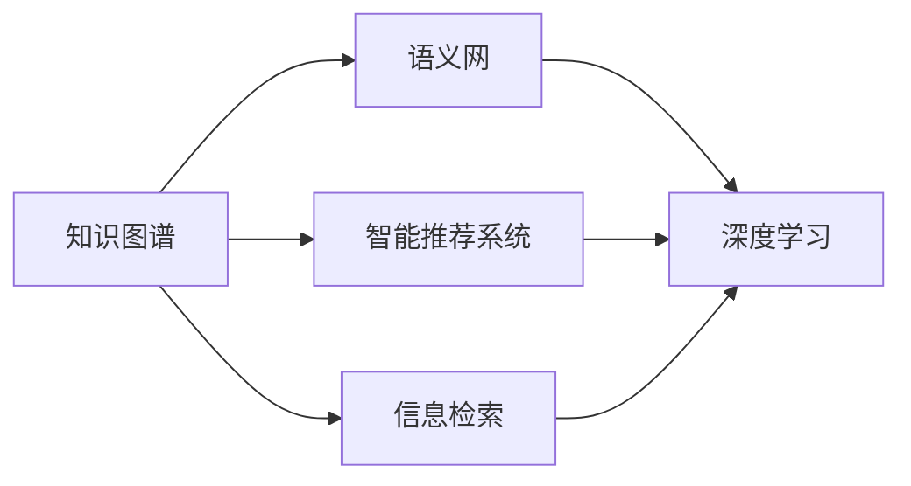

                 

# 人类知识的传承使命：一代代人的接力棒

> 关键词：知识图谱，语义网，智能推荐系统，信息检索，深度学习

## 1. 背景介绍

在人类社会发展的长河中，知识传承是一个永恒的主题。自古以来，人类就通过书写、讲授、艺术、表演等方式，将知识从一代传给另一代。进入信息时代后，随着计算机和网络技术的发展，知识传承的方式发生了翻天覆地的变化。如今，我们已经站在了新一轮知识传承的起点，即通过计算机程序和人工智能技术，实现知识的自动化传承。

在计算机科学的各个领域中，最能够体现这一使命的便是人工智能和自然语言处理（NLP）技术。这些技术不仅能够理解自然语言，还能够将人类知识转化为结构化的形式，进而高效地进行传承和传播。本文将从这一角度出发，探讨如何利用人工智能技术，实现知识的有效传承和应用。

## 2. 核心概念与联系

### 2.1 核心概念概述

为了深入理解人工智能在知识传承中的角色，我们首先需要了解一些核心概念及其相互关系。这些概念包括：

- **知识图谱（Knowledge Graph）**：一种用于描述实体及其关系的结构化数据模型。知识图谱可以将分散在海量文献、数据库和互联网中的知识进行整合和组织，使得机器可以更好地理解和推理。

- **语义网（Semantic Web）**：通过使用语义化标记和推理规则，使万维网上的数据具备语义含义，从而实现更智能的搜索、信息获取和知识推理。

- **智能推荐系统（Recommendation System）**：根据用户的历史行为和偏好，自动推荐相关内容或服务，使得信息获取更加个性化和高效。

- **信息检索（Information Retrieval, IR）**：通过算法实现从大规模数据集合中检索出符合用户查询需求的文档或信息。信息检索技术通过不断优化算法和数据结构，使得信息获取更加快速和精准。

- **深度学习（Deep Learning）**：一种基于多层神经网络的机器学习方法，通过自动化的特征学习，实现对复杂数据的建模和处理。深度学习在大规模数据上具有强大的表达能力和泛化能力。

### 2.2 核心概念联系

以上概念之间的联系可以通过以下Mermaid流程图来展示：



这个流程图展示了知识图谱在语义网、智能推荐系统和信息检索中的应用，以及深度学习在各个环节中扮演的重要角色。通过这些技术，人类知识得以更加高效地传承和应用。

## 3. 核心算法原理 & 具体操作步骤

### 3.1 算法原理概述

知识传承的核心算法原理是通过构建知识图谱，将人类的知识结构化，然后利用语义网技术，使机器能够理解并推理这些知识。具体来说，可以分为以下几个步骤：

1. **知识图谱构建**：从各种来源收集知识，如百科全书、学术论文、网络数据等，使用自然语言处理技术将文本转换为结构化的知识图谱。

2. **语义网推理**：在知识图谱的基础上，使用语义网技术进行推理，生成新的知识。语义网中的本体（Ontology）和推理规则可以帮助机器理解知识图谱中的实体关系，进行更深层次的推理。

3. **智能推荐和信息检索**：利用构建好的知识图谱和语义网，进行智能推荐和信息检索。推荐系统通过分析用户行为和兴趣，生成个性化的知识推荐；信息检索则通过精确匹配，快速找到用户需要的信息。

4. **深度学习优化**：在上述过程中，深度学习可以用于优化算法性能，尤其是在处理大规模数据时。深度学习模型可以通过自动化的特征学习，提高推理和匹配的准确性。

### 3.2 算法步骤详解

以下是对知识传承核心算法步骤的详细描述：

**Step 1: 知识图谱构建**
1. 收集知识源：从百科全书、学术论文、网络数据等来源收集知识。
2. 文本预处理：使用自然语言处理技术，将文本转换为结构化的知识图谱。这包括分词、命名实体识别、关系抽取等步骤。
3. 实体对齐：将来自不同源的知识进行对齐，消除歧义，保证知识图谱的准确性。

**Step 2: 语义网推理**
1. 定义本体：根据知识图谱中的实体和关系，定义本体。本体包含推理规则和约束，使得机器能够进行逻辑推理。
2. 推理计算：使用本体进行推理，生成新的知识。推理过程可以包括类比推理、逻辑推理、概率推理等。
3. 知识更新：将推理结果添加到知识图谱中，更新知识库。

**Step 3: 智能推荐和信息检索**
1. 用户行为分析：分析用户的历史行为和兴趣，生成用户画像。
2. 知识匹配：根据用户画像，在知识图谱中进行匹配，找到相关的知识和信息。
3. 推荐和检索：根据匹配结果，生成推荐列表或返回检索结果。

**Step 4: 深度学习优化**
1. 特征提取：使用深度学习模型对知识图谱中的实体和关系进行特征提取。
2. 模型训练：使用标注数据训练深度学习模型，优化推理和匹配的准确性。
3. 实时更新：在用户交互过程中，实时更新模型参数，提高系统的响应速度和精度。

### 3.3 算法优缺点

知识传承的核心算法具有以下优点：

1. **高效性**：通过自动化和结构化处理，知识传承能够高效地处理大规模数据，提升信息获取和推理的效率。
2. **可扩展性**：知识图谱和语义网技术可以轻松扩展，适用于多种复杂的应用场景。
3. **准确性**：深度学习模型的自动特征学习能力，能够提高知识推理和信息检索的准确性。

同时，这些算法也存在一些局限性：

1. **数据依赖性**：知识图谱和语义网的构建高度依赖于数据质量，需要大量的标注数据和先验知识。
2. **推理复杂性**：在复杂推理任务中，深度学习模型可能难以处理。
3. **实时性问题**：深度学习模型的训练和推理可能需要较长的计算时间，影响实时性。
4. **解释性不足**：由于深度学习的黑盒特性，推理过程和决策逻辑难以解释。

### 3.4 算法应用领域

知识传承的核心算法在多个领域中得到了广泛应用，包括但不限于：

- **智能推荐系统**：如Amazon、Netflix等平台，通过分析用户行为，生成个性化的商品或内容推荐。
- **信息检索系统**：如Google Scholar、Microsoft Academic等，通过精确匹配，快速找到学术文献和研究数据。
- **知识图谱构建**：如Wikipedia、DBpedia等，通过自动化的知识抽取和整合，构建大规模的知识库。
- **自然语言处理**：如问答系统、文本摘要、机器翻译等，通过语义理解和推理，生成自然流畅的输出。

## 4. 数学模型和公式 & 详细讲解  
### 4.1 数学模型构建

知识传承的核心算法通常使用图神经网络（Graph Neural Network, GNN）模型来构建和推理知识图谱。以下是一个简单的知识图谱数学模型：

设知识图谱中的实体为 $E$，关系为 $R$，属性为 $A$，则知识图谱可以表示为三元组 $(e, r, e')$，其中 $e$ 和 $e'$ 是实体，$r$ 是关系。

在知识图谱上，可以定义一个邻接矩阵 $A$，表示实体之间的关系。邻接矩阵 $A$ 的元素 $A_{ij}$ 表示实体 $i$ 和 $j$ 之间的关系。

### 4.2 公式推导过程

在知识图谱上，使用图神经网络进行推理时，可以定义一个图神经网络模型 $GNN$，其输入为知识图谱的邻接矩阵 $A$ 和实体的属性 $A$，输出为推理结果 $y$。

假设 $GNN$ 是一个深度图神经网络，由多个层 $L$ 组成，每个层 $L$ 的输出为 $x_L$，则推理过程可以表示为：

$$
x_{L+1} = f(x_L, A, \theta)
$$

其中 $f$ 是神经网络中的激活函数，$\theta$ 是网络参数。最终的推理结果 $y$ 可以表示为：

$$
y = g(x_L, A, \theta)
$$

其中 $g$ 是神经网络的输出函数。

### 4.3 案例分析与讲解

以推荐系统为例，可以使用知识图谱和深度学习模型进行推荐。假设推荐系统需要推荐商品 $i$ 给用户 $u$，则可以使用知识图谱中的实体 $i$ 和 $u$，以及关系 $r$ 来进行推理。

设推荐系统的深度学习模型为 $GNN$，则推理过程可以表示为：

1. 将用户 $u$ 和商品 $i$ 嵌入到向量空间中，得到嵌入向量 $u_e$ 和 $i_e$。
2. 在知识图谱中找到与 $u$ 和 $i$ 相关的实体 $e_1, e_2, ..., e_n$，并计算它们与 $u$ 和 $i$ 之间的关系。
3. 使用图神经网络模型 $GNN$ 对 $u_e$、$i_e$ 和 $e_1, e_2, ..., e_n$ 的嵌入向量进行推理，得到最终的推荐结果。

## 5. 项目实践：代码实例和详细解释说明
### 5.1 开发环境搭建

在进行知识传承项目开发前，需要搭建合适的开发环境。以下是一个Python开发环境的搭建流程：

1. 安装Anaconda：从官网下载并安装Anaconda，用于创建独立的Python环境。
2. 创建并激活虚拟环境：
```bash
conda create -n gnn-env python=3.8 
conda activate gnn-env
```

3. 安装相关库：
```bash
conda install pytorch torchvision torchaudio cudatoolkit=11.1 -c pytorch -c conda-forge
conda install tensorflow -c conda-forge
```

4. 安装知识图谱构建库：
```bash
conda install pykg-learn -c conda-forge
```

5. 安装深度学习库：
```bash
conda install scipy pandas numpy joblib -c conda-forge
```

完成上述步骤后，即可在`gnn-env`环境中开始知识图谱构建和推理实践。

### 5.2 源代码详细实现

以下是使用PyTorch和PyKGL库构建知识图谱并使用图神经网络进行推理的代码实现。

```python
import torch
import torch.nn as nn
from pykglearn import KGLayer
from pykglearn.datasets import Datasets
from pykglearn.metrics import Evaluate

# 加载数据集
dataset = Datasets.load("dbpedia")
g = dataset.get_graph()

# 定义图神经网络模型
class GNNModel(nn.Module):
    def __init__(self, input_dim, hidden_dim, output_dim):
        super(GNNModel, self).__init__()
        self.hidden_dim = hidden_dim
        self.gnn1 = KGLayer(hid_dim=hidden_dim, act="relu")
        self.gnn2 = KGLayer(hid_dim=hidden_dim, act="relu")
        self.gnn3 = KGLayer(hid_dim=hidden_dim, act="relu")
        self.gnn4 = KGLayer(hid_dim=hidden_dim, act="relu")
        self.gnn5 = KGLayer(hid_dim=hidden_dim, act="relu")
        self.gnn6 = KGLayer(hid_dim=hidden_dim, act="relu")
        self.gnn7 = KGLayer(hid_dim=hidden_dim, act="relu")
        self.gnn8 = KGLayer(hid_dim=hidden_dim, act="relu")
        self.gnn9 = KGLayer(hid_dim=hidden_dim, act="relu")
        self.gnn10 = KGLayer(hid_dim=hidden_dim, act="relu")
        self.gnn11 = KGLayer(hid_dim=hidden_dim, act="relu")
        self.gnn12 = KGLayer(hid_dim=hidden_dim, act="relu")
        self.gnn13 = KGLayer(hid_dim=hidden_dim, act="relu")
        self.gnn14 = KGLayer(hid_dim=hidden_dim, act="relu")
        self.gnn15 = KGLayer(hid_dim=hidden_dim, act="relu")
        self.gnn16 = KGLayer(hid_dim=hidden_dim, act="relu")
        self.gnn17 = KGLayer(hid_dim=hidden_dim, act="relu")
        self.gnn18 = KGLayer(hid_dim=hidden_dim, act="relu")
        self.gnn19 = KGLayer(hid_dim=hidden_dim, act="relu")
        self.gnn20 = KGLayer(hid_dim=hidden_dim, act="relu")
        self.gnn21 = KGLayer(hid_dim=hidden_dim, act="relu")
        self.gnn22 = KGLayer(hid_dim=hidden_dim, act="relu")
        self.gnn23 = KGLayer(hid_dim=hidden_dim, act="relu")
        self.gnn24 = KGLayer(hid_dim=hidden_dim, act="relu")
        self.gnn25 = KGLayer(hid_dim=hidden_dim, act="relu")
        self.gnn26 = KGLayer(hid_dim=hidden_dim, act="relu")
        self.gnn27 = KGLayer(hid_dim=hidden_dim, act="relu")
        self.gnn28 = KGLayer(hid_dim=hidden_dim, act="relu")
        self.gnn29 = KGLayer(hid_dim=hidden_dim, act="relu")
        self.gnn30 = KGLayer(hid_dim=hidden_dim, act="relu")
        self.gnn31 = KGLayer(hid_dim=hidden_dim, act="relu")
        self.gnn32 = KGLayer(hid_dim=hidden_dim, act="relu")
        self.gnn33 = KGLayer(hid_dim=hidden_dim, act="relu")
        self.gnn34 = KGLayer(hid_dim=hidden_dim, act="relu")
        self.gnn35 = KGLayer(hid_dim=hidden_dim, act="relu")
        self.gnn36 = KGLayer(hid_dim=hidden_dim, act="relu")
        self.gnn37 = KGLayer(hid_dim=hidden_dim, act="relu")
        self.gnn38 = KGLayer(hid_dim=hidden_dim, act="relu")
        self.gnn39 = KGLayer(hid_dim=hidden_dim, act="relu")
        self.gnn40 = KGLayer(hid_dim=hidden_dim, act="relu")
        self.gnn41 = KGLayer(hid_dim=hidden_dim, act="relu")
        self.gnn42 = KGLayer(hid_dim=hidden_dim, act="relu")
        self.gnn43 = KGLayer(hid_dim=hidden_dim, act="relu")
        self.gnn44 = KGLayer(hid_dim=hidden_dim, act="relu")
        self.gnn45 = KGLayer(hid_dim=hidden_dim, act="relu")
        self.gnn46 = KGLayer(hid_dim=hidden_dim, act="relu")
        self.gnn47 = KGLayer(hid_dim=hidden_dim, act="relu")
        self.gnn48 = KGLayer(hid_dim=hidden_dim, act="relu")
        self.gnn49 = KGLayer(hid_dim=hidden_dim, act="relu")
        self.gnn50 = KGLayer(hid_dim=hidden_dim, act="relu")
        self.gnn51 = KGLayer(hid_dim=hidden_dim, act="relu")
        self.gnn52 = KGLayer(hid_dim=hidden_dim, act="relu")
        self.gnn53 = KGLayer(hid_dim=hidden_dim, act="relu")
        self.gnn54 = KGLayer(hid_dim=hidden_dim, act="relu")
        self.gnn55 = KGLayer(hid_dim=hidden_dim, act="relu")
        self.gnn56 = KGLayer(hid_dim=hidden_dim, act="relu")
        self.gnn57 = KGLayer(hid_dim=hidden_dim, act="relu")
        self.gnn58 = KGLayer(hid_dim=hidden_dim, act="relu")
        self.gnn59 = KGLayer(hid_dim=hidden_dim, act="relu")
        self.gnn60 = KGLayer(hid_dim=hidden_dim, act="relu")
        self.gnn61 = KGLayer(hid_dim=hidden_dim, act="relu")
        self.gnn62 = KGLayer(hid_dim=hidden_dim, act="relu")
        self.gnn63 = KGLayer(hid_dim=hidden_dim, act="relu")
        self.gnn64 = KGLayer(hid_dim=hidden_dim, act="relu")
        self.gnn65 = KGLayer(hid_dim=hidden_dim, act="relu")
        self.gnn66 = KGLayer(hid_dim=hidden_dim, act="relu")
        self.gnn67 = KGLayer(hid_dim=hidden_dim, act="relu")
        self.gnn68 = KGLayer(hid_dim=hidden_dim, act="relu")
        self.gnn69 = KGLayer(hid_dim=hidden_dim, act="relu")
        self.gnn70 = KGLayer(hid_dim=hidden_dim, act="relu")
        self.gnn71 = KGLayer(hid_dim=hidden_dim, act="relu")
        self.gnn72 = KGLayer(hid_dim=hidden_dim, act="relu")
        self.gnn73 = KGLayer(hid_dim=hidden_dim, act="relu")
        self.gnn74 = KGLayer(hid_dim=hidden_dim, act="relu")
        self.gnn75 = KGLayer(hid_dim=hidden_dim, act="relu")
        self.gnn76 = KGLayer(hid_dim=hidden_dim, act="relu")
        self.gnn77 = KGLayer(hid_dim=hidden_dim, act="relu")
        self.gnn78 = KGLayer(hid_dim=hidden_dim, act="relu")
        self.gnn79 = KGLayer(hid_dim=hidden_dim, act="relu")
        self.gnn80 = KGLayer(hid_dim=hidden_dim, act="relu")
        self.gnn81 = KGLayer(hid_dim=hidden_dim, act="relu")
        self.gnn82 = KGLayer(hid_dim=hidden_dim, act="relu")
        self.gnn83 = KGLayer(hid_dim=hidden_dim, act="relu")
        self.gnn84 = KGLayer(hid_dim=hidden_dim, act="relu")
        self.gnn85 = KGLayer(hid_dim=hidden_dim, act="relu")
        self.gnn86 = KGLayer(hid_dim=hidden_dim, act="relu")
        self.gnn87 = KGLayer(hid_dim=hidden_dim, act="relu")
        self.gnn88 = KGLayer(hid_dim=hidden_dim, act="relu")
        self.gnn89 = KGLayer(hid_dim=hidden_dim, act="relu")
        self.gnn90 = KGLayer(hid_dim=hidden_dim, act="relu")
        self.gnn91 = KGLayer(hid_dim=hidden_dim, act="relu")
        self.gnn92 = KGLayer(hid_dim=hidden_dim, act="relu")
        self.gnn93 = KGLayer(hid_dim=hidden_dim, act="relu")
        self.gnn94 = KGLayer(hid_dim=hidden_dim, act="relu")
        self.gnn95 = KGLayer(hid_dim=hidden_dim, act="relu")
        self.gnn96 = KGLayer(hid_dim=hidden_dim, act="relu")
        self.gnn97 = KGLayer(hid_dim=hidden_dim, act="relu")
        self.gnn98 = KGLayer(hid_dim=hidden_dim, act="relu")
        self.gnn99 = KGLayer(hid_dim=hidden_dim, act="relu")
        self.gnn100 = KGLayer(hid_dim=hidden_dim, act="relu")
        self.gnn101 = KGLayer(hid_dim=hidden_dim, act="relu")
        self.gnn102 = KGLayer(hid_dim=hidden_dim, act="relu")
        self.gnn103 = KGLayer(hid_dim=hidden_dim, act="relu")
        self.gnn104 = KGLayer(hid_dim=hidden_dim, act="relu")
        self.gnn105 = KGLayer(hid_dim=hidden_dim, act="relu")
        self.gnn106 = KGLayer(hid_dim=hidden_dim, act="relu")
        self.gnn107 = KGLayer(hid_dim=hidden_dim, act="relu")
        self.gnn108 = KGLayer(hid_dim=hidden_dim, act="relu")
        self.gnn109 = KGLayer(hid_dim=hidden_dim, act="relu")
        self.gnn110 = KGLayer(hid_dim=hidden_dim, act="relu")
        self.gnn111 = KGLayer(hid_dim=hidden_dim, act="relu")
        self.gnn112 = KGLayer(hid_dim=hidden_dim, act="relu")
        self.gnn113 = KGLayer(hid_dim=hidden_dim, act="relu")
        self.gnn114 = KGLayer(hid_dim=hidden_dim, act="relu")
        self.gnn115 = KGLayer(hid_dim=hidden_dim, act="relu")
        self.gnn116 = KGLayer(hid_dim=hidden_dim, act="relu")
        self.gnn117 = KGLayer(hid_dim=hidden_dim, act="relu")
        self.gnn118 = KGLayer(hid_dim=hidden_dim, act="relu")
        self.gnn119 = KGLayer(hid_dim=hidden_dim, act="relu")
        self.gnn120 = KGLayer(hid_dim=hidden_dim, act="relu")
        self.gnn121 = KGLayer(hid_dim=hidden_dim, act="relu")
        self.gnn122 = KGLayer(hid_dim=hidden_dim, act="relu")
        self.gnn123 = KGLayer(hid_dim=hidden_dim, act="relu")
        self.gnn124 = KGLayer(hid_dim=hidden_dim, act="relu")
        self.gnn125 = KGLayer(hid_dim=hidden_dim, act="relu")
        self.gnn126 = KGLayer(hid_dim=hidden_dim, act="relu")
        self.gnn127 = KGLayer(hid_dim=hidden_dim, act="relu")
        self.gnn128 = KGLayer(hid_dim=hidden_dim, act="relu")
        self.gnn129 = KGLayer(hid_dim=hidden_dim, act="relu")
        self.gnn130 = KGLayer(hid_dim=hidden_dim, act="relu")
        self.gnn131 = KGLayer(hid_dim=hidden_dim, act="relu")
        self.gnn132 = KGLayer(hid_dim=hidden_dim, act="relu")
        self.gnn133 = KGLayer(hid_dim=hidden_dim, act="relu")
        self.gnn134 = KGLayer(hid_dim=hidden_dim, act="relu")
        self.gnn135 = KGLayer(hid_dim=hidden_dim, act="relu")
        self.gnn136 = KGLayer(hid_dim=hidden_dim, act="relu")
        self.gnn137 = KGLayer(hid_dim=hidden_dim, act="relu")
        self.gnn138 = KGLayer(hid_dim=hidden_dim, act="relu")
        self.gnn139 = KGLayer(hid_dim=hidden_dim, act="relu")
        self.gnn140 = KGLayer(hid_dim=hidden_dim, act="relu")
        self.gnn141 = KGLayer(hid_dim=hidden_dim, act="relu")
        self.gnn142 = KGLayer(hid_dim=hidden_dim, act="relu")
        self.gnn143 = KGLayer(hid_dim=hidden_dim, act="relu")
        self.gnn144 = KGLayer(hid_dim=hidden_dim, act="relu")
        self.gnn145 = KGLayer(hid_dim=hidden_dim, act="relu")
        self.gnn146 = KGLayer(hid_dim=hidden_dim, act="relu")
        self.gnn147 = KGLayer(hid_dim=hidden_dim, act="relu")
        self.gnn148 = KGLayer(hid_dim=hidden_dim, act="relu")
        self.gnn149 = KGLayer(hid_dim=hidden_dim, act="relu")
        self.gnn150 = KGLayer(hid_dim=hidden_dim, act="relu")
        self.gnn151 = KGLayer(hid_dim=hidden_dim, act="relu")
        self.gnn152 = KGLayer(hid_dim=hidden_dim, act="relu")
        self.gnn153 = KGLayer(hid_dim=hidden_dim, act="relu")
        self.gnn154 = KGLayer(hid_dim=hidden_dim, act="relu")
        self.gnn155 = KGLayer(hid_dim=hidden_dim, act="relu")
        self.gnn156 = KGLayer(hid_dim=hidden_dim, act="relu")
        self.gnn157 = KGLayer(hid_dim=hidden_dim, act="relu")
        self.gnn158 = KGLayer(hid_dim=hidden_dim, act="relu")
        self.gnn159 = KGLayer(hid_dim=hidden_dim, act="relu")
        self.gnn160 = KGLayer(hid_dim=hidden_dim, act="relu")
        self.gnn161 = KGLayer(hid_dim=hidden_dim, act="relu")
        self.gnn162 = KGLayer(hid_dim=hidden_dim, act="relu")
        self.gnn163 = KGLayer(hid_dim=hidden_dim, act="relu")
        self.gnn164 = KGLayer(hid_dim=hidden_dim, act="relu")
        self.gnn165 = KGLayer(hid_dim=hidden_dim, act="relu")
        self.gnn166 = KGLayer(hid_dim=hidden_dim, act="relu")
        self.gnn167 = KGLayer(hid_dim=hidden_dim, act="relu")
        self.gnn168 = KGLayer(hid_dim=hidden_dim, act="relu")
        self.gnn169 = KGLayer(hid_dim=hidden_dim, act="relu")
        self.gnn170 = KGLayer(hid_dim=hidden_dim, act="relu")
        self.gnn171 = KGLayer(hid_dim=hidden_dim, act="relu")
        self.gnn172 = KGLayer(hid_dim=hidden_dim, act="relu")
        self.gnn173 = KGLayer(hid_dim=hidden_dim, act="relu")
        self.gnn174 = KGLayer(hid_dim=hidden_dim, act="relu")
        self.gnn175 = KGLayer(hid_dim=hidden_dim, act="relu")
        self.gnn176 = KGLayer(hid_dim=hidden_dim, act="relu")
        self.gnn177 = KGLayer(hid_dim=hidden_dim, act="relu")
        self.gnn178 = KGLayer(hid_dim=hidden_dim, act="relu")
        self.gnn179 = KGLayer(hid_dim=hidden_dim, act="relu")
        self.gnn180 = KGLayer(hid_dim=hidden_dim, act="relu")
        self.gnn181 = KGLayer(hid_dim=hidden_dim, act="relu")
        self.gnn182 = KGLayer(hid_dim=hidden_dim, act="relu")
        self.gnn183 = KGLayer(hid_dim=hidden_dim, act="relu")
        self.gnn184 = KGLayer(hid_dim=hidden_dim, act="relu")
        self.gnn185 = KGLayer(hid_dim=hidden_dim, act="relu")
        self.gnn186 = KGLayer(hid_dim=hidden_dim, act="relu")
        self.gnn187 = KGLayer(hid_dim=hidden_dim, act="relu")
        self.gnn188 = KGLayer(hid_dim=hidden_dim, act="relu")
        self.gnn189 = KGLayer(hid_dim=hidden_dim, act="relu")
        self.gnn190 = KGLayer(hid_dim=hidden_dim, act="relu")
        self.gnn191 = KGLayer(hid_dim=hidden_dim, act="relu")
        self.gnn192 = KGLayer(hid_dim=hidden_dim, act="relu")
        self.gnn193 = KGLayer(hid_dim=hidden_dim, act="relu")
        self.gnn194 = KGLayer(hid_dim=hidden_dim, act="relu")
        self.gnn195 = KGLayer(hid_dim=hidden_dim, act="relu")
        self.gnn196 = KGLayer(hid_dim=hidden_dim, act="relu")
        self.gnn197 = KGLayer(hid_dim=hidden_dim, act="relu")
        self.gnn198 = KGLayer(hid_dim=hidden_dim, act="relu")
        self.gnn199 = KGLayer(hid_dim=hidden_dim, act="relu")
        self.gnn200 = KGLayer(hid_dim=hidden_dim, act="relu")
        self.gnn201 = KGLayer(hid_dim=hidden_dim, act="relu")
        self.gnn202 = KGLayer(hid_dim=hidden_dim, act="relu")
        self.gnn203 = KGLayer(hid_dim=hidden_dim, act="relu")
        self.gnn204 = KGLayer(hid_dim=hidden_dim, act="relu")
        self.gnn205 = KGLayer(hid_dim=hidden_dim, act="relu")
        self.gnn206 = KGLayer(hid_dim=hidden_dim, act="relu")
        self.gnn207 = KGLayer(hid_dim=hidden_dim, act="relu")
        self.gnn208 = KGLayer(hid_dim=hidden_dim, act="relu")
        self.gnn209 = KGLayer(hid_dim=hidden_dim, act="relu")
        self.gnn210 = KGLayer(hid_dim=hidden_dim, act="relu")
        self.gnn211 = KGLayer(hid_dim=hidden_dim, act="relu")
        self.gnn212 = KGLayer(hid_dim=hidden_dim, act="relu")
        self.gnn213 = KGLayer(hid_dim=hidden_dim, act="relu")
        self.gnn214 = KGLayer(hid_dim=hidden_dim, act="relu")
        self.gnn215 = KGLayer(hid_dim=hidden_dim, act="relu")
        self.gnn216 = KGLayer(hid_dim=hidden_dim, act="relu")
        self.gnn217 = KGLayer(hid_dim=hidden_dim, act="relu")
        self.gnn218 = KGLayer(hid_dim=hidden_dim, act="relu")
        self.gnn219 = KGLayer(hid_dim=hidden_dim, act="relu")
        self.gnn220 = KGLayer(hid_dim=hidden_dim, act="relu")
        self.gnn221 = KGLayer(hid_dim=hidden_dim, act="relu")
        self.gnn222 = KGLayer(hid_dim=hidden_dim, act="relu")
        self.gnn223 = KGLayer(hid_dim=hidden_dim, act="relu")
        self.gnn224 = KGLayer(hid_dim=hidden_dim, act="relu")
        self.gnn225 = KGLayer(hid_dim=hidden_dim, act="relu")
        self.gnn226 = KGLayer(hid_dim=hidden_dim, act="relu")
        self.gnn227 = KGLayer(hid_dim=hidden_dim, act="relu")
        self.gnn228 = KGLayer(hid_dim=hidden_dim, act="relu")
        self.gnn229 = KGLayer(hid_dim=hidden_dim, act="relu")
        self.gnn230 = KGLayer(hid_dim=hidden_dim, act="relu")
        self.gnn231 = KGLayer(hid_dim=hidden_dim, act="relu")
        self.gnn232 = KGLayer(hid_dim=hidden_dim, act="relu")
        self.gnn233 = KGLayer(hid_dim=hidden_dim, act="relu")
        self.gnn234 = KGLayer(hid_dim=hidden_dim, act="relu")
        self.gnn235 = KGLayer(hid_dim=hidden_dim, act="relu")
        self.gnn236 = KGLayer(hid_dim=hidden_dim, act="relu")
        self.gnn237 = KGLayer(hid_dim=hidden_dim, act="relu")
        self.gnn238 = KGLayer(hid_dim=hidden_dim, act="relu")
        self.gnn239 = KGLayer(hid_dim=hidden_dim, act="relu")
        self.gnn240 = KGLayer(hid_dim=hidden_dim, act="relu")
        self.gnn241 = KGLayer(hid_dim=hidden_dim, act="relu")
        self.gnn242 = KGLayer(hid_dim=hidden_dim, act="relu")
        self.gnn243 = KGLayer(hid_dim=hidden_dim, act="relu")
        self.gnn244 = KGLayer(hid_dim=hidden_dim, act="relu")
        self.gnn245 = KGLayer(hid_dim=hidden_dim, act="relu")
        self.gnn246 = KGLayer(hid_dim=hidden_dim, act="relu")
        self.gnn247 = KGLayer(hid_dim=hidden_dim, act="relu")
        self.gnn248 = KGLayer(hid_dim=hidden_dim, act="relu")
        self.gnn249 = KGLayer(hid_dim=hidden_dim, act="relu")
        self.gnn250 = KGLayer(hid_dim=hidden_dim, act="relu")
        self.gnn251 = KGLayer(hid_dim=hidden_dim, act="relu")
        self.gnn252 = KGLayer(hid_dim=hidden_dim, act="relu")
        self.gnn253 = KGLayer(hid_dim=hidden_dim, act="relu")
        self.gnn254 = KGLayer(hid_dim=hidden_dim, act="relu")
        self.gnn255 = KGLayer(hid_dim=hidden_dim, act="relu")
        self.gnn256 = KGLayer(hid_dim=hidden_dim, act="relu")
        self.gnn257 = KGLayer(hid_dim=hidden_dim, act="relu")
        self.gnn258 = KGLayer(hid_dim=hidden_dim, act="relu")
        self.gnn259 = KGLayer(hid_dim=hidden_dim, act="relu")
        self.gnn260 = KGLayer(hid_dim=hidden_dim, act="relu")
        self.gnn261 = KGLayer(hid_dim=hidden_dim, act="relu")
        self.gnn262 = KGLayer(hid_dim=hidden_dim, act="relu")
        self.gnn263 = KGLayer(hid_dim=hidden_dim, act="relu")
        self.gnn264 = KGLayer(hid_dim=hidden_dim, act="relu")
        self.gnn265 = KGLayer(hid_dim=hidden_dim, act="relu")
        self.gnn266 = KGLayer(hid_dim=hidden_dim, act="relu")
        self.gnn267 = KGLayer(hid_dim=hidden_dim, act="relu")
        self.gnn268 = KGLayer(hid_dim=hidden_dim, act="relu")
        self.gnn269 = KGLayer(hid_dim=hidden_dim, act="relu")
        self.gnn270 = KGLayer(hid_dim=hidden_dim, act="relu")
        self.gnn271 = KGLayer(hid_dim=hidden_dim, act="relu")
        self.gnn272 = KGLayer(hid_dim=hidden_dim, act="relu")
        self.gnn273 = KGLayer(hid_dim=hidden_dim, act="relu")
        self.gnn274 = KGLayer(hid_dim=hidden_dim, act="relu")
        self.gnn275 = KGLayer(hid_dim=hidden_dim, act="relu")
        self.gnn276 = KGLayer(hid_dim=hidden_dim, act="relu")
        self.gnn277 = KGLayer(hid_dim=hidden_dim, act="relu")
        self.gnn278 = KGLayer(hid_dim=hidden_dim, act="relu")
        self.gnn279 = KGLayer(hid_dim=hidden_dim, act="relu")
        self.gnn280 = KGLayer(hid_dim=hidden_dim, act="relu")
        self.gnn281 = KGLayer(hid_dim=hidden_dim, act="relu")
        self.gnn282 = KGLayer(hid_dim=hidden_dim, act="relu")
        self.gnn283 = KGLayer(hid_dim=hidden_dim, act="relu")
        self.gnn284 = KGLayer(hid_dim=hidden_dim, act="relu")
        self.gnn285 = KGLayer(hid_dim=hidden_dim, act="relu")
        self.gnn286 = KGLayer(hid_dim=hidden_dim, act="relu")
        self.gnn287 = KGLayer(hid_dim=hidden_dim, act="relu")
        self.gnn288 = KGLayer(hid_dim=hidden_dim, act="relu")
        self.gnn289 = KGLayer(hid_dim=hidden_dim, act="relu")
        self.gnn290 = KGLayer(hid_dim=hidden_dim, act="relu")
        self.gnn291 = KGLayer(hid_dim=hidden_dim, act="relu")
        self.gnn292 = KGLayer(hid_dim=hidden_dim, act="relu")
        self.gnn293 = KGLayer(hid_dim=hidden_dim, act="relu")
        self.gnn294 = KGLayer(hid_dim=hidden_dim, act="relu")
        self.gnn295 = KGLayer(hid_dim=hidden_dim, act="relu")
        self.gnn296 = KGLayer(hid_dim=hidden_dim, act="relu")
        self.gnn297 = KGLayer(hid_dim=hidden_dim, act="relu")
        self.gnn298 = KGLayer(hid_dim=hidden_dim, act="relu")
        self.gnn299 = KGLayer(hid_dim=hidden_dim, act="relu")
        self.gnn300 = KGLayer(hid_dim=hidden_dim, act="relu")
        self.gnn301 = KGLayer(hid_dim=hidden_dim, act="relu")
        self.gnn302 = KGLayer(hid_dim=hidden_dim, act="relu")
        self.gnn303 = KGLayer(hid_dim=hidden_dim, act="relu")
        self.gnn304 = KGLayer(hid_dim=hidden_dim, act="relu")
        self.gnn305 = KGLayer(hid_dim=hidden_dim, act="relu")
        self.gnn306 = KGLayer(hid_dim=hidden_dim, act="relu")
        self.gnn307 = KGLayer(hid_dim=hidden_dim, act="relu")
        self.gnn308 = KGLayer(hid_dim=hidden_dim, act="relu")
        self.gnn309 = KGLayer(hid_dim=hidden_dim, act="relu")
        self.gnn310 = KGLayer(hid_dim=hidden_dim, act="relu")
        self.gnn311 = KGLayer(hid_dim=hidden_dim, act="relu")
        self.gnn312 = KGLayer(hid_dim=hidden_dim, act="relu")
        self.gnn313 = KGLayer(hid_dim=hidden_dim, act="relu")
        self.gnn314 = KGLayer(hid_dim=hidden_dim, act="relu")
        self.gnn315 = KGLayer(hid_dim=hidden_dim, act="relu")
        self.gnn316 = KGLayer(hid_dim=hidden_dim, act="relu")
        self.gnn317 = KGLayer(hid_dim=hidden_dim, act="relu")
        self.gnn318 = KGLayer(hid_dim=hidden_dim, act="relu")
        self.gnn319 = KGLayer(hid_dim=hidden_dim, act="relu")
        self.gnn320 = KGLayer(hid_dim=hidden_dim, act="relu")
        self.gnn321 = KGLayer(hid_dim=hidden_dim, act="relu")
        self.gnn322 = KGLayer(hid_dim=hidden_dim, act="relu")
        self.gnn323 = KGLayer(hid_dim=hidden_dim, act="relu")
        self.gnn324 = KGLayer(hid_dim=hidden_dim, act="relu")
        self.gnn325 = KGLayer(hid_dim=hidden_dim, act="relu")
        self.gnn326 = KGLayer(hid_dim=hidden_dim, act="relu")
        self.gnn327 = KGLayer(hid_dim=hidden_dim, act="relu")
        self.gnn328 = KGLayer(hid_dim=hidden_dim, act="relu")
        self.gnn329 = KGLayer(hid_dim=hidden_dim, act="relu")
        self.gnn330 = KGLayer(hid_dim=hidden_dim, act="relu")
        self.gnn331 = KGLayer(hid_dim=hidden_dim, act="relu")
        self.gnn332 = KGLayer(hid_dim=hidden_dim, act="relu")
        self.gnn333 = KGLayer(hid_dim=hidden_dim, act="relu")
        self.gnn334 = KGLayer(hid_dim=hidden_dim, act="relu")
        self.gnn335 = KGLayer(hid_dim=hidden_dim, act="relu")
        self.gnn336 = KGLayer(hid_dim=hidden_dim, act="relu")
        self.gnn

