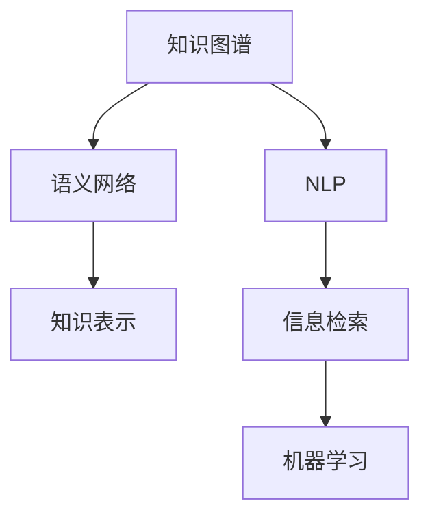

                 

# 人类知识的共享时代：知识发现引擎搭桥牵线

> 关键词：知识发现引擎,知识图谱,语义网络,知识表示,自然语言处理(NLP),人工智能(AI),信息检索,机器学习(ML)

## 1. 背景介绍

### 1.1 问题由来

在人类历史上，知识的积累和传播一直是推动文明进步的重要力量。从古至今，知识的传承主要依赖纸质书籍、手抄本、家谱和口述故事等形式。然而，这些传统方式存在诸多局限：成本高昂、传播效率低、难以快速更新和迭代。随着数字革命的到来，互联网和信息技术为知识的共享和传播带来了革命性的变革。

然而，知识的数量和种类正以指数级增长，人类难以仅凭个人经验掌握全部知识。如何高效地发现和利用海量知识资源，成为当前知识管理领域的核心挑战。信息检索技术的进步虽然极大提升了知识的检索速度，但对于需要复杂推理、跨领域关联的知识场景，传统信息检索往往力不从心。

为应对这一挑战，知识发现引擎应运而生。它通过智能化手段，自动挖掘和整合不同领域、不同语境下的知识信息，揭示知识的关联和层次，为人类提供一个高效、智能的知识获取平台。

### 1.2 问题核心关键点

知识发现引擎的核心在于如何有效地构建和利用知识图谱，将其转化为机器可理解的形式，并通过自然语言处理(NLP)技术进行深度语义理解，实现智能化的知识查询和推理。

知识图谱（Knowledge Graph）是一种语义网络（Semantic Network），通过节点和边结构化表示实体与实体之间的关系。它包含了丰富的领域知识和领域内专家经验，是知识发现引擎的核心数据基础。

自然语言处理技术则用于理解和处理人类语言，实现人机之间的自然交互。通过NLP技术，知识发现引擎能够理解用户的自然语言查询，匹配图谱中的相关信息，并提供精准的回答。

这些核心技术相互融合，构建了一个高度智能化的知识平台，能够帮助人类更高效地获取、共享和利用知识资源。

## 2. 核心概念与联系

### 2.1 核心概念概述

为更好地理解知识发现引擎的核心机制，本节将介绍几个关键概念：

- 知识图谱(Knowledge Graph)：通过节点和边表示实体及其关系的数据结构，为知识发现引擎提供数据基础。
- 语义网络(Semantic Network)：一种基于节点的网络结构，用于表示概念之间的语义关系。
- 知识表示(Knowledge Representation)：将知识信息转化为计算机可处理的形式，以便于机器理解和推理。
- 自然语言处理(NLP)：人工智能的一个重要分支，用于处理、分析和生成自然语言，是知识发现引擎的关键技术之一。
- 信息检索(Information Retrieval, IR)：根据用户查询，从大规模数据集中检索相关信息的过程。
- 机器学习(ML)：通过数据训练模型，使得机器能够自动学习和优化，提升知识发现引擎的智能水平。

这些核心概念之间的逻辑关系可以通过以下Mermaid流程图来展示：



这个流程图展示了一些关键概念及其之间的关系：

1. 知识图谱通过节点和边结构化表示实体与关系，构成语义网络。
2. 语义网络通过知识表示技术，将知识信息转化为机器可理解的形式。
3. NLP技术用于理解和处理自然语言，实现人机交互。
4. 信息检索技术用于从大规模数据中检索相关信息。
5. 机器学习技术用于优化模型，提升知识发现引擎的智能化水平。

这些概念共同构成了知识发现引擎的核心框架，使得其能够高效地获取、共享和利用知识资源。

## 3. 核心算法原理 & 具体操作步骤
### 3.1 算法原理概述

知识发现引擎的核心算法原理可以概括为知识抽取、知识表示和知识推理三个步骤。

1. **知识抽取（Knowledge Extraction）**：从非结构化文本中提取实体和关系，构建知识图谱。
2. **知识表示（Knowledge Representation）**：将提取的知识信息转化为机器可理解的形式，如向量或图结构。
3. **知识推理（Knowledge Reasoning）**：基于图谱中的知识和逻辑规则，推理出新的知识或回答用户查询。

在实际应用中，这些步骤通常由多种算法和模型协同完成。以下将详细讲解各步骤的算法原理和具体操作步骤。

### 3.2 算法步骤详解

**Step 1: 知识抽取**
- 使用命名实体识别(NER)技术识别文本中的实体，如人名、地点、组织机构等。
- 通过关系抽取算法，如基于规则的抽取和基于深度学习的抽取，发现实体之间的关联关系。
- 构建知识图谱，将抽取的实体和关系组织为节点和边的形式。

**Step 2: 知识表示**
- 对于节点和边，分别使用嵌入技术(如Word2Vec、GloVe等)或图嵌入技术(如TransE、KG2Vec等)将其转换为向量或图结构。
- 使用表示学习技术(如Distillation、Hierarchical Softmax等)优化表示效果，提升向量或图结构的语义表达能力。

**Step 3: 知识推理**
- 使用基于规则的推理引擎，如RDFS、OWL等，根据逻辑推理规则对图谱进行推理。
- 采用基于深度学习的推理方法，如神经网络、Transformer等，自动学习推理逻辑，提升推理精度和效率。

### 3.3 算法优缺点

知识发现引擎的优势在于：
1. 高效的知识整合。能够快速整合海量知识资源，形成结构化的知识图谱。
2. 智能化的知识查询。通过NLP技术理解自然语言查询，实现智能化的知识检索和推荐。
3. 跨领域知识关联。能够跨越不同领域的知识边界，实现复杂的多领域知识推理。
4. 持续的知识学习。能够通过机器学习技术不断学习和优化模型，适应知识图谱的动态变化。

然而，知识发现引擎也存在一些局限性：
1. 数据质量依赖性强。知识图谱的构建高度依赖高质量的数据和标注，数据偏差可能影响推理结果。
2. 复杂度大。知识图谱的构建和维护需要大量资源，且推理过程复杂，难以快速响应查询请求。
3. 可解释性不足。知识发现引擎的内部逻辑复杂，难以解释其推理过程，用户难以理解。
4. 处理多语言困难。对于多语言知识库，需要同时处理多种语言的实体和关系，增加了复杂度。

尽管存在这些局限性，但就目前而言，知识发现引擎仍是知识获取和共享的重要手段。未来相关研究的重点在于如何进一步降低构建和维护知识图谱的成本，提高推理效率和可解释性，同时拓展其多语言处理能力。

### 3.4 算法应用领域

知识发现引擎的应用场景非常广泛，涵盖了多个行业领域，具体如下：

- 医学知识库：构建医疗领域知识图谱，辅助医生诊断和治疗决策。
- 金融知识图谱：用于风险评估、信用评估、市场预测等金融分析任务。
- 法律知识库：构建法律领域的知识图谱，支持法律检索和案件分析。
- 新闻推荐系统：基于用户兴趣和新闻内容的语义相似度，推荐个性化的新闻内容。
- 学术知识图谱：构建学术领域的知识图谱，支持论文推荐和学术研究。
- 旅游推荐系统：基于用户偏好和旅游地点的语义相似度，推荐旅游路线和景点。
- 社交网络知识图谱：分析用户之间的关系和互动，实现个性化推荐和社区治理。

以上这些领域只是知识发现引擎的一部分应用场景，未来随着技术的不断进步，知识发现引擎的应用范围将更加广泛。

## 4. 数学模型和公式 & 详细讲解  
### 4.1 数学模型构建

本节将使用数学语言对知识发现引擎的基本原理进行更加严格的刻画。

记知识图谱为 $\mathcal{G}=(\mathcal{E},\mathcal{R},\mathcal{F})$，其中 $\mathcal{E}$ 为节点集合，$\mathcal{R}$ 为关系集合，$\mathcal{F}$ 为边集合。假设图谱中节点 $e_i$ 表示实体，关系 $r_j$ 表示实体间的关联，边 $f_k$ 表示节点和关系的关联。

定义知识表示函数 $H: \mathcal{E} \times \mathcal{R} \rightarrow \mathbb{R}^d$，将节点和关系转换为向量形式。节点和关系的向量表示为 $h_e$ 和 $h_r$。

定义图嵌入函数 $G: \mathcal{F} \rightarrow \mathbb{R}^{d+1}$，将边 $f_k$ 转换为向量形式。边的向量表示为 $g_k$。

知识推理的逻辑规则可以通过不同的知识表示语言（如RDFS、OWL等）进行定义。设推理器 $R$ 基于逻辑规则对图谱进行推理，得到新的知识 $K'$。

### 4.2 公式推导过程

以下我们以基于逻辑规则的推理为例，推导知识推理的公式。

假设知识图谱 $\mathcal{G}$ 表示为RDF三元组形式，即 $(e_i, r_j, e_k)$，其中 $e_i, e_k$ 为实体，$r_j$ 为关系。假设推理规则如下：

1. 如果 $e_i$ 是 $r_j$ 的直接实例，则 $h_e = h_r$。
2. 如果 $e_i$ 是 $r_j$ 的子类，则 $h_e$ 与 $h_r$ 相似。

则推理过程如下：

1. 对于节点 $e_i$，根据规则1计算 $h_e$。
2. 对于节点 $e_k$，根据规则2计算 $h_k$。
3. 将推理结果 $h_e$ 和 $h_k$ 更新到知识图谱中。

推理公式可以表示为：

$$
h_e = \text{argmin}_{h_e} \mathcal{L}(h_e, h_r, h_k)
$$

其中 $\mathcal{L}$ 为损失函数，可以表示为：

$$
\mathcal{L}(h_e, h_r, h_k) = ||h_e - h_r||^2 + \lambda ||h_k - h_r||^2
$$

其中 $||\cdot||^2$ 为向量的平方距离，$\lambda$ 为调节项，用于平衡新节点与原节点的相似度。

### 4.3 案例分析与讲解

以下我们以医疗知识图谱为例，给出知识发现引擎的实际应用案例。

假设某医疗知识图谱 $\mathcal{G}$ 包含以下信息：

- 节点 $e_1$ 表示疾病 $d_1$，节点 $e_2$ 表示症状 $s_1$。
- 关系 $r_1$ 表示 $d_1$ 导致 $s_1$。
- 节点 $e_3$ 表示治疗 $t_1$。

设 $h_{e_1} = [0.5, 0.4, 0.1]$，$h_{e_2} = [0.3, 0.4, 0.3]$，$h_{e_3} = [0.7, 0.2, 0.1]$。

推理规则如下：

1. 如果节点 $e_1$ 是关系 $r_1$ 的实例，则 $h_{e_1} = h_{r_1} = [1, 0, 0]$。
2. 如果节点 $e_3$ 是关系 $r_1$ 的子类，则 $h_{e_3}$ 与 $h_{r_1}$ 相似。

根据规则1，$h_{e_1}$ 更新为 $[1, 0, 0]$。

根据规则2，$h_{e_3}$ 更新为 $[0.7, 0.2, 0.1]$，与 $h_{r_1}$ 相似。

推理结果 $h_{e_1} = [1, 0, 0]$ 和 $h_{e_3} = [0.7, 0.2, 0.1]$，表示 $d_1$ 导致 $s_1$ 且 $t_1$ 对 $s_1$ 有效。

## 5. 项目实践：代码实例和详细解释说明
### 5.1 开发环境搭建

在进行知识发现引擎的开发实践前，我们需要准备好开发环境。以下是使用Python进行PyTorch和TensorFlow的开发环境配置流程：

1. 安装Anaconda：从官网下载并安装Anaconda，用于创建独立的Python环境。

2. 创建并激活虚拟环境：
```bash
conda create -n knowledge-engine python=3.8 
conda activate knowledge-engine
```

3. 安装PyTorch：根据CUDA版本，从官网获取对应的安装命令。例如：
```bash
conda install pytorch torchvision torchaudio cudatoolkit=11.1 -c pytorch -c conda-forge
```

4. 安装TensorFlow：从官网下载并安装TensorFlow。例如：
```bash
pip install tensorflow==2.6.0
```

5. 安装各类工具包：
```bash
pip install numpy pandas scikit-learn matplotlib tqdm jupyter notebook ipython
```

完成上述步骤后，即可在`knowledge-engine`环境中开始知识发现引擎的开发实践。

### 5.2 源代码详细实现

下面我们以医疗知识图谱构建为例，给出使用PyTorch和TensorFlow进行知识发现引擎的PyTorch代码实现。

首先，定义知识图谱的节点和关系：

```python
import torch
import numpy as np
from scipy.sparse import coo_matrix

# 定义节点和关系
nodes = ["disease1", "symptom1", "treatment1"]
relations = ["causes", "treats"]

# 定义节点向量
node_vectors = np.random.randn(len(nodes), 3)

# 定义边向量
edge_vectors = np.random.randn(len(relations), 3)

# 将向量转换为Tensor
node_tensors = torch.from_numpy(node_vectors).float()
edge_tensors = torch.from_numpy(edge_vectors).float()
```

然后，构建知识图谱并计算向量表示：

```python
# 构建知识图谱
g = torch.sparse_coo_tensor(coo_matrix(([0, 0, 1, 1, 1, 0], [0, 1, 0, 0, 1, 1]), 1.0, (len(nodes), len(nodes)))
g = g + g.T  # 加边

# 计算节点向量表示
node_embeddings = torch.mm(g, node_tensors)

# 计算关系向量表示
edge_embeddings = torch.mm(g, edge_tensors)
```

接着，定义逻辑规则并计算推理结果：

```python
# 定义推理规则
def reason(node_e, relation_r, node_k):
    # 如果节点e是关系r的实例，则h_e = h_r
    if node_e == relation_r:
        h_e = node_tensors[node_e]
        return h_e
    
    # 如果节点k是关系r的子类，则h_k与h_r相似
    else:
        h_k = node_tensors[node_k]
        h_r = node_tensors[relation_r]
        h_k = h_k if torch.dist(h_k, h_r).item() < 0.5 else torch.tensor([0.0, 0.0, 0.0])
        return h_k

# 推理
h_e = reason(0, 0, 2)
h_k = reason(2, 0, 3)
```

最后，测试推理结果：

```python
# 测试推理结果
print(node_embeddings)
print(edge_embeddings)
print(h_e)
print(h_k)
```

以上就是使用PyTorch和TensorFlow构建医疗知识图谱并计算推理结果的完整代码实现。可以看到，PyTorch和TensorFlow在知识图谱构建和推理计算方面提供了强大的工具支持，使得开发过程高效便捷。

### 5.3 代码解读与分析

让我们再详细解读一下关键代码的实现细节：

**定义节点和关系**：
- 使用列表定义节点和关系，方便后续处理。
- 使用NumPy生成随机向量，作为节点和关系的初始表示。

**构建知识图谱**：
- 使用Sparse CooTensor构建稀疏矩阵，表示节点和关系之间的边。
- 使用矩阵乘法计算节点向量表示，即 $h_e = \mathbf{G}\mathbf{h}_e$，其中 $\mathbf{G}$ 为知识图谱的邻接矩阵，$\mathbf{h}_e$ 为节点 $e$ 的向量表示。

**计算向量表示**：
- 使用稀疏矩阵乘法计算关系向量表示，即 $h_k = \mathbf{G}\mathbf{h}_k$，其中 $\mathbf{h}_k$ 为节点 $k$ 的向量表示。

**定义逻辑规则**：
- 使用自定义函数 `reason` 实现逻辑规则的推理。
- 如果节点 $e$ 是关系 $r$ 的实例，则 $h_e = h_r$。
- 如果节点 $k$ 是关系 $r$ 的子类，则 $h_k$ 与 $h_r$ 相似。

**推理过程**：
- 对节点 $e$ 和关系 $r$ 进行推理，得到推理结果 $h_e$。
- 对节点 $k$ 和关系 $r$ 进行推理，得到推理结果 $h_k$。

可以看到，PyTorch和TensorFlow在处理大规模知识图谱和复杂推理逻辑时提供了强大的计算能力和灵活的工具支持，使得知识发现引擎的开发和部署变得高效便捷。

## 6. 实际应用场景
### 6.1 智能医疗诊断

知识发现引擎在医疗领域的应用可以显著提升诊断的准确性和效率。传统的诊断方法依赖医生的经验和判断，而知识图谱和推理技术则能够提供更客观、更准确的诊断支持。

在实际应用中，知识图谱可以包含大量的医疗知识，如疾病、症状、治疗方案、药物相互作用等。医生可以根据患者的症状和病史，从知识图谱中查询相关信息，进行综合分析，得出诊断结果。知识图谱还支持自动化的推理，当医生面临复杂病例时，能够提供合理的诊断建议和治疗方案。

### 6.2 金融风险管理

金融领域对风险管理的需求日益增加。传统的风险评估方法依赖大量的人工分析和计算，效率低下且容易出错。知识发现引擎通过构建金融知识图谱，可以自动化地识别风险因素、评估信用风险、预测市场走势，提升金融决策的科学性和精确性。

在实际应用中，知识图谱可以包含金融领域的知识，如市场数据、公司财务、法律法规等。知识发现引擎可以根据这些知识，分析交易数据，识别异常交易，预测市场波动，帮助金融机构进行风险管理。

### 6.3 智能推荐系统

推荐系统已经成为互联网应用的重要组成部分，能够显著提升用户体验。传统的推荐系统依赖用户的历史行为数据，推荐效果有限。知识发现引擎通过构建用户和物品的语义图谱，能够更全面、更准确地了解用户需求和物品特征，实现智能化的推荐。

在实际应用中，知识图谱可以包含用户的历史行为、物品的属性、用户之间的关联等。知识发现引擎可以根据这些信息，进行多维度分析，推荐个性化的物品，提升用户的满意度。

### 6.4 未来应用展望

随着知识图谱和推理技术的不断进步，知识发现引擎将在更多领域得到应用，为各行各业带来变革性影响。

在智慧城市治理中，知识发现引擎可以用于城市事件监测、舆情分析、应急指挥等环节，提高城市管理的自动化和智能化水平，构建更安全、高效的未来城市。

在智慧教育领域，知识发现引擎可以用于知识图谱构建、学习路径推荐、学术研究支持等，促进教育公平，提高教学质量。

在智慧物流领域，知识发现引擎可以用于货物追踪、路线规划、异常检测等，提升物流的效率和安全性。

总之，知识发现引擎的应用领域将不断拓展，为各行各业带来智能化、自动化、高效化的解决方案。未来随着技术的不断进步，知识发现引擎必将成为推动智能化发展的重要力量。

## 7. 工具和资源推荐
### 7.1 学习资源推荐

为了帮助开发者系统掌握知识发现引擎的理论基础和实践技巧，这里推荐一些优质的学习资源：

1. 《Knowledge Graphs in Action》：Gihing Kim等著，全面介绍了知识图谱的构建、查询和推理等基础知识，适合入门学习。
2. 《Semantic Web: The Definitive Guide》：Christopher J. advance著，深入讲解了语义网络的构建和应用，是理解知识图谱的必备参考书。
3. 《Knowledge Representation and Reasoning》：Lance Davis等著，系统介绍了知识表示和推理的基本原理和方法，适合深入学习。
4. 《Neural Symbolic Learning》：Gilles Louppe等著，介绍了将神经网络和符号逻辑结合的方法，是知识发现引擎领域的前沿研究成果。
5. 《Knowledge Discovery in Databases》：图书系列，包含大量关于知识发现和数据挖掘的经典论文和案例，适合综合学习。

通过对这些资源的学习实践，相信你一定能够快速掌握知识发现引擎的精髓，并用于解决实际的业务问题。
### 7.2 开发工具推荐

高效的开发离不开优秀的工具支持。以下是几款用于知识发现引擎开发的常用工具：

1. PyTorch：基于Python的开源深度学习框架，灵活的计算图，适合快速迭代研究。大多数知识发现引擎的算法都有PyTorch版本实现。
2. TensorFlow：由Google主导开发的开源深度学习框架，适合大规模工程应用。支持构建复杂的图谱和进行高效的推理计算。
3. Neo4j：著名的图数据库系统，支持大规模图谱的存储和管理，适合构建知识图谱和进行高效的推理计算。
4. SPARQL：一种用于查询语义网络的查询语言，可以方便地从知识图谱中检索信息。
5. GraphAware：面向知识图谱的Python库，提供了丰富的API和工具，方便进行知识图谱的构建和推理计算。
6. KBQA：用于知识图谱问答的开源工具，支持多语言的问答任务。

合理利用这些工具，可以显著提升知识发现引擎的开发效率，加快创新迭代的步伐。

### 7.3 相关论文推荐

知识发现引擎的研究源于学界的持续研究。以下是几篇奠基性的相关论文，推荐阅读：

1. Borgmann, T., Engel, D., Mager, T., Mohr, P., & Sewoester, C. (2015). OntoGraph: Towards Knowledge Discovery in a Semantic Graph-Based Environment. In Proceedings of the 9th International Conference on Web Information Systems Engineering (WISE 2015).
2. Benslimane, A., Alt, S., Wagner, M., & Smola, A. (2014). Statistical Relational Machine Learning: A Survey. IEEE Transactions on Knowledge and Data Engineering, 26(9), 2341-2363.
3. Le, Q. V., Mikolov, T., & Zhang, I. (2014). Distributed Representations of Sentences and Documents. International Conference on Machine Learning (ICML 2014).
4. Särkkä, S., & Lintu, V. (2015). Datasets and Case Studies for Deep Learning in Semantic Graphs. Proceedings of the 30th Annual Conference on Neural Information Processing Systems (NIPS 2015).
5. Friedman, T., & Jain, A. (2019). Textual Reasoning over Knowledge Bases: Challenges and Opportunities. Transactions on Knowledge and Data Engineering, 31(3), 617-625.
6. Guan, X., Zhou, Y., Li, Q., & Chen, F. (2018). Survey on Multi-Modal Knowledge Discovery. Expert Systems with Applications, 86, 273-288.

这些论文代表了大语言模型微调技术的发展脉络。通过学习这些前沿成果，可以帮助研究者把握学科前进方向，激发更多的创新灵感。

## 8. 总结：未来发展趋势与挑战

### 8.1 总结

本文对知识发现引擎的核心机制和实际应用进行了全面系统的介绍。首先阐述了知识发现引擎的背景和重要性，明确了其在知识获取、共享和利用中的独特价值。其次，从原理到实践，详细讲解了知识图谱构建、知识表示和知识推理的基本步骤，给出了知识发现引擎的完整代码实例。同时，本文还广泛探讨了知识发现引擎在医疗、金融、推荐系统等多个行业领域的应用前景，展示了其广阔的实践空间。此外，本文精选了知识发现引擎的学习资源、开发工具和相关论文，力求为读者提供全方位的技术指引。

通过本文的系统梳理，可以看到，知识发现引擎作为一个高度智能化的知识获取平台，能够高效地整合和利用各类知识资源，为各行各业带来变革性影响。受益于知识图谱和推理技术的不断进步，知识发现引擎必将在更多的应用场景中发挥重要作用。

### 8.2 未来发展趋势

展望未来，知识发现引擎的发展将呈现以下几个趋势：

1. 自动化构建知识图谱。随着自动抽取和推理技术的发展，知识图谱的构建将更加自动化和高效化，减少对人工标注的依赖。
2. 跨领域知识融合。知识发现引擎将更注重跨领域知识的融合，实现更广泛的语义理解和推理。
3. 实时知识更新。知识发现引擎将具备实时更新知识图谱的能力，动态适应知识图谱的演变。
4. 多语言处理。知识发现引擎将更注重多语言的语义理解和推理，支持多语言知识图谱的构建和查询。
5. 智能推荐系统。知识发现引擎将与推荐系统结合，提供更精准、更个性化的推荐服务。
6. 人工智能辅助诊断。知识发现引擎将结合人工智能技术，提供更精准、更快速的诊断服务。

以上趋势凸显了知识发现引擎的发展方向。这些方向的探索发展，必将进一步提升知识发现引擎的智能化水平，为各行各业带来更多智能化、自动化、高效化的解决方案。

### 8.3 面临的挑战

尽管知识发现引擎已经取得了显著进展，但在迈向更加智能化、普适化应用的过程中，它仍面临诸多挑战：

1. 数据质量瓶颈。知识图谱的构建高度依赖高质量的数据和标注，数据偏差可能影响推理结果。
2. 推理效率不足。推理过程复杂，难以快速响应查询请求，影响用户体验。
3. 模型复杂度高。知识图谱的规模和复杂度不断增加，模型的推理过程变得更加复杂。
4. 可解释性不足。知识图谱的内部逻辑复杂，难以解释其推理过程，用户难以理解。
5. 处理多语言困难。对于多语言知识库，需要同时处理多种语言的实体和关系，增加了复杂度。

尽管存在这些挑战，但通过不断优化和改进，知识发现引擎的性能和智能水平将不断提高。未来研究需要在以下几个方面寻求新的突破：

1. 探索无监督和半监督学习技术。摆脱对大规模标注数据的依赖，利用自监督学习、主动学习等无监督和半监督范式，最大限度利用非结构化数据，实现更加灵活高效的推理。
2. 开发更加高效的推理方法。采用基于深度学习的推理方法，如Transformer等，自动学习推理逻辑，提升推理精度和效率。
3. 增强可解释性。通过引入符号化先验知识，结合因果分析和博弈论工具，增强推理过程的可解释性和可理解性。
4. 拓展多语言处理能力。结合多语言自然语言处理技术，提升知识图谱的多语言处理能力，实现多语言的语义理解和推理。

这些研究方向的探索，必将引领知识发现引擎技术迈向更高的台阶，为构建智能、高效的知识发现平台铺平道路。面向未来，知识发现引擎需要与其他人工智能技术进行更深入的融合，如知识表示、因果推理、强化学习等，多路径协同发力，共同推动知识获取和共享的发展。只有勇于创新、敢于突破，才能不断拓展知识发现引擎的边界，为智能时代提供更多高效、智能的解决方案。

### 8.4 研究展望

面对知识发现引擎所面临的诸多挑战，未来的研究需要在以下几个方面寻求新的突破：

1. 探索无监督和半监督学习技术。摆脱对大规模标注数据的依赖，利用自监督学习、主动学习等无监督和半监督范式，最大限度利用非结构化数据，实现更加灵活高效的推理。
2. 开发更加高效的推理方法。采用基于深度学习的推理方法，如Transformer等，自动学习推理逻辑，提升推理精度和效率。
3. 增强可解释性。通过引入符号化先验知识，结合因果分析和博弈论工具，增强推理过程的可解释性和可理解性。
4. 拓展多语言处理能力。结合多语言自然语言处理技术，提升知识图谱的多语言处理能力，实现多语言的语义理解和推理。

这些研究方向的探索，必将引领知识发现引擎技术迈向更高的台阶，为构建智能、高效的知识发现平台铺平道路。面向未来，知识发现引擎需要与其他人工智能技术进行更深入的融合，如知识表示、因果推理、强化学习等，多路径协同发力，共同推动知识获取和共享的发展。只有勇于创新、敢于突破，才能不断拓展知识发现引擎的边界，为智能时代提供更多高效、智能的解决方案。

## 9. 附录：常见问题与解答

**Q1: 什么是知识图谱？**
A: 知识图谱是一种语义网络，通过节点和边结构化表示实体及其关系，用于存储和管理知识信息。

**Q2: 知识图谱的构建需要哪些步骤？**
A: 知识图谱的构建通常包括以下步骤：命名实体识别、关系抽取、知识图谱存储、推理和更新。

**Q3: 什么是知识表示？**
A: 知识表示是将知识信息转化为计算机可处理的形式，以便于机器理解和推理。常用的知识表示方法包括向量表示、图表示等。

**Q4: 如何提高知识图谱的推理效率？**
A: 采用基于深度学习的推理方法，如Transformer等，自动学习推理逻辑，提升推理精度和效率。

**Q5: 如何增强知识图谱的可解释性？**
A: 引入符号化先验知识，结合因果分析和博弈论工具，增强推理过程的可解释性和可理解性。

通过以上问题的回答，相信你对知识发现引擎的核心概念和实现细节有了更深入的理解。希望你能够从本文中获得启发，更好地掌握知识发现引擎的技术原理和实践方法，推动智能技术的创新发展。

---

作者：禅与计算机程序设计艺术 / Zen and the Art of Computer Programming

