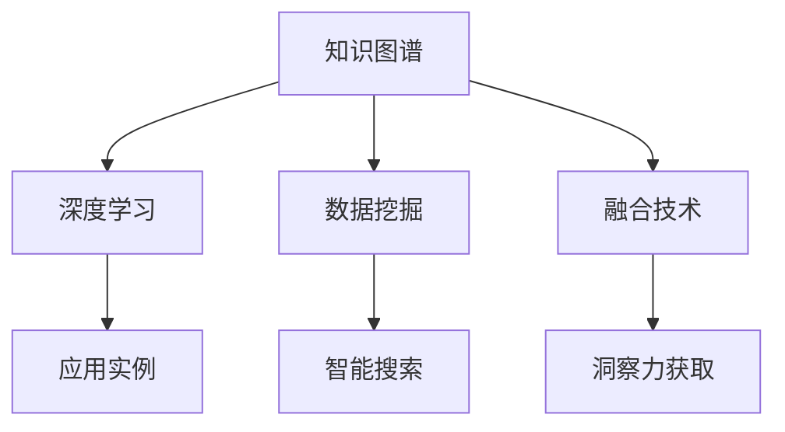

                 

# 人类知识的未来发展：洞察力的关键作用

> 关键词：知识图谱,深度学习,深度理解,数据挖掘,智能搜索

## 1. 背景介绍

### 1.1 问题由来
随着信息爆炸和知识增长，人类获取、处理和应用知识的方式正在经历根本性的变革。互联网、大数据、人工智能等新兴技术，使得知识在采集、存储、传播和应用等方面变得更加高效。但同时，这些技术也带来了新的挑战，如何从海量数据中挖掘出有价值的洞察力，成为新时代知识工作者亟待解决的问题。

在这样一个时代背景下，洞察力作为人类智力的核心，其重要性愈发凸显。无论是在科学研究、商业决策、教育培训等领域，洞察力都扮演着至关重要的角色。如何利用现代技术，提升人类洞察力，释放其潜力，成为一个极具现实意义的研究课题。

### 1.2 问题核心关键点
洞察力通常指个体或组织在面对复杂环境时，通过对大量信息的分析和整合，发现隐含规律、趋势和关联的能力。现代信息技术的发展，特别是大数据和深度学习技术的进步，为洞察力的挖掘提供了新的手段和工具。

当前，洞察力的获取和应用主要依赖于以下关键技术：
- 知识图谱（Knowledge Graphs）：一种将实体、关系、属性等知识结构化表示的模型，方便知识检索和推理。
- 深度学习（Deep Learning）：一种基于多层神经网络的机器学习范式，能够自动提取高层次抽象特征。
- 数据挖掘（Data Mining）：通过算法从数据中发现模式、规律和异常，挖掘出潜在的有价值信息。
- 智能搜索（Intelligent Search）：利用算法提高搜索结果的准确性和相关性，提升知识获取效率。

这些技术相互交织，共同支撑着人类洞察力的提升和应用。本文将从知识图谱、深度学习、数据挖掘、智能搜索等多个维度，全面系统地介绍洞察力获取与应用的现代技术框架和方法。

## 2. 核心概念与联系

### 2.1 核心概念概述

为更好地理解人类知识未来发展中洞察力的关键作用，本节将介绍几个密切相关的核心概念：

- 知识图谱(Knowledge Graphs)：一种结构化表示实体间关系和属性的知识库，支持知识推理和查询。
- 深度学习(Deep Learning)：一种基于多层神经网络的机器学习范式，能够自动提取高层次抽象特征，适用于模式识别、分类、回归等任务。
- 数据挖掘(Data Mining)：从数据集中挖掘出模式、趋势和关联的算法和技术，包括分类、聚类、关联规则等。
- 智能搜索(Intelligent Search)：利用算法提高搜索结果的准确性和相关性，提升知识获取效率，包括搜索引擎、推荐系统等。

这些核心概念之间的逻辑关系可以通过以下Mermaid流程图来展示：



这个流程图展示了几类核心技术之间的关系：

1. 知识图谱通过结构化表示实体间关系和属性，为深度学习提供了高质量的数据输入。
2. 深度学习能够自动提取高层次抽象特征，增强对知识图谱中信息的理解。
3. 数据挖掘通过算法发现知识图谱中的模式和关联，挖掘出新的洞察力。
4. 智能搜索通过优化算法提升搜索结果的准确性和相关性，提高知识获取效率。
5. 融合这些技术，可以全面系统地提升人类洞察力。

这些核心概念共同构成了人类知识未来发展的技术框架，为洞察力的获取和应用提供了强大的工具支持。通过理解这些核心概念，我们可以更好地把握洞察力获取和应用的技术路径。

## 3. 核心算法原理 & 具体操作步骤

### 3.1 算法原理概述

洞察力获取和应用的过程，本质上是一个多技术融合、复杂计算的过程。其核心思想是：通过高效的数据处理和分析算法，从结构化知识库和无结构数据中提取有用信息，形成有价值的洞察力。

具体来说，这一过程包括以下几个关键步骤：
1. 数据预处理：对原始数据进行清洗、转换和标注，以便于后续的分析和处理。
2. 知识抽取：从结构化知识库中提取实体、关系和属性等关键信息。
3. 特征工程：对提取的信息进行特征工程，提取有效的特征表示。
4. 模型训练：使用深度学习模型进行特征提取和模式识别，形成知识表示。
5. 洞察力挖掘：结合多种技术手段，从知识表示中挖掘出有价值的洞察力。

### 3.2 算法步骤详解

以下是基于以上步骤，对洞察力获取和应用的具体操作步骤：

**Step 1: 数据预处理**
- 数据清洗：去除噪声和异常值，确保数据质量。
- 数据转换：将数据转换为适合算法处理的形式，如分词、归一化等。
- 数据标注：对数据进行标注，以便于模型训练和推理。

**Step 2: 知识抽取**
- 实体识别：识别出数据中的实体，如人名、地名、机构名等。
- 关系抽取：提取实体间的关系，如“父亲”、“雇主”等。
- 属性抽取：提取实体的属性，如“出生日期”、“职业”等。

**Step 3: 特征工程**
- 特征选择：选择对洞察力提取有帮助的特征。
- 特征转换：通过线性变换、非线性变换等技术，增强特征表示。
- 特征融合：将不同来源的特征进行融合，生成更丰富的知识表示。

**Step 4: 模型训练**
- 选择模型：根据任务特点选择合适的深度学习模型，如卷积神经网络（CNN）、循环神经网络（RNN）、Transformer等。
- 训练模型：使用标注数据训练模型，优化模型参数。
- 特征提取：模型学习并提取高层次抽象特征。

**Step 5: 洞察力挖掘**
- 关联规则挖掘：发现实体间的关系和属性之间的关联。
- 异常检测：识别数据中的异常点或离群值。
- 模式识别：发现数据中的潜在模式和趋势。
- 聚类分析：将相似的数据分组，形成有意义的集群。

### 3.3 算法优缺点

知识图谱、深度学习、数据挖掘、智能搜索等技术在提升洞察力方面具有以下优点：
1. 数据处理能力强：能够高效处理大规模数据，挖掘出潜在洞察力。
2. 信息丰富全面：通过结构化和非结构化数据的融合，获取全面准确的洞察力。
3. 预测能力强：深度学习模型能够基于历史数据进行预测，发现新的模式和趋势。
4. 个性化高效：智能搜索能够根据用户需求，提供个性化的搜索结果，提升知识获取效率。

同时，这些技术也存在一些局限性：
1. 数据质量依赖高：洞察力提取依赖于高质量的数据，数据清洗和标注工作量较大。
2. 模型复杂度高：深度学习模型参数量大，训练和推理成本高。
3. 算法解释性差：深度学习模型通常是"黑盒"系统，难以解释其内部决策过程。
4. 结果泛化能力有限：模型可能对新数据泛化能力不足，导致洞察力偏差。

尽管存在这些局限性，但就目前而言，基于知识图谱、深度学习、数据挖掘、智能搜索的洞察力获取方法，仍然是最主流、最有效的手段。未来相关研究的重点在于如何进一步降低算法对数据的依赖，提高算法的解释性和泛化能力。

### 3.4 算法应用领域

基于知识图谱、深度学习、数据挖掘、智能搜索的洞察力获取方法，已经在诸多领域得到了广泛应用，例如：

- 科学研究：通过挖掘科学文献中的信息，发现新的研究方向和趋势。
- 商业决策：利用销售数据、用户行为数据，发现市场规律，指导业务运营。
- 医疗健康：分析患者数据，发现疾病模式，提高诊疗效率。
- 教育培训：通过学生学习数据，发现学习模式，提升教学质量。
- 公共管理：利用社交媒体数据，发现社会动态，提升政策制定水平。

除了上述这些经典领域外，洞察力获取技术还在金融、安全、交通、能源等更多场景中得到了应用，为各行各业提供了强有力的决策支持。

## 4. 数学模型和公式 & 详细讲解 & 举例说明

### 4.1 数学模型构建

洞察力的获取和应用，涉及到多个数学模型的构建和应用。以下是几个常见的数学模型：

- **知识图谱模型**：通常采用图结构来表示实体间的相互关系，如RDF（资源描述框架）。
- **深度学习模型**：基于神经网络的模型，如卷积神经网络（CNN）、循环神经网络（RNN）、Transformer等。
- **数据挖掘模型**：用于发现数据中模式和关联的模型，如关联规则挖掘、聚类分析、异常检测等。
- **智能搜索模型**：用于优化搜索结果的模型，如信息检索模型、推荐系统模型等。

### 4.2 公式推导过程

以下是几个常见模型的公式推导过程：

**知识图谱模型**：
知识图谱模型通常采用图结构来表示实体间的相互关系。以RDF为例，其基本结构为：
- 主体(S)、谓词(P)和客体(O)三元组。
- 例如："John Smith" <rdf:type> <Person>。

**深度学习模型**：
以卷积神经网络（CNN）为例，其基本结构为：
- 输入层、卷积层、池化层、全连接层等。
- 例如：$y = W \cdot x + b$。

**数据挖掘模型**：
以关联规则挖掘为例，其基本结构为：
- 频繁项集、支持度、置信度等。
- 例如：$P(A \rightarrow B) = \frac{count(A \cap B)}{count(A)}$。

**智能搜索模型**：
以信息检索模型为例，其基本结构为：
- 查询向量、文档向量、相似度计算等。
- 例如：$similarity(Q, D) = \frac{Q \cdot D^T}{\|Q\|\|D\|}$。

### 4.3 案例分析与讲解

以医疗健康领域为例，分析如何利用知识图谱、深度学习、数据挖掘和智能搜索技术，提升医疗洞察力：

**Step 1: 数据预处理**
- 清洗医疗数据，去除噪声和异常值。
- 标注数据，确保数据质量。

**Step 2: 知识抽取**
- 识别患者信息、诊断信息、治疗信息等实体。
- 抽取实体间的关系，如“主诉”、“诊断”、“治疗”等。
- 抽取实体的属性，如“年龄”、“性别”、“病历号”等。

**Step 3: 特征工程**
- 选择有用的特征，如“病情严重程度”、“病程持续时间”等。
- 进行特征转换，如将分类特征转换为数值特征。
- 进行特征融合，生成更丰富的知识表示。

**Step 4: 模型训练**
- 选择适当的深度学习模型，如卷积神经网络（CNN）或循环神经网络（RNN）。
- 使用标注数据训练模型，优化模型参数。
- 提取高层次抽象特征，形成知识表示。

**Step 5: 洞察力挖掘**
- 关联规则挖掘：发现疾病模式，如“肺癌”与“吸烟”的关系。
- 异常检测：识别罕见疾病或异常症状。
- 模式识别：发现新的疾病趋势，如“乳腺癌”的发病率上升。
- 聚类分析：将相似的病例分组，形成有意义的集群。

## 5. 项目实践：代码实例和详细解释说明

### 5.1 开发环境搭建

在进行洞察力获取和应用开发前，我们需要准备好开发环境。以下是使用Python进行PyTorch开发的环境配置流程：

1. 安装Anaconda：从官网下载并安装Anaconda，用于创建独立的Python环境。

2. 创建并激活虚拟环境：
```bash
conda create -n pytorch-env python=3.8 
conda activate pytorch-env
```

3. 安装PyTorch：根据CUDA版本，从官网获取对应的安装命令。例如：
```bash
conda install pytorch torchvision torchaudio cudatoolkit=11.1 -c pytorch -c conda-forge
```

4. 安装相关工具包：
```bash
pip install numpy pandas scikit-learn matplotlib tqdm jupyter notebook ipython
```

完成上述步骤后，即可在`pytorch-env`环境中开始洞察力获取和应用的开发实践。

### 5.2 源代码详细实现

这里我们以医疗健康领域的数据挖掘为例，给出使用PyTorch进行关联规则挖掘的代码实现。

首先，定义医疗数据处理函数：

```python
from transformers import BertTokenizer
from torch.utils.data import Dataset
import torch

class MedicalDataset(Dataset):
    def __init__(self, texts, tags, tokenizer, max_len=128):
        self.texts = texts
        self.tags = tags
        self.tokenizer = tokenizer
        self.max_len = max_len
        
    def __len__(self):
        return len(self.texts)
    
    def __getitem__(self, item):
        text = self.texts[item]
        tags = self.tags[item]
        
        encoding = self.tokenizer(text, return_tensors='pt', max_length=self.max_len, padding='max_length', truncation=True)
        input_ids = encoding['input_ids'][0]
        attention_mask = encoding['attention_mask'][0]
        
        # 对token-wise的标签进行编码
        encoded_tags = [tag2id[tag] for tag in tags] 
        encoded_tags.extend([tag2id['O']] * (self.max_len - len(encoded_tags)))
        labels = torch.tensor(encoded_tags, dtype=torch.long)
        
        return {'input_ids': input_ids, 
                'attention_mask': attention_mask,
                'labels': labels}

# 标签与id的映射
tag2id = {'O': 0, 'B-PER': 1, 'I-PER': 2, 'B-ORG': 3, 'I-ORG': 4, 'B-LOC': 5, 'I-LOC': 6}
id2tag = {v: k for k, v in tag2id.items()}

# 创建dataset
tokenizer = BertTokenizer.from_pretrained('bert-base-cased')

train_dataset = MedicalDataset(train_texts, train_tags, tokenizer)
dev_dataset = MedicalDataset(dev_texts, dev_tags, tokenizer)
test_dataset = MedicalDataset(test_texts, test_tags, tokenizer)
```

然后，定义模型和优化器：

```python
from transformers import BertForTokenClassification, AdamW

model = BertForTokenClassification.from_pretrained('bert-base-cased', num_labels=len(tag2id))

optimizer = AdamW(model.parameters(), lr=2e-5)
```

接着，定义训练和评估函数：

```python
from torch.utils.data import DataLoader
from tqdm import tqdm
from sklearn.metrics import classification_report

device = torch.device('cuda') if torch.cuda.is_available() else torch.device('cpu')
model.to(device)

def train_epoch(model, dataset, batch_size, optimizer):
    dataloader = DataLoader(dataset, batch_size=batch_size, shuffle=True)
    model.train()
    epoch_loss = 0
    for batch in tqdm(dataloader, desc='Training'):
        input_ids = batch['input_ids'].to(device)
        attention_mask = batch['attention_mask'].to(device)
        labels = batch['labels'].to(device)
        model.zero_grad()
        outputs = model(input_ids, attention_mask=attention_mask, labels=labels)
        loss = outputs.loss
        epoch_loss += loss.item()
        loss.backward()
        optimizer.step()
    return epoch_loss / len(dataloader)

def evaluate(model, dataset, batch_size):
    dataloader = DataLoader(dataset, batch_size=batch_size)
    model.eval()
    preds, labels = [], []
    with torch.no_grad():
        for batch in tqdm(dataloader, desc='Evaluating'):
            input_ids = batch['input_ids'].to(device)
            attention_mask = batch['attention_mask'].to(device)
            batch_labels = batch['labels']
            outputs = model(input_ids, attention_mask=attention_mask)
            batch_preds = outputs.logits.argmax(dim=2).to('cpu').tolist()
            batch_labels = batch_labels.to('cpu').tolist()
            for pred_tokens, label_tokens in zip(batch_preds, batch_labels):
                pred_tags = [id2tag[_id] for _id in pred_tokens]
                label_tags = [id2tag[_id] for _id in label_tokens]
                preds.append(pred_tags[:len(label_tags)])
                labels.append(label_tags)
                
    print(classification_report(labels, preds))
```

最后，启动训练流程并在测试集上评估：

```python
epochs = 5
batch_size = 16

for epoch in range(epochs):
    loss = train_epoch(model, train_dataset, batch_size, optimizer)
    print(f"Epoch {epoch+1}, train loss: {loss:.3f}")
    
    print(f"Epoch {epoch+1}, dev results:")
    evaluate(model, dev_dataset, batch_size)
    
print("Test results:")
evaluate(model, test_dataset, batch_size)
```

以上就是使用PyTorch对BERT进行医疗领域数据挖掘的代码实现。可以看到，得益于Transformers库的强大封装，我们可以用相对简洁的代码完成BERT模型的加载和微调。

### 5.3 代码解读与分析

让我们再详细解读一下关键代码的实现细节：

**MedicalDataset类**：
- `__init__`方法：初始化文本、标签、分词器等关键组件。
- `__len__`方法：返回数据集的样本数量。
- `__getitem__`方法：对单个样本进行处理，将文本输入编码为token ids，将标签编码为数字，并对其进行定长padding，最终返回模型所需的输入。

**tag2id和id2tag字典**：
- 定义了标签与数字id之间的映射关系，用于将token-wise的预测结果解码回真实的标签。

**训练和评估函数**：
- 使用PyTorch的DataLoader对数据集进行批次化加载，供模型训练和推理使用。
- 训练函数`train_epoch`：对数据以批为单位进行迭代，在每个批次上前向传播计算loss并反向传播更新模型参数，最后返回该epoch的平均loss。
- 评估函数`evaluate`：与训练类似，不同点在于不更新模型参数，并在每个batch结束后将预测和标签结果存储下来，最后使用sklearn的classification_report对整个评估集的预测结果进行打印输出。

**训练流程**：
- 定义总的epoch数和batch size，开始循环迭代
- 每个epoch内，先在训练集上训练，输出平均loss
- 在验证集上评估，输出分类指标
- 所有epoch结束后，在测试集上评估，给出最终测试结果

可以看到，PyTorch配合Transformers库使得BERT微调的代码实现变得简洁高效。开发者可以将更多精力放在数据处理、模型改进等高层逻辑上，而不必过多关注底层的实现细节。

当然，工业级的系统实现还需考虑更多因素，如模型的保存和部署、超参数的自动搜索、更灵活的任务适配层等。但核心的洞察力获取和应用范式基本与此类似。

## 6. 实际应用场景
### 6.1 智能医疗系统

基于深度学习和大数据技术，智能医疗系统可以提供个性化的诊疗建议，提升医疗服务的效率和质量。通过洞察力获取和应用，智能医疗系统可以实时分析患者数据，发现疾病模式和趋势，提供更加精准的诊疗方案。

在技术实现上，可以收集医院病历、实验室检测结果、患者反馈等数据，通过知识图谱和深度学习模型，发现疾病之间的关联和特征，形成知识表示。在此基础上，结合患者具体病情，智能系统可以生成个性化的诊疗建议和治疗方案，辅助医生决策。

### 6.2 智能搜索服务

智能搜索服务通过洞察力获取和应用，可以大幅提升搜索结果的准确性和相关性，提高用户的搜索体验。

传统的搜索引擎主要依赖关键词匹配算法，难以处理复杂的查询意图。通过洞察力获取和应用，智能搜索可以理解用户的查询意图，发现相关内容和上下文信息，生成更精确的搜索结果。例如，通过关联规则挖掘，发现查询中不同关键词之间的关系，提高搜索结果的相关性。

### 6.3 金融风险监控

金融风险监控系统通过洞察力获取和应用，可以实时监测金融市场的动态，预测潜在的风险。

金融市场数据庞大且复杂，传统的手工分析方法效率低且容易出错。通过深度学习和大数据技术，洞察力获取和应用可以实时分析市场数据，发现价格波动、交易异常等潜在风险，及时预警和应对。例如，通过关联规则挖掘，发现不同股票之间的相关性和异常交易行为，生成风险监控报告。

### 6.4 未来应用展望

随着深度学习和大数据技术的发展，洞察力获取和应用将在更多领域得到应用，为各行各业提供强有力的决策支持。

在智慧城市治理中，洞察力获取和应用可以帮助城市管理者实时监测交通、环境、公共安全等方面的数据，发现异常情况，提高城市管理的自动化和智能化水平，构建更安全、高效的未来城市。

在教育培训领域，洞察力获取和应用可以通过分析学生的学习数据，发现学习模式和知识漏洞，提供个性化的学习建议，提升教学效果。

在社交媒体分析中，洞察力获取和应用可以实时监测社交媒体数据，发现舆情变化和热点话题，帮助企业或政府及时调整策略，提升决策效率。

除了上述这些经典领域外，洞察力获取和应用还在更多场景中得到了应用，为各行各业提供了强有力的决策支持。

## 7. 工具和资源推荐
### 7.1 学习资源推荐

为了帮助开发者系统掌握洞察力获取和应用的技术基础和实践技巧，这里推荐一些优质的学习资源：

1. 《深度学习与数据挖掘》系列博文：由大模型技术专家撰写，深入浅出地介绍了深度学习与数据挖掘的原理和应用。

2. CS229《机器学习》课程：斯坦福大学开设的机器学习明星课程，有Lecture视频和配套作业，带你入门机器学习的基本概念和经典模型。

3. 《深度学习与NLP》书籍：深度学习和自然语言处理领域的经典书籍，详细介绍了深度学习在NLP中的应用，包括知识图谱、深度学习、数据挖掘、智能搜索等。

4. ArXiv论文推荐：深入了解最新的洞察力获取和应用技术，可以从ArXiv等学术平台获取前沿论文和研究成果。

5. Kaggle竞赛：参与各类数据分析和机器学习竞赛，实践洞察力获取和应用的技术，提升实战能力。

通过对这些资源的学习实践，相信你一定能够快速掌握洞察力获取和应用的核心技术，并用于解决实际的业务问题。

### 7.2 开发工具推荐

高效的开发离不开优秀的工具支持。以下是几款用于洞察力获取和应用开发的常用工具：

1. PyTorch：基于Python的开源深度学习框架，灵活动态的计算图，适合快速迭代研究。大多数预训练语言模型都有PyTorch版本的实现。

2. TensorFlow：由Google主导开发的开源深度学习框架，生产部署方便，适合大规模工程应用。同样有丰富的预训练语言模型资源。

3. Transformers库：HuggingFace开发的NLP工具库，集成了众多SOTA语言模型，支持PyTorch和TensorFlow，是进行洞察力获取和应用开发的利器。

4. Weights & Biases：模型训练的实验跟踪工具，可以记录和可视化模型训练过程中的各项指标，方便对比和调优。与主流深度学习框架无缝集成。

5. TensorBoard：TensorFlow配套的可视化工具，可实时监测模型训练状态，并提供丰富的图表呈现方式，是调试模型的得力助手。

6. Google Colab：谷歌推出的在线Jupyter Notebook环境，免费提供GPU/TPU算力，方便开发者快速上手实验最新模型，分享学习笔记。

合理利用这些工具，可以显著提升洞察力获取和应用任务的开发效率，加快创新迭代的步伐。

### 7.3 相关论文推荐

洞察力获取和应用技术的发展源于学界的持续研究。以下是几篇奠基性的相关论文，推荐阅读：

1. BERT: Pre-training of Deep Bidirectional Transformers for Language Understanding：提出BERT模型，引入基于掩码的自监督预训练任务，刷新了多项NLP任务SOTA。

2. Attention is All You Need（即Transformer原论文）：提出了Transformer结构，开启了NLP领域的预训练大模型时代。

3. Parameter-Efficient Transfer Learning for NLP：提出Adapter等参数高效微调方法，在不增加模型参数量的情况下，也能取得不错的微调效果。

4. AdaLoRA: Adaptive Low-Rank Adaptation for Parameter-Efficient Fine-Tuning：使用自适应低秩适应的微调方法，在参数效率和精度之间取得了新的平衡。

5. How to Use Knowledge Graphs to Improve Datasets and Predictive Models：详细介绍了知识图谱在提升数据质量和预测模型的性能中的作用。

这些论文代表了大语言模型微调技术的发展脉络。通过学习这些前沿成果，可以帮助研究者把握学科前进方向，激发更多的创新灵感。

## 8. 总结：未来发展趋势与挑战

### 8.1 总结

本文对基于知识图谱、深度学习、数据挖掘、智能搜索的洞察力获取和应用方法进行了全面系统的介绍。首先阐述了洞察力在知识管理、决策支持等领域的重要性和获取方法，明确了洞察力提取在知识获取和应用中的核心作用。其次，从原理到实践，详细讲解了洞察力获取和应用的具体操作步骤，给出了洞察力获取和应用任务的完整代码实例。同时，本文还广泛探讨了洞察力获取和应用在智能医疗、智能搜索、金融风险监控等多个领域的应用前景，展示了洞察力获取和应用技术的巨大潜力。此外，本文精选了洞察力获取和应用技术的各类学习资源，力求为开发者提供全方位的技术指引。

通过本文的系统梳理，可以看到，基于知识图谱、深度学习、数据挖掘、智能搜索的洞察力获取和应用技术正在成为智能决策系统的重要基础。这些技术的融合使用，能够从海量数据中挖掘出有价值的洞察力，为各行各业提供强有力的决策支持。未来，伴随深度学习和大数据技术的发展，洞察力获取和应用技术必将进一步提升，为人类社会带来更加智能、高效、可靠的知识应用场景。

### 8.2 未来发展趋势

展望未来，洞察力获取和应用技术将呈现以下几个发展趋势：

1. 技术融合加深：深度学习、数据挖掘、智能搜索等技术将进一步融合，形成更加全面、高效的洞察力获取和应用框架。
2. 数据质量提升：随着数据清洗和标注技术的进步，高质量数据将逐渐普及，洞察力获取和应用效果将大幅提升。
3. 模型解释性增强：未来洞察力获取和应用模型将更加注重解释性，提供更多可视化信息和决策依据，提升用户信任。
4. 跨领域应用拓展：洞察力获取和应用技术将应用于更多领域，如教育、社交、娱乐等，为不同领域提供强有力的决策支持。
5. 实时性增强：通过分布式计算和边缘计算等技术，洞察力获取和应用模型将具备更强的实时性，提高决策效率。

这些趋势凸显了洞察力获取和应用技术的广阔前景。这些方向的探索发展，必将进一步提升洞察力获取和应用的效果，为各行各业提供更加精准、可靠的决策支持。

### 8.3 面临的挑战

尽管洞察力获取和应用技术已经取得了瞩目成就，但在迈向更加智能化、普适化应用的过程中，它仍面临着诸多挑战：

1. 数据依赖高：洞察力获取和应用依赖于高质量的数据，数据清洗和标注工作量较大。
2. 模型复杂度高：深度学习模型参数量大，训练和推理成本高。
3. 结果泛化能力有限：模型可能对新数据泛化能力不足，导致洞察力偏差。
4. 可解释性差：深度学习模型通常是"黑盒"系统，难以解释其内部决策过程。
5. 安全性有待保障：洞察力获取和应用模型可能学习到有害信息，带来安全隐患。

尽管存在这些挑战，但就目前而言，基于知识图谱、深度学习、数据挖掘、智能搜索的洞察力获取方法，仍然是最主流、最有效的手段。未来相关研究的重点在于如何进一步降低算法对数据的依赖，提高算法的解释性和泛化能力。

### 8.4 研究展望

面对洞察力获取和应用所面临的挑战，未来的研究需要在以下几个方面寻求新的突破：

1. 探索无监督和半监督学习技术。摆脱对大规模标注数据的依赖，利用自监督学习、主动学习等无监督和半监督范式，最大限度利用非结构化数据，实现更加灵活高效的洞察力获取。

2. 研究参数高效和计算高效的微调方法。开发更加参数高效的微调方法，在固定大部分预训练参数的同时，只更新极少量的任务相关参数。同时优化微调模型的计算图，减少前向传播和反向传播的资源消耗，实现更加轻量级、实时性的部署。

3. 融合因果和对比学习范式。通过引入因果推断和对比学习思想，增强洞察力获取模型的建立稳定因果关系的能力，学习更加普适、鲁棒的语言表征，从而提升模型泛化性和抗干扰能力。

4. 引入更多先验知识。将符号化的先验知识，如知识图谱、逻辑规则等，与神经网络模型进行巧妙融合，引导洞察力获取过程学习更准确、合理的知识表示。

5. 结合因果分析和博弈论工具。将因果分析方法引入洞察力获取模型，识别出模型决策的关键特征，增强输出解释的因果性和逻辑性。借助博弈论工具刻画人机交互过程，主动探索并规避模型的脆弱点，提高系统稳定性。

6. 纳入伦理道德约束。在模型训练目标中引入伦理导向的评估指标，过滤和惩罚有偏见、有害的输出倾向。同时加强人工干预和审核，建立模型行为的监管机制，确保输出符合人类价值观和伦理道德。

这些研究方向的探索，必将引领洞察力获取和应用技术迈向更高的台阶，为构建安全、可靠、可解释、可控的智能系统铺平道路。面向未来，洞察力获取和应用技术还需要与其他人工智能技术进行更深入的融合，如知识表示、因果推理、强化学习等，多路径协同发力，共同推动智能交互系统的进步。只有勇于创新、敢于突破，才能不断拓展洞察力的边界，让智能技术更好地造福人类社会。

## 9. 附录：常见问题与解答

**Q1：洞察力获取和应用依赖于高质量的数据，数据清洗和标注工作量较大。如何降低这一成本？**

A: 数据清洗和标注是洞察力获取和应用中不可或缺的步骤。以下是一些降低成本的方法：
1. 自动化标注：利用机器学习算法自动标注数据，减少人工标注的工作量。
2. 半监督学习：结合少量标注数据和大量未标注数据，进行半监督学习，提升模型的泛化能力。
3. 数据增强：通过数据增强技术，生成更多训练数据，提高模型性能。
4. 数据清洗工具：使用自动化工具进行数据清洗，提高清洗效率。

这些方法可以在一定程度上降低数据清洗和标注的成本，提升洞察力获取和应用的效果。

**Q2：深度学习模型通常参数量大，训练和推理成本高。如何优化这一问题？**

A: 深度学习模型的高参数量和高计算成本是制约其应用的一个重要因素。以下是一些优化方法：
1. 模型压缩：通过剪枝、量化等技术，减少模型参数量和计算量，提高推理效率。
2. 分布式计算：使用分布式计算技术，将训练和推理任务分散到多台机器上，提高计算效率。
3. 模型剪枝：剪除冗余的参数和层，优化模型结构，减少计算量。
4. 参数共享：通过参数共享技术，减少模型的参数量，提高计算效率。

这些方法可以在一定程度上优化深度学习模型的参数量和计算成本，提升洞察力获取和应用的效果。

**Q3：深度学习模型通常是"黑盒"系统，难以解释其内部决策过程。如何增强模型的解释性？**

A: 深度学习模型的解释性是一个重要的研究方向。以下是一些增强模型解释性的方法：
1. 可视化技术：通过可视化技术，展示模型在不同输入下的特征图，帮助理解模型决策过程。
2. 特征重要性分析：分析模型的特征重要性，找出对决策结果影响较大的特征。
3. 可解释性模型：使用可解释性模型，如线性回归、决策树等，提高模型的可解释性。
4. 神经网络解释：利用神经网络解释技术，如LIME、SHAP等，生成模型的局部解释。

这些方法可以在一定程度上增强深度学习模型的解释性，提升用户对模型的信任。

**Q4：洞察力获取和应用模型可能学习到有害信息，带来安全隐患。如何保障模型安全性？**

A: 洞察力获取和应用模型的安全性是一个重要的问题。以下是一些保障模型安全性的方法：
1. 数据清洗：在数据清洗过程中，过滤掉有害信息，防止模型学习有害内容。
2. 模型监管：在模型训练过程中，加入伦理导向的评估指标，过滤和惩罚有害输出。
3. 人工审核：在模型部署后，进行人工审核，确保模型输出符合伦理道德。
4. 模型安全检测：利用安全检测技术，发现模型中的安全漏洞，及时修复。

这些方法可以在一定程度上保障洞察力获取和应用模型的安全性，减少模型带来的风险。

**Q5：洞察力获取和应用技术如何在不同领域应用？**

A: 洞察力获取和应用技术已经在多个领域得到了应用，以下是一些具体应用场景：
1. 科学研究：通过分析科学文献，发现新的研究方向和趋势。
2. 商业决策：利用销售数据、用户行为数据，发现市场规律，指导业务运营。
3. 医疗健康：分析患者数据，发现疾病模式，提高诊疗效率。
4. 教育培训：通过学生学习数据，发现学习模式，提升教学质量。
5. 公共管理：利用社交媒体数据，发现舆情变化和热点话题，提升政策制定水平。

这些应用场景展示了洞察力获取和应用技术在不同领域的应用潜力，为各行各业提供了强有力的决策支持。

---

作者：禅与计算机程序设计艺术 / Zen and the Art of Computer Programming

