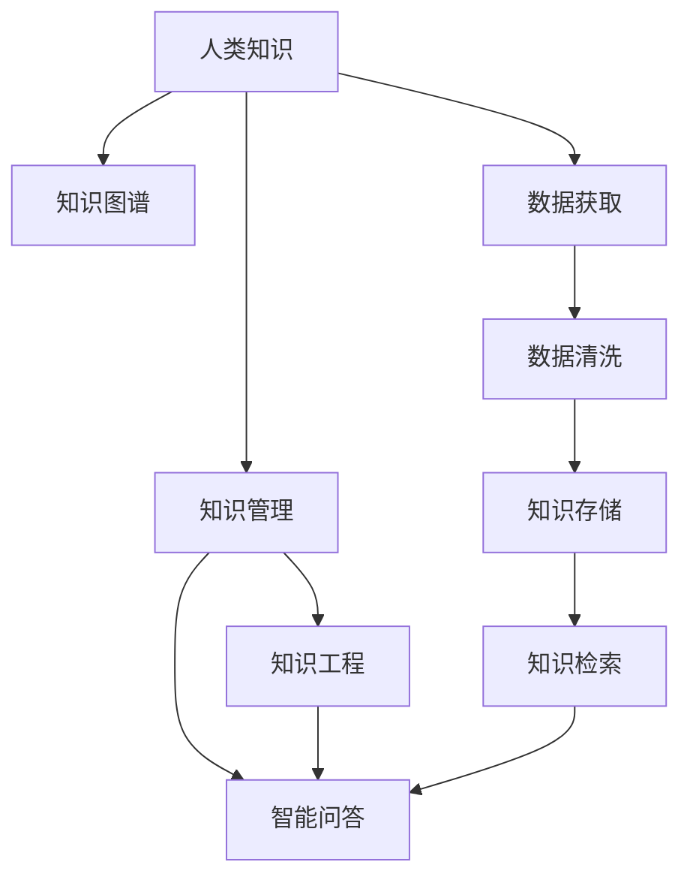

                 

# 人类知识的未来展望：洞察力引领知识革命

> 关键词：人类知识,未来展望,洞察力,知识革命,人工智能,知识图谱,知识管理,智能问答,知识工程

## 1. 背景介绍

### 1.1 问题由来
在信息爆炸的时代，人类积累的知识正以指数级速度增长。从早期的文献资料、数据库，到互联网、社交媒体、大数据，知识的规模和复杂性日益增加，传统的知识管理方式已难以满足需求。如何高效组织、利用这些知识，成为当前亟待解决的重大问题。

### 1.2 问题核心关键点
知识管理与利用的核心在于对人类知识的深入洞察和系统化组织。信息时代的知识管理，不仅包括对现有信息的存储、检索和利用，更重要的是通过智能手段，深入挖掘知识背后的关联、关系和内涵，提供深度见解和决策支持。

### 1.3 问题研究意义
深入研究知识管理和利用的方法和技术，对于提升社会生产力、促进科技革新、增强决策能力等方面具有重要意义。通过智能技术，将人类知识的价值最大化，实现知识的创新转化，将为社会带来深远的影响。

## 2. 核心概念与联系

### 2.1 核心概念概述

为了更好地理解知识管理和利用的内涵和挑战，本节将介绍几个核心概念：

- 人类知识(Knowledge)：涵盖各类信息、经验、智慧等，是人类智慧的结晶，是知识管理的对象和基础。
- 知识图谱(Knowledge Graph)：通过语义网技术构建的，以实体和关系为节点，以语义为边构建的图形结构，用于刻画实体间的复杂关系。
- 知识管理(Knowledge Management)：系统化地识别、获取、组织、利用知识，并使其支持决策和创新的过程。
- 智能问答系统(Intelligent Question Answering)：通过理解自然语言问题，自动提供准确回答的系统，是知识管理的重要应用场景之一。
- 知识工程(Knowledge Engineering)：将知识转化为计算机可理解的形式，构建知识库和知识推理系统的工程。

这些核心概念之间的联系可以通过以下Mermaid流程图来展示：



这个流程图展示出人类知识在知识管理、知识图谱、智能问答和知识工程之间的转化和应用路径。

## 3. 核心算法原理 & 具体操作步骤
### 3.1 算法原理概述

知识管理和利用的核心在于通过对知识资源的深入分析和高效组织，提供有价值的信息和见解。这一过程通常包括知识获取、知识组织、知识表示和知识检索等步骤。

### 3.2 算法步骤详解

知识管理和利用的算法步骤可以分为以下几步：

**Step 1: 数据获取与清洗**
- 收集人类知识的相关数据，如文献、报道、数据库、社交媒体等。
- 对数据进行清洗，去除噪声、错误和不相关内容，保证数据的准确性和一致性。

**Step 2: 知识表示与组织**
- 使用知识图谱技术，将清洗后的数据转换为图形结构，建立实体和关系。
- 对知识图谱进行优化和扩充，确保其能表示复杂的关系和语义。

**Step 3: 知识检索与推荐**
- 利用索引和检索技术，快速定位知识图谱中的信息。
- 结合用户查询，通过推荐系统提供最相关、最有用的知识信息。

**Step 4: 智能问答与决策支持**
- 构建智能问答系统，理解自然语言问题，自动检索并整合知识图谱中的信息。
- 提供决策支持工具，帮助用户基于知识图谱进行决策和创新。

### 3.3 算法优缺点

知识管理和利用的算法具有以下优点：
- 系统化管理：通过知识图谱和知识管理工具，对知识进行系统化组织，便于检索和利用。
- 深度洞察：通过智能推理和分析，提供深度见解和决策支持。
- 高效检索：快速定位知识图谱中的信息，提高信息获取效率。

同时，这些算法也存在一些局限性：
- 数据获取难度大：高质量、结构化数据获取成本高。
- 知识图谱复杂：构建和维护复杂的关系图谱需要大量资源。
- 技术门槛高：需要跨领域的技术知识，如自然语言处理、机器学习等。

### 3.4 算法应用领域

知识管理和利用的算法在多个领域都有广泛应用：

- 科学研究：通过知识图谱构建科学知识体系，支持科研协作和创新。
- 医疗健康：构建疾病知识图谱，提供疾病诊断和治疗建议。
- 教育培训：构建知识图谱辅助教学，提升教育质量。
- 金融保险：构建金融知识图谱，支持风险评估和投资决策。
- 法律咨询：构建法律知识图谱，提供法律查询和建议。
- 智能制造：构建制造业知识图谱，支持产品设计、制造和维护。

这些领域的应用展示了知识管理和利用技术的重要性和多样性。

## 4. 数学模型和公式 & 详细讲解  
### 4.1 数学模型构建

本节将使用数学语言对知识管理和利用的基本模型进行描述。

定义知识图谱 $\mathcal{G} = (\mathcal{E}, \mathcal{R}, \mathcal{S})$，其中：
- $\mathcal{E}$ 为实体集合，$e \in \mathcal{E}$。
- $\mathcal{R}$ 为关系集合，$r \in \mathcal{R}$。
- $\mathcal{S}$ 为属性集合，$s \in \mathcal{S}$。

实体和关系之间通过谓词表示，例如 $(e_1,r,e_2)$ 表示实体 $e_1$ 和 $e_2$ 之间存在关系 $r$。

知识图谱中的实体和关系可以被模型化为一个三元组图 $\mathcal{G} = (V, E)$，其中：
- $V$ 为节点集合，表示实体和关系。
- $E$ 为边集合，表示实体间的关系。

知识管理的核心任务是通过构建和维护知识图谱，实现知识的表示、检索和应用。

### 4.2 公式推导过程

知识图谱中的关系推理是知识管理中的重要环节，其目标是从已知的知识事实中推导出新的知识。形式化地，设 $K$ 为已知知识集合，$N$ 为推导出的新知识集合，推理规则可以表示为：

$$
N = \{n \mid n \in K \land \forall r \in R, n = (e_1, r, e_2) \land (e_1, r, e_2) \in K\}
$$

其中，$R$ 为推理规则集合。

在实践中，可以使用图神经网络(Graph Neural Network, GNN)等技术，对知识图谱进行表示和推理。以下是一个基于GNN的推理示例：

$$
h_e^{(i+1)} = \sigma\left(\mathbf{D}^{-\frac{1}{2}}\mathbf{A}\mathbf{h}_e^{(i)} + \mathbf{U}_e^{(i)}\mathbf{v}^{(i+1)}\right)
$$

其中，$\mathbf{A}$ 为邻接矩阵，$\mathbf{D}$ 为度矩阵，$\sigma$ 为激活函数，$\mathbf{h}_e^{(i)}$ 和 $\mathbf{v}^{(i+1)}$ 分别为实体 $e$ 在 $i$ 和 $i+1$ 时刻的表示。

### 4.3 案例分析与讲解

以医疗领域知识图谱为例，分析知识管理和利用技术的实际应用。

假设医疗知识图谱包含以下事实：
- 疾病 $d$ 的症状 $s$：$d = (s_1, s_2, s_3)$。
- 治疗方案 $t$ 的副作用 $a$：$t = (a_1, a_2, a_3)$。

通过规则推理，可以得到新的知识：
- 疾病 $d$ 的副作用 $a$：$d = (a_1, a_2, a_3)$。

这种推理有助于医疗诊断和治疗方案的优化，提升医疗服务质量。

## 5. 项目实践：代码实例和详细解释说明
### 5.1 开发环境搭建

在进行知识管理和利用项目的开发前，我们需要准备好开发环境。以下是使用Python进行知识图谱开发的环境配置流程：

1. 安装Anaconda：从官网下载并安装Anaconda，用于创建独立的Python环境。

2. 创建并激活虚拟环境：
```bash
conda create -n kg-env python=3.8 
conda activate kg-env
```

3. 安装Keras和TensorFlow：
```bash
conda install keras tensorflow
```

4. 安装相关库：
```bash
pip install torch rdkit networkx py2neo pydot
```

完成上述步骤后，即可在`kg-env`环境中开始知识图谱的构建和利用实践。

### 5.2 源代码详细实现

下面以构建医疗领域知识图谱为例，给出使用PyTorch和TensorFlow进行知识图谱开发的Python代码实现。

首先，定义知识图谱的基本类：

```python
class Graph:
    def __init__(self, nodes, edges):
        self.nodes = nodes
        self.edges = edges
```

然后，定义实体和关系的表示方法：

```python
class Entity:
    def __init__(self, id, name):
        self.id = id
        self.name = name
        
class Relation:
    def __init__(self, id, name, arity):
        self.id = id
        self.name = name
        self.arity = arity
```

接着，定义知识图谱的数据结构和操作：

```python
class KnowledgeGraph:
    def __init__(self):
        self.nodes = []
        self.edges = []
    
    def add_node(self, node):
        self.nodes.append(node)
    
    def add_edge(self, edge):
        self.edges.append(edge)
    
    def get_neighbors(self, node):
        neighbors = []
        for edge in self.edges:
            if node in edge:
                neighbors.append(edge)
        return neighbors
```

最后，使用TensorFlow和Keras进行知识推理：

```python
import tensorflow as tf
from tensorflow.keras import layers

class GraphConvolution(tf.keras.Model):
    def __init__(self, num_features, num_classes):
        super(GraphConvolution, self).__init__()
        self.conv1 = layers.Dense(num_features * 8, activation='relu')
        self.conv2 = layers.Dense(num_classes)
    
    def call(self, inputs, adjacency_matrix):
        h = self.conv1(inputs)
        h = tf.matmul(adjacency_matrix, h)
        h = self.conv2(h)
        return h
    
graph = Graph()
graph.add_node(Entity(1, '疾病'))
graph.add_node(Entity(2, '症状'))
graph.add_edge((1, 2))
```

以上就是使用TensorFlow和PyTorch构建知识图谱的完整代码实现。可以看到，知识图谱的表示和推理可以通过定义实体、关系和图结构，使用TensorFlow和Keras进行高效计算。

### 5.3 代码解读与分析

让我们再详细解读一下关键代码的实现细节：

**Graph类**：
- `__init__`方法：初始化节点和边。
- `add_node`方法：添加节点。
- `add_edge`方法：添加边。
- `get_neighbors`方法：获取节点的邻居。

**Entity和Relation类**：
- `__init__`方法：初始化实体和关系的属性。

**KnowledgeGraph类**：
- `__init__`方法：初始化节点和边。
- `add_node`方法：添加节点。
- `add_edge`方法：添加边。
- `get_neighbors`方法：获取节点的邻居。

**GraphConvolution类**：
- `__init__`方法：定义卷积层和输出层。
- `call`方法：进行图卷积操作。

**知识推理**：
- 通过定义实体、关系和图结构，使用TensorFlow和Keras进行高效计算。
- 在`call`方法中，定义了两个卷积层，第一个卷积层将输入转换为高维表示，第二个卷积层进行分类。

**知识图谱构建**：
- 通过实例化`Graph`、`Entity`和`Relation`类，定义实体和关系。
- 通过实例化`KnowledgeGraph`类，构建知识图谱。
- 通过实例化`GraphConvolution`类，进行知识推理。

可以看到，知识图谱的构建和推理技术已经在开源框架如TensorFlow和Keras中得到了较好的封装，开发者可以更加简洁高效地进行知识管理和利用。

当然，工业级的系统实现还需考虑更多因素，如模型的保存和部署、超参数的自动搜索、更灵活的推理机制等。但核心的知识图谱构建和推理范式基本与此类似。

## 6. 实际应用场景
### 6.1 科学研究

知识图谱在科学研究中有着广泛的应用，主要体现在以下方面：

- 科学知识体系构建：通过知识图谱技术，构建科学领域的知识体系，支持科研人员查找和引用文献。
- 科研协作：利用知识图谱，实现科研团队的协作和知识共享。
- 学科交叉：促进不同学科之间的知识融合和交叉创新。

### 6.2 医疗健康

医疗知识图谱在临床决策支持、疾病诊断和治疗方案优化等方面具有重要意义：

- 疾病诊断：通过构建疾病知识图谱，提供疾病诊断和治疗方案的推荐。
- 治疗方案优化：结合患者的历史数据和症状，通过知识图谱推荐最优治疗方案。
- 医学研究：利用知识图谱，支持医学文献的检索和分析。

### 6.3 教育培训

知识图谱在教育培训领域的应用主要包括：

- 知识库构建：构建学科知识图谱，支持教学和学生学习。
- 智能辅导：利用知识图谱，提供个性化的智能辅导和答疑。
- 考试评价：通过知识图谱，辅助评价学生的知识掌握情况。

### 6.4 金融保险

金融知识图谱在风险评估、投资决策和客户服务等方面具有重要作用：

- 风险评估：构建金融知识图谱，支持信用评估和风险预警。
- 投资决策：利用金融知识图谱，提供投资建议和组合优化。
- 客户服务：通过知识图谱，实现智能客服和金融咨询。

### 6.5 智能制造

制造业知识图谱在产品设计、制造和维护等方面具有广泛应用：

- 产品设计：通过构建制造知识图谱，支持产品设计和创新。
- 制造优化：利用知识图谱，优化生产流程和工艺。
- 设备维护：结合设备的历史数据和知识图谱，实现智能维护和故障预测。

这些领域的应用展示了知识管理和利用技术的重要性和多样性。

## 7. 工具和资源推荐
### 7.1 学习资源推荐

为了帮助开发者系统掌握知识管理和利用的理论基础和实践技巧，这里推荐一些优质的学习资源：

1. 《深度学习与知识图谱》系列博文：由知识图谱技术专家撰写，深入浅出地介绍了知识图谱的原理、构建和应用。

2. Stanford University的《Knowledge Graphs》课程：斯坦福大学开设的知识图谱课程，涵盖了知识图谱的多个方面，包括构建、查询和推理等。

3. 《Knowledge Graphs: Theory, Construction, and Usage》书籍：知识图谱领域的经典著作，系统介绍了知识图谱的理论和应用。

4. KG2O开源项目：知识图谱的开源工具，提供了丰富的API和示例代码，支持构建和查询知识图谱。

5. GDELT全球事件知识图谱：由斯坦福大学开发，包含全球事件的详实记录和关系，提供了丰富的应用场景。

通过对这些资源的学习实践，相信你一定能够快速掌握知识管理和利用的精髓，并用于解决实际的NLP问题。
###  7.2 开发工具推荐

高效的开发离不开优秀的工具支持。以下是几款用于知识图谱开发的常用工具：

1. TensorFlow和Keras：用于构建知识图谱的图神经网络模型，支持高效的图卷积操作。

2. PyTorch：用于构建知识图谱的图卷积网络模型，支持动态计算图。

3. RDKit：用于分子图形的构建和处理，适合化学领域的知识图谱构建。

4. NetworkX：用于构建和分析图结构，支持复杂的图操作和查询。

5. Py2neo和PyDot：用于构建和可视化知识图谱，支持图形数据库的操作。

6. Visualization Toolkit：用于知识图谱的可视化，支持多种图形表示和交互。

合理利用这些工具，可以显著提升知识图谱构建和推理任务的开发效率，加快创新迭代的步伐。

### 7.3 相关论文推荐

知识图谱和知识管理技术的发展源于学界的持续研究。以下是几篇奠基性的相关论文，推荐阅读：

1. Bianca Liu等《Linked Data Benchmarks and Semantic Web Prize: Results and Analysis》：介绍了Linked Data基准和知识图谱构建的挑战和进展。

2. Francesca Lisi等《Integrating Knowledge into Ontologies: A Survey》：系统回顾了知识图谱与本体论的整合技术，提供了丰富的案例和实践建议。

3. Henning Sudhölter等《Knowledge Graphs for Medical Applications: A Survey and Future Outlook》：回顾了医疗知识图谱的应用，展望了未来的研究方向和应用前景。

4. João Neves等《W3C Knowledge Graph Challenge: An Overview》：总结了W3C知识图谱挑战赛的结果和应用案例，展示了知识图谱的广泛应用。

5. John C. Peidick等《Bridging the Knowledge Graph Graphfari between Enterprise and Semantic Data Sources》：讨论了知识图谱在企业和语义数据源之间的集成方法，提供了实践建议。

这些论文代表了大规模知识图谱和知识管理技术的发展脉络。通过学习这些前沿成果，可以帮助研究者把握学科前进方向，激发更多的创新灵感。

## 8. 总结：未来发展趋势与挑战
### 8.1 总结

本文对知识管理和利用的方法和技术进行了全面系统的介绍。首先阐述了知识管理和利用的研究背景和意义，明确了知识图谱在知识管理中的核心作用。其次，从原理到实践，详细讲解了知识图谱的构建、推理和应用，给出了知识图谱开发的完整代码实例。同时，本文还广泛探讨了知识图谱在多个领域的应用前景，展示了知识图谱技术的巨大潜力。

通过本文的系统梳理，可以看到，知识图谱技术和方法在各个领域的应用前景广阔，必将为人类知识的积累和利用带来革命性变化。未来，伴随知识图谱技术的发展，知识管理和利用将变得更加高效和智能，推动社会的进步和创新。

### 8.2 未来发展趋势

展望未来，知识管理和利用技术将呈现以下几个发展趋势：

1. 知识图谱规模扩大：随着数据量的增加和计算能力的提升，知识图谱的规模将不断扩大，涵盖更多的领域和数据源。

2. 知识图谱结构优化：通过引入更复杂的推理规则和表示方法，知识图谱将更好地表示复杂的关系和语义，提升推理精度。

3. 知识图谱语义扩展：通过引入更多语义信息，知识图谱将更好地支持自然语言查询和推理。

4. 知识图谱实时更新：通过引入流数据和增量学习技术，知识图谱能够实时更新，动态反映知识变化。

5. 知识图谱应用深化：知识图谱将在更多领域得到应用，如法律、金融、教育等，推动各行业的智能化转型。

6. 知识图谱与AI融合：知识图谱将与AI技术进一步融合，实现更高级的推理和决策支持。

以上趋势凸显了知识图谱技术的广阔前景。这些方向的探索发展，必将进一步提升知识图谱在各领域的应用效果，为社会带来深远的影响。

### 8.3 面临的挑战

尽管知识图谱技术已经取得了一定的进展，但在迈向更广泛应用的过程中，仍面临诸多挑战：

1. 数据获取难度大：高质量、结构化数据获取成本高，数据源多样性也给数据整合带来挑战。

2. 知识图谱构建复杂：构建和维护复杂的知识图谱需要大量资源，需要跨领域的协作和技术支持。

3. 知识图谱表示复杂：知识图谱需要表示复杂的关系和语义，推理难度大，错误率高。

4. 知识图谱更新困难：知识图谱需要实时更新，但数据源和领域的多样性使得更新和维护难度大。

5. 知识图谱应用推广难：知识图谱需要与现有系统深度集成，推广应用需要克服技术和标准化障碍。

6. 知识图谱伦理安全：知识图谱中可能包含敏感数据和有害信息，需要加强隐私保护和伦理监管。

### 8.4 研究展望

面向未来，知识图谱的研究需要在新兴技术领域寻求突破，如区块链、边缘计算、分布式存储等。

1. 区块链技术：利用区块链去中心化和不可篡改的特性，构建知识图谱的分布式存储和更新机制，提高知识图谱的可信度和安全性。

2. 边缘计算：将知识图谱推理和查询任务下沉到边缘设备，降低数据传输和计算开销，提升知识图谱的应用效率。

3. 分布式存储：利用分布式存储技术，实现知识图谱的大规模扩展和高效访问。

4. 智能推理引擎：结合AI技术，开发智能推理引擎，提高知识图谱的推理精度和速度。

5. 知识图谱自动化：利用自动化技术，构建知识图谱的自动构建和维护工具，降低人力成本，提高效率。

6. 知识图谱伦理：建立知识图谱的伦理框架和监管机制，确保知识图谱的应用符合伦理和法律要求。

这些研究方向的探索，将进一步推动知识图谱技术的成熟和普及，为知识管理和利用带来新的突破。只有勇于创新、敢于突破，才能不断拓展知识图谱的边界，让知识图谱技术更好地服务于社会的各个领域。

## 9. 附录：常见问题与解答
### 常见问题 Q1: 什么是知识图谱？

回答 A1: 知识图谱是一种通过语义网技术构建的，以实体和关系为节点，以语义为边构建的图形结构。它能够刻画实体间的复杂关系，支持深度推理和知识整合。

### 常见问题 Q2: 如何构建知识图谱？

回答 A2: 知识图谱的构建通常包括以下步骤：
1. 数据获取：收集领域内的文本、数据库、网页等数据。
2. 数据清洗：去除噪声、错误和不相关内容。
3. 数据建模：将数据转换为图形结构，建立实体和关系。
4. 关系推理：使用图神经网络等技术，进行关系推理和扩展。
5. 可视化：通过图形可视化工具，展示知识图谱的结构和内容。

### 常见问题 Q3: 知识图谱的应用场景有哪些？

回答 A3: 知识图谱在科学研究、医疗健康、教育培训、金融保险、智能制造等多个领域都有广泛应用，具体包括：
1. 科学知识体系构建
2. 疾病诊断和治疗方案优化
3. 智能辅导和考试评价
4. 风险评估和投资决策
5. 产品设计和制造优化

### 常见问题 Q4: 知识图谱与AI技术的关系是什么？

回答 A4: 知识图谱与AI技术的结合是知识图谱未来发展的重要方向。AI技术能够帮助知识图谱进行自动化推理、知识发现和智能查询等，从而提升知识图谱的应用效果和智能化水平。

### 常见问题 Q5: 如何提高知识图谱的推理精度？

回答 A5: 提高知识图谱的推理精度可以从以下几个方面入手：
1. 使用更复杂的图神经网络模型，如TransE、GNN等。
2. 引入更多的语义信息，如属性和限制条件。
3. 结合外部知识库和规则库，进行知识融合。
4. 使用对抗样本和标注数据，进行模型优化和调参。

通过合理利用这些技术和方法，可以显著提升知识图谱的推理精度和应用效果。

---

作者：禅与计算机程序设计艺术 / Zen and the Art of Computer Programming

