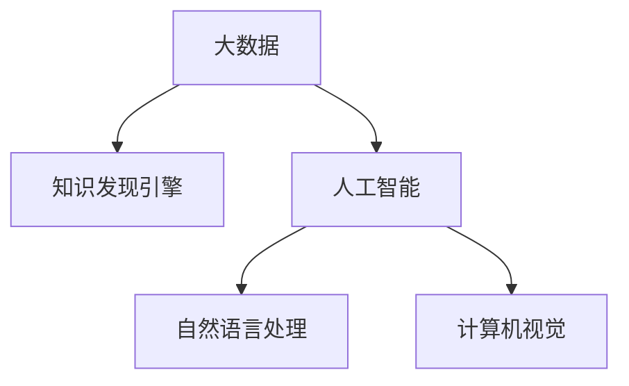

                 

# 人类知识的民主化：知识发现引擎的使命

## 1. 背景介绍

在当今数字化、网络化的时代，知识获取和应用的方式已经发生了根本性变革。传统的知识获取依赖于书籍、学术论文等纸质媒介，其传播范围和速度受到限制，且难以适应快速变化的社会需求。然而，随着互联网和人工智能技术的快速发展，知识获取方式正变得越来越便捷、普惠，知识的民主化成为可能。

在这个背景下，知识发现引擎（Knowledge Discovery Engine, KDE）应运而生，其使命在于通过高效、精准、普惠的技术手段，帮助人类民主化获取知识，推动知识的普惠与共享，促进社会进步和经济发展。知识发现引擎通过对海量数据进行分析和挖掘，揭示隐藏在海量信息中的知识，为科研、教育、医疗、商业等多个领域提供重要支撑，展现出巨大的应用潜力。

## 2. 核心概念与联系

### 2.1 核心概念概述

为更好地理解知识发现引擎，本节将介绍几个密切相关的核心概念：

- 知识发现引擎（KDE）：一种利用人工智能技术，从大量结构化或非结构化数据中提取和发现知识的系统。其目的是帮助用户发现数据中隐藏的有用信息，实现数据的价值最大化。

- 大数据（Big Data）：通常指规模巨大、类型多样、速度极快的数据集，其典型特征包括4V（Volume, Velocity, Variety, Veracity），即规模大、速度快、种类多、价值高。

- 人工智能（AI）：一种模拟人类智能行为的技术，包括机器学习、深度学习、自然语言处理、计算机视觉等多个子领域。知识发现引擎正是利用人工智能技术，对大数据进行分析和挖掘。

- 自然语言处理（NLP）：人工智能的一个重要分支，旨在使计算机能够理解、处理和生成人类语言，使机器能够进行语义理解、文本分类、情感分析等任务。

- 计算机视觉（CV）：人工智能的另一重要分支，利用计算机视觉技术，使机器能够识别、分类和理解图像和视频内容。

这些核心概念之间的逻辑关系可以通过以下Mermaid流程图来展示：



这个流程图展示了大数据、人工智能、知识发现引擎之间的关系：

1. 大数据为知识发现引擎提供了分析和挖掘的素材。
2. 人工智能是知识发现引擎的核心技术，通过机器学习、深度学习等手段实现知识发现。
3. 自然语言处理和计算机视觉是人工智能的重要分支，帮助知识发现引擎处理文本和图像数据。

这些概念共同构成了知识发现引擎的技术基础，使其能够高效、精准地发现和利用大数据中的知识。

## 3. 核心算法原理 & 具体操作步骤

### 3.1 算法原理概述

知识发现引擎的核心算法基于人工智能技术，尤其是机器学习和深度学习。其基本原理是通过对大数据集的学习，识别出数据中的模式、规律和关联，进而提取出有价值的知识。

形式化地，假设有一组大数据集 $D=\{(x_i, y_i)\}_{i=1}^N$，其中 $x_i$ 为数据样本，$y_i$ 为相应的标签。知识发现引擎的目标是通过学习 $D$，找到一个函数 $f$，使得 $f(x)$ 尽可能接近 $y_i$。常见的学习算法包括监督学习、无监督学习和强化学习等。

在实际应用中，知识发现引擎通常会通过预训练模型、特征工程、模型调参等步骤，逐步优化模型，使其在特定任务上获得最佳的性能。预训练模型利用大规模无标签数据进行训练，学习到通用的数据表示；特征工程通过设计合适的特征，提高模型的学习效率；模型调参通过交叉验证、超参数搜索等手段，找到最优的模型参数，从而提升模型的性能。

### 3.2 算法步骤详解

知识发现引擎的核心算法步骤包括以下几个关键环节：

**Step 1: 数据预处理**
- 收集并整理大数据集 $D$，确保数据的完整性、准确性和一致性。
- 进行数据清洗，去除噪声、缺失值等无用信息。
- 对数据进行标准化处理，包括归一化、中心化等，提高模型的收敛速度。

**Step 2: 特征工程**
- 设计合适的特征表示方法，将原始数据转换为模型可以理解的形式。
- 通过特征选择、降维等技术，提取最具代表性的特征，减少计算复杂度。
- 引入时间序列、文本、图像等不同类型的数据特征，提高模型的鲁棒性和泛化能力。

**Step 3: 模型训练**
- 选择合适的算法和模型，如支持向量机、随机森林、深度神经网络等。
- 进行模型训练，优化模型参数，确保模型在训练集上获得最优的性能。
- 使用交叉验证等技术，评估模型在不同数据集上的泛化能力。

**Step 4: 模型评估**
- 对模型在测试集上的性能进行评估，通常使用准确率、召回率、F1值等指标。
- 进行模型调参，优化模型结构和参数，提高模型性能。
- 使用正则化、Dropout、Early Stopping等技术，防止模型过拟合。

**Step 5: 知识发现**
- 在训练好的模型上，对大数据集进行预测，识别出数据中的模式、规律和关联。
- 进行知识表示和抽取，将发现的知识以结构化或非结构化的形式呈现。
- 利用可视化工具，展示发现的知识，帮助用户理解和应用。

### 3.3 算法优缺点

知识发现引擎具有以下优点：
1. 高效性：利用机器学习和大数据技术，快速发现和利用数据中的知识。
2. 准确性：通过训练和调参，提高模型的预测准确性，避免人类主观偏见。
3. 普惠性：利用互联网技术，实现知识获取的便捷化和普惠化。
4. 可扩展性：能够处理不同类型、不同规模的数据，适应不断变化的数据环境。

但同时，知识发现引擎也存在一定的局限性：
1. 数据质量依赖性：依赖高质量的数据集，数据缺失、噪声等问题会影响模型性能。
2. 算法复杂性：部分算法和模型训练复杂度高，对硬件资源要求较高。
3. 可解释性不足：部分模型黑盒性质强，难以解释其内部工作机制和决策逻辑。
4. 数据隐私问题：处理大规模数据时，需要考虑数据隐私和安全性，避免数据泄露。

尽管存在这些局限性，但就目前而言，知识发现引擎仍是大数据时代重要的知识获取工具。未来相关研究的重点在于如何进一步提升算法的准确性和普惠性，解决数据隐私和安全问题，同时兼顾可解释性和模型复杂度等因素。

### 3.4 算法应用领域

知识发现引擎已经广泛应用于科研、教育、医疗、商业等多个领域，以下是几个典型应用：

- 医疗健康：通过分析医疗记录、基因数据等，发现疾病的模式和规律，辅助医生诊断和治疗。
- 金融服务：通过分析股票市场数据、交易记录等，预测市场趋势，进行风险管理和投资决策。
- 市场营销：通过分析消费者行为数据、市场调查等，发现用户偏好，进行精准营销和品牌推广。
- 教育培训：通过分析学习行为数据、成绩记录等，发现学生的学习模式，进行个性化教育和辅导。
- 社会治理：通过分析公共服务数据、舆情信息等，发现社会热点和问题，辅助政策制定和公共服务优化。

## 4. 数学模型和公式 & 详细讲解

### 4.1 数学模型构建

知识发现引擎的核心算法形式化地可以表示为：

$$
\min_{f} \mathcal{L}(f) + \mathcal{R}(f)
$$

其中，$\mathcal{L}(f)$ 为损失函数，用于衡量模型预测结果与真实标签的差异；$\mathcal{R}(f)$ 为正则化项，用于防止模型过拟合。假设模型的输出为 $f(x)$，损失函数可以表示为：

$$
\mathcal{L}(f) = \sum_{i=1}^N (y_i - f(x_i))^2
$$

正则化项可以表示为：

$$
\mathcal{R}(f) = \lambda \sum_{i=1}^N |f(x_i)|^2
$$

其中，$\lambda$ 为正则化系数，用于控制正则化的强度。

### 4.2 公式推导过程

以线性回归为例，推导最小二乘法的求解过程。设有一组数据 $(x_i, y_i)$，其中 $x_i \in \mathbb{R}^d$，$y_i \in \mathbb{R}$，线性回归模型的形式为 $f(x) = \theta^T x$，其中 $\theta$ 为模型参数。最小二乘法的目标是最小化预测值与真实值之间的平方误差，即：

$$
\min_{\theta} \sum_{i=1}^N (y_i - \theta^T x_i)^2
$$

对目标函数求导，得到：

$$
\nabla_{\theta} \mathcal{L}(\theta) = -2 \sum_{i=1}^N (y_i - \theta^T x_i)x_i
$$

令 $\nabla_{\theta} \mathcal{L}(\theta) = 0$，解得：

$$
\theta = (\sum_{i=1}^N x_ix_i^T)^{-1} \sum_{i=1}^N x_i y_i
$$

这就是线性回归模型的最小二乘法求解公式。

## 5. 项目实践：代码实例和详细解释说明

### 5.1 开发环境搭建

在进行知识发现引擎的实践前，我们需要准备好开发环境。以下是使用Python进行Scikit-learn开发的环境配置流程：

1. 安装Anaconda：从官网下载并安装Anaconda，用于创建独立的Python环境。

2. 创建并激活虚拟环境：
```bash
conda create -n kde-env python=3.8 
conda activate kde-env
```

3. 安装Scikit-learn、NumPy、Pandas等关键库：
```bash
conda install scikit-learn numpy pandas
```

4. 安装TensorFlow和Keras：
```bash
conda install tensorflow keras
```

5. 安装Matplotlib等可视化工具：
```bash
conda install matplotlib seaborn
```

完成上述步骤后，即可在`kde-env`环境中开始知识发现引擎的开发实践。

### 5.2 源代码详细实现

这里我们以线性回归为例，展示知识发现引擎的代码实现。

```python
from sklearn.linear_model import LinearRegression
from sklearn.datasets import load_boston
import pandas as pd
import numpy as np
import matplotlib.pyplot as plt

# 加载波士顿房价数据集
boston = load_boston()

# 将数据集转换为Pandas DataFrame
df = pd.DataFrame(data=np.c_[boston['data'], boston['target']], columns=boston['feature_names'] + ['target'])

# 分割数据集为训练集和测试集
from sklearn.model_selection import train_test_split
X_train, X_test, y_train, y_test = train_test_split(df.iloc[:, :-1], df.iloc[:, -1], test_size=0.2, random_state=42)

# 训练线性回归模型
model = LinearRegression()
model.fit(X_train, y_train)

# 在测试集上评估模型性能
y_pred = model.predict(X_test)
print("R^2 score:", model.score(X_test, y_test))

# 绘制回归线
plt.scatter(X_test, y_test)
plt.plot(X_test, y_pred, color='red')
plt.show()
```

### 5.3 代码解读与分析

让我们再详细解读一下关键代码的实现细节：

**load_boston函数**：
- 从Scikit-learn库中加载波士顿房价数据集，该数据集包含14个特征和房价目标变量。

**Pandas DataFrame**：
- 将数据集转换为Pandas DataFrame，方便数据处理和分析。

**train_test_split函数**：
- 将数据集分割为训练集和测试集，设置测试集大小为20%，随机状态为42。

**LinearRegression模型**：
- 创建线性回归模型，利用训练集数据进行模型训练。

**模型评估**：
- 在测试集上使用R^2 score评估模型性能，计算测试集的回归平方误差。
- 绘制回归线和散点图，可视化模型的拟合效果。

可以看到，通过Pandas、Scikit-learn等工具，知识发现引擎的开发变得简洁高效。开发者可以将更多精力放在数据处理、模型选择等高层逻辑上，而不必过多关注底层的实现细节。

当然，实际应用中还需要考虑更多因素，如超参数调优、数据增强、模型集成等，以提升知识发现引擎的性能和鲁棒性。

## 6. 实际应用场景

### 6.1 医疗健康

在医疗健康领域，知识发现引擎可以通过分析医疗记录、基因数据等，发现疾病的模式和规律，辅助医生诊断和治疗。例如，利用知识发现引擎对大量电子病历进行挖掘，可以识别出某种疾病的常见症状、风险因素和治疗方法，从而辅助医生快速做出诊断，优化治疗方案。

### 6.2 金融服务

在金融服务领域，知识发现引擎可以通过分析股票市场数据、交易记录等，预测市场趋势，进行风险管理和投资决策。例如，利用知识发现引擎对历史交易数据进行分析和挖掘，可以发现价格波动和市场情绪之间的关系，预测未来的市场走势，为投资决策提供依据。

### 6.3 市场营销

在市场营销领域，知识发现引擎可以通过分析消费者行为数据、市场调查等，发现用户偏好，进行精准营销和品牌推广。例如，利用知识发现引擎对社交媒体数据进行分析和挖掘，可以识别出用户的兴趣点和购买意向，进行个性化的广告投放和产品推荐。

### 6.4 教育培训

在教育培训领域，知识发现引擎可以通过分析学习行为数据、成绩记录等，发现学生的学习模式，进行个性化教育和辅导。例如，利用知识发现引擎对学生成绩和学习行为进行分析和挖掘，可以识别出学生在学习中的薄弱环节和优势领域，制定个性化的学习计划和辅导方案。

### 6.5 社会治理

在社会治理领域，知识发现引擎可以通过分析公共服务数据、舆情信息等，发现社会热点和问题，辅助政策制定和公共服务优化。例如，利用知识发现引擎对公共服务数据进行分析和挖掘，可以发现服务过程中的瓶颈和问题，优化服务流程和资源配置。

## 7. 工具和资源推荐

### 7.1 学习资源推荐

为了帮助开发者系统掌握知识发现引擎的理论基础和实践技巧，这里推荐一些优质的学习资源：

1. 《机器学习实战》：一本经典的机器学习入门书籍，详细介绍了各种机器学习算法和应用场景。

2. 《深度学习》（Ian Goodfellow著）：深度学习的经典教材，全面介绍了深度神经网络的理论基础和实践应用。

3. Kaggle：全球最大的数据科学竞赛平台，提供丰富的数据集和竞赛项目，是学习数据科学和机器学习的绝佳资源。

4. Coursera：提供大量在线课程，包括机器学习、深度学习、自然语言处理等多个领域，适合自学和进阶学习。

5. Udacity：提供多种在线课程和纳米学位项目，专注于人工智能和数据科学的实践技能培养。

通过对这些资源的学习实践，相信你一定能够快速掌握知识发现引擎的精髓，并用于解决实际的NLP问题。

### 7.2 开发工具推荐

高效的开发离不开优秀的工具支持。以下是几款用于知识发现引擎开发的常用工具：

1. Jupyter Notebook：一款交互式的数据分析工具，支持Python、R等多种语言，适合进行数据处理和模型调试。

2. TensorFlow：由Google主导开发的开源深度学习框架，生产部署方便，适合大规模工程应用。

3. PyTorch：基于Python的开源深度学习框架，灵活动态的计算图，适合快速迭代研究。

4. Weights & Biases：模型训练的实验跟踪工具，可以记录和可视化模型训练过程中的各项指标，方便对比和调优。

5. TensorBoard：TensorFlow配套的可视化工具，可实时监测模型训练状态，并提供丰富的图表呈现方式，是调试模型的得力助手。

合理利用这些工具，可以显著提升知识发现引擎的开发效率，加快创新迭代的步伐。

### 7.3 相关论文推荐

知识发现引擎的发展源于学界的持续研究。以下是几篇奠基性的相关论文，推荐阅读：

1. SVM: Support Vector Machines and Kernel Trick（李航博士论文）：介绍了支持向量机算法的基本原理和应用。

2. Deep Learning（Goodfellow等著）：深度学习的经典教材，详细介绍了深度神经网络的理论基础和实践应用。

3. Neural Information Processing Systems（NIPS）：人工智能领域的顶级学术会议，每年发布大量前沿研究成果，是了解最新研究动态的重要途径。

4. A Survey of Recent Developments in Algorithmic Fairness: Theory, Challenges, Methods, and Future Directions：关于算法公平性的综述论文，介绍了近年来在公平性、透明度等方面的研究成果。

这些论文代表了大数据、人工智能、知识发现引擎的发展脉络。通过学习这些前沿成果，可以帮助研究者把握学科前进方向，激发更多的创新灵感。

## 8. 总结：未来发展趋势与挑战

### 8.1 研究成果总结

知识发现引擎已经取得了诸多研究成果，包括但不限于：

1. 机器学习算法：如线性回归、决策树、支持向量机、随机森林等，这些算法已经广泛应用于各个领域。

2. 深度学习模型：如卷积神经网络（CNN）、循环神经网络（RNN）、深度神经网络（DNN）等，这些模型在图像、语音、自然语言处理等领域表现优异。

3. 特征工程：如特征选择、降维、特征工程等，通过设计合适的特征，提高模型的学习效率。

4. 模型评估：如交叉验证、网格搜索、超参数调优等，通过评估和优化模型，提升模型性能。

这些研究成果奠定了知识发现引擎的技术基础，使其能够高效、精准地发现和利用数据中的知识。

### 8.2 未来发展趋势

展望未来，知识发现引擎的发展趋势如下：

1. 更加智能化的模型：通过引入更多的先验知识，如图像、语音等，提高模型的泛化能力和鲁棒性。

2. 更加普惠化的应用：通过互联网和移动端技术，实现知识获取的便捷化和普惠化，使更多人能够受益。

3. 更加数据驱动的决策：通过分析海量数据，发现隐藏的规律和趋势，辅助决策过程，提高决策的科学性和合理性。

4. 更加人性化的交互：通过自然语言处理和计算机视觉技术，实现人机交互的自然化和智能化，提高用户体验。

5. 更加安全的保障：通过数据加密、隐私保护等技术，保障数据安全和隐私，确保知识发现的可信度。

6. 更加可持续的发展：通过节能减排、资源优化等技术，实现知识发现的绿色可持续，避免对环境造成负面影响。

以上趋势凸显了知识发现引擎的广阔前景。这些方向的探索发展，必将进一步提升知识发现引擎的性能和应用范围，为社会进步和经济发展提供新的动力。

### 8.3 面临的挑战

尽管知识发现引擎已经取得了诸多研究成果，但仍面临着诸多挑战：

1. 数据质量问题：依赖高质量的数据集，数据缺失、噪声等问题会影响模型性能。

2. 算法复杂性：部分算法和模型训练复杂度高，对硬件资源要求较高。

3. 可解释性不足：部分模型黑盒性质强，难以解释其内部工作机制和决策逻辑。

4. 数据隐私问题：处理大规模数据时，需要考虑数据隐私和安全性，避免数据泄露。

5. 模型鲁棒性：面对复杂和多样化的数据环境，模型的泛化能力和鲁棒性仍需进一步提升。

6. 计算效率：面对大规模数据集和复杂模型，计算效率和资源消耗仍是重要的挑战。

尽管存在这些挑战，但知识发现引擎作为一种高效、精准的知识获取方式，其发展潜力巨大。未来相关研究的重点在于如何进一步提升算法的准确性和普惠性，解决数据隐私和安全问题，同时兼顾可解释性和模型复杂度等因素。

### 8.4 研究展望

面对知识发现引擎面临的挑战，未来的研究需要在以下几个方面寻求新的突破：

1. 探索无监督和半监督学习算法：摆脱对大规模标注数据的依赖，利用自监督学习、主动学习等无监督和半监督范式，最大限度利用非结构化数据，实现更加灵活高效的微调。

2. 研究参数高效和计算高效的算法：开发更加参数高效的算法，在固定大部分预训练参数的同时，只更新极少量的任务相关参数。同时优化算法计算图，减少前向传播和反向传播的资源消耗，实现更加轻量级、实时性的部署。

3. 融合因果和对比学习范式：通过引入因果推断和对比学习思想，增强模型的建立稳定因果关系的能力，学习更加普适、鲁棒的语言表征，从而提升模型的泛化性和抗干扰能力。

4. 引入更多先验知识：将符号化的先验知识，如图像、语音等，与神经网络模型进行巧妙融合，引导模型学习更准确、合理的语言模型。同时加强不同模态数据的整合，实现视觉、语音等多模态信息与文本信息的协同建模。

5. 结合因果分析和博弈论工具：将因果分析方法引入知识发现引擎，识别出模型决策的关键特征，增强输出解释的因果性和逻辑性。借助博弈论工具刻画人机交互过程，主动探索并规避模型的脆弱点，提高系统稳定性。

6. 纳入伦理道德约束：在模型训练目标中引入伦理导向的评估指标，过滤和惩罚有偏见、有害的输出倾向。同时加强人工干预和审核，建立模型行为的监管机制，确保输出符合人类价值观和伦理道德。

这些研究方向的探索，必将引领知识发现引擎技术迈向更高的台阶，为构建安全、可靠、可解释、可控的智能系统铺平道路。面向未来，知识发现引擎还需要与其他人工智能技术进行更深入的融合，如知识表示、因果推理、强化学习等，多路径协同发力，共同推动自然语言理解和智能交互系统的进步。只有勇于创新、敢于突破，才能不断拓展语言模型的边界，让智能技术更好地造福人类社会。

---

作者：禅与计算机程序设计艺术 / Zen and the Art of Computer Programming

