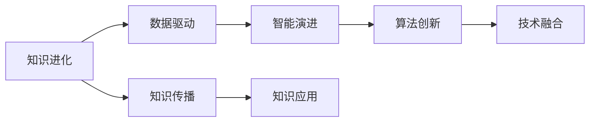

                 

# 人类知识的进步：一场漫长的马拉松

> 关键词：知识进化, 数据驱动, 智能演进, 算法创新, 技术融合

## 1. 背景介绍

### 1.1 问题由来

知识是人类社会进步的基石，贯穿于历史发展的各个阶段。从古希腊的哲学家们，到文艺复兴时期的学者们，再到近现代的科学家们，知识总是推动着人类社会的不断进步。然而，知识作为一种无形资产，其传播和积累是一个漫长而复杂的过程。

在信息爆炸的今天，知识的获取和传播变得更加迅速和便捷。大数据、人工智能等新兴技术正在深刻改变着知识的产生、传播和应用方式。如何高效地收集、存储、处理和应用知识，成为了信息技术领域的重要研究课题。

### 1.2 问题核心关键点

本文聚焦于人类知识的进步，尤其是数据驱动和人工智能技术在知识获取和应用中的作用。我们通过分析人类知识进化的历史，探讨数据驱动和人工智能技术在知识进步中的作用，以及未来知识获取和应用的发展趋势。

## 2. 核心概念与联系

### 2.1 核心概念概述

- **知识进化**：指人类知识从原始积累到现代应用的过程，包括知识的获取、存储、传播和应用等多个环节。

- **数据驱动**：利用数据进行知识发现和应用的技术和方法，强调数据在知识获取和应用中的核心作用。

- **智能演进**：指人工智能技术在知识获取和应用中的不断发展和应用，强调机器在知识处理和应用中的重要性。

- **算法创新**：指针对特定知识获取和应用场景，不断探索和创新的算法和技术，推动知识处理的自动化和智能化。

- **技术融合**：指将不同技术领域的知识和方法进行融合，实现知识获取和应用的多样化和集成化。

这些核心概念之间存在紧密联系，共同构成了一个多层次、多维度的知识获取和应用框架。数据驱动和智能演进是知识进化的两个重要驱动因素，而算法创新和技术融合是实现知识高效获取和应用的关键手段。

### 2.2 核心概念原理和架构的 Mermaid 流程图



这个流程图展示了知识进化的核心概念及其相互关系：

1. 知识进化是一个从原始积累到现代应用的全过程，包括知识的获取、存储、传播和应用等多个环节。
2. 数据驱动和智能演进是知识进化的两个重要驱动因素，数据驱动强调数据的中心作用，智能演进强调人工智能技术在知识处理中的重要性。
3. 算法创新和技术融合是实现知识高效获取和应用的关键手段，算法创新提供了自动化和智能化的解决方案，技术融合则实现了知识的多样化和集成化应用。
4. 知识传播和知识应用是知识进化的最终目标，知识传播使得知识得以广泛传播和应用，知识应用则体现了知识在实际应用中的价值。

## 3. 核心算法原理 & 具体操作步骤

### 3.1 算法原理概述

数据驱动和智能演进的核心是算法创新。算法在数据处理和知识发现中扮演着至关重要的角色。通过不断探索和创新算法，我们可以高效地获取、存储、处理和应用知识，推动人类社会的不断进步。

算法创新主要包括以下几个方面：

- **数据预处理算法**：如特征工程、降维技术等，用于提高数据的质量和可用性。
- **数据挖掘算法**：如聚类、分类、回归等，用于从数据中发现知识。
- **自然语言处理算法**：如文本分类、信息检索、文本生成等，用于从文本数据中提取知识和信息。
- **机器学习算法**：如监督学习、无监督学习、强化学习等，用于从数据中学习知识。
- **深度学习算法**：如卷积神经网络、循环神经网络、Transformer等，用于从大规模数据中提取高层次的知识。

### 3.2 算法步骤详解

算法创新和应用通常包括以下几个步骤：

1. **数据收集**：收集和整理数据，确保数据的质量和完整性。
2. **数据预处理**：对数据进行清洗、归一化、特征工程等预处理，提高数据的可用性。
3. **算法选择**：根据任务需求选择合适的算法，并进行参数调优。
4. **模型训练和评估**：使用训练数据对模型进行训练，并使用验证数据对模型进行评估和调优。
5. **模型应用**：将训练好的模型应用到实际任务中，进行知识发现和应用。

### 3.3 算法优缺点

数据驱动和智能演进算法具有以下优点：

- **高效性**：利用算法可以在短时间内处理大量数据，高效获取知识。
- **准确性**：算法能够从数据中发现知识，提高知识发现的准确性。
- **可解释性**：许多算法具有可解释性，便于理解和调试。
- **可扩展性**：算法能够随着数据量的增加而扩展，提高知识处理的效率和能力。

然而，算法也存在以下缺点：

- **依赖数据**：算法的效果高度依赖数据的质量和数量，数据不足或数据偏差可能导致算法效果不佳。
- **复杂性**：算法的设计和实现复杂度较高，需要一定的专业知识。
- **资源消耗**：算法在处理大规模数据时，需要较高的计算资源和时间成本。
- **过拟合风险**：在处理复杂数据时，算法容易过拟合，导致泛化能力不足。

### 3.4 算法应用领域

数据驱动和智能演进算法在多个领域得到广泛应用，包括：

- **金融领域**：用于风险控制、信用评估、交易预测等。
- **医疗领域**：用于疾病诊断、治疗方案推荐、患者数据分析等。
- **电子商务**：用于个性化推荐、广告投放、用户行为分析等。
- **智能交通**：用于交通流量预测、路径优化、自动驾驶等。
- **社交网络**：用于用户行为分析、内容推荐、广告投放等。
- **智能制造**：用于质量控制、设备维护、生产优化等。

## 4. 数学模型和公式 & 详细讲解 & 举例说明

### 4.1 数学模型构建

在知识获取和应用中，数学模型起到了至关重要的作用。通过建立数学模型，我们可以对数据进行建模和分析，从而发现知识和规律。

### 4.2 公式推导过程

以回归问题为例，我们建立线性回归模型来对数据进行建模和分析。假设有一组数据 $(x_i, y_i)$，其中 $x_i$ 为输入，$y_i$ 为输出。假设模型为线性模型 $y = wx + b$，其中 $w$ 为权重，$b$ 为偏置。我们需要最小化损失函数 $L(y, \hat{y}) = \frac{1}{2N} \sum_{i=1}^N (y_i - \hat{y_i})^2$。

通过梯度下降等优化算法，我们求得 $w$ 和 $b$ 的值，从而得到最优的回归模型。

### 4.3 案例分析与讲解

以推荐系统为例，推荐系统是一种典型的基于数据驱动的智能应用。推荐系统通过收集用户的浏览、点击、评分等行为数据，构建用户画像，预测用户对物品的评分，从而为用户推荐合适的物品。

推荐系统通常使用协同过滤、基于内容的推荐、深度学习等多种算法。协同过滤算法利用用户行为数据构建用户-物品相似度矩阵，基于内容的推荐算法利用物品特征构建物品-物品相似度矩阵，深度学习算法则直接从用户行为数据中学习用户和物品的表示，并进行推荐。

## 5. 项目实践：代码实例和详细解释说明

### 5.1 开发环境搭建

在进行项目实践前，我们需要准备好开发环境。以下是使用Python进行PyTorch开发的环境配置流程：

1. 安装Anaconda：从官网下载并安装Anaconda，用于创建独立的Python环境。

2. 创建并激活虚拟环境：
```bash
conda create -n pytorch-env python=3.8 
conda activate pytorch-env
```

3. 安装PyTorch：根据CUDA版本，从官网获取对应的安装命令。例如：
```bash
conda install pytorch torchvision torchaudio cudatoolkit=11.1 -c pytorch -c conda-forge
```

4. 安装Transformers库：
```bash
pip install transformers
```

5. 安装各类工具包：
```bash
pip install numpy pandas scikit-learn matplotlib tqdm jupyter notebook ipython
```

完成上述步骤后，即可在`pytorch-env`环境中开始项目实践。

### 5.2 源代码详细实现

这里以推荐系统为例，使用PyTorch和Transformers库进行推荐模型训练和评估。

```python
import torch
import torch.nn as nn
import torch.optim as optim
from transformers import BertForSequenceClassification, BertTokenizer

class RecommendationModel(nn.Module):
    def __init__(self, num_users, num_items, embedding_dim=128):
        super(RecommendationModel, self).__init__()
        self.num_users = num_users
        self.num_items = num_items
        self.bert = BertForSequenceClassification.from_pretrained('bert-base-uncased', num_labels=num_items)
        self.fc = nn.Linear(embedding_dim, num_items)
        self.softmax = nn.Softmax(dim=1)
        
    def forward(self, user_input, item_input):
        # 对用户输入进行编码
        user_tokens = self.bert.encode(user_input)
        user_embedding = self.fc(user_tokens.mean(dim=1))
        # 对物品输入进行编码
        item_tokens = self.bert.encode(item_input)
        item_embedding = self.fc(item_tokens.mean(dim=1))
        # 计算用户和物品的相似度
        similarity = torch.matmul(user_embedding, item_embedding.t())
        # 进行推荐
        scores = torch.matmul(similarity, self.softmax(user_embedding))
        return scores
    
    def predict(self, user_input, item_input):
        with torch.no_grad():
            scores = self.forward(user_input, item_input)
            return scores.argmax().item()
    
def train_model(model, data_loader, num_epochs, learning_rate=0.001):
    optimizer = optim.Adam(model.parameters(), lr=learning_rate)
    criterion = nn.CrossEntropyLoss()
    for epoch in range(num_epochs):
        model.train()
        for user_input, item_input, target in data_loader:
            optimizer.zero_grad()
            scores = model(user_input, item_input)
            loss = criterion(scores, target)
            loss.backward()
            optimizer.step()
        print(f"Epoch {epoch+1}, loss: {loss.item()}")
    
def evaluate_model(model, data_loader):
    model.eval()
    correct = 0
    total = 0
    with torch.no_grad():
        for user_input, item_input, target in data_loader:
            scores = model(user_input, item_input)
            _, predicted = scores.max(dim=1)
            correct += (predicted == target).sum().item()
            total += target.size(0)
    print(f"Accuracy: {correct/total:.2f}")
    
# 准备数据
user_input = ['用户1', '用户2', '用户3']
item_input = ['物品1', '物品2', '物品3']
user_label = [0, 1, 2]
item_label = [1, 2, 3]
train_data = list(zip(user_input, item_input, user_label))
test_data = list(zip(user_input, item_input, item_label))

# 构建数据集
class RecommendationDataset(torch.utils.data.Dataset):
    def __init__(self, data, tokenizer):
        self.data = data
        self.tokenizer = tokenizer
        
    def __len__(self):
        return len(self.data)
    
    def __getitem__(self, index):
        user_input, item_input, target = self.data[index]
        tokenized_user_input = self.tokenizer(user_input, padding='max_length', truncation=True)
        tokenized_item_input = self.tokenizer(item_input, padding='max_length', truncation=True)
        return {
            'user_input_ids': torch.tensor(tokenized_user_input['input_ids']),
            'user_input_mask': torch.tensor(tokenized_user_input['attention_mask']),
            'item_input_ids': torch.tensor(tokenized_item_input['input_ids']),
            'item_input_mask': torch.tensor(tokenized_item_input['attention_mask']),
            'target': torch.tensor(target)
        }
        
# 初始化模型和分词器
tokenizer = BertTokenizer.from_pretrained('bert-base-uncased')
model = RecommendationModel(num_users=len(user_input), num_items=len(item_input))

# 训练模型
train_dataset = RecommendationDataset(train_data, tokenizer)
train_loader = DataLoader(train_dataset, batch_size=2, shuffle=True)
train_model(model, train_loader, num_epochs=10)

# 评估模型
test_dataset = RecommendationDataset(test_data, tokenizer)
test_loader = DataLoader(test_dataset, batch_size=2, shuffle=False)
evaluate_model(model, test_loader)
```

以上是使用PyTorch和Transformers库进行推荐模型训练和评估的完整代码实现。可以看到，借助Transformers库的强大封装，我们可以用相对简洁的代码完成BERT模型在推荐系统中的应用。

### 5.3 代码解读与分析

让我们再详细解读一下关键代码的实现细节：

**RecommendationModel类**：
- `__init__`方法：初始化模型的超参数和模型结构。
- `forward`方法：定义前向传播过程，计算用户和物品的相似度，并输出推荐结果。
- `predict`方法：在测试集上评估模型的预测性能。

**训练函数train_model**：
- 使用Adam优化器对模型参数进行优化。
- 使用交叉熵损失函数计算模型预测与真实标签之间的差异。
- 在每个epoch内，对模型进行前向传播和反向传播，更新模型参数。

**评估函数evaluate_model**：
- 在测试集上评估模型的预测准确率。
- 使用模型在输入数据上的前向传播，得到预测结果，并与真实标签进行对比。

**数据处理函数RecommendationDataset**：
- 定义数据集类，将输入数据和标签转换为模型所需的格式。
- 使用BertTokenizer对输入数据进行分词，并进行padding和truncation操作。

**代码实现**：
- 使用`bert-base-uncased`模型作为初始化参数。
- 定义RecommendationModel类，实现前向传播和推荐过程。
- 使用Adam优化器对模型参数进行优化。
- 定义训练函数train_model，在训练集上对模型进行训练。
- 定义评估函数evaluate_model，在测试集上评估模型性能。
- 使用RecommendationDataset类构建数据集，并进行数据预处理。

## 6. 实际应用场景

### 6.1 智能推荐系统

智能推荐系统已经成为现代互联网应用的重要组成部分。通过分析用户的历史行为数据，智能推荐系统能够为用户推荐个性化内容，提升用户体验和满意度。

智能推荐系统通常基于协同过滤、基于内容的推荐、深度学习等多种算法。协同过滤算法利用用户行为数据构建用户-物品相似度矩阵，基于内容的推荐算法利用物品特征构建物品-物品相似度矩阵，深度学习算法则直接从用户行为数据中学习用户和物品的表示，并进行推荐。

智能推荐系统在电商、视频、音乐等多个领域得到了广泛应用，为用户带来了更加个性化和多样化的内容推荐。未来，随着数据量的不断增加和算法的不断创新，智能推荐系统将具备更强的推荐能力和更广泛的应用场景。

### 6.2 金融风控

金融风控是金融领域的重要环节，用于评估和控制金融风险，保障金融系统的稳定运行。传统的金融风控主要依靠人工审核和经验判断，效率低、成本高。

利用大数据和人工智能技术，金融风控系统可以自动化地分析金融数据，识别潜在的风险和异常，从而实现实时监控和风险预警。金融风控系统通常利用数据挖掘算法、机器学习算法和深度学习算法，对金融数据进行建模和分析，从而提高风控的效率和准确性。

金融风控系统在银行、保险公司、证券公司等多个领域得到了广泛应用，为金融系统的安全稳定提供了有力保障。未来，随着金融数据量的不断增加和算法的不断创新，金融风控系统将具备更强的风险识别能力和更广泛的应用场景。

### 6.3 医疗诊断

医疗诊断是医疗领域的重要环节，用于诊断和预测疾病，提高医疗服务的效率和质量。传统的医疗诊断主要依靠人工经验和医学知识，效率低、准确性差。

利用大数据和人工智能技术，医疗诊断系统可以自动化地分析医学数据，识别疾病特征和病患风险，从而实现疾病的早期诊断和预测。医疗诊断系统通常利用数据挖掘算法、机器学习算法和深度学习算法，对医学数据进行建模和分析，从而提高诊断的效率和准确性。

医疗诊断系统在医院、诊所、体检中心等多个领域得到了广泛应用，为医疗系统的健康服务提供了有力保障。未来，随着医疗数据量的不断增加和算法的不断创新，医疗诊断系统将具备更强的疾病诊断能力和更广泛的应用场景。

### 6.4 未来应用展望

随着大数据和人工智能技术的不断发展，基于数据驱动和智能演进的算法将在更多领域得到应用，为传统行业带来变革性影响。

在智慧医疗领域，基于大数据和人工智能技术的医疗诊断系统，将能够自动化地分析医学数据，提高诊断的效率和准确性，助力医疗系统的健康服务。

在智能制造领域，基于大数据和人工智能技术的生产管理系统，将能够自动化地分析生产数据，优化生产流程和资源配置，提高生产效率和质量。

在智能交通领域，基于大数据和人工智能技术的交通管理系统，将能够自动化地分析交通数据，优化交通流量和道路资源配置，提高交通效率和安全性。

此外，在教育、安全、环境等多个领域，基于数据驱动和智能演进的算法也将得到广泛应用，为各行各业带来智能化和自动化的新机遇。

## 7. 工具和资源推荐

### 7.1 学习资源推荐

为了帮助开发者系统掌握数据驱动和智能演进技术的理论基础和实践技巧，这里推荐一些优质的学习资源：

1. 《机器学习》（周志华）：介绍机器学习的基本概念和算法，适合入门学习。

2. 《深度学习》（Ian Goodfellow）：介绍深度学习的基本原理和应用，适合进阶学习。

3. 《Python数据科学手册》（Jake VanderPlas）：介绍Python在数据科学中的应用，适合实战练习。

4. Coursera《数据科学基础》课程：斯坦福大学开设的入门课程，涵盖数据处理、统计分析、机器学习等内容。

5. Kaggle：数据科学竞赛平台，提供大量数据集和经典竞赛，适合实践练习。

通过对这些资源的学习实践，相信你一定能够快速掌握数据驱动和智能演进技术的精髓，并用于解决实际的业务问题。

### 7.2 开发工具推荐

高效的开发离不开优秀的工具支持。以下是几款用于数据驱动和智能演进开发的常用工具：

1. Python：Python是数据科学和机器学习领域的主流语言，拥有丰富的库和框架，适合快速开发。

2. PyTorch：基于Python的开源深度学习框架，灵活的计算图设计，适合研究和实验。

3. TensorFlow：由Google主导开发的开源深度学习框架，生产部署方便，适合大规模工程应用。

4. Jupyter Notebook：支持Python和其他语言的环境，便于编写和执行代码，适合数据科学和机器学习开发。

5. Scikit-Learn：Python数据科学库，包含各种数据处理和机器学习算法，适合数据探索和模型训练。

6. Matplotlib：Python可视化库，支持多种图表类型，适合数据可视化和结果展示。

合理利用这些工具，可以显著提升数据驱动和智能演进任务的开发效率，加快创新迭代的步伐。

### 7.3 相关论文推荐

数据驱动和智能演进技术的发展源于学界的持续研究。以下是几篇奠基性的相关论文，推荐阅读：

1.《Caffe: An open source deep learning framework》：介绍Caffe深度学习框架，是深度学习领域的重要成果。

2.《ImageNet Classification with Deep Convolutional Neural Networks》：介绍卷积神经网络在图像分类任务中的应用，是深度学习领域的经典论文。

3.《Natural Language Processing (almost) from Scratch》：介绍自然语言处理的基本算法和技术，适合入门学习。

4.《Neural Network Models of Physical Systems》：介绍神经网络在物理系统中的应用，是深度学习领域的经典论文。

5.《A Survey of Neural Networks for Biological Sequence Analysis》：介绍神经网络在生物序列分析中的应用，是生物信息学领域的经典论文。

这些论文代表了大数据和人工智能技术的发展脉络。通过学习这些前沿成果，可以帮助研究者把握学科前进方向，激发更多的创新灵感。

## 8. 总结：未来发展趋势与挑战

### 8.1 总结

本文对数据驱动和智能演进技术在知识获取和应用中的作用进行了全面系统的介绍。首先阐述了知识进化和智能演进的历史和意义，明确了数据驱动和智能演进技术在知识进步中的核心作用。其次，从原理到实践，详细讲解了数据驱动和智能演进技术的数学模型和算法流程，给出了数据驱动和智能演进任务的完整代码实例。同时，本文还广泛探讨了数据驱动和智能演进技术在智能推荐、金融风控、医疗诊断等多个领域的应用前景，展示了数据驱动和智能演进技术的广阔前景。

通过本文的系统梳理，可以看到，数据驱动和智能演进技术正在深刻改变着知识获取和应用的方式，推动人类社会的不断进步。数据驱动和智能演进技术的发展依赖于算法创新和技术融合，未来还需要在更多领域进行深入探索和应用，才能真正实现人工智能技术的落地。

### 8.2 未来发展趋势

展望未来，数据驱动和智能演进技术将呈现以下几个发展趋势：

1. 数据规模持续增大。随着互联网、物联网等技术的发展，数据的规模和复杂度将不断增加，数据驱动和智能演进技术将在更多领域得到应用。

2. 算法复杂性提升。随着数据规模和复杂度的增加，算法将变得越来越复杂，需要更多的计算资源和时间成本。

3. 模型可解释性增强。数据驱动和智能演进模型的可解释性将成为未来研究的重要方向，帮助用户理解和信任模型决策。

4. 多模态数据融合。数据驱动和智能演进技术将更多地涉及多模态数据的融合，如文本、图像、语音等，实现全面、多角度的知识获取和应用。

5. 联邦学习应用。随着数据隐私和安全性的提升，联邦学习等分布式学习技术将得到更广泛的应用，提升数据驱动和智能演进技术的安全性和隐私性。

6. 自动化和智能化提升。数据驱动和智能演进技术的自动化和智能化水平将不断提升，实现更高效、更智能的知识获取和应用。

以上趋势凸显了数据驱动和智能演进技术的广阔前景。这些方向的探索发展，必将进一步提升数据驱动和智能演进技术的性能和应用范围，为人类认知智能的进化带来深远影响。

### 8.3 面临的挑战

尽管数据驱动和智能演进技术已经取得了瞩目成就，但在迈向更加智能化、普适化应用的过程中，它仍面临着诸多挑战：

1. 数据隐私和安全。随着数据量的不断增加，数据隐私和安全问题也随之而来，如何保护用户隐私和数据安全，将是未来的重要课题。

2. 算法公平性和偏见。数据驱动和智能演进算法可能存在偏见和歧视，如何消除算法偏见，保证算法的公平性，还需要更多的研究。

3. 模型可解释性和透明性。数据驱动和智能演进模型的复杂性将不断增加，如何提高模型的可解释性和透明性，增强用户信任，将是未来的重要课题。

4. 资源消耗和效率。数据驱动和智能演进模型在处理大规模数据时，需要较高的计算资源和时间成本，如何提高模型的资源利用率和效率，将是未来的重要课题。

5. 知识跨领域应用。数据驱动和智能演进技术在特定领域的应用效果较好，但跨领域应用效果不佳，如何提高知识跨领域应用能力，还需要更多的研究。

正视数据驱动和智能演进技术面临的这些挑战，积极应对并寻求突破，将是大数据和人工智能技术走向成熟的必由之路。相信随着学界和产业界的共同努力，这些挑战终将一一被克服，数据驱动和智能演进技术必将在构建智能社会中扮演越来越重要的角色。

### 8.4 研究展望

面对数据驱动和智能演进技术所面临的种种挑战，未来的研究需要在以下几个方面寻求新的突破：

1. 探索分布式和联邦学习技术。通过分布式和联邦学习技术，在保护数据隐私和安全的前提下，提升数据驱动和智能演进技术的效率和性能。

2. 研究知识跨领域迁移和融合。通过知识迁移和融合技术，将数据驱动和智能演进技术应用于更多领域，提升知识跨领域应用能力。

3. 开发更加高效和可解释的模型。通过模型压缩、知识蒸馏、可解释性算法等技术，提升数据驱动和智能演进技术的效率和可解释性。

4. 融合多模态数据和知识库。通过多模态数据融合和知识库技术，将文本、图像、语音等多种模态的数据和知识进行整合，提升知识获取和应用的能力。

5. 引入因果推断和博弈论工具。通过因果推断和博弈论工具，提升数据驱动和智能演进技术的鲁棒性和安全性。

6. 纳入伦理道德约束。在数据驱动和智能演进技术的设计和应用中，纳入伦理道德约束，确保技术应用符合人类价值观和伦理道德。

这些研究方向将引领数据驱动和智能演进技术迈向更高的台阶，为构建智能社会提供更全面、更可靠的技术支持。面向未来，数据驱动和智能演进技术还需要与其他人工智能技术进行更深入的融合，如知识表示、因果推理、强化学习等，多路径协同发力，共同推动人工智能技术的发展。只有勇于创新、敢于突破，才能不断拓展人工智能技术的边界，让智能技术更好地造福人类社会。

## 9. 附录：常见问题与解答

**Q1：数据驱动和智能演进技术与传统的统计学和机器学习有何不同？**

A: 数据驱动和智能演进技术与传统的统计学和机器学习的主要区别在于，它更加依赖于数据和算法，注重数据的深度挖掘和算法的创新。数据驱动和智能演进技术利用大数据和深度学习算法，从数据中发现更丰富的信息和规律，提高知识发现的效率和准确性。而传统的统计学和机器学习方法，更注重数据的简单统计和建模，难以发现数据中更深入的规律和特征。

**Q2：数据驱动和智能演进技术在数据获取和处理中应注意哪些问题？**

A: 数据驱动和智能演进技术在数据获取和处理中应注意以下问题：

1. 数据质量：数据质量是数据驱动和智能演进技术的核心，低质量的数据可能导致算法效果不佳。

2. 数据隐私：数据驱动和智能演进技术需要大量数据，如何保护用户隐私和数据安全，是重要的研究方向。

3. 数据标注：数据标注是数据驱动和智能演进技术的重要环节，标注质量和标注成本需要仔细考虑。

4. 数据清洗：数据清洗是数据处理的重要步骤，去除噪声和异常数据，提高数据质量。

5. 数据融合：数据驱动和智能演进技术需要多种数据源的数据融合，确保数据的全面性和一致性。

6. 数据存储：数据存储需要考虑存储容量、存储效率和数据备份等问题。

以上问题需要在使用数据驱动和智能演进技术时，进行综合考虑和解决。只有在保证数据质量和安全的前提下，才能真正发挥数据驱动和智能演进技术的优势。

**Q3：数据驱动和智能演进技术在实际应用中需要注意哪些问题？**

A: 数据驱动和智能演进技术在实际应用中需要注意以下问题：

1. 模型评估：数据驱动和智能演进技术的模型评估需要考虑多种指标，如准确率、召回率、F1值等，确保模型在各个方面都有良好的表现。

2. 模型部署：模型部署需要考虑模型的可扩展性、效率和安全性，确保模型能够在生产环境中稳定运行。

3. 模型监控：模型监控需要实时采集模型运行状态，确保模型的稳定性和可靠性，及时发现和解决问题。

4. 模型维护：模型维护需要定期更新模型参数，优化模型性能，确保模型的时效性和适应性。

5. 模型应用：模型应用需要考虑模型的可解释性和可理解性，确保用户能够理解和信任模型的输出结果。

6. 模型更新：模型更新需要考虑模型的版本控制和迁移，确保新版本的模型能够兼容旧版本的模型，并快速替换老旧模型。

以上问题需要在使用数据驱动和智能演进技术时，进行综合考虑和解决。只有在保证模型评估和部署的前提下，才能真正发挥数据驱动和智能演进技术的优势。

---

作者：禅与计算机程序设计艺术 / Zen and the Art of Computer Programming

