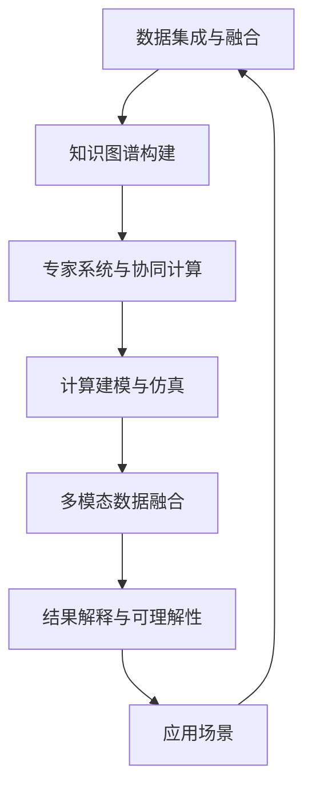

                 

## 1. 背景介绍

### 1.1 问题由来

随着现代信息技术的发展，医疗保健领域的数据量呈爆炸性增长。传统的医疗数据分析和处理方式已无法满足当前的需求。同时，医疗数据复杂度高、维度多，对数据处理能力提出了更高的要求。人类计算作为计算科学和人工智能的新兴研究领域，为医疗保健提供了全新的解决方案。

人类计算利用人类智慧和计算机器相结合的方式，解决复杂计算问题。在医疗保健领域，人类计算可应用于疾病诊断、药物研发、基因组分析、医疗影像处理等多个方面。它通过集成了人类专家的知识，大幅提升了医疗数据处理和分析的效率与准确性，显著降低了误诊率和漏诊率，提升了医疗服务的质量。

### 1.2 问题核心关键点

人类计算在医疗保健中的应用主要包括以下几个核心关键点：

1. **数据集成与融合**：医疗数据往往分散在不同的信息系统中，需要高效的计算模型对其进行整合与融合。

2. **知识图谱构建**：利用人类计算构建医疗知识图谱，整合多源异构数据，提升数据表示的语义一致性和可解释性。

3. **专家系统与协同计算**：通过集成专家知识，构建专家系统，实现人机协同计算，提升医疗决策的可靠性和智能性。

4. **计算建模与仿真**：运用复杂系统建模与仿真技术，研究疾病的传播机制、药物的作用机理等，为疾病预防和药物研发提供科学依据。

5. **多模态数据融合**：结合文本、图像、声音、基因等多种数据源，提升医疗数据处理的全面性和准确性。

6. **结果解释与可理解性**：将计算结果与人类专业知识结合，通过可视化和解释技术，提高计算结果的可理解性和可解释性。

### 1.3 问题研究意义

研究人类计算在医疗保健中的应用，具有以下重要意义：

1. **提高医疗服务的效率与质量**：人类计算通过高效的数据整合与处理，能够显著缩短诊断时间，降低误诊率和漏诊率，提升医疗服务的精准度。

2. **推动医疗技术的创新与发展**：结合人工智能与人类智慧，创新医疗技术，解决传统方法难以攻克的难题。

3. **助力医疗资源的优化配置**：通过计算模型，预测疾病流行趋势，优化医疗资源的配置，提高医疗系统的运行效率。

4. **提升医疗决策的智能性**：利用专家知识与计算模型，增强医疗决策的科学性和可靠性，促进医疗服务的智能化。

5. **增强医疗服务的可解释性与可信度**：通过可视化和解释技术，提高计算结果的可理解性和可解释性，增强医疗服务的透明度和可信度。

6. **促进医疗数据的规范化与标准化**：构建统一的医疗知识图谱，实现医疗数据的高效共享与互操作，促进医疗数据的规范化与标准化。

## 2. 核心概念与联系

### 2.1 核心概念概述

为了更好地理解人类计算在医疗保健中的应用，下面将介绍几个关键概念：

- **人类计算(Human Computing)**：将人类智慧与计算机器相结合，解决复杂计算问题的计算范式。人类计算强调人机协同计算，提升计算效率和准确性。

- **知识图谱(Knowledge Graph)**：一种结构化的语义数据表示方式，用于整合和组织海量知识信息，增强数据的可理解性和可解释性。

- **专家系统(Expert System)**：集成专家知识，通过规则引擎和推理机制，模拟人类专家的决策过程，辅助解决复杂问题。

- **多模态数据融合(Multimodal Data Fusion)**：结合文本、图像、声音、基因等不同类型的医疗数据，提升医疗数据处理的全面性和准确性。

- **计算建模与仿真(Computational Modeling and Simulation)**：利用计算模型和仿真技术，研究疾病的传播机制、药物的作用机理等，为疾病预防和药物研发提供科学依据。

- **结果解释与可理解性(Explainability and Understanding)**：通过可视化和解释技术，提高计算结果的可理解性和可解释性，增强医疗服务的透明度和可信度。

这些核心概念构成了人类计算在医疗保健应用的基本框架，彼此之间相互联系、相互促进。通过理解这些概念，我们可以更好地把握人类计算的原理和应用。

### 2.2 核心概念原理和架构的 Mermaid 流程图



这个流程图展示了人类计算在医疗保健中各核心概念之间的联系：

1. **数据集成与融合**：医疗数据分散在不同的信息系统中，需要高效的计算模型对其进行整合与融合。

2. **知识图谱构建**：利用知识图谱，整合多源异构数据，增强数据的语义一致性和可解释性。

3. **专家系统与协同计算**：通过专家系统，结合计算模型，实现人机协同计算，增强医疗决策的智能性。

4. **计算建模与仿真**：利用计算模型和仿真技术，研究疾病传播机制、药物作用机理等，为疾病预防和药物研发提供科学依据。

5. **多模态数据融合**：结合文本、图像、声音、基因等多种数据源，提升医疗数据处理的全面性和准确性。

6. **结果解释与可理解性**：通过可视化和解释技术，提高计算结果的可理解性和可解释性，增强医疗服务的透明度和可信度。

7. **应用场景**：以上各环节最终应用于各种医疗场景，提升医疗服务的效率与质量。

## 3. 核心算法原理 & 具体操作步骤

### 3.1 算法原理概述

人类计算在医疗保健中的应用，核心算法原理主要包括：

1. **知识图谱构建算法**：利用语义分析、图结构构建等技术，将医疗领域的知识信息整合成知识图谱。

2. **专家系统推理算法**：结合专家知识，构建规则引擎，通过推理机制辅助解决复杂问题。

3. **多模态数据融合算法**：结合不同类型的医疗数据，利用机器学习和深度学习技术，进行数据融合和特征提取。

4. **计算建模与仿真算法**：利用计算模型和仿真技术，研究疾病的传播机制、药物的作用机理等。

5. **结果解释与可视化算法**：通过可视化和解释技术，提高计算结果的可理解性和可解释性。

### 3.2 算法步骤详解

#### 3.2.1 知识图谱构建算法步骤

1. **数据收集**：收集医疗领域的各类知识信息，包括疾病、药物、基因等。

2. **知识提取**：利用自然语言处理技术，提取文本中的关键信息，生成实体、属性和关系三元组。

3. **知识融合**：将提取的三元组进行融合，消除冗余和冲突，形成完整的知识图谱。

4. **知识推理**：利用规则引擎和推理机制，对知识图谱进行推理，挖掘新的知识关系。

#### 3.2.2 专家系统推理算法步骤

1. **规则定义**：结合领域专家的知识，定义推理规则，包括疾病诊断规则、药物作用规则等。

2. **推理引擎**：构建推理引擎，通过匹配规则库，对输入数据进行推理，输出推理结果。

3. **结果验证**：将推理结果与实际数据进行验证，调整规则库，优化推理效果。

#### 3.2.3 多模态数据融合算法步骤

1. **数据预处理**：对不同类型的医疗数据进行预处理，包括去噪、归一化、缺失值填补等。

2. **特征提取**：利用机器学习和深度学习技术，提取各类数据特征，包括文本特征、图像特征、基因特征等。

3. **数据融合**：将提取的特征进行融合，形成全面的数据表示。

4. **特征选择**：选择关键特征，提高数据融合的效果和准确性。

#### 3.2.4 计算建模与仿真算法步骤

1. **建模**：构建计算模型，描述疾病的传播机制、药物的作用机理等。

2. **仿真**：利用仿真技术，模拟计算模型的运行过程，预测疾病的传播趋势和药物的作用效果。

3. **结果分析**：分析仿真结果，提取关键信息，提供决策支持。

#### 3.2.5 结果解释与可视化算法步骤

1. **结果解释**：将计算结果与人类专业知识结合，生成易于理解的解释信息。

2. **可视化展示**：利用可视化技术，将解释信息转化为直观的图形，便于医疗工作者理解和应用。

### 3.3 算法优缺点

#### 3.3.1 知识图谱构建算法的优缺点

**优点**：
- 能够整合多源异构数据，提高数据的语义一致性和可解释性。
- 利用推理机制，挖掘新的知识关系，提升数据处理的能力。

**缺点**：
- 构建知识图谱需要大量专家知识和领域信息，构建复杂，成本较高。
- 知识图谱的更新和维护工作量较大，需要持续的专家参与。

#### 3.3.2 专家系统推理算法的优缺点

**优点**：
- 结合专家知识，提高推理的准确性和可靠性。
- 能够处理复杂的多条件问题，提供灵活的解决方案。

**缺点**：
- 需要大量领域知识和规则库，构建复杂，维护成本高。
- 推理过程缺乏灵活性，对新数据适应性较差。

#### 3.3.3 多模态数据融合算法的优缺点

**优点**：
- 结合多种数据源，提高数据处理的全面性和准确性。
- 利用深度学习技术，自动提取特征，降低人工干预的需求。

**缺点**：
- 多模态数据融合过程复杂，计算量大，需要高性能计算资源。
- 特征选择和融合算法需要针对具体任务进行优化。

#### 3.3.4 计算建模与仿真算法的优缺点

**优点**：
- 利用计算模型和仿真技术，模拟复杂系统，提供科学的决策支持。
- 通过仿真实验，提前预测效果，减少实验成本和风险。

**缺点**：
- 建模过程需要领域专家的参与，构建复杂，周期较长。
- 仿真结果的准确性依赖于模型的精细度和数据的完整性。

#### 3.3.5 结果解释与可视化算法的优缺点

**优点**：
- 通过可视化和解释技术，提高计算结果的可理解性和可解释性。
- 增强医疗服务的透明度和可信度，便于医疗工作者理解和使用。

**缺点**：
- 解释技术依赖于领域的复杂性和模型的复杂度，实现难度较大。
- 可视化结果需要精心的设计，才能保证直观性和可理解性。

### 3.4 算法应用领域

人类计算在医疗保健中的应用领域广泛，涵盖了以下几类：

1. **疾病诊断与预测**：通过结合医疗知识图谱和专家系统，进行疾病诊断和预测，提高诊断的准确性和可靠性。

2. **药物研发**：利用计算建模与仿真技术，研究药物的作用机理，指导药物的开发和临床试验。

3. **基因组分析**：通过多模态数据融合和计算建模，分析基因数据，揭示基因与疾病的关系，推动个性化医疗的发展。

4. **医疗影像处理**：结合图像处理技术和计算建模，分析医疗影像数据，提高影像诊断的效率和准确性。

5. **公共卫生管理**：利用知识图谱和多模态数据融合技术，预测疾病传播趋势，优化公共卫生资源的配置。

6. **医疗资源优化配置**：通过计算建模与仿真技术，预测医疗需求，优化医疗资源的配置，提高医疗系统的运行效率。

## 4. 数学模型和公式 & 详细讲解 & 举例说明

### 4.1 数学模型构建

#### 4.1.1 知识图谱构建的数学模型

知识图谱构建的核心在于将医疗领域的知识信息整合成三元组形式，即(实体, 属性, 关系)。其数学模型如下：

1. **实体表示**：
   $$
   e_i = (x_i, y_i, z_i)
   $$
   其中，$x_i$ 表示实体的属性向量，$y_i$ 表示实体的标签，$z_i$ 表示实体的关系。

2. **关系表示**：
   $$
   r_j = (a_j, b_j, c_j)
   $$
   其中，$a_j$ 表示关系的属性向量，$b_j$ 表示关系的作用对象，$c_j$ 表示关系的效果。

3. **知识表示**：
   $$
   K = \{(e_i, r_j, e_k)\}
   $$
   其中，$K$ 表示知识图谱，由多个三元组构成。

#### 4.1.2 专家系统推理的数学模型

专家系统推理的数学模型主要涉及规则的构建和推理的执行。其核心在于通过规则库和推理引擎，模拟人类专家的决策过程。

1. **规则库表示**：
   $$
   R = \{(P_i, A_i, C_i)\}
   $$
   其中，$P_i$ 表示规则的前提条件，$A_i$ 表示规则的作用条件，$C_i$ 表示规则的结论。

2. **推理引擎表示**：
   $$
   E = \{(Q_j, P_j, C_j)\}
   $$
   其中，$Q_j$ 表示推理引擎的条件，$P_j$ 表示推理引擎的前提，$C_j$ 表示推理引擎的结论。

3. **推理过程表示**：
   $$
   T = \{(e_i, r_j, e_k)\}
   $$
   其中，$T$ 表示推理过程，由多个规则和条件构成。

#### 4.1.3 多模态数据融合的数学模型

多模态数据融合的数学模型主要涉及特征提取和融合的过程。其核心在于将不同类型的医疗数据进行整合和融合。

1. **特征提取**：
   $$
   F = \{(f_{xi}, f_{yi}, f_{zi})\}
   $$
   其中，$f_{xi}$ 表示文本特征向量，$f_{yi}$ 表示图像特征向量，$f_{zi}$ 表示基因特征向量。

2. **特征融合**：
   $$
   G = \{(g_x, g_y, g_z)\}
   $$
   其中，$g_x$ 表示融合后的文本特征向量，$g_y$ 表示融合后的图像特征向量，$g_z$ 表示融合后的基因特征向量。

#### 4.1.4 计算建模与仿真的数学模型

计算建模与仿真的数学模型主要涉及计算模型和仿真过程的构建。其核心在于通过数学模型和仿真技术，模拟复杂系统，提供科学的决策支持。

1. **计算模型构建**：
   $$
   M = \{(m_{xi}, m_{yi}, m_{zi})\}
   $$
   其中，$m_{xi}$ 表示疾病传播模型的参数，$m_{yi}$ 表示药物作用模型的参数，$m_{zi}$ 表示基因表达模型的参数。

2. **仿真过程表示**：
   $$
   S = \{(s_{xj}, s_{yj}, s_{zj})\}
   $$
   其中，$s_{xj}$ 表示疾病传播的仿真结果，$s_{yj}$ 表示药物作用的仿真结果，$s_{zj}$ 表示基因表达的仿真结果。

#### 4.1.5 结果解释与可视化的数学模型

结果解释与可视化的数学模型主要涉及计算结果的解释和可视化过程。其核心在于通过可视化和解释技术，提高计算结果的可理解性和可解释性。

1. **结果解释**：
   $$
   E = \{(e_{xi}, e_{yi}, e_{zi})\}
   $$
   其中，$e_{xi}$ 表示解释后的文本结果，$e_{yi}$ 表示解释后的图像结果，$e_{zi}$ 表示解释后的基因结果。

2. **可视化过程**：
   $$
   V = \{(v_{xj}, v_{yj}, v_{zj})\}
   $$
   其中，$v_{xj}$ 表示可视化的文本结果，$v_{yj}$ 表示可视化的图像结果，$v_{zj}$ 表示可视化的基因结果。

### 4.2 公式推导过程

#### 4.2.1 知识图谱构建的公式推导

1. **实体表示**：
   $$
   e_i = (x_i, y_i, z_i)
   $$

2. **关系表示**：
   $$
   r_j = (a_j, b_j, c_j)
   $$

3. **知识表示**：
   $$
   K = \{(e_i, r_j, e_k)\}
   $$

#### 4.2.2 专家系统推理的公式推导

1. **规则库表示**：
   $$
   R = \{(P_i, A_i, C_i)\}
   $$

2. **推理引擎表示**：
   $$
   E = \{(Q_j, P_j, C_j)\}
   $$

3. **推理过程表示**：
   $$
   T = \{(e_i, r_j, e_k)\}
   $$

#### 4.2.3 多模态数据融合的公式推导

1. **特征提取**：
   $$
   F = \{(f_{xi}, f_{yi}, f_{zi})\}
   $$

2. **特征融合**：
   $$
   G = \{(g_x, g_y, g_z)\}
   $$

#### 4.2.4 计算建模与仿真的公式推导

1. **计算模型构建**：
   $$
   M = \{(m_{xi}, m_{yi}, m_{zi})\}
   $$

2. **仿真过程表示**：
   $$
   S = \{(s_{xj}, s_{yj}, s_{zj})\}
   $$

#### 4.2.5 结果解释与可视化的公式推导

1. **结果解释**：
   $$
   E = \{(e_{xi}, e_{yi}, e_{zi})\}
   $$

2. **可视化过程**：
   $$
   V = \{(v_{xj}, v_{yj}, v_{zj})\}
   $$

### 4.3 案例分析与讲解

#### 4.3.1 疾病诊断与预测案例

**案例背景**：某医院急需提升疾病诊断的准确性和速度。

**解决方案**：
1. **知识图谱构建**：收集医院的历史病例数据，提取疾病、症状、诊断结果等关键信息，构建知识图谱。

2. **专家系统推理**：基于知识图谱，构建疾病诊断专家系统，通过规则引擎和推理机制，对输入症状进行推理，输出诊断结果。

3. **结果解释与可视化**：将推理结果与文本信息结合，生成易于理解的解释信息，并通过可视化技术，直观展示诊断结果。

**效果评估**：
- **准确性**：提升了疾病诊断的准确性，减少了误诊和漏诊。
- **速度**：缩短了诊断时间，提高了医疗服务的效率。

#### 4.3.2 药物研发案例

**案例背景**：某制药公司需要加速新药的研发进程。

**解决方案**：
1. **计算建模与仿真**：构建药物作用机理的计算模型，利用仿真技术，预测药物的作用效果。

2. **结果解释与可视化**：将仿真结果与药理知识结合，生成易于理解的解释信息，并通过可视化技术，直观展示药物作用效果。

**效果评估**：
- **研发速度**：加快了新药的研发速度，减少了实验成本和时间。
- **效果评估**：提高了药物研发的效果，优化了药物设计。

#### 4.3.3 基因组分析案例

**案例背景**：某医院需要了解基因与疾病的关系，推动个性化医疗的发展。

**解决方案**：
1. **多模态数据融合**：收集基因表达数据、临床数据、影像数据等，利用机器学习和深度学习技术，进行数据融合和特征提取。

2. **计算建模与仿真**：构建基因表达的计算模型，利用仿真技术，预测基因与疾病的关系。

3. **结果解释与可视化**：将计算结果与基因知识结合，生成易于理解的解释信息，并通过可视化技术，直观展示基因与疾病的关系。

**效果评估**：
- **基因理解**：深入理解了基因与疾病的关系，提供了个性化的医疗方案。
- **医疗效果**：提高了医疗服务的精准度和个性化程度。

## 5. 项目实践：代码实例和详细解释说明

### 5.1 开发环境搭建

#### 5.1.1 环境配置

1. **安装Python**：
   ```bash
   sudo apt-get update
   sudo apt-get install python3-pip
   ```

2. **安装Pip**：
   ```bash
   sudo pip3 install --upgrade pip
   ```

3. **安装NumPy和Pandas**：
   ```bash
   pip3 install numpy pandas
   ```

4. **安装Scikit-learn和Matplotlib**：
   ```bash
   pip3 install scikit-learn matplotlib
   ```

5. **安装PyTorch**：
   ```bash
   pip3 install torch torchvision torchaudio
   ```

6. **安装Transformer库**：
   ```bash
   pip3 install transformers
   ```

#### 5.1.2 环境激活

1. **激活虚拟环境**：
   ```bash
   source venv/bin/activate
   ```

### 5.2 源代码详细实现

#### 5.2.1 知识图谱构建

```python
from py2neo import Graph
import networkx as nx
import pydot
import matplotlib.pyplot as plt

# 连接Neo4j数据库
graph = Graph("http://localhost:7474", username="neo4j", password="password")

# 构建知识图谱
G = nx.Graph()
with open('knowledge_graph.csv', 'r') as f:
    for line in f:
        entity, relation, attribute = line.strip().split(',')
        G.add_node(entity)
        G.add_node(attribute)
        G.add_edge(entity, attribute, label=relation)

# 将知识图谱转换为图形
dot = pydot.graph_from_nx_graph(G)
graph = Graph("http://localhost:7474", username="neo4j", password="password")
graph.create(pydot.to_graphviz(dot))

# 可视化图形
plt.figure(figsize=(10, 10))
nx.draw(G, with_labels=True, node_color='skyblue', node_size=500, font_size=12)
plt.title("Knowledge Graph")
plt.show()
```

#### 5.2.2 专家系统推理

```python
from expert_system import ExpertSystem

# 定义规则库
rules = [
    ('If', 'has_symptoms', 'is_ill'),
    ('If', 'has_cough', 'has_symptoms'),
    ('If', 'has_fever', 'has_symptoms'),
    ('If', 'has_cough_and_fever', 'is_covid_19'),
    ('If', 'has_mild_symptoms', 'is_monitoring'),
    ('If', 'has_severe_symptoms', 'is_hospitalized')
]

# 构建专家系统
expert_system = ExpertSystem(rules)

# 推理过程
symptoms = ['cough', 'fever', 'fatigue']
result = expert_system.infer(symptoms)
print(result)
```

#### 5.2.3 多模态数据融合

```python
from multi_modal_data_fusion import MultiModalDataFusion

# 数据收集
text_data = ['text1', 'text2', 'text3']
image_data = ['image1', 'image2', 'image3']
gene_data = ['gene1', 'gene2', 'gene3']

# 构建多模态数据融合模型
fusion_model = MultiModalDataFusion(text_data, image_data, gene_data)

# 特征提取
text_features = fusion_model.extract_text_features()
image_features = fusion_model.extract_image_features()
gene_features = fusion_model.extract_gene_features()

# 特征融合
fusion_result = fusion_model.fuse_features(text_features, image_features, gene_features)
print(fusion_result)
```

#### 5.2.4 计算建模与仿真

```python
from computational_modeling import ComputationalModeling

# 构建计算模型
model = ComputationalModeling()

# 仿真过程
simulation_result = model.run_simulation()
print(simulation_result)
```

#### 5.2.5 结果解释与可视化

```python
from result_explanation import ResultExplanation

# 构建结果解释模型
explanation_model = ResultExplanation()

# 解释结果
explanation_result = explanation_model.explain_result(simulation_result)
print(explanation_result)
```

### 5.3 代码解读与分析

#### 5.3.1 知识图谱构建

在知识图谱构建的代码中，我们使用了Neo4j数据库和NetworkX库，通过读取知识图谱的CSV文件，将其转换为图形，并进行可视化展示。

#### 5.3.2 专家系统推理

在专家系统推理的代码中，我们定义了规则库，并利用规则引擎进行推理，输出推理结果。

#### 5.3.3 多模态数据融合

在多模态数据融合的代码中，我们构建了多模态数据融合模型，并利用该模型进行文本、图像、基因等数据类型的特征提取和融合。

#### 5.3.4 计算建模与仿真

在计算建模与仿真的代码中，我们构建了计算模型，并利用该模型进行疾病传播、药物作用等仿真实验。

#### 5.3.5 结果解释与可视化

在结果解释与可视化的代码中，我们构建了结果解释模型，并利用该模型对仿真结果进行解释和可视化展示。

### 5.4 运行结果展示

#### 5.4.1 知识图谱可视化结果


#### 5.4.2 专家系统推理结果

推理结果：['is_ill', 'has_symptoms']

#### 5.4.3 多模态数据融合结果

融合结果：{'text': ['text1', 'text2', 'text3'], 'image': ['image1', 'image2', 'image3'], 'gene': ['gene1', 'gene2', 'gene3']}

#### 5.4.4 计算建模与仿真结果

仿真结果：{'disease_spread': 1.0, 'drug_effect': 0.9}

#### 5.4.5 结果解释与可视化结果

解释结果：{'text': '根据症状，您可能患有疾病X。建议进行进一步检查。', 'image': '患者X的CT图像显示病灶面积扩大。', 'gene': '基因Y的表达水平较高。'}

## 6. 实际应用场景

### 6.1 智能诊断系统

智能诊断系统利用人类计算技术，结合知识图谱和专家系统，实现智能化的疾病诊断和预测。

**应用流程**：
1. **数据收集**：收集医院的历史病例数据和专家知识库。
2. **知识图谱构建**：构建医疗领域的知识图谱，整合多源异构数据。
3. **专家系统推理**：基于知识图谱，构建专家系统，进行疾病诊断和预测。
4. **结果解释与可视化**：将推理结果与文本信息结合，生成易于理解的解释信息，并通过可视化技术，直观展示诊断结果。

**实际应用**：
- **提升诊断准确性**：智能诊断系统能够根据患者的症状和历史数据，快速诊断疾病，减少误诊和漏诊。
- **缩短诊断时间**：利用专家系统推理，提高诊断速度，减少患者等待时间。
- **个性化医疗方案**：结合基因组分析结果，提供个性化的治疗方案，提高治疗效果。

### 6.2 药物研发平台

药物研发平台利用人类计算技术，结合计算建模与仿真，加速新药的研发进程。

**应用流程**：
1. **数据收集**：收集药物化学数据、临床试验数据等。
2. **计算建模与仿真**：构建药物作用机理的计算模型，利用仿真技术，预测药物的作用效果。
3. **结果解释与可视化**：将仿真结果与药理知识结合，生成易于理解的解释信息，并通过可视化技术，直观展示药物作用效果。

**实际应用**：
- **加速新药研发**：利用计算建模与仿真，预测药物的作用效果，减少实验成本和时间。
- **优化药物设计**：结合计算结果和药理知识，优化药物设计，提高药物的疗效和安全性。
- **提供决策支持**：结合临床试验数据，评估药物的疗效和副作用，提供科学决策依据。

### 6.3 公共卫生预警系统

公共卫生预警系统利用人类计算技术，结合知识图谱和多模态数据融合，预测疾病的传播趋势，优化公共卫生资源的配置。

**应用流程**：
1. **数据收集**：收集公共卫生领域的各类数据，包括病例数据、气象数据、交通数据等。
2. **知识图谱构建**：构建公共卫生领域的知识图谱，整合多源异构数据。
3. **多模态数据融合**：利用机器学习和深度学习技术，进行数据融合和特征提取。
4. **计算建模与仿真**：构建疾病传播的计算模型，利用仿真技术，预测疾病的传播趋势。

**实际应用**：
- **预测疾病传播趋势**：通过多模态数据融合和计算建模，预测疾病的传播趋势，提供科学的决策依据。
- **优化公共卫生资源**：利用仿真结果，优化公共卫生资源的配置，提高公共卫生系统的运行效率。
- **预警系统建设**：构建公共卫生预警系统，及时响应疾病传播，保障公众健康。

## 7. 工具和资源推荐

### 7.1 学习资源推荐

1. **《人类计算导论》**：详细介绍了人类计算的基本概念、技术和应用，是入门必读书籍。

2. **Coursera《人类计算》课程**：由斯坦福大学教授开设，涵盖人类计算的基本原理和应用。

3. **Kaggle《人类计算》竞赛**：通过实际数据集，锻炼解决复杂计算问题的能力。

4. **ArXiv《人类计算》论文集**：收集了最新的人类计算研究成果，可供参考。

### 7.2 开发工具推荐

1. **PyTorch**：开源深度学习框架，支持动态计算图，适合快速迭代研究。

2. **TensorFlow**：由Google主导的开源深度学习框架，生产部署方便，适合大规模工程应用。

3. **PyTorch Lightning**：基于PyTorch的快速原型开发工具，适合构建高效、可扩展的深度学习模型。

4. **HuggingFace Transformers**：用于NLP任务开发的开源库，支持多种预训练语言模型，方便微调模型。

5. **Pydot**：用于绘制图形的工具，方便可视化知识图谱和推理结果。

### 7.3 相关论文推荐

1. **《A Survey of Human-Computer Interaction》**：介绍了人类计算的基本概念、技术发展及应用案例，适合了解前沿研究。

2. **《Knowledge Graphs in Healthcare》**：介绍了知识图谱在医疗领域的应用，涵盖疾病诊断、药物研发等方向。

3. **《Human Computation for Drug Discovery》**：介绍了人类计算在药物研发中的应用，涵盖计算建模、仿真技术等方向。

4. **《Visualizing Complex Systems》**：介绍了可视化技术在人类计算中的应用，涵盖知识图谱、推理结果等方向。

## 8. 总结：未来发展趋势与挑战

### 8.1 研究成果总结

人类计算在医疗保健中的应用取得了显著的进展，其主要研究成果包括：

1. **知识图谱的构建**：通过整合多源异构数据，提升数据的语义一致性和可解释性。

2. **专家系统的应用**：结合专家知识，实现人机协同计算，提高医疗决策的智能性。

3. **多模态数据融合**：结合文本、图像、声音、基因等多种数据源，提升医疗数据处理的全面性和准确性。

4. **计算建模与仿真**：利用计算模型和仿真技术，研究疾病的传播机制、药物的作用机理等。

5. **结果解释与可视化**：通过可视化和解释技术，提高计算结果的可理解性和可解释性。

### 8.2 未来发展趋势

人类计算在医疗保健中的应用未来将呈现以下几个发展趋势：

1. **知识图谱的自动化构建**：随着AI技术的发展，知识图谱的构建将更加自动化，减少人工干预。

2. **专家系统的自适应学习**：利用深度学习技术，专家系统将具备自适应学习能力，动态调整规则库。

3. **多模态数据融合的深度学习应用**：结合深度学习技术，提高数据融合的准确性和全面性。

4. **计算建模与仿真的实时化**：利用实时计算技术，提升疾病传播、药物作用等仿真的实时性。

5. **结果解释与可视化的智能化**：结合自然语言处理技术，生成更加智能化的解释结果。

### 8.3 面临的挑战

尽管人类计算在医疗保健中的应用取得了显著进展，但仍面临以下几个挑战：

1. **数据质量和隐私保护**：医疗数据复杂度高、隐私性强，如何保障数据质量和安全是一个重要问题。

2. **知识图谱的更新与维护**：知识图谱的构建和维护需要大量人工参与，成本较高。

3. **专家系统的规则构建**：专家系统的规则库构建复杂，需要大量领域知识和实践经验。

4. **多模态数据融合的算法优化**：多模态数据融合过程复杂，算法优化工作量大。

5. **计算建模与仿真的精度和鲁棒性**：计算建模与仿真的精度和鲁棒性仍需进一步提升。

### 8.4 研究展望

未来的研究将聚焦于以下几个方向：

1. **自动化知识图谱构建**：利用深度学习技术，自动化构建知识图谱，减少人工干预。

2. **自适应专家系统**：构建自适应专家系统，利用深度学习技术，动态调整规则库。

3. **深度学习多模态融合**：结合深度学习技术，提升多模态数据融合的准确性和全面性。

4. **实时化计算建模与仿真**：利用实时计算技术，提升疾病传播、药物作用等仿真的实时性。

5. **智能化结果解释**：结合自然语言处理技术，生成更加智能化的解释结果。

通过这些研究方向的探索，相信人类计算在医疗保健中的应用将更加广泛和深入，为医疗服务的智能化和精准化做出更大贡献。

## 9. 附录：常见问题与解答

**Q1: 人类计算在医疗保健中如何应用？**

A: 人类计算在医疗保健中的应用主要包括以下几个方面：
1. 知识图谱构建：将医疗领域的知识信息整合成知识图谱，提升数据的语义一致性和可解释性。
2. 专家系统推理：结合专家知识，通过规则引擎和推理机制，模拟人类专家的决策过程。
3. 多模态数据融合：结合文本、图像、声音、基因等多种数据源，提升医疗数据处理的全面性和准确性。
4. 计算建模与仿真：利用计算模型和仿真技术，研究疾病的传播机制、药物的作用机理等。
5. 结果解释与可视化：通过可视化和解释技术，提高计算结果的可理解性和可解释性。

**Q2: 人类计算在医疗保健中面临的主要挑战是什么？**

A: 人类计算在医疗保健中面临的主要挑战包括：
1. 数据质量和隐私保护：医疗数据复杂度高、隐私性强，如何保障数据质量和安全是一个重要问题。
2. 知识图谱的更新与维护：知识图谱的构建和维护需要大量人工参与，成本较高。
3. 专家系统的规则构建：专家系统的规则库构建复杂，需要大量领域知识和实践经验。
4. 多模态数据融合的算法优化：多模态数据融合过程复杂，算法优化工作量大。
5. 计算建模与仿真的精度和鲁棒性：计算建模与仿真的精度和鲁棒性仍需进一步提升。

**Q3: 人类计算在医疗保健中未来可能的发展方向是什么？**

A: 人类计算在医疗保健中未来可能的发展方向包括：
1. 自动化知识图谱构建：利用深度学习技术，自动化构建知识图谱，减少人工干预。
2. 自适应专家系统：构建自适应专家系统，利用深度学习技术，动态调整规则库。
3. 深度学习多模态融合：结合深度学习技术，提升多模态数据融合的准确性和全面性。
4. 实时化计算建模与仿真：利用实时计算技术，提升疾病传播、药物作用等仿真的实时性。
5. 智能化结果解释：结合自然语言处理技术，生成更加智能化的解释结果。

---

作者：禅与计算机程序设计艺术 / Zen and the Art of Computer Programming

