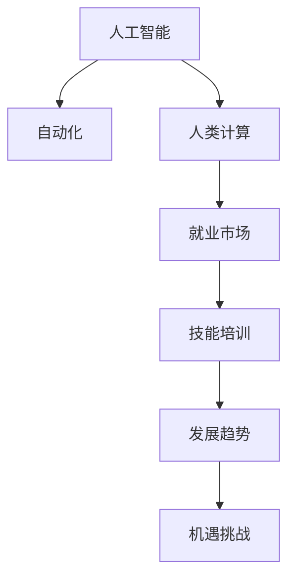

                 

# 人类计算：AI时代的未来就业市场与技能培训发展趋势分析机遇挑战机遇预测

> 关键词：人工智能(AI), 自动化, 人类计算, 就业市场, 技能培训, 发展趋势, 机遇挑战

## 1. 背景介绍

### 1.1 问题由来
随着人工智能技术的快速发展，特别是深度学习、自然语言处理(NLP)、计算机视觉(CV)等领域的突破，AI正在加速融入各行各业，带来革命性的变革。这一进程不仅改变了企业的运营方式，也深刻影响了劳动力市场和就业结构。传统的人工操作逐渐被AI系统所替代，需要大量高技能工人来设计、维护和监督这些系统。与此同时，AI技术也带来了新的就业机会，如数据分析师、AI工程师、数据科学家等岗位，需要具备不同层次和广度的技能。

### 1.2 问题核心关键点
本文聚焦于AI时代下劳动力市场的变化，分析技能培训在适应这一变化中的角色和挑战。具体关键点包括：

- 自动化和AI技术对就业市场的影响。
- 技能培训在培养未来技术工人和适应AI需求中的作用。
- 未来就业市场的趋势预测与机遇。
- 当前技能培训体系面临的挑战及解决方案。
- 政策制定者和教育机构在应对AI变革中的作用。

### 1.3 问题研究意义
研究AI时代下劳动力市场的变化及其对技能培训的影响，对于制定教育政策和提升劳动力素质具有重要意义。了解AI技术对就业市场的深远影响，可以帮助企业和个人更好地适应新的就业环境，促进经济的可持续发展。此外，推动技能培训体系改革，可以为AI技术的普及和发展提供有力的人才支持，促进社会整体的智能化进步。

## 2. 核心概念与联系

### 2.1 核心概念概述

为更好地理解AI时代下劳动力市场的变化及其对技能培训的影响，本节将介绍几个关键概念：

- **人工智能(AI)**：通过机器学习、深度学习、自然语言处理等技术，使机器能够模拟人类智能，完成特定任务。
- **自动化**：通过软件、机器人等技术，将原本需要人工完成的任务自动化，提高效率和精度。
- **人类计算**：指在AI系统中，使用人类智慧和创造力进行计算和决策的过程。
- **就业市场**：涉及各行各业的劳动力需求、供给和流动情况。
- **技能培训**：通过教育、培训等方式提升个人和组织的技能水平，适应技术变革和市场需求。
- **发展趋势**：指AI技术对就业市场和技能培训的影响，以及未来的变化方向。
- **机遇挑战**：指AI技术带来的新机会与现有技术、教育体系的冲突和挑战。

这些概念之间的逻辑关系可以通过以下Mermaid流程图来展示：



这个流程图展示了一些关键概念的联系和互动：

1. 人工智能通过自动化改变就业市场，增加对高技能劳动力的需求。
2. 自动化技术推动了人类计算的发展，使得更多复杂任务能够由人机协作完成。
3. 就业市场受AI技术影响，需要相应调整技能培训体系以培养未来技术工人。
4. 技能培训响应就业市场的变化，推动人才结构的转型和升级。
5. 发展趋势预测未来就业市场和技能培训的走向，指导政策和教育改革。
6. 机遇挑战需要在不断探索中，找到适应AI时代的教育模式和技能培训方法。

## 3. 核心算法原理 & 具体操作步骤
### 3.1 算法原理概述

本文从经济学的角度，分析AI技术对劳动力市场的双重影响。AI技术通过自动化取代重复性劳动，解放了人类从繁琐任务中解脱出来，专注于更有创造性和复杂性的工作。同时，AI的发展也创造了许多新的岗位，如AI算法工程师、数据科学家、机器学习工程师等。这些新岗位对技术和知识的要求更高，需要更多的人工智能、计算机科学、数据科学等相关领域的技能。

### 3.2 算法步骤详解

AI时代下劳动力市场和技能培训的优化，主要包括以下几个关键步骤：

1. **就业市场分析**：利用经济学模型和经济数据，分析AI技术对就业市场结构的影响，识别出高需求和高风险的行业和岗位。
2. **技能需求评估**：通过行业调研和专家访谈，评估AI技术在特定领域的应用情况和所需技能类型，区分基础技能和高级技能的需求。
3. **技能培训策略制定**：基于技能需求评估，制定针对性的技能培训计划，包括课程设计、培训时长、师资配备等。
4. **培训效果评估**：通过跟踪学员就业情况、岗位适应性等指标，评估培训效果，并根据反馈进行调整优化。
5. **政策制定与推广**：结合就业市场和技能培训的现状，提出政策建议，推动相关改革措施的实施和推广。

### 3.3 算法优缺点

AI时代下劳动力市场和技能培训的优化算法具有以下优点：

- **效率提升**：通过大数据分析和预测模型，能够快速识别技能需求和优化培训内容。
- **针对性更强**：能够针对特定行业和岗位，定制化培训计划，提高培训效果。
- **适应性强**：能够及时响应技术变革，调整培训策略，提升培训体系灵活性。

同时，也存在一些缺点：

- **数据质量和可靠性问题**：技能需求评估和市场分析依赖于数据，数据质量不佳或数据偏差可能导致分析结果失准。
- **培训效果难以量化**：技能培训的效果评估复杂且难以量化，存在主观判断偏差。
- **政策执行难度**：政策制定和推广涉及多方利益博弈，实施难度大。

### 3.4 算法应用领域

AI时代下劳动力市场和技能培训的优化算法，已在以下领域得到应用：

- **高等教育**：为大学和学院提供课程设计和师资培养建议，提升教育质量。
- **职业培训机构**：帮助职业培训机构设计培训计划，提升学员就业竞争力。
- **企业培训**：为各类企业制定员工培训计划，提升员工技能和绩效。
- **政府政策制定**：为政策制定者提供数据分析和政策建议，支持教育改革和技能提升政策实施。

## 4. 数学模型和公式 & 详细讲解 & 举例说明

### 4.1 数学模型构建

为了更好地描述AI时代下劳动力市场和技能培训的优化过程，本节将使用数学模型进行建模和推导。

假设劳动力市场中共有 $N$ 种工作岗位，其中 $K$ 种岗位由AI自动化替代，$M$ 种岗位需求增加，$N-K-M$ 种岗位需求减少。令 $S_k$ 表示第 $k$ 种岗位的劳动需求，则总劳动需求 $S$ 可表示为：

$$
S = \sum_{k=1}^{N} S_k
$$

令 $C_k$ 表示第 $k$ 种岗位的培训成本，则总培训成本 $C$ 可表示为：

$$
C = \sum_{k=1}^{N} C_k
$$

我们的目标是最大化总劳动需求 $S$，同时控制总培训成本 $C$ 在可接受范围内。

### 4.2 公式推导过程

为了求解这一优化问题，我们采用线性规划方法。构建目标函数：

$$
\max \sum_{k=1}^{N} S_k \quad \text{subject to:} \quad \sum_{k=1}^{N} S_k - \sum_{k=1}^{K} S_k - \sum_{k=1}^{M} S_k = 0
$$

$$
\sum_{k=1}^{N} C_k \leq C_{max}
$$

其中 $C_{max}$ 表示培训成本的上限。通过求解上述线性规划问题，可以得到最优的 $S_k$ 值，即每一种岗位的劳动需求。

### 4.3 案例分析与讲解

假设某地区有三种岗位：简单劳动岗位（$k=1$）、中等技术岗位（$k=2$）、高级技能岗位（$k=3$）。通过数据分析得知，简单劳动岗位需求减少50%，中等技术岗位需求增加20%，高级技能岗位需求增加40%。培训成本分别为 $C_1=10,000$、$C_2=50,000$、$C_3=100,000$，培训成本上限为 $C_{max}=150,000$。

代入公式，得到：

$$
\max S_1 + S_2 + S_3 \quad \text{subject to:} \quad S_1 - 0.5S_1 - 0.2S_2 - 0.4S_3 = 0
$$

$$
10,000S_1 + 50,000S_2 + 100,000S_3 \leq 150,000
$$

通过线性规划求解，得到 $S_1=5,000$、$S_2=20,000$、$S_3=30,000$，表示简单劳动岗位减少到5,000个，中等技术岗位增加到20,000个，高级技能岗位增加到30,000个。这种培训方案在满足成本上限的同时，能够最大化总劳动需求。

## 5. 项目实践：代码实例和详细解释说明
### 5.1 开发环境搭建

在进行劳动力市场和技能培训的优化算法实践前，我们需要准备好开发环境。以下是使用Python进行优化算法开发的环境配置流程：

1. 安装Anaconda：从官网下载并安装Anaconda，用于创建独立的Python环境。

2. 创建并激活虚拟环境：
```bash
conda create -n optimization-env python=3.8 
conda activate optimization-env
```

3. 安装必要的Python包：
```bash
pip install numpy scipy pandas scikit-learn matplotlib
```

4. 安装优化算法库：
```bash
pip install cvxpy
```

完成上述步骤后，即可在`optimization-env`环境中开始优化算法实践。

### 5.2 源代码详细实现

我们使用CVXpy库来实现上述线性规划问题的求解。以下是一个基本的实现示例：

```python
import cvxpy as cp
import numpy as np

# 定义变量
S = cp.Variable(n)
C = cp.sum(cp.multiply(C_k, S_k))

# 目标函数
objective = cp.Maximize(cp.sum(S_k))

# 约束条件
constraint1 = cp.sum(S_k) - cp.sum(S_k[0:K]) - cp.sum(S_k[K:M]) == 0
constraint2 = cp.sum(C_k) <= C_max

# 求解
problem = cp.Problem(objective, [constraint1, constraint2])
problem.solve()

# 输出最优解
print("Optimal solution:", S.value)
```

### 5.3 代码解读与分析

让我们再详细解读一下关键代码的实现细节：

**变量定义**：
- `S`：总劳动需求。
- `C`：总培训成本。

**目标函数**：
- `objective`：最大化总劳动需求 $S$。

**约束条件**：
- `constraint1`：总劳动需求等于被AI替代的简单劳动岗位需求和增加的岗位需求。
- `constraint2`：总培训成本不超过上限 $C_{max}$。

**求解过程**：
- `problem = cp.Problem(objective, [constraint1, constraint2])`：构建优化问题。
- `problem.solve()`：求解优化问题。
- `print("Optimal solution:", S.value)`：输出最优解。

可以看到，通过CVXpy库，我们能够高效地求解线性规划问题，实现劳动力市场和技能培训的优化。

## 6. 实际应用场景
### 6.1 智能制造

AI技术的引入使得智能制造成为可能。在传统制造行业中，大量重复性、劳动密集型的工作被自动化设备所取代，人类操作逐渐被机器人、智能监控系统等替代。这不仅提高了生产效率，也减少了安全事故和劳动强度。

企业在实施智能制造的过程中，需要大量的AI工程师、数据科学家等高技能人才来设计、维护和优化智能系统。同时，对于现有的员工，也需要进行技能培训，以适应新的岗位要求。这为技能培训提供了新的机遇，也带来了新的挑战。

### 6.2 医疗健康

AI在医疗健康领域的应用越来越广泛。通过AI技术，可以实现精准医疗、影像分析、病患监护等功能。例如，AI算法可以通过分析患者的历史数据，预测疾病风险，制定个性化治疗方案。这需要大量的数据科学家、AI工程师等高技能人才。

同时，AI技术的应用也对医疗行业的从业者提出了新的要求。医护人员需要掌握基本的数据处理、机器学习等技能，以适应AI辅助诊疗环境。这需要教育和培训机构不断更新课程，培养具备跨领域技能的技术工人。

### 6.3 金融科技

金融科技的发展推动了金融行业的数字化转型。AI技术在风险管理、交易分析、客户服务等领域发挥了重要作用。例如，AI算法可以通过分析大量的金融数据，预测市场趋势，优化投资组合。这需要大量具备金融知识和技术背景的AI工程师。

同时，金融行业也需要对现有的员工进行技能培训，使其掌握AI技术的基本应用。这为金融机构提供了技能培训的新机会，也提出了新的挑战。

### 6.4 未来应用展望

随着AI技术的不断进步，其在更多领域的应用前景广阔。未来，AI将进一步渗透到交通、教育、公共服务等各行各业，带来更多新机遇和新挑战。

在交通领域，自动驾驶技术的普及将大幅改变驾驶员的工作岗位，需要大量高技能人才来设计、测试和维护自动驾驶系统。在教育领域，AI技术将个性化教育成为可能，需要具备教育技术背景的AI工程师。在公共服务领域，智能城市的建设将带来更多新岗位，需要大量具备城市管理技能的AI工程师。

## 7. 工具和资源推荐
### 7.1 学习资源推荐

为了帮助开发者和教育工作者系统掌握AI时代下劳动力市场和技能培训的理论基础和实践技巧，这里推荐一些优质的学习资源：

1. **《人工智能经济学》**：全面介绍AI技术对劳动力市场和就业结构的影响，探讨政策制定和技能培训策略。
2. **Coursera《AI对劳动力市场的影响》课程**：斯坦福大学开设的在线课程，深入分析AI技术对不同行业的就业影响。
3. **《未来工作：技能、自动化与劳动》书籍**：探讨AI技术对未来工作的挑战和机遇，提出技能培训和教育改革的建议。
4. **LinkedIn Learning《AI与自动化》课程**：涵盖AI技术和自动化的基础知识，帮助理解未来工作环境的变化。
5. **国际人工智能教育大会**：汇集全球顶尖AI专家和教育工作者，分享最新研究成果和实践经验。

通过对这些资源的学习实践，相信你一定能够更好地理解AI时代下劳动力市场和技能培训的挑战和机遇，为未来的教育和职业发展做好准备。
###  7.2 开发工具推荐

高效的开发离不开优秀的工具支持。以下是几款用于劳动力市场和技能培训优化算法的常用工具：

1. **CVXpy**：Python中的CVXpy库，提供强大的优化工具，支持线性规划、整数规划等多种优化问题求解。
2. **SciPy**：Python中的科学计算库，提供多种数学函数和算法，支持矩阵运算、统计分析等。
3. **Pandas**：Python中的数据处理库，支持数据清洗、转换、分析等多种数据处理功能。
4. **Matplotlib**：Python中的绘图库，支持多种图表类型，方便可视化分析结果。
5. **Jupyter Notebook**：Python中的交互式笔记本，方便进行代码编写和结果展示。

合理利用这些工具，可以显著提升劳动力市场和技能培训优化算法的开发效率，加快创新迭代的步伐。

### 7.3 相关论文推荐

AI时代下劳动力市场和技能培训的研究源于学界的持续研究。以下是几篇奠基性的相关论文，推荐阅读：

1. **“AI对劳动力市场的影响”**：从经济学的角度探讨AI技术对就业市场的双重影响，提出政策建议和技能培训方案。
2. **“技能培训与AI技术的未来”**：分析技能培训在AI技术普及过程中的角色和挑战，提出未来技能培训体系改革的建议。
3. **“AI技术的就业创造与替代效应”**：通过实证研究，量化AI技术对不同行业的就业影响，提出适应性技能培训策略。
4. **“未来工作的技能需求”**：探讨未来工作环境的变化，提出技能培训和教育改革的路线图。
5. **“AI时代的教育改革”**：分析AI技术对教育的影响，提出未来教育体系的变革方向和实施路径。

这些论文代表了大语言模型微调技术的发展脉络。通过学习这些前沿成果，可以帮助研究者把握学科前进方向，激发更多的创新灵感。

## 8. 总结：未来发展趋势与挑战
### 8.1 总结

本文对AI时代下劳动力市场和技能培训的理论和实践进行了全面系统的介绍。首先，从经济学的角度，分析了AI技术对就业市场和技能培训的影响。其次，通过数学模型和优化算法，探讨了劳动力市场和技能培训的优化策略。再次，结合实际应用场景，展示了AI技术在不同领域的应用前景。最后，提供了工具和资源推荐，帮助读者进一步深入学习。

通过本文的系统梳理，可以看到，AI时代下劳动力市场和技能培训正面临着前所未有的挑战和机遇。AI技术改变了劳动力需求和岗位结构，提出了对高技能人才的迫切需求。同时，AI技术的应用也带来了新的就业机会，需要技能培训体系进行相应的调整和优化。

### 8.2 未来发展趋势

展望未来，AI时代下劳动力市场和技能培训的发展趋势包括以下几个方面：

1. **高技能岗位需求增加**：AI技术对复杂劳动的替代将减少简单劳动岗位，增加对高技能岗位的需求。
2. **跨领域技能需求提升**：AI技术的普及需要更多具备跨领域知识的复合型人才。
3. **个性化培训需求增加**：AI技术将个性化学习成为可能，需要更加定制化的培训方案。
4. **终身学习成为常态**：AI技术的快速发展要求劳动者持续学习，不断更新知识和技能。
5. **技能培训与职业教育融合**：未来的教育体系将更加注重技能培训和职业教育的结合，培养适应未来工作环境的技术工人。
6. **政策支持力度加大**：政府将出台更多政策和资金支持，推动技能培训体系的改革和优化。

### 8.3 面临的挑战

尽管AI技术的发展为劳动力市场和技能培训带来了新的机遇，但也面临着诸多挑战：

1. **教育资源不均衡**：不同地区和群体的教育资源差异，可能影响技能培训的普及和效果。
2. **技术更新快**：AI技术的快速迭代要求技能培训体系灵活应变，难以跟上技术进步的步伐。
3. **培训效果难以量化**：技能培训的效果评估复杂且难以量化，存在主观判断偏差。
4. **政策执行难度大**：技能培训的政策制定和推广涉及多方利益博弈，实施难度大。
5. **终身学习机制不足**：缺乏有效的激励机制，劳动者难以持续参与终身学习。

### 8.4 研究展望

面对AI技术带来的挑战，未来的研究需要在以下几个方面寻求新的突破：

1. **数据驱动的技能培训**：利用大数据和机器学习技术，预测未来技能需求，制定更加精准的培训计划。
2. **多模态技能培训**：将AI技术、数据分析等融入技能培训，提升培训效果和适应性。
3. **终身学习平台**：构建开放、灵活的终身学习平台，支持技能培训和知识更新。
4. **政策支持体系**：建立有效的政策支持体系，推动技能培训体系的改革和优化。
5. **多方协同合作**：政府、企业、教育机构等多方协同合作，共同推动技能培训的发展。

这些研究方向将引领劳动力市场和技能培训的进步，为AI技术的普及和发展提供有力的人才支持。只有在多方协同合作下，才能构建适应未来工作环境的劳动力体系，促进经济的可持续发展。

## 9. 附录：常见问题与解答

**Q1：AI技术对就业市场的影响有哪些？**

A: AI技术对就业市场的影响主要体现在以下几个方面：

1. **替代低技能岗位**：AI技术可以自动化重复性和劳动密集型的工作，如数据录入、客服等，减少这些岗位的需求。
2. **创造新岗位**：AI技术的发展催生了新的岗位需求，如AI工程师、数据分析师、机器学习专家等，需要具备高技能的劳动者。
3. **提升生产效率**：AI技术可以优化生产流程，提高生产效率，减少对低技能劳动力的依赖。
4. **改变工作性质**：AI技术可以改变工作性质，从机械性劳动转向更多需要创造性思维和复杂技能的工作。

**Q2：如何应对AI技术带来的挑战？**

A: 应对AI技术带来的挑战需要多方共同努力：

1. **提升教育质量**：加强基础教育和职业教育，提升劳动者的素质和技能。
2. **政策支持**：政府出台更多政策支持技能培训和终身学习。
3. **多方协同**：企业、教育机构、政府等多方合作，共同推动技能培训的发展。
4. **灵活培训体系**：构建灵活的培训体系，适应AI技术快速迭代的要求。
5. **终身学习机制**：建立有效的激励机制，推动劳动者持续参与终身学习。

**Q3：技能培训在AI时代下的重要性有哪些？**

A: 技能培训在AI时代下的重要性主要体现在以下几个方面：

1. **提升竞争力**：AI技术的普及要求劳动者具备更高的技能水平，技能培训可以提升劳动者的竞争力。
2. **适应新技术**：AI技术的快速发展要求劳动者不断更新知识和技能，适应新技术环境。
3. **促进经济增长**：高技能的劳动者可以推动技术创新和产业升级，促进经济增长。
4. **社会稳定**：技能培训可以帮助劳动者更好地适应工作环境的变化，减少失业率，维护社会稳定。

**Q4：未来技能培训的发展趋势有哪些？**

A: 未来技能培训的发展趋势包括：

1. **数据驱动培训**：利用大数据和机器学习技术，预测未来技能需求，制定更加精准的培训计划。
2. **多模态培训**：将AI技术、数据分析等融入技能培训，提升培训效果和适应性。
3. **终身学习平台**：构建开放、灵活的终身学习平台，支持技能培训和知识更新。
4. **个性化培训**：根据个人的学习偏好和职业发展需求，设计个性化的培训方案。
5. **跨领域培训**：培养具备跨领域知识的复合型人才，适应未来工作环境的要求。

---

作者：禅与计算机程序设计艺术 / Zen and the Art of Computer Programming

