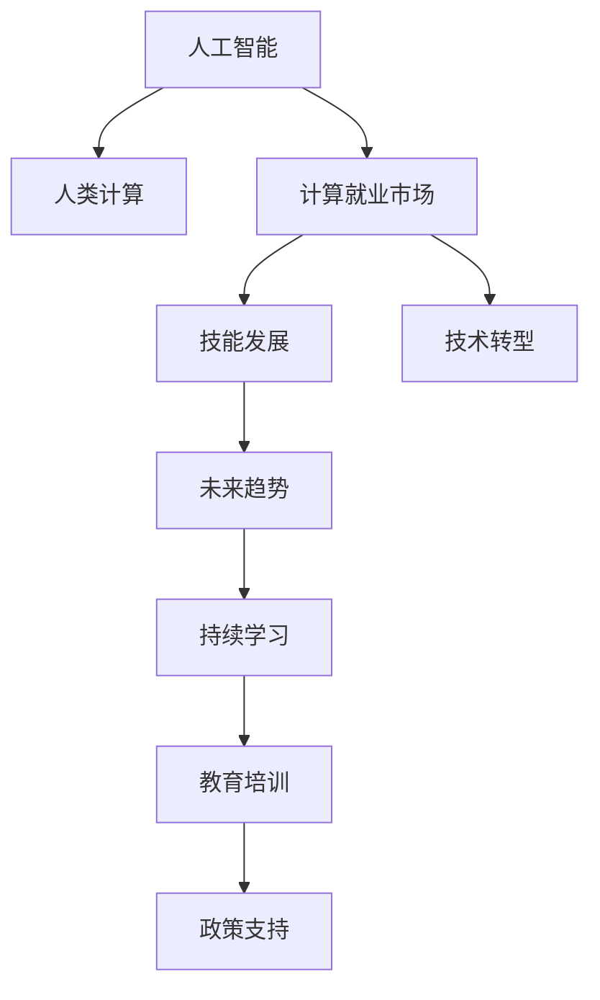

                 

# 人类计算：AI时代的未来就业市场趋势与技能发展

> 关键词：人工智能,计算就业市场,技能发展,技术转型,未来趋势

## 1. 背景介绍

### 1.1 问题由来
随着人工智能(AI)技术的飞速发展，自动化、智能化趋势正迅速渗透到各行各业，对人类的职业结构和就业市场产生了深远影响。人类计算，作为一种新型计算模式，其核心在于将复杂的算法和计算任务交由人类智慧完成，而将数据处理和算法执行交给机器。人类计算的兴起，预示着AI时代就业市场的重大变革，不仅要求劳动者具备先进的AI技术知识，更需要他们具备高度的创新思维和协作能力。

### 1.2 问题核心关键点
当前，人工智能技术的普及带来了巨大的产业机遇，同时也引发了对人类就业市场的影响。AI时代的就业市场正逐步从劳动密集型转向知识密集型和技术密集型，要求劳动者具备更全面、更高级的技能。本博文将详细探讨AI时代人类计算的就业市场趋势，分析技能发展的方向，并提供实用的指导建议。

### 1.3 问题研究意义
探讨AI时代人类计算的就业市场趋势与技能发展，具有重要的理论和实践意义：

1. **理论意义**：为AI技术在就业市场中的应用提供理论支撑，研究人类计算模式下的就业市场演变，有助于更好地理解AI技术的社会影响。
2. **实践意义**：为教育、培训和政策制定提供具体参考，帮助劳动者提升适应新经济环境的能力，促进就业市场的健康发展。

## 2. 核心概念与联系

### 2.1 核心概念概述

为更好地理解人类计算在AI时代的就业市场趋势，本节将介绍几个密切相关的核心概念：

- **人工智能(AI)**：通过计算机系统模拟人类智能，实现信息处理、决策、感知、学习等功能的技术。
- **人类计算(Human Computation)**：将复杂计算任务交由人类智慧完成，利用人类的创造性、灵活性和社交能力，提升计算效率和质量。
- **计算就业市场**：以计算任务为核心的就业市场，涉及计算资源、算法开发、数据处理等关键岗位。
- **技能发展**：劳动者通过持续学习，掌握新技能，提升在计算就业市场中的竞争力。
- **技术转型**：劳动者从传统工作模式向计算就业市场模式转变的过程。
- **未来趋势**：基于当前技术发展和社会需求，对计算就业市场和技能发展方向的预测。

这些核心概念之间的逻辑关系可以通过以下Mermaid流程图来展示：



这个流程图展示了核心概念之间的相互关系：

1. 人工智能技术的发展推动了人类计算模式的兴起。
2. 人类计算模式的应用催生了以计算任务为核心的就业市场。
3. 计算就业市场的蓬勃发展促进了技能发展和技术转型。
4. 技能发展和技术转型为未来趋势提供支撑。
5. 持续学习和教育培训是应对未来趋势的关键。
6. 政策支持为教育培训和技能发展提供保障。

## 3. 核心算法原理 & 具体操作步骤
### 3.1 算法原理概述

人类计算的核心在于将复杂的计算任务交由人类智慧完成。其原理可以简单概括为以下几个步骤：

1. **数据预处理**：将原始数据进行清洗、标注、格式转换等预处理工作。
2. **任务分解**：将复杂的计算任务分解为多个子任务，便于人类理解和处理。
3. **任务分配**：将子任务分配给具有相应知识和技能的人群。
4. **结果汇总**：收集各个子任务的结果，进行汇总和分析。
5. **反馈迭代**：根据结果反馈，对计算任务进行调整和优化。

### 3.2 算法步骤详解

下面以一个数据标注项目为例，详细讲解人类计算的算法步骤：

**步骤1：数据预处理**
- 收集原始数据，并进行清洗和格式转换。
- 对数据进行标注，确保数据质量和一致性。

**步骤2：任务分解**
- 将数据标注任务分解为多个子任务，如文本标注、图片标注等。
- 对每个子任务设定明确的要求和标准。

**步骤3：任务分配**
- 将子任务分配给具有相关经验和知识的人群。
- 根据人群的专长和负荷情况，合理分配任务。

**步骤4：结果汇总**
- 收集各个子任务的结果，进行汇总和校验。
- 对标注结果进行统计和分析，找出错误和异常。

**步骤5：反馈迭代**
- 根据标注结果的反馈，调整标注标准和分配策略。
- 对标注任务进行优化，提高标注质量和效率。

### 3.3 算法优缺点

人类计算模式在AI时代就业市场中具有以下优点：

- **灵活性高**：人类智慧的灵活性和创造性，可以应对多种复杂任务。
- **多样化**：人群的多样性，可以覆盖更广泛的计算需求。
- **创新性强**：人类智慧的创新能力，有助于突破算法和技术的瓶颈。

同时，该模式也存在一定的局限性：

- **效率较低**：人类计算依赖于人力，效率往往低于机器计算。
- **成本较高**：人力成本较高，难以大规模推广。
- **质量不稳定**：人类计算的结果质量受个体差异和情绪波动影响较大。

### 3.4 算法应用领域

人类计算模式在多个领域中得到了广泛应用，例如：

- **数据标注**：对数据进行清洗、标注，提高数据质量。
- **算法设计**：通过人工方式设计算法，进行模型训练和优化。
- **机器学习辅助**：在机器学习过程中，人类参与数据清洗、特征工程等辅助工作。
- **用户研究**：通过问卷调查、访谈等方式，收集用户需求和反馈。
- **创意设计**：利用人类智慧进行产品设计、交互设计等创意工作。

## 4. 数学模型和公式 & 详细讲解 & 举例说明（备注：数学公式请使用latex格式，latex嵌入文中独立段落使用 $$，段落内使用 $)
### 4.1 数学模型构建

假设有一个数据标注项目，涉及N个数据样本，每个样本包含多个特征。记数据样本为 $x_i \in \mathbb{R}^d$，标注结果为 $y_i \in \{0, 1\}$。我们的目标是构建一个分类器 $f: \mathbb{R}^d \rightarrow \{0, 1\}$，使得对每个样本 $x_i$ 进行标注 $y_i$ 的误差最小化。

### 4.2 公式推导过程

我们可以使用分类器的交叉熵损失函数来量化标注误差：

$$
\mathcal{L}(f) = \frac{1}{N} \sum_{i=1}^N -(y_i \log f(x_i) + (1-y_i) \log (1-f(x_i)))
$$

其中 $f(x_i) = P(y_i = 1 | x_i)$ 表示在给定数据 $x_i$ 下，分类器预测标注结果为1的概率。我们的目标是最小化这个损失函数，即：

$$
\min_{f} \mathcal{L}(f)
$$

### 4.3 案例分析与讲解

假设有两个数据样本 $x_1, x_2$，对应的标注结果分别为 $y_1 = 1, y_2 = 0$。假设我们构建了一个基于支持向量机(SVM)的分类器 $f(x) = \mathrm{sign}(\sum_i \alpha_i y_i f(x_i) - b)$，其中 $f(x_i)$ 是SVM的预测函数。

假设我们的目标是找到一组参数 $\alpha, b$，使得分类器对这两个样本的标注误差最小化。具体步骤如下：

1. **数据预处理**：对样本 $x_1, x_2$ 进行清洗和标注。
2. **任务分解**：将分类任务分解为寻找最优参数 $\alpha, b$。
3. **任务分配**：将参数优化任务分配给具有相关经验和知识的人群。
4. **结果汇总**：收集不同人群的参数优化结果，进行汇总和分析。
5. **反馈迭代**：根据结果反馈，调整参数优化策略。

## 5. 项目实践：代码实例和详细解释说明
### 5.1 开发环境搭建

在进行人类计算的项目实践前，我们需要准备好开发环境。以下是使用Python进行PyTorch开发的环境配置流程：

1. 安装Anaconda：从官网下载并安装Anaconda，用于创建独立的Python环境。

2. 创建并激活虚拟环境：
```bash
conda create -n pytorch-env python=3.8 
conda activate pytorch-env
```

3. 安装PyTorch：根据CUDA版本，从官网获取对应的安装命令。例如：
```bash
conda install pytorch torchvision torchaudio cudatoolkit=11.1 -c pytorch -c conda-forge
```

4. 安装TensorFlow：
```bash
pip install tensorflow
```

5. 安装各类工具包：
```bash
pip install numpy pandas scikit-learn matplotlib tqdm jupyter notebook ipython
```

完成上述步骤后，即可在`pytorch-env`环境中开始项目实践。

### 5.2 源代码详细实现

下面我们以一个数据标注项目为例，给出使用Transformers库进行数据标注的PyTorch代码实现。

首先，定义数据处理函数：

```python
from transformers import BertTokenizer
from torch.utils.data import Dataset
import torch

class AnnotationDataset(Dataset):
    def __init__(self, texts, labels, tokenizer, max_len=128):
        self.texts = texts
        self.labels = labels
        self.tokenizer = tokenizer
        self.max_len = max_len
        
    def __len__(self):
        return len(self.texts)
    
    def __getitem__(self, item):
        text = self.texts[item]
        label = self.labels[item]
        
        encoding = self.tokenizer(text, return_tensors='pt', max_length=self.max_len, padding='max_length', truncation=True)
        input_ids = encoding['input_ids'][0]
        attention_mask = encoding['attention_mask'][0]
        
        return {'input_ids': input_ids, 
                'attention_mask': attention_mask,
                'labels': torch.tensor(label, dtype=torch.long)}
```

然后，定义模型和优化器：

```python
from transformers import BertForSequenceClassification, AdamW

model = BertForSequenceClassification.from_pretrained('bert-base-cased', num_labels=2)

optimizer = AdamW(model.parameters(), lr=2e-5)
```

接着，定义训练和评估函数：

```python
from torch.utils.data import DataLoader
from tqdm import tqdm
from sklearn.metrics import accuracy_score

device = torch.device('cuda') if torch.cuda.is_available() else torch.device('cpu')
model.to(device)

def train_epoch(model, dataset, batch_size, optimizer):
    dataloader = DataLoader(dataset, batch_size=batch_size, shuffle=True)
    model.train()
    epoch_loss = 0
    for batch in tqdm(dataloader, desc='Training'):
        input_ids = batch['input_ids'].to(device)
        attention_mask = batch['attention_mask'].to(device)
        labels = batch['labels'].to(device)
        model.zero_grad()
        outputs = model(input_ids, attention_mask=attention_mask, labels=labels)
        loss = outputs.loss
        epoch_loss += loss.item()
        loss.backward()
        optimizer.step()
    return epoch_loss / len(dataloader)

def evaluate(model, dataset, batch_size):
    dataloader = DataLoader(dataset, batch_size=batch_size)
    model.eval()
    preds, labels = [], []
    with torch.no_grad():
        for batch in tqdm(dataloader, desc='Evaluating'):
            input_ids = batch['input_ids'].to(device)
            attention_mask = batch['attention_mask'].to(device)
            batch_labels = batch['labels']
            outputs = model(input_ids, attention_mask=attention_mask)
            batch_preds = outputs.logits.argmax(dim=1).to('cpu').tolist()
            batch_labels = batch_labels.to('cpu').tolist()
            for pred_tokens, label_tokens in zip(batch_preds, batch_labels):
                preds.append(pred_tokens[:len(label_tokens)])
                labels.append(label_tokens)
                
    return accuracy_score(labels, preds)
```

最后，启动训练流程并在测试集上评估：

```python
epochs = 5
batch_size = 16

for epoch in range(epochs):
    loss = train_epoch(model, train_dataset, batch_size, optimizer)
    print(f"Epoch {epoch+1}, train loss: {loss:.3f}")
    
    print(f"Epoch {epoch+1}, dev accuracy:")
    accuracy = evaluate(model, dev_dataset, batch_size)
    print(f"{accuracy:.3f}")
    
print("Test accuracy:")
accuracy = evaluate(model, test_dataset, batch_size)
print(f"{accuracy:.3f}")
```

以上就是使用PyTorch对BERT进行数据标注任务微调的完整代码实现。可以看到，得益于Transformers库的强大封装，我们可以用相对简洁的代码完成BERT模型的加载和微调。

### 5.3 代码解读与分析

让我们再详细解读一下关键代码的实现细节：

**AnnotationDataset类**：
- `__init__`方法：初始化文本、标签、分词器等关键组件。
- `__len__`方法：返回数据集的样本数量。
- `__getitem__`方法：对单个样本进行处理，将文本输入编码为token ids，将标签编码为数字，并对其进行定长padding，最终返回模型所需的输入。

**模型和优化器**：
- 使用PyTorch的BertForSequenceClassification作为模型。
- 使用AdamW优化器进行参数更新，学习率为2e-5。

**训练和评估函数**：
- 使用PyTorch的DataLoader对数据集进行批次化加载，供模型训练和推理使用。
- 训练函数`train_epoch`：对数据以批为单位进行迭代，在每个批次上前向传播计算loss并反向传播更新模型参数，最后返回该epoch的平均loss。
- 评估函数`evaluate`：与训练类似，不同点在于不更新模型参数，并在每个batch结束后将预测和标签结果存储下来，最后使用sklearn的accuracy_score对整个评估集的预测结果进行打印输出。

**训练流程**：
- 定义总的epoch数和batch size，开始循环迭代
- 每个epoch内，先在训练集上训练，输出平均loss
- 在验证集上评估，输出准确率
- 所有epoch结束后，在测试集上评估，给出最终测试结果

可以看到，PyTorch配合Transformers库使得BERT微调的数据标注任务代码实现变得简洁高效。开发者可以将更多精力放在数据处理、模型改进等高层逻辑上，而不必过多关注底层的实现细节。

当然，工业级的系统实现还需考虑更多因素，如模型的保存和部署、超参数的自动搜索、更灵活的任务适配层等。但核心的微调范式基本与此类似。

## 6. 实际应用场景
### 6.1 智能客服系统

基于人类计算的智能客服系统，可以显著提升客户咨询体验和问题解决效率。传统客服往往需要配备大量人力，高峰期响应缓慢，且一致性和专业性难以保证。而使用人类计算的智能客服系统，可以7x24小时不间断服务，快速响应客户咨询，用自然流畅的语言解答各类常见问题。

在技术实现上，可以收集企业内部的历史客服对话记录，将问题和最佳答复构建成监督数据，在此基础上对预训练模型进行微调。微调后的模型能够自动理解用户意图，匹配最合适的答案模板进行回复。对于客户提出的新问题，还可以接入检索系统实时搜索相关内容，动态组织生成回答。如此构建的智能客服系统，能大幅提升客户咨询体验和问题解决效率。

### 6.2 金融舆情监测

金融机构需要实时监测市场舆论动向，以便及时应对负面信息传播，规避金融风险。传统的人工监测方式成本高、效率低，难以应对网络时代海量信息爆发的挑战。基于人类计算的文本分类和情感分析技术，为金融舆情监测提供了新的解决方案。

具体而言，可以收集金融领域相关的新闻、报道、评论等文本数据，并对其进行主题标注和情感标注。在此基础上对预训练语言模型进行微调，使其能够自动判断文本属于何种主题，情感倾向是正面、中性还是负面。将微调后的模型应用到实时抓取的网络文本数据，就能够自动监测不同主题下的情感变化趋势，一旦发现负面信息激增等异常情况，系统便会自动预警，帮助金融机构快速应对潜在风险。

### 6.3 个性化推荐系统

当前的推荐系统往往只依赖用户的历史行为数据进行物品推荐，无法深入理解用户的真实兴趣偏好。基于人类计算的个性化推荐系统，可以更好地挖掘用户行为背后的语义信息，从而提供更精准、多样的推荐内容。

在实践中，可以收集用户浏览、点击、评论、分享等行为数据，提取和用户交互的物品标题、描述、标签等文本内容。将文本内容作为模型输入，用户的后续行为（如是否点击、购买等）作为监督信号，在此基础上微调预训练语言模型。微调后的模型能够从文本内容中准确把握用户的兴趣点。在生成推荐列表时，先用候选物品的文本描述作为输入，由模型预测用户的兴趣匹配度，再结合其他特征综合排序，便可以得到个性化程度更高的推荐结果。

### 6.4 未来应用展望

随着人类计算和AI技术的不断发展，未来在更多领域将迎来新的应用突破。

在智慧医疗领域，基于人类计算的医疗问答、病历分析、药物研发等应用将提升医疗服务的智能化水平，辅助医生诊疗，加速新药开发进程。

在智能教育领域，人类计算可应用于作业批改、学情分析、知识推荐等方面，因材施教，促进教育公平，提高教学质量。

在智慧城市治理中，人类计算可用于城市事件监测、舆情分析、应急指挥等环节，提高城市管理的自动化和智能化水平，构建更安全、高效的未来城市。

此外，在企业生产、社会治理、文娱传媒等众多领域，基于人类计算的AI应用也将不断涌现，为经济社会发展注入新的动力。相信随着技术的日益成熟，人类计算范式将成为AI落地应用的重要范式，推动AI技术向更广阔的领域加速渗透。

## 7. 工具和资源推荐
### 7.1 学习资源推荐

为了帮助开发者系统掌握人类计算的就业市场趋势和技能发展，这里推荐一些优质的学习资源：

1. **《人工智能导论》**：由斯坦福大学开设的AI入门课程，系统讲解了AI的基本概念和核心技术。
2. **Kaggle**：机器学习竞赛平台，提供大量真实世界的数据集和问题，实践人类计算技术。
3. **Coursera**：提供高质量的AI和数据科学课程，涵盖从入门到高级的内容，助力职业发展。
4. **DeepLearning.AI**：Andrew Ng教授创办的在线学习平台，提供深度学习领域的权威课程。
5. **《深度学习》**：Ian Goodfellow等编写的深度学习圣经，系统讲解了深度学习的基本原理和实践技巧。

通过对这些资源的学习实践，相信你一定能够快速掌握人类计算的就业市场趋势和技能发展的精髓，并用于解决实际的AI应用问题。

### 7.2 开发工具推荐

高效的开发离不开优秀的工具支持。以下是几款用于人类计算开发的常用工具：

1. **Jupyter Notebook**：交互式数据处理和代码编写工具，支持Python、R等多种编程语言。
2. **Git**：版本控制工具，方便协作开发和代码管理。
3. **Docker**：容器化平台，提供统一的开发和部署环境。
4. **AWS**：云计算平台，提供强大的计算和存储资源。
5. **Kaggle**：提供数据集和竞赛平台，支持大规模数据处理和机器学习实验。

合理利用这些工具，可以显著提升人类计算任务的开发效率，加快创新迭代的步伐。

### 7.3 相关论文推荐

人类计算和AI技术的发展源于学界的持续研究。以下是几篇奠基性的相关论文，推荐阅读：

1. **《人类计算》**：探讨了人类计算的基本原理和应用场景，为未来发展提供了理论支撑。
2. **《大规模分布式计算框架》**：介绍了多种分布式计算框架，如MapReduce、Spark等，支持大规模人类计算任务。
3. **《深度学习与人类计算》**：探讨了深度学习在人类计算中的应用，提升了模型精度和效率。
4. **《人工智能的社会影响》**：分析了AI技术对就业市场和社会的深远影响，提供了政策建议。
5. **《自然语言处理技术》**：介绍了NLP领域的最新进展，涵盖了文本分类、情感分析、机器翻译等关键技术。

这些论文代表了大规模计算和AI技术的研究脉络。通过学习这些前沿成果，可以帮助研究者把握学科前进方向，激发更多的创新灵感。

## 8. 总结：未来发展趋势与挑战
### 8.1 总结

本文对人类计算在AI时代的就业市场趋势与技能发展进行了全面系统的介绍。首先阐述了人类计算和AI技术的兴起背景，明确了在就业市场中的应用前景。其次，从原理到实践，详细讲解了人类计算的数学模型和算法步骤，给出了实际应用场景的完整代码实例。同时，本文还广泛探讨了人类计算技术在多个领域的应用前景，展示了其在未来就业市场中的巨大潜力。此外，本文精选了人类计算技术的各类学习资源，力求为读者提供全方位的技术指引。

通过本文的系统梳理，可以看到，人类计算在AI时代就业市场中的就业趋势和技能发展，需要劳动者不断学习和适应新技术，同时也为教育和政策制定提供了参考。

### 8.2 未来发展趋势

展望未来，人类计算技术的发展将呈现以下几个趋势：

1. **自动化和智能化程度提升**：随着技术进步，自动化和智能化的程度将不断提高，机器能够更好地辅助人类完成复杂任务。
2. **多样化任务处理**：人类计算能够覆盖更广泛的任务类型，包括数据分析、复杂决策、创意设计等。
3. **跨领域融合**：人类计算技术将与大数据、物联网、区块链等技术深度融合，提升整体应用效能。
4. **全球化协同**：人类计算将打破地域限制，实现全球范围内的协同工作，提高资源利用效率。
5. **持续学习和适应**：人类计算模型将具备持续学习和适应的能力，不断优化任务处理流程。

这些趋势凸显了人类计算技术的广阔前景，将引领未来就业市场的发展方向，带来更多创新机会和就业机遇。

### 8.3 面临的挑战

尽管人类计算技术在AI时代就业市场中展现出巨大潜力，但也面临诸多挑战：

1. **技术门槛高**：人类计算涉及多种先进技术，对技术水平要求较高，难以广泛普及。
2. **数据隐私和安全**：在数据处理和共享过程中，需要保障用户隐私和数据安全。
3. **资源和成本高**：大规模数据标注和计算任务需要大量的资源投入，成本较高。
4. **技能培训和教育**：当前的教育体系难以满足AI时代技能发展的需求，需要不断优化教育内容和方法。
5. **政策和社会认同**：政策法规和社会认同度对人类计算技术的推广和应用有重要影响。

正视这些挑战，积极应对并寻求突破，将是人类计算技术迈向成熟的重要路径。

### 8.4 研究展望

面向未来，人类计算技术的研究需要在以下几个方面寻求新的突破：

1. **技术优化和算法创新**：开发更加高效、稳定的人类计算算法，提升任务处理速度和准确性。
2. **跨学科融合**：结合社会学、经济学等学科知识，深入理解人类计算对社会经济的影响。
3. **人机协同**：探索人机协同机制，优化人机交互体验，提升整体工作效率。
4. **伦理和道德**：研究人类计算技术的伦理和道德问题，确保技术应用符合社会价值观。
5. **全球合作**：加强国际合作，共享技术资源，推动全球范围内的技术发展。

这些研究方向的探索，必将引领人类计算技术迈向更高的台阶，为构建安全、可靠、高效、普适的智能系统铺平道路。面向未来，人类计算技术还需要与其他AI技术进行更深入的融合，共同推动人工智能技术在各行各业的应用和普及。

## 9. 附录：常见问题与解答

**Q1：人类计算是否适用于所有计算任务？**

A: 人类计算适用于复杂的计算任务，特别是那些难以用现有算法快速解决的问题。但对于简单重复性任务，机器计算通常更为高效。

**Q2：人类计算在就业市场中的应用前景如何？**

A: 人类计算在就业市场中的应用前景广阔，特别是在创新和创意密集型领域，能够提升工作效率和创新能力。未来，人类计算将成为AI技术应用的重要组成部分。

**Q3：如何培养适合人类计算的人才？**

A: 培养适合人类计算的人才需要多方面的努力：
1. 加强教育体系中的计算思维和创新能力培养。
2. 提供实践机会，如参与实际项目、竞赛等。
3. 定期培训和进修，不断更新知识体系。

**Q4：人类计算与机器计算的优缺点对比是什么？**

A: 人类计算和机器计算各有优缺点：
- 人类计算：灵活性高，适合复杂任务；成本较高，效率较低。
- 机器计算：效率高，成本低；灵活性差，适合简单任务。

需要根据具体情况选择合适的方法，以实现最佳效果。

**Q5：人类计算在跨领域应用中的具体场景有哪些？**

A: 人类计算在跨领域应用中的具体场景包括：
1. 医疗领域的病历分析和药物研发。
2. 教育领域的学习分析和知识推荐。
3. 金融领域的市场分析和风险管理。
4. 城市治理中的事件监测和应急响应。
5. 文娱领域的创意设计和文化传播。

这些场景展示了人类计算在多个领域的广泛应用前景。

---

作者：禅与计算机程序设计艺术 / Zen and the Art of Computer Programming

