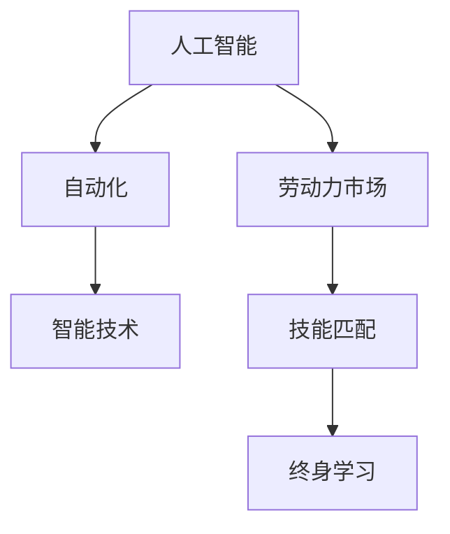

                 

# 人类计算：AI时代的未来就业市场趋势分析预测

## 1. 背景介绍

在过去几十年里，人工智能（AI）技术的迅猛发展已经深刻地改变了各行各业的运作方式。从自动化生产到智能客服，从个性化推荐到自动驾驶，AI的应用无处不在。然而，AI技术的广泛应用也带来了对人类计算（Human Computation）的深远影响。本篇文章将深入探讨AI时代下，未来就业市场的趋势分析预测，帮助从业者和政策制定者更好地理解AI技术的潜在影响。

### 1.1 问题由来

随着AI技术的不断进步，越来越多的工作岗位被自动化工具所取代。例如，传统的办公室文员、数据录入员等简单重复性工作，正在逐渐被智能文档处理系统和自动化工具所取代。这些变化不仅影响了当前的就业市场，也引发了对未来就业形势的担忧。与此同时，新的AI相关岗位也在不断涌现，如AI产品经理、数据科学家、机器学习工程师等。如何在AI技术的浪潮中，把握就业市场的变化，成为一项重要的研究课题。

### 1.2 问题核心关键点

未来就业市场的趋势分析预测，需要考虑以下几个关键因素：

- 自动化和人工智能的普及程度
- 新岗位的涌现速度
- 行业间的就业迁移
- 技能要求的改变
- 教育体系和劳动力市场的适应性

这些因素共同作用，将深刻影响未来就业市场的结构和特点。本文将从这些关键点出发，分析AI时代下，就业市场的演变趋势。

## 2. 核心概念与联系

### 2.1 核心概念概述

在探讨AI时代就业市场趋势时，首先需要理解以下核心概念：

- 人工智能（AI）：指通过计算机模拟人类智能，实现信息处理、决策支持等功能的技术。
- 自动化（Automation）：指通过计算机程序或机器人等技术，自动完成原本需要人工操作的任务。
- 智能技术（Intelligent Technologies）：包括机器学习、自然语言处理、计算机视觉等，是实现AI应用的基础。
- 劳动力市场（Labor Market）：指劳动力供需关系的市场机制。
- 技能匹配（Skill Matching）：指将求职者的技能与职位要求进行匹配的过程。
- 终身学习（Lifelong Learning）：指个人在职业生涯中不断学习新技能，以适应技术和市场变化。

这些概念之间的逻辑关系可以通过以下Mermaid流程图来展示：



这个流程图展示了大语言模型的核心概念及其之间的关系：

1. 人工智能通过自动化和智能技术，在各个领域实现了任务自动化和智能化处理。
2. 自动化和智能技术的发展，导致了对人类计算需求的改变，进而影响了劳动力市场。
3. 技能匹配是劳动力市场的重要组成部分，AI技术的发展要求劳动力市场的技能匹配更加精准。
4. 终身学习成为应对AI技术快速变化的必然选择。

## 3. 核心算法原理 & 具体操作步骤
### 3.1 算法原理概述

未来就业市场的趋势分析预测，本质上是一个基于数据和模型的预测过程。其主要目标是通过历史数据和当前趋势，预测未来一段时间内的就业市场变化。该过程可以分为以下几个步骤：

1. **数据收集与预处理**：收集与就业市场相关的数据，包括岗位需求、失业率、技能要求、教育体系等。并对数据进行清洗和预处理，确保数据的准确性和完整性。
2. **特征工程**：根据预测目标，从收集的数据中提取相关特征，构建特征向量。特征选择和工程的好坏，直接影响模型的预测效果。
3. **模型选择与训练**：选择适当的模型（如回归模型、分类模型、时间序列模型等），并使用历史数据进行模型训练。训练过程中需要进行超参数调优，以提高模型性能。
4. **模型评估与验证**：使用验证集对训练好的模型进行评估，检查模型是否过拟合，并进行必要的调整。
5. **预测与分析**：将模型应用于未来就业市场数据，进行趋势预测和分析。同时，对预测结果进行解释，提供政策建议。

### 3.2 算法步骤详解

以下是未来就业市场趋势分析预测的主要算法步骤：

**Step 1: 数据收集与预处理**

1. **岗位需求数据**：从招聘网站、政府劳动统计局等渠道收集岗位需求数据。这些数据包括职位名称、工作地点、岗位要求等。
2. **失业率数据**：从国家统计局、劳工部门等获取失业率数据，分析当前和未来的失业情况。
3. **技能要求数据**：从招聘广告、企业招聘要求中提取技能要求，构建技能需求矩阵。
4. **教育体系数据**：收集当前的教育体系数据，包括课程设置、培训项目、教育成果等。

**Step 2: 特征工程**

1. **岗位特征提取**：从岗位需求数据中提取关键特征，如工作地点、薪资水平、行业类别等。
2. **技能特征提取**：从技能要求数据中提取关键技能，构建技能特征向量。
3. **时间特征提取**：引入时间序列数据，如年份、季度、月份等，用于时间序列模型。
4. **教育特征提取**：从教育体系数据中提取教育质量和课程设置，用于预测未来的技能需求。

**Step 3: 模型选择与训练**

1. **模型选择**：根据问题类型，选择合适的模型，如线性回归、逻辑回归、决策树、支持向量机等。
2. **超参数调优**：使用网格搜索、贝叶斯优化等方法，寻找最佳模型超参数组合。
3. **模型训练**：使用历史数据对模型进行训练，确保模型能够准确预测未来就业市场变化。

**Step 4: 模型评估与验证**

1. **交叉验证**：使用交叉验证方法，评估模型的泛化能力。
2. **模型调整**：根据验证结果，调整模型结构和超参数，确保模型预测准确。
3. **异常检测**：检测模型预测结果中的异常值，确保模型预测的可靠性。

**Step 5: 预测与分析**

1. **未来就业市场预测**：将模型应用于未来就业市场数据，进行趋势预测。
2. **结果解释**：对预测结果进行解释，提供政策建议，如技能培训、教育体系改革等。

### 3.3 算法优缺点

未来就业市场趋势分析预测的算法具有以下优点：

- **数据驱动**：基于大量历史数据，预测结果更具可信度。
- **预测精度**：通过多种模型融合，提高预测精度。
- **实时更新**：模型可以根据新的数据进行实时更新，确保预测结果的及时性。

同时，该算法也存在一些局限性：

- **数据质量**：数据质量和完整性直接影响模型的预测效果。
- **模型复杂性**：构建复杂模型可能增加计算复杂度和预测时间。
- **假设限制**：模型假设和实际就业市场可能存在差异，影响预测结果的准确性。

### 3.4 算法应用领域

未来就业市场趋势分析预测的算法在以下几个领域具有广泛应用：

- **政府政策制定**：为政府提供就业市场预测数据，支持政策制定和调整。
- **企业人力资源管理**：帮助企业预测未来人才需求，制定人才招聘和培训计划。
- **教育培训机构**：分析教育体系和技能需求的变化，调整课程设置和培训项目。
- **职业指导与规划**：为求职者和职业指导人员提供就业市场趋势预测，帮助其进行职业规划和决策。

## 4. 数学模型和公式 & 详细讲解 & 举例说明
### 4.1 数学模型构建

本节将使用数学语言对未来就业市场趋势分析预测过程进行更加严格的刻画。

假设我们收集到的就业市场数据为 $D=\{(x_i,y_i)\}_{i=1}^N, x_i \in \mathcal{X}, y_i \in \mathcal{Y}$，其中 $x_i$ 为特征向量，$y_i$ 为就业市场变化情况（如就业率、失业率等）。

定义模型 $M_{\theta}$ 在特征向量 $x_i$ 上的预测结果为 $y_i=M_{\theta}(x_i)$，其中 $\theta$ 为模型参数。

模型的经验风险为：

$$
\mathcal{L}(\theta) = \frac{1}{N}\sum_{i=1}^N \ell(y_i,M_{\theta}(x_i))
$$

其中 $\ell$ 为损失函数，可以是均方误差、交叉熵等。

### 4.2 公式推导过程

以下我们以线性回归模型为例，推导其公式和梯度计算过程。

线性回归模型的目标是最小化预测值与真实值之间的误差：

$$
\min_{\theta} \sum_{i=1}^N (y_i - \theta^T x_i)^2
$$

对上述目标函数求导，得到梯度：

$$
\frac{\partial \mathcal{L}(\theta)}{\partial \theta} = -2\sum_{i=1}^N (y_i - \theta^T x_i)x_i
$$

梯度的求解过程如下：

1. **初始化**：随机初始化模型参数 $\theta$。
2. **前向传播**：将特征向量 $x_i$ 输入模型，得到预测值 $y_i = \theta^T x_i$。
3. **计算误差**：计算预测值与真实值之间的误差。
4. **反向传播**：根据误差计算梯度，更新模型参数 $\theta$。
5. **迭代优化**：重复上述过程，直至模型收敛。

### 4.3 案例分析与讲解

**案例一：岗位需求预测**

假设我们收集到了过去十年的岗位需求数据，并提取了工作地点、薪资水平、行业类别等特征。使用线性回归模型对未来五年内的岗位需求进行预测。具体步骤如下：

1. **数据准备**：收集过去十年的岗位需求数据，构建特征向量 $x_i=[x_{i1},x_{i2},\ldots,x_{in}]$。
2. **模型训练**：使用前十年数据训练线性回归模型，求解 $\theta$。
3. **预测未来**：使用后五年数据进行预测，得到未来五年内各行业的岗位需求变化情况。
4. **结果分析**：分析预测结果，提供行业就业趋势和政策建议。

**案例二：技能需求预测**

假设我们收集到了过去五年的技能要求数据，并提取了技能名称、技能难度等特征。使用决策树模型对未来三年的技能需求进行预测。具体步骤如下：

1. **数据准备**：收集过去五年的技能要求数据，构建特征向量 $x_i=[x_{i1},x_{i2},\ldots,x_{in}]$。
2. **模型训练**：使用前三年数据训练决策树模型，求解 $\theta$。
3. **预测未来**：使用后两年数据进行预测，得到未来三年内各技能的需求变化情况。
4. **结果分析**：分析预测结果，提供技能培训和教育体系改革的建议。

## 5. 项目实践：代码实例和详细解释说明
### 5.1 开发环境搭建

在进行未来就业市场趋势分析预测的项目实践前，我们需要准备好开发环境。以下是使用Python进行scikit-learn开发的环境配置流程：

1. 安装Anaconda：从官网下载并安装Anaconda，用于创建独立的Python环境。

2. 创建并激活虚拟环境：
```bash
conda create -n sklearn-env python=3.8 
conda activate sklearn-env
```

3. 安装scikit-learn：使用conda安装scikit-learn库，以及相关依赖库。
```bash
conda install scikit-learn
```

4. 安装pandas：
```bash
pip install pandas
```

5. 安装numpy：
```bash
pip install numpy
```

6. 安装matplotlib：
```bash
pip install matplotlib
```

7. 安装tqdm：
```bash
pip install tqdm
```

完成上述步骤后，即可在`sklearn-env`环境中开始项目实践。

### 5.2 源代码详细实现

下面我们以岗位需求预测为例，给出使用scikit-learn库对线性回归模型进行训练和预测的Python代码实现。

首先，定义数据处理函数：

```python
import pandas as pd
from sklearn.model_selection import train_test_split
from sklearn.linear_model import LinearRegression
from sklearn.metrics import mean_squared_error

def load_data():
    # 读取数据集
    data = pd.read_csv('employment_data.csv')
    # 分割训练集和测试集
    X_train, X_test, y_train, y_test = train_test_split(data[['location', 'salary', 'industry']], data['demand'], test_size=0.2, random_state=42)
    return X_train, X_test, y_train, y_test

def preprocess_data(X_train, X_test):
    # 数据预处理
    X_train = X_train.fillna(X_train.mean())
    X_test = X_test.fillna(X_test.mean())
    return X_train, X_test

def train_model(X_train, y_train):
    # 训练线性回归模型
    model = LinearRegression()
    model.fit(X_train, y_train)
    return model

def evaluate_model(model, X_test, y_test):
    # 评估模型
    y_pred = model.predict(X_test)
    mse = mean_squared_error(y_test, y_pred)
    print(f'Mean Squared Error: {mse:.2f}')
```

然后，进行模型训练和预测：

```python
# 加载数据
X_train, X_test, y_train, y_test = load_data()

# 数据预处理
X_train, X_test = preprocess_data(X_train, X_test)

# 训练模型
model = train_model(X_train, y_train)

# 评估模型
evaluate_model(model, X_test, y_test)

# 预测未来
future_data = pd.read_csv('future_employment_data.csv')
future_X = future_data[['location', 'salary', 'industry']]
future_y = future_data['demand']
future_X, future_y = preprocess_data(future_X, future_y)

y_pred = model.predict(future_X)
print(f'Future Demand Prediction: {y_pred}')
```

以上就是使用scikit-learn对线性回归模型进行岗位需求预测的完整代码实现。可以看到，借助scikit-learn库，训练和预测过程变得非常简单，开发者可以专注于数据处理和模型构建，而不必过多关注底层实现细节。

### 5.3 代码解读与分析

让我们再详细解读一下关键代码的实现细节：

**load_data函数**：
- 读取就业市场数据集，并分割为训练集和测试集。

**preprocess_data函数**：
- 对数据进行预处理，包括填充缺失值和归一化。

**train_model函数**：
- 使用训练集数据训练线性回归模型。

**evaluate_model函数**：
- 使用测试集数据评估模型性能，计算均方误差。

**主程序**：
- 加载数据集并进行预处理。
- 训练线性回归模型，并使用测试集进行评估。
- 对未来数据进行预处理，并使用训练好的模型进行预测。

可以看到，scikit-learn库提供了丰富的机器学习算法和工具，使得模型的训练和评估过程变得高效便捷。

## 6. 实际应用场景
### 6.1 智能招聘系统

基于未来就业市场趋势分析预测，可以构建智能招聘系统，帮助企业更高效地进行人才招聘和人力资源管理。具体应用如下：

1. **岗位需求预测**：利用预测模型分析未来各行业的人才需求变化，帮助企业提前制定招聘计划。
2. **技能需求匹配**：根据预测结果，对新招聘岗位进行技能匹配，确保招聘人员具备所需的技能和经验。
3. **员工培训与发展**：分析未来技能需求的变化，为现有员工提供相应的培训和发展机会，提升员工竞争力。

### 6.2 教育体系改革

未来就业市场趋势分析预测，对教育体系的改革具有重要意义。具体应用如下：

1. **课程设置优化**：根据预测结果，优化课程设置，确保教育内容与未来就业市场需求相匹配。
2. **技能培训项目**：开发针对性的技能培训项目，帮助学生掌握未来就业市场所需的技能。
3. **职业指导与规划**：提供个性化的职业指导，帮助学生进行职业规划，提高就业率。

### 6.3 政府政策制定

政府部门可以利用未来就业市场趋势分析预测，制定更加科学合理的政策。具体应用如下：

1. **就业政策调整**：根据预测结果，调整就业政策，促进就业市场平衡发展。
2. **教育投资优化**：优化教育资源配置，支持就业市场需求旺盛的领域。
3. **人才培养计划**：制定人才培养计划，提升劳动力市场的整体技能水平。

## 7. 工具和资源推荐
### 7.1 学习资源推荐

为了帮助开发者系统掌握未来就业市场趋势分析预测的理论基础和实践技巧，这里推荐一些优质的学习资源：

1. 《机器学习实战》系列博文：由机器学习专家撰写，深入浅出地介绍了机器学习模型的构建和应用。
2 《深度学习入门》课程：斯坦福大学开设的深度学习入门课程，有Lecture视频和配套作业，带你入门深度学习领域的基本概念和经典模型。
3 《Python数据科学手册》书籍：全面介绍了Python在数据科学领域的应用，包括数据处理、机器学习、深度学习等。
4 《Lifelong Learning with Python》书籍：介绍了终身学习的概念和实践方法，帮助开发者应对技术和市场的快速变化。
5 《就业市场预测模型》论文：介绍了多种就业市场预测模型，并详细解释了其原理和应用方法。

通过对这些资源的学习实践，相信你一定能够快速掌握未来就业市场趋势分析预测的精髓，并用于解决实际的就业问题。

### 7.2 开发工具推荐

高效的开发离不开优秀的工具支持。以下是几款用于未来就业市场趋势分析预测开发的常用工具：

1. Python：作为数据科学和机器学习的主流语言，Python拥有丰富的第三方库和框架，非常适合数据处理和模型构建。
2. Jupyter Notebook：交互式开发环境，支持代码编写、数据可视化和结果展示。
3. Scikit-learn：开源机器学习库，提供了丰富的算法和工具，适合快速构建和评估模型。
4. TensorBoard：可视化工具，可实时监测模型训练状态，并提供丰富的图表呈现方式，是调试模型的得力助手。
5. Weights & Biases：实验跟踪工具，可以记录和可视化模型训练过程中的各项指标，方便对比和调优。

合理利用这些工具，可以显著提升未来就业市场趋势分析预测任务的开发效率，加快创新迭代的步伐。

### 7.3 相关论文推荐

未来就业市场趋势分析预测的研究源于学界的持续研究。以下是几篇奠基性的相关论文，推荐阅读：

1. "A Neural Network Approach to Predicting Employment Growth"：展示了如何使用神经网络模型预测就业市场变化。
2. "Labor Market Forecasting with Machine Learning"：介绍了多种机器学习模型在就业市场预测中的应用。
3. "Skill Demand Prediction in the Future Labor Market"：研究了未来技能需求的变化趋势，并提出了相应的技能培训策略。
4. "Future Employment Market Trends and Policy Implications"：探讨了未来就业市场的趋势，并提供了政策建议。

这些论文代表了大语言模型微调技术的发展脉络。通过学习这些前沿成果，可以帮助研究者把握学科前进方向，激发更多的创新灵感。

## 8. 总结：未来发展趋势与挑战
### 8.1 总结

本文对未来就业市场趋势分析预测进行了全面系统的介绍。首先阐述了AI技术对未来就业市场的影响，明确了预测模型在就业市场中的应用价值。其次，从原理到实践，详细讲解了未来就业市场趋势分析预测的数学原理和关键步骤，给出了完整的代码实例。同时，本文还广泛探讨了预测模型在智能招聘、教育体系改革、政府政策制定等多个领域的应用前景，展示了未来就业市场趋势分析预测的广阔前景。此外，本文精选了预测模型的各类学习资源，力求为读者提供全方位的技术指引。

通过本文的系统梳理，可以看到，未来就业市场趋势分析预测是应对AI技术变革的重要工具，能够帮助从业者和政策制定者更好地理解就业市场的变化，制定科学合理的策略。未来，伴随AI技术的持续进步和应用深入，预测模型将在更多领域得到应用，为社会经济发展注入新的动力。

### 8.2 未来发展趋势

展望未来，未来就业市场趋势分析预测技术将呈现以下几个发展趋势：

1. **模型复杂度增加**：随着数据量的增加和模型算法的改进，模型的复杂度将不断提升，预测结果也将更加精准。
2. **多模态数据融合**：结合文本、图像、音频等多模态数据，提高预测模型的鲁棒性和准确性。
3. **实时预测**：利用大数据和流计算技术，实现实时预测，及时响应市场变化。
4. **智能化优化**：引入强化学习、因果推断等方法，优化预测模型的决策过程。
5. **跨领域应用**：拓展预测模型在金融、医疗、教育等领域的覆盖范围，提高模型的应用价值。

以上趋势凸显了未来就业市场趋势分析预测技术的广阔前景。这些方向的探索发展，将进一步提升预测模型的性能和应用范围，为社会经济发展注入新的动力。

### 8.3 面临的挑战

尽管未来就业市场趋势分析预测技术已经取得了瞩目成就，但在迈向更加智能化、普适化应用的过程中，它仍面临着诸多挑战：

1. **数据质量瓶颈**：数据质量和完整性直接影响模型的预测效果，获取高质量的数据往往需要较高的成本和时间。
2. **模型复杂性**：构建复杂模型可能增加计算复杂度和预测时间，需要合理选择模型和算法。
3. **预测精度限制**：模型预测结果可能存在误差，特别是在面对复杂和不确定性的市场变化时。
4. **算法可解释性**：模型的决策过程和预测结果缺乏可解释性，难以进行人工干预和调整。
5. **模型安全性**：预测模型可能受到恶意攻击和数据泄露的风险，需要加强模型的安全性保护。

### 8.4 研究展望

面对未来就业市场趋势分析预测所面临的挑战，未来的研究需要在以下几个方面寻求新的突破：

1. **数据自动化采集**：利用爬虫技术和大数据分析，自动获取高质量的数据，减少人工干预。
2. **模型轻量化设计**：开发轻量级预测模型，减少计算资源消耗，提高模型部署效率。
3. **解释性增强**：引入可解释性算法，提高预测模型的透明度和可信度。
4. **安全性保障**：采用加密技术和隐私保护措施，保障预测模型的安全性。
5. **跨领域协作**：加强与行业专家的合作，结合领域知识，提高预测模型的实际应用价值。

这些研究方向的探索，将引领未来就业市场趋势分析预测技术迈向更高的台阶，为社会经济发展注入新的动力。面向未来，预测模型还需要与其他人工智能技术进行更深入的融合，如知识表示、因果推理、强化学习等，多路径协同发力，共同推动社会智能化的发展。

## 9. 附录：常见问题与解答
----------------------------------------------------------------
**Q1：未来就业市场趋势分析预测是否适用于所有行业？**

A: 未来就业市场趋势分析预测可以应用于大多数行业，但具体效果因行业特性和数据可用性而异。例如，在金融、医疗等数据量较大的行业，预测结果较为准确；而在文化、艺术等数据量较少的行业，预测效果可能较差。

**Q2：如何选择合适的特征用于预测模型？**

A: 特征选择是预测模型的关键步骤之一，需要根据具体问题选择合适的特征。一般而言，可以从历史数据中提取与目标变量相关的特征，如岗位需求、技能要求、教育背景等。特征选择和工程的好坏直接影响模型的预测效果。

**Q3：未来就业市场趋势分析预测的主要应用场景有哪些？**

A: 未来就业市场趋势分析预测主要应用于以下场景：

- 智能招聘系统：帮助企业更高效地进行人才招聘和人力资源管理。
- 教育体系改革：优化课程设置，开发针对性的技能培训项目，提供个性化的职业指导。
- 政府政策制定：制定更加科学合理的就业政策，优化教育资源配置，支持人才培养。

**Q4：预测模型的计算复杂度如何？**

A: 预测模型的计算复杂度取决于模型的复杂度和数据量。一般来说，复杂度较高的模型需要更多的计算资源和时间。为了提高模型效率，可以采用分布式计算、模型压缩等技术。

**Q5：未来就业市场趋势分析预测的主要难点是什么？**

A: 未来就业市场趋势分析预测的主要难点在于：

- 数据质量和完整性：数据质量和完整性直接影响模型的预测效果。
- 模型复杂性：构建复杂模型可能增加计算复杂度和预测时间。
- 预测精度限制：模型预测结果可能存在误差，特别是在面对复杂和不确定性的市场变化时。

通过合理选择特征、优化模型结构、加强数据采集和预处理，可以有效应对这些难点，提升预测模型的性能和可靠性。

