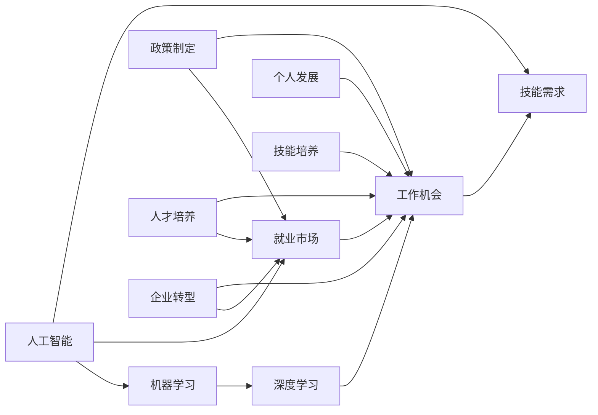

                 

# 人类计算：AI时代的未来就业市场趋势预测

> 关键词：人工智能,机器学习,就业市场,未来趋势,工作机会,技能需求

## 1. 背景介绍

### 1.1 问题由来

随着人工智能(AI)技术的飞速发展，人类社会的就业市场正经历着前所未有的变革。AI和机器学习(ML)技术已经在多个行业中得到了广泛应用，如医疗、金融、制造业、物流、教育、娱乐等，极大地提高了生产效率和经营效益，同时也带来了许多新的工作机会和职业要求。然而，这些变化也带来了新的挑战，包括岗位变化、技能需求以及人类与AI的协同问题。

### 1.2 问题核心关键点

未来就业市场将受到AI技术的深刻影响，如何预测和适应这些变化，把握新的工作机会，对当前和未来的劳动力市场具有重要意义。AI时代下的就业趋势预测主要集中在以下几个方面：

- **岗位变化**：AI自动化将取代一些重复性高、低技术含量的岗位，如数据录入、客服、物流配送等，同时创造新的高技术含量岗位，如AI算法工程师、数据科学家、机器人维护师等。
- **技能需求**：随着AI应用的广泛，数据分析、编程、机器学习等技术技能将越来越重要，同时软技能如沟通、协作、创新思维等也将成为关键。
- **人类与AI的协同**：AI将成为许多岗位的辅助工具，人类将更多地从事创造性、高附加值的工作，如决策分析、用户体验设计等。

### 1.3 问题研究意义

研究AI时代的就业市场趋势，对以下几方面具有重要意义：

- **政策制定**：政府和企业需要了解AI技术对就业市场的影响，制定相关政策，以应对劳动力市场的变化。
- **人才培养**：教育机构需要根据市场变化调整课程内容，培养符合未来需求的人才。
- **企业转型**：企业需要根据市场趋势调整业务策略，引进和培养新技能人才，优化人力资源配置。
- **个人发展**：个人需要了解AI技术对自身就业和职业发展的潜在影响，提前规划学习和职业发展路径。

## 2. 核心概念与联系

### 2.1 核心概念概述

要深入理解AI时代的就业市场趋势，需要掌握以下几个核心概念：

- **人工智能(AI)**：通过计算机算法和模型，赋予机器学习和推理能力，以实现自主决策和智能交互的技术。
- **机器学习(ML)**：利用数据和算法，训练模型以预测和决策，实现自动化和智能化。
- **深度学习(Deep Learning)**：一种基于神经网络的机器学习技术，通过多层次特征提取，实现复杂任务的解决。
- **就业市场**：劳动力供需关系及其变化趋势，包括岗位数量、技能需求、薪资水平等。
- **工作机会**：在特定时间和地点，针对特定能力和技能的就业岗位数量。
- **技能需求**：特定岗位或职业对所需技能和知识的描述和要求。

### 2.2 核心概念原理和架构的 Mermaid 流程图(Mermaid 流程节点中不要有括号、逗号等特殊字符)



## 3. 核心算法原理 & 具体操作步骤

### 3.1 算法原理概述

预测AI时代就业市场趋势，可以采用多种算法和技术，其中**就业预测模型**是关键。就业预测模型通常基于历史就业数据、行业动态和AI技术发展，通过统计分析和机器学习方法，预测未来就业市场的发展变化。

常用的算法包括：

- **时间序列分析**：利用历史就业数据，建立时间序列模型，预测未来就业变化。
- **回归分析**：通过建立行业增长与AI技术应用之间的关系，预测未来岗位需求。
- **随机森林**：利用多棵决策树进行集成学习，预测就业市场变化。
- **深度学习**：采用神经网络模型，从大量数据中提取高层次特征，预测就业趋势。

### 3.2 算法步骤详解

就业预测模型的构建一般分为以下几个步骤：

**Step 1: 数据收集与预处理**

- 收集历史就业数据、行业发展数据、AI技术应用数据等。
- 对数据进行清洗和预处理，包括缺失值处理、异常值检测等。

**Step 2: 特征工程**

- 提取对就业市场变化有影响的特征，如行业增长率、AI技术普及率、教育培训投入等。
- 对特征进行归一化和标准化处理，确保数据的一致性。

**Step 3: 模型选择与训练**

- 根据数据特征和预测需求，选择合适的预测模型，如时间序列模型、回归模型、随机森林等。
- 将数据分为训练集和测试集，训练模型。

**Step 4: 模型评估与优化**

- 在测试集上评估模型预测性能，计算均方误差(MSE)、平均绝对误差(MAE)等指标。
- 根据评估结果，调整模型参数，优化模型性能。

**Step 5: 结果解读与建议**

- 分析模型预测结果，结合行业趋势和政策导向，提出就业市场发展建议。
- 针对不同岗位和职业，提出技能需求和培养建议。

### 3.3 算法优缺点

**优点**：

- **预测准确性高**：利用机器学习模型，可以从大量数据中提取高层次特征，提高预测准确性。
- **动态适应性**：随着时间推移，模型可以不断学习和适应新的数据和趋势。
- **多维度分析**：考虑多方面因素，如行业动态、技术发展、政策变化等，提供全面的就业市场预测。

**缺点**：

- **数据依赖性强**：模型的预测效果依赖于高质量的数据，数据不完整或不准确会影响预测结果。
- **模型复杂性**：复杂的模型需要较高的计算资源和时间，且不易解释。
- **偏差与方差**：模型存在可能的学习偏差和方差，需要仔细调整模型参数。

### 3.4 算法应用领域

AI时代的就业预测模型在多个领域有广泛应用：

- **政策制定**：政府和机构利用就业预测模型，制定行业发展、就业保障、教育培训等政策。
- **企业决策**：企业根据就业市场预测，调整业务战略，优化人力资源配置，引进新技能人才。
- **人才培养**：教育机构根据就业市场变化，调整课程设置，培养符合未来需求的技术和管理人才。
- **个人职业规划**：个人利用就业预测模型，了解行业发展趋势，规划学习和职业发展路径。

## 4. 数学模型和公式 & 详细讲解 & 举例说明

### 4.1 数学模型构建

本节将详细讲解就业预测模型的数学模型构建过程。

设 $T$ 为时间序列，$Y_t$ 为 $t$ 时刻的就业市场指标，如岗位数量、薪资水平等。历史数据集为 $D=\{(Y_{t-1}, Y_t, Y_{t+1}, ..., Y_{t+k}\}$，其中 $k$ 为预测窗口大小。

假设 $Y_t$ 可以表示为以下形式：

$$
Y_t = f(Y_{t-1}, Y_{t-2}, ..., Y_{t-k}, X_t)
$$

其中 $f$ 为模型函数，$X_t$ 为影响 $Y_t$ 的外生变量，如行业增长率、AI技术普及率等。

### 4.2 公式推导过程

以时间序列模型为例，假设 $Y_t$ 为自回归模型(AR)：

$$
Y_t = \alpha + \beta Y_{t-1} + \epsilon_t
$$

其中 $\alpha$ 为常数项，$\beta$ 为自回归系数，$\epsilon_t$ 为随机误差项。

模型训练过程为：

1. 对 $Y_t$ 和 $Y_{t-1}$ 进行最小二乘回归，得到 $\alpha$ 和 $\beta$ 的估计值。
2. 利用历史数据，计算 $\sigma^2 = \frac{1}{n}\sum_{t=1}^n \epsilon_t^2$，作为误差项的方差估计值。
3. 利用均方误差(MSE)等指标，评估模型预测性能。

### 4.3 案例分析与讲解

以预测某行业未来五年内岗位数量变化为例：

1. 收集历史岗位数量数据 $D=\{Y_1, Y_2, ..., Y_{36}\}$。
2. 构建自回归模型，假设 $Y_t = \alpha + \beta Y_{t-1} + \epsilon_t$。
3. 使用前34个数据进行回归，得到 $\alpha$ 和 $\beta$ 的估计值。
4. 使用最后两个数据进行预测，假设 $Y_{36} = \alpha + \beta Y_{35} + \epsilon_{36}$。

## 5. 项目实践：代码实例和详细解释说明

### 5.1 开发环境搭建

就业预测模型的开发环境搭建主要涉及Python、R、Java等编程语言，以及TensorFlow、Scikit-learn、SPSS等工具。

- Python环境搭建：
  ```bash
  # 安装Python 3.8
  sudo apt-get update
  sudo apt-get install python3 python3-pip
  ```

- R环境搭建：
  ```bash
  # 安装R 4.1.1
  sudo apt-get update
  sudo apt-get install r-base
  ```

- Java环境搭建：
  ```bash
  # 安装Java 11
  sudo apt-get update
  sudo apt-get install default-jdk
  ```

### 5.2 源代码详细实现

以Python为例，使用TensorFlow进行就业预测模型的实现：

```python
import tensorflow as tf
from tensorflow.keras.models import Sequential
from tensorflow.keras.layers import Dense, LSTM
from tensorflow.keras.optimizers import Adam
from sklearn.preprocessing import MinMaxScaler

# 数据加载
data = pd.read_csv('employment_data.csv')
X = data.iloc[:, :-1].values
y = data.iloc[:, -1].values

# 特征处理
scaler = MinMaxScaler(feature_range=(0, 1))
X_scaled = scaler.fit_transform(X)
y_scaled = scaler.fit_transform(y)

# 模型构建
model = Sequential()
model.add(LSTM(units=50, return_sequences=True, input_shape=(X_scaled.shape[1], 1)))
model.add(LSTM(units=50))
model.add(Dense(units=1))

# 编译与训练
model.compile(optimizer=Adam(), loss='mse')
model.fit(X_scaled, y_scaled, epochs=100, batch_size=32)

# 预测
future_data = ...
prediction = model.predict(future_data)
```

### 5.3 代码解读与分析

- **数据加载**：使用Pandas加载就业数据，将其分为输入特征(X)和目标变量(y)。
- **特征处理**：使用MinMaxScaler对数据进行归一化处理，确保数据的一致性和可比性。
- **模型构建**：使用LSTM和Dense层构建预测模型，LSTM层用于提取时间序列特征。
- **编译与训练**：使用Adam优化器和均方误差损失函数进行模型训练，通过设置epoch和batch_size控制训练参数。
- **预测**：对未来的就业数据进行预测，并使用模型进行预测。

### 5.4 运行结果展示

训练完毕后，使用测试数据集对模型进行评估，输出预测误差和相关指标：

```python
test_X = ...
test_y = ...

test_X_scaled = scaler.transform(test_X)
test_y_scaled = scaler.transform(test_y)

mse = model.evaluate(test_X_scaled, test_y_scaled)
print('Mean Squared Error:', mse)
```

## 6. 实际应用场景

### 6.1 企业招聘与人才管理

AI时代的就业预测模型可以帮助企业更好地进行人才招聘和管理：

- **人才需求预测**：通过分析行业趋势和岗位需求，预测未来的人才需求，指导企业制定招聘计划。
- **人才储备与培养**：根据未来需求，提前培养和储备符合要求的人才，提高企业的人才竞争力。
- **人力资源优化**：根据就业市场变化，优化人力资源配置，提升员工工作效率和满意度。

### 6.2 政府政策制定

政府可以利用就业预测模型制定相关政策，以应对未来就业市场变化：

- **就业保障**：根据预测结果，制定相应的就业保障政策，如失业救济、再就业培训等。
- **产业调整**：预测不同行业的发展趋势，指导产业结构调整和优化。
- **教育投入**：根据未来技能需求，调整教育培训计划和课程设置，提高教育资源的配置效率。

### 6.3 职业培训与终身学习

就业预测模型可以指导个人进行职业培训和终身学习，提升自身技能竞争力：

- **技能需求分析**：根据预测结果，了解未来技能需求，选择相应的培训课程。
- **职业规划**：利用模型分析行业变化，规划个人职业发展路径，提升就业竞争力。
- **技能更新**：定期参与培训和进修，保持与市场需求的同步。

### 6.4 未来应用展望

未来，就业预测模型将在更多领域得到应用，带来更深刻的影响：

- **智能招聘系统**：结合AI和机器学习技术，构建智能招聘系统，提升招聘效率和质量。
- **个性化培训平台**：根据个人职业规划和市场需求，推荐个性化的培训课程和学习资源。
- **职业发展助手**：利用模型预测和推荐，帮助个人更好地进行职业发展和管理。

## 7. 工具和资源推荐

### 7.1 学习资源推荐

为了帮助开发者掌握就业预测模型的相关知识，这里推荐一些优质的学习资源：

- **《Python数据科学手册》**：全面介绍Python数据科学库的使用，包括就业预测模型的实现。
- **Coursera《数据科学与机器学习》课程**：由斯坦福大学提供，涵盖机器学习、深度学习、就业预测等方面的内容。
- **Kaggle就业预测竞赛**：参与实际竞赛，学习和实践就业预测模型的应用。

### 7.2 开发工具推荐

高效的工具是开发就业预测模型的重要保障。以下是几款推荐的开发工具：

- **Python**：高效的数据处理和模型实现工具，拥有丰富的第三方库和框架。
- **TensorFlow**：灵活的深度学习框架，支持分布式训练和推理。
- **R语言**：强大的统计分析和可视化工具，适用于数据处理和模型评估。
- **SPSS**：统计分析软件，支持复杂的就业预测模型构建和评估。

### 7.3 相关论文推荐

深入研究就业预测模型，还需要阅读以下相关论文：

- **"Time Series Forecasting with Deep Learning: A Review"**：详细介绍了深度学习在时间序列预测中的应用。
- **"Machine Learning for Business Analytics: From Data Mining to Predictive Modeling"**：探讨了机器学习在商业分析中的应用，包括就业预测。
- **"Predicting Future Employment Trends in the Gig Economy"**：研究了未来自由职业市场的就业预测方法。

## 8. 总结：未来发展趋势与挑战

### 8.1 研究成果总结

本文对AI时代的就业预测模型进行了全面的介绍，主要研究内容包括：

- **模型原理**：详细讲解了就业预测模型的构建方法和步骤。
- **开发实践**：提供了Python和R语言下的代码实现，包括数据处理、模型训练和预测。
- **应用场景**：探讨了就业预测模型在企业招聘、政府政策、职业培训等多个领域的实际应用。

### 8.2 未来发展趋势

未来，就业预测模型将呈现以下几个发展趋势：

- **多模态数据融合**：结合文本、图像、语音等多模态数据，提升就业预测的准确性和鲁棒性。
- **深度学习与强化学习的结合**：利用强化学习技术，优化模型训练和预测过程，提升预测性能。
- **自适应学习**：根据实时数据和市场变化，动态调整模型参数，提高预测灵活性。
- **实时预测**：利用流式数据处理技术，实现实时就业市场预测，提供更及时的市场信息。

### 8.3 面临的挑战

尽管就业预测模型已经取得了一定的进展，但仍面临一些挑战：

- **数据质量问题**：历史数据的不完整和不准确，可能导致模型预测偏差。
- **模型复杂性**：复杂的模型需要较高的计算资源和时间，且不易解释。
- **跨领域应用**：不同行业的就业市场变化差异大，需要定制化的模型和算法。
- **隐私保护**：在处理就业数据时，需要严格遵守数据隐私和安全的法律法规。

### 8.4 研究展望

未来的研究应关注以下几个方面：

- **数据治理**：制定数据收集和处理的标准和规范，确保数据的质量和可用性。
- **模型解释性**：开发可解释性强的模型，提高模型的透明度和可信度。
- **跨行业应用**：开发通用的就业预测模型，适应不同行业的需求。
- **技术创新**：探索新的算法和技术，提升就业预测的准确性和效率。

## 9. 附录：常见问题与解答

### Q1：如何获取高质量的就业数据？

A: 高质量的就业数据通常来源于官方统计数据、行业报告和第三方调研数据。数据收集时应考虑数据的完整性、时效性和代表性。

### Q2：如何选择适合的就业预测模型？

A: 选择适合的就业预测模型需要考虑数据类型、预测目标和实际需求。常用的模型包括时间序列模型、回归模型和随机森林等，应根据具体场景选择。

### Q3：如何在模型训练中避免过拟合？

A: 避免过拟合可以采用正则化技术、dropout、early stopping等方法。同时，确保模型训练过程中有足够的未见过的数据。

### Q4：就业预测模型如何应用到实际业务中？

A: 就业预测模型应用到实际业务中，需要结合具体场景进行定制化开发。例如，结合企业数据和市场动态，进行人才需求预测和储备。

### Q5：就业预测模型如何评估预测效果？

A: 评估预测效果通常使用均方误差(MSE)、平均绝对误差(MAE)等指标，通过测试数据集进行模型评估和优化。

---

作者：禅与计算机程序设计艺术 / Zen and the Art of Computer Programming

