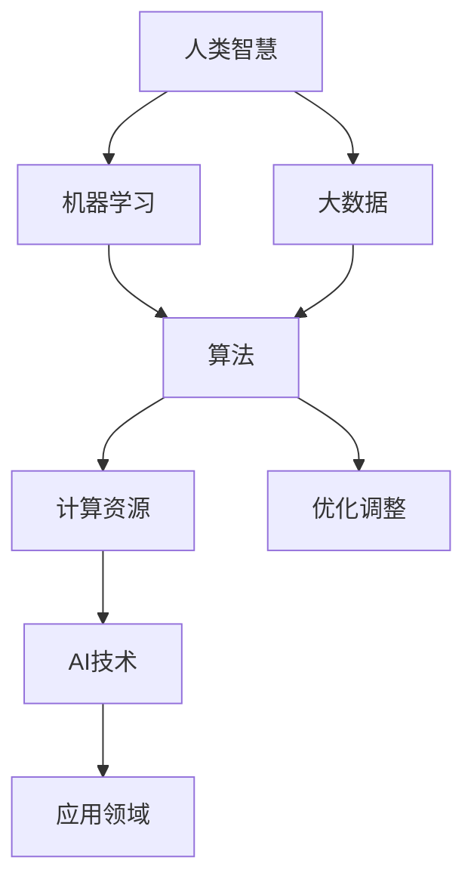

                 

# 人类计算：AI时代的未来就业市场趋势预测

## 1. 背景介绍

随着人工智能(AI)技术的飞速发展，机器学习和深度学习等算法在各个行业得到广泛应用。与此同时，全球就业市场也在经历深刻的变革。在这一背景下，理解和预测AI时代未来就业市场的趋势变得尤为重要。本文旨在通过分析AI技术的发展趋势，探讨AI时代对就业市场的影响，并预测未来就业市场的变化方向。

## 2. 核心概念与联系

### 2.1 核心概念概述

AI技术包括机器学习、深度学习、自然语言处理(NLP)、计算机视觉等，其核心是通过算法和计算能力模拟人类的智能决策过程。AI技术的应用领域覆盖了金融、医疗、制造业、交通、教育等多个行业，正在重塑各行各业的商业模式和就业结构。

在AI时代，"人类计算"（Human Computation）成为一个重要的概念。人类计算指的是人类通过设计和优化算法，利用AI技术完成某些复杂的计算任务，从而提高效率和效果。其核心思想是将人类智慧与计算能力相结合，利用AI技术的强大算力来解决人类难以解决的问题。

### 2.2 核心概念原理和架构的 Mermaid 流程图



在上述流程图中，人类智慧通过机器学习转化为算法，再利用计算资源产生AI技术，覆盖各种应用领域。优化调整则贯穿于整个过程，以不断提升AI系统的性能和效率。

## 3. 核心算法原理 & 具体操作步骤

### 3.1 算法原理概述

AI时代对就业市场的影响主要体现在两个方面：一方面是替代效应，即AI技术能够替代部分人类劳动，导致某些岗位消失；另一方面是乘数效应，即AI技术的发展会创造新的就业机会，推动产业升级和就业结构的优化。

AI时代下的就业市场趋势预测，需要综合考虑技术进步、产业结构变化、劳动力供给和需求等多重因素。本文将采用统计分析和预测模型，结合具体案例来探讨AI时代就业市场的前景。

### 3.2 算法步骤详解

1. **数据收集与处理**：收集全球各国和各行业的就业数据，并对数据进行清洗、归一化和标准化处理。
2. **特征选择与提取**：根据AI技术的发展趋势，选择与就业市场变化相关的特征，如技术进步速度、产业结构调整、人口结构变化等。
3. **模型构建与训练**：构建多元回归、时间序列分析等模型，训练历史数据，以预测未来就业市场的变化趋势。
4. **结果验证与优化**：通过历史数据验证模型预测结果，不断调整模型参数，提高预测准确性。
5. **趋势预测与分析**：结合统计分析和模型预测结果，分析未来就业市场的主要趋势。

### 3.3 算法优缺点

优点：
- 综合考虑多重因素，提供全面的就业市场预测。
- 利用历史数据进行模型训练，提高预测准确性。
- 能够预测不同行业和地区的就业变化，提供针对性的就业指导。

缺点：
- 数据收集和处理可能存在误差，影响预测结果。
- 模型构建复杂，需要专业知识支持。
- 无法预测某些突发事件对就业市场的影响。

### 3.4 算法应用领域

AI时代下的就业市场趋势预测，可以应用于以下几个领域：

1. **政府政策制定**：帮助政府了解AI技术对就业市场的影响，制定针对性的政策措施。
2. **企业人力资源管理**：为企业提供未来就业市场的趋势分析，指导人才招聘和培训策略。
3. **教育培训**：根据未来就业市场需求，优化教育培训课程，培养适应AI时代的技能人才。
4. **劳动力市场分析**：帮助劳动力市场机构了解就业趋势，提供就业指导和职业规划服务。

## 4. 数学模型和公式 & 详细讲解 & 举例说明

### 4.1 数学模型构建

在AI时代就业市场趋势预测中，我们采用多元回归模型来刻画不同因素对就业市场的影响。设就业人数为$Y$，影响因素为$X_1, X_2, ..., X_n$，多元回归模型为：

$$
Y = \beta_0 + \beta_1X_1 + \beta_2X_2 + ... + \beta_nX_n + \epsilon
$$

其中，$\beta_i$为回归系数，$\epsilon$为误差项。通过求解最小二乘法，可以估计$\beta_i$，从而得到就业市场的预测公式。

### 4.2 公式推导过程

以线性回归模型为例，其基本推导过程如下：

1. 假设样本数据为$(x_i, y_i), i=1, ..., n$，其中$x_i$为自变量，$y_i$为因变量。
2. 假设回归模型为$y = \beta_0 + \beta_1x + \epsilon$，其中$\beta_0, \beta_1$为待估参数，$\epsilon$为误差项。
3. 最小二乘法的目标是最小化残差平方和$SSE = \sum_{i=1}^n (y_i - \hat{y}_i)^2$，其中$\hat{y}_i$为模型预测值。
4. 根据最小二乘法，求解$\beta_0, \beta_1$，得到回归系数$\hat{\beta}$。
5. 将回归系数代入回归模型，得到就业市场预测公式$\hat{Y} = \hat{\beta}_0 + \hat{\beta}_1X$。

### 4.3 案例分析与讲解

假设我们收集了某国过去10年的就业数据，其中自变量包括技术进步速度、产业结构调整、人口结构变化等，因变量为总就业人数。通过多元回归模型，我们得到如下回归系数：

- 技术进步速度：$\beta_1 = 0.3$
- 产业结构调整：$\beta_2 = -0.2$
- 人口结构变化：$\beta_3 = 0.5$

将这组系数代入回归模型，得到就业市场预测公式：

$$
\hat{Y} = 1000 + 0.3X_1 - 0.2X_2 + 0.5X_3
$$

其中，$X_1, X_2, X_3$分别为技术进步速度、产业结构调整和人口结构变化的量化指标。通过该模型，可以预测未来10年的就业市场变化趋势。

## 5. 项目实践：代码实例和详细解释说明

### 5.1 开发环境搭建

要进行AI时代就业市场趋势预测，需要安装和配置Python、R等编程语言和工具。以下是Python环境搭建的步骤：

1. 安装Python：从官网下载安装Python，安装最新版本。
2. 安装必要的库：使用pip安装NumPy、Pandas、Matplotlib等数据处理和可视化库。
3. 配置Jupyter Notebook：通过conda安装jupyter notebook，设置环境变量，运行jupyter notebook启动Python交互环境。

### 5.2 源代码详细实现

以下是使用Python进行多元回归模型训练的示例代码：

```python
import pandas as pd
import numpy as np
from sklearn.linear_model import LinearRegression

# 读取数据
data = pd.read_csv('employment_data.csv')

# 数据处理
X = data[['tech_progress', 'industry_adjust', 'population_change']]
Y = data['employment_count']

# 训练模型
model = LinearRegression()
model.fit(X, Y)

# 预测未来就业人数
future_data = pd.DataFrame({
    'tech_progress': np.random.randint(0, 10, 10),
    'industry_adjust': np.random.randint(0, 10, 10),
    'population_change': np.random.randint(0, 10, 10)
})
future_predictions = model.predict(future_data)

# 输出预测结果
print(future_predictions)
```

### 5.3 代码解读与分析

上述代码实现了以下功能：

1. 读取就业数据：通过Pandas库读取CSV格式的数据文件。
2. 数据预处理：将数据划分为自变量X和因变量Y。
3. 模型训练：使用LinearRegression库训练多元回归模型。
4. 数据预测：使用训练好的模型对未来数据进行预测。
5. 结果输出：输出预测结果，供进一步分析使用。

## 6. 实际应用场景

### 6.1 智能制造

AI技术在智能制造中的应用日益广泛，如自动化生产线、机器人操作、质量检测等。这些技术能够提高生产效率，减少人工错误，但同时也可能导致部分岗位消失。

通过就业市场预测，政府和企业可以提前规划，优化人力资源配置，培训技术工人，确保智能制造领域的持续发展。例如，通过预测未来机器人操作岗位需求，可以为职业学校设立相关专业，培养机器人操作人才。

### 6.2 医疗健康

AI技术在医疗健康领域的应用包括疾病预测、个性化治疗、智能诊断等。这些技术能够提高医疗服务质量，但同时也可能改变医生、护士等医疗岗位的工作内容。

通过就业市场预测，医疗机构可以调整人力资源布局，提高医护人员的技术水平，增强对AI技术的适应能力。例如，预测未来智能诊断需求，可以为医院设立数据科学岗位，培养AI医疗专家。

### 6.3 教育培训

AI技术在教育培训领域的应用包括智能辅导、个性化学习、在线课程等。这些技术能够提升教育质量，但同时也可能改变教师的工作方式。

通过就业市场预测，教育机构可以提前调整课程设置，培训教师掌握AI技术，增强对新技术的适应能力。例如，预测未来个性化学习需求，可以为学校设立数据科学教育岗，培养AI教育专家。

### 6.4 未来应用展望

未来AI技术的发展将进一步改变就业市场结构，新的就业机会将不断涌现。以下是几个可能的应用方向：

1. **数据科学家**：随着数据量的爆炸性增长，数据科学家将承担更多的数据分析和模型构建任务。
2. **AI工程师**：随着AI技术的应用日益广泛，AI工程师将负责设计和优化AI系统，提升系统性能和效果。
3. **自动化专家**：自动化专家将负责设计和维护自动化生产线、机器人系统等，推动制造业的智能化发展。
4. **AI医疗专家**：AI医疗专家将负责开发智能诊断系统、个性化治疗方案等，提升医疗服务质量。
5. **AI教育专家**：AI教育专家将负责设计和实施AI教育培训方案，培养适应AI时代的技能人才。

## 7. 工具和资源推荐

### 7.1 学习资源推荐

1. **《深度学习》书籍**：该书由Ian Goodfellow等撰写，全面介绍了深度学习的基本概念和算法，是学习AI技术的重要参考。
2. **Coursera课程**：Coursera提供的深度学习、机器学习等课程，由斯坦福、MIT等知名高校教授主讲，内容丰富，系统性强。
3. **Kaggle竞赛**：Kaggle是一个数据科学竞赛平台，提供大量真实数据集和挑战题，可以帮助学习者积累实践经验。

### 7.2 开发工具推荐

1. **Jupyter Notebook**：Jupyter Notebook是一个交互式编程环境，适合进行数据分析和机器学习实验。
2. **Python**：Python是数据科学和机器学习领域的主流编程语言，具有丰富的第三方库和工具支持。
3. **R语言**：R语言是数据统计和分析的常用工具，拥有丰富的统计库和图形库。

### 7.3 相关论文推荐

1. **《人工智能对就业市场的影响研究》**：该论文探讨了AI技术对就业市场的替代效应和乘数效应，提供了丰富的实证分析。
2. **《AI时代的人力资源管理》**：该论文讨论了AI技术对人力资源管理的挑战和机遇，提出了相应的应对策略。
3. **《机器学习在教育中的应用》**：该论文探讨了机器学习在教育中的潜在应用，分析了其对教育模式的影响。

## 8. 总结：未来发展趋势与挑战

### 8.1 研究成果总结

本文通过对AI技术对就业市场影响的分析，探讨了AI时代未来就业市场的趋势预测方法。通过多元回归模型，结合具体案例和实证分析，揭示了AI技术在智能制造、医疗健康、教育培训等领域的应用前景，并预测了未来的就业趋势。

### 8.2 未来发展趋势

未来AI技术将继续深化其对各行业的渗透，带来更多就业机会。主要趋势包括：

1. **技术进步**：AI技术的不断发展将推动各行业实现智能化转型，创造新的就业机会。
2. **产业升级**：AI技术的广泛应用将提升各行业的服务质量和工作效率，推动产业升级。
3. **就业结构优化**：AI技术将改变各行业的就业结构，产生更多高技能岗位，减少低技能岗位。

### 8.3 面临的挑战

尽管AI技术带来诸多机遇，但在其发展过程中也面临诸多挑战：

1. **数据隐私和安全**：大规模数据收集和使用可能带来隐私和安全问题，需要建立相应的保护机制。
2. **技术普及和教育**：AI技术的应用需要大量技术人才支持，如何普及技术教育，提升全社会的技术素养，是一个长期挑战。
3. **伦理和社会影响**：AI技术的应用可能带来伦理和社会问题，需要制定相应的法律法规和道德准则。

### 8.4 研究展望

未来的研究需要在以下几个方面继续推进：

1. **数据隐私和安全**：建立数据隐私保护机制，确保AI技术在数据使用中的安全性和合规性。
2. **技术普及和教育**：推动AI技术的普及，通过在线教育、职业培训等方式提升全社会的技术素养。
3. **伦理和社会影响**：制定AI技术的伦理准则，确保技术应用的公正性和可接受性。

总之，AI技术的应用将深刻改变未来的就业市场，带来更多机遇和挑战。通过全面系统的研究和实践，我们可以更好地应对这些挑战，推动AI技术向更广泛的领域渗透，为人类社会带来更多福祉。

## 9. 附录：常见问题与解答

**Q1：AI技术对就业市场的替代效应和乘数效应是如何相互作用的？**

A: AI技术的替代效应指的是AI技术能够替代部分人类劳动，导致某些岗位消失。乘数效应则指的是AI技术的发展会创造新的就业机会，推动产业升级和就业结构的优化。两者的相互作用体现在：

1. 替代效应：AI技术能够提高生产效率，减少人工错误，导致某些重复性高、技能要求低的岗位消失。例如，自动化生产线替代了部分传统制造业岗位。
2. 乘数效应：AI技术的发展会创造新的岗位，推动产业升级，提升整体就业水平。例如，AI医疗专家、数据分析师等岗位应运而生，提升了医疗和数据分析领域的就业需求。

因此，AI技术对就业市场的影响是复杂的，既有替代效应也有乘数效应，两者相互作用，共同影响就业市场的变化。

**Q2：AI时代就业市场预测的主要方法有哪些？**

A: AI时代就业市场预测主要采用以下方法：

1. **多元回归模型**：利用历史数据建立回归模型，通过自变量和因变量之间的关系，预测未来的就业市场变化。
2. **时间序列分析**：将就业数据作为时间序列，利用ARIMA、VAR等模型进行预测，考虑时间序列的动态变化。
3. **神经网络模型**：利用深度学习技术，通过构建神经网络模型进行就业市场预测，考虑数据的非线性关系和动态变化。
4. **集成学习**：通过多种模型进行组合预测，提高预测的准确性和稳定性。

这些方法各有优缺点，具体选择应根据数据特点和预测目标进行综合评估。

**Q3：AI技术在教育领域的应用有哪些？**

A: AI技术在教育领域的应用包括：

1. **智能辅导**：利用AI技术实现个性化学习，根据学生的学习情况进行智能辅导，提高学习效果。
2. **在线课程**：通过AI技术分析学生学习行为，推荐合适的在线课程，提供更加个性化的学习体验。
3. **考试评估**：利用AI技术进行自动评分和评估，提高考试的公平性和效率。
4. **虚拟教室**：通过AI技术构建虚拟教室，实现远程教学，提升教育资源的利用率。

AI技术在教育领域的应用，能够提高教育质量，提升学习效率，优化教育资源的配置。

**Q4：AI技术在智能制造中的应用有哪些？**

A: AI技术在智能制造中的应用包括：

1. **自动化生产线**：利用AI技术实现生产线的自动化和智能化，提高生产效率和产品质量。
2. **机器人操作**：利用AI技术实现机器人操作的智能化，降低人工成本，提高生产灵活性。
3. **质量检测**：利用AI技术进行质量检测和缺陷分析，提高产品质量，减少次品率。
4. **生产调度**：利用AI技术进行生产调度和资源优化，提高生产效率和资源利用率。

AI技术在智能制造中的应用，能够提升生产效率和产品质量，降低人工成本，推动制造业的智能化转型。

---

作者：禅与计算机程序设计艺术 / Zen and the Art of Computer Programming

