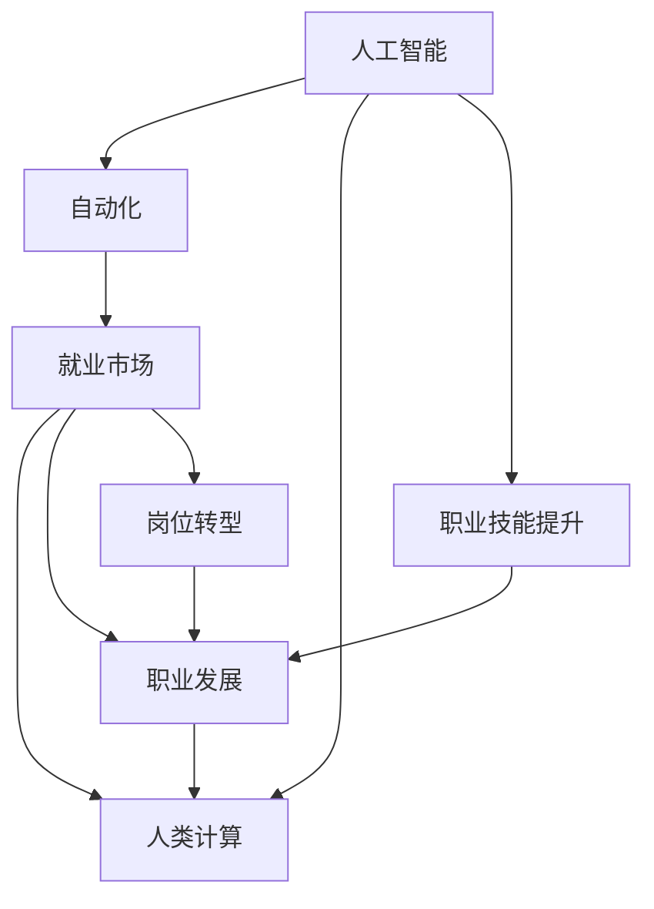
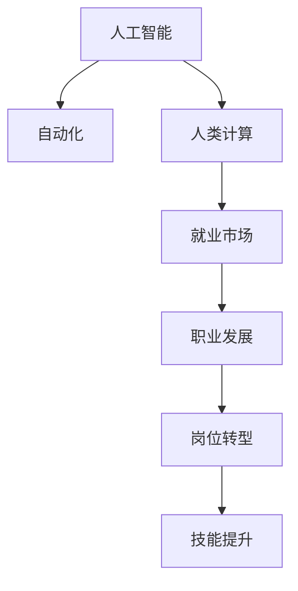

                 

# 人类计算：AI时代的未来就业市场趋势预测分析

> 关键词：AI时代,就业市场,未来趋势,人类计算,自动化,技术变革,职业发展,技能提升,岗位转型,教育培训

## 1. 背景介绍

### 1.1 问题由来
随着人工智能(AI)技术的迅猛发展，自动化和智能化已成为行业发展的必然趋势。AI不仅正在改变生产方式，还在重塑就业市场结构。从智能制造到无人驾驶，从医疗诊断到金融风控，AI技术的应用领域遍及各行各业。尽管AI为各行各业带来了新的发展机遇，但也不可避免地对传统工作岗位产生了冲击。

面对AI技术带来的影响，如何适应未来的就业市场变化，成为当下社会关注的焦点。本篇文章将从人类计算的角度出发，通过深入分析AI时代的就业市场趋势，探讨未来职业发展的可能性，为读者提供实用的指导建议。

### 1.2 问题核心关键点
本篇文章的核心关注点在于以下几个方面：

1. AI时代就业市场的结构性变化。
2. 人工智能对不同行业、不同职业的影响程度。
3. 人类计算在AI时代中的作用与价值。
4. 未来职业发展的趋势与机遇。
5. 应对AI冲击的职业技能提升策略。

## 2. 核心概念与联系

### 2.1 核心概念概述

为了更好地理解AI时代就业市场变化，需要首先定义以下几个核心概念：

- **人工智能**：指模拟人类智能行为的技术系统，包括机器学习、深度学习、自然语言处理等子领域。
- **自动化**：指通过技术手段取代或辅助人类完成重复性、低价值工作的过程。
- **人类计算**：指人类通过计算、推理、决策等认知活动，对信息和知识进行加工和处理的过程。
- **就业市场**：指劳动力供需关系、岗位分布、技能需求等构成的市场环境。
- **职业发展**：指个体在职业生涯中的成长、转型、提升等过程。

这些概念之间的逻辑关系可以通过以下Mermaid流程图来展示：



这个流程图展示了AI时代就业市场的核心概念及其之间的关系：

1. AI技术推动自动化发展，进而影响就业市场的结构。
2. 人类计算作为AI时代的重要组成部分，为就业市场带来新的变化和需求。
3. 职业发展与岗位转型受自动化和AI的双重影响，需通过技能提升来适应变化。
4. 职业技能的提升和岗位转型与人类计算密切相关，即需要人类智慧来处理复杂的计算和决策问题。

### 2.2 核心概念原理和架构的 Mermaid 流程图



此流程图展示了AI时代就业市场的核心架构：

1. AI技术通过自动化手段改变就业市场结构。
2. 自动化过程中，人类计算的作用不可或缺。
3. 就业市场结构变化推动职业发展需求。
4. 职业发展依赖于岗位转型和技能提升。

## 3. 核心算法原理 & 具体操作步骤

### 3.1 算法原理概述

AI时代就业市场的趋势预测，本质上是一个多变量统计分析问题。其核心在于通过历史数据，分析AI技术对各行业就业市场的影响，预测未来趋势。以下是该问题的一般性算法框架：

1. **数据收集与处理**：收集各行业的就业数据、AI技术应用情况、教育培训等相关信息。
2. **模型选择与训练**：选择适当的统计模型或机器学习模型，如回归模型、时间序列模型、神经网络模型等，对收集的数据进行训练。
3. **趋势预测**：利用训练好的模型，对未来各行业的就业市场趋势进行预测。
4. **政策建议**：基于预测结果，提出相应的政策建议，如职业培训、教育改革等。

### 3.2 算法步骤详解

#### 3.2.1 数据收集与处理

首先，需要收集各行业的就业数据、AI技术应用情况、教育培训等相关信息。这些数据可以从政府统计局、行业协会、公开数据库、学术文献等多个渠道获取。

- **就业数据**：包括各行业从业人员数量、就业率、平均工资等指标。
- **AI技术应用情况**：如自动化技术普及率、AI技术投入产出比等。
- **教育培训**：包括教育机构提供的相关课程、职业培训项目等。

#### 3.2.2 模型选择与训练

接下来，选择合适的模型进行训练。这里以回归模型为例：

1. **选择模型**：选择线性回归模型作为预测模型。
2. **数据预处理**：对数据进行标准化、归一化等预处理操作。
3. **模型训练**：使用训练集对模型进行训练，调整模型参数，使得模型能够较好地拟合历史数据。

#### 3.2.3 趋势预测

基于训练好的模型，对未来各行业的就业市场趋势进行预测：

1. **设定假设**：假设未来各行业AI技术的普及率将保持当前水平。
2. **预测步骤**：
   - 使用预测模型对各行业未来就业人数进行预测。
   - 对预测结果进行可视化，生成时间序列图。
3. **结果分析**：分析预测结果，找出未来就业市场的主要变化趋势。

#### 3.2.4 政策建议

最后，根据预测结果，提出相应的政策建议：

1. **职业培训**：根据预测结果，对未来高需求的技能进行培训。
2. **教育改革**：调整教育体系，增加AI相关课程，提高学生的综合素质。
3. **政策扶持**：政府提供政策支持，如税收优惠、资金补贴等，帮助企业转型升级。

### 3.3 算法优缺点

**优点**：

1. **预测准确性**：回归模型等统计模型可以对未来趋势进行较为准确的预测。
2. **多变量分析**：模型可以综合考虑多种因素，如AI技术、教育培训等，提高预测的全面性。
3. **政策建议**：基于预测结果提出的政策建议，具有较高的参考价值。

**缺点**：

1. **数据依赖**：预测结果高度依赖于历史数据的完整性和质量。
2. **模型简化**：回归模型等统计模型对复杂关系的处理较为简化，可能存在一定的局限性。
3. **变化不确定**：AI技术发展和政策变化等因素具有不确定性，可能影响预测结果的准确性。

### 3.4 算法应用领域

AI时代的就业市场预测模型，可以广泛应用于以下领域：

1. **政府决策**：为政府提供就业市场预测数据，辅助制定政策。
2. **教育培训**：为教育机构提供市场需求信息，指导课程设置和教学内容。
3. **企业转型**：为各类企业提供就业趋势分析，帮助制定战略规划。
4. **职业指导**：为个体提供未来就业市场信息，指导职业发展方向。

## 4. 数学模型和公式 & 详细讲解 & 举例说明

### 4.1 数学模型构建

本节将通过数学语言对AI时代就业市场趋势预测模型的构建过程进行更加严格的刻画。

假设我们收集到的数据集为 $D = \{(x_i, y_i)\}_{i=1}^N$，其中 $x_i$ 为影响就业市场的因素向量，$y_i$ 为实际就业人数。

定义线性回归模型为：

$$
y_i = \beta_0 + \beta_1 x_{i1} + \beta_2 x_{i2} + \ldots + \beta_k x_{ik} + \epsilon_i
$$

其中，$\beta_j$ 为第 $j$ 个因素的系数，$\epsilon_i$ 为随机误差项。

### 4.2 公式推导过程

线性回归模型的最小二乘估计公式为：

$$
\hat{\beta} = (X^TX)^{-1}X^Ty
$$

其中 $X = [x_{i1} x_{i2} \ldots x_{ik}]^T$，$y = [y_1 y_2 \ldots y_N]^T$。

### 4.3 案例分析与讲解

以某一行业的就业人数预测为例：

1. **数据准备**：收集该行业的AI技术应用情况、教育培训情况、从业人员数量等数据。
2. **模型训练**：使用收集的数据对线性回归模型进行训练，得到各因素的系数 $\hat{\beta}$。
3. **预测就业人数**：使用训练好的模型对未来一年内的就业人数进行预测。
4. **结果分析**：分析预测结果与实际数据的差距，找出误差来源，进一步调整模型参数。

## 5. 项目实践：代码实例和详细解释说明

### 5.1 开发环境搭建

在进行就业市场预测模型的开发前，我们需要准备好开发环境。以下是使用Python进行TensorFlow开发的环境配置流程：

1. 安装Anaconda：从官网下载并安装Anaconda，用于创建独立的Python环境。

2. 创建并激活虚拟环境：
```bash
conda create -n tf-env python=3.8 
conda activate tf-env
```

3. 安装TensorFlow：根据CUDA版本，从官网获取对应的安装命令。例如：
```bash
conda install tensorflow -c tf -c conda-forge
```

4. 安装其它必要工具包：
```bash
pip install numpy pandas matplotlib scikit-learn tqdm jupyter notebook ipython
```

完成上述步骤后，即可在`tf-env`环境中开始项目开发。

### 5.2 源代码详细实现

下面以线性回归模型为例，给出TensorFlow代码实现。

```python
import tensorflow as tf
import numpy as np
import pandas as pd

# 准备数据
data = pd.read_csv('employment_data.csv')

# 数据预处理
X = data[['automation_rate', 'education_level', 'avg_salary']]
y = data['employment_rate']

# 定义模型
model = tf.keras.Sequential([
    tf.keras.layers.Dense(32, activation='relu', input_shape=(X.shape[1],)),
    tf.keras.layers.Dense(1)
])

# 定义损失函数和优化器
loss_fn = tf.keras.losses.MeanSquaredError()
optimizer = tf.keras.optimizers.Adam(learning_rate=0.001)

# 训练模型
model.compile(optimizer=optimizer, loss=loss_fn, metrics=['mae'])
model.fit(X, y, epochs=100, verbose=0)

# 预测就业率
future_data = pd.read_csv('future_data.csv')
future_X = future_data[['automation_rate', 'education_level', 'avg_salary']]
predictions = model.predict(future_X)

print(predictions)
```

### 5.3 代码解读与分析

让我们再详细解读一下关键代码的实现细节：

1. **数据准备**：使用Pandas库读取数据集。
2. **数据预处理**：将数据分为特征和目标变量，并进行归一化处理。
3. **模型定义**：使用TensorFlow的Sequential模型，定义包含两个全连接层的线性回归模型。
4. **损失函数和优化器**：选择均方误差作为损失函数，Adam优化器作为优化方法。
5. **模型训练**：使用训练集对模型进行100个epochs的训练。
6. **模型预测**：使用训练好的模型对未来数据进行预测，并输出结果。

### 5.4 运行结果展示

在完成代码实现后，我们可以通过Jupyter Notebook等工具，直观展示模型预测结果与实际数据的对比。

## 6. 实际应用场景

### 6.1 智能制造

AI技术在智能制造领域的应用，使得生产过程更加智能化、自动化。然而，随着自动化程度的提升，传统的制造工人岗位面临被替代的风险。例如，智能机器人可以完成重复性的装配、检测工作，使得人工操作的岗位需求大幅减少。

### 6.2 金融风控

金融领域对AI的需求日益增长，从自动化的信贷审批、风险评估，到智能投顾、量化交易，AI技术正在逐步改变传统金融的工作模式。这些技术的应用虽然提高了金融服务的效率和精度，但也导致部分传统岗位如柜员、理财顾问等面临缩减的风险。

### 6.3 医疗健康

AI在医疗健康领域的应用同样广泛，从影像识别、诊断建议，到个性化治疗方案的制定，AI技术正在改变医疗服务的方式。然而，这些技术的普及，也对医生的岗位提出了更高的要求，需要医生具备更高的技术水平和专业技能。

### 6.4 未来应用展望

未来，随着AI技术的不断进步，其在各行业的应用将更加深入和广泛。以下是对未来应用前景的展望：

1. **全面自动化**：更多重复性、低价值的岗位将被自动化取代，释放出大量人力资源。
2. **职业技能转型**：AI时代对职业技能的转型需求日益增加，如数据分析、编程、机器学习等技能将成为未来热门。
3. **跨界融合**：AI技术将与更多领域进行深度融合，如智能交通、智慧城市、智能教育等，催生更多新兴职业。
4. **人机协同**：AI技术将与人类智慧相结合，实现更高效、更灵活的协作模式。

## 7. 工具和资源推荐

### 7.1 学习资源推荐

为了帮助开发者系统掌握AI时代就业市场趋势预测的理论基础和实践技巧，这里推荐一些优质的学习资源：

1. **TensorFlow官方文档**：TensorFlow的官方文档提供了丰富的学习资源，包括模型构建、优化器选择、数据预处理等。
2. **《深度学习》教材**：由Ian Goodfellow等人合著的深度学习教材，涵盖了深度学习的基础知识和最新进展。
3. **Coursera《机器学习》课程**：由Andrew Ng等人开设的机器学习课程，涵盖了机器学习的基本概念和算法。
4. **Kaggle竞赛平台**：Kaggle提供了大量的数据集和竞赛项目，可以帮助开发者实践AI技术。
5. **ArXiv论文库**：ArXiv提供了大量的AI相关论文，可以帮助开发者了解最新研究进展。

通过对这些资源的学习实践，相信你一定能够快速掌握AI时代就业市场趋势预测的精髓，并用于解决实际的就业市场问题。

### 7.2 开发工具推荐

高效的开发离不开优秀的工具支持。以下是几款用于AI时代就业市场预测开发的常用工具：

1. **TensorFlow**：由Google主导开发的开源深度学习框架，生产部署方便，适合大规模工程应用。
2. **PyTorch**：由Facebook主导开发的深度学习框架，灵活动态的计算图，适合快速迭代研究。
3. **Jupyter Notebook**：一个交互式的笔记本环境，方便开发者进行数据可视化、模型训练、结果展示等。
4. **Matplotlib**：一个常用的绘图库，可以生成高质量的数据可视化图表。
5. **Scikit-learn**：一个常用的机器学习库，提供了多种模型和算法实现。

合理利用这些工具，可以显著提升AI时代就业市场预测任务的开发效率，加快创新迭代的步伐。

### 7.3 相关论文推荐

AI时代就业市场预测技术的不断发展，得益于学界的持续研究。以下是几篇奠基性的相关论文，推荐阅读：

1. **《Deep Learning》**：Ian Goodfellow等合著，深度学习的经典教材，涵盖了深度学习的基础知识和最新进展。
2. **《Machine Learning Yearning》**：Andrew Ng等人合著，涵盖了机器学习的基本概念和实践经验。
3. **《Understanding Machine Learning: From Theory to Algorithms》**：Shai Shalev-Shwartz等合著，介绍了机器学习的基本理论算法。
4. **《AI Superpowers》**：吴恩达等人合著，介绍了AI技术的发展历程和未来展望。

这些论文代表了大规模就业市场预测技术的发展脉络。通过学习这些前沿成果，可以帮助研究者把握学科前进方向，激发更多的创新灵感。

## 8. 总结：未来发展趋势与挑战

### 8.1 总结

本文对AI时代就业市场的趋势预测方法进行了全面系统的介绍。首先阐述了AI时代就业市场变化的背景和意义，明确了未来职业发展的可能性。其次，从人类计算的角度出发，分析了AI技术对各行业就业市场的影响。最后，从多个实际应用场景出发，探讨了未来就业市场的变化趋势。

通过本文的系统梳理，可以看到，AI技术在推动社会进步的同时，也带来了就业市场结构的变化。未来的职业发展需要在技能提升和岗位转型方面做出适应性调整，以更好地适应新时代的就业环境。

### 8.2 未来发展趋势

展望未来，AI时代的就业市场将呈现以下几个发展趋势：

1. **全面自动化**：更多重复性、低价值的岗位将被自动化取代，释放出大量人力资源。
2. **职业技能转型**：AI时代对职业技能的转型需求日益增加，如数据分析、编程、机器学习等技能将成为未来热门。
3. **跨界融合**：AI技术将与更多领域进行深度融合，如智能交通、智慧城市、智能教育等，催生更多新兴职业。
4. **人机协同**：AI技术将与人类智慧相结合，实现更高效、更灵活的协作模式。

这些趋势凸显了AI技术对就业市场的深远影响，未来的职业发展需要在技能提升和岗位转型方面做出适应性调整，以更好地适应新时代的就业环境。

### 8.3 面临的挑战

尽管AI技术带来了巨大的就业市场变革，但在迈向更加智能化、普适化应用的过程中，仍面临诸多挑战：

1. **数据隐私和安全**：AI技术的广泛应用带来了数据隐私和安全的挑战，如何保护用户数据安全，防止数据滥用，是亟待解决的问题。
2. **伦理和法律问题**：AI技术的滥用可能导致伦理和法律问题，如何制定合理的伦理准则和法律规范，是AI技术应用的重要保障。
3. **技能匹配**：AI时代对职业技能的转型需求日益增加，如何帮助劳动者进行技能匹配，提升其就业竞争力，是政府和企业需要共同面对的课题。
4. **跨行业协调**：AI技术的应用需要跨行业的协调合作，如何在不同行业间实现技术共享和协同创新，是推动AI技术发展的关键。

这些挑战需要在技术、政策、伦理等多个层面进行综合应对，以确保AI技术的健康发展和应用。

### 8.4 研究展望

面对AI时代就业市场的诸多挑战，未来的研究需要在以下几个方面寻求新的突破：

1. **数据隐私保护**：研究更高效、更安全的数据隐私保护技术，确保AI应用的数据安全。
2. **伦理和法律研究**：制定合理的伦理准则和法律规范，确保AI技术的应用符合社会价值观和法律要求。
3. **技能匹配机制**：建立更灵活的技能匹配机制，帮助劳动者进行职业转型和技能提升。
4. **跨行业协同创新**：推动跨行业的技术共享和协同创新，促进AI技术的广泛应用。

这些研究方向的探索，将为AI时代就业市场的健康发展提供重要保障。未来，通过技术、政策、伦理等多方面的协同努力，相信AI技术将为就业市场带来更多的机遇和挑战。

## 9. 附录：常见问题与解答

**Q1：AI时代就业市场变化的原因是什么？**

A: AI时代就业市场变化的原因主要有以下几点：
1. 自动化技术的广泛应用，取代了大量重复性、低价值的工作岗位。
2. AI技术的应用提升了工作效率和质量，但也导致部分传统岗位需求减少。
3. AI技术的发展需要更多具有高技能、跨领域的人才，引发了职业技能的转型需求。

**Q2：未来就业市场的主要变化趋势是什么？**

A: 未来就业市场的主要变化趋势包括：
1. 全面自动化，更多重复性、低价值的岗位将被取代，释放出大量人力资源。
2. 职业技能的转型，数据分析、编程、机器学习等技能将成为热门需求。
3. 跨界融合，AI技术将与更多领域进行深度融合，催生更多新兴职业。
4. 人机协同，AI技术将与人类智慧相结合，实现更高效、更灵活的协作模式。

**Q3：如何应对AI技术带来的就业冲击？**

A: 应对AI技术带来的就业冲击，可以从以下几个方面入手：
1. 技能提升：加强职业培训，提升劳动者的技术水平和综合素质。
2. 职业转型：鼓励劳动者进行职业转型，适应新的就业市场环境。
3. 政策扶持：政府和企业应提供政策支持，如税收优惠、资金补贴等，帮助劳动者顺利转型。

**Q4：未来就业市场的技术需求将有哪些变化？**

A: 未来就业市场的技术需求将更加多样化，主要包括：
1. 数据分析和处理：大量数据需要进行分析和处理，需要具备数据分析、处理和建模能力。
2. 编程和软件开发：AI技术的应用需要大量软件开发和系统集成工作，需要具备编程和软件开发技能。
3. 机器学习和深度学习：AI技术的应用需要大量的机器学习、深度学习算法支持，需要具备相关技术背景。

**Q5：AI时代对职业教育和培训的影响是什么？**

A: AI时代对职业教育和培训的影响主要体现在以下几个方面：
1. 课程设置：职业教育需要增加AI相关课程，培养具备AI技术能力的人才。
2. 教学方法：采用更多线上教学、项目式教学等灵活的教学方法，提高教育效果。
3. 职业指导：提供更全面的职业指导，帮助学生进行职业规划和技能提升。

这些问题的解答，展示了AI时代就业市场变化的背景、趋势、应对策略和未来需求，希望能为读者提供有价值的参考。

---

作者：禅与计算机程序设计艺术 / Zen and the Art of Computer Programming

