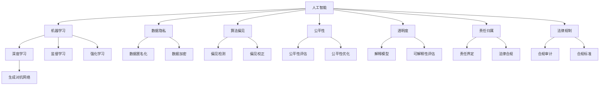

                 

# 人类计算：AI时代的道德边界

> 关键词：人工智能,机器学习,深度学习,道德伦理,数据隐私,算法偏见,公平性,透明性,责任归属,法律规制

## 1. 背景介绍

### 1.1 问题由来
随着人工智能(AI)技术的飞速发展，机器学习和深度学习模型在各种领域展现出了巨大的潜力，从自然语言处理(NLP)、计算机视觉(CV)到推荐系统、无人驾驶等，AI技术正在逐步改变我们的生活方式。然而，AI的迅猛发展也带来了新的道德伦理挑战，诸如数据隐私、算法偏见、公平性、透明性和责任归属等问题，成为各界热议的焦点。

人工智能带来的道德问题，本质上是人类计算(人类和机器的协同计算)在数据驱动的AI系统中所引发的伦理冲突。AI系统通过大规模数据进行训练，这些数据不可避免地包含人类行为、历史和社会文化因素，进而影响了模型的决策和行为。如何确保AI系统在做出决策时，既能符合人类的道德标准，又不会侵犯数据隐私，成为一个亟待解决的重大课题。

### 1.2 问题核心关键点
本文将围绕以下几个核心问题展开探讨：

- AI的道德边界在哪里？AI系统应遵循哪些伦理规范？
- 数据隐私如何保护？AI系统如何处理敏感数据？
- 算法偏见如何避免？AI系统如何确保决策公平？
- 透明度如何实现？AI系统的决策过程如何解释？
- 责任如何归属？AI系统出现问题时如何追责？
- 法律规制如何跟进？AI系统如何合规运行？

## 2. 核心概念与联系

### 2.1 核心概念概述

为更好地理解AI时代的道德边界，本节将介绍几个紧密相关的核心概念：

- 人工智能(AI)：通过计算机科学和工程方法，赋予计算机系统完成人类智能任务的能力，如学习、推理、问题解决等。
- 机器学习(ML)：指通过算法和统计模型，使计算机系统从数据中自动学习规律和模式，而无需明确编程的技术。
- 深度学习(DL)：一种基于神经网络的机器学习技术，能够处理大规模数据，并从中提取高层次的特征表示。
- 数据隐私：指个人或集体在数据收集、存储、处理、传输和使用过程中，对其个人信息的保护。
- 算法偏见：指算法在训练和应用过程中，由于数据集或模型设计缺陷而引入的不公正和歧视性。
- 公平性：指算法或系统的输出结果，在不同群体间应具有相等的表现，不偏向任何特定的群体。
- 透明度：指算法或系统的决策过程应可解释、可理解，以便用户和监管机构能够对其进行审查和监督。
- 责任归属：指当AI系统导致不良后果时，应明确责任归属，以便追究相关责任。
- 法律规制：指通过法律法规，对AI技术的使用进行规范和约束，确保其安全、合规运行。

这些核心概念之间的逻辑关系可以通过以下Mermaid流程图来展示：



这个流程图展示的核心概念及其之间的关系：

1. AI系统的训练和应用过程涉及数据隐私、算法偏见、公平性、透明度、责任归属和法律规制等伦理问题。
2. 机器学习和深度学习是AI系统的核心技术，需要通过监督学习和强化学习等方法进行模型训练。
3. 数据隐私和算法偏见涉及数据处理和模型设计，公平性、透明度和责任归属涉及模型的应用和决策，法律规制涉及系统的监管和合规。

这些概念共同构成了AI系统伦理边界的框架，指导着我们如何设计、开发和使用AI技术。

## 3. 核心算法原理 & 具体操作步骤
### 3.1 算法原理概述

在AI系统设计中，伦理边界的界定和保护需要考虑以下几个关键问题：

- **数据隐私保护**：在数据收集和处理过程中，如何确保个人数据不被滥用和泄露？
- **算法偏见避免**：如何确保AI系统在训练和应用过程中，不引入或放大偏见和歧视？
- **公平性确保**：如何在不同群体间确保AI系统的输出结果公平一致，不偏向任何特定的群体？
- **透明度实现**：如何使AI系统的决策过程透明、可解释，方便用户和监管机构理解和审查？
- **责任归属明确**：当AI系统出现问题时，如何界定责任归属，并确保相关责任人承担后果？
- **法律规制遵守**：如何确保AI系统的运行符合法律法规，避免不合规行为？

### 3.2 算法步骤详解

以下是基于AI系统设计中常见的道德边界问题，提出的解决方案步骤：

**数据隐私保护**：
1. **数据匿名化**：通过对数据进行脱敏和伪装，使个体无法通过数据被识别。
2. **数据加密**：采用加密技术，保护数据在存储和传输过程中的安全。
3. **访问控制**：实施严格的访问权限管理，确保只有授权人员才能访问敏感数据。

**算法偏见避免**：
1. **数据集多样化**：确保数据集覆盖不同群体和领域，避免样本偏见。
2. **偏见检测**：使用算法检测和纠正模型中的偏见。
3. **多样性训练**：在模型训练中引入多样性约束，减少偏见引入。

**公平性确保**：
1. **公平性评估**：使用公平性指标，如平等机会、反歧视等，评估模型输出。
2. **公平性优化**：通过调整模型参数或算法，改善不同群体间的公平性。
3. **多样化评估**：对模型在不同群体上的表现进行多样化评估，确保不偏向任何群体。

**透明度实现**：
1. **可解释性模型**：使用可解释性较强的模型，如决策树、线性回归等。
2. **模型可视化**：通过可视化工具，展示模型内部决策过程。
3. **用户反馈**：收集用户反馈，优化模型和解释性。

**责任归属明确**：
1. **责任定义**：明确AI系统的决策和行为应由谁负责。
2. **责任追溯**：建立责任追溯机制，便于出现问题时追究责任。
3. **责任补偿**：在出现问题时，提供相应的补偿机制。

**法律规制遵守**：
1. **合规审计**：定期进行合规审计，确保系统运行符合法律法规。
2. **合规标准**：制定和遵守相关合规标准，如GDPR、CCPA等。
3. **合规培训**：对系统开发者和用户进行合规培训，提升合规意识。

### 3.3 算法优缺点

基于AI系统设计中常见的道德边界问题，提出的解决方案有其优缺点：

**数据隐私保护**：
- **优点**：能够有效防止数据滥用和泄露。
- **缺点**：数据匿名化和加密可能会影响数据质量和可用性。

**算法偏见避免**：
- **优点**：减少偏见引入，提高模型公平性。
- **缺点**：偏见检测和纠正可能较为复杂，且难以完全消除所有偏见。

**公平性确保**：
- **优点**：确保模型在不同群体间的公平性，提升模型整体性能。
- **缺点**：多样化评估可能较为复杂，且难以确保完全公平。

**透明度实现**：
- **优点**：提高模型的可解释性和用户信任度。
- **缺点**：可解释性模型通常复杂度较高，可能影响模型性能。

**责任归属明确**：
- **优点**：明确责任归属，便于出现问题时追究责任。
- **缺点**：责任归属可能较为复杂，涉及多方协作和责任分配。

**法律规制遵守**：
- **优点**：确保系统合规运行，降低法律风险。
- **缺点**：合规审计和培训可能增加系统开发和维护成本。

### 3.4 算法应用领域

基于AI系统设计中常见的道德边界问题，提出的解决方案广泛应用于多个领域，包括但不限于：

- **医疗健康**：在医疗数据处理和诊断中，确保数据隐私和算法公平性。
- **金融科技**：在金融交易和风险评估中，确保算法透明度和法律合规性。
- **智能交通**：在自动驾驶和智能交通管理中，确保数据隐私和算法公平性。
- **智能制造**：在工业自动化和生产管理中，确保算法透明度和法律合规性。
- **公共服务**：在智慧城市和公共服务中，确保数据隐私和算法透明度。

## 4. 数学模型和公式 & 详细讲解
### 4.1 数学模型构建

在AI系统设计中，道德边界问题涉及多个方面，需要建立数学模型进行量化分析。

以**算法偏见避免**为例，假设训练数据集为 $D=\{(x_i, y_i)\}_{i=1}^N$，其中 $x_i$ 为输入，$y_i$ 为标签。模型为 $f(x; \theta)$，其中 $\theta$ 为模型参数。模型的预测结果为 $f(x; \theta)$，标签为 $y_i$。

定义算法偏见为 $b(\theta) = E[f(x; \theta) - y]$，即模型预测结果与真实标签的期望差距。我们希望最小化偏见 $b(\theta)$，即：

$$
\min_{\theta} b(\theta) = \min_{\theta} E[f(x; \theta) - y]
$$

为解决这一问题，我们引入偏差指标 $B(\theta)$ 和方差指标 $V(\theta)$，分别表示模型偏差的期望和方差。

偏差 $B(\theta)$ 定义为：

$$
B(\theta) = E[f(x; \theta)] - y
$$

方差 $V(\theta)$ 定义为：

$$
V(\theta) = E[(f(x; \theta) - E[f(x; \theta)])^2]
$$

根据偏差-方差分解，可以得到模型总误差 $E[f(x; \theta) - y]$：

$$
E[f(x; \theta) - y] = B(\theta) + V(\theta)
$$

因此，优化目标变为最小化偏差和方差之和：

$$
\min_{\theta} E[f(x; \theta) - y] = \min_{\theta} (B(\theta) + V(\theta))
$$

### 4.2 公式推导过程

在公式推导过程中，我们将重点关注**公平性确保**的数学模型。

假设我们有一组数据集 $D=\{(x_i, y_i)\}_{i=1}^N$，其中 $x_i$ 为输入，$y_i$ 为标签。模型的预测结果为 $f(x; \theta)$，其中 $\theta$ 为模型参数。

定义公平性指标为 $F(\theta)$，表示模型在不同群体间的公平性表现。我们希望最大化公平性指标 $F(\theta)$，即：

$$
\max_{\theta} F(\theta) = \max_{\theta} \prod_{i=1}^N f(x_i; \theta)
$$

为解决这一问题，我们引入组间平均表现 $F_i(\theta)$ 和组间方差 $V_i(\theta)$，分别表示模型在每个群体上的平均表现和方差。

组间平均表现 $F_i(\theta)$ 定义为：

$$
F_i(\theta) = \frac{1}{N} \sum_{i=1}^N f(x_i; \theta)
$$

组间方差 $V_i(\theta)$ 定义为：

$$
V_i(\theta) = \frac{1}{N} \sum_{i=1}^N (f(x_i; \theta) - F_i(\theta))^2
$$

根据平均表现和方差的分解，可以得到组间公平性指标 $F_i(\theta)$：

$$
F_i(\theta) = \frac{1}{N} \sum_{i=1}^N f(x_i; \theta) = \frac{1}{N} \sum_{i=1}^N F_i(\theta)
$$

因此，优化目标变为最大化组间平均表现，同时最小化组间方差：

$$
\max_{\theta} F(\theta) = \max_{\theta} \prod_{i=1}^N F_i(\theta) = \max_{\theta} \frac{1}{N} \sum_{i=1}^N F_i(\theta)
$$

### 4.3 案例分析与讲解

以**医疗健康**为例，探讨如何确保算法公平性。

在医疗健康领域，AI系统需要处理大量的患者数据，包括病历、影像、基因信息等。这些数据中可能包含敏感信息，如姓名、地址等，需要确保数据隐私。同时，不同种族、性别、年龄等群体的健康状况可能存在差异，AI系统需要确保在不同群体间表现公平。

首先，我们采用数据匿名化技术，将敏感信息替换为匿名标识，如使用哈希函数将姓名映射为唯一的标识符。然后，我们引入偏见检测算法，对数据集进行预处理，检测并纠正模型中的偏见。最后，我们定义公平性指标，使用组间平均表现和方差进行评估，并调整模型参数，优化公平性表现。

## 5. 项目实践：代码实例和详细解释说明
### 5.1 开发环境搭建

在进行AI系统开发前，我们需要准备好开发环境。以下是使用Python进行PyTorch开发的环境配置流程：

1. 安装Anaconda：从官网下载并安装Anaconda，用于创建独立的Python环境。

2. 创建并激活虚拟环境：
```bash
conda create -n pytorch-env python=3.8 
conda activate pytorch-env
```

3. 安装PyTorch：根据CUDA版本，从官网获取对应的安装命令。例如：
```bash
conda install pytorch torchvision torchaudio cudatoolkit=11.1 -c pytorch -c conda-forge
```

4. 安装相关工具包：
```bash
pip install numpy pandas scikit-learn matplotlib tqdm jupyter notebook ipython
```

完成上述步骤后，即可在`pytorch-env`环境中开始AI系统开发。

### 5.2 源代码详细实现

这里我们以**医疗健康**为例，给出使用PyTorch进行AI系统开发的Python代码实现。

首先，定义数据处理函数：

```python
from transformers import BertTokenizer
from torch.utils.data import Dataset, DataLoader
import torch
from sklearn.metrics import roc_auc_score

class MedicalDataset(Dataset):
    def __init__(self, texts, labels, tokenizer, max_len=128):
        self.texts = texts
        self.labels = labels
        self.tokenizer = tokenizer
        self.max_len = max_len
        
    def __len__(self):
        return len(self.texts)
    
    def __getitem__(self, item):
        text = self.texts[item]
        label = self.labels[item]
        
        encoding = self.tokenizer(text, return_tensors='pt', max_length=self.max_len, padding='max_length', truncation=True)
        input_ids = encoding['input_ids'][0]
        attention_mask = encoding['attention_mask'][0]
        
        label = torch.tensor(label, dtype=torch.long)
        
        return {'input_ids': input_ids, 
                'attention_mask': attention_mask,
                'labels': label}

# 创建dataset
tokenizer = BertTokenizer.from_pretrained('bert-base-cased')

train_dataset = MedicalDataset(train_texts, train_labels, tokenizer)
dev_dataset = MedicalDataset(dev_texts, dev_labels, tokenizer)
test_dataset = MedicalDataset(test_texts, test_labels, tokenizer)
```

然后，定义模型和优化器：

```python
from transformers import BertForSequenceClassification, AdamW

model = BertForSequenceClassification.from_pretrained('bert-base-cased', num_labels=2)

optimizer = AdamW(model.parameters(), lr=2e-5)
```

接着，定义训练和评估函数：

```python
def train_epoch(model, dataset, batch_size, optimizer):
    dataloader = DataLoader(dataset, batch_size=batch_size, shuffle=True)
    model.train()
    epoch_loss = 0
    for batch in dataloader:
        input_ids = batch['input_ids'].to(device)
        attention_mask = batch['attention_mask'].to(device)
        labels = batch['labels'].to(device)
        model.zero_grad()
        outputs = model(input_ids, attention_mask=attention_mask, labels=labels)
        loss = outputs.loss
        epoch_loss += loss.item()
        loss.backward()
        optimizer.step()
    return epoch_loss / len(dataloader)

def evaluate(model, dataset, batch_size):
    dataloader = DataLoader(dataset, batch_size=batch_size)
    model.eval()
    preds, labels = [], []
    with torch.no_grad():
        for batch in dataloader:
            input_ids = batch['input_ids'].to(device)
            attention_mask = batch['attention_mask'].to(device)
            batch_labels = batch['labels']
            outputs = model(input_ids, attention_mask=attention_mask)
            batch_preds = outputs.logits.argmax(dim=1).to('cpu').tolist()
            batch_labels = batch_labels.to('cpu').tolist()
            for pred, label in zip(batch_preds, batch_labels):
                preds.append(pred)
                labels.append(label)
                
    print('Accuracy:', roc_auc_score(labels, preds))
```

最后，启动训练流程并在测试集上评估：

```python
epochs = 5
batch_size = 16

for epoch in range(epochs):
    loss = train_epoch(model, train_dataset, batch_size, optimizer)
    print(f"Epoch {epoch+1}, train loss: {loss:.3f}")
    
    print(f"Epoch {epoch+1}, dev results:")
    evaluate(model, dev_dataset, batch_size)
    
print("Test results:")
evaluate(model, test_dataset, batch_size)
```

以上就是使用PyTorch对医疗健康领域AI系统开发的完整代码实现。可以看到，得益于PyTorch的强大封装，我们可以用相对简洁的代码完成模型训练和评估。

### 5.3 代码解读与分析

让我们再详细解读一下关键代码的实现细节：

**MedicalDataset类**：
- `__init__`方法：初始化文本、标签、分词器等关键组件。
- `__len__`方法：返回数据集的样本数量。
- `__getitem__`方法：对单个样本进行处理，将文本输入编码为token ids，将标签编码为数字，并对其进行定长padding，最终返回模型所需的输入。

**模型和优化器**：
- 使用BertForSequenceClassification对BERT模型进行医疗健康任务微调。
- 使用AdamW优化器进行模型参数更新，学习率为2e-5。

**训练和评估函数**：
- 使用PyTorch的DataLoader对数据集进行批次化加载，供模型训练和推理使用。
- 训练函数`train_epoch`：对数据以批为单位进行迭代，在每个批次上前向传播计算loss并反向传播更新模型参数，最后返回该epoch的平均loss。
- 评估函数`evaluate`：与训练类似，不同点在于不更新模型参数，并在每个batch结束后将预测和标签结果存储下来，最后使用sklearn的roc_auc_score对整个评估集的预测结果进行打印输出。

**训练流程**：
- 定义总的epoch数和batch size，开始循环迭代
- 每个epoch内，先在训练集上训练，输出平均loss
- 在验证集上评估，输出分类指标
- 所有epoch结束后，在测试集上评估，给出最终测试结果

可以看到，PyTorch配合BERT模型使得医疗健康领域AI系统的代码实现变得简洁高效。开发者可以将更多精力放在数据处理、模型改进等高层逻辑上，而不必过多关注底层的实现细节。

当然，工业级的系统实现还需考虑更多因素，如模型的保存和部署、超参数的自动搜索、更灵活的任务适配层等。但核心的AI系统设计思路基本与此类似。

## 6. 实际应用场景
### 6.1 智能客服系统

基于AI系统的智能客服系统，可以广泛应用于各个行业，如金融、医疗、电商等。传统客服往往需要配备大量人力，高峰期响应缓慢，且一致性和专业性难以保证。而使用AI系统，可以7x24小时不间断服务，快速响应客户咨询，用自然流畅的语言解答各类常见问题。

在技术实现上，可以收集企业内部的历史客服对话记录，将问题和最佳答复构建成监督数据，在此基础上对预训练语言模型进行微调。微调后的语言模型能够自动理解用户意图，匹配最合适的答案模板进行回复。对于客户提出的新问题，还可以接入检索系统实时搜索相关内容，动态组织生成回答。如此构建的智能客服系统，能大幅提升客户咨询体验和问题解决效率。

### 6.2 金融舆情监测

金融机构需要实时监测市场舆论动向，以便及时应对负面信息传播，规避金融风险。传统的人工监测方式成本高、效率低，难以应对网络时代海量信息爆发的挑战。基于AI系统的文本分类和情感分析技术，为金融舆情监测提供了新的解决方案。

具体而言，可以收集金融领域相关的新闻、报道、评论等文本数据，并对其进行主题标注和情感标注。在此基础上对预训练语言模型进行微调，使其能够自动判断文本属于何种主题，情感倾向是正面、中性还是负面。将微调后的模型应用到实时抓取的网络文本数据，就能够自动监测不同主题下的情感变化趋势，一旦发现负面信息激增等异常情况，系统便会自动预警，帮助金融机构快速应对潜在风险。

### 6.3 个性化推荐系统

当前的推荐系统往往只依赖用户的历史行为数据进行物品推荐，无法深入理解用户的真实兴趣偏好。基于AI系统的个性化推荐系统，可以更好地挖掘用户行为背后的语义信息，从而提供更精准、多样的推荐内容。

在实践中，可以收集用户浏览、点击、评论、分享等行为数据，提取和用户交互的物品标题、描述、标签等文本内容。将文本内容作为模型输入，用户的后续行为（如是否点击、购买等）作为监督信号，在此基础上微调预训练语言模型。微调后的模型能够从文本内容中准确把握用户的兴趣点。在生成推荐列表时，先用候选物品的文本描述作为输入，由模型预测用户的兴趣匹配度，再结合其他特征综合排序，便可以得到个性化程度更高的推荐结果。

### 6.4 未来应用展望

随着AI系统的不断发展，未来将在更多领域得到应用，为传统行业带来变革性影响。

在智慧医疗领域，基于AI系统的医疗问答、病历分析、药物研发等应用将提升医疗服务的智能化水平，辅助医生诊疗，加速新药开发进程。

在智能教育领域，AI系统可应用于作业批改、学情分析、知识推荐等方面，因材施教，促进教育公平，提高教学质量。

在智慧城市治理中，AI系统可应用于城市事件监测、舆情分析、应急指挥等环节，提高城市管理的自动化和智能化水平，构建更安全、高效的未来城市。

此外，在企业生产、社会治理、文娱传媒等众多领域，基于AI系统的AI应用也将不断涌现，为经济社会发展注入新的动力。相信随着技术的日益成熟，AI系统必将在更广阔的应用领域大放异彩，深刻影响人类的生产生活方式。

## 7. 工具和资源推荐
### 7.1 学习资源推荐

为了帮助开发者系统掌握AI系统的理论基础和实践技巧，这里推荐一些优质的学习资源：

1. 《深度学习》系列书籍：由Ian Goodfellow、Yoshua Bengio和Aaron Courville等深度学习领域的大师共同撰写，全面介绍了深度学习的基本概念和算法。

2. CS231n《卷积神经网络》课程：斯坦福大学开设的计算机视觉经典课程，讲解了卷积神经网络(CNN)等核心算法，并附带丰富的实践项目。

3. CS224n《自然语言处理》课程：斯坦福大学开设的NLP经典课程，讲解了NLP的核心概念和技术，并提供了大规模数据集和模型。

4. CS285《强化学习》课程：UC Berkeley开设的强化学习课程，讲解了强化学习的基本算法和应用场景，适合深度学习爱好者。

5. AI原生大模型开放平台：如HuggingFace、OpenAI等，提供了丰富的预训练模型和微调教程，是学习AI系统开发的入门基础。

通过对这些资源的学习实践，相信你一定能够快速掌握AI系统的精髓，并用于解决实际的AI问题。

### 7.2 开发工具推荐

高效的开发离不开优秀的工具支持。以下是几款用于AI系统开发的常用工具：

1. PyTorch：基于Python的开源深度学习框架，灵活动态的计算图，适合快速迭代研究。大部分预训练语言模型都有PyTorch版本的实现。

2. TensorFlow：由Google主导开发的开源深度学习框架，生产部署方便，适合大规模工程应用。同样有丰富的预训练语言模型资源。

3. TensorFlow Extended(TF-XL)：提供了一系列扩展模块，支持模型的集成、可视化、自动化部署等功能。

4. PyTorch Lightning：基于PyTorch的轻量级机器学习库，支持模型训练、评估、部署等全流程自动化。

5. Jupyter Notebook：开源的交互式笔记本环境，支持代码和文本的混合编写和展示，是数据科学和机器学习社区的标准工具。

6. Weights & Biases：模型训练的实验跟踪工具，可以记录和可视化模型训练过程中的各项指标，方便对比和调优。与主流深度学习框架无缝集成。

7. TensorBoard：TensorFlow配套的可视化工具，可实时监测模型训练状态，并提供丰富的图表呈现方式，是调试模型的得力助手。

合理利用这些工具，可以显著提升AI系统开发的效率，加快创新迭代的步伐。

### 7.3 相关论文推荐

AI系统的快速发展得益于学界的持续研究。以下是几篇奠基性的相关论文，推荐阅读：

1. 《GPT-3: Language Models are Few-Shot Learners》：展示了大规模预训练语言模型在零样本和少样本学习中的强大能力。

2. 《BERT: Pre-training of Deep Bidirectional Transformers for Language Understanding》：提出BERT模型，引入掩码语言模型和下一句预测任务，刷新了多项NLP任务SOTA。

3. 《Attention is All You Need》：提出Transformer结构，开启了NLP领域的预训练大模型时代。

4. 《A Survey on Generative Adversarial Networks》：对生成对抗网络(GAN)进行了系统性综述，探讨了其在图像、语音等领域的应用。

5. 《Fairness, Accountability and Transparency in Machine Learning》：探讨了机器学习在公平性、透明性和责任归属等方面的伦理问题。

6. 《Explainable Artificial Intelligence: Towards a New AI Ethical Landscape》：探讨了可解释AI的理论基础和应用场景，强调了透明性和责任归属的重要性。

这些论文代表了大AI系统设计的发展脉络。通过学习这些前沿成果，可以帮助研究者把握学科前进方向，激发更多的创新灵感。

## 8. 总结：未来发展趋势与挑战

### 8.1 总结

本文对AI系统的道德边界问题进行了全面系统的介绍。首先阐述了AI系统的伦理挑战，明确了数据隐私、算法偏见、公平性、透明度、责任归属和法律规制等关键问题。其次，从原理到实践，详细讲解了AI系统设计中如何应对这些伦理挑战，提出了具体的解决方案步骤。同时，本文还广泛探讨了AI系统在医疗健康、金融科技、智能客服等多个行业领域的应用前景，展示了AI系统的巨大潜力。

通过本文的系统梳理，可以看到，AI系统的道德边界问题不仅关系到技术的先进性和安全性，还关系到社会的公平正义和伦理道德。只有构建一个公正、透明、可信的AI系统，才能真正实现AI技术的普惠性发展。

### 8.2 未来发展趋势

展望未来，AI系统的发展将呈现以下几个趋势：

1. **数据隐私保护技术**：随着数据隐私法律法规的完善，AI系统将更加重视数据隐私保护，采用更为复杂的数据匿名化、加密和访问控制技术。

2. **算法偏见校正方法**：AI系统将不断改进偏见检测和校正技术，确保不同群体间的公平性。

3. **模型透明性提升**：AI系统将采用更先进的模型可视化工具和解释方法，提升模型的可解释性和用户信任度。

4. **责任归属机制完善**：AI系统将建立更加完善的责任归属机制，明确责任归属，确保问题出现时有明确的责任承担者。

5. **法律规制体系建设**：AI系统将与法律法规紧密结合，确保系统的合规运行，减少法律风险。

以上趋势凸显了AI系统伦理边界的复杂性和挑战性。只有全面提升数据隐私保护、算法偏见校正、模型透明性、责任归属和法律规制等方面的能力，才能构建一个公正、透明、可信的AI系统。

### 8.3 面临的挑战

尽管AI系统的伦理边界问题正在逐渐受到关注，但在其发展过程中，仍面临诸多挑战：

1. **技术复杂性**：数据隐私保护、算法偏见校正、模型透明性等技术实现较为复杂，需要跨学科的合作和多领域的研究。

2. **数据获取困难**：一些关键领域的数据获取难度大，且质量参差不齐，影响了AI系统的训练效果。

3. **伦理标准模糊**：当前的伦理标准尚不统一，不同行业、不同地区的伦理要求存在差异。

4. **监管难度**：AI系统的复杂性和动态性给监管带来了挑战，如何确保系统合规运行，需要制定更加灵活和动态的监管机制。

5. **社会认知不足**：公众对AI系统的伦理问题认知不足，缺乏对AI系统透明性和责任归属的理解和支持。

6. **技术滥用风险**：AI系统在自动驾驶、金融交易等领域的应用，存在被滥用的风险，需要建立相应的伦理规范和监管机制。

这些挑战需要我们共同努力，通过技术创新、法律规制、公众教育等手段，逐步解决。

### 8.4 研究展望

面对AI系统伦理边界的诸多挑战，未来的研究需要在以下几个方面寻求新的突破：

1. **跨学科研究**：AI系统的伦理边界问题需要跨学科的研究，如伦理学、社会学、法律学等领域的专家学者，共同探讨和解决。

2. **技术创新**：开发更加高效、公平、透明的AI系统技术，提升数据隐私保护、算法偏见校正、模型透明性等方面的能力。

3. **公众教育**：通过科普教育，提高公众对AI系统伦理问题的认知，增强社会对AI系统的理解和支持。

4. **法律规制**：制定更加完善和灵活的法律规制体系，确保AI系统的合规运行，防范技术滥用风险。

5. **伦理标准**：建立统一的伦理标准，确保不同行业、不同地区的伦理要求一致。

这些研究方向将引领AI系统伦理边界的进一步探索和发展，为构建公正、透明、可信的AI系统铺平道路。面向未来，AI系统需要在技术创新和伦理规范的双重驱动下，实现全面发展。

## 9. 附录：常见问题与解答

**Q1：AI系统的道德边界在哪里？AI系统应遵循哪些伦理规范？**

A: AI系统的道德边界在于其决策和行为是否符合人类的伦理标准和价值观。AI系统应遵循的伦理规范包括：
- 数据隐私：确保数据在收集、存储、处理和传输过程中，不被滥用和泄露。
- 算法公平：确保AI系统的输出结果在不同群体间表现公平，不偏向任何特定的群体。
- 透明性：使AI系统的决策过程透明、可解释，便于用户和监管机构理解和审查。
- 责任归属：当AI系统出现问题时，明确责任归属，确保相关责任人承担后果。
- 法律合规：确保AI系统的运行符合法律法规，避免不合规行为。

**Q2：数据隐私如何保护？AI系统如何处理敏感数据？**

A: 数据隐私保护是AI系统设计中的关键问题。具体措施包括：
- 数据匿名化：通过对数据进行脱敏和伪装，使个体无法通过数据被识别。
- 数据加密：采用加密技术，保护数据在存储和传输过程中的安全。
- 访问控制：实施严格的访问权限管理，确保只有授权人员才能访问敏感数据。

**Q3：算法偏见如何避免？AI系统如何确保决策公平？**

A: 算法偏见是AI系统设计中的主要挑战之一。具体措施包括：
- 数据集多样化：确保数据集覆盖不同群体和领域，避免样本偏见。
- 偏见检测：使用算法检测和纠正模型中的偏见。
- 偏见校正：在模型训练中引入多样性约束，减少偏见引入。

**Q4：透明度如何实现？AI系统的决策过程如何解释？**

A: 透明度是AI系统设计中的重要问题。具体措施包括：
- 可解释性模型：使用可解释性较强的模型，如决策树、线性回归等。
- 模型可视化：通过可视化工具，展示模型内部决策过程。
- 用户反馈：收集用户反馈，优化模型和解释性。

**Q5：责任如何归属？AI系统出现问题时如何追责？**

A: 责任归属是AI系统设计中的关键问题。具体措施包括：
- 责任定义：明确AI系统的决策和行为应由谁负责。
- 责任追溯：建立责任追溯机制，便于出现问题时追究责任。
- 责任补偿：在出现问题时，提供相应的补偿机制。

**Q6：法律规制如何跟进？AI系统如何合规运行？**

A: 法律规制是AI系统设计中的重要问题。具体措施包括：
- 合规审计：定期进行合规审计，确保系统运行符合法律法规。
- 合规标准：制定和遵守相关合规标准，如GDPR、CCPA等。
- 合规培训：对系统开发者和用户进行合规培训，提升合规意识。

通过以上常见问题的解答，相信读者对AI系统的伦理边界问题有了更清晰的认识和理解。希望这些解答能够帮助读者更好地构建公正、透明、可信的AI系统，为社会带来更多的正能量。

---

作者：禅与计算机程序设计艺术 / Zen and the Art of Computer Programming

