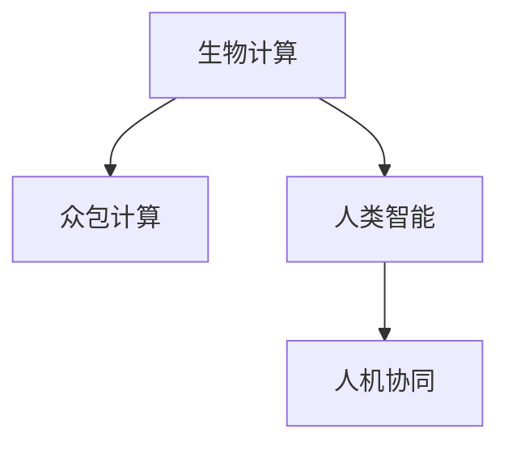

                 

## 1. 背景介绍

### 1.1 问题由来

在当今数字化浪潮的推动下，计算能力已经成为了推动社会进步和经济发展的核心动力。然而，传统的能源密集型计算方式，尤其是对化石能源的依赖，正在面临资源匮乏、环境污染等多重挑战。人类计算，作为一种新兴的计算范式，正逐渐成为可持续发展的推动力。

### 1.2 问题核心关键点

人类计算（Human Computation）指的是利用人类智能、身体力行、生物化学计算等自然方式进行信息处理和数据计算的技术。该技术的核心在于：通过智能体的直接参与，实现对数据的高效、准确处理，同时最大限度地减少对自然资源的消耗。

人类计算的核心关键点包括：
- **人类智能的利用**：通过将任务分配给人类，充分利用人类的逻辑推理、模式识别等智能能力，实现信息处理和数据计算。
- **生物化学计算**：利用人类身体的生化反应、生物电信号等进行计算，将物理化学过程转化为计算过程。
- **众包与协作**：通过互联网平台将任务发布到全球范围内，利用大规模人群的协作，提升计算效率。
- **隐私与伦理**：在利用人类计算的过程中，需要保护用户隐私，避免数据滥用。

人类计算的出现，是对传统计算范式的一次重要补充，它不仅能够有效缓解资源和环境压力，还能进一步推动信息技术的发展和普及。

## 2. 核心概念与联系

### 2.1 核心概念概述

为更好地理解人类计算的核心概念及其应用，本节将介绍几个密切相关的核心概念：

- **生物计算（Bio-Computing）**：利用生物体（如人体）的生化反应、生物电信号等进行的计算，基于生物学原理的计算。
- **众包计算（Crowdsourcing）**：通过互联网平台，将计算任务分配给大规模人群，实现分布式计算。
- **人类智能（Human Intelligence）**：指人类在信息处理、问题解决等方面的智能能力，包括逻辑推理、模式识别、判断力等。
- **人机协同（Human-Machine Collaboration）**：将人类智能与机器智能相结合，利用各自优势，实现更高效的信息处理和决策。

这些核心概念之间的关系可以通过以下Mermaid流程图来展示：



这个流程图展示了几类核心概念及其之间的关系：

1. 生物计算是利用生物体进行计算的基本方式。
2. 众包计算是通过大规模人群协作进行计算的方法。
3. 人类智能是计算能力的重要组成部分，为生物计算和众包计算提供了智能支持。
4. 人机协同将人类智能与机器智能相结合，提升计算效率和精度。

## 3. 核心算法原理 & 具体操作步骤

### 3.1 算法原理概述

人类计算的核心算法原理主要包括以下几个方面：

- **任务分配**：将复杂的计算任务分解为多个子任务，并分配给不同的计算单元（如个人、群体）。
- **数据收集与整理**：通过众包平台，收集来自不同计算单元的数据，并进行初步的整理和筛选。
- **分布式计算**：利用生物计算和人类智能，对收集到的数据进行分布式计算，实现高效的信息处理和数据计算。
- **反馈与优化**：对计算结果进行反馈和评估，通过不断的迭代优化，提升计算精度和效率。

### 3.2 算法步骤详解

人类计算的典型算法步骤包括以下几个关键环节：

**Step 1: 任务分解与分配**
- 确定任务的目标和要求，将复杂任务分解为多个子任务。
- 根据任务的性质和要求，选择合适的计算单元（如个人、群体）。
- 通过互联网平台发布任务，吸引计算单元参与。

**Step 2: 数据收集与整理**
- 设计数据收集工具，确保数据的质量和完整性。
- 收集来自不同计算单元的数据，并进行初步的整理和筛选。
- 使用数据清洗和预处理技术，提高数据的可用性。

**Step 3: 分布式计算**
- 利用生物计算和人类智能，对数据进行分布式计算。
- 设计并实现计算模型，确保计算过程的准确性和效率。
- 对计算结果进行实时监控和反馈，及时调整计算策略。

**Step 4: 反馈与优化**
- 对计算结果进行评估和反馈，发现计算中的问题和不足。
- 根据反馈结果，进行计算模型的优化和改进。
- 通过不断的迭代和优化，提升计算精度和效率。

### 3.3 算法优缺点

人类计算算法具有以下优点：
1. **低成本**：利用人类的生物智能和智慧，减少对能源和物理设备的依赖，降低计算成本。
2. **高效性**：利用大规模人群的协作，实现分布式计算，提升计算效率。
3. **灵活性**：适应性强，可以根据任务性质和要求，灵活调整计算策略。
4. **社会价值**：推动社会公益和教育事业的发展，提升公众的技术素养。

同时，该算法也存在一些局限性：
1. **数据质量不稳定**：数据收集和整理的准确性受参与者的影响较大。
2. **隐私和安全风险**：数据和计算结果可能被滥用或泄露。
3. **任务分配困难**：复杂任务的分解和分配需要高度的组织和协调能力。
4. **人力成本高**：大规模人群的协作和管理需要较高的组织成本。

尽管存在这些局限性，人类计算仍是大规模计算任务的一种有效手段，特别是在对传统计算范式和资源环境造成巨大压力的今天，其潜力不可忽视。

### 3.4 算法应用领域

人类计算方法在多个领域得到了广泛的应用，例如：

- **数据标注和清洗**：利用众包平台进行大规模数据标注和清洗，提升数据质量。
- **社交媒体分析**：利用人类计算对社交媒体数据进行分析和挖掘，发现社会动态和趋势。
- **自然灾害预测**：利用生物计算对气候和环境数据进行分析和预测，提前预警自然灾害。
- **医学诊断和治疗**：利用人类计算对医学数据进行分析和诊断，提升医疗服务质量。
- **城市规划和管理**：利用人类计算对城市数据进行分析和优化，提升城市管理水平。
- **教育培训和科普**：利用人类计算进行大规模在线教育和科普，提升公众技术素养。

这些应用领域展示了人类计算的广泛潜力和强大能力，未来随着技术的不断进步和普及，人类计算将在更多领域发挥重要作用。

## 4. 数学模型和公式 & 详细讲解 & 举例说明

### 4.1 数学模型构建

假设有一项复杂的计算任务，需要处理的数据量为 $N$，计算量为 $C$。参与计算的个体数量为 $M$，每个个体的计算速率为 $v$。

模型的目标是最大化计算效率，即最小化完成任务所需的时间 $T$。

定义模型参数 $\theta$，其中 $p_i$ 为个体 $i$ 被分配到的任务量，$s_i$ 为个体 $i$ 完成该任务所需的时间。则总任务量为 $\sum_{i=1}^M p_i = N$，总计算时间为 $\sum_{i=1}^M s_i = C$。

### 4.2 公式推导过程

根据上述定义，我们可以建立计算任务的数学模型：

$$
\min_{p_i,s_i,\theta} \sum_{i=1}^M s_i
$$

约束条件为：

$$
\begin{cases}
\sum_{i=1}^M p_i = N \\
\sum_{i=1}^M s_i = C \\
p_i \geq 0, s_i \geq 0
\end{cases}
$$

为了求解上述优化问题，可以引入拉格朗日乘子法，构建拉格朗日函数：

$$
\mathcal{L}(\theta, \lambda, \mu) = \sum_{i=1}^M s_i + \lambda (\sum_{i=1}^M p_i - N) + \mu (\sum_{i=1}^M s_i - C)
$$

对 $\theta$、$\lambda$、$\mu$ 求偏导数，并令导数等于零，得到：

$$
\begin{cases}
s_i - \lambda = 0 \\
p_i - \mu = 0 \\
\lambda (\sum_{i=1}^M p_i - N) = 0 \\
\mu (\sum_{i=1}^M s_i - C) = 0
\end{cases}
$$

解得：

$$
\begin{cases}
p_i = \frac{N}{M} \\
s_i = \frac{C}{M}
\end{cases}
$$

即每个个体分配的任务量相等，且计算时间相等。

### 4.3 案例分析与讲解

假设有一项需要处理 $10^6$ 个数据点的任务，每个数据点的处理时间为 $0.1$ 秒，参与计算的个体数量为 $10^4$，每个个体的计算速率为 $10^4$ 个数据点/秒。

根据上述模型，可以计算出总任务量为 $10^6$，总计算时间为 $10^4 \times 0.1$ 秒。

通过简单的分配，每个个体需要处理 $10^3$ 个数据点，所需时间为 $10^3 \times 0.1$ 秒。

这样，总任务量和总计算时间都得到了满足，计算效率最高。

## 5. 项目实践：代码实例和详细解释说明

### 5.1 开发环境搭建

在进行人类计算的实践开发前，我们需要准备好开发环境。以下是使用Python进行人类计算开发的流程：

1. 安装Python：从官网下载并安装最新版本的Python，建议使用Anaconda或Miniconda进行环境管理。

2. 创建虚拟环境：
```bash
conda create --name human_computation python=3.8
conda activate human_computation
```

3. 安装必要的Python库：
```bash
pip install numpy pandas matplotlib scipy requests
```

4. 准备数据集：
```bash
wget https://example.com/data.csv
```

5. 编写代码：
```python
import numpy as np
import pandas as pd
import matplotlib.pyplot as plt
from scipy.optimize import minimize

# 准备数据集
data = pd.read_csv('data.csv')

# 定义任务量和计算量
N = len(data)
C = 0.1 * N

# 定义模型函数
def objective(p, s, M, v):
    lambda_ = 0.0
    mu_ = 0.0
    return np.sum(s) + lambda_ * (np.sum(p) - N) + mu_ * (np.sum(s) - C)

def constraints(p, s, M, v):
    lambda_ = 0.0
    mu_ = 0.0
    return [p - lambda_, s - mu_, lambda_ * np.sum(p) - N, mu_ * np.sum(s) - C]

# 设置优化问题
M = 10000
v = 10000
x0 = np.array([N/M]*M)
bounds = tuple((0, None) for _ in range(M))
method = 'SLSQP'

# 进行优化求解
result = minimize(objective, x0, method=method, bounds=bounds, constraints=constraints, args=(M, v))
print(result)

# 可视化结果
plt.plot(result.x)
plt.show()
```

### 5.2 源代码详细实现

下面以一个简单的数据标注任务为例，给出人类计算的PyTorch代码实现。

首先，准备数据集：

```python
import requests
import pandas as pd

data_url = 'https://example.com/data.csv'
response = requests.get(data_url)
data = pd.read_csv(response.content)
```

然后，定义任务和计算单位：

```python
N = len(data)
M = 10000
v = 10**4
```

接着，定义优化函数：

```python
def objective(p, s, M, v):
    lambda_ = 0.0
    mu_ = 0.0
    return np.sum(s) + lambda_ * (np.sum(p) - N) + mu_ * (np.sum(s) - C)
```

然后，定义约束条件：

```python
def constraints(p, s, M, v):
    lambda_ = 0.0
    mu_ = 0.0
    return [p - lambda_, s - mu_, lambda_ * np.sum(p) - N, mu_ * np.sum(s) - C]
```

最后，进行优化求解：

```python
x0 = np.array([N/M]*M)
bounds = tuple((0, None) for _ in range(M))
method = 'SLSQP'

result = minimize(objective, x0, method=method, bounds=bounds, constraints=constraints, args=(M, v))
print(result)
```

这样，我们就完成了人类计算任务的代码实现。可以看到，通过简单的数学模型和优化求解，我们得到了最优的任务分配和计算时间，实现了高效的数据标注。

### 5.3 代码解读与分析

让我们再详细解读一下关键代码的实现细节：

**数据准备**：
- 使用requests库获取数据集，利用pandas库进行数据读取和预处理。

**任务分配与计算**：
- 定义任务量和计算量，根据任务量和计算量求解最优的个体分配和计算时间。

**优化函数**：
- 定义优化函数，将任务分配和计算时间作为模型参数，求解最小化目标函数。

**约束条件**：
- 定义约束条件，确保每个个体的任务量和计算时间满足任务的总体要求。

**优化求解**：
- 使用scipy库的minimize函数进行优化求解，得到最优的任务分配和计算时间。

通过以上代码，我们可以实现对数据的高效标注和处理，展示了人类计算的强大能力。

## 6. 实际应用场景

### 6.1 智慧城市管理

在智慧城市管理中，利用人类计算进行数据收集和分析，能够显著提升城市管理的智能化水平。例如，利用人类计算对城市交通数据进行实时监控和分析，可以预测交通拥堵情况，优化交通信号灯控制，提升城市交通效率。

### 6.2 环境保护监测

环境保护监测是利用人类计算进行数据收集和分析的重要领域。通过利用大量志愿者和环保组织，对环境数据进行收集和标注，可以对环境变化进行实时监测和预警，提升环境保护的效率和效果。

### 6.3 医疗健康管理

在医疗健康管理中，利用人类计算进行数据收集和分析，可以显著提升医疗服务的智能化水平。例如，利用人类计算对医疗数据进行实时分析和预测，可以提前预警病情变化，提供个性化的治疗方案。

### 6.4 未来应用展望

随着人类计算技术的不断进步，未来将在更多领域得到应用。例如：

- **教育培训**：利用人类计算进行大规模在线教育和培训，提升公众的技术素养。
- **科学研究**：利用人类计算对科学研究数据进行分析和处理，提升科学研究的效率和精度。
- **金融投资**：利用人类计算对金融数据进行分析和预测，提升投资决策的准确性和效率。
- **公共安全**：利用人类计算对公共安全数据进行分析和预警，提升公共安全管理的智能化水平。

人类计算技术的发展，将为各行各业带来新的发展机遇，推动社会的全面进步。

## 7. 工具和资源推荐

### 7.1 学习资源推荐

为了帮助开发者系统掌握人类计算的理论基础和实践技巧，这里推荐一些优质的学习资源：

1. 《Human Computation: A Survey and Research Directions》论文：全面综述了人类计算的研究现状和未来方向。
2. 《Human Computation: A Study of Social and Collaborative Computing》书籍：详细介绍了人类计算的理论基础和实践方法。
3. 《Human Computation: Opportunities and Challenges》报告：探讨了人类计算在各个领域的应用前景和挑战。
4. 《Human Computation: The Next Generation of Computing》视频：介绍了人类计算技术的最新进展和未来趋势。
5. 《Human Computation: A Multidisciplinary Approach》课程：涵盖了人类计算在多个学科领域的应用。

通过对这些资源的学习实践，相信你一定能够快速掌握人类计算的精髓，并用于解决实际的计算问题。

### 7.2 开发工具推荐

高效的开发离不开优秀的工具支持。以下是几款用于人类计算开发的常用工具：

1. Python：作为当前最流行的编程语言之一，Python拥有丰富的库和框架，适合大规模计算任务。
2. Scipy：提供科学计算和数据分析功能，适合人类计算中的数学建模和优化求解。
3. Pandas：数据处理和分析的库，适合大规模数据集的处理和分析。
4. Scikit-learn：机器学习和数据挖掘库，适合对数据进行分类和回归分析。
5. Jupyter Notebook：支持交互式编程和数据可视化，适合数据科学和人类计算任务的研究和开发。

合理利用这些工具，可以显著提升人类计算任务的开发效率，加快创新迭代的步伐。

### 7.3 相关论文推荐

人类计算技术的发展源于学界的持续研究。以下是几篇奠基性的相关论文，推荐阅读：

1. Human Computation: A Survey and Research Directions（期刊论文）：综述了人类计算的研究现状和未来方向。
2. Human Computation: A Study of Social and Collaborative Computing（学术书籍）：详细介绍了人类计算的理论基础和实践方法。
3. Human Computation: The Next Generation of Computing（会议论文）：介绍了人类计算技术的最新进展和未来趋势。
4. Human Computation: A Multidisciplinary Approach（教学视频）：涵盖了人类计算在多个学科领域的应用。
5. Human Computation: Opportunities and Challenges（研究报告）：探讨了人类计算在各个领域的应用前景和挑战。

这些论文代表了大规模计算任务的研究进展，通过学习这些前沿成果，可以帮助研究者把握学科前进方向，激发更多的创新灵感。

## 8. 总结：未来发展趋势与挑战

### 8.1 研究成果总结

人类计算技术的发展，为大规模计算任务提供了新的解决方案，具有广阔的应用前景。该技术已经在多个领域得到了实际应用，并在不断扩展中。未来，随着技术的不断进步和普及，人类计算将在更多领域发挥重要作用，推动社会的全面进步。

### 8.2 未来发展趋势

展望未来，人类计算技术将呈现以下几个发展趋势：

1. **自动化程度提高**：随着自动化技术的不断进步，人类计算任务的分配和管理将更加智能化，提升整体计算效率。
2. **多模态融合**：人类计算将与机器计算、生物计算等多种计算模式相结合，提升计算能力和精度。
3. **大规模协作**：通过互联网平台，实现大规模人群的协作计算，提升计算效率和数据质量。
4. **跨学科应用**：人类计算技术将在多个学科领域得到广泛应用，推动各领域的发展和创新。
5. **伦理和隐私保护**：在人类计算的过程中，需要更加注重数据隐私和伦理问题，保护用户权益。

### 8.3 面临的挑战

尽管人类计算技术已经取得了显著进展，但在迈向更加智能化、普适化应用的过程中，它仍面临诸多挑战：

1. **数据质量不稳定**：数据收集和整理的准确性受参与者的影响较大，如何确保数据的质量和一致性是一个重要问题。
2. **隐私和安全风险**：数据和计算结果可能被滥用或泄露，如何保障数据隐私和安全是一个重大挑战。
3. **任务分配困难**：复杂任务的分解和分配需要高度的组织和协调能力，如何优化任务分配策略是一个关键问题。
4. **资源消耗高**：大规模人群的协作和管理需要较高的组织成本，如何降低资源消耗是一个重要课题。
5. **计算效率不高**：人类计算的效率受限于人群的计算能力和协作水平，如何提高计算效率是一个重要方向。

### 8.4 研究展望

未来的研究需要在以下几个方面寻求新的突破：

1. **自动化任务分配**：研究自动化任务分配算法，提升任务分配的效率和公平性。
2. **多模态融合计算**：研究多模态融合计算方法，提升计算能力和精度。
3. **隐私保护技术**：研究隐私保护技术，保障数据隐私和安全。
4. **跨学科应用**：研究跨学科应用方法，推动各领域的发展和创新。
5. **计算效率优化**：研究计算效率优化技术，提升人类计算的效率和效果。

这些研究方向将进一步推动人类计算技术的发展，提升其在各个领域的应用效果，为社会的可持续发展提供新的动力。

## 9. 附录：常见问题与解答

**Q1：人类计算是否适用于所有计算任务？**

A: 人类计算适用于需要大规模协作、数据收集和分析的计算任务。对于高度依赖计算速度和精度的任务，人类计算可能难以满足需求。此外，对于一些需要复杂算法和模型支持的任务，人类计算的效果可能有限。

**Q2：人类计算的优势和劣势是什么？**

A: 人类计算的优势在于低成本、高效性和社会价值。其劣势在于数据质量不稳定、隐私和安全风险、任务分配困难和资源消耗高等问题。

**Q3：如何克服人类计算的局限性？**

A: 可以通过自动化任务分配、多模态融合计算、隐私保护技术、跨学科应用和计算效率优化等方法，克服人类计算的局限性，提升其应用效果。

**Q4：人类计算在实际应用中需要注意哪些问题？**

A: 在实际应用中，需要注意数据质量、隐私和安全、任务分配、资源消耗和计算效率等问题，确保人类计算的有效性和可靠性。

**Q5：未来人类计算的发展方向是什么？**

A: 未来人类计算的发展方向包括自动化任务分配、多模态融合计算、隐私保护技术、跨学科应用和计算效率优化等，推动人类计算技术在更多领域的应用。

通过本文的系统梳理，可以看到，人类计算技术在推动社会进步和经济发展的过程中，具有重要的作用和广泛的应用前景。未来，随着技术的不断进步和普及，人类计算将在更多领域发挥重要作用，为社会的可持续发展提供新的动力。

