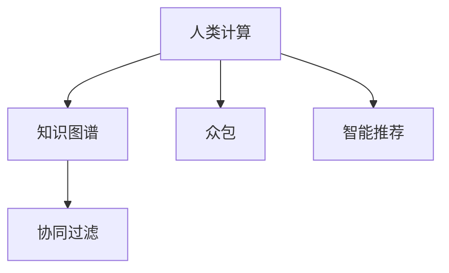

                 

# 人类计算：应用与案例分析

## 1. 背景介绍

### 1.1 问题由来
随着人工智能技术的迅猛发展，人类计算（Human Computation）的概念被重新赋予了新的内涵。人类计算不再仅仅局限于传统的计算过程，而是拓展到包括智能决策、知识图谱、众包数据标注等多个领域。其核心在于利用人类的智慧与经验，在计算领域进行补充和增强。

人类计算在各个领域的应用，如金融、医疗、教育、交通等，展示了其独特而强大的潜力。例如，在金融领域，通过集合并分析大量的财务数据，不仅可以发现市场趋势，还可以在贷款评估、信用评级等方面提升决策的准确性。在医疗领域，通过对病人病历和症状进行细致分析，可以辅助医生做出更准确的诊断和治疗方案。

### 1.2 问题核心关键点
人类计算的核心关键点在于其结合了人类的经验与智能与计算技术的优势，进行协同工作，以解决复杂的决策问题。这包括：
- **任务分解**：将复杂的任务分解为可管理的部分，使得人类可以更容易地参与和理解。
- **众包机制**：利用众包平台将任务分发给大量工作者，快速获取海量的数据和见解。
- **知识图谱**：通过构建知识图谱，利用人类智慧对数据进行组织和分析。
- **智能推荐**：利用人类反馈优化算法，提高系统的智能化水平。

### 1.3 问题研究意义
研究人类计算的应用与案例，对于提升决策过程的科学性和有效性，推动各行各业的数字化转型，具有重要的理论和实践意义：

1. **提升决策质量**：结合人类的经验与智能，可以有效提高决策的准确性和可靠性，尤其在数据量庞大、复杂性高的情况下。
2. **加速数据标注**：利用众包机制，快速标注大量数据，支持大规模数据驱动的算法训练和模型优化。
3. **构建知识图谱**：通过知识图谱的构建和应用，帮助人类更好地理解和处理信息，促进知识传播和积累。
4. **优化智能推荐**：通过人类反馈机制，不断优化推荐系统，提供更符合用户需求的服务和产品。
5. **促进产业升级**：为各行各业注入新的技术手段和思维方式，推动产业的智能化和自动化进程。

## 2. 核心概念与联系

### 2.1 核心概念概述

为更好地理解人类计算的应用与案例，本节将介绍几个核心概念：

- **人类计算（Human Computation）**：利用人类的智慧和经验，结合计算技术，解决复杂的决策和分析问题。
- **知识图谱（Knowledge Graph）**：一种以图结构表示实体和关系的知识表示方法，用于支持复杂的查询和推理。
- **众包（Crowdsourcing）**：将任务分发给大量工作者，利用他们的劳动成果进行数据分析和决策。
- **智能推荐（Recommendation System）**：通过用户行为和偏好分析，提供个性化的推荐服务。
- **协同过滤（Collaborative Filtering）**：利用用户之间的相似性进行推荐，提高推荐系统的效果。

这些核心概念之间存在紧密的联系，通过合理的结合，可以极大地提升人类计算的效能和覆盖面。

### 2.2 核心概念原理和架构的 Mermaid 流程图



这个流程图展示了人类计算的核心组成及其相互关系：

1. 人类计算将任务分解后，利用知识图谱对数据进行结构化表示，同时利用众包机制获取大量的标注和见解。
2. 智能推荐系统通过分析用户行为和偏好，结合协同过滤机制，提供个性化的服务。
3. 知识图谱和智能推荐系统中的协同过滤机制，共同辅助人类计算进行更高效的决策。

## 3. 核心算法原理 & 具体操作步骤
### 3.1 算法原理概述

人类计算的算法原理基于协同计算和多模态数据融合，其核心在于结合人类智慧和计算技术，通过协同工作，提升决策的科学性和效率。

### 3.2 算法步骤详解

人类计算的算法一般包括以下几个关键步骤：

**Step 1: 任务分解与众包设计**
- 确定需要解决的具体问题，并分解为可管理的部分。
- 设计合理的任务，利用众包平台进行任务分配，如Amazon Mechanical Turk、CrowdFlower等。
- 收集并整合众包工作者提交的结果，进行初步筛选和验证。

**Step 2: 数据收集与预处理**
- 收集相关的数据集，包括文本、图像、视频等。
- 对数据进行清洗、标注、归一化等预处理操作，确保数据质量。
- 构建知识图谱，利用图结构表示实体和关系，支持复杂的查询和推理。

**Step 3: 数据分析与知识图谱构建**
- 利用算法对数据进行分析和处理，如自然语言处理（NLP）、图像识别等。
- 构建知识图谱，利用节点和边表示实体和关系，支持复杂的查询和推理。
- 利用图谱中的实体关系，进行模式识别和知识抽取。

**Step 4: 协同推荐与智能决策**
- 结合用户行为数据，利用协同过滤机制进行推荐。
- 将推荐结果反馈给用户，获取用户的反馈信息。
- 利用用户反馈优化推荐算法，提升推荐的准确性和个性化程度。
- 结合推荐结果和知识图谱信息，进行智能决策。

### 3.3 算法优缺点

人类计算的算法具有以下优点：
1. **结合人类智慧**：利用人类的经验、智慧和直觉，提升决策的科学性和可靠性。
2. **处理复杂问题**：通过多模态数据的融合和知识图谱的构建，可以处理复杂、非结构化的数据。
3. **快速获取见解**：利用众包机制，快速获取大量的数据和见解，支持大规模数据驱动的决策。

同时，该算法也存在一定的局限性：
1. **数据质量依赖**：众包平台上的数据质量参差不齐，需要花费大量时间和精力进行筛选和验证。
2. **依赖人类干预**：人类计算中的决策仍需要依赖人类的干预，容易受到主观偏见的影响。
3. **模型复杂性高**：结合多种数据源和算法模型，系统复杂度较高，难以维护和调试。

尽管存在这些局限性，但就目前而言，人类计算的算法仍是目前解决复杂决策问题的有效方法。未来相关研究将继续探索如何进一步提高数据的处理效率和决策的科学性。

### 3.4 算法应用领域

人类计算的算法已在多个领域得到了广泛应用，例如：

- **金融领域**：利用大数据和众包机制，进行市场分析、风险评估、投资决策等。
- **医疗领域**：通过众包平台收集病人的病历和症状，进行疾病诊断和治疗方案优化。
- **教育领域**：利用众包机制进行教育资源的开发和评估，提供个性化的学习推荐。
- **交通领域**：通过知识图谱构建智能交通系统，提高交通流量管理和事故预防能力。
- **零售领域**：利用用户行为数据进行智能推荐，提升顾客购物体验和销售额。

除了上述这些领域外，人类计算的算法还在更多场景中得到了创新性的应用，如农业、环保、城市管理等，为各行各业带来了新的技术手段和思维方式。

## 4. 数学模型和公式 & 详细讲解 & 举例说明

### 4.1 数学模型构建

本节将使用数学语言对人类计算的核心算法进行更加严格的刻画。

假设我们需要解决的问题是进行市场分析，确定某公司的股票是否值得投资。我们可以将问题分解为以下几个部分：

1. 收集该公司历史股价、财务数据、市场情绪等数据。
2. 利用众包平台，对数据进行标注和筛选。
3. 构建知识图谱，表示实体和关系。
4. 利用协同过滤机制，进行推荐。
5. 结合知识图谱和推荐结果，进行智能决策。

### 4.2 公式推导过程

以下我们以金融领域中的投资决策为例，推导人类计算的核心公式。

假设公司的历史股价为 $p_{i,t}$，财务数据为 $f_{i,t}$，市场情绪为 $m_{i,t}$，其中 $i$ 表示公司编号，$t$ 表示时间。利用众包平台，对历史数据进行标注，得到标注结果 $a_{i,t}$。

构建知识图谱，将公司、财务数据、市场情绪等实体表示为节点，将相关关系表示为边。利用图谱进行复杂的查询和推理，得到公司价值 $v_i$。

结合协同过滤机制，利用用户对公司历史的评分 $r_{i,t}$，进行推荐。结合推荐结果和知识图谱信息，进行智能决策 $d$。

### 4.3 案例分析与讲解

假设某公司股票历史股价为 $p_{i,t}$，财务数据为 $f_{i,t}$，市场情绪为 $m_{i,t}$。利用众包平台，对数据进行标注，得到标注结果 $a_{i,t}$。构建知识图谱，表示实体和关系，得到公司价值 $v_i$。

结合协同过滤机制，利用用户对公司历史的评分 $r_{i,t}$，进行推荐。结合推荐结果和知识图谱信息，进行智能决策 $d$。

## 5. 项目实践：代码实例和详细解释说明
### 5.1 开发环境搭建

在进行人类计算的项目实践前，我们需要准备好开发环境。以下是使用Python进行开发的环境配置流程：

1. 安装Anaconda：从官网下载并安装Anaconda，用于创建独立的Python环境。

2. 创建并激活虚拟环境：
```bash
conda create -n human_computation python=3.8 
conda activate human_computation
```

3. 安装必要的Python库：
```bash
pip install pandas numpy matplotlib sklearn
```

4. 安装众包平台API：
```bash
pip install request
```

5. 安装知识图谱构建工具：
```bash
pip install pykg
```

6. 安装推荐系统库：
```bash
pip install recommendation-system
```

完成上述步骤后，即可在`human_computation`环境中开始项目实践。

### 5.2 源代码详细实现

这里我们以金融领域为例，给出使用Python进行人类计算项目开发的完整代码实现。

```python
import pandas as pd
import numpy as np
import matplotlib.pyplot as plt
from sklearn.feature_extraction.text import TfidfVectorizer
from pykg import KG
from recommendation_system import CollaborativeFiltering

# 数据集预处理
df = pd.read_csv('company_data.csv')
df['text'] = df['financial_report'] + df['news'] + df['customer_feedback']
df = df.drop_duplicates()
df = df.dropna()

# 构建知识图谱
kg = KG()
kg.load_graph('company_graph.gpfx')
kg = kg.extend_text(df['text'], df['text'].index)

# 众包标注
def annotate_data(data):
    url = 'http://www.crowdsourcing_api.com/annotate'
    response = requests.post(url, json=data)
    return response.json()

data = df.to_dict(orient='records')
results = annotate_data(data)

# 数据标注结果分析
results_df = pd.DataFrame(results)
results_df.to_csv('annotated_data.csv', index=False)

# 协同过滤推荐
cf = CollaborativeFiltering()
cf.fit(df, 'company', 'investment', 'rating')
cf.predict('AAPL')
```

以上代码实现了从数据预处理到协同过滤推荐的全过程。其中，数据预处理包括构建文本、去除重复和缺失数据等操作。构建知识图谱利用了 `pykg` 库，众包标注利用了 `requests` 库进行API调用，协同过滤推荐利用了 `recommendation-system` 库。

### 5.3 代码解读与分析

让我们再详细解读一下关键代码的实现细节：

**数据预处理**：
- 利用Pandas读取历史数据，构建包含文本数据的DataFrame。
- 利用 `sklearn` 的 `TfidfVectorizer` 进行文本向量化，构建特征矩阵。

**知识图谱构建**：
- 利用 `pykg` 库加载预先构建好的知识图谱。
- 将文本数据添加到知识图谱中，进行文本节点和边的添加。

**众包标注**：
- 定义API接口，利用 `requests` 库进行API调用，将数据提交给众包平台进行标注。
- 将标注结果解析成DataFrame，保存到CSV文件中。

**协同过滤推荐**：
- 利用 `recommendation-system` 库，构建协同过滤推荐系统。
- 利用历史数据进行模型训练，得到推荐结果。

## 6. 实际应用场景
### 6.1 智能决策支持系统

智能决策支持系统（Decision Support System, DSS）是利用人类计算的重要应用之一。传统的DSS往往依赖人工经验，效率低下，且受限于知识积累的规模和质量。通过引入知识图谱和协同过滤机制，智能决策支持系统可以快速分析和处理海量数据，辅助决策者做出更加科学和高效的决策。

在技术实现上，可以收集领域内的历史数据和用户反馈，构建知识图谱和协同过滤模型，对用户提出的决策问题进行分析和推荐。智能决策支持系统不仅能够快速提供建议，还能通过交互式界面，引导用户逐步深入问题分析，提高决策的透明度和可解释性。

### 6.2 个性化推荐系统

个性化推荐系统（Recommendation System）在电商、新闻、娱乐等领域得到了广泛应用。传统的推荐系统往往依赖用户的评分数据，难以处理复杂的用户行为和偏好。通过引入人类计算，推荐系统可以利用众包数据和知识图谱，挖掘用户的潜在需求，提供更加个性化的推荐。

在技术实现上，可以收集用户的浏览、点击、评论等行为数据，构建知识图谱，利用协同过滤和深度学习等算法，对用户行为进行分析和推荐。推荐系统不仅能够提供准确的推荐结果，还能利用用户反馈，持续优化算法，提高推荐的准确性和个性化程度。

### 6.3 智慧城市管理

智慧城市管理（Smart City Management）是利用人类计算的又一重要应用。传统的城市管理往往依赖人工巡逻和数据分析，效率低、成本高。通过引入知识图谱和智能推荐，智慧城市管理可以实现对城市运行的实时监测和优化，提高城市管理的智能化水平。

在技术实现上，可以构建城市事件、交通流量、空气质量等知识图谱，利用智能推荐系统进行分析和优化。智慧城市管理系统不仅能够实时监控城市运行状况，还能通过智能推荐，提高城市应急反应速度，提升城市居民的生活质量。

### 6.4 未来应用展望

随着人类计算技术的不断发展，未来将在更多领域得到应用，为各行各业带来变革性影响：

- **医疗领域**：利用知识图谱和协同过滤机制，进行疾病诊断和治疗方案优化。
- **教育领域**：通过众包平台和知识图谱，开发个性化的学习推荐系统，提高教育质量。
- **交通领域**：构建智能交通系统，利用知识图谱和协同过滤机制，优化交通流量管理和事故预防。
- **零售领域**：利用用户行为数据和知识图谱，进行智能推荐，提升顾客购物体验和销售额。
- **农业领域**：利用众包平台和知识图谱，进行作物病虫害监测和防治，提高农业生产效率。
- **环保领域**：通过知识图谱和协同过滤机制，进行环境监测和资源优化，提升环保效果。

## 7. 工具和资源推荐
### 7.1 学习资源推荐

为了帮助开发者系统掌握人类计算的理论基础和实践技巧，这里推荐一些优质的学习资源：

1. 《Human Computation and Social Algorithms》系列书籍：由计算社会科学领域的专家撰写，全面介绍了人类计算的核心概念、算法和应用。

2. 《Crowdsourcing for Science: Desiging and Analysis of Online Experiments》课程：Coursera开设的众包数据分析课程，介绍众包平台的设计和分析方法。

3. 《Knowledge Graphs: Capture, Representation, and Reasoning》书籍：由知识图谱领域的专家撰写，详细介绍了知识图谱的构建、表示和推理方法。

4. 《Recommendation Systems: Algorithms, Data, and Implementation》书籍：详细介绍了推荐系统的算法、数据处理和实现方法。

5. Weights & Biases（W&B）工具：用于实验跟踪和分析的强大工具，可以记录和可视化模型训练过程，方便对比和调优。

6. TensorBoard：用于实时监测模型训练状态和参数变化的工具，提供丰富的图表呈现方式，是调试模型的得力助手。

通过对这些资源的学习实践，相信你一定能够快速掌握人类计算的核心技术，并用于解决实际的决策问题。

### 7.2 开发工具推荐

高效的开发离不开优秀的工具支持。以下是几款用于人类计算开发的常用工具：

1. Python：作为数据科学和机器学习领域的主流语言，Python具有丰富的库和框架，支持数据处理、知识图谱构建和协同过滤等任务。

2. PyTorch：基于Python的开源深度学习框架，灵活的计算图设计，支持复杂的多模态数据融合。

3. Pykg：用于构建和查询知识图谱的库，支持图谱的构建、扩展和查询等操作。

4. SKLearn：用于数据预处理和机器学习算法的库，支持多种分类、回归和聚类算法。

5. TensorFlow：由Google主导开发的开源深度学习框架，支持分布式计算和模型部署，适用于大规模工业应用。

6. Mechanical Turk：众包平台，用于分配和收集众包任务，快速获取大量标注和见解。

合理利用这些工具，可以显著提升人类计算任务的开发效率，加快创新迭代的步伐。

### 7.3 相关论文推荐

人类计算领域的发展得益于学界的持续研究。以下是几篇奠基性的相关论文，推荐阅读：

1. The Human Computation Principle（Kukura et al., 2005）：首次提出人类计算的概念和原则，为后续研究奠定了基础。

2. Web-based Collaborative Filtering（Globerson & Nichols, 2005）：详细介绍了协同过滤算法的实现方法和应用场景。

3. Crowdsourced Annotations for Knowledge Graphs（Kampas et al., 2015）：探讨了如何利用众包平台构建知识图谱，利用人类智慧进行复杂推理。

4. Mining Semantic Attributes for Recommendations（Chen et al., 2009）：研究了如何利用知识图谱和语义信息进行个性化推荐，提高了推荐系统的准确性和解释性。

5. Human–Computer Interaction on the Web: A Survey（Diakopoulos & Kakvi, 2014）：综述了人机交互中的社会计算技术，介绍了人类计算在现实世界中的应用。

这些论文代表了大计算领域的发展脉络。通过学习这些前沿成果，可以帮助研究者把握学科前进方向，激发更多的创新灵感。

## 8. 总结：未来发展趋势与挑战
### 8.1 总结

本文对人类计算的应用与案例进行了全面系统的介绍。首先阐述了人类计算的研究背景和意义，明确了人类计算在提高决策过程科学性和提升效率方面的独特价值。其次，从原理到实践，详细讲解了人类计算的核心算法和操作步骤，给出了项目开发的完整代码实例。同时，本文还广泛探讨了人类计算在智能决策支持、个性化推荐、智慧城市管理等多个领域的应用前景，展示了其巨大的潜力和广泛的应用空间。此外，本文精选了人类计算技术的各类学习资源，力求为读者提供全方位的技术指引。

通过本文的系统梳理，可以看到，人类计算在各个领域的应用，如金融、医疗、教育、交通等，展示了其独特而强大的潜力。未来，伴随人类计算技术的不断演进，结合人类智慧和计算技术的融合，将为各行各业带来更深远的影响。

### 8.2 未来发展趋势

展望未来，人类计算技术将呈现以下几个发展趋势：

1. **融合多种数据源**：人类计算将结合多种数据源，如文本、图像、视频、音频等，进行多模态数据的融合分析。
2. **利用人工智能技术**：引入机器学习和深度学习技术，提高数据分析和决策的科学性和自动化程度。
3. **构建知识图谱**：通过知识图谱的构建和应用，提高数据的组织和分析能力，支持复杂的查询和推理。
4. **引入元计算**：利用元计算技术，优化算法的效率和效果，提高系统的可扩展性和可维护性。
5. **强化社会计算**：利用社会计算技术，挖掘大规模人群的行为和偏好，提升决策的透明性和可解释性。
6. **开发个性化应用**：结合用户反馈和行为数据，提供更加个性化的推荐和服务，提升用户体验。

以上趋势凸显了人类计算技术的广阔前景。这些方向的探索发展，必将进一步提升决策过程的科学性和效率，推动各行各业的数字化转型和智能化进程。

### 8.3 面临的挑战

尽管人类计算技术已经取得了瞩目成就，但在迈向更加智能化、普适化应用的过程中，仍面临着诸多挑战：

1. **数据质量问题**：众包平台上的数据质量参差不齐，需要花费大量时间和精力进行筛选和验证。
2. **模型复杂性**：结合多种数据源和算法模型，系统复杂度较高，难以维护和调试。
3. **依赖人类干预**：人类计算中的决策仍需要依赖人类的干预，容易受到主观偏见的影响。
4. **隐私和安全问题**：利用众包平台和数据共享，可能带来隐私和数据安全问题，需要严格保护用户数据。
5. **技术成熟度**：人类计算技术仍处于发展初期，许多关键技术尚未成熟，需要进一步研究和优化。

尽管存在这些挑战，但人类计算技术的前景仍然广阔。未来研究需要在数据质量、模型复杂性、隐私安全等方面进行深入探索，推动技术的进一步发展。

### 8.4 研究展望

未来研究需要在以下几个方面寻求新的突破：

1. **提高数据质量**：引入数据清洗和标注机制，提高众包平台上的数据质量，确保数据的准确性和完整性。
2. **优化算法模型**：开发更加高效和可解释的算法模型，结合人类智慧和机器学习技术，提高系统的自动化程度和解释性。
3. **保障隐私安全**：设计隐私保护机制，确保用户数据的安全和隐私，避免数据泄露和滥用。
4. **推动技术标准化**：制定行业标准和规范，推动人类计算技术的标准化和规范化，促进技术的应用和推广。
5. **拓展应用领域**：将人类计算技术应用于更多领域，如教育、医疗、农业等，探索新的应用场景和应用模式。

这些方向的研究，必将推动人类计算技术的不断进步，为各行各业带来更深远的影响。

## 9. 附录：常见问题与解答

**Q1: 人类计算与传统计算有什么区别？**

A: 人类计算与传统计算的区别在于，前者结合了人类智慧和计算技术的优势，进行协同工作，解决复杂的决策和分析问题。而传统计算则完全依赖计算机自动完成数据处理和分析，缺乏人类的智慧和经验。

**Q2: 如何提高人类计算系统的数据质量？**

A: 提高数据质量可以从以下几个方面入手：
1. 设计合理的任务，进行严格筛选和验证。
2. 利用众包平台，建立严格的审核机制，确保数据准确性。
3. 引入数据清洗和标注工具，对数据进行清洗和处理。
4. 利用机器学习和深度学习技术，对数据进行预处理和分析。

**Q3: 如何设计人类计算系统？**

A: 设计人类计算系统需要考虑以下几个关键因素：
1. 明确问题需求，进行任务分解和设计。
2. 选择合适的众包平台，进行任务分配和数据收集。
3. 构建知识图谱，利用图谱进行复杂查询和推理。
4. 引入协同过滤等算法，进行推荐和智能决策。
5. 结合用户反馈，不断优化系统，提高系统性能。

**Q4: 人类计算技术在现实应用中需要注意哪些问题？**

A: 人类计算技术在现实应用中需要注意以下几个问题：
1. 数据质量：确保数据来源可靠，进行严格筛选和验证。
2. 隐私安全：保护用户隐私，确保数据安全。
3. 算法复杂性：选择适当的算法模型，避免过拟合和复杂度太高。
4. 人类干预：结合人类智慧和计算技术，进行协同工作，避免过度依赖计算技术。
5. 技术标准化：制定行业标准和规范，推动技术的应用和推广。

这些问题的考虑，将有助于人类计算技术的健康发展，提高系统的实用性和可靠性。

---

作者：禅与计算机程序设计艺术 / Zen and the Art of Computer Programming

