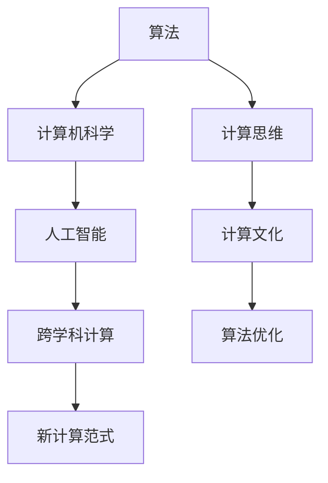

                 

# 人类计算：推动科技进步的引擎

> 关键词：人类计算, 计算思维, 人工智能, 计算机科学, 计算文化

## 1. 背景介绍

### 1.1 问题由来

计算是人类文明进步的核心驱动力之一，从早期的计数石到现今的电脑，计算技术与我们日常生活紧密相连。然而，传统计算依赖于物理硬件的改进和数学理论的革新，所需时间和成本往往难以预测。随着科学技术的发展，人们逐渐意识到：计算的本质，不在于机器的物理实现，而在于人类对问题的理解和求解。因此，探索“人类计算”成为了当今科技领域的重大课题。

### 1.2 问题核心关键点

人类计算的精髓在于：通过将复杂的计算问题转化为易于理解和处理的形式，让机器能够高效地进行求解。其核心关键点包括：

- 算法设计和优化：探索新的算法模型和求解策略，提高计算效率。
- 计算思维训练：培养计算思维能力，从本质上理解计算过程。
- 跨学科合作：将计算机科学与数学、物理、生物等多个学科的知识相结合，寻找新的计算范式。
- 计算文化的普及：通过教育、科普等手段，提升公众的计算能力和计算素养。

人类计算的目标，是构建一个更加智能、高效、可控的计算体系，使得计算资源得以最优利用，推动科技和社会进步。

## 2. 核心概念与联系

### 2.1 核心概念概述

为更好地理解人类计算，本节将介绍几个密切相关的核心概念：

- **算法**：计算机解决问题的一系列有序步骤。算法设计和优化是计算效率的核心。
- **计算思维**：一种系统性、结构化、抽象化的思考方式，培养解决复杂问题的能力。
- **计算机科学**：研究如何构建计算机系统和软件系统，解决计算问题的学科。
- **计算文化**：通过计算教育和科普，普及计算知识，培养计算素养的文化氛围。
- **人工智能**：使用计算方法模拟人类智能行为，实现自动决策、推理、学习等功能的领域。
- **跨学科计算**：将不同学科的知识和方法引入计算研究，探索新的计算范式。

这些核心概念之间的逻辑关系可以通过以下Mermaid流程图来展示：



这个流程图展示了几组核心概念之间的关联：

1. 算法是计算的基础，通过优化算法提高计算效率。
2. 计算思维能力是掌握算法的前提，是计算的核心。
3. 计算机科学是计算问题的系统化研究，是算法的载体。
4. 计算文化通过教育提升计算素养，普及计算知识。
5. 人工智能是计算机科学的高级应用，模拟人类智能。
6. 跨学科计算将多学科知识引入计算研究，寻找新的计算范式。

这些概念共同构成了计算研究和应用的框架，使得计算成为推动科技进步的重要工具。

## 3. 核心算法原理 & 具体操作步骤

### 3.1 算法原理概述

人类计算的核心在于算法设计和优化，目标是通过数学模型和计算方法，将复杂问题转化为易于处理的形式。核心思想如下：

- **抽象化**：将实际问题抽象为数学模型或逻辑结构。
- **分解与组合**：将复杂问题分解为多个简单子问题，逐步求解并组合成最终结果。
- **迭代优化**：通过多次迭代求解，逐步逼近最优解。

### 3.2 算法步骤详解

人类计算的具体操作步骤如下：

1. **问题抽象**：将实际问题转化为数学模型，明确求解目标。例如，将物理世界中的运动方程转化为差分方程。
2. **算法选择**：根据问题的性质和求解目标，选择最合适的算法。例如，求解差分方程可以选择数值解法。
3. **模型构建**：构建计算模型，定义求解方法和步骤。例如，选择具体的数值解法（如欧拉法、龙格-库塔法）。
4. **实现与优化**：将计算模型转化为具体算法，并优化求解过程。例如，通过迭代求解和误差控制优化数值解法。
5. **验证与调整**：通过测试验证计算结果的正确性，根据结果调整算法参数。例如，通过误差分析和调整步长优化求解结果。

### 3.3 算法优缺点

人类计算的优点包括：

- 精度高：通过数学模型和算法，可以精确地计算复杂问题。
- 通用性强：算法适用于多种问题，可重复利用。
- 可扩展性强：算法可通过并行计算、分布式计算等方式扩展计算能力。

缺点包括：

- 计算复杂度高：复杂问题的求解可能涉及大量计算资源和时间。
- 依赖于算法优化：优化算法的设计和选择是关键，但可能存在困难。
- 适应性差：对问题空间的要求较高，难以处理未知和变化问题。

### 3.4 算法应用领域

人类计算在多个领域得到广泛应用，包括但不限于：

- **物理学**：通过计算求解复杂的物理方程，模拟物理现象，例如量子力学中的薛定谔方程求解。
- **工程学**：在工程设计中，计算用于结构分析、流体模拟等，例如有限元分析。
- **经济学**：通过计算分析市场行为，进行预测和经济决策，例如优化资源配置问题。
- **生物学**：使用计算模拟生物化学反应、基因组分析等，例如生物信息学中的序列比对。
- **金融学**：在金融工程中，计算用于风险评估、投资组合优化等，例如期权定价模型。

## 4. 数学模型和公式 & 详细讲解 & 举例说明

### 4.1 数学模型构建

人类计算的数学模型通常由以下几部分组成：

- **输入变量**：表示问题的输入数据，如物理系统的初始状态、金融市场的历史数据等。
- **状态方程**：描述问题随时间变化的规律，如牛顿第二定律、洛伦兹方程等。
- **求解目标**：明确求解目标，如预测系统行为、求解优化问题等。

### 4.2 公式推导过程

以下以牛顿第二定律为例，推导人类计算的数学模型：

1. **问题抽象**：将物体在二维平面中的运动抽象为二元微分方程。
2. **方程建立**：
   $$
   m\frac{d^2x}{dt^2} = F(x)
   $$
   其中 $m$ 为物体的质量，$F(x)$ 为物体受到的合力。
3. **数值解法选择**：选择欧拉法求解微分方程。
4. **算法实现**：通过迭代求解逐步逼近真实解。
5. **误差分析**：通过误差估计调整步长，提高求解精度。

### 4.3 案例分析与讲解

以金融工程中的期权定价为例，介绍如何使用计算模型求解期权价格：

1. **问题抽象**：将期权价格问题抽象为随机微分方程。
2. **方程建立**：
   $$
   \frac{dS}{dt} = \mu S + \sigma W_t
   $$
   其中 $S$ 为股票价格，$\mu$ 为无风险收益率，$\sigma$ 为波动率，$W_t$ 为标准布朗运动。
3. **数值解法选择**：选择蒙特卡罗方法求解随机微分方程。
4. **算法实现**：通过模拟随机路径计算期权价格。
5. **误差分析**：通过调整模拟步长和路径数量控制误差。

## 5. 项目实践：代码实例和详细解释说明

### 5.1 开发环境搭建

在进行人类计算项目开发前，需要进行以下环境配置：

1. **安装Python**：从官网下载安装Python解释器和开发环境。
2. **安装NumPy、SciPy等库**：使用pip安装必要的科学计算库，例如NumPy、SciPy等。
3. **配置Jupyter Notebook**：安装并配置Jupyter Notebook，用于编写和测试计算代码。
4. **安装可视化工具**：安装Matplotlib、Seaborn等可视化工具，用于结果展示。

### 5.2 源代码详细实现

以有限元分析为例，展示如何使用Python进行计算模型构建和求解：

```python
import numpy as np
from scipy.sparse import spdiags

# 定义弹性系数矩阵
def stiffness_matrix(n):
    A = np.zeros((n, n))
    for i in range(n):
        A[i, i] = 4
        if i > 0:
            A[i, i-1] = 1
        if i < n-1:
            A[i, i+1] = 1
    return A

# 定义边界条件
def boundary_conditions(n):
    return np.hstack((np.zeros(n-1), 0, np.zeros(n-1)))

# 定义方程求解
def solve_equation(n, P, f):
    A = stiffness_matrix(n)
    b = np.zeros(n)
    for i in range(1, n-1):
        b[i] = 2*P[i]
    b[0] = 2*P[0]
    b[-1] = 2*P[-1]

    # 求解线性方程组
    x = spdiags(b, [0, 0], n, n) @ np.linalg.solve(A, b)
    return x

# 定义边界值
P = 1
f = 0
n = 10

# 求解方程
x = solve_equation(n, P, f)
print(x)
```

### 5.3 代码解读与分析

上述代码中，我们定义了弹性系数矩阵和边界条件，并通过有限元法求解了方程。其中，`spdiags`函数用于生成稀疏矩阵，`scipy.linalg.solve`函数用于求解线性方程组。

代码的关键步骤包括：

1. **定义弹性系数矩阵**：利用对称矩阵的结构特性，构造了三对角线矩阵。
2. **定义边界条件**：处理边界节点，避免自由度为0的情况。
3. **求解线性方程组**：利用稀疏矩阵加速求解过程，提高计算效率。

## 6. 实际应用场景

### 6.1 金融计算与模拟

在金融领域，人类计算广泛应用于风险管理、投资组合优化、金融衍生品定价等。通过计算模型，可以准确预测市场走势，评估金融风险，优化投资策略，提高金融决策的科学性和准确性。例如，使用蒙特卡罗方法模拟股票价格路径，计算期权价格，可以提供准确的定价参考。

### 6.2 生物信息学

生物信息学中，人类计算用于基因组序列分析、蛋白质结构模拟等。通过计算模型，可以推断基因表达模式、预测蛋白质功能，加速生物药物研发，提高科研效率。例如，使用计算模型分析DNA序列，识别基因突变点，可以提供精确的诊断依据。

### 6.3 气象预测

气象预测中，人类计算用于气候模型的建立和模拟，通过计算模型，可以预测未来天气变化，评估自然灾害风险，提供可靠的气象预报。例如，使用有限元法模拟大气流动，可以预测台风路径和强度，提高灾害预警能力。

### 6.4 未来应用展望

随着计算技术的不断进步，人类计算将逐步实现自动化、智能化，进一步提高计算效率和准确性。未来人类计算可能具备以下特征：

- **自动化求解**：通过机器学习算法自动选择最优求解策略，提高计算效率。
- **智能化辅助**：利用人工智能技术，辅助设计复杂计算模型，提升计算能力。
- **跨学科融合**：将更多学科的知识和方法引入计算研究，探索新的计算范式。
- **计算文化普及**：通过教育和科普，提升公众的计算素养，普及计算知识。

## 7. 工具和资源推荐

### 7.1 学习资源推荐

为了帮助开发者系统掌握人类计算的理论基础和实践技巧，这里推荐一些优质的学习资源：

1. **《计算思维导论》**：一本经典教材，介绍了计算思维的基本概念和应用方法。
2. **Coursera《计算机科学导论》课程**：由麻省理工学院开设，系统介绍了计算机科学的基本原理和应用。
3. **Khan Academy《计算机科学》课程**：以交互式形式呈现，适合初学者入门学习。
4. **Udacity《深度学习》课程**：介绍深度学习的基础知识和应用，涵盖机器学习和计算模型。
5. **ArXiv论文库**：包含大量计算科学和人工智能领域的最新研究成果，适合研究人员参考。

### 7.2 开发工具推荐

高效的人类计算开发离不开优秀的工具支持。以下是几款常用的人类计算开发工具：

1. **Python**：基于解释型的动态语言，易于学习，适合开发复杂计算模型。
2. **NumPy**：Python的科学计算库，支持多维数组和矩阵运算。
3. **SciPy**：基于NumPy的科学计算库，提供了丰富的科学计算函数。
4. **Matplotlib**：用于绘制高质量的图形，支持多种图表类型。
5. **Jupyter Notebook**：支持动态代码和结果展示，便于交互式开发和调试。
6. **TensorFlow**：Google开发的深度学习框架，适合大规模计算模型开发。

### 7.3 相关论文推荐

人类计算技术的发展源于学界的持续研究。以下是几篇奠基性的相关论文，推荐阅读：

1. **《现代计算机体系结构》**：介绍计算机体系结构的基本原理和设计方法。
2. **《计算机程序设计艺术》**：经典的计算机程序设计书籍，介绍了算法设计和优化的核心思想。
3. **《生物信息学基础》**：介绍生物信息学的基本原理和应用方法。
4. **《金融工程学》**：介绍金融工程的基本概念和计算模型。
5. **《气象学基础》**：介绍气象学的基本原理和计算模型。

这些论文代表了大计算技术的演变脉络，通过学习这些前沿成果，可以帮助研究者把握学科前进方向，激发更多的创新灵感。

## 8. 总结：未来发展趋势与挑战

### 8.1 总结

本文对人类计算方法进行了全面系统的介绍。首先阐述了人类计算的核心思想和研究背景，明确了计算在推动科技进步中的重要地位。其次，从原理到实践，详细讲解了计算模型的构建和优化方法，给出了具体计算任务的代码实现。同时，本文还探讨了计算方法在金融、生物、气象等多个领域的应用前景，展示了计算技术的广阔前景。此外，本文精选了计算技术的各类学习资源，力求为读者提供全方位的技术指引。

通过本文的系统梳理，可以看到，人类计算方法正在成为计算科学和工程的重要范式，极大地拓展了计算应用的范围，催生了更多的创新成果。未来，伴随计算技术的不断进步和普及，人类计算必将在更多领域发挥重要作用，推动科技和社会进步。

### 8.2 未来发展趋势

展望未来，人类计算技术将呈现以下几个发展趋势：

1. **自动化求解**：通过机器学习算法自动选择最优求解策略，提高计算效率。
2. **智能化辅助**：利用人工智能技术，辅助设计复杂计算模型，提升计算能力。
3. **跨学科融合**：将更多学科的知识和方法引入计算研究，探索新的计算范式。
4. **计算文化普及**：通过教育和科普，提升公众的计算素养，普及计算知识。
5. **计算文化普及**：通过教育和科普，提升公众的计算素养，普及计算知识。

这些趋势凸显了人类计算技术的广阔前景。这些方向的探索发展，必将进一步提升计算应用的能力，推动科技和社会进步。

### 8.3 面临的挑战

尽管人类计算技术已经取得了显著进展，但在迈向更加智能化、普适化应用的过程中，仍面临诸多挑战：

1. **计算资源瓶颈**：复杂问题的求解往往需要大量的计算资源和时间。如何突破计算资源的瓶颈，提升计算效率，是重要研究方向。
2. **算法设计困难**：设计和优化算法模型是计算的核心，但可能面临算法设计和优化难度大、优化空间有限等问题。
3. **跨学科融合障碍**：不同学科的知识和方法在计算研究中的融合难度较大，需要跨越学科壁垒，建立协同研究机制。
4. **计算文化普及不足**：计算素养和计算思维的普及程度有待提升，需要加强教育和社会普及。
5. **计算模型的可信度**：计算模型的结果往往需要验证和验证，确保其可靠性和准确性。

### 8.4 研究展望

面向未来，人类计算技术需要在以下几个方面寻求新的突破：

1. **多学科协同**：加强跨学科合作，融合更多学科的知识和方法，拓展计算应用领域。
2. **自动化求解**：开发自动化求解工具，减少人工干预，提升计算效率。
3. **计算文化普及**：加强计算教育和科普，提升公众的计算素养和计算思维能力。
4. **计算模型验证**：建立计算模型的验证机制，确保其可靠性和可信度。

这些研究方向的探索，必将引领人类计算技术迈向更高的台阶，为构建智能、高效、可控的计算体系铺平道路。面向未来，人类计算技术还需要与其他前沿技术进行更深入的融合，如人工智能、大数据、量子计算等，多路径协同发力，共同推动科技和社会进步。

## 9. 附录：常见问题与解答

**Q1: 什么是计算思维?**

A: 计算思维是一种系统性、结构化、抽象化的思考方式，培养解决复杂问题的能力。其核心在于将问题抽象为数学模型，通过计算方法求解。

**Q2: 如何高效实现计算模型?**

A: 高效的计算模型实现需要考虑以下几个方面：
1. 选择合适的计算模型和算法。
2. 利用科学计算库，如NumPy、SciPy等，提高计算效率。
3. 采用并行计算、分布式计算等技术，提升计算能力。
4. 利用可视化工具，如Matplotlib、Seaborn等，展示计算结果。

**Q3: 人类计算在实际应用中面临哪些挑战?**

A: 人类计算在实际应用中面临以下挑战：
1. 计算资源瓶颈，复杂问题的求解往往需要大量计算资源和时间。
2. 算法设计困难，设计和优化算法模型是计算的核心。
3. 跨学科融合障碍，不同学科的知识和方法在计算研究中的融合难度较大。
4. 计算文化普及不足，计算素养和计算思维的普及程度有待提升。
5. 计算模型的可信度，计算模型的结果往往需要验证和验证，确保其可靠性和可信度。

**Q4: 如何提升公众的计算素养?**

A: 提升公众的计算素养需要从以下几个方面入手：
1. 加强计算教育和科普，普及计算知识。
2. 培养计算思维能力，通过计算实践提升计算素养。
3. 推广计算工具和平台，提供便捷的计算服务。

**Q5: 未来人类计算技术的发展方向是什么?**

A: 未来人类计算技术的发展方向包括：
1. 自动化求解，通过机器学习算法自动选择最优求解策略，提高计算效率。
2. 智能化辅助，利用人工智能技术，辅助设计复杂计算模型，提升计算能力。
3. 跨学科融合，将更多学科的知识和方法引入计算研究，探索新的计算范式。
4. 计算文化普及，通过教育和科普，提升公众的计算素养，普及计算知识。

---

作者：禅与计算机程序设计艺术 / Zen and the Art of Computer Programming

