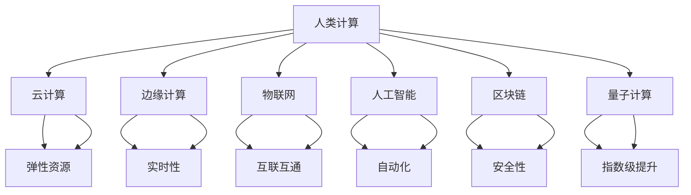

                 

## 1. 背景介绍

### 1.1 问题由来
随着信息技术的飞速发展，人类社会进入了一个全新的时代——数字化时代。在这场信息革命中，计算能力的提升使得我们能够处理和分析越来越复杂的任务，从数据分析到智能决策，从科学研究到艺术创作，计算的潜力被不断挖掘和释放。然而，人类计算仍然面临着诸多挑战。如何更好地将人类智慧与计算能力结合，构建更智能、更互联的世界，成为了一个值得深入探讨的课题。

### 1.2 问题核心关键点
人类计算的核心关键点在于如何高效、智能地将人类的认知能力与计算资源相结合。这不仅包括硬件设备的改进，更包括算法和软件架构的创新。人类计算不仅关注如何提高计算速度和效率，更注重如何通过计算提升人类决策的质量和智能化水平。

### 1.3 问题研究意义
研究人类计算的意义在于：

1. **提升效率**：通过将复杂任务自动化，大幅提高生产力和工作效率。
2. **增强决策质量**：借助计算力，处理海量数据，支持更科学的决策。
3. **促进创新**：计算为科学研究、艺术创作等提供了强大的工具，促进了更多创新成果的产生。
4. **改善生活质量**：计算技术在医疗、教育、交通等领域的应用，提升了人们的生活质量。
5. **构建互联社会**：计算技术为互联网和物联网的发展提供了技术支撑，构建了更紧密的人际和设备互联网络。

## 2. 核心概念与联系

### 2.1 核心概念概述

为更好地理解人类计算的核心概念及其相互关系，本节将详细介绍几个关键概念：

- **人类计算**：指利用人类智慧与计算资源相结合，解决复杂问题的计算范式。人类计算不仅关注计算速度，更注重计算的智能性和人类智慧的融入。
- **云计算**：通过互联网提供按需计算资源和服务，支持弹性、高效、可靠的数据处理。
- **边缘计算**：在设备端进行数据处理和决策，减少网络传输，提升实时性。
- **物联网**：通过互联网连接各种设备，实现设备间的互联互通，提升智能化水平。
- **人工智能**：通过机器学习和深度学习等技术，使机器具备类人智能，提升自动化和智能化水平。
- **区块链**：一种去中心化的分布式账本技术，用于保证数据的安全性和透明性。
- **量子计算**：利用量子力学的原理，实现计算能力的指数级提升。

这些核心概念之间存在着密切的联系，共同构成了人类计算的完整框架。通过深入理解这些概念，我们可以更好地把握人类计算的发展方向和应用前景。

### 2.2 核心概念原理和架构的 Mermaid 流程图



这个流程图展示了人类计算的各个核心概念及其相互关系：

1. 人类计算作为整体，通过云计算、边缘计算、物联网、人工智能、区块链、量子计算等多种技术手段实现。
2. 云计算提供了弹性、高效、可靠的计算资源，支撑大规模数据处理。
3. 边缘计算提升了实时性，减少了数据传输时延。
4. 物联网实现了设备的互联互通，构建了智能化的社会网络。
5. 人工智能通过机器学习和深度学习，提升了自动化和智能化水平。
6. 区块链保证了数据的安全性和透明性，增强了信任基础。
7. 量子计算提供了计算能力的指数级提升，打开了新的计算空间。

## 3. 核心算法原理 & 具体操作步骤

### 3.1 算法原理概述

人类计算的核心算法原理可以概括为以下几个方面：

1. **分布式计算**：通过多个计算节点协同工作，实现高效、可扩展的数据处理。
2. **异构计算**：结合不同的计算资源（如CPU、GPU、FPGA等），优化计算性能。
3. **智能算法**：通过机器学习和深度学习，提升计算的智能化水平。
4. **实时计算**：利用边缘计算等技术，实现低时延的数据处理和决策。
5. **数据融合**：将来自不同来源的数据融合，提升决策的全面性和准确性。
6. **隐私保护**：在数据处理过程中，保护个人隐私和数据安全。

### 3.2 算法步骤详解

基于上述算法原理，人类计算的一般操作步骤包括以下几个关键步骤：

1. **数据采集**：通过传感器、摄像头、网络等手段，采集数据。
2. **数据预处理**：清洗、去噪、归一化等处理，准备数据用于后续分析。
3. **数据传输**：通过网络将数据传输到计算节点，进行集中处理。
4. **分布式计算**：在多个计算节点上并行处理数据，提升计算效率。
5. **数据融合**：将来自不同节点和来源的数据进行融合，提升决策全面性。
6. **模型训练**：利用机器学习算法对数据进行训练，构建模型。
7. **实时计算**：在边缘计算设备上实时处理数据，做出快速决策。
8. **结果反馈**：将计算结果反馈到数据采集端，进行后续处理或进一步分析。

### 3.3 算法优缺点

人类计算算法具有以下优点：

1. **高效性**：通过分布式和异构计算，可以大幅提升计算效率。
2. **可扩展性**：能够处理海量数据，支持大规模应用。
3. **智能化**：通过智能算法，提升决策的智能化水平。
4. **实时性**：利用边缘计算等技术，实现低时延的数据处理和决策。
5. **安全性**：通过区块链等技术，保障数据的安全性和透明性。

然而，这些算法也存在一些缺点：

1. **复杂性**：算法实现较为复杂，需要结合多种技术和架构。
2. **资源消耗大**：分布式计算和异构计算需要大量的计算资源。
3. **数据安全风险**：数据传输和存储过程中存在泄露风险。
4. **数据融合复杂**：不同来源和格式的数据融合复杂，需要较高的技术门槛。

### 3.4 算法应用领域

人类计算在多个领域得到了广泛应用，例如：

- **医疗健康**：利用云计算和边缘计算，实时处理医疗数据，提升诊疗效率和准确性。
- **智能制造**：通过物联网和人工智能，实现设备的智能化管理和优化生产流程。
- **金融服务**：利用分布式计算和智能算法，处理海量交易数据，提升风险管理和金融决策。
- **智慧城市**：通过物联网和实时计算，实现城市交通、安防等管理系统的智能化。
- **环境保护**：利用卫星数据和分布式计算，监测和分析环境变化，提升环境保护水平。

这些应用领域展示了人类计算的广泛潜力和深远影响，为社会经济的发展提供了强有力的技术支撑。

## 4. 数学模型和公式 & 详细讲解 & 举例说明

### 4.1 数学模型构建

人类计算的数学模型构建涉及多个领域，包括统计学、机器学习、数据科学等。本节将以一个简单的机器学习模型为例，介绍其构建过程。

### 4.2 公式推导过程

假设我们要构建一个简单的线性回归模型，用于预测房价。设房价为 $y$，房屋面积 $x_1$，地理位置 $x_2$，则模型可以表示为：

$$
y = w_1x_1 + w_2x_2 + b
$$

其中 $w_1, w_2, b$ 为模型参数，$x_1, x_2$ 为输入特征，$y$ 为输出结果。模型的目标是最小化预测误差，即：

$$
\min_{w_1, w_2, b} \frac{1}{n} \sum_{i=1}^n (y_i - (w_1x_{1,i} + w_2x_{2,i} + b))^2
$$

### 4.3 案例分析与讲解

在实际应用中，我们可以使用梯度下降等优化算法来求解上述最小化问题，从而得到模型的最优参数。以下是一个简单的Python代码实现：

```python
import numpy as np

def linear_regression(X, y, learning_rate, num_iterations):
    m, n = X.shape
    theta = np.zeros(n)
    for i in range(num_iterations):
        gradients = 2 / m * X.T.dot(X.dot(theta) - y)
        theta -= learning_rate * gradients
    return theta

# 假设我们有如下数据
X = np.array([[100, 2.5], [200, 3.5], [300, 4.5], [400, 5.5]])
y = np.array([250000, 450000, 650000, 850000])

# 使用线性回归模型
theta = linear_regression(X, y, 0.01, 1000)
print("模型参数：", theta)
```

这段代码实现了一个简单的线性回归模型，通过梯度下降算法求得模型参数。通过这种数学模型，我们可以将复杂问题转化为可计算的形式，实现高效的数据处理和决策。

## 5. 项目实践：代码实例和详细解释说明

### 5.1 开发环境搭建

在进行人类计算项目开发前，我们需要准备好开发环境。以下是使用Python进行PyTorch开发的环境配置流程：

1. 安装Anaconda：从官网下载并安装Anaconda，用于创建独立的Python环境。

2. 创建并激活虚拟环境：
```bash
conda create -n pytorch-env python=3.8 
conda activate pytorch-env
```

3. 安装PyTorch：根据CUDA版本，从官网获取对应的安装命令。例如：
```bash
conda install pytorch torchvision torchaudio cudatoolkit=11.1 -c pytorch -c conda-forge
```

4. 安装各类工具包：
```bash
pip install numpy pandas scikit-learn matplotlib tqdm jupyter notebook ipython
```

完成上述步骤后，即可在`pytorch-env`环境中开始项目实践。

### 5.2 源代码详细实现

下面我们以一个简单的图像分类任务为例，给出使用PyTorch进行人类计算的PyTorch代码实现。

首先，定义图像分类任务的数据处理函数：

```python
import torch
from torchvision import datasets, transforms

def data_loader(batch_size=32, data_path='data'):
    transform = transforms.Compose([
        transforms.ToTensor(),
        transforms.Normalize(mean=[0.5, 0.5, 0.5], std=[0.5, 0.5, 0.5])
    ])
    train_dataset = datasets.CIFAR10(root=data_path, train=True, download=True, transform=transform)
    test_dataset = datasets.CIFAR10(root=data_path, train=False, download=True, transform=transform)
    train_loader = torch.utils.data.DataLoader(train_dataset, batch_size=batch_size, shuffle=True)
    test_loader = torch.utils.data.DataLoader(test_dataset, batch_size=batch_size, shuffle=False)
    return train_loader, test_loader
```

然后，定义模型和优化器：

```python
import torch.nn as nn
import torch.optim as optim

class Net(nn.Module):
    def __init__(self):
        super(Net, self).__init__()
        self.conv1 = nn.Conv2d(3, 6, 5)
        self.pool = nn.MaxPool2d(2, 2)
        self.conv2 = nn.Conv2d(6, 16, 5)
        self.fc1 = nn.Linear(16 * 5 * 5, 120)
        self.fc2 = nn.Linear(120, 84)
        self.fc3 = nn.Linear(84, 10)
        
    def forward(self, x):
        x = self.pool(F.relu(self.conv1(x)))
        x = self.pool(F.relu(self.conv2(x)))
        x = x.view(-1, 16 * 5 * 5)
        x = F.relu(self.fc1(x))
        x = F.relu(self.fc2(x))
        x = self.fc3(x)
        return x

model = Net()
optimizer = optim.SGD(model.parameters(), lr=0.001, momentum=0.9)
```

接着，定义训练和评估函数：

```python
import torch.nn.functional as F

def train_epoch(model, data_loader, optimizer):
    model.train()
    for i, (inputs, labels) in enumerate(data_loader):
        optimizer.zero_grad()
        outputs = model(inputs)
        loss = F.cross_entropy(outputs, labels)
        loss.backward()
        optimizer.step()
        if i % 100 == 0:
            print("Epoch: {} [{}/{}] - Loss: {:.4f}".format(epoch + 1, i * len(inputs), len(data_loader.dataset),
                                                          loss.item()))

def evaluate(model, data_loader):
    model.eval()
    correct = 0
    total = 0
    with torch.no_grad():
        for inputs, labels in data_loader:
            outputs = model(inputs)
            _, predicted = torch.max(outputs.data, 1)
            total += labels.size(0)
            correct += (predicted == labels).sum().item()
    print('Accuracy: {:.2f}%'.format(100 * correct / total))
```

最后，启动训练流程并在测试集上评估：

```python
epochs = 5
batch_size = 32

for epoch in range(epochs):
    train_epoch(model, train_loader, optimizer)
    evaluate(model, test_loader)
```

以上就是使用PyTorch进行图像分类任务的人类计算代码实现。可以看到，通过PyTorch库的封装，我们可以用相对简洁的代码实现复杂模型训练和评估过程。

### 5.3 代码解读与分析

让我们再详细解读一下关键代码的实现细节：

**data_loader函数**：
- 定义了数据预处理函数，包括图像归一化和标准化处理。
- 加载CIFAR-10数据集，并划分为训练集和测试集。
- 使用DataLoader生成数据批处理器，支持按需读取数据。

**Net类**：
- 定义了一个简单的卷积神经网络模型，包括卷积层、池化层和全连接层。
- 使用PyTorch的nn.Module类封装模型结构，便于模块化管理和复用。

**train_epoch函数**：
- 在每个epoch中，对数据集进行迭代，前向传播计算模型输出，并反向传播更新模型参数。
- 使用SGD优化器更新模型参数，支持动量优化和批量梯度下降。

**evaluate函数**：
- 在测试集上评估模型性能，计算准确率。
- 使用模型前向传播预测结果，并计算预测准确率。

**训练流程**：
- 定义总的epoch数和batch size，开始循环迭代
- 每个epoch内，先在训练集上训练，输出损失
- 在测试集上评估，输出准确率

可以看到，PyTorch库提供了一系列高效的工具和框架，使得人类计算的模型构建和训练过程变得简洁高效。开发者可以将更多精力放在算法创新和数据处理上，而不必过多关注底层实现细节。

当然，工业级的系统实现还需考虑更多因素，如模型的保存和部署、超参数的自动搜索、更灵活的任务适配层等。但核心的人类计算流程基本与此类似。

## 6. 实际应用场景

### 6.1 智慧医疗

在智慧医疗领域，人类计算技术可以通过数据分析和模型训练，提升医疗诊断和治疗的智能化水平。利用云计算和大数据分析，可以实现病历的自动化处理、病情预测和个性化治疗方案的推荐。

具体而言，可以收集海量的医疗数据，包括电子病历、影像数据、基因数据等，进行预处理和特征提取。然后，通过机器学习模型对这些数据进行训练，构建疾病诊断模型和个性化治疗方案推荐系统。这些系统可以实时处理病人的诊断数据，提供个性化的治疗建议，提升医疗服务的质量和效率。

### 6.2 智能制造

在智能制造领域，人类计算技术可以通过物联网和实时计算，实现设备智能化管理和优化生产流程。通过边缘计算和实时数据处理，可以实现设备的故障预测、维护和优化控制。

具体而言，可以部署边缘计算设备，采集生产线上的各种传感器数据，如温度、湿度、压力等。然后，通过机器学习模型对这些数据进行分析和预测，实现设备状态的实时监测和故障预测。此外，还可以通过实时计算和优化控制算法，调整生产参数，提高生产效率和质量。

### 6.3 智慧城市

在智慧城市领域，人类计算技术可以通过物联网和实时计算，实现城市交通、安防等管理系统的智能化。通过实时数据分析和预测，可以实现城市管理的自动化和优化决策。

具体而言，可以部署传感器和摄像头，采集交通流量、车辆位置、安防数据等。然后，通过机器学习模型对这些数据进行分析和预测，实现交通流量预测和交通信号优化，提升交通效率。此外，还可以通过实时计算和预测算法，实现安防事件的实时监测和预警，提升城市安全。

### 6.4 未来应用展望

随着人类计算技术的不断发展，未来将在更多领域得到应用，为社会经济发展提供新的动力。

在智慧农业领域，人类计算可以通过数据分析和模型训练，实现精准农业和智能农机管理。通过实时数据分析和预测，可以实现农作物的智能灌溉、施肥和病虫害防治，提高农业生产效率和产量。

在环保领域，人类计算可以通过卫星数据和模型训练，实现环境变化的监测和预测。通过实时数据分析和预测，可以实现水文监测、气候变化预测、空气质量监测等，提升环境保护水平。

在金融领域，人类计算可以通过数据分析和模型训练，实现风险管理和金融决策。通过实时数据分析和预测，可以实现市场波动预测、信用评分、投资组合优化等，提升金融服务的智能化水平。

总之，人类计算技术的应用前景广阔，未来将在更多领域发挥重要作用，推动社会经济的发展和进步。

## 7. 工具和资源推荐

### 7.1 学习资源推荐

为了帮助开发者系统掌握人类计算的理论基础和实践技巧，这里推荐一些优质的学习资源：

1. 《深度学习》系列博文：由大模型技术专家撰写，深入浅出地介绍了深度学习原理、模型构建和优化方法。

2. CS231n《卷积神经网络》课程：斯坦福大学开设的经典深度学习课程，涵盖卷积神经网络的基本概念和前沿技术。

3. 《机器学习实战》书籍：讲解机器学习算法的基本原理和实现方法，提供丰富的代码示例。

4. Kaggle平台：全球最大的数据科学竞赛平台，提供丰富的数据集和挑战，实践机器学习算法。

5. PyTorch官方文档：PyTorch库的官方文档，提供详尽的API文档和示例代码，适合上手实践。

通过学习这些资源，相信你一定能够快速掌握人类计算的精髓，并用于解决实际的计算问题。

### 7.2 开发工具推荐

高效的开发离不开优秀的工具支持。以下是几款用于人类计算开发的常用工具：

1. PyTorch：基于Python的开源深度学习框架，灵活动态的计算图，适合快速迭代研究。

2. TensorFlow：由Google主导开发的开源深度学习框架，生产部署方便，适合大规模工程应用。

3. Weights & Biases：模型训练的实验跟踪工具，可以记录和可视化模型训练过程中的各项指标，方便对比和调优。

4. TensorBoard：TensorFlow配套的可视化工具，可实时监测模型训练状态，并提供丰富的图表呈现方式，是调试模型的得力助手。

5. Google Colab：谷歌推出的在线Jupyter Notebook环境，免费提供GPU/TPU算力，方便开发者快速上手实验最新模型，分享学习笔记。

合理利用这些工具，可以显著提升人类计算项目的开发效率，加快创新迭代的步伐。

### 7.3 相关论文推荐

人类计算的发展源于学界的持续研究。以下是几篇奠基性的相关论文，推荐阅读：

1. 《人类计算模型》（A Model of Human Computation）：提出了一种基于分布式计算和智能算法的人类计算模型。

2. 《云计算》（Cloud Computing）：讨论了云计算的基本原理和应用场景，强调了云计算对人类计算的影响。

3. 《边缘计算》（Edge Computing）：介绍了边缘计算的基本概念和应用场景，强调了边缘计算对实时计算的重要性。

4. 《物联网》（Internet of Things, IoT）：介绍了物联网的基本概念和应用场景，强调了物联网对设备互联的重要作用。

5. 《人工智能》（Artificial Intelligence, AI）：讨论了人工智能的基本原理和应用场景，强调了人工智能对自动化和智能化的影响。

6. 《区块链》（Blockchain）：讨论了区块链的基本原理和应用场景，强调了区块链对数据透明和安全性的重要作用。

7. 《量子计算》（Quantum Computing）：介绍了量子计算的基本原理和应用前景，强调了量子计算对计算能力的巨大提升。

这些论文代表了大计算领域的发展脉络，通过学习这些前沿成果，可以帮助研究者把握学科前进方向，激发更多的创新灵感。

## 8. 总结：未来发展趋势与挑战

### 8.1 总结

本文对人类计算的原理、操作步骤和实际应用进行了全面系统的介绍。首先阐述了人类计算的研究背景和意义，明确了分布式计算、异构计算、智能算法等核心概念，并介绍了微调算法及其应用。通过多个实例展示了人类计算的广泛应用前景，并通过理论分析探讨了未来发展趋势和面临的挑战。

通过本文的系统梳理，可以看到，人类计算不仅关注计算效率和智能化，更注重人类智慧与计算资源的结合，具有广阔的应用前景和发展潜力。未来，随着技术的不断进步，人类计算将进一步推动各领域的智能化发展，构建更加智慧、互联的世界。

### 8.2 未来发展趋势

展望未来，人类计算技术将呈现以下几个发展趋势：

1. **融合多模态数据**：通过融合视觉、听觉、文本等多种数据源，提升计算的全面性和准确性。
2. **引入强化学习**：结合强化学习技术，提升计算的自主性和适应性，实现动态决策。
3. **开发智能算法**：通过深度学习、迁移学习等技术，提升计算的智能化水平。
4. **拓展边缘计算**：通过边缘计算，实现设备智能化和实时决策，提升应用场景的实时性。
5. **引入区块链技术**：通过区块链技术，增强数据的安全性和透明性，提升计算的可信度。
6. **发展量子计算**：通过量子计算，实现计算能力的指数级提升，开启新的计算范式。

这些趋势凸显了人类计算技术的广阔前景，为各行各业提供了强大的技术支撑。未来，人类计算将在更多领域发挥重要作用，推动社会经济的全面发展。

### 8.3 面临的挑战

尽管人类计算技术已经取得了显著成就，但在迈向更加智能化、普适化应用的过程中，仍面临诸多挑战：

1. **数据隐私和安全**：海量数据采集和处理过程中存在隐私泄露和安全风险，需要采取严格的保护措施。
2. **计算资源消耗**：分布式和异构计算需要大量的计算资源，可能面临资源消耗大、成本高的问题。
3. **模型复杂度**：大规模、复杂模型的训练和优化过程，需要大量的计算资源和高级算法支持。
4. **模型透明性**：计算模型往往“黑盒”化，难以解释其内部决策过程，需要提高模型的透明性和可解释性。
5. **跨领域应用**：不同领域的数据和问题具有特殊性，需要针对具体问题进行算法设计和优化。

这些挑战需要进一步的研究和实践，才能推动人类计算技术的全面发展。

### 8.4 研究展望

面对人类计算所面临的挑战，未来的研究需要在以下几个方面寻求新的突破：

1. **优化算法设计**：开发更高效、更智能的计算算法，提升计算性能和智能化水平。
2. **优化资源利用**：通过分布式计算、边缘计算等技术，优化计算资源利用，降低计算成本。
3. **增强模型透明性**：通过可解释性技术，提升计算模型的透明性和可解释性，增强决策的可信度。
4. **开发通用框架**：构建通用计算框架，支持多种计算资源和数据源，提升计算的灵活性和可扩展性。
5. **拓展应用场景**：将人类计算技术应用于更多领域，推动各行业的智能化和数字化转型。

这些研究方向将引领人类计算技术的不断创新和发展，为构建更加智慧、互联的世界提供技术支撑。

## 9. 附录：常见问题与解答

**Q1：人类计算与人工智能有何区别？**

A: 人类计算与人工智能的主要区别在于，人类计算强调人类智慧与计算资源的结合，而人工智能更多关注通过算法使机器具备类人智能。人类计算不仅仅关注计算效率和智能化，更注重通过计算提升人类决策的全面性和准确性。

**Q2：如何高效利用分布式计算？**

A: 高效利用分布式计算，需要考虑以下几个方面：

1. 选择合适的分布式计算框架，如Apache Spark、Hadoop等。
2. 优化数据传输和处理过程，减少网络延迟和数据冗余。
3. 合理分配计算资源，平衡任务负载和计算效率。
4. 采用高效的数据存储和管理系统，如HDFS、Ceph等。
5. 利用并行计算技术，提升计算性能和可扩展性。

**Q3：如何优化实时计算性能？**

A: 优化实时计算性能，需要考虑以下几个方面：

1. 采用低延迟的网络传输协议，如TCP/UDP、WebSocket等。
2. 使用高效的计算架构，如边缘计算、雾计算等。
3. 优化计算算法，减少计算时间和资源消耗。
4. 采用高效的存储技术，如SSD、RAM等。
5. 结合云计算和边缘计算，实现弹性资源和实时计算。

**Q4：如何保证数据隐私和安全？**

A: 保证数据隐私和安全，需要考虑以下几个方面：

1. 采用加密技术，保护数据传输和存储过程中的隐私。
2. 使用访问控制技术，限制数据访问权限，防止数据泄露。
3. 采用区块链技术，实现数据的透明性和不可篡改性。
4. 引入隐私保护算法，如差分隐私、同态加密等，保护数据隐私。
5. 定期进行安全审计，发现和修复潜在的安全漏洞。

这些措施可以有效保护数据隐私和安全，确保数据处理过程的合法性和可信度。

**Q5：未来人类计算技术的主要发展方向是什么？**

A: 未来人类计算技术的主要发展方向包括：

1. 融合多模态数据：通过融合视觉、听觉、文本等多种数据源，提升计算的全面性和准确性。
2. 引入强化学习：结合强化学习技术，提升计算的自主性和适应性，实现动态决策。
3. 开发智能算法：通过深度学习、迁移学习等技术，提升计算的智能化水平。
4. 拓展边缘计算：通过边缘计算，实现设备智能化和实时决策，提升应用场景的实时性。
5. 引入区块链技术：通过区块链技术，增强数据的安全性和透明性，提升计算的可信度。
6. 发展量子计算：通过量子计算，实现计算能力的指数级提升，开启新的计算范式。

这些研究方向将引领人类计算技术的不断创新和发展，为构建更加智慧、互联的世界提供技术支撑。

总之，人类计算技术的应用前景广阔，未来将在更多领域发挥重要作用，推动社会经济的发展和进步。面对未来，我们需要不断创新和优化，才能更好地利用计算资源，提升人类智慧和决策水平。

