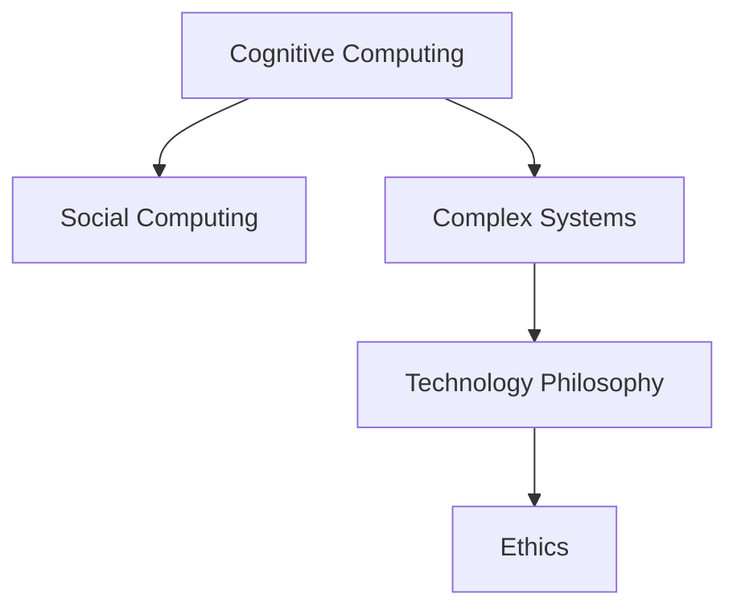

                 

# 人类计算：科技与人文的融合

> 关键词：人工智能,人机交互,认知计算,社会计算,复杂系统,技术哲学,伦理学

## 1. 背景介绍

### 1.1 问题由来
人类计算一词，最早出现于20世纪初，指的是通过机器模拟人类的逻辑和计算能力，处理各种复杂问题。随着计算机技术的不断演进，人工智能（AI）领域涌现出了许多突破性的进展。从早期的专家系统到当前的深度学习，科技已经在各个领域广泛应用，大大提高了人类的计算能力。然而，科技的发展并未完全解决所有问题，反而引发了新的挑战。

一方面，科技的进步在提升效率和能力的同时，也在一定程度上剥夺了人类的直观感知和直觉判断能力。在自动化和智能化的浪潮下，人类的计算方式正在悄然改变。如何在科技与人文之间找到平衡，既利用科技的强大能力，又保持人类独特的创造力和直觉，成为了当代科技伦理的重要议题。

另一方面，随着AI技术的深入应用，社会对科技的依赖程度日益加深。机器学习、数据分析等技术在医疗、金融、教育、公共安全等领域的应用，对社会公平、隐私保护、伦理道德等方面提出了更高的要求。如何确保科技的发展不会引发新的社会问题，如何构建负责任的科技伦理框架，成为了现代社会亟需解决的问题。

### 1.2 问题核心关键点
在科技与人文融合的背景下，人类计算研究的核心在于探讨如何更好地结合科技与人类思维，实现人类智能与机器智能的协同发展。关键点包括：

1. **认知计算**：研究如何通过计算机模拟人类认知过程，提高问题解决的智能化水平。
2. **社会计算**：利用数据分析和算法优化社会行为和系统效率，促进社会公平与和谐。
3. **复杂系统**：研究如何通过技术手段管理复杂系统，提升系统的稳定性和鲁棒性。
4. **技术哲学**：探讨技术对人类价值观、文化和社会结构的影响，反思技术的伦理责任。
5. **伦理学**：分析AI技术的潜在使用风险，如隐私泄露、算法偏见等，提出应对措施。

## 2. 核心概念与联系

### 2.1 核心概念概述

为更好地理解人类计算的研究方向，本节将介绍几个密切相关的核心概念：

- **认知计算(Cognitive Computing)**：利用计算机模拟人类的认知过程，包括感知、推理、学习等，以解决复杂问题。认知计算强调理解人类的认知机制，并在机器上实现。
- **社会计算(Social Computing)**：通过分析人类社交网络、社会行为等数据，优化社会结构和资源配置，提升社会效率和公平性。
- **复杂系统(Complex Systems)**：研究高度相互依赖、动态变化的系统，如金融市场、交通网络、生态系统等，利用算法优化系统行为。
- **技术哲学(Philosophy of Technology)**：研究技术的发展对人类社会、文化、价值观等方面的影响，反思技术的伦理和责任。
- **伦理学(Ethics)**：探讨AI技术在应用过程中可能引发的道德问题，如隐私保护、算法透明度、责任归属等。

这些核心概念之间的逻辑关系可以通过以下Mermaid流程图来展示：



这个流程图展示了几大核心概念及其之间的关系：

1. 认知计算通过理解人类认知机制，为复杂系统和社会计算提供理论基础。
2. 社会计算利用认知计算的知识，优化社会结构，提升社会效率。
3. 复杂系统分析技术哲学中的问题，为认知计算提供实践案例。
4. 技术哲学分析伦理学中的问题，引导技术的发展方向。

这些概念共同构成了人类计算的研究框架，推动了科技与人文的深度融合。

## 3. 核心算法原理 & 具体操作步骤
### 3.1 算法原理概述

人类计算的核心算法原理在于通过科技手段模拟人类思维和行为，实现复杂问题的求解。其核心思想可以概括为以下几点：

1. **符号主义**：使用符号来表示问题中的实体和关系，利用逻辑推理解决复杂问题。
2. **联结主义**：通过神经网络和联结主义学习，模拟人脑的神经系统，实现模式识别和决策。
3. **进化算法**：模拟自然界中的进化过程，通过优化算法寻找最优解。
4. **归纳推理**：利用数据和算法，从特定实例中归纳出一般规律，提高问题解决的有效性。

### 3.2 算法步骤详解

人类计算的算法步骤通常包括以下几个关键步骤：

**Step 1: 问题建模**
- 将现实世界的问题转化为计算机可以处理的符号表示形式。
- 识别问题中的关键实体和关系，构建问题模型。
- 选择合适的计算模型和算法，如符号主义、联结主义、进化算法等。

**Step 2: 数据预处理**
- 收集和清洗数据，确保数据的质量和完整性。
- 进行数据增强和特征提取，提升模型性能。
- 进行数据标准化和归一化，避免数据偏差。

**Step 3: 模型训练**
- 选择合适的优化算法，如梯度下降、遗传算法等，进行模型训练。
- 通过交叉验证等技术评估模型性能，避免过拟合。
- 进行参数调优，找到最佳的模型参数组合。

**Step 4: 模型评估与验证**
- 在验证集上测试模型性能，评估模型的泛化能力。
- 通过A/B测试等手段验证模型的实际效果。
- 分析模型输出，优化模型结构。

**Step 5: 应用部署**
- 将模型集成到实际应用系统中，进行大规模部署。
- 进行性能监控和维护，确保系统稳定运行。
- 定期更新模型，提高系统的适应性。

### 3.3 算法优缺点

人类计算的算法具有以下优点：
1. 可以处理复杂多变的问题，通过多种模型和算法灵活组合。
2. 可以通过大量数据和知识库提升模型性能，具有较高的泛化能力。
3. 可以利用人类思维的逻辑性和直觉，实现问题的多角度求解。
4. 可以通过多模态数据的融合，提升系统的智能化水平。

同时，该算法也存在一定的局限性：
1. 需要大量的数据和计算资源，部署成本较高。
2. 模型复杂，难以解释和调试，存在“黑盒”问题。
3. 依赖于数据质量和算法优化，可能存在偏差和误差。
4. 无法完全替代人类思维，仍需结合人类经验进行综合判断。

尽管存在这些局限性，人类计算依然是解决复杂问题的强大工具，具有广泛的应用前景。未来相关研究的重点在于如何进一步优化算法，降低成本，提升模型的解释性和可控性。

### 3.4 算法应用领域

人类计算方法在多个领域得到了广泛的应用，例如：

- **医疗**：通过认知计算分析医学影像和基因数据，辅助医生诊断和治疗。
- **金融**：利用复杂系统分析市场动态，优化投资策略和风险管理。
- **交通**：利用社会计算优化交通流量，提高道路通行效率。
- **教育**：通过认知计算评估学生的学习行为，提供个性化教育方案。
- **环境**：利用社会计算分析环境数据，优化资源配置和保护策略。
- **安全**：通过复杂系统分析安全威胁，提升社会安全水平。

## 4. 数学模型和公式 & 详细讲解
### 4.1 数学模型构建

人类计算的核心数学模型可以概括为符号主义和联结主义两种。

**符号主义模型**：使用符号来表示问题中的实体和关系，利用逻辑推理解决复杂问题。常用的数学模型包括：

1. **一阶逻辑**：用谓词和个体表示实体，利用逻辑推理求解问题。
2. **形式化语义**：将自然语言转化为形式化语言，利用逻辑推理进行语义分析。

**联结主义模型**：通过神经网络和联结主义学习，模拟人脑的神经系统，实现模式识别和决策。常用的数学模型包括：

1. **感知机模型**：二分类器，通过权重和偏置计算输出。
2. **多层感知机**：多层神经网络，通过反向传播算法训练模型。
3. **卷积神经网络**：处理图像和序列数据，利用卷积操作提取特征。
4. **递归神经网络**：处理序列数据，利用循环结构捕捉时间依赖性。

### 4.2 公式推导过程

以一阶逻辑为例，推导求解问题的数学公式。

假设有如下问题：

- **前提**：某城市有居民$A$和$B$，$A$在$B$的东边。
- **问题**：$B$在$A$的西边吗？

使用一阶逻辑，问题可以表示为：

$$
\forall x ((x=A \wedge x=B) \rightarrow (\lnot x=A))
$$

该问题的逻辑解释是：如果$A$和$B$都是$x$，且$x$不是$A$，那么$x=B$。

对于此类问题，可以通过逻辑推理求解。例如，使用谓词符号表示居民位置关系，利用逻辑演算求解问题的真值表。

在联结主义模型中，以多层感知机为例，公式推导过程如下：

1. **输入层**：假设输入特征为$x_1,x_2,\cdots,x_n$。
2. **隐含层**：通过权重$w_1,w_2,\cdots,w_n$和偏置$b$计算隐含层输出$h$。
3. **输出层**：通过输出权重$w'$和偏置$b'$计算最终输出$y$。

公式如下：

$$
y = \sigma(w'h + b')
$$

其中$\sigma$为激活函数，通常使用sigmoid或ReLU。

### 4.3 案例分析与讲解

以医疗影像分析为例，说明如何利用符号主义和联结主义进行问题求解。

**符号主义方法**：
- 使用医疗影像的像素点表示实体，利用一阶逻辑表示医疗影像中的特征。
- 使用逻辑推理进行图像分割，识别病变区域。
- 使用符号表示医疗影像中的诊断结果，进行逻辑推理求解。

**联结主义方法**：
- 将医疗影像转化为图像数据，使用卷积神经网络提取特征。
- 利用多层感知机对特征进行分类，判断病变类型。
- 使用递归神经网络分析时间序列数据，预测疾病发展趋势。

## 5. 项目实践：代码实例和详细解释说明
### 5.1 开发环境搭建

在进行人类计算实践前，我们需要准备好开发环境。以下是使用Python进行TensorFlow开发的环境配置流程：

1. 安装Anaconda：从官网下载并安装Anaconda，用于创建独立的Python环境。

2. 创建并激活虚拟环境：
```bash
conda create -n tf-env python=3.8 
conda activate tf-env
```

3. 安装TensorFlow：根据CUDA版本，从官网获取对应的安装命令。例如：
```bash
conda install tensorflow tensorflow-gpu=cuda11.1 -c tf -c conda-forge
```

4. 安装TensorFlow Addons：
```bash
pip install tensorboard
```

5. 安装各类工具包：
```bash
pip install numpy pandas scikit-learn matplotlib tqdm jupyter notebook ipython
```

完成上述步骤后，即可在`tf-env`环境中开始人类计算的实践。

### 5.2 源代码详细实现

这里我们以医疗影像分析为例，给出使用TensorFlow进行符号主义和联结主义模型训练的代码实现。

**符号主义模型代码**：
```python
import tensorflow as tf
import numpy as np

# 定义符号
A = tf.Variable(np.array([1, 0]))
B = tf.Variable(np.array([0, 1]))

# 定义逻辑函数
def logical_function(A, B):
    return tf.logical_and(A, B)

# 训练模型
with tf.GradientTape() as tape:
    result = logical_function(A, B)
    loss = tf.reduce_mean(tf.abs(result - np.array([0, 1])))
    gradients = tape.gradient(loss, [A, B])
    optimizer = tf.keras.optimizers.SGD(learning_rate=0.1)
    optimizer.apply_gradients(zip(gradients, [A, B]))

# 输出结果
print("Result:", result.numpy())
```

**联结主义模型代码**：
```python
import tensorflow as tf
import numpy as np

# 定义输入层和权重
input_layer = tf.keras.layers.Dense(units=1, input_shape=(1,), activation='sigmoid')
weight_layer = tf.keras.layers.Dense(units=1, input_shape=(1,), activation='sigmoid')

# 定义神经网络模型
model = tf.keras.Sequential([
    input_layer,
    weight_layer
])

# 定义数据集
x_train = np.array([0, 1])
y_train = np.array([0, 1])

# 编译模型
model.compile(optimizer='adam', loss='mse')

# 训练模型
model.fit(x_train, y_train, epochs=50)

# 输出结果
print("Result:", model.predict(x_train).numpy())
```

以上就是使用TensorFlow进行符号主义和联结主义模型训练的完整代码实现。可以看到，TensorFlow提供了强大的符号计算和神经网络库，使得人类计算的实现变得简单易行。

### 5.3 代码解读与分析

让我们再详细解读一下关键代码的实现细节：

**符号主义模型代码**：
- 使用`tf.Variable`定义符号变量A和B。
- 定义`logical_function`函数，使用逻辑运算符计算输出。
- 使用`tf.GradientTape`记录梯度，使用`tf.keras.optimizers.SGD`优化器更新参数。
- 输出训练结果。

**联结主义模型代码**：
- 使用`tf.keras.layers.Dense`定义输入层和权重层。
- 使用`tf.keras.Sequential`定义神经网络模型。
- 定义数据集`x_train`和`y_train`，编译模型。
- 使用`model.fit`训练模型，输出训练结果。

可以看到，TensorFlow的符号主义和联结主义模型代码实现非常简单，主要依赖其强大的高阶API和自动微分功能。开发者可以轻松实现各种复杂的模型和算法。

## 6. 实际应用场景
### 6.1 医疗影像分析

利用符号主义和联结主义模型，可以对医疗影像进行智能分析。传统的医疗影像分析依赖专家经验和人工标注，耗时长、成本高。而基于符号主义和联结主义的人类计算方法，可以在短时间内快速处理大量影像数据，辅助医生诊断和治疗。

具体而言，可以采用以下步骤：

- **符号主义模型**：利用一阶逻辑表示医疗影像中的实体和关系，进行逻辑推理。例如，通过分析影像中的像素点，识别出肿瘤区域和正常区域。
- **联结主义模型**：使用卷积神经网络提取影像特征，利用多层感知机进行分类。例如，通过分析影像中的纹理和形态，判断肿瘤的类型和级别。

### 6.2 金融风险评估

在金融领域，风险评估是至关重要的环节。传统的风险评估依赖人工计算和经验判断，难以处理复杂多变的市场动态。而利用符号主义和联结主义模型，可以实现更加智能化和自动化的风险评估。

具体而言，可以采用以下步骤：

- **符号主义模型**：利用一阶逻辑表示市场数据和交易行为，进行逻辑推理。例如，通过分析市场趋势和交易量，预测价格波动。
- **联结主义模型**：使用递归神经网络分析时间序列数据，进行预测和风险评估。例如，通过分析历史交易数据，预测市场趋势和风险。

### 6.3 智能推荐系统

智能推荐系统已经成为电商、新闻、音乐等多个领域的重要应用。传统的推荐系统依赖用户行为数据，难以捕捉用户的深层需求。而基于符号主义和联结主义模型，可以实现更加智能化和个性化的推荐。

具体而言，可以采用以下步骤：

- **符号主义模型**：利用一阶逻辑表示用户行为和商品属性，进行逻辑推理。例如，通过分析用户的浏览记录和购买历史，推荐相关商品。
- **联结主义模型**：使用卷积神经网络提取商品特征，利用多层感知机进行推荐。例如，通过分析商品的图片和描述，推荐相似商品。

### 6.4 未来应用展望

随着符号主义和联结主义模型的不断发展，人类计算将在更多领域得到应用，为各行各业带来变革性影响。

在智慧医疗领域，基于符号主义和联结主义的医疗影像分析和诊断技术，将提升医疗服务的智能化水平，辅助医生诊疗，加速新药开发进程。

在智能教育领域，基于符号主义和联结主义的学习行为分析和个性化推荐技术，将提高教学质量和效率，促进教育公平。

在智慧城市治理中，基于符号主义和联结主义的城市事件监测和应急指挥技术，将提高城市管理的自动化和智能化水平，构建更安全、高效的未来城市。

此外，在企业生产、社会治理、文娱传媒等众多领域，基于符号主义和联结主义的人类计算技术，将不断涌现新的创新应用，为经济社会发展注入新的动力。

## 7. 工具和资源推荐
### 7.1 学习资源推荐

为了帮助开发者系统掌握符号主义和联结主义的人类计算技术，这里推荐一些优质的学习资源：

1. **《符号主义与联结主义》**：介绍符号主义和联结主义的基本概念和应用场景。
2. **《TensorFlow官方文档》**：提供丰富的符号主义和联结主义模型库，包含详细的API文档和示例代码。
3. **Coursera《深度学习基础》**：由斯坦福大学教授主讲，涵盖深度学习的基本理论和实践技术。
4. **Udacity《深度学习专业》**：提供深入的深度学习课程，涵盖符号主义和联结主义模型的设计实现。
5. **Kaggle竞赛**：参与符号主义和联结主义相关的数据科学竞赛，提升实战能力。

通过对这些资源的学习实践，相信你一定能够快速掌握符号主义和联结主义模型的精髓，并用于解决实际的问题。

### 7.2 开发工具推荐

高效的开发离不开优秀的工具支持。以下是几款用于符号主义和联结主义人类计算开发的常用工具：

1. **TensorFlow**：由Google主导开发的深度学习框架，支持符号主义和联结主义模型的设计实现。
2. **PyTorch**：Facebook开发的深度学习框架，支持符号主义和联结主义模型的设计实现。
3. **Jupyter Notebook**：交互式开发环境，方便编写和测试符号主义和联结主义模型的代码。
4. **Keras**：高层次的神经网络API，支持符号主义和联结主义模型的快速搭建和训练。
5. **TensorBoard**：TensorFlow配套的可视化工具，实时监测模型训练状态，提供丰富的图表呈现方式。

合理利用这些工具，可以显著提升符号主义和联结主义模型的开发效率，加快创新迭代的步伐。

### 7.3 相关论文推荐

符号主义和联结主义的人类计算技术，源自学术界持续的研究。以下是几篇奠基性的相关论文，推荐阅读：

1. **《符号主义与联结主义：一种混合方法》**：探讨符号主义和联结主义的混合方法，结合二者的优点，提升问题解决的智能化水平。
2. **《深度学习：一种符号主义方法》**：提出基于深度学习的符号主义方法，将符号逻辑和神经网络结合，提升模型的解释性和可控性。
3. **《符号主义与联结主义在金融风险评估中的应用》**：研究符号主义和联结主义在金融风险评估中的应用，提出混合模型解决方案。
4. **《符号主义与联结主义在医疗影像分析中的应用》**：提出符号主义和联结主义在医疗影像分析中的应用，提升影像分析的智能化水平。

这些论文代表了大语言模型微调技术的发展脉络。通过学习这些前沿成果，可以帮助研究者把握学科前进方向，激发更多的创新灵感。

## 8. 总结：未来发展趋势与挑战
### 8.1 总结

本文对符号主义和联结主义的人类计算方法进行了全面系统的介绍。首先阐述了人类计算研究的问题由来和意义，明确了符号主义和联结主义在解决复杂问题中的独特价值。其次，从原理到实践，详细讲解了符号主义和联结主义的核心步骤和代码实现。同时，本文还广泛探讨了符号主义和联结主义在医疗、金融、推荐系统等多个领域的应用前景，展示了人类计算范式的巨大潜力。此外，本文精选了符号主义和联结主义学习的各类资源，力求为读者提供全方位的技术指引。

通过本文的系统梳理，可以看到，符号主义和联结主义的人类计算方法正在成为复杂问题解决的重要工具，极大地拓展了计算能力的应用边界，催生了更多的落地场景。受益于符号主义和联结主义技术的持续演进，人类计算必将在复杂系统、社会计算等领域发挥更大的作用，推动智能化技术在各个行业的深入应用。

### 8.2 未来发展趋势

展望未来，符号主义和联结主义的人类计算技术将呈现以下几个发展趋势：

1. **多模态融合**：将符号主义和联结主义与视觉、语音、自然语言等模态数据融合，提升模型的智能化水平。例如，在医疗影像分析中，结合影像和文本信息，提升诊断的准确性。
2. **混合模型**：结合符号主义和联结主义的优势，构建混合模型，提升问题解决的全面性和准确性。例如，在金融风险评估中，结合逻辑推理和神经网络，提升风险评估的准确性。
3. **跨领域应用**：将符号主义和联结主义应用到更多领域，如智慧交通、智能制造等，推动智能化技术在各个行业的广泛应用。
4. **自动化推理**：研究符号主义和联结主义的自动化推理技术，提升模型在推理过程中的效率和准确性。例如，在医疗影像分析中，自动推理影像中的病变区域。
5. **知识图谱**：利用符号主义和联结主义构建知识图谱，提升模型的知识表示和推理能力。例如，在医疗影像分析中，结合知识图谱和神经网络，提升影像分析的深度和广度。

这些趋势凸显了符号主义和联结主义人类计算技术的广阔前景。这些方向的探索发展，必将进一步提升人类计算的智能化水平，为复杂问题的解决提供新的思路和工具。

### 8.3 面临的挑战

尽管符号主义和联结主义的人类计算技术已经取得了显著进展，但在迈向更加智能化、普适化应用的过程中，仍面临诸多挑战：

1. **数据质量和多样性**：符号主义和联结主义依赖高质量的多样化数据，数据偏差和噪声会影响模型的性能。如何获取高质量数据，提升数据的丰富度，仍是一大难题。
2. **模型复杂性和解释性**：符号主义和联结主义模型通常较为复杂，难以解释和调试，存在“黑盒”问题。如何提升模型的可解释性，增强用户对模型的信任，仍需深入研究。
3. **模型计算资源消耗**：符号主义和联结主义模型计算资源消耗较大，如何在保证性能的同时，优化模型的计算图，减少资源消耗，仍是重要的研究方向。
4. **模型泛化能力和鲁棒性**：符号主义和联结主义模型在复杂环境下可能出现泛化能力不足、鲁棒性差等问题。如何提高模型的泛化能力和鲁棒性，增强模型的稳定性，仍是亟待解决的问题。
5. **模型训练和优化**：符号主义和联结主义模型的训练和优化过程复杂，需要结合多种算法和策略进行优化。如何在高效的训练和优化过程中，保证模型的性能和稳定性，仍是重要的研究方向。

正视人类计算面临的这些挑战，积极应对并寻求突破，将是对技术进步的重大贡献。相信随着学界和产业界的共同努力，这些挑战终将一一被克服，人类计算必将在构建智能系统、解决复杂问题中扮演越来越重要的角色。

### 8.4 研究展望

面对符号主义和联结主义人类计算所面临的挑战，未来的研究需要在以下几个方面寻求新的突破：

1. **数据增强技术**：研究数据增强技术，提升数据质量和多样性，降低数据偏差和噪声。例如，在医疗影像分析中，结合影像和文本信息，提升诊断的准确性。
2. **模型可解释性**：研究模型可解释性技术，提升模型的透明性和可解释性，增强用户对模型的信任。例如，在医疗影像分析中，自动推理影像中的病变区域，提供详细的诊断报告。
3. **混合模型优化**：研究混合模型优化技术，提升模型的计算效率和准确性，降低资源消耗。例如，在金融风险评估中，结合逻辑推理和神经网络，提升风险评估的准确性。
4. **跨领域应用**：研究跨领域应用技术，将符号主义和联结主义应用到更多领域，推动智能化技术在各个行业的广泛应用。
5. **自动化推理**：研究自动化推理技术，提升模型在推理过程中的效率和准确性，增强模型的智能化水平。例如，在医疗影像分析中，自动推理影像中的病变区域，提供详细的诊断报告。

这些研究方向的探索，必将引领符号主义和联结主义人类计算技术迈向更高的台阶，为复杂问题的解决提供新的思路和工具。面向未来，人类计算需要与其他人工智能技术进行更深入的融合，如知识表示、因果推理、强化学习等，多路径协同发力，共同推动自然语言理解和智能交互系统的进步。只有勇于创新、敢于突破，才能不断拓展符号主义和联结主义人类计算技术的边界，让智能技术更好地造福人类社会。

## 9. 附录：常见问题与解答

**Q1：符号主义和联结主义有什么区别？**

A: 符号主义和联结主义是两种不同的计算方法，主要区别在于处理问题的思维方式和模型结构。

**符号主义**：通过符号来表示问题中的实体和关系，利用逻辑推理解决复杂问题。符号主义模型通常采用规则和逻辑表达式，强调对问题的形式化处理和逻辑推理。

**联结主义**：通过神经网络和联结主义学习，模拟人脑的神经系统，实现模式识别和决策。联结主义模型通常采用神经网络，强调对问题的模式识别和特征提取。

**Q2：符号主义和联结主义各有哪些优点和缺点？**

A: 符号主义和联结主义各自有其优点和缺点，需要根据具体问题选择合适的方法。

**符号主义**：
- **优点**：可解释性强，推理过程透明，易于理解和调试。适用于结构化问题，具有高度的形式化逻辑。
- **缺点**：模型复杂度较高，难以处理非结构化数据和复杂多变的场景。需要大量规则和专家知识，开发成本高。

**联结主义**：
- **优点**：模型结构简单，易于训练和优化，泛化能力强。适用于非结构化数据和复杂多变的场景，适应性强。
- **缺点**：模型黑盒问题严重，难以解释推理过程和决策依据。需要大量标注数据，对数据质量和多样性要求高。

**Q3：符号主义和联结主义如何结合使用？**

A: 符号主义和联结主义可以结合使用，构建混合模型，综合两者的优点，提升问题解决的智能化水平。

**混合模型**：
- **输入层**：结合符号主义和联结主义的输入数据，例如将符号表示和数值特征结合。
- **中间层**：使用联结主义模型提取特征，例如使用神经网络进行特征学习。
- **输出层**：使用符号主义模型进行推理和决策，例如使用逻辑推理进行分类。

**案例**：
- **医疗影像分析**：结合符号主义和联结主义，将影像数据和文本信息结合，通过神经网络提取特征，利用逻辑推理进行分类。
- **金融风险评估**：结合符号主义和联结主义，将市场数据和交易行为结合，通过神经网络进行模式识别，利用逻辑推理进行风险评估。

**Q4：符号主义和联结主义在实际应用中需要注意哪些问题？**

A: 符号主义和联结主义在实际应用中需要注意以下几个问题：

1. **数据质量和多样性**：符号主义和联结主义依赖高质量的多样化数据，数据偏差和噪声会影响模型的性能。
2. **模型复杂性和解释性**：符号主义和联结主义模型通常较为复杂，难以解释和调试，存在“黑盒”问题。
3. **模型计算资源消耗**：符号主义和联结主义模型计算资源消耗较大，需要在保证性能的同时，优化模型的计算图，减少资源消耗。
4. **模型泛化能力和鲁棒性**：符号主义和联结主义模型在复杂环境下可能出现泛化能力不足、鲁棒性差等问题。
5. **模型训练和优化**：符号主义和联结主义模型的训练和优化过程复杂，需要结合多种算法和策略进行优化。

这些问题是符号主义和联结主义应用中的常见挑战，需要通过不断优化和改进，提高模型的性能和稳定性。

**Q5：符号主义和联结主义如何应用到实际问题中？**

A: 符号主义和联结主义可以应用到各种实际问题中，例如：

1. **医疗影像分析**：结合符号主义和联结主义，利用逻辑推理和神经网络进行影像分析和诊断。
2. **金融风险评估**：结合符号主义和联结主义，利用逻辑推理和神经网络进行市场分析和风险评估。
3. **智能推荐系统**：结合符号主义和联结主义，利用逻辑推理和神经网络进行推荐算法设计。
4. **智能客服系统**：结合符号主义和联结主义，利用逻辑推理和神经网络进行自然语言理解和生成。
5. **智慧交通系统**：结合符号主义和联结主义，利用逻辑推理和神经网络进行交通流优化和事故预警。

通过符号主义和联结主义的应用，可以将复杂问题转化为可计算的形式，利用机器智能提升问题解决的智能化水平。

---

作者：禅与计算机程序设计艺术 / Zen and the Art of Computer Programming

