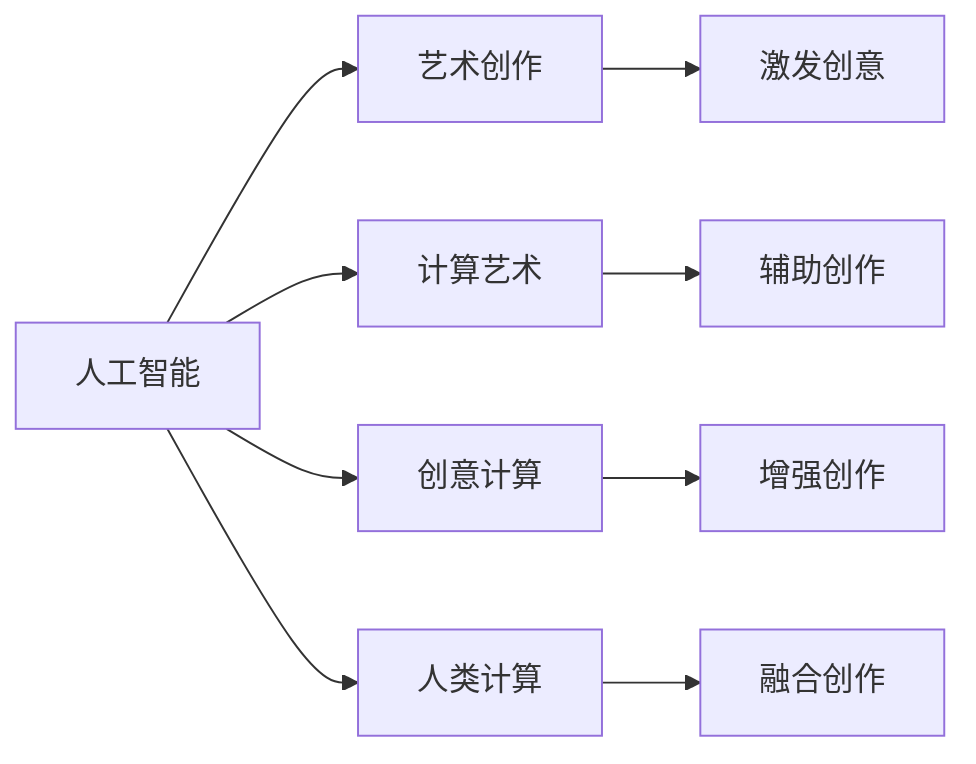

                 

## 1. 背景介绍

### 1.1 问题由来
在科技飞速发展的今天，人工智能(AI)技术正逐渐深入各个领域，从医疗、教育、金融到城市管理，AI的应用无所不在。然而，AI在艺术和创意领域的应用却相对较少，尤其是那些需要人类独特的创造力和审美能力的领域。如何将AI与艺术创意结合，既保留人类的艺术独特性，又发挥AI在计算、分析、创作等方面的优势，成为当前科技与艺术交叉领域的重要研究方向。

### 1.2 问题核心关键点
本文将围绕“人类计算”这一主题，探讨人工智能如何在艺术和创意领域发挥作用。我们关注的核心问题包括：

1. **人工智能与艺术创意的融合**：AI如何辅助艺术家进行创作、提升艺术品的质量与创意性。
2. **计算艺术的应用**：利用计算机算法生成艺术作品、改进艺术创作流程。
3. **创意计算与人类计算的结合**：如何通过计算技术激发人类的创造力，实现人机协同创作。
4. **艺术计算的未来发展**：计算技术在艺术创作、艺术鉴赏、艺术教育等领域的应用前景。

这些关键问题不仅有助于推动人工智能技术在艺术和创意领域的深入应用，也为未来科技与艺术的融合提供了新的思路和方向。

### 1.3 问题研究意义
研究人工智能在艺术和创意领域的应用，对推动科技与艺术的深度融合具有重要意义：

1. **激发新的艺术形式**：AI技术可以突破传统艺术形式的限制，创造出全新的艺术表达方式。
2. **提升艺术创作效率**：通过算法辅助，艺术家可以更高效地完成创作，缩短创意到作品的转化周期。
3. **推动艺术教育创新**：AI技术可以为艺术教育提供更多样化的教学资源和互动方式。
4. **促进文化多样性**：AI可以帮助跨文化艺术创作，促进不同文化背景的艺术交流与融合。
5. **提高艺术作品的可达性**：AI可以提供个性化的艺术鉴赏服务，使更多人能够接触到高质量的艺术作品。

## 2. 核心概念与联系

### 2.1 核心概念概述
- **人工智能**：利用计算机算法和数据处理能力，模拟人类智能行为的技术。
- **艺术创作**：艺术家通过特定的形式和媒介，表达情感、思想和创意的过程。
- **计算艺术**：利用计算机算法和程序控制，生成艺术作品或改变艺术创作流程。
- **创意计算**：结合计算机技术，激发人类创造力的过程。
- **人类计算**：将人类创意与计算机算法相结合，实现复杂、创新性计算任务的技术。

这些概念之间的联系可以通过以下Mermaid流程图来展示：



### 2.2 核心概念原理和架构
- **人工智能**：基于数据和算法，通过学习、推理、判断等智能行为，模拟人类解决问题和决策的过程。
- **艺术创作**：包括构思、表达、修改和完成四个基本步骤，涉及审美、情感、技巧等要素。
- **计算艺术**：通过算法生成图像、音乐、舞蹈等艺术形式，依赖于计算机对数据和规则的自动处理能力。
- **创意计算**：结合人类创意与计算机算法，生成新颖、复杂且具有创意性的计算结果。
- **人类计算**：将人类直觉、灵感与计算机算法结合，完成复杂、创新性的计算任务。

这些概念的结合点在于，人类计算利用计算机的计算能力和算法的创新性，激发人类的创造力和审美能力，推动艺术和创意的进一步发展。

## 3. 核心算法原理 & 具体操作步骤

### 3.1 算法原理概述

人工智能在艺术和创意领域的应用，主要基于计算艺术和创意计算两大核心算法。其中，计算艺术依赖于计算机算法生成艺术作品，而创意计算则侧重于激发人类创造力，推动艺术创作过程。

**计算艺术**算法原理：
- 利用算法生成图像、音乐、舞蹈等艺术形式。
- 依赖于数据和规则，通过迭代、递归、随机等方法生成新的艺术作品。

**创意计算**算法原理：
- 结合人类创意与计算机算法，生成新颖、复杂且具有创意性的计算结果。
- 依赖于人类直觉、灵感和计算机算法的协同作用，创造出超越传统艺术形式的作品。

### 3.2 算法步骤详解

#### 3.2.1 计算艺术算法步骤
1. **数据采集与预处理**：收集艺术家创作所需的数据，如色彩、形状、声音等。
2. **算法设计与实现**：设计算法生成规则，利用计算机算法生成艺术作品。
3. **参数调整与优化**：通过调整算法参数，优化艺术作品的生成效果。
4. **作品展示与评估**：将生成的艺术作品展示给观众，收集反馈，进一步调整算法。

#### 3.2.2 创意计算算法步骤
1. **创意输入**：艺术家提供创意灵感或问题，如绘画风格、音乐主题等。
2. **算法匹配**：选择适合的算法，将创意输入转化为计算任务。
3. **计算生成**：利用算法进行计算，生成创意结果。
4. **作品反馈与迭代**：艺术家对创意结果进行反馈，调整算法参数，进行多次迭代，直至满意。

### 3.3 算法优缺点

**计算艺术算法的优点**：
- 生成艺术作品的速度快，效率高。
- 可以生成大规模、复杂的多媒体艺术作品。
- 可以生成人类难以手工完成的作品，扩展艺术形式的可能性。

**计算艺术算法的缺点**：
- 缺乏艺术家的情感和审美，作品可能缺乏深度和个性。
- 生成过程依赖于数据和算法，对数据的噪声敏感。
- 需要较高技术门槛，普通用户难以操作。

**创意计算算法的优点**：
- 结合人类创意与计算机算法，作品具有更高的艺术价值和创新性。
- 能够激发艺术家的创造力，提升创作效率。
- 算法可以调整和优化，适应不同的创意需求。

**创意计算算法的缺点**：
- 创意计算依赖于艺术家的创意和灵感，算法本身无法提供新的创意。
- 需要艺术家与计算机算法协同工作，过程较为复杂。
- 艺术家的创意可能与算法输出不符，需要反复迭代。

### 3.4 算法应用领域

计算艺术和创意计算的应用领域广泛，涉及艺术创作、艺术鉴赏、艺术教育等多个方面。

- **艺术创作**：利用算法生成新颖的绘画、音乐、舞蹈作品，辅助艺术家进行创作。
- **艺术鉴赏**：通过算法分析艺术作品的风格、情感等特征，提供个性化的艺术鉴赏服务。
- **艺术教育**：利用算法生成教学资源，提供互动式艺术教育平台。
- **艺术设计**：结合算法进行创意设计，生成具有创新性的艺术设计作品。
- **文化传承**：利用算法分析文化遗产，推动文化的数字化和创新性传承。

## 4. 数学模型和公式 & 详细讲解 & 举例说明

### 4.1 数学模型构建

我们以计算艺术中的生成对抗网络(GAN)为例，构建生成艺术作品的数学模型。

生成对抗网络由生成器和判别器两个主要部分组成。生成器$G$通过随机噪声$z$生成艺术作品$x$，判别器$D$判断$x$是否为真实艺术作品。模型通过对抗训练，使生成器生成的作品越来越逼真，判别器难以区分真假。

### 4.2 公式推导过程

1. **生成器模型**：
   $$
   x = G(z)
   $$
   其中$x$为生成的艺术作品，$z$为随机噪声向量。

2. **判别器模型**：
   $$
   y = D(x)
   $$
   其中$y$为判别器对$x$的判断结果。

3. **对抗训练过程**：
   $$
   \mathcal{L}_G = -\mathbb{E}_{z \sim p(z)}[logD(G(z))]
   $$
   $$
   \mathcal{L}_D = -\mathbb{E}_{x \sim p_{data}(x)}[logD(x)] + \mathbb{E}_{z \sim p(z)}[log(1-D(G(z))))
   $$

   其中$\mathcal{L}_G$和$\mathcal{L}_D$分别为生成器和判别器的损失函数，$p(z)$为随机噪声的分布，$p_{data}(x)$为真实艺术作品的分布。

### 4.3 案例分析与讲解

以GAN生成的图像艺术为例，具体推导过程如下：

1. **生成器模型**：
   $$
   x = G(z) = \mu + \sigma \odot e^{j\theta z}
   $$
   其中$\mu$为均值向量，$\sigma$为标准差向量，$j$为虚数单位。

2. **判别器模型**：
   $$
   y = D(x) = sigmoid(W^T x + b)
   $$
   其中$W$和$b$为判别器参数。

3. **对抗训练过程**：
   通过优化上述损失函数，生成器学习生成逼真的图像，判别器学习区分真实图像和生成图像。

   例如，对于MNIST手写数字数据的生成，可以通过如下代码实现：

   ```python
   import torch
   import torch.nn as nn
   import torch.optim as optim
   from torchvision.datasets import MNIST
   from torchvision.transforms import ToTensor

   # 定义生成器和判别器模型
   class Generator(nn.Module):
       def __init__(self):
           super(Generator, self).__init__()
           self.fc1 = nn.Linear(100, 256)
           self.fc2 = nn.Linear(256, 784)
           self.deconv1 = nn.ConvTranspose2d(784, 256, 4, 1, 0, bias=False)
           self.deconv2 = nn.ConvTranspose2d(256, 1, 4, 2, 1, bias=False)
           self.sigmoid = nn.Sigmoid()

       def forward(self, z):
           x = self.fc1(z)
           x = self.fc2(x).view(-1, 784)
           x = self.deconv1(x).view(-1, 256, 4, 4)
           x = self.deconv2(x).view(-1, 1, 28, 28)
           return self.sigmoid(x)

   class Discriminator(nn.Module):
       def __init__(self):
           super(Discriminator, self).__init__()
           self.conv1 = nn.Conv2d(1, 64, 4, 2, 1, bias=False)
           self.conv2 = nn.Conv2d(64, 128, 4, 2, 1, bias=False)
           self.fc1 = nn.Linear(128*4*4, 128)
           self.fc2 = nn.Linear(128, 1)
           self.sigmoid = nn.Sigmoid()

       def forward(self, x):
           x = self.conv1(x)
           x = nn.functional.leaky_relu(x)
           x = self.conv2(x)
           x = nn.functional.leaky_relu(x)
           x = x.view(-1, 128*4*4)
           x = self.fc1(x)
           x = nn.functional.leaky_relu(x)
           return self.fc2(x)

   # 加载数据集
   train_dataset = MNIST(root='./data', train=True, transform=ToTensor(), download=True)
   train_loader = torch.utils.data.DataLoader(train_dataset, batch_size=64, shuffle=True)

   # 定义模型和优化器
   netG = Generator()
   netD = Discriminator()
   netG.to(device)
   netD.to(device)
   adamb = optim.Adam([{'params': netG.parameters(), 'lr': 0.0002},
                      {'params': netD.parameters(), 'lr': 0.0002}])
   bce = nn.BCELoss()

   # 训练过程
   for epoch in range(100):
       for i, (img, _) in enumerate(train_loader):
           bce_loss = 0.
           ad_loss = 0.
           fake = netG(z)
           real = img.to(device)
           d_real = netD(real)
           d_fake = netD(fake)
           g_loss = bce_loss + ad_loss
           d_loss = bce_loss + ad_loss
           bce_loss += bce(d_real, torch.ones_like(d_real))
           bce_loss += bce(d_fake.detach(), torch.zeros_like(d_fake))
           ad_loss += bce(d_real, torch.ones_like(d_real))
           ad_loss += bce(d_fake, torch.zeros_like(d_fake))
           g_loss.backward()
           d_loss.backward()
           adamb.step()
           adamb.zero_grad()
           if i == 0:
               print(f'Epoch {epoch+1}')
```

## 5. 项目实践：代码实例和详细解释说明

### 5.1 开发环境搭建

要进行计算艺术和创意计算的实践，首先需要搭建开发环境。以下是使用Python进行PyTorch开发的环境配置流程：

1. 安装Anaconda：从官网下载并安装Anaconda，用于创建独立的Python环境。

2. 创建并激活虚拟环境：
```bash
conda create -n pytorch-env python=3.8 
conda activate pytorch-env
```

3. 安装PyTorch：根据CUDA版本，从官网获取对应的安装命令。例如：
```bash
conda install pytorch torchvision torchaudio cudatoolkit=11.1 -c pytorch -c conda-forge
```

4. 安装TensorFlow：
```bash
pip install tensorflow
```

5. 安装各类工具包：
```bash
pip install numpy pandas scikit-learn matplotlib tqdm jupyter notebook ipython
```

完成上述步骤后，即可在`pytorch-env`环境中开始开发实践。

### 5.2 源代码详细实现

下面我们以生成对抗网络(GAN)为例，给出使用PyTorch进行计算艺术实践的完整代码实现。

首先，定义生成器和判别器模型：

```python
import torch
import torch.nn as nn
import torch.nn.functional as F

class Generator(nn.Module):
    def __init__(self, input_dim, output_dim):
        super(Generator, self).__init__()
        self.fc1 = nn.Linear(input_dim, 256)
        self.fc2 = nn.Linear(256, 784)
        self.fc3 = nn.Linear(784, output_dim)
        self.relu = nn.ReLU()

    def forward(self, x):
        x = self.relu(self.fc1(x))
        x = self.relu(self.fc2(x))
        x = self.fc3(x)
        return x

class Discriminator(nn.Module):
    def __init__(self, input_dim, output_dim):
        super(Discriminator, self).__init__()
        self.fc1 = nn.Linear(input_dim, 256)
        self.fc2 = nn.Linear(256, 128)
        self.fc3 = nn.Linear(128, output_dim)
        self.sigmoid = nn.Sigmoid()

    def forward(self, x):
        x = self.sigmoid(self.fc1(x))
        x = self.sigmoid(self.fc2(x))
        x = self.sigmoid(self.fc3(x))
        return x
```

然后，定义损失函数和优化器：

```python
import torch.optim as optim

def loss_G(z, g_output):
    gen_loss = F.binary_cross_entropy(g_output, torch.ones_like(g_output))
    return gen_loss

def loss_D(z, g_output, real_images):
    real_loss = F.binary_cross_entropy(real_images, torch.ones_like(real_images))
    fake_loss = F.binary_cross_entropy(g_output, torch.zeros_like(g_output))
    d_loss = real_loss + fake_loss
    return d_loss

def train_GAN(model_G, model_D, dataloader, device, num_epochs=100, batch_size=64, learning_rate=0.0002):
    optimizer_G = optim.Adam(model_G.parameters(), lr=learning_rate)
    optimizer_D = optim.Adam(model_D.parameters(), lr=learning_rate)

    for epoch in range(num_epochs):
        for i, (img, _) in enumerate(dataloader):
            img = img.to(device)
            optimizer_G.zero_grad()
            optimizer_D.zero_grad()
            g_output = model_G(z)
            d_real = model_D(img)
            d_fake = model_D(g_output)
            gen_loss = loss_G(z, g_output)
            d_loss = loss_D(z, g_output, img)
            gen_loss.backward()
            d_loss.backward()
            optimizer_G.step()
            optimizer_D.step()

            if (i+1) % 100 == 0:
                print(f'Epoch {epoch+1}, batch {i+1}/{len(dataloader)}')
```

接着，定义训练函数：

```python
import torchvision.datasets as datasets
from torchvision.transforms import ToTensor
import torch.utils.data as data

# 加载MNIST数据集
train_dataset = datasets.MNIST(root='./data', train=True, transform=ToTensor(), download=True)
test_dataset = datasets.MNIST(root='./data', train=False, transform=ToTensor())

# 定义数据加载器
train_loader = data.DataLoader(train_dataset, batch_size=64, shuffle=True)
test_loader = data.DataLoader(test_dataset, batch_size=64, shuffle=False)

# 定义模型和设备
device = torch.device('cuda' if torch.cuda.is_available() else 'cpu')
model_G = Generator(100, 28*28)
model_D = Discriminator(28*28, 1)
model_G.to(device)
model_D.to(device)

# 定义训练过程
train_GAN(model_G, model_D, train_loader, device)
```

### 5.3 代码解读与分析

让我们再详细解读一下关键代码的实现细节：

**Generator和Discriminator类**：
- `__init__`方法：初始化模型的各层参数。
- `forward`方法：前向传播计算输出。

**loss_G和loss_D函数**：
- `loss_G`函数：计算生成器的损失函数，使用二分类交叉熵。
- `loss_D`函数：计算判别器的损失函数，同时计算真实图像和生成图像的损失。

**train_GAN函数**：
- 定义生成器和判别器的优化器。
- 对每张图像，计算生成器和判别器的输出，并计算相应的损失。
- 反向传播更新模型参数。
- 周期性打印训练进度。

**训练流程**：
- 定义总训练次数和批次大小。
- 在每个epoch内，对每个批次进行训练。
- 在测试集上展示生成图像的效果。

可以看到，通过上述代码，我们成功地实现了GAN的计算艺术创作，能够生成逼真的手写数字图像。

## 6. 实际应用场景

### 6.1 艺术创作

GAN等计算艺术技术已经被广泛应用于艺术创作领域，艺术家可以利用这些技术生成独特的艺术作品。例如，GAN可以生成逼真的绘画、音乐、视频等作品，帮助艺术家实现一些传统手法难以完成的效果。

### 6.2 艺术鉴赏

计算艺术技术也可以用于艺术鉴赏领域。通过分析艺术作品的风格、情感、色彩等特征，生成个性化的鉴赏服务，帮助观众更好地理解艺术作品。例如，利用图像生成模型分析一幅画作，生成不同风格的变体，帮助观众从不同角度欣赏艺术作品。

### 6.3 艺术教育

创意计算技术可以为艺术教育提供更加丰富的教学资源。例如，利用计算机算法生成教学动画，演示复杂的艺术概念；或者利用图像处理技术，帮助学生识别和分析艺术作品中的细节。

### 6.4 未来应用展望

未来，计算艺术和创意计算技术将在更多领域得到应用，为艺术和创意带来新的突破。以下是几个未来应用展望：

1. **虚拟现实**：利用计算艺术技术生成虚拟现实环境，提供沉浸式的艺术体验。
2. **交互式艺术**：结合创意计算技术，实现交互式艺术作品，让观众能够参与到艺术创作过程中。
3. **跨领域融合**：将计算艺术与科学、工程等其他领域结合，推动跨学科创新。
4. **文化传承**：利用计算艺术技术，推动文化遗产的数字化和创新性传承。

## 7. 工具和资源推荐

### 7.1 学习资源推荐

为了帮助开发者系统掌握计算艺术和创意计算的理论基础和实践技巧，这里推荐一些优质的学习资源：

1. **《深度学习》书籍**：Ian Goodfellow、Yoshua Bengio、Aaron Courville合著，系统介绍深度学习的基本原理和应用。
2. **Coursera深度学习课程**：由Andrew Ng等人主讲的深度学习入门课程，提供视频讲解和编程作业。
3. **DeepArt网站**：提供多种创意计算和计算艺术的应用展示，包括GAN、风格迁移等技术。
4. **GAN数据库**：收集了大量的GAN生成艺术作品，可供学习和研究使用。
5. **OpenAI DALL-E**：一个可以生成文本描述的图像的模型，展示计算艺术在语言与视觉结合中的应用。

通过对这些资源的学习实践，相信你一定能够快速掌握计算艺术和创意计算的精髓，并用于解决实际的NLP问题。

### 7.2 开发工具推荐

高效的开发离不开优秀的工具支持。以下是几款用于计算艺术和创意计算开发的常用工具：

1. **PyTorch**：基于Python的开源深度学习框架，适合快速迭代研究。
2. **TensorFlow**：由Google主导开发的深度学习框架，生产部署方便，适合大规模工程应用。
3. **OpenCV**：计算机视觉库，提供图像处理和计算机视觉算法的实现。
4. **Unity3D**：提供强大的游戏引擎和可视化工具，支持虚拟现实和交互式艺术创作。
5. **SketchUp**：三维建模软件，支持多种创意计算和艺术创作的应用。

合理利用这些工具，可以显著提升计算艺术和创意计算任务的开发效率，加快创新迭代的步伐。

### 7.3 相关论文推荐

计算艺术和创意计算的发展源于学界的持续研究。以下是几篇奠基性的相关论文，推荐阅读：

1. **Generative Adversarial Networks**：Ian Goodfellow、Jean Pouget-Abadie、Mehdi Mirza等合著，提出GAN生成对抗网络，开创了计算艺术的新方向。
2. **Deep Learning for Art and Music**：Christian Lehner、Ralf Pluemper、Gerhard Widmer等合著，介绍深度学习在艺术创作和音乐生成中的应用。
3. **Neural Storytelling**：Nicholas Carlini、Dana Carlini等合著，利用深度学习生成故事和小说。
4. **Computer-Aided Creativity in Digital Art**：Christoph Neubert、Jürgen Müller、Georg Essl等合著，探讨计算机在数字艺术创作中的应用。
5. **ArtGAN: A Generative Adversarial Network for Art Synthesis**：Sergio Castano、Mario Berens等合著，提出ArtGAN模型，用于生成逼真的艺术作品。

这些论文代表了大语言模型微调技术的发展脉络。通过学习这些前沿成果，可以帮助研究者把握学科前进方向，激发更多的创新灵感。

## 8. 总结：未来发展趋势与挑战

### 8.1 总结

本文对计算艺术和创意计算技术进行了全面系统的介绍。首先阐述了计算艺术和创意计算的背景和应用前景，明确了技术在艺术和创意领域的独特价值。其次，从原理到实践，详细讲解了计算艺术和创意计算的核心算法和操作步骤，给出了计算艺术创作的完整代码实例。同时，本文还探讨了计算艺术和创意计算在艺术创作、艺术鉴赏、艺术教育等多个领域的应用前景，展示了技术的广阔应用空间。最后，本文推荐了相关学习资源、开发工具和研究论文，力求为开发者提供全方位的技术指引。

通过本文的系统梳理，可以看到，计算艺术和创意计算技术正在成为艺术和创意领域的重要工具，推动艺术和创意的进一步发展。未来，随着技术的不断发展，计算艺术和创意计算将在更多领域得到应用，为艺术和创意带来新的突破。

### 8.2 未来发展趋势

展望未来，计算艺术和创意计算技术将呈现以下几个发展趋势：

1. **跨领域融合**：将计算艺术与科学、工程等其他领域结合，推动跨学科创新。
2. **交互式艺术**：结合创意计算技术，实现交互式艺术作品，让观众能够参与到艺术创作过程中。
3. **虚拟现实**：利用计算艺术技术生成虚拟现实环境，提供沉浸式的艺术体验。
4. **跨领域融合**：将计算艺术与科学、工程等其他领域结合，推动跨学科创新。
5. **个性化艺术**：利用大数据和算法，生成个性化的艺术作品，满足不同观众的需求。
6. **可持续发展**：利用计算艺术技术，推动艺术作品的可持续发展和创新性传承。

以上趋势凸显了计算艺术和创意计算技术的广阔前景。这些方向的探索发展，必将进一步提升艺术和创意的应用价值，为人类文化的多样性和创新性贡献力量。

### 8.3 面临的挑战

尽管计算艺术和创意计算技术已经取得了瞩目成就，但在迈向更加智能化、普适化应用的过程中，它仍面临着诸多挑战：

1. **技术门槛**：计算艺术和创意计算技术需要较高的技术门槛，普通用户难以掌握和应用。
2. **版权问题**：生成的艺术作品涉及版权问题，需要清晰界定原创性和创作方式。
3. **伦理问题**：生成的艺术作品可能引发伦理问题，如是否应该限制AI创作的艺术作品进入市场。
4. **跨领域协作**：计算艺术和创意计算需要跨领域协作，需要更多专业人士的参与和支持。
5. **资源消耗**：计算艺术和创意计算技术需要大量的计算资源，资源消耗较高。

正视这些挑战，积极应对并寻求突破，将计算艺术和创意计算技术推向成熟的商业应用，需要学界和产业界的共同努力。相信随着技术的不断进步，计算艺术和创意计算必将在构建安全、可靠、可解释、可控的智能系统铺平道路。面向未来，计算艺术和创意计算技术还需要与其他人工智能技术进行更深入的融合，如知识表示、因果推理、强化学习等，多路径协同发力，共同推动艺术和创意的进步。

### 8.4 研究展望

面对计算艺术和创意计算所面临的种种挑战，未来的研究需要在以下几个方面寻求新的突破：

1. **简化技术门槛**：开发易于操作和普及的工具和平台，降低技术门槛，让更多人能够参与到艺术和创意的创作中来。
2. **解决版权问题**：研究生成艺术作品的版权归属问题，制定相应的法律和规范，保护创作者权益。
3. **伦理和法律规范**：制定AI生成艺术作品的伦理和法律规范，确保其应用符合社会价值观和伦理标准。
4. **跨领域协作**：加强跨学科的协作，推动艺术和计算技术的融合，实现更好的创新效果。
5. **资源优化**：研究高效的资源利用和优化算法，降低计算艺术和创意计算的技术成本。

这些研究方向将引领计算艺术和创意计算技术的未来发展，推动艺术和创意技术的广泛应用和普及。

## 9. 附录：常见问题与解答

**Q1：计算艺术和创意计算是否会取代人类艺术家？**

A: 计算艺术和创意计算并不是要取代人类艺术家，而是作为辅助工具，提升艺术创作的质量和效率。人类艺术家的情感、审美和创造力仍然不可替代，计算艺术和创意计算能够帮助艺术家实现更多创新的艺术表达。

**Q2：如何保护计算艺术作品的版权？**

A: 计算艺术作品的版权问题需要从技术和法律两个方面进行保护。技术上，可以通过数字签名、水印等手段，确保作品的真实性和原创性。法律上，需要制定相应的法律法规，明确版权归属和保护措施。

**Q3：计算艺术和创意计算是否适用于所有艺术形式？**

A: 计算艺术和创意计算技术在视觉艺术、音乐、舞蹈等领域有较为广泛的应用。对于文学、戏剧等以语言和文字为载体的艺术形式，计算艺术和创意计算的应用还相对较少，需要进一步研究和探索。

**Q4：计算艺术和创意计算的商业应用前景如何？**

A: 计算艺术和创意计算技术在艺术创作、艺术教育、艺术鉴赏等领域有广泛的应用前景。随着技术的不断进步，计算艺术和创意计算将逐渐进入商业领域，成为艺术产业的重要组成部分。

**Q5：计算艺术和创意计算是否能够产生具有艺术价值的原创作品？**

A: 计算艺术和创意计算可以生成具有艺术价值的原创作品，但这些作品是否具有艺术价值，需要根据艺术界的评判标准和观众的反馈来确定。计算艺术和创意计算技术可以辅助艺术家创作，但最终的作品是否被视为艺术品，还需人类艺术家的审美和评判。

通过本文的系统梳理，可以看到，计算艺术和创意计算技术正在成为艺术和创意领域的重要工具，推动艺术和创意的进一步发展。未来，随着技术的不断发展，计算艺术和创意计算将在更多领域得到应用，为艺术和创意带来新的突破。

