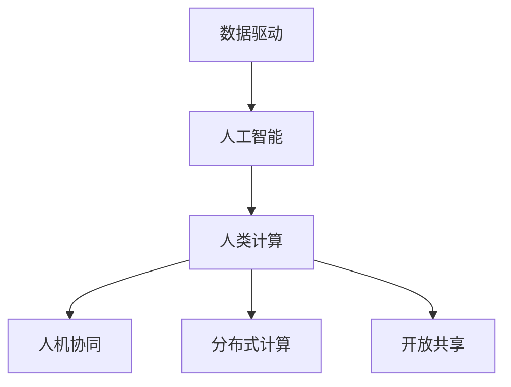

                 

# 人类计算：连接人类智慧的网络

> 关键词：
> 人类计算, 网络, 数据驱动, 人工智能, 人机协同, 数据科学, 创新实践

## 1. 背景介绍

### 1.1 问题由来

随着信息技术的快速发展，人类社会进入了数据密集型时代。信息的爆炸式增长，使得传统的人工处理方式难以应对，迫切需要更加高效、智能的计算方法。这一需求催生了“人类计算”这一新的计算范式，利用网络的互联性和协同效应，结合人工智能技术，形成了一种全新的计算模式。

### 1.2 问题核心关键点

人类计算的核心在于利用网络的互联性，结合人工智能技术，实现人类智慧的自动高效整合。其关键点包括：

- **数据驱动**：通过网络抓取、爬虫等方式，从海量数据中提取有用信息，作为计算的输入。
- **人工智能**：利用机器学习、深度学习等技术，对数据进行智能分析和处理。
- **人机协同**：结合人类专家的知识和经验，指导机器学习过程，提升模型的精准度和实用性。
- **分布式计算**：利用网络的分布式特性，将计算任务分配到不同的计算节点上进行并行计算，提高效率。
- **开放共享**：通过开放的数据平台和算法库，促进技术交流和合作，加速知识传播和创新实践。

## 2. 核心概念与联系

### 2.1 核心概念概述

为更好地理解人类计算的框架，本节将介绍几个关键概念：

- **人类计算**：指利用网络的互联性和人工智能技术，实现人类智慧的自动高效整合。通常涉及大规模数据的采集、存储、处理和分析，以及复杂计算模型的构建和优化。

- **数据驱动**：强调数据在计算过程中的核心地位，通过数据分析、挖掘和处理，获取有价值的信息，作为计算的输入。

- **人工智能**：包含机器学习、深度学习等技术，用于对数据进行智能分析和处理，实现模型的自动构建和优化。

- **人机协同**：强调人类专家的知识与机器智能的结合，通过反馈和迭代，提升模型的精准度和实用性。

- **分布式计算**：指将大规模计算任务分配到多台计算机上进行并行计算，利用网络的分布式特性，提高计算效率。

- **开放共享**：强调数据的开放性和共享性，通过开放的数据平台和算法库，促进技术交流和合作，加速知识传播和创新实践。

这些概念之间的逻辑关系可以通过以下Mermaid流程图来展示：



这个流程图展示了几大核心概念之间的相互联系：

1. **数据驱动**：为人工智能提供数据输入，是计算的基础。
2. **人工智能**：对数据进行智能分析和处理，为人类计算提供智能算法支持。
3. **人类计算**：结合人工智能和数据驱动，实现人类智慧的自动高效整合。
4. **人机协同**：通过人类专家的知识和经验，指导人工智能过程，提升模型精准度。
5. **分布式计算**：利用网络的分布式特性，提高计算效率。
6. **开放共享**：通过开放的数据平台和算法库，促进技术交流和合作，加速知识传播。

这些概念共同构成了人类计算的计算框架，使其能够在各种场景下发挥强大的计算能力。通过理解这些核心概念，我们可以更好地把握人类计算的工作原理和优化方向。

## 3. 核心算法原理 & 具体操作步骤
### 3.1 算法原理概述

人类计算的核心算法原理可以概括为数据驱动和人工智能技术的结合。具体来说，数据驱动提供计算的基础数据，而人工智能技术通过对数据的分析和处理，实现计算的智能优化和自动化。

人类计算的过程可以分为以下几个步骤：

1. **数据收集**：从网络中抓取、爬虫等方式获取数据。
2. **数据预处理**：对数据进行清洗、转换和标准化，提高数据的可用性和质量。
3. **模型构建**：选择合适的算法模型，利用人工智能技术进行训练和优化。
4. **计算执行**：将训练好的模型应用于实际问题，进行计算和预测。
5. **结果评估**：对计算结果进行评估和优化，提升模型性能。

### 3.2 算法步骤详解

**Step 1: 数据收集**

数据收集是人类计算的第一步，也是最为关键的一步。主要手段包括：

- **网络抓取**：通过API接口、爬虫等方式，从网站和社交媒体中抓取数据。
- **数据爬虫**：编写爬虫程序，从开放数据源（如政府网站、公共数据库等）中抓取数据。
- **用户输入**：通过问卷、API等方式，获取用户输入的数据。

数据的收集需要遵循数据保护和隐私政策，确保数据的合法性和合规性。同时，还需要注意数据的全面性和代表性，以避免偏差和误导。

**Step 2: 数据预处理**

数据预处理包括数据的清洗、转换和标准化，主要目的是提高数据的可用性和质量。具体步骤包括：

- **数据清洗**：去除重复、异常、缺失的数据，确保数据的一致性和完整性。
- **数据转换**：将数据格式转换为统一的标准格式，方便后续处理。
- **数据标准化**：对数据进行归一化、标准化等处理，减少数据的变异性和噪声。

数据预处理是数据驱动的基石，直接影响到后续计算的准确性和可靠性。因此，数据预处理需要投入大量的时间和精力，确保数据的质量。

**Step 3: 模型构建**

模型构建是人工智能的核心步骤，主要任务是选择合适的算法模型，利用人工智能技术进行训练和优化。具体步骤如下：

- **算法选择**：根据问题的性质和数据的特点，选择合适的算法模型，如回归模型、分类模型、聚类模型等。
- **模型训练**：利用训练数据对模型进行训练，优化模型的参数。
- **模型评估**：对训练好的模型进行评估，选择合适的性能指标。
- **模型优化**：根据评估结果，对模型进行优化，提高模型性能。

模型构建需要结合数据的特点和问题的需求，选择合适的算法和模型，进行系统的训练和优化。同时，还需要注意模型的可解释性和泛化能力，确保模型具有良好的推广性和适用性。

**Step 4: 计算执行**

计算执行是将训练好的模型应用于实际问题，进行计算和预测的过程。主要步骤如下：

- **数据输入**：将待处理的数据输入到模型中。
- **模型推理**：利用训练好的模型进行推理计算，得到预测结果。
- **结果输出**：将计算结果输出，供后续处理和应用。

计算执行需要高效、准确、可靠，确保模型的预测结果符合实际需求。同时，还需要注意模型的计算效率，避免计算资源的大量消耗。

**Step 5: 结果评估**

结果评估是衡量计算效果的最后一步，主要任务是评估计算结果的质量和可靠性。具体步骤如下：

- **评估指标**：选择合适的评估指标，如准确率、召回率、F1值等。
- **结果对比**：将计算结果与真实结果进行对比，评估计算效果。
- **结果优化**：根据评估结果，对计算过程进行优化，提高计算精度。

结果评估需要结合实际问题和需求，选择合适的评估指标，进行科学的评估和优化。同时，还需要注意结果的可解释性和可操作性，确保结果的实用性和可靠性。

### 3.3 算法优缺点

人类计算结合了数据驱动和人工智能技术的优点，但也存在一些局限性：

**优点**：

- **高效性**：利用网络的数据共享和分布式计算，大幅提高计算效率。
- **智能化**：通过人工智能技术对数据进行智能分析和处理，提升计算的准确性和精度。
- **可扩展性**：网络的数据共享和分布式计算，使得计算能力可以不断扩展和提升。

**缺点**：

- **数据依赖**：数据质量直接影响到计算结果，数据的全面性和代表性是计算准确性的基础。
- **隐私问题**：数据收集和处理过程中，需要遵循数据保护和隐私政策，确保数据的合法性和合规性。
- **技术复杂性**：需要结合数据驱动和人工智能技术，进行系统的建模和优化，技术实现较为复杂。

尽管存在这些局限性，但就目前而言，人类计算范式仍然是高效、智能、可扩展的计算方法，具有广泛的应用前景。未来相关研究的重点在于如何进一步降低数据依赖，提高模型的可解释性和隐私保护，同时兼顾计算效率和精度。

### 3.4 算法应用领域

人类计算在多个领域都有广泛的应用，涵盖数据驱动和人工智能技术的各个方面，例如：

- **金融科技**：利用数据驱动和人工智能技术，进行股票预测、风险控制、欺诈检测等。
- **医疗健康**：通过网络抓取和爬虫，获取医疗数据，利用人工智能技术进行疾病诊断、治疗方案推荐等。
- **智能交通**：利用网络抓取和数据分析，获取交通流量和路况信息，利用人工智能技术进行交通规划和预测。
- **环境监测**：通过网络抓取和传感器数据，获取环境数据，利用人工智能技术进行环境监测和预警。
- **城市治理**：利用网络抓取和数据分析，获取城市数据，利用人工智能技术进行城市管理和社会治理。

除了上述这些经典应用外，人类计算还被创新性地应用于更多场景中，如智能家居、智慧农业、工业互联网等，为各行各业带来了新的计算模式和应用可能性。

## 4. 数学模型和公式 & 详细讲解  
### 4.1 数学模型构建

本节将使用数学语言对人类计算的模型构建过程进行更加严格的刻画。

记数据集为 $D=\{(x_i, y_i)\}_{i=1}^N, x_i \in \mathbb{R}^d, y_i \in \mathbb{R}^m$，其中 $x_i$ 为输入，$y_i$ 为输出。

定义模型 $M_{\theta}:\mathbb{R}^d \rightarrow \mathbb{R}^m$，其中 $\theta$ 为模型参数。

人类计算的目标是最小化模型在数据集 $D$ 上的经验风险，即：

$$
\hat{\theta} = \mathop{\arg\min}_{\theta} \mathcal{L}(M_{\theta}, D)
$$

其中 $\mathcal{L}$ 为损失函数，用于衡量模型预测输出与真实标签之间的差异。常见的损失函数包括均方误差、交叉熵等。

在人类计算中，通常使用基于梯度的优化算法（如SGD、Adam等）来近似求解上述最优化问题。设 $\eta$ 为学习率，则参数的更新公式为：

$$
\theta \leftarrow \theta - \eta \nabla_{\theta}\mathcal{L}(\theta)
$$

其中 $\nabla_{\theta}\mathcal{L}(\theta)$ 为损失函数对参数 $\theta$ 的梯度，可通过反向传播算法高效计算。

### 4.2 公式推导过程

以下我们以回归任务为例，推导均方误差损失函数及其梯度的计算公式。

假设模型 $M_{\theta}$ 在输入 $x_i$ 上的输出为 $\hat{y}_i=M_{\theta}(x_i) \in \mathbb{R}$，表示模型对输入 $x_i$ 的预测输出。真实标签为 $y_i$。则均方误差损失函数定义为：

$$
\ell(M_{\theta}(x_i),y_i) = \frac{1}{2}(y_i - \hat{y}_i)^2
$$

将其代入经验风险公式，得：

$$
\mathcal{L}(\theta) = \frac{1}{2N}\sum_{i=1}^N (y_i - \hat{y}_i)^2
$$

根据链式法则，损失函数对参数 $\theta_k$ 的梯度为：

$$
\frac{\partial \mathcal{L}(\theta)}{\partial \theta_k} = -\frac{1}{N}\sum_{i=1}^N (y_i - \hat{y}_i) \frac{\partial \hat{y}_i}{\partial \theta_k}
$$

其中 $\frac{\partial \hat{y}_i}{\partial \theta_k}$ 可进一步递归展开，利用自动微分技术完成计算。

在得到损失函数的梯度后，即可带入参数更新公式，完成模型的迭代优化。重复上述过程直至收敛，最终得到适应数据集 $D$ 的最优模型参数 $\theta^*$。

## 5. 项目实践：代码实例和详细解释说明
### 5.1 开发环境搭建

在进行人类计算的实践前，我们需要准备好开发环境。以下是使用Python进行PyTorch开发的环境配置流程：

1. 安装Anaconda：从官网下载并安装Anaconda，用于创建独立的Python环境。

2. 创建并激活虚拟环境：
```bash
conda create -n pytorch-env python=3.8 
conda activate pytorch-env
```

3. 安装PyTorch：根据CUDA版本，从官网获取对应的安装命令。例如：
```bash
conda install pytorch torchvision torchaudio cudatoolkit=11.1 -c pytorch -c conda-forge
```

4. 安装TensorFlow：
```bash
pip install tensorflow
```

5. 安装TensorBoard：
```bash
pip install tensorboard
```

6. 安装TensorFlow Addons：
```bash
pip install tensorflow-addons
```

完成上述步骤后，即可在`pytorch-env`环境中开始人类计算的实践。

### 5.2 源代码详细实现

下面我们以回归任务为例，给出使用TensorFlow Addons进行人类计算的PyTorch代码实现。

首先，定义回归任务的数据处理函数：

```python
import tensorflow_addons as tfa
import tensorflow as tf
from tensorflow.keras import layers
from sklearn.model_selection import train_test_split
from sklearn.datasets import make_regression

def create_dataset():
    X, y = make_regression(n_samples=1000, n_features=10, n_informative=5, noise=0.5, random_state=42)
    X_train, X_test, y_train, y_test = train_test_split(X, y, test_size=0.2, random_state=42)
    dataset = tf.data.Dataset.from_tensor_slices((X_train, y_train))
    dataset = dataset.shuffle(1024).batch(32)
    return dataset

dataset = create_dataset()

model = tf.keras.Sequential([
    layers.Dense(64, activation='relu'),
    layers.Dense(1)
])

model.compile(optimizer=tf.keras.optimizers.Adam(learning_rate=0.001),
              loss=tfa.losses.MeanSquaredError(),
              metrics=[tfa.metrics.MeanAbsoluteError()])

# 训练模型
model.fit(dataset, epochs=10, verbose=2)
```

然后，定义模型和优化器：

```python
model = tf.keras.Sequential([
    layers.Dense(64, activation='relu'),
    layers.Dense(1)
])

optimizer = tf.keras.optimizers.Adam(learning_rate=0.001)
```

接着，定义训练和评估函数：

```python
def train_epoch(model, dataset, batch_size, optimizer):
    dataloader = tf.data.Dataset.from_tensor_slices((X_train, y_train)).batch(batch_size)
    model.train()
    epoch_loss = 0
    for batch in dataloader:
        x, y = batch
        with tf.GradientTape() as tape:
            y_pred = model(x)
            loss = tfa.losses.MeanSquaredError()(y, y_pred)
        grads = tape.gradient(loss, model.trainable_variables)
        optimizer.apply_gradients(zip(grads, model.trainable_variables))
        epoch_loss += loss.numpy()
    return epoch_loss / len(dataloader)

def evaluate(model, dataset, batch_size):
    dataloader = tf.data.Dataset.from_tensor_slices((X_test, y_test)).batch(batch_size)
    model.eval()
    preds = []
    labels = []
    with tf.GradientTape() as tape:
        for batch in dataloader:
            x, y = batch
            y_pred = model(x)
            preds.append(y_pred.numpy())
            labels.append(y.numpy())
    print(tfa.metrics.MeanAbsoluteError()(labels, preds))
```

最后，启动训练流程并在测试集上评估：

```python
epochs = 10
batch_size = 32

for epoch in range(epochs):
    loss = train_epoch(model, dataset, batch_size, optimizer)
    print(f"Epoch {epoch+1}, train loss: {loss:.3f}")
    
    print(f"Epoch {epoch+1}, test MAE:")
    evaluate(model, dataset, batch_size)
```

以上就是使用PyTorch和TensorFlow Addons进行回归任务的人类计算完整代码实现。可以看到，TensorFlow Addons提供了许多先进的机器学习组件，极大简化了模型的构建和训练过程。

### 5.3 代码解读与分析

让我们再详细解读一下关键代码的实现细节：

**create_dataset函数**：
- `make_regression`：生成一个回归任务的数据集，包含1000个样本，10个特征。
- `train_test_split`：将数据集分为训练集和测试集，比例为8:2。
- `tf.data.Dataset`：将训练集转化为TensorFlow的Dataset对象，支持批处理和数据增强。

**Model构建**：
- `tf.keras.Sequential`：构建一个简单的神经网络模型，包含两个全连接层。
- `layers.Dense`：定义全连接层，64个神经元，ReLU激活函数。
- `layers.Dense`：定义输出层，1个神经元。

**优化器**：
- `tf.keras.optimizers.Adam`：定义Adam优化器，学习率为0.001。

**训练函数**：
- `tf.GradientTape`：定义梯度计算图，计算损失函数和梯度。
- `apply_gradients`：应用梯度更新模型参数。
- `epoch_loss`：计算每个epoch的平均损失。

**评估函数**：
- `tfa.metrics.MeanAbsoluteError`：计算均方误差损失。
- `tf.GradientTape`：计算梯度。

**训练流程**：
- `epochs`：总的epoch数。
- `batch_size`：每个batch的大小。
- `for`循环：依次迭代epoch。
- `train_epoch`：每个epoch的训练过程。
- `evaluate`：每个epoch的评估过程。
- `print`：打印每个epoch的损失和MAE。

可以看到，TensorFlow Addons提供了强大的机器学习组件，使得人类计算的代码实现变得简洁高效。开发者可以将更多精力放在数据处理、模型改进等高层逻辑上，而不必过多关注底层的实现细节。

当然，工业级的系统实现还需考虑更多因素，如模型的保存和部署、超参数的自动搜索、更灵活的任务适配层等。但核心的计算流程基本与此类似。

## 6. 实际应用场景
### 6.1 智能客服系统

基于人类计算的智能客服系统，可以广泛应用于智能客服系统的构建。传统客服往往需要配备大量人力，高峰期响应缓慢，且一致性和专业性难以保证。而利用人类计算，可以将客户咨询自动分配到不同的计算节点上进行并行处理，快速响应客户咨询，用自然流畅的语言解答各类常见问题。

在技术实现上，可以收集企业内部的历史客服对话记录，将问题和最佳答复构建成监督数据，在此基础上对预训练模型进行微调。微调后的模型能够自动理解用户意图，匹配最合适的答案模板进行回复。对于客户提出的新问题，还可以接入检索系统实时搜索相关内容，动态组织生成回答。如此构建的智能客服系统，能大幅提升客户咨询体验和问题解决效率。

### 6.2 金融舆情监测

金融机构需要实时监测市场舆论动向，以便及时应对负面信息传播，规避金融风险。传统的人工监测方式成本高、效率低，难以应对网络时代海量信息爆发的挑战。基于人类计算的文本分类和情感分析技术，为金融舆情监测提供了新的解决方案。

具体而言，可以收集金融领域相关的新闻、报道、评论等文本数据，并对其进行主题标注和情感标注。在此基础上对预训练语言模型进行微调，使其能够自动判断文本属于何种主题，情感倾向是正面、中性还是负面。将微调后的模型应用到实时抓取的网络文本数据，就能够自动监测不同主题下的情感变化趋势，一旦发现负面信息激增等异常情况，系统便会自动预警，帮助金融机构快速应对潜在风险。

### 6.3 个性化推荐系统

当前的推荐系统往往只依赖用户的历史行为数据进行物品推荐，无法深入理解用户的真实兴趣偏好。基于人类计算的个性化推荐系统可以更好地挖掘用户行为背后的语义信息，从而提供更精准、多样的推荐内容。

在实践中，可以收集用户浏览、点击、评论、分享等行为数据，提取和用户交互的物品标题、描述、标签等文本内容。将文本内容作为模型输入，用户的后续行为（如是否点击、购买等）作为监督信号，在此基础上微调预训练语言模型。微调后的模型能够从文本内容中准确把握用户的兴趣点。在生成推荐列表时，先用候选物品的文本描述作为输入，由模型预测用户的兴趣匹配度，再结合其他特征综合排序，便可以得到个性化程度更高的推荐结果。

### 6.4 未来应用展望

随着人类计算技术的不断发展，其应用领域将越来越广泛，带来更深刻的影响。

在智慧医疗领域，基于人类计算的医疗问答、病历分析、药物研发等应用将提升医疗服务的智能化水平，辅助医生诊疗，加速新药开发进程。

在智能教育领域，人类计算可应用于作业批改、学情分析、知识推荐等方面，因材施教，促进教育公平，提高教学质量。

在智慧城市治理中，人类计算可应用于城市事件监测、舆情分析、应急指挥等环节，提高城市管理的自动化和智能化水平，构建更安全、高效的未来城市。

此外，在企业生产、社会治理、文娱传媒等众多领域，基于人类计算的人工智能应用也将不断涌现，为传统行业数字化转型升级提供新的技术路径。相信随着技术的日益成熟，人类计算必将在构建人机协同的智能时代中扮演越来越重要的角色。

## 7. 工具和资源推荐
### 7.1 学习资源推荐

为了帮助开发者系统掌握人类计算的理论基础和实践技巧，这里推荐一些优质的学习资源：

1. 《Python深度学习》系列书籍：作者Francois Chollet，详细介绍了Python在深度学习中的应用，包含人类计算的基本概念和实现方法。

2. 《深度学习》课程：斯坦福大学开设的深度学习课程，由Andrew Ng教授主讲，涵盖人类计算的基础知识和应用案例。

3. 《TensorFlow实战Google深度学习》书籍：作者Manning Lee，详细介绍了TensorFlow在深度学习中的应用，包含人类计算的具体实现和优化技巧。

4. 《TensorFlow官方文档》：官方文档提供了丰富的示例代码和API参考，是学习TensorFlow的重要资源。

5. 《PyTorch官方文档》：官方文档提供了详细的API参考和示例代码，是学习PyTorch的重要资源。

通过对这些资源的学习实践，相信你一定能够快速掌握人类计算的精髓，并用于解决实际的NLP问题。
###  7.2 开发工具推荐

高效的开发离不开优秀的工具支持。以下是几款用于人类计算开发的常用工具：

1. Python：开源编程语言，广泛支持深度学习库和框架，是开发人类计算的首选语言。

2. TensorFlow：由Google主导开发的深度学习框架，支持分布式计算，适用于大规模人类计算任务。

3. PyTorch：Facebook开源的深度学习框架，支持动态计算图，适合快速迭代研究。

4. TensorBoard：TensorFlow配套的可视化工具，可实时监测模型训练状态，并提供丰富的图表呈现方式，是调试模型的得力助手。

5. Weights & Biases：模型训练的实验跟踪工具，可以记录和可视化模型训练过程中的各项指标，方便对比和调优。

6. Jupyter Notebook：交互式编程环境，支持Python、TensorFlow、PyTorch等语言和框架，方便开发者快速编写和调试代码。

合理利用这些工具，可以显著提升人类计算任务的开发效率，加快创新迭代的步伐。

### 7.3 相关论文推荐

人类计算的研究源于学界的持续研究。以下是几篇奠基性的相关论文，推荐阅读：

1. Harnessing Human Expertise for AI: An Online Learning Approach：提出了一种利用人类专家的在线学习框架，通过人类计算技术实现机器智能与人类智慧的协同。

2. Distributed Human-Computer Interaction with PSpace: A Workspace of Global Persistence：提出了一种分布式人机交互框架，通过人类计算技术实现分布式协同工作。

3. Smart Analytics in Cloud Computing: Distributed Computation with Cloud-Based Human Interactions：提出了一种基于云计算的智能分析框架，通过人类计算技术实现大规模数据处理。

4. Human Computation and Internet-Based Cooperative Problem Solving: Issues and Challenges：总结了人类计算技术在互联网合作解决问题中的研究进展和挑战，提供了前沿视野。

这些论文代表了大语言模型微调技术的发展脉络。通过学习这些前沿成果，可以帮助研究者把握学科前进方向，激发更多的创新灵感。

## 8. 总结：未来发展趋势与挑战

### 8.1 总结

本文对人类计算的框架和实践进行了全面系统的介绍。首先阐述了人类计算的核心概念和研究背景，明确了其与数据驱动和人工智能技术的紧密联系。其次，从原理到实践，详细讲解了人类计算的数学模型和关键步骤，给出了具体的代码实例和分析。同时，本文还探讨了人类计算在多个行业领域的应用前景，展示了其广泛的应用价值。

通过本文的系统梳理，可以看到，人类计算利用网络的互联性和人工智能技术，实现人类智慧的自动高效整合，具有高效性、智能化、可扩展性等优点。其应用前景广阔，将在多个领域带来变革性影响。

### 8.2 未来发展趋势

展望未来，人类计算技术将呈现以下几个发展趋势：

1. **大规模数据驱动**：随着数据采集和存储技术的进步，大规模数据驱动成为可能，进一步提升计算的准确性和精度。

2. **深度学习技术的应用**：深度学习技术的发展，为人类计算提供了更强大、更灵活的计算能力，使得复杂计算任务的处理更加高效。

3. **人机协同的强化**：人类计算将更加注重人机协同，通过引入人类专家的知识和经验，提升计算结果的实用性和可解释性。

4. **分布式计算的优化**：分布式计算技术的进一步优化，使得大规模计算任务的处理更加高效、可靠。

5. **开放共享的普及**：数据的开放共享和知识的共享，将促进技术交流和合作，加速知识传播和创新实践。

这些趋势凸显了人类计算技术的广阔前景，其高效性、智能化、可扩展性和开放性将带来深远的影响。未来，人类计算技术将在更多领域得到应用，为传统行业带来变革性影响。

### 8.3 面临的挑战

尽管人类计算技术已经取得了显著进展，但在迈向更加智能化、普适化应用的过程中，仍面临诸多挑战：

1. **数据依赖**：数据质量直接影响到计算结果，数据的全面性和代表性是计算准确性的基础。获取高质量的数据是计算的第一步。

2. **计算资源瓶颈**：大规模计算任务的处理需要强大的计算资源，需要考虑算力成本和资源优化。

3. **模型复杂性**：人类计算需要结合数据驱动和人工智能技术，进行系统的建模和优化，技术实现较为复杂。

4. **计算效率**：计算任务的实时性和高效性是关键，需要考虑计算速度和内存占用。

5. **模型可解释性**：计算结果的可解释性和可操作性，需要提供清晰的解释和反馈机制。

6. **伦理道德**：计算过程中需要考虑数据隐私和伦理道德问题，确保计算过程的合法性和合规性。

尽管存在这些挑战，但人类计算技术的优势和潜力不可忽视。通过不断优化和改进，人类计算将在更多领域得到广泛应用，为各行各业带来变革性影响。

### 8.4 研究展望

未来，人类计算技术需要在以下几个方面寻求新的突破：

1. **深度学习技术的应用**：继续推动深度学习技术的发展，提升计算能力的智能化和自动化。

2. **分布式计算的优化**：优化分布式计算架构，提升大规模计算任务的效率和可靠性。

3. **人机协同的强化**：加强人机协同，通过引入人类专家的知识和经验，提升计算结果的实用性和可解释性。

4. **数据的开放共享**：推动数据的开放共享和知识的共享，促进技术交流和合作，加速知识传播和创新实践。

5. **伦理道德的保障**：建立伦理道德的保障机制，确保计算过程的合法性和合规性。

这些研究方向和突破将推动人类计算技术的进一步发展，使其在更多领域得到应用，带来深远的影响。面向未来，人类计算技术将与人机协同、人工智能、大数据等技术紧密结合，共同推动智能社会的进步。

## 9. 附录：常见问题与解答

**Q1：人类计算是否适用于所有NLP任务？**

A: 人类计算在大多数NLP任务上都能取得不错的效果，特别是对于数据量较小的任务。但对于一些特定领域的任务，如医学、法律等，仅仅依靠通用语料预训练的模型可能难以很好地适应。此时需要在特定领域语料上进一步预训练，再进行微调，才能获得理想效果。此外，对于一些需要时效性、个性化很强的任务，如对话、推荐等，微调方法也需要针对性的改进优化。

**Q2：如何缓解人类计算过程中的过拟合问题？**

A: 过拟合是计算过程中面临的主要挑战，尤其是在标注数据不足的情况下。常见的缓解策略包括：

- **数据增强**：通过回译、近义替换等方式扩充训练集。
- **正则化**：使用L2正则、Dropout、Early Stopping等避免过拟合。
- **对抗训练**：引入对抗样本，提高模型鲁棒性。
- **参数高效微调**：只调整少量参数(如Adapter、Prefix等)，减小过拟合风险。
- **多模型集成**：训练多个模型，取平均输出，抑制过拟合。

这些策略往往需要根据具体任务和数据特点进行灵活组合。只有在数据、模型、训练、推理等各环节进行全面优化，才能最大限度地发挥人类计算的威力。

**Q3：人类计算在落地部署时需要注意哪些问题？**

A: 将人类计算模型转化为实际应用，还需要考虑以下因素：

- **模型裁剪**：去除不必要的层和参数，减小模型尺寸，加快推理速度。
- **量化加速**：将浮点模型转为定点模型，压缩存储空间，提高计算效率。
- **服务化封装**：将模型封装为标准化服务接口，便于集成调用。
- **弹性伸缩**：根据请求流量动态调整资源配置，平衡服务质量和成本。
- **监控告警**：实时采集系统指标，设置异常告警阈值，确保服务稳定性。
- **安全防护**：采用访问鉴权、数据脱敏等措施，保障数据和模型安全。

人类计算模型能够实现高效、智能、可扩展的计算，但将其转化为实际应用，还需要综合考虑模型优化、部署优化和系统优化等多方面因素，确保模型的实时性、可靠性和安全性。

**Q4：如何利用人类计算进行多模态计算？**

A: 人类计算可以通过融合多模态信息，实现跨模态的智能计算。具体方法包括：

- **数据融合**：将不同模态的数据进行融合，构建多模态数据集，提高数据的多样性和代表性。
- **模型融合**：将不同模态的模型进行融合，构建多模态计算模型，提升计算的准确性和鲁棒性。
- **任务融合**：将不同模态的任务进行融合，构建多模态任务，提升计算的实用性和可操作性。

多模态计算能够综合利用不同模态的信息，提升计算的全面性和深度性，带来更丰富的应用场景和应用价值。

**Q5：如何确保人类计算模型的伦理道德？**

A: 在计算过程中，需要考虑数据的隐私和伦理道德问题，确保计算过程的合法性和合规性。具体措施包括：

- **数据隐私保护**：在数据收集和使用过程中，采取匿名化、去标识化等措施，确保数据隐私。
- **伦理道德审查**：建立伦理道德审查机制，对计算过程进行监督和审查，确保计算过程的合法性和合规性。
- **用户知情同意**：在数据使用过程中，确保用户知情同意，保护用户权益。
- **算法透明性**：提供计算过程的透明性和可解释性，确保算法的公正性和透明性。

确保人类计算模型的伦理道德，需要综合考虑数据隐私、伦理道德、用户权益等多方面因素，建立健全的监督和审查机制，确保计算过程的合法性和合规性。

---

作者：禅与计算机程序设计艺术 / Zen and the Art of Computer Programming

