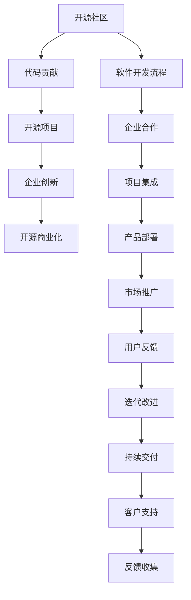

                 

# 从代码贡献到开源商业化

> 关键词：开源社区, 代码贡献, 商业化策略, 企业创新, 软件开发流程

## 1. 背景介绍

在当今的科技发展大潮中，开源社区已经成为推动技术进步的重要力量。无论是软件开发的各个阶段，还是技术创新的各个环节，开源技术都在发挥着不可替代的作用。但随着开源技术的日渐成熟，如何从代码贡献到开源商业化，成为了开源项目持续发展的关键。本文将深入探讨这一主题，帮助开发者和企业管理者更好地理解开源代码贡献与商业化的过程，从而促进技术创新与商业应用的双赢。

## 2. 核心概念与联系

### 2.1 核心概念概述

在探讨开源代码从贡献到商业化的过程中，我们需要理解几个核心概念：

- **开源社区（Open Source Community）**：指由开发者自愿贡献代码、资源和知识的社区。其核心目的是共享技术，推动技术进步。

- **代码贡献（Code Contribution）**：开发者将编写的代码、补丁、文档等贡献到开源项目中，以丰富项目内容和功能。

- **开源商业化（Open Source Commercialization）**：将开源技术、产品或服务商业化的过程，包括但不限于产品化、服务化、收费模式等。

- **企业创新（Corporate Innovation）**：企业通过创新获取竞争优势的过程，利用开源技术加速产品开发和市场响应。

- **软件开发流程（Software Development Process）**：从需求分析、设计、编码、测试、部署到运维的全流程管理方法。

这些概念构成了开源代码贡献与商业化过程的基本框架。通过理解这些核心概念，我们能够更好地把握开源技术从社区到企业的转化过程。

### 2.2 核心概念联系

通过以下Mermaid流程图，我们可以看到这些核心概念之间的联系：



这个流程图展示了开源社区、代码贡献、开源项目、企业创新、开源商业化以及软件开发流程之间的相互关系。通过这些联系，我们可以理解如何通过开源技术推动企业创新，实现商业化。

## 3. 核心算法原理 & 具体操作步骤

### 3.1 算法原理概述

开源代码的商业化过程，本质上是将社区驱动的技术成果转化为企业可用的产品或服务的过程。这一过程涉及到从需求分析、开发、测试、部署到运维的全流程管理。在这一过程中，算法原理主要体现在如何高效地将开源代码集成到企业产品中，并确保其稳定性和可靠性。

### 3.2 算法步骤详解

1. **需求分析与产品规划**：
   - **目标设定**：明确商业目标，确定产品愿景和用户需求。
   - **市场调研**：了解市场趋势，评估潜在用户和市场需求。

2. **开源代码选择与集成**：
   - **筛选开源项目**：根据项目质量、活跃度、社区反馈等因素选择适合的开源项目。
   - **代码集成**：将开源代码集成到企业现有系统中，确保兼容性。

3. **开发与测试**：
   - **敏捷开发**：采用敏捷开发方法，快速迭代产品功能。
   - **自动化测试**：利用持续集成和自动化测试工具，确保代码质量和稳定性。

4. **部署与运维**：
   - **云服务部署**：使用云计算平台进行快速部署。
   - **性能优化**：优化代码性能，确保系统高效运行。
   - **持续交付**：实现持续交付流程，快速响应市场变化。

5. **商业化策略制定**：
   - **定价模型**：根据产品特性和服务模式制定合理的定价策略。
   - **营销推广**：通过市场推广活动，提升产品知名度和用户认知。
   - **客户支持**：建立完善的客户支持体系，提高用户满意度。

### 3.3 算法优缺点

#### 优点：

1. **高效性**：开源社区提供的大量成熟代码，可以快速集成到企业产品中，加速开发进程。
2. **低成本**：开源技术的免费使用，减少了企业的技术开发成本。
3. **灵活性**：开源代码通常遵循开源协议，企业可以灵活使用、修改和扩展。

#### 缺点：

1. **质量控制**：开源代码的质量可能参差不齐，需要企业进行严格的质量控制。
2. **维护成本**：持续维护和更新开源代码，需要企业投入大量资源。
3. **安全风险**：开源代码可能存在安全漏洞，企业需加强安全防护。

### 3.4 算法应用领域

开源代码的商业化应用广泛，包括但不限于以下几个领域：

- **云服务**：如AWS、Azure、阿里云等，利用开源代码提供云基础设施和服务。
- **企业软件**：如ERP、CRM、OA等，利用开源技术开发定制化解决方案。
- **移动应用**：如Android、iOS等平台上的应用开发，利用开源库和框架。
- **大数据**：如Hadoop、Spark等，利用开源技术进行大数据分析和处理。
- **区块链**：如Hyperledger、Ethereum等，利用开源代码开发区块链应用。

## 4. 数学模型和公式 & 详细讲解 & 举例说明

### 4.1 数学模型构建

在开源代码的商业化过程中，涉及到多个环节，可以构建数学模型来量化这些环节的效率和成本。以下是一个简单的数学模型：

设 $T_0$ 为需求分析时间，$T_1$ 为开源代码集成时间，$T_2$ 为开发和测试时间，$T_3$ 为部署和运维时间，$T_4$ 为商业化策略制定和推广时间。则整个商业化过程的总时间 $T$ 可以表示为：

$$
T = T_0 + T_1 + T_2 + T_3 + T_4
$$

### 4.2 公式推导过程

在上述模型中，每个时间 $T_i$ 又可以进一步细分为多个子过程。例如，$T_1$ 可以细分为代码选择、集成测试、优化调整等子过程。我们可以使用以下公式来推导各个子过程的耗时：

$$
T_i = \sum_{k=1}^{n} t_{ik} \times m_{ik}
$$

其中，$t_{ik}$ 表示第 $i$ 个子过程第 $k$ 个步骤所需的时间，$m_{ik}$ 表示该步骤的复杂度或资源消耗。

### 4.3 案例分析与讲解

以云服务为例，其开源代码商业化过程可以进一步细化为以下步骤：

1. **开源项目选择**：需要评估多个开源项目，选择最适合的云计算框架和工具。
2. **集成与测试**：将开源代码集成到云平台中，并进行功能和性能测试。
3. **部署与优化**：在云端部署服务，并进行性能优化，确保稳定运行。
4. **定价与推广**：根据云服务特性，制定合理的定价策略，并进行市场推广。

这些步骤中，每个子过程的时间消耗和资源需求都需要精确计算，以确保商业化过程的高效性和成本效益。

## 5. 项目实践：代码实例和详细解释说明

### 5.1 开发环境搭建

在进行开源代码商业化项目实践前，需要搭建合适的开发环境。以下是Python开发环境搭建的具体步骤：

1. **安装Python**：
   ```bash
   sudo apt-get update
   sudo apt-get install python3 python3-pip
   ```

2. **安装虚拟环境**：
   ```bash
   pip install virtualenv
   ```

3. **创建虚拟环境**：
   ```bash
   virtualenv env
   source env/bin/activate
   ```

4. **安装必要的包**：
   ```bash
   pip install requests
   pip install beautifulsoup4
   ```

### 5.2 源代码详细实现

下面以使用Python爬虫抓取开源项目的代码示例，演示开源代码的集成过程：

```python
import requests
from bs4 import BeautifulSoup

def get_code_url(project_url):
    html = requests.get(project_url).text
    soup = BeautifulSoup(html, 'html.parser')
    code_url = soup.find('a', {'class': 'btn btn-default btn-sm js-repo-modal-button js-repo-modal-button-company'}).get('href')
    return code_url

def clone_code(code_url):
    git_url = 'https://github.com/' + code_url.split('github.com/')[1]
    git_clone = 'git clone ' + git_url
    os.system(git_clone)

# 示例：爬取GitHub上的Flask框架代码
flask_url = 'https://github.com/mitsuhiko/flask'
clone_code(flask_url)
```

### 5.3 代码解读与分析

上述代码示例中，我们首先使用requests库获取GitHub项目的HTML页面，然后使用BeautifulSoup库解析HTML，找到代码仓库的链接。接着使用git clone命令将代码仓库克隆到本地。

这个示例展示了如何从开源社区获取代码并将其集成到本地环境。在实际应用中，企业需要根据不同的开源项目和应用场景，编写更为复杂的集成代码。

### 5.4 运行结果展示

运行上述示例代码，会将Flask框架的代码仓库克隆到本地。企业可以在本地对代码进行修改、测试和部署。

## 6. 实际应用场景

开源代码的商业化应用场景广泛，以下是几个典型案例：

### 6.1 云服务

云服务提供商如AWS、Azure等，大量使用开源技术构建基础设施，并提供云服务。例如，AWS的Elastic Kubernetes Service (EKS)就是基于开源Kubernetes技术构建的云原生应用平台。

### 6.2 企业软件

许多企业软件公司利用开源技术开发定制化解决方案，如Red Hat、SUSE等。这些公司通过整合开源代码和商业服务，提供全面的企业级解决方案。

### 6.3 移动应用

移动应用开发广泛使用开源库和框架，如React Native、Flutter等。企业可以基于这些开源库，快速开发跨平台移动应用。

### 6.4 大数据

大数据技术如Hadoop、Spark等，都是基于开源代码开发。企业通过使用这些技术，进行大数据分析和处理。

## 7. 工具和资源推荐

### 7.1 学习资源推荐

为了帮助开发者和企业管理者更好地理解开源代码的商业化过程，以下是一些推荐的学习资源：

1. **《开源社区建设与管理》**：讲解开源社区的基本原理和运作机制，适合初学者入门。
2. **《开源商业化实践》**：介绍开源技术如何转化为商业产品，适合已有一定经验的管理者。
3. **《企业级软件开发》**：详细讲解企业级软件开发的各个环节，包括开源技术的集成和管理。
4. **《开源技术最佳实践》**：汇总开源技术的最佳实践和经验，适合开发者和团队经理。
5. **《开源社区生态》**：分析开源社区的生态系统，了解社区动态和机会。

### 7.2 开发工具推荐

以下是一些用于开源代码商业化开发的工具：

1. **JIRA**：项目管理工具，帮助团队协调和跟踪开源项目开发。
2. **GitHub/GitLab**：版本控制和协作平台，支持开源代码的集成和版本管理。
3. **Docker**：容器化技术，帮助企业快速部署和运维开源项目。
4. **Kubernetes**：容器编排工具，支持大规模开源应用的自动化运维。
5. **Ansible**：自动化运维工具，支持批量配置和管理开源应用。

### 7.3 相关论文推荐

开源代码商业化的研究涉及多个领域，以下是几篇相关论文，推荐阅读：

1. **《从开源到商业化：一项实验研究》**：研究开源项目如何转化为商业产品，提供了实验和案例分析。
2. **《开源技术的商业化模式》**：探讨不同开源技术的商业化模式和策略。
3. **《开源社区与商业化的互动关系》**：分析开源社区和商业化之间的互动关系，提供理论支持。
4. **《开源技术的商业化过程优化》**：研究开源技术的商业化过程，提出优化策略和案例。
5. **《开源技术的商业化案例研究》**：分析多个开源技术的商业化案例，提供实际应用经验。

## 8. 总结：未来发展趋势与挑战

### 8.1 研究成果总结

本文深入探讨了开源代码从贡献到商业化的过程，帮助开发者和企业管理者理解这一复杂过程。通过理解开源社区、代码贡献、商业化策略等核心概念，我们能够更好地把握开源技术商业化的本质和路径。

### 8.2 未来发展趋势

开源代码商业化未来将呈现以下发展趋势：

1. **开源社区日益成熟**：开源社区将更加成熟和规范，提供更高质量的开源代码和工具。
2. **企业创新加速**：企业通过开源技术加速创新，提高市场响应速度和竞争力。
3. **商业化模式多样化**：企业将探索更多商业化模式，如订阅制、开源商业混合模式等。
4. **开源工具普及**：开源工具将在企业中普及，帮助企业实现高效的软件开发和运维。
5. **开源生态系统完善**：开源生态系统将更加完善，形成更强的产业协同效应。

### 8.3 面临的挑战

开源代码商业化虽然充满机遇，但也面临以下挑战：

1. **质量控制**：开源代码的质量参差不齐，需要企业进行严格的质量控制。
2. **资源投入**：持续维护和更新开源代码，需要企业投入大量资源。
3. **安全风险**：开源代码可能存在安全漏洞，企业需加强安全防护。
4. **用户接受度**：用户对开源技术的接受度不高，企业需进行有效的市场推广。

### 8.4 研究展望

未来研究应在以下几个方面寻求新的突破：

1. **自动化工具开发**：开发更多开源工具和框架，支持企业高效使用开源技术。
2. **质量控制机制**：建立更严格的质量控制机制，确保开源代码的质量和可靠性。
3. **商业化策略创新**：探索更多商业化策略，如开源商业混合模式、按需付费等。
4. **开源社区建设**：加强开源社区建设，提升社区的活跃度和贡献度。
5. **安全防护技术**：研究更强的安全防护技术，保障开源项目的安全性。

## 9. 附录：常见问题与解答

**Q1：如何选择合适的开源项目进行商业化？**

A: 选择开源项目时，应考虑以下因素：
1. 项目成熟度和活跃度：选择活跃度高、社区支持好的项目。
2. 功能和性能：评估项目的功能和性能，确保其满足商业需求。
3. 社区反馈和文档：查看社区反馈和文档，确保项目维护和支持情况良好。

**Q2：开源代码集成后，如何进行有效的质量控制？**

A: 开源代码集成后，可以采取以下措施进行质量控制：
1. 代码审查：通过代码审查，确保代码质量和安全性。
2. 自动化测试：使用自动化测试工具，覆盖主要功能和性能指标。
3. 代码审计：定期进行代码审计，发现和修复潜在问题。
4. 用户反馈：收集用户反馈，及时调整和改进代码。

**Q3：如何降低开源商业化的成本？**

A: 降低开源商业化的成本，可以采取以下措施：
1. 使用开源社区提供的工具和资源，减少开发成本。
2. 采用敏捷开发方法，快速迭代产品功能。
3. 利用云计算平台进行快速部署和运维。
4. 优化代码性能，减少资源消耗。

**Q4：如何保证开源商业化的安全性和合规性？**

A: 保证开源商业化的安全性和合规性，可以采取以下措施：
1. 使用安全扫描工具，定期检测和修复安全漏洞。
2. 遵循开源协议，确保使用开源代码的合法性。
3. 建立合规管理体系，确保商业化过程符合法律法规。

**Q5：开源商业化过程中，如何处理用户反馈？**

A: 处理用户反馈，可以采取以下措施：
1. 建立用户反馈渠道，及时收集用户意见和建议。
2. 分析用户反馈，识别常见问题和改进点。
3. 根据反馈优化产品功能，提高用户体验。
4. 定期发布更新，告知用户最新的改进和优化。

通过以上分析和建议，希望能帮助开发者和企业管理者更好地理解开源代码从贡献到商业化的过程，从而实现技术创新与商业应用的双赢。

---

作者：禅与计算机程序设计艺术 / Zen and the Art of Computer Programming

