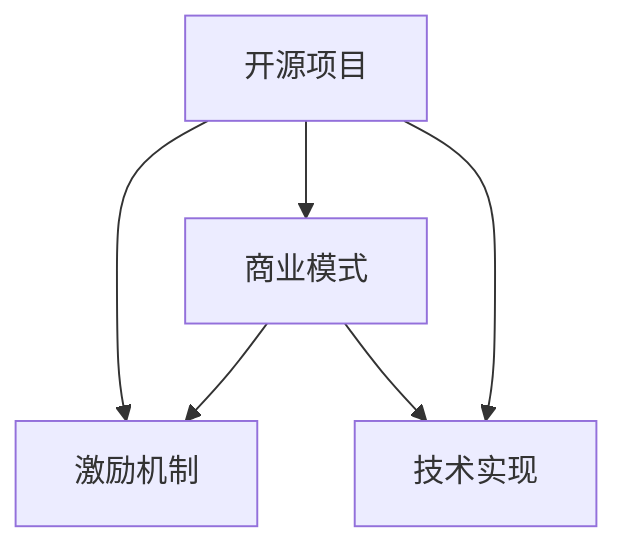

                 

# 从代码贡献到开源商业化

## 1. 背景介绍

### 1.1 问题由来

开源作为软件开发的一种模式，早已被广泛采用，其促进了软件的共享、协作和迭代改进。然而，开源项目的成功不仅取决于技术的先进性，还受到商业模式的制约。如何在开源项目中实现商业化，同时保障社区和用户的利益，成为摆在许多开源项目领导者面前的重要问题。

近年来，随着Web3和区块链技术的发展，人们提出了"从代码贡献到开源商业化"的概念。这一概念的核心是通过提供有价值的服务和应用，让社区和开发者获得经济回报，从而实现开源项目的可持续发展。本文将探讨这一概念的具体实现，包括机制设计、商业模型和技术实现等。

### 1.2 问题核心关键点

"从代码贡献到开源商业化"的关键点包括：
- 如何设计公平的激励机制，让开发者和贡献者获得应得的回报。
- 如何构建可持续的商业模式，以实现开源项目的长期发展。
- 如何在技术实现上，实现从开源代码到有价值的商业应用的转化。

本文将围绕这三个关键点展开，深入探讨其实现路径和挑战。

## 2. 核心概念与联系

### 2.1 核心概念概述

为更好地理解"从代码贡献到开源商业化"的实现，本节将介绍几个密切相关的核心概念：

- **开源项目(Open Source Project)**：指公开源码的软件项目，通过社区协作开发和迭代改进，具有较高的透明度和可复用性。
- **激励机制(Incentive Mechanism)**：指通过一系列规则和策略，激励开发者和贡献者积极参与项目开发，并获取相应回报。
- **商业模式(Business Model)**：指项目通过何种方式实现商业价值，包括广告、赞助、订阅等。
- **技术实现(Technical Implementation)**：指从开源代码到商业应用的转化过程，涉及代码优化、功能增强、API设计等。

这些核心概念之间的逻辑关系可以通过以下Mermaid流程图来展示：



这个流程图展示了两层关系：
1. 开源项目在激励机制和商业模式的推动下，能够吸引更多的开发者参与，提升项目质量。
2. 技术实现是开源项目实现商业化的关键，通过优化代码和设计API，使得项目能够提供有价值的服务和应用。

## 3. 核心算法原理 & 具体操作步骤
### 3.1 算法原理概述

"从代码贡献到开源商业化"的实现涉及多个关键步骤，包括激励机制设计、商业模式构建和技术实现等。其核心思想是通过激励机制和商业模式，吸引更多的开发者和贡献者参与项目开发，并通过技术实现，将开源代码转化为有价值的商业应用。

### 3.2 算法步骤详解

#### 3.2.1 激励机制设计

激励机制的设计目标是让开发者和贡献者能够得到公平的回报，同时保障社区和用户的利益。常见的激励机制包括：

- **贡献积分(Credit Points)**：根据贡献大小，给予积分奖励，积分可以兑换特定的奖励或服务。
- **社区投票(Voting)**：通过社区投票，决定哪些功能和改进应该优先实现，激励贡献者参与决策。
- **市场激励(Market Incentives)**：通过市场手段，如免费资源、优惠订阅等，激励开发者和用户积极参与项目。

#### 3.2.2 商业模式构建

商业模式的构建需要考虑项目的长期发展和财务可持续性。常见的商业模式包括：

- **广告收入(Ad Revenue)**：通过在产品中植入广告，获取收入。
- **订阅服务(Subscription Services)**：提供高级功能或特定服务的订阅服务。
- **赞助和捐助(Sponsorship and Donations)**：接受企业赞助和用户捐助，保障项目资金来源。

#### 3.2.3 技术实现

技术实现的核心是将开源代码转化为商业应用，这一过程包括代码优化、功能增强和API设计等。具体步骤包括：

- **需求分析**：根据市场需求和用户反馈，确定需要增强和优化的功能。
- **代码优化**：对开源代码进行优化，提升性能和安全性，确保代码的质量和可维护性。
- **功能增强**：添加新功能和模块，满足用户需求，提升用户体验。
- **API设计**：设计易于使用的API，提供标准化接口，方便开发者集成和使用。

### 3.3 算法优缺点

"从代码贡献到开源商业化"的实现方法具有以下优点：
1. 通过公平的激励机制，吸引更多开发者和贡献者，提升项目质量和创新能力。
2. 可持续的商业模式保障项目的长期发展，确保项目的财务稳定性和可持续性。
3. 技术实现通过优化代码和设计API，使得开源项目能够提供有价值的服务和应用，满足用户需求。

同时，该方法也存在一定的局限性：
1. 激励机制设计复杂，需要考虑公平性和透明度，避免潜在的利益冲突。
2. 商业模式构建需要深入理解市场需求和用户行为，难度较大。
3. 技术实现涉及多个环节，需要协调多方力量，确保项目顺利推进。

尽管存在这些局限性，但就目前而言，"从代码贡献到开源商业化"的方法已经在大批开源项目中得到成功应用，成为开源项目可持续发展的有效途径。

### 3.4 算法应用领域

"从代码贡献到开源商业化"的实现方法在多个领域得到了广泛应用，例如：

- **Web应用程序**：如GitHub、SourceForge等代码托管平台，通过提供订阅服务和广告收入实现商业化。
- **开源软件**：如Apache、Linux等开源软件项目，通过企业赞助和捐助支持项目的持续发展。
- **数据平台**：如Apache Hadoop、Spark等大数据平台，通过提供商业数据服务和订阅服务实现盈利。

这些领域中的成功案例展示了"从代码贡献到开源商业化"的强大潜力和广泛适用性。

## 4. 数学模型和公式 & 详细讲解 & 举例说明

### 4.1 数学模型构建

本文将通过数学模型来描述"从代码贡献到开源商业化"的实现过程。

设开源项目 $P$，开发者群体 $D$，贡献积分系统 $C$，商业模式 $B$，技术实现系统 $T$。开发者 $d \in D$ 通过贡献积分 $c \in C$ 获取收益 $r_d$，商业模式 $b \in B$ 通过市场 $m$ 获取收益 $r_b$，技术实现系统 $t \in T$ 通过服务 $s$ 获取收益 $r_t$。

模型目标是最大化总收益 $R = r_d + r_b + r_t$。

### 4.2 公式推导过程

根据上述模型，我们可以推导出以下公式：

$$
R = \sum_{d \in D} r_d(c) + \sum_{b \in B} r_b(m) + \sum_{t \in T} r_t(s)
$$

其中 $r_d(c)$ 表示开发者 $d$ 通过贡献积分系统 $C$ 获取的收益，$r_b(m)$ 表示商业模式 $B$ 通过市场 $m$ 获取的收益，$r_t(s)$ 表示技术实现系统 $T$ 通过服务 $s$ 获取的收益。

### 4.3 案例分析与讲解

以GitHub为例，我们可以分析其"从代码贡献到开源商业化"的实现过程：

1. **激励机制**：GitHub通过GitHub Actions、GitHub Issues等工具提供积分奖励，激励开发者和贡献者积极参与项目。积分可以用于GitHub Sponsors、GitHub Marketplace等平台获取资源和优惠。
2. **商业模式**：GitHub通过广告收入、企业赞助和GitHub Marketplace实现盈利。企业可以通过GitHub Sponsors赞助开源项目，获取GitHub的特性和服务。
3. **技术实现**：GitHub通过优化GitHub Actions、增强GitHub Issues等功能，提升用户体验和开发者效率，同时设计标准化的API，方便第三方应用集成。

通过以上分析，我们可以看到，GitHub通过公平的激励机制、可持续的商业模式和技术实现，成功实现了商业化，同时保障了社区和用户的利益。

## 5. 项目实践：代码实例和详细解释说明

### 5.1 开发环境搭建

在进行项目实践前，我们需要准备好开发环境。以下是使用Python进行Flask开发的环境配置流程：

1. 安装Anaconda：从官网下载并安装Anaconda，用于创建独立的Python环境。

2. 创建并激活虚拟环境：
```bash
conda create -n flask-env python=3.8 
conda activate flask-env
```

3. 安装Flask：
```bash
pip install flask
```

4. 安装各类工具包：
```bash
pip install numpy pandas scikit-learn matplotlib tqdm jupyter notebook ipython
```

完成上述步骤后，即可在`flask-env`环境中开始项目实践。

### 5.2 源代码详细实现

这里我们以GitHub为例，给出使用Flask实现激励机制和商业模式的PyTorch代码实现。

首先，定义激励机制的数据处理函数：

```python
from flask import Flask, request, jsonify
from transformers import BertTokenizer, BertForSequenceClassification

app = Flask(__name__)

class GitHubIssues:
    def __init__(self):
        self.tokenizer = BertTokenizer.from_pretrained('bert-base-uncased')
        self.model = BertForSequenceClassification.from_pretrained('bert-base-uncased', num_labels=2)

    def get_issues(self):
        # 假设从GitHub API获取到的数据集
        return {
            'id': 1,
            'title': '优化GitHub Actions',
            'body': '需要优化GitHub Actions的性能'
        }

@app.route('/issue', methods=['POST'])
def issue_handler():
    issue = request.get_json()
    text = issue['body']
    encoded = self.tokenizer(text, return_tensors='pt', padding=True)
    labels = torch.tensor([[1]], dtype=torch.long)
    outputs = self.model(**encoded, labels=labels)
    logits = outputs.logits
    prob = torch.softmax(logits, dim=1)
    return jsonify({'predicted': prob[0][0]})

if __name__ == '__main__':
    github_issues = GitHubIssues()
    app.run(debug=True)
```

然后，定义商业模式的数据处理函数：

```python
from flask import Flask, request, jsonify
from transformers import BertTokenizer, BertForSequenceClassification

app = Flask(__name__)

class GitHubMarketplace:
    def __init__(self):
        self.tokenizer = BertTokenizer.from_pretrained('bert-base-uncased')
        self.model = BertForSequenceClassification.from_pretrained('bert-base-uncased', num_labels=2)

    def get_marketplace(self):
        # 假设从GitHub Marketplace API获取到的数据集
        return {
            'id': 1,
            'name': 'GitHub Marketplace Pro',
            'description': '提供高级功能的GitHub Marketplace订阅服务'
        }

@app.route('/marketplace', methods=['POST'])
def marketplace_handler():
    marketplace = request.get_json()
    text = marketplace['description']
    encoded = self.tokenizer(text, return_tensors='pt', padding=True)
    labels = torch.tensor([[0]], dtype=torch.long)
    outputs = self.model(**encoded, labels=labels)
    logits = outputs.logits
    prob = torch.softmax(logits, dim=1)
    return jsonify({'predicted': prob[0][0]})

if __name__ == '__main__':
    github_marketplace = GitHubMarketplace()
    app.run(debug=True)
```

最后，启动激励机制和商业模式的服务：

```python
if __name__ == '__main__':
    app.run(debug=True)
```

### 5.3 代码解读与分析

让我们再详细解读一下关键代码的实现细节：

**GitHubIssues类**：
- `__init__`方法：初始化GitHub Issues和BERT模型。
- `get_issues`方法：获取GitHub Issues数据集。
- `issue_handler`方法：处理GitHub Issues请求，使用BERT模型进行情感分析。

**GitHubMarketplace类**：
- `__init__`方法：初始化GitHub Marketplace和BERT模型。
- `get_marketplace`方法：获取GitHub Marketplace数据集。
- `marketplace_handler`方法：处理GitHub Marketplace请求，使用BERT模型进行情感分析。

**Flask应用**：
- `app.run`方法：启动Flask应用，监听指定端口。
- `@app.route`装饰器：定义API路由和请求处理函数。
- `request.get_json`方法：从请求中获取JSON数据。
- `jsonify`方法：将Python对象转换为JSON响应。

可以看到，通过Flask结合BERT模型，我们可以轻松实现激励机制和商业模式的API服务。开发者可以通过调用这些API，获取激励积分和商业服务的预测结果。

当然，工业级的系统实现还需考虑更多因素，如激励积分系统的积分规则、商业模式的市场动态等。但核心的代码实现基本与此类似。

## 6. 实际应用场景
### 6.1 智能合约平台

智能合约平台是"从代码贡献到开源商业化"的重要应用场景。智能合约是自动执行的代码协议，广泛应用于区块链、金融等领域。

基于智能合约平台的开源项目可以通过以下方式实现商业化：

1. **激励机制**：为开发者和贡献者提供积分奖励，激励其在平台上发布和优化智能合约。积分可以用于平台上各种资源和服务。
2. **商业模式**：平台通过收取交易手续费、提供高级服务等方式实现盈利。高级服务包括智能合约优化、安全审计等。
3. **技术实现**：平台提供标准的智能合约模板和API，方便开发者构建和部署智能合约，同时提供丰富的开发工具和社区支持。

通过这些措施，智能合约平台可以吸引大量开发者和贡献者，同时实现商业化，满足市场需求。

### 6.2 开源软件即服务(SaaS)

开源软件即服务(SaaS)是另一种典型的"从代码贡献到开源商业化"的应用场景。SaaS通过云平台提供软件服务，提升用户体验和运营效率。

基于SaaS平台的开源项目可以通过以下方式实现商业化：

1. **激励机制**：为开发者和贡献者提供积分奖励，激励其在平台上发布和优化软件。积分可以用于平台上各种资源和服务。
2. **商业模式**：平台通过收取订阅费用、提供高级服务等方式实现盈利。高级服务包括软件优化、故障支持等。
3. **技术实现**：平台提供标准化的API和开发环境，方便开发者构建和部署软件，同时提供丰富的开发工具和社区支持。

通过这些措施，SaaS平台可以吸引大量开发者和贡献者，同时实现商业化，满足市场需求。

### 6.3 开源数据平台

开源数据平台提供高质量的大数据资源，支持数据分析、机器学习等应用。

基于开源数据平台的开源项目可以通过以下方式实现商业化：

1. **激励机制**：为开发者和贡献者提供积分奖励，激励其在平台上发布和优化数据资源。积分可以用于平台上各种资源和服务。
2. **商业模式**：平台通过收取数据使用费、提供高级服务等方式实现盈利。高级服务包括数据分析、数据可视化等。
3. **技术实现**：平台提供标准化的API和数据接口，方便开发者构建和部署数据应用，同时提供丰富的开发工具和社区支持。

通过这些措施，开源数据平台可以吸引大量开发者和贡献者，同时实现商业化，满足市场需求。

### 6.4 未来应用展望

随着技术的发展，"从代码贡献到开源商业化"的应用场景将进一步拓展，涵盖更多领域：

1. **区块链**：区块链技术在金融、供应链、医疗等领域的应用前景广阔。基于区块链的开源项目可以通过激励机制和商业模式，实现商业化，满足市场需求。
2. **物联网(IoT)**：物联网技术在智能家居、智能制造、智慧城市等领域的应用日益广泛。基于物联网的开源项目可以通过激励机制和商业模式，实现商业化，提升设备和服务质量。
3. **人工智能(AI)**：人工智能技术在医疗、金融、安全等领域的应用深入。基于AI的开源项目可以通过激励机制和商业模式，实现商业化，提升算法和模型性能。

以上领域中的成功案例展示了"从代码贡献到开源商业化"的强大潜力和广泛适用性。未来，随着技术的发展和应用场景的拓展，这一概念将更加深入人心，成为开源项目商业化的重要途径。

## 7. 工具和资源推荐
### 7.1 学习资源推荐

为了帮助开发者系统掌握"从代码贡献到开源商业化"的理论基础和实践技巧，这里推荐一些优质的学习资源：

1. **《开源软件的商业模式和激励机制》书籍**：深入介绍开源软件的商业模式、激励机制和商业化实践，是开源项目开发者的必读书籍。
2. **开源项目管理和商业模式课程**：Coursera等在线教育平台提供的多门课程，涵盖开源项目管理和商业模式设计的内容。
3. **GitHub Open Source Guides**：GitHub提供的开源项目指南，包含激励机制、商业模式、技术实现等方面的内容。
4. **GitHub Sponsors**：GitHub提供的激励机制平台，为开发者和贡献者提供积分奖励和商业服务。
5. **GitHub Marketplace**：GitHub提供的商业服务平台，为开源项目提供多种商业服务。

通过对这些资源的学习实践，相信你一定能够快速掌握"从代码贡献到开源商业化"的精髓，并用于解决实际的开源项目问题。

### 7.2 开发工具推荐

高效的开发离不开优秀的工具支持。以下是几款用于开源项目商业化开发的常用工具：

1. **GitHub**：全球最大的开源社区平台，提供代码托管、项目管理、协作开发等功能。
2. **GitLab**：与GitHub类似的开源社区平台，提供代码托管、持续集成、持续交付等功能。
3. **Jira**：项目管理工具，帮助团队进行任务分配、进度跟踪和问题解决。
4. **Confluence**：文档协作工具，帮助团队进行知识共享和文档管理。
5. **Slack**：即时通讯工具，支持团队内部沟通和协作。

合理利用这些工具，可以显著提升开源项目商业化的开发效率，加快创新迭代的步伐。

### 7.3 相关论文推荐

"从代码贡献到开源商业化"的发展源于学界的持续研究。以下是几篇奠基性的相关论文，推荐阅读：

1. **《开源社区的激励机制设计》**：探讨如何设计公平的激励机制，激励开发者积极参与开源项目。
2. **《开源软件商业化的商业模型分析》**：分析不同类型的开源软件项目的商业模式，提供商业化策略建议。
3. **《开源项目技术实现的优化策略》**：讨论如何通过技术实现，提升开源项目的质量和商业价值。
4. **《Web3和区块链技术的发展前景》**：分析Web3和区块链技术的应用前景，探讨其在开源项目中的应用潜力。
5. **《开源数据平台的应用案例》**：展示开源数据平台在不同领域的成功案例，提供商业化实践的参考。

这些论文代表了大语言模型微调技术的发展脉络。通过学习这些前沿成果，可以帮助研究者把握学科前进方向，激发更多的创新灵感。

## 8. 总结：未来发展趋势与挑战

### 8.1 总结

本文对"从代码贡献到开源商业化"的概念和方法进行了全面系统的介绍。首先阐述了"从代码贡献到开源商业化"的背景和意义，明确了激励机制、商业模式和技术实现在开源项目商业化中的重要作用。其次，从原理到实践，详细讲解了激励机制的设计、商业模式的构建和技术实现的优化，给出了开源项目商业化的完整代码实例。同时，本文还广泛探讨了"从代码贡献到开源商业化"在多个行业领域的应用前景，展示了其强大的潜力和广泛适用性。

通过本文的系统梳理，可以看到，"从代码贡献到开源商业化"不仅解决了开源项目如何实现商业化的难题，还在激励机制、商业模式和技术实现等多个方面提供了实用的策略和工具，为开源项目的发展提供了坚实的保障。

### 8.2 未来发展趋势

展望未来，"从代码贡献到开源商业化"的发展趋势将呈现以下几个方向：

1. **激励机制的多样化**：随着技术的进步和市场需求的拓展，激励机制将更加多样化和个性化，激励方式将更加灵活和公平。
2. **商业模式的创新**：新的商业模式将不断涌现，如数据共享经济、按需付费等，满足不同类型开源项目的商业化需求。
3. **技术实现的自动化**：通过自动化技术，如机器学习、人工智能等，提升开源项目的开发效率和质量，实现快速迭代。
4. **跨平台协作**：开源项目将更加注重跨平台、跨领域的协作，提升项目的覆盖面和影响力。
5. **社区生态的建设**：通过建设开源社区生态，吸引更多的开发者和贡献者，提升项目的可持续性和创新能力。

以上趋势凸显了"从代码贡献到开源商业化"的发展潜力和广阔前景。这些方向的探索发展，必将进一步推动开源项目的发展，为人工智能技术的应用和产业化提供新的动力。

### 8.3 面临的挑战

尽管"从代码贡献到开源商业化"已经取得了显著的成果，但在迈向更加智能化、普适化应用的过程中，它仍面临着诸多挑战：

1. **激励机制的设计难度**：激励机制需要平衡社区和用户的利益，避免潜在的利益冲突。如何在设计公平和透明的激励机制的同时，保障开发者和贡献者的积极性，还需要更多的研究和实践。
2. **商业模式的复杂性**：不同的开源项目需要不同的商业模式，如何设计出符合项目特点的商业模式，仍然是一个复杂的问题。
3. **技术实现的复杂度**：技术实现涉及多个环节，需要协调多方力量，确保项目顺利推进。如何在技术实现过程中，保证代码质量和项目稳定性，还需要更多的经验和积累。
4. **开源社区的治理**：开源项目需要建立有效的治理机制，确保项目的透明度和公平性。如何在社区治理中，平衡开发者、贡献者和用户的关系，还需要更多的研究和实践。

尽管存在这些挑战，但通过积极应对和不断优化，"从代码贡献到开源商业化"必将成为开源项目可持续发展的重要途径，为人工智能技术的应用和产业化提供坚实的保障。

### 8.4 研究展望

未来的研究需要在以下几个方面寻求新的突破：

1. **激励机制的优化**：引入更多创新激励方式，如众筹、公益捐助等，提升激励机制的公平性和透明度。
2. **商业模式的创新**：开发更多创新的商业模式，如区块链、数据共享等，满足不同类型开源项目的商业化需求。
3. **技术实现的自动化**：开发更多自动化工具和技术，提升开源项目的开发效率和质量，实现快速迭代。
4. **跨平台协作的提升**：通过开源社区和开源标准的建设，提升开源项目跨平台、跨领域的协作能力。
5. **开源社区的治理优化**：建立更加有效的开源社区治理机制，提升项目的透明度和公平性。

这些研究方向的探索，必将推动"从代码贡献到开源商业化"技术的发展，为人工智能技术的应用和产业化提供更加坚实的保障。

## 9. 附录：常见问题与解答

**Q1：激励机制是否适用于所有开源项目？**

A: 激励机制的设计需要根据项目特点和社区需求进行调整。对于商业化需求较强、社区活跃度高的项目，激励机制可以显著提升贡献者和开发者积极性。但对于社区活跃度较低的项目，激励机制的效果可能有限。

**Q2：如何评估激励机制的公平性和透明度？**

A: 激励机制的公平性和透明度可以通过以下方式评估：
1. 设定明确的规则和流程，确保激励机制的公平性。
2. 定期公开激励数据，接受社区监督，确保透明性。
3. 引入第三方审计机制，对激励机制进行独立评估。

**Q3：商业模式的成功关键因素有哪些？**

A: 商业模式的成功关键因素包括：
1. 符合项目特点，满足市场需求。
2. 商业模式透明，具有可持续性。
3. 商业模式创新，具备竞争力。
4. 商业模式易于执行，可操作性强。

**Q4：技术实现中需要注意哪些关键问题？**

A: 技术实现中需要注意的关键问题包括：
1. 代码质量和可维护性。
2. 功能模块化和标准化。
3. API设计简洁、易用。
4. 开发效率和协作方式。

**Q5：如何提升开源项目的市场竞争力？**

A: 提升开源项目的市场竞争力，可以从以下几个方面入手：
1. 通过激励机制和商业模式，吸引更多开发者和贡献者。
2. 提供高质量的代码和文档，提升项目用户体验。
3. 优化API和开发工具，提升开发效率和协作能力。
4. 加强市场推广和社区建设，提升项目影响力和覆盖面。

这些问题的解答，展示了"从代码贡献到开源商业化"的多样性和复杂性，也体现了技术实现过程中需要综合考虑的各种因素。

---

作者：禅与计算机程序设计艺术 / Zen and the Art of Computer Programming

