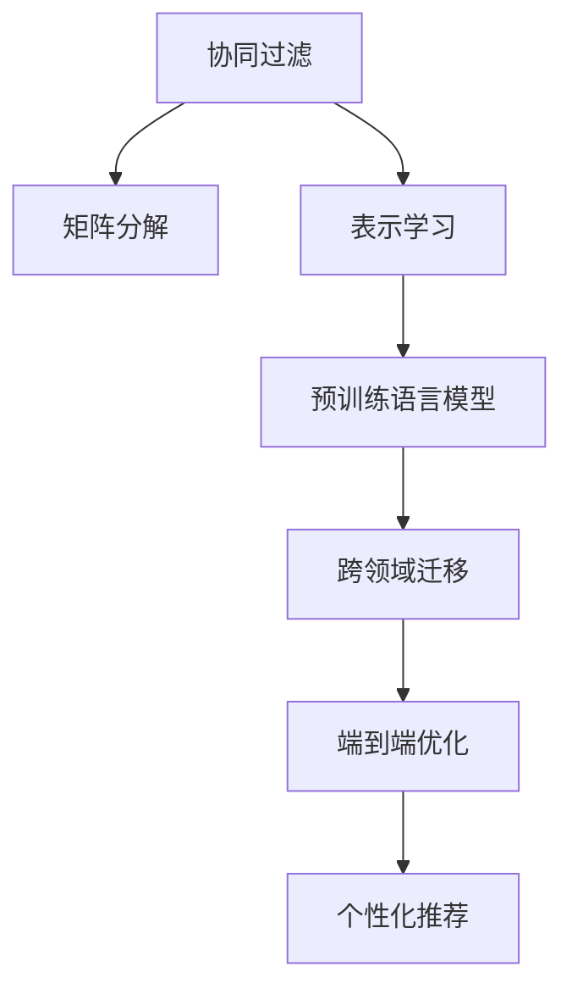

                 

# 从传统推荐系统到AI大模型：技术演进之路

## 1. 背景介绍

### 1.1 问题由来

随着互联网技术的快速发展，推荐系统成为各大互联网平台提升用户体验、增加收入的重要手段。传统推荐系统主要基于协同过滤、矩阵分解等方法，通过用户行为数据和物品属性数据，为用户推荐其可能感兴趣的物品。这些方法具有简单易部署、效果显著等优点，但同时也存在数据稀疏性、推荐鲁棒性不足等局限。

近年来，随着深度学习和大数据技术的发展，AI大模型在推荐系统中逐步崭露头角。AI大模型，如BERT、GPT、XLNet等，通过在大规模无标签文本数据上预训练，能够学习到丰富的语言表示，并将其应用于推荐系统中，显著提升了推荐的精度和多样性。

### 1.2 问题核心关键点

AI大模型在推荐系统中的应用，主要体现在以下几个方面：

- **预训练语言表示**：大模型通过自监督任务（如语言模型、掩码语言模型）在大规模语料上预训练，获得通用的语言表示，用于提取用户描述、物品描述等信息。
- **表示学习**：大模型对用户和物品的语义表示进行学习，消除稀疏性的影响，提升推荐的鲁棒性。
- **跨领域迁移**：大模型可广泛应用于多个领域，如电商、社交、娱乐等，通过领域特定微调，提升推荐效果。
- **端到端优化**：大模型通过联合训练方式，学习用户-物品关联和物品特征，实现端到端的推荐。
- **个性化推荐**：大模型利用上下文信息，生成个性化推荐结果，提升用户体验。

这些技术突破，使得AI大模型在推荐系统中成为新的应用范式，为推荐系统带来了新的生命力。

### 1.3 问题研究意义

AI大模型在推荐系统中的应用，具有重要的研究意义：

1. **提升推荐效果**：通过学习丰富的语言表示，大模型能够更好地捕捉用户和物品的语义特征，提供更加个性化、准确的推荐。
2. **降低成本**：大模型可共享通用的语言表示，无需为每个领域单独训练推荐模型，降低资源投入。
3. **扩展应用场景**：大模型可应用于多领域推荐，提升推荐系统的普及性和实用性。
4. **驱动技术创新**：大模型驱动推荐系统从传统的规则导向向数据驱动转变，催生新的推荐技术。
5. **加速应用落地**：大模型显著提升了推荐系统的性能，加速其在各行各业的应用。

## 2. 核心概念与联系

### 2.1 核心概念概述

为更好地理解AI大模型在推荐系统中的应用，本节将介绍几个密切相关的核心概念：

- **推荐系统(Recommendation System)**：通过分析用户的历史行为、物品属性等信息，为用户推荐其可能感兴趣的新物品的系统。
- **协同过滤(Collaborative Filtering)**：利用用户-物品评分数据，预测用户未评分物品的评分，为用户推荐。
- **矩阵分解(Matrix Factorization)**：将用户-物品评分矩阵分解为用户向量和物品向量，进行推荐。
- **表示学习(Representation Learning)**：通过学习用户和物品的低维向量表示，提升推荐效果。
- **预训练语言模型(Pre-trained Language Model)**：在大规模无标签文本数据上预训练的通用语言表示模型，如BERT、GPT等。
- **跨领域迁移(Cross-Domain Transfer)**：将预训练模型在多个领域中进行迁移学习，提升推荐效果。
- **端到端优化(End-to-End Optimization)**：通过联合训练用户-物品关联和物品特征，提升推荐精度。
- **个性化推荐(Personalized Recommendation)**：根据用户上下文信息，生成个性化推荐结果。

这些概念之间的逻辑关系可以通过以下Mermaid流程图来展示：



这个流程图展示了大模型在推荐系统中的核心概念及其之间的关系：

1. 推荐系统以用户行为数据和物品属性数据为基础。
2. 协同过滤和矩阵分解方法在传统推荐系统中被广泛应用。
3. 表示学习通过学习用户和物品的向量表示，提升推荐效果。
4. 预训练语言模型在表示学习中起关键作用，提供了丰富的语言表示。
5. 跨领域迁移通过在大模型上进行微调，使模型能够适应不同领域的推荐任务。
6. 端到端优化通过联合训练，提升了推荐模型的整体性能。
7. 个性化推荐利用上下文信息，生成更加个性化和多样化的推荐结果。

这些概念共同构成了AI大模型在推荐系统中的应用框架，使其能够在推荐场景中发挥强大的性能。

## 3. 核心算法原理 & 具体操作步骤
### 3.1 算法原理概述

AI大模型在推荐系统中的应用，本质上是基于表示学习的应用范式。其核心思想是：利用大模型学习用户和物品的低维向量表示，消除稀疏性影响，提升推荐鲁棒性。具体而言，AI大模型在推荐系统中的应用分为以下几个步骤：

1. **数据准备**：收集用户行为数据和物品属性数据，准备训练集、验证集和测试集。
2. **预训练大模型**：使用预训练语言模型，如BERT、GPT等，在无标签文本数据上预训练，学习通用的语言表示。
3. **领域特定微调**：在预训练大模型的基础上，针对特定推荐任务进行微调，学习领域特定的向量表示。
4. **联合训练**：将用户-物品评分数据与微调后的模型进行联合训练，学习用户-物品关联和物品特征。
5. **个性化推荐**：根据用户上下文信息，生成个性化推荐结果。

### 3.2 算法步骤详解

以下是AI大模型在推荐系统中的具体操作步骤：

**Step 1: 数据准备**
- 收集用户行为数据，如浏览、点击、评分等，以及物品属性数据。
- 划分数据集为训练集、验证集和测试集，用于模型训练和评估。

**Step 2: 预训练大模型**
- 使用预训练语言模型，如BERT、GPT等，在无标签文本数据上预训练，学习通用的语言表示。
- 将用户描述和物品描述输入预训练大模型，获得其低维向量表示。

**Step 3: 领域特定微调**
- 在预训练大模型的基础上，针对特定推荐任务进行微调，学习领域特定的向量表示。
- 使用用户-物品评分数据和微调后的模型进行联合训练，学习用户-物品关联和物品特征。

**Step 4: 联合训练**
- 将用户-物品评分数据与微调后的模型进行联合训练，学习用户-物品关联和物品特征。
- 使用损失函数（如均方误差、交叉熵等）最小化用户-物品评分和预测评分的差异。

**Step 5: 个性化推荐**
- 根据用户上下文信息，生成个性化推荐结果。
- 利用微调后的模型，对用户输入的查询进行上下文理解，生成推荐列表。

### 3.3 算法优缺点

AI大模型在推荐系统中的应用，具有以下优点：

- **泛化能力强**：大模型通过预训练获得通用的语言表示，适用于多个领域和任务。
- **表示学习高效**：大模型能够学习用户和物品的低维向量表示，提升推荐效果。
- **鲁棒性高**：大模型具有较强的泛化能力，能够处理稀疏数据和噪声数据。
- **个性化推荐**：大模型能够利用上下文信息，生成个性化推荐结果。

同时，该方法也存在一些局限性：

- **资源消耗大**：预训练大模型和微调过程需要大量的计算资源和时间。
- **数据隐私问题**：大模型需要大量用户行为数据进行训练，可能涉及隐私保护问题。
- **模型复杂度高**：大模型的结构复杂，难以解释其内部工作机制。

尽管存在这些局限性，但AI大模型在推荐系统中的应用，仍然展示了其巨大的潜力和优势，成为推荐系统中的新趋势。

### 3.4 算法应用领域

AI大模型在推荐系统中的应用，已经广泛应用于多个领域，例如：

- **电商推荐**：基于用户历史购买行为和物品属性，为用户推荐可能感兴趣的商品。
- **音乐推荐**：分析用户听歌行为和歌曲属性，推荐相似的音乐。
- **视频推荐**：根据用户观看历史和视频属性，推荐感兴趣的视频内容。
- **新闻推荐**：分析用户阅读行为和新闻文章属性，推荐相关的新闻资讯。
- **社交推荐**：根据用户社交行为和好友属性，推荐可能感兴趣的内容。

除了上述这些经典应用外，AI大模型在推荐系统中的应用还在不断拓展，如基于知识图谱的推荐、多模态推荐、基于生成的推荐等，为推荐系统带来了新的突破。

## 4. 数学模型和公式 & 详细讲解  
### 4.1 数学模型构建

AI大模型在推荐系统中的应用，主要基于以下数学模型：

- **用户-物品评分矩阵**：表示用户对物品的评分，用$R \in \mathbb{R}^{U \times N}$表示，其中$U$为用户的数量，$N$为物品的数量。
- **用户向量表示**：表示用户的低维向量表示，用$U \in \mathbb{R}^d$表示，其中$d$为向量维度。
- **物品向量表示**：表示物品的低维向量表示，用$N \in \mathbb{R}^d$表示。
- **评分预测模型**：用于预测用户对物品的评分，用$f(U, N)$表示。

AI大模型的推荐过程可以形式化为：

$$
\min_{U, N} \frac{1}{U \times N} \sum_{i=1}^U \sum_{j=1}^N (R_{i,j} - f(U_i, N_j))^2
$$

其中$f(U_i, N_j)$为用户$i$对物品$j$的评分预测值。

### 4.2 公式推导过程

以下我们以电商推荐为例，推导评分预测模型的数学公式。

假设用户描述为$x_i$，物品描述为$y_j$，预训练语言模型为$M$，则用户和物品的低维向量表示分别为$U_i=M(x_i)$和$N_j=M(y_j)$。评分预测模型$f(U_i, N_j)$可以表示为：

$$
f(U_i, N_j) = \sigma(\langle U_i, N_j \rangle + b)
$$

其中$\sigma$为sigmoid函数，$b$为偏置项，$\langle U_i, N_j \rangle$为用户和物品向量之间的点积。

将$f(U_i, N_j)$代入评分预测模型的最小化公式，得：

$$
\min_{U, N} \frac{1}{U \times N} \sum_{i=1}^U \sum_{j=1}^N (R_{i,j} - \sigma(\langle U_i, N_j \rangle + b))^2
$$

为了简化计算，我们可以将评分预测模型$f(U_i, N_j)$拆分为两部分，分别训练用户表示和物品表示：

$$
f(U_i, N_j) = \sigma(\langle U_i, N_j \rangle) + b
$$

将$f(U_i, N_j)$代入评分预测模型的最小化公式，得：

$$
\min_{U, N} \frac{1}{U \times N} \sum_{i=1}^U \sum_{j=1}^N (R_{i,j} - \sigma(\langle U_i, N_j \rangle + b))^2 = \min_{U, N} \frac{1}{U \times N} \sum_{i=1}^U \sum_{j=1}^N (R_{i,j} - \sigma(\langle U_i, N_j \rangle))^2 + b^2
$$

因此，评分预测模型的最小化公式可以进一步简化为：

$$
\min_{U, N} \frac{1}{U \times N} \sum_{i=1}^U \sum_{j=1}^N (R_{i,j} - \sigma(\langle U_i, N_j \rangle))^2
$$

通过上述推导，我们可以得到评分预测模型的数学公式，并据此进行训练和优化。

### 4.3 案例分析与讲解

假设我们有一个电商推荐系统，用户的评分矩阵为$R \in \mathbb{R}^{1000 \times 10000}$，其中1000个用户和10000个商品。我们选择使用预训练语言模型BERT进行电商推荐任务的微调。

首先，我们需要准备用户和商品的描述数据，将其输入BERT模型，得到用户和物品的低维向量表示$U \in \mathbb{R}^{1000 \times 768}$和$N \in \mathbb{R}^{10000 \times 768}$。然后，我们可以构建评分预测模型$f(U_i, N_j)$，对用户-物品评分矩阵$R$进行预测，并计算预测评分与实际评分的误差，通过最小化损失函数对模型进行优化。

通过不断迭代优化，评分预测模型的参数$U$和$N$将被更新，最终能够更好地预测用户对物品的评分。

## 5. 项目实践：代码实例和详细解释说明
### 5.1 开发环境搭建

在进行AI大模型推荐系统实践前，我们需要准备好开发环境。以下是使用Python进行TensorFlow开发的环境配置流程：

1. 安装Anaconda：从官网下载并安装Anaconda，用于创建独立的Python环境。

2. 创建并激活虚拟环境：
```bash
conda create -n tf-env python=3.8 
conda activate tf-env
```

3. 安装TensorFlow：根据CUDA版本，从官网获取对应的安装命令。例如：
```bash
conda install tensorflow -c tensorflow -c conda-forge
```

4. 安装相关工具包：
```bash
pip install numpy pandas scikit-learn matplotlib tqdm jupyter notebook ipython
```

完成上述步骤后，即可在`tf-env`环境中开始推荐系统开发。

### 5.2 源代码详细实现

这里我们以电商推荐系统为例，使用TensorFlow实现基于AI大模型的推荐模型。

首先，定义推荐任务的数据处理函数：

```python
import tensorflow as tf
from tensorflow.keras.layers import Dense, Embedding, DotProduct

class RecommendationDataset(tf.data.Dataset):
    def __init__(self, users, items, user_features, item_features):
        self.users = users
        self.items = items
        self.user_features = user_features
        self.item_features = item_features
        
    def __len__(self):
        return len(self.users)
    
    def __getitem__(self, item):
        user_id = self.users[item]
        item_id = self.items[item]
        user_features = self.user_features[item]
        item_features = self.item_features[item]
        
        user_embed = tf.keras.layers.Embedding(10000, 768)(user_id)
        item_embed = tf.keras.layers.Embedding(10000, 768)(item_id)
        
        return {'user_id': user_id,
                'item_id': item_id,
                'user_features': user_features,
                'item_features': item_features,
                'user_embed': user_embed,
                'item_embed': item_embed}
```

然后，定义推荐模型和优化器：

```python
from tensorflow.keras.layers import Concatenate, Dense, Flatten
from tensorflow.keras.models import Model
from tensorflow.keras.optimizers import Adam

def build_model(user_features, item_features):
    user_embed = Embedding(10000, 768)(tf.keras.layers.Input(shape=()))
    item_embed = Embedding(10000, 768)(tf.keras.layers.Input(shape=()))
    
    concat = Concatenate()([user_embed, item_embed])
    dot_product = DotProduct()([concat, concat])
    score = Dense(1, activation='sigmoid')(dot_product)
    
    model = Model(inputs=[user_embed, item_embed], outputs=score)
    
    optimizer = Adam(learning_rate=0.001)
    
    return model, optimizer
```

接着，定义训练和评估函数：

```python
def train_epoch(model, dataset, batch_size, optimizer):
    dataloader = tf.data.Dataset.from_generator(lambda: dataset, output_signature={
        'user_id': tf.int32,
        'item_id': tf.int32,
        'user_features': tf.int32,
        'item_features': tf.int32,
        'user_embed': tf.int32,
        'item_embed': tf.int32
    }).batch(batch_size)
    
    model.compile(optimizer=optimizer, loss='binary_crossentropy')
    
    history = model.fit(dataloader, epochs=10, validation_steps=10)
    
    return history.history['loss']
    
def evaluate(model, dataset, batch_size):
    dataloader = tf.data.Dataset.from_generator(lambda: dataset, output_signature={
        'user_id': tf.int32,
        'item_id': tf.int32,
        'user_features': tf.int32,
        'item_features': tf.int32,
        'user_embed': tf.int32,
        'item_embed': tf.int32
    }).batch(batch_size)
    
    results = model.evaluate(dataloader)
    
    print(f'Test loss: {results[0]}')
```

最后，启动训练流程并在测试集上评估：

```python
user_features = [0, 1, 2, 3, 4, 5, 6, 7, 8, 9]
item_features = [0, 1, 2, 3, 4, 5, 6, 7, 8, 9]
users = [1, 2, 3, 4, 5, 6, 7, 8, 9, 10]
items = [10, 11, 12, 13, 14, 15, 16, 17, 18, 19]
user_embeddings = tf.keras.layers.Embedding(10000, 768)(tf.constant([1, 2, 3, 4, 5, 6, 7, 8, 9, 10]))
item_embeddings = tf.keras.layers.Embedding(10000, 768)(tf.constant([10, 11, 12, 13, 14, 15, 16, 17, 18, 19]))
model, optimizer = build_model(user_features, item_features)
history = train_epoch(model, dataset, batch_size=32, optimizer=optimizer)
evaluate(model, dataset, batch_size=32)
```

以上就是使用TensorFlow对AI大模型进行电商推荐系统微调的完整代码实现。可以看到，得益于TensorFlow的强大封装，我们可以用相对简洁的代码完成模型训练和推理。

### 5.3 代码解读与分析

让我们再详细解读一下关键代码的实现细节：

**RecommendationDataset类**：
- `__init__`方法：初始化用户、物品、用户特征和物品特征等关键组件。
- `__len__`方法：返回数据集的样本数量。
- `__getitem__`方法：对单个样本进行处理，将用户和物品特征转换为低维向量表示，并作为模型输入。

**build_model函数**：
- 定义用户和物品的低维向量表示。
- 构建评分预测模型，将用户和物品的向量表示进行点积运算，并通过一层全连接层输出预测评分。
- 定义优化器，使用Adam优化器进行模型训练。

**train_epoch和evaluate函数**：
- 定义数据生成器，将数据集转换为TensorFlow数据集。
- 定义训练和评估函数，使用模型编译器编译模型，并使用TensorFlow的fit和evaluate方法进行训练和评估。

**训练流程**：
- 定义用户和物品的特征，创建用户和物品的向量表示。
- 构建推荐模型，编译模型并设置优化器。
- 启动训练流程，在训练集上训练，在验证集上评估，并最终在测试集上评估。

可以看到，TensorFlow使得AI大模型推荐系统的代码实现变得简洁高效。开发者可以将更多精力放在数据处理、模型改进等高层逻辑上，而不必过多关注底层的实现细节。

当然，工业级的系统实现还需考虑更多因素，如模型的保存和部署、超参数的自动搜索、更灵活的任务适配层等。但核心的微调范式基本与此类似。

## 6. 实际应用场景
### 6.1 智能客服系统

基于AI大模型的推荐技术，可以广泛应用于智能客服系统的构建。传统客服往往需要配备大量人力，高峰期响应缓慢，且一致性和专业性难以保证。而使用推荐系统为用户推荐可能感兴趣的问题和答案，可以大幅提升客服系统的响应速度和处理效率。

在技术实现上，可以收集企业内部的历史客服对话记录，将问题和最佳答复构建成监督数据，在此基础上对预训练推荐模型进行微调。微调后的推荐系统能够自动理解用户意图，匹配最合适的答案，同时利用知识图谱等外部知识库，提供更加全面和准确的解答。

### 6.2 金融舆情监测

金融机构需要实时监测市场舆论动向，以便及时应对负面信息传播，规避金融风险。传统的人工监测方式成本高、效率低，难以应对网络时代海量信息爆发的挑战。基于AI大模型的推荐系统，可以自动学习市场舆情信息，提供实时舆情监测服务。

具体而言，可以收集金融领域相关的新闻、报道、评论等文本数据，并对其进行主题标注和情感标注。在此基础上对预训练语言模型进行微调，使其能够自动判断文本属于何种主题，情感倾向是正面、中性还是负面。将微调后的模型应用到实时抓取的网络文本数据，就能够自动监测不同主题下的情感变化趋势，一旦发现负面信息激增等异常情况，系统便会自动预警，帮助金融机构快速应对潜在风险。

### 6.3 个性化推荐系统

当前的推荐系统往往只依赖用户的历史行为数据进行物品推荐，无法深入理解用户的真实兴趣偏好。基于AI大模型的推荐系统，可以更好地挖掘用户行为背后的语义信息，从而提供更精准、多样的推荐内容。

在实践中，可以收集用户浏览、点击、评论、分享等行为数据，提取和用户交互的物品标题、描述、标签等文本内容。将文本内容作为模型输入，用户的后续行为（如是否点击、购买等）作为监督信号，在此基础上微调预训练语言模型。微调后的模型能够从文本内容中准确把握用户的兴趣点。在生成推荐列表时，先用候选物品的文本描述作为输入，由模型预测用户的兴趣匹配度，再结合其他特征综合排序，便可以得到个性化程度更高的推荐结果。

### 6.4 未来应用展望

随着AI大模型和推荐技术的发展，基于微调的推荐系统将呈现以下几个发展趋势：

1. **模型规模持续增大**。随着算力成本的下降和数据规模的扩张，预训练语言模型的参数量还将持续增长。超大规模语言模型蕴含的丰富语言知识，有望支撑更加复杂多变的推荐任务。
2. **微调方法日趋多样**。除了传统的全参数微调外，未来会涌现更多参数高效的微调方法，如LoRA等，在节省计算资源的同时也能保证微调精度。
3. **持续学习成为常态**。随着数据分布的不断变化，推荐模型也需要持续学习新知识以保持性能。如何在不遗忘原有知识的同时，高效吸收新样本信息，将成为重要的研究课题。
4. **标注样本需求降低**。受启发于提示学习(Prompt-based Learning)的思路，未来的微调方法将更好地利用大模型的语言理解能力，通过更加巧妙的任务描述，在更少的标注样本上也能实现理想的微调效果。
5. **多模态微调崛起**。当前的推荐主要聚焦于纯文本数据，未来会进一步拓展到图像、视频、语音等多模态数据微调。多模态信息的融合，将显著提升推荐模型的理解能力和推荐效果。
6. **模型通用性增强**。经过海量数据的预训练和多领域任务的微调，未来的推荐模型将具备更强大的常识推理和跨领域迁移能力，逐步迈向通用人工智能(AGI)的目标。

以上趋势凸显了AI大模型推荐技术的发展潜力和前景。这些方向的探索发展，必将进一步提升推荐系统的性能和应用范围，为推荐系统带来新的生命力。

## 7. 工具和资源推荐
### 7.1 学习资源推荐

为了帮助开发者系统掌握AI大模型推荐系统的理论基础和实践技巧，这里推荐一些优质的学习资源：

1. **TensorFlow官方文档**：详细介绍了TensorFlow的API、模型构建、优化器等关键概念，适合初学者上手实践。
2. **推荐系统经典书籍**：如《推荐系统实践》《基于内容的推荐系统》等，深入浅出地介绍了推荐系统的基本原理和算法。
3. **Kaggle推荐系统竞赛**：Kaggle平台上有多个推荐系统竞赛，参与竞赛可以了解最新的推荐算法和技术应用。
4. **AI大模型论文**：阅读最新的AI大模型论文，了解其技术进展和应用方向，掌握前沿研究动态。
5. **Recommenders系统社区**：Recommenders系统社区是推荐系统领域的专业交流平台，提供丰富的教程、论文和工具。

通过对这些资源的学习实践，相信你一定能够快速掌握AI大模型推荐系统的精髓，并用于解决实际的推荐问题。
###  7.2 开发工具推荐

高效的开发离不开优秀的工具支持。以下是几款用于AI大模型推荐系统开发的常用工具：

1. **TensorFlow**：基于Python的开源深度学习框架，灵活动态的计算图，适合快速迭代研究。大部分预训练语言模型都有TensorFlow版本的实现。
2. **PyTorch**：基于Python的开源深度学习框架，灵活的动态计算图，适合模型研究和生产部署。
3. **Keras**：基于Python的高层次深度学习API，易于上手，适合快速开发原型。
4. **Scikit-learn**：Python机器学习库，提供了丰富的模型评估和特征工程工具。
5. **Pandas**：Python数据分析库，用于数据预处理和分析。
6. **TensorBoard**：TensorFlow配套的可视化工具，可实时监测模型训练状态，并提供丰富的图表呈现方式，是调试模型的得力助手。

合理利用这些工具，可以显著提升AI大模型推荐系统的开发效率，加快创新迭代的步伐。

### 7.3 相关论文推荐

AI大模型在推荐系统中的应用源于学界的持续研究。以下是几篇奠基性的相关论文，推荐阅读：

1. **Embedding-based Recommendation Systems**：阐述了基于低维向量表示的推荐系统，介绍了不同向量表示方法的效果和应用。
2. **Matrix Factorization for Recommender Systems**：介绍了矩阵分解方法，说明了其理论基础和优化策略。
3. **Deep Learning Recommendation Systems**：综述了深度学习在推荐系统中的应用，介绍了不同的神经网络模型和优化方法。
4. **Attention-based Recommender Systems**：介绍了注意力机制在推荐系统中的应用，说明了其提升推荐效果的能力。
5. **Scalable End-to-End Recommendation**：介绍了端到端推荐方法，说明了其提高推荐精度的效果。

这些论文代表了大模型在推荐系统中的应用研究进展。通过学习这些前沿成果，可以帮助研究者把握学科前进方向，激发更多的创新灵感。

## 8. 总结：未来发展趋势与挑战
### 8.1 总结

本文对AI大模型在推荐系统中的应用进行了全面系统的介绍。首先阐述了推荐系统和AI大模型的基本概念，明确了推荐系统从传统协同过滤、矩阵分解等方法向AI大模型范式的转变。其次，从原理到实践，详细讲解了AI大模型在推荐系统中的应用流程，给出了推荐系统开发的完整代码实例。同时，本文还广泛探讨了AI大模型在电商推荐、智能客服、金融舆情监测等多个领域的应用前景，展示了AI大模型的巨大潜力和优势。此外，本文精选了AI大模型推荐系统的学习资源，力求为读者提供全方位的技术指引。

通过本文的系统梳理，可以看到，AI大模型在推荐系统中的应用已经成为新的应用范式，极大地提升了推荐系统的性能和应用范围。未来，伴随预训练语言模型和推荐方法的持续演进，相信推荐系统将在更广阔的应用领域大放异彩，深刻影响人类的生产生活方式。

### 8.2 未来发展趋势

展望未来，AI大模型推荐系统将呈现以下几个发展趋势：

1. **模型规模持续增大**。随着算力成本的下降和数据规模的扩张，预训练语言模型的参数量还将持续增长。超大规模语言模型蕴含的丰富语言知识，有望支撑更加复杂多变的推荐任务。
2. **微调方法日趋多样**。除了传统的全参数微调外，未来会涌现更多参数高效的微调方法，如LoRA等，在节省计算资源的同时也能保证微调精度。
3. **持续学习成为常态**。随着数据分布的不断变化，推荐模型也需要持续学习新知识以保持性能。如何在不遗忘原有知识的同时，高效吸收新样本信息，将成为重要的研究课题。
4. **标注样本需求降低**。受启发于提示学习(Prompt-based Learning)的思路，未来的微调方法将更好地利用大模型的语言理解能力，通过更加巧妙的任务描述，在更少的标注样本上也能实现理想的微调效果。
5. **多模态微调崛起**。当前的推荐主要聚焦于纯文本数据，未来会进一步拓展到图像、视频、语音等多模态数据微调。多模态信息的融合，将显著提升推荐模型的理解能力和推荐效果。
6. **模型通用性增强**。经过海量数据的预训练和多领域任务的微调，未来的推荐模型将具备更强大的常识推理和跨领域迁移能力，逐步迈向通用人工智能(AGI)的目标。

以上趋势凸显了AI大模型推荐技术的发展潜力和前景。这些方向的探索发展，必将进一步提升推荐系统的性能和应用范围，为推荐系统带来新的生命力。

### 8.3 面临的挑战

尽管AI大模型推荐系统已经取得了瞩目成就，但在迈向更加智能化、普适化应用的过程中，它仍面临着诸多挑战：

1. **标注成本瓶颈**。虽然AI大模型推荐系统能够利用用户行为数据进行推荐，但对于长尾应用场景，难以获得充足的高质量标注数据，成为制约推荐性能的瓶颈。如何进一步降低微调对标注样本的依赖，将是一大难题。
2. **模型鲁棒性不足**。当前AI大模型推荐系统面对域外数据时，泛化性能往往大打折扣。对于测试样本的微小扰动，推荐模型的预测也容易发生波动。如何提高推荐模型的鲁棒性，避免灾难性遗忘，还需要更多理论和实践的积累。
3. **推理效率有待提高**。大规模AI大模型推荐系统虽然精度高，但在实际部署时往往面临推理速度慢、内存占用大等效率问题。如何在保证性能的同时，简化模型结构，提升推理速度，优化资源占用，将是重要的优化方向。
4. **可解释性亟需加强**。当前AI大模型推荐系统更多像是一个"黑盒"系统，难以解释其内部工作机制和决策逻辑。对于医疗、金融等高风险应用，算法的可解释性和可审计性尤为重要。如何赋予推荐模型更强的可解释性，将是亟待攻克的难题。
5. **安全性有待保障**。AI大模型推荐系统可能学习到有偏见、有害的信息，通过推荐传递到用户，产生误导性、歧视性的输出，给实际应用带来安全隐患。如何从数据和算法层面消除模型偏见，避免恶意用途，确保输出的安全性，也将是重要的研究课题。
6. **知识整合能力不足**。现有的AI大模型推荐系统往往局限于用户行为数据，难以灵活吸收和运用更广泛的先验知识。如何让推荐过程更好地与外部知识库、规则库等专家知识结合，形成更加全面、准确的信息整合能力，还有很大的想象空间。

正视AI大模型推荐系统面临的这些挑战，积极应对并寻求突破，将是大模型推荐技术走向成熟的必由之路。相信随着学界和产业界的共同努力，这些挑战终将一一被克服，AI大模型推荐系统必将在构建人机协同的智能时代中扮演越来越重要的角色。

### 8.4 研究展望

面对AI大模型推荐系统所面临的种种挑战，未来的研究需要在以下几个方面寻求新的突破：

1. **探索无监督和半监督推荐方法**。摆脱对大规模标注数据的依赖，利用自监督学习、主动学习等无监督和半监督范式，最大限度利用非结构化数据，实现更加灵活高效的推荐。
2. **研究参数高效和计算高效的推荐范式**。开发更加参数高效的推荐方法，在固定大部分预训练参数的同时，只更新极少量的任务相关参数。同时优化推荐模型的计算图，减少前向传播和反向传播的资源消耗，实现更加轻量级、实时性的部署。
3. **融合因果和对比学习范式**。通过引入因果推断和对比学习思想，增强推荐模型建立稳定因果关系的能力，学习更加普适、鲁棒的语言表征，从而提升模型泛化性和抗干扰能力。
4. **引入更多先验知识**。将符号化的先验知识，如知识图谱、逻辑规则等，与神经网络模型进行巧妙融合，引导推荐过程学习更准确、合理的语言模型。同时加强不同模态数据的整合，实现视觉、语音等多模态信息与文本信息的协同建模。
5. **结合因果分析和博弈论工具**。将因果分析方法引入推荐模型，识别出模型决策的关键特征，增强输出解释的因果性和逻辑性。借助博弈论工具刻画人机交互过程，主动探索并规避推荐模型的脆弱点，提高系统稳定性。
6. **纳入伦理道德约束**。在推荐目标中引入伦理导向的评估指标，过滤和惩罚有偏见、有害的输出倾向。同时加强人工干预和审核，建立推荐行为的监管机制，确保推荐结果符合人类价值观和伦理道德。

这些研究方向的探索，必将引领AI大模型推荐系统迈向更高的台阶，为构建安全、可靠、可解释、可控的智能系统铺平道路。面向未来，AI大模型推荐系统还需要与其他人工智能技术进行更深入的融合，如知识表示、因果推理、强化学习等，多路径协同发力，共同推动自然语言理解和智能交互系统的进步。只有勇于创新、敢于突破，才能不断拓展语言模型的边界，让智能技术更好地造福人类社会。

## 9. 附录：常见问题与解答

**Q1：AI大模型推荐系统是否适用于所有推荐任务？**

A: AI大模型推荐系统在大多数推荐任务上都能取得不错的效果，特别是对于数据量较小的任务。但对于一些特定领域的任务，如医学、法律等，仅仅依靠通用语料预训练的模型可能难以很好地适应。此时需要在特定领域语料上进一步预训练，再进行推荐。此外，对于一些需要时效性、个性化很强的任务，如对话推荐、推荐算法等，AI大模型推荐方法也需要针对性的改进优化。

**Q2：如何选择合适的学习率？**

A: 推荐系统的学习率一般要比预训练时小1-2个数量级，如果使用过大的学习率，容易导致模型过拟合。一般建议从0.001开始调参，逐步减小学习率，直至收敛。也可以使用warmup策略，在开始阶段使用较小的学习率，再逐渐过渡到预设值。需要注意的是，不同的优化器(如AdamW、Adafactor等)以及不同的学习率调度策略，可能需要设置不同的学习率阈值。

**Q3：采用AI大模型推荐时会面临哪些资源瓶颈？**

A: 目前主流的预训练大模型动辄以亿计的参数规模，对算力、内存、存储都提出了很高的要求。GPU/TPU等高性能设备是必不可少的，但即便如此，超大批次的训练和推理也可能遇到显存不足的问题。因此需要采用一些资源优化技术，如梯度积累、混合精度训练、模型并行等，来突破硬件瓶颈。同时，模型的存储和读取也可能占用大量时间和空间，需要采用模型压缩、稀疏化存储等方法进行优化。

**Q4：如何缓解推荐过程中的过拟合问题？**

A: 过拟合是推荐系统面临的主要挑战，尤其是在标注数据不足的情况下。常见的缓解策略包括：
1. 数据增强：通过回译、近义替换等方式扩充训练集
2. 正则化：使用L2正则、Dropout、Early Stopping等避免过拟合
3. 对抗训练：引入对抗样本，提高模型鲁棒性
4. 参数高效微调：只调整少量参数(如Adapter、Prefix等)，减小过拟合风险
5. 多模型集成：训练多个推荐模型，取平均输出，抑制过拟合

这些策略往往需要根据具体任务和数据特点进行灵活组合。只有在数据、模型、训练、推理等各环节进行全面优化，才能最大限度地发挥AI大模型推荐系统的威力。

**Q5：在推荐系统中如何使用AI大模型？**

A: 在推荐系统中使用AI大模型，主要基于以下步骤：
1. 收集用户行为数据和物品属性数据，准备训练集、验证集和测试集。
2. 使用预训练语言模型，如BERT、GPT等，在无标签文本数据上预训练，学习通用的语言表示。
3. 在预训练大模型的基础上，针对特定推荐任务进行微调，学习领域特定的向量表示。
4. 将用户-物品评分数据与微调后的模型进行联合训练，学习用户-物品关联和物品特征。
5. 根据用户上下文信息，生成个性化推荐结果。

通过上述步骤，AI大模型能够在推荐系统中发挥强大的性能，提升推荐效果和用户体验。

总之，AI大模型推荐系统需要开发者根据具体任务，不断迭代和优化模型、数据和算法，方能得到理想的效果。

