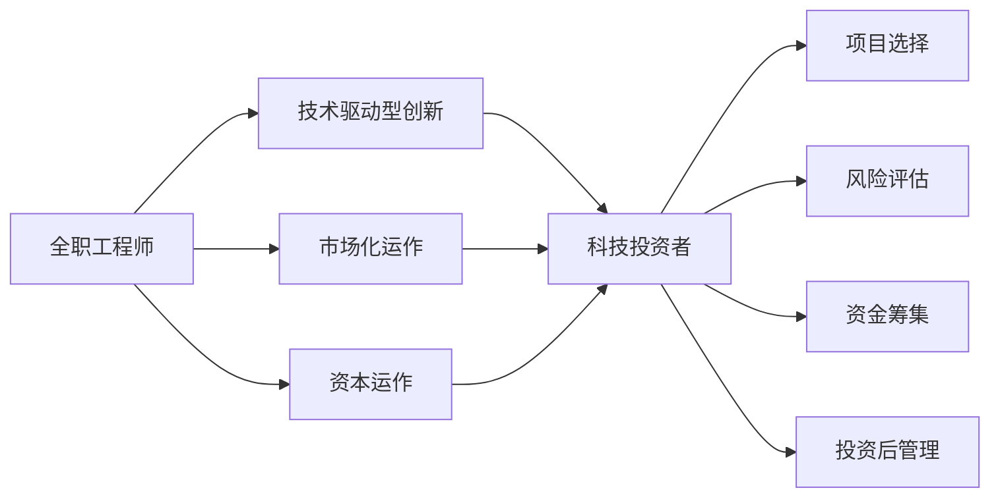

                 

# 从全职工作到科技影响力投资者的转变

在IT行业的高速发展中，许多从业者不仅担任着技术专家和技术骨干的角色，同时也在逐渐转向科技影响力投资者（Tech Investor）。这种转变不仅是职业角色的调整，更是在技术、市场、资本等多维度思考和实践的整合。本文将从多个层面深入探讨这一转变的核心概念、实际应用及未来展望，为科技行业从业人员提供有益的参考和指导。

## 1. 背景介绍

### 1.1 行业变革

随着科技的飞速发展，IT行业正在经历深刻的变革。人工智能、大数据、区块链、云计算等新兴技术的崛起，为创新和创业提供了广阔的舞台。在这一背景下，科技投资者成为连接技术创新与资本的重要桥梁，对推动行业发展起到了关键作用。

### 1.2 职业需求变化

从全职工程师转向科技投资者，不仅需要对技术有深刻的理解，还需要具备市场洞察力、投资理念和资本运作能力。这种职业转变反映了对人才多样性和复合能力的需求。

### 1.3 职业机会

随着技术生态的复杂化和资本市场的多元化，科技投资者拥有广阔的职业发展空间，可以从传统的创业公司、风险投资机构，到专业科技投资基金，选择多样化的职业路径。

## 2. 核心概念与联系

### 2.1 核心概念概述

- **全职工程师**：负责技术研发、产品开发等日常工作，具有较强的技术能力和项目管理经验。
- **科技投资者**：专注于科技领域的投资，包括项目选择、风险评估、资金筹集、投资后管理等环节，需要跨领域的知识与技能。
- **技术驱动型创新**：通过技术创新推动产品或服务创新，实现商业价值。
- **市场化运作**：将技术成果转化为市场产品，涉及市场营销、商业模式、用户反馈等多个方面。
- **资本运作**：与投资机构合作，进行项目融资、估值分析、退出策划等资本操作，确保投资回报。

### 2.2 核心概念原理和架构的 Mermaid 流程图



## 3. 核心算法原理 & 具体操作步骤

### 3.1 算法原理概述

全职工程师转向科技投资者，本质上是一种跨领域的技能和经验整合过程。技术驱动型创新、市场化运作和资本运作相互交织，形成了一个多维度的技术生态系统。

- **技术驱动型创新**：通过技术创新解决实际问题，提升产品或服务的价值。核心在于技术能力的应用和提升。
- **市场化运作**：将技术成果转化为市场产品，需要理解市场需求、产品定位、营销策略等。核心在于市场洞察和执行能力。
- **资本运作**：与投资机构合作，进行融资和退出策划，确保项目顺利推进。核心在于投资理念和资本运作能力。

### 3.2 算法步骤详解

从全职工程师转型为科技投资者，一般需要经历以下几个关键步骤：

1. **初步探索与了解**：通过阅读行业报告、参与行业会议等方式，了解科技投资的基本概念和运作模式。
2. **提升市场洞察力**：通过项目调研、行业交流等方式，提升对市场趋势和需求的理解。
3. **投资项目选择与评估**：基于市场洞察，选择有潜力的项目，并进行全面的风险评估。
4. **资本运作与投资执行**：与投资机构合作，进行融资和项目执行，确保投资顺利进行。
5. **投资后管理与退出策划**：投资后，持续关注项目进展，制定退出策略，实现投资回报。

### 3.3 算法优缺点

**优点**：
- **复合能力提升**：跨领域能力的整合，有助于全面理解科技生态系统。
- **资源网络拓展**：与投资机构的合作，可以获得更多资源和机会。
- **职业发展多样性**：多样化的职业路径，带来更大的职业成长空间。

**缺点**：
- **学习曲线陡峭**：需要掌握多方面的知识和技能，学习成本较高。
- **市场波动风险**：投资决策的准确性直接影响投资回报，存在一定的风险。
- **时间与精力投入**：投资管理工作需要持续的时间与精力投入，可能导致全职工作与投资管理的平衡问题。

### 3.4 算法应用领域

科技投资者可以在多个领域发挥作用，包括但不限于：
- **创业公司投资**：直接投资初创公司，提供资金和技术支持。
- **风险投资机构**：在风险投资机构工作，寻找并投资高成长潜力项目。
- **专业科技投资基金**：专注于特定领域的科技投资，如人工智能、大数据、生物技术等。
- **政府科技基金**：参与政府科技基金的管理和运作，推动科技创新和产业化。

## 4. 数学模型和公式 & 详细讲解 & 举例说明

### 4.1 数学模型构建

科技投资者的核心任务之一是进行项目选择与评估。一般采用以下数学模型：

- **投资回报率（ROI）**：
$$
ROI = \frac{投资收益}{投资成本} \times 100\%
$$

- **内部回报率（IRR）**：
$$
IRR = \frac{NCF}{\sum_{t=1}^{n} P_t / (1 + r)^t}
$$
其中 $NCF$ 为净现金流，$P_t$ 为第 $t$ 期的现金流，$r$ 为折现率。

### 4.2 公式推导过程

**投资回报率（ROI）**：
$$
ROI = \frac{投资收益}{投资成本} \times 100\% = \frac{(项目总收益 - 初始投资) / 初始投资}{1}
$$

**内部回报率（IRR）**：
$$
IRR = \frac{NCF}{\sum_{t=1}^{n} P_t / (1 + r)^t}
$$
其中 $NCF$ 为净现金流，$P_t$ 为第 $t$ 期的现金流，$r$ 为折现率。

通过推导，可以看出内部回报率（IRR）反映的是项目的现金流再投资后的净现值（NPV）等于零时的折现率，是一个更为全面的评估指标。

### 4.3 案例分析与讲解

假设某科技公司投资1000万美元用于开发一款新应用，经过3年，该应用实现净利润1200万美元，总成本为2000万美元，计算ROI和IRR：

- **ROI**：
$$
ROI = \frac{1200 - 1000}{1000} \times 100\% = 20\%
$$

- **IRR**：
假设折现率为10%，则：
$$
IRR = \frac{1200 \times (1 - 1 / (1 + 10\%)^3) + 1000 / (1 + 10\%)^3}{1200 / (1 + 10\%)^3 + 1000 / (1 + 10\%)^3}
$$
计算得 $IRR \approx 21\%$

## 5. 项目实践：代码实例和详细解释说明

### 5.1 开发环境搭建

为了进行科技投资项目的评估和模拟，我们需要搭建一个Python开发环境。以下是基本步骤：

1. 安装Python和Pip：
```bash
sudo apt-get update && sudo apt-get install python3-pip
```

2. 安装必要的库：
```bash
pip install numpy pandas scipy scikit-learn statsmodels
```

3. 创建虚拟环境：
```bash
python3 -m venv myenv
source myenv/bin/activate
```

### 5.2 源代码详细实现

以下是一个简单的Python代码示例，用于计算投资回报率（ROI）和内部回报率（IRR）：

```python
import numpy as np
from scipy.optimize import fsolve

def ROI(investment, profit):
    return (profit - investment) / investment * 100

def IRR(npf, cashflows, r):
    def f(x):
        return (cashflows / (1 + x)**np.arange(1, len(cashflows)+1) - npf) / (cashflows / (1 + x)**np.arange(1, len(cashflows)+1))
    return fsolve(f, r)

# 投资1000万美元，3年净利润1200万美元，总成本2000万美元
investment = 10000000
profit = 12000000
cost = 20000000

# 计算ROI
roi = ROI(investment, profit)
print(f"ROI: {roi:.2f}%")

# 计算IRR
npf = profit - cost
cashflows = np.array([0, 0, profit])
r = 0.1  # 假设折现率为10%
irr = IRR(npf, cashflows, r)
print(f"IRR: {irr:.2f}%")
```

### 5.3 代码解读与分析

在上述代码中，我们使用了NumPy和SciPy库进行数学计算，通过定义ROI和IRR函数，结合具体的投资参数进行计算。IRR函数使用了SciPy的fsolve方法，用于求解非线性方程，计算IRR。

## 6. 实际应用场景

### 6.1 创业公司投资

科技投资者可以在初创公司投资过程中提供宝贵的市场洞察和投资建议，帮助公司制定发展战略。例如，某科技公司正在研发一款AI应用，投资者可以通过市场调研，提供潜在用户、市场定位和融资需求等信息，推动公司快速成长。

### 6.2 风险投资机构

风险投资机构是科技投资者的重要平台，投资者可以在这里获得丰富的资源和机会，参与各类科技项目的评估和投资。例如，某风险投资机构对多个AI创业项目进行尽职调查，选择最有潜力的项目进行投资，并在项目推进过程中提供持续的指导和支持。

### 6.3 专业科技投资基金

专业科技投资基金专注于特定领域，如人工智能、大数据等，投资者可以在这些领域深耕，积累丰富的投资经验。例如，某科技投资基金专注于AI领域，通过投资多个AI初创项目，逐步建立起对AI技术趋势的深入理解。

### 6.4 政府科技基金

政府科技基金是推动科技创新的重要力量，科技投资者可以参与其中，推动各类科技项目落地实施。例如，某科技投资者参与了政府科技基金的项目评审，帮助选择和支持具有高社会价值的项目。

## 7. 工具和资源推荐

### 7.1 学习资源推荐

1. **《人工智能创业投资》**：这本书系统介绍了人工智能领域的创业和投资，提供了丰富的案例分析。
2. **Coursera《创业与投资》**：斯坦福大学开设的创业与投资课程，涵盖了创业管理、投资策略等多个方面。
3. **Khan Academy《统计学》**：提供统计学基础知识，帮助理解投资回报率等基本概念。
4. **TED Talks《科技投资的未来》**：多位科技投资者分享他们的经验和见解，提供宝贵的市场洞察。
5. **Github《Python财务分析库》**：提供了Python实现的财务分析工具，包括ROI和IRR计算。

### 7.2 开发工具推荐

1. **Jupyter Notebook**：轻量级的开发环境，支持Python、R等语言，便于数据处理和模型验证。
2. **PyCharm**：功能强大的Python开发工具，支持版本控制、代码调试、测试等功能。
3. **Git**：版本控制系统，便于协作开发和代码管理。
4. **Google Colab**：免费提供的云开发环境，支持GPU计算，便于快速实验和模型部署。

### 7.3 相关论文推荐

1. **《科技投资的未来》**：探讨了未来科技投资的趋势和挑战，提供了深刻的行业洞察。
2. **《人工智能创业投资的实践》**：分析了人工智能领域创业投资的案例和经验，提供了实用的投资策略。
3. **《科技创新的投资与退出》**：讨论了科技创新的投资路径和退出策略，提供了系统的投资框架。
4. **《科技投资的风险评估与管理》**：介绍了科技投资的风险评估方法和管理策略，提供了实用的投资工具。

## 8. 总结：未来发展趋势与挑战

### 8.1 研究成果总结

科技投资者在推动科技创新和产业发展中发挥了关键作用，他们在技术、市场和资本等多个维度上的独特能力，为科技创业提供了强大的支持。

### 8.2 未来发展趋势

1. **数据驱动决策**：科技投资者将越来越依赖于数据驱动的决策过程，提高投资决策的准确性。
2. **跨界融合**：科技投资者将更多地参与跨界合作，整合不同领域的资源和知识，推动更多创新项目落地。
3. **可持续投资**：科技投资者将注重环保和可持续发展，选择具有社会责任感的科技项目进行投资。
4. **智能投顾**：AI驱动的智能投顾技术将逐步应用于投资决策过程，提高效率和精准性。

### 8.3 面临的挑战

1. **市场波动风险**：投资决策需要应对市场的复杂波动，避免因判断失误导致的损失。
2. **知识更新快速**：科技行业快速变化，投资者需要不断更新知识和技能，保持竞争力。
3. **资源分散**：面对多领域的投资需求，资源有限，需要高效管理，平衡投资方向。
4. **合规风险**：投资过程中需遵守法律法规，确保合规性，避免法律风险。

### 8.4 研究展望

未来科技投资者需要进一步提升数据驱动决策能力，跨界合作能力，可持续发展能力和AI辅助决策能力。同时，加强对市场波动的风险管理和合规风险的防控，确保投资过程的稳健和合规。

## 9. 附录：常见问题与解答

**Q1: 如何平衡全职工作与投资管理？**

A: 合理安排时间，利用碎片时间进行投资项目评估和市场调研。同时，组建一个高效的投资团队，将部分投资管理工作外包，确保全职工作与投资管理并行不悖。

**Q2: 如何选择科技投资项目？**

A: 进行市场调研，了解潜在用户需求和市场趋势。同时，进行项目的尽职调查，评估项目的商业价值和风险。选择具有高潜力的项目进行投资。

**Q3: 如何降低投资风险？**

A: 分散投资，选择不同领域和不同阶段的项目进行投资，避免单一项目的风险。同时，进行全面的风险评估，制定风险应对策略。

**Q4: 如何提高投资回报？**

A: 选择具有高社会价值和商业潜力的项目进行投资，同时提供持续的支持和指导，帮助项目快速成长。定期进行投资评估和优化，确保投资回报最大化。

作者：禅与计算机程序设计艺术 / Zen and the Art of Computer Programming

