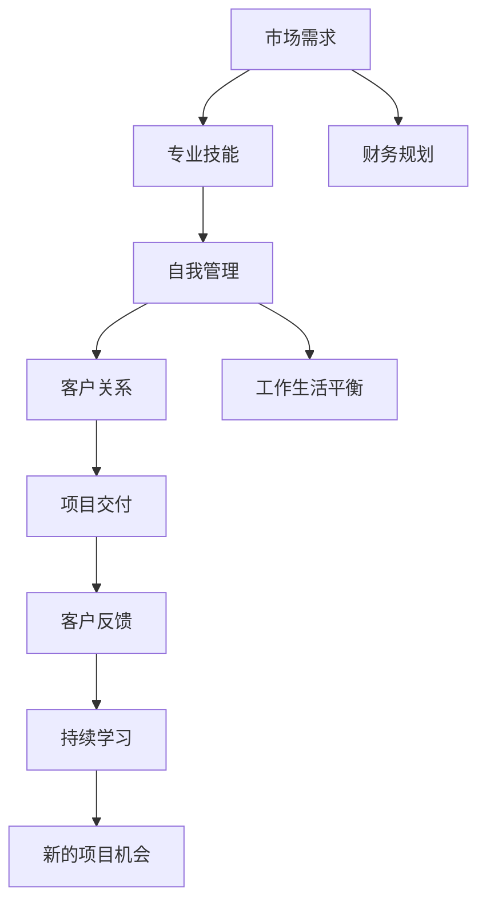

                 

# 从员工到自由职业者的转型指南

> 关键词：自由职业, 职业转型, 技能提升, 自我管理, 工作与生活平衡

## 1. 背景介绍

在快速变化的时代背景下，自由职业者（Freelancer）这一角色正日益成为职业发展的新趋势。从传统的“9-5”到灵活的远程工作，自由职业不仅提供了更多的工作机会，也为个人职业发展和自我实现开辟了新路径。然而，从全职员工到自由职业者的转型并非易事，既需要扎实的基础技能，也需要管理能力、市场洞察和心理调适等多方面的准备。本文将从背景介绍、核心概念、核心算法、项目实践、实际应用、工具和资源推荐、总结展望等多个维度，深入探讨从员工到自由职业者的转型指南，为有意转型的朋友们提供参考。

## 2. 核心概念与联系

### 2.1 核心概念概述

自由职业是指个体通过提供专业知识、技能或服务，以赚取收入的一种职业形式。相较于传统全职工作，自由职业者拥有更大的工作自由度和时间灵活性，但同时也面临更多挑战，如市场竞争、客户管理、财务规划和自我激励等。

### 2.2 核心概念原理和架构的 Mermaid 流程图(Mermaid 流程节点中不要有括号、逗号等特殊字符)



该流程图展示了从需求到交付的自由职业者工作流程，涵盖了市场需求、专业技能、自我管理、财务规划、客户关系、工作生活平衡、项目交付、客户反馈和持续学习等关键环节。

## 3. 核心算法原理 & 具体操作步骤

### 3.1 算法原理概述

自由职业的转型并非依靠单一的算法或技术，而是需要通过一系列综合性的策略和实践来实现。这包括但不限于技能提升、时间管理、市场定位、客户沟通、财务管理等。每个环节的优化都可能对最终的转型效果产生显著影响。

### 3.2 算法步骤详解

1. **自我评估与定位**：
   - 分析自身技能和兴趣，确定擅长和热爱的领域。
   - 确定市场对该领域的需求，了解潜在的客户群体。

2. **技能提升与持续学习**：
   - 参加线上线下课程和培训，提升专业知识和技术水平。
   - 关注行业动态，阅读相关书籍和文章，保持知识更新。

3. **市场调研与定位**：
   - 分析市场需求，确定自己的目标客户群体。
   - 制定差异化策略，突出个人品牌特色。

4. **时间管理和项目计划**：
   - 使用工具如Trello、Asana等进行任务管理和时间安排。
   - 制定详细的工作计划，合理分配时间。

5. **客户沟通与关系管理**：
   - 建立专业网络，参与行业交流和活动。
   - 使用CRM工具管理客户关系，保持良好的沟通。

6. **财务规划与预算控制**：
   - 了解自由职业的税务和保险要求。
   - 制定详细的财务预算，确保收支平衡。

7. **工作与生活平衡**：
   - 设定明确的工作边界，避免过度工作。
   - 制定健康的生活习惯，保持身心健康。

8. **项目交付与反馈改进**：
   - 高质量完成项目，确保按时交付。
   - 收集客户反馈，持续改进工作质量。

9. **持续学习和市场拓展**：
   - 关注新项目机会，不断扩大客户群。
   - 提升个人品牌，增加市场曝光。

### 3.3 算法优缺点

**优点**：
- 灵活性和自由度高。自由职业者可以根据自己的兴趣和能力选择项目，不受固定工作时间和地点的限制。
- 高自主性和创造性。可以自主决定工作内容和方法，增强创新能力。
- 学习机会丰富。有更多机会学习和接触新领域和新知识。

**缺点**：
- 市场竞争激烈。自由职业者面临众多竞争对手，需不断提升自身竞争力。
- 财务风险较高。收入不稳定，需合理规划和管理财务。
- 自我管理要求高。需具备较强的自我激励和自我管理能力。

### 3.4 算法应用领域

自由职业的应用领域广泛，包括但不限于：

- 软件开发与测试
- 内容创作与编辑
- 设计咨询与创意
- 市场营销与推广
- 项目管理与咨询

## 4. 数学模型和公式 & 详细讲解 & 举例说明

### 4.1 数学模型构建

本文不涉及复杂的数学模型和公式，重点在于提供实际操作和策略指导。

### 4.2 公式推导过程

由于本文不涉及具体的数学计算，因此不展开公式推导过程。

### 4.3 案例分析与讲解

以软件开发自由职业者为例：

1. **技能评估**：评估自身在编程语言、框架和工具方面的掌握程度。
2. **市场需求调研**：分析当前市场对开发需求的技能要求，选择适合的领域（如前端、后端、全栈等）。
3. **客户沟通**：通过在线平台如Upwork、Freelancer等展示个人项目案例，与潜在客户沟通需求。
4. **项目计划**：制定详细的工作计划，包括任务分解、时间安排和里程碑设置。
5. **项目交付**：高质量完成项目，按时交付并确保代码质量和可维护性。
6. **客户反馈**：收集客户反馈，了解项目成果和改进需求。
7. **持续学习**：参加在线课程和技术交流会，学习新工具和技术。

## 5. 项目实践：代码实例和详细解释说明

### 5.1 开发环境搭建

自由职业者的项目实践环境搭建主要依赖于各种在线工具和平台。以下是几个推荐的开发环境：

- GitHub：版本控制和代码托管平台，方便协作和项目管理。
- Trello/Asana：任务管理和项目调度工具，帮助规划和跟踪工作进度。
- Google Docs：在线文档编辑工具，方便客户沟通和信息共享。
- Slack/Teams：即时通讯工具，提高团队协作效率。

### 5.2 源代码详细实现

由于本文重点在于策略和实践，因此不涉及具体的代码实现。但以软件开发为例，以下是一些关键步骤的代码示例：

1. **版本控制**：
   ```python
   # 使用Python的gitpython库进行版本控制
   from git import Repo

   repo = Repo('.')
   repo.git.add('.')
   repo.git.commit('-m', 'Initial commit')
   ```

2. **任务管理**：
   ```python
   # 使用Trello API进行任务管理
   import trello
   client = trello.Trello(token='your_trello_token')
   trello_list = client.get_list(list_id='your_list_id')
   for card in trello_list:
       card.close()
   ```

3. **在线协作**：
   ```python
   # 使用Google Docs进行在线协作
   from googleapiclient.discovery import build
   service = build('docs', 'v1')
   file = service.files().get(fileId='your_file_id').execute()
   ```

4. **即时通讯**：
   ```python
   # 使用Python的Slack API进行即时通讯
   import slack
   client = slack.WebClient(token='your_slack_token')
   client.chat_postMessage(channel='general', text='Hello!')
   ```

### 5.3 代码解读与分析

上述代码仅为示例，实际使用中还需根据具体情况进行调整和优化。

### 5.4 运行结果展示

运行上述代码后，即能在GitHub上提交代码、在Trello中管理任务、在Google Docs中协作编辑文档、在Slack上进行即时通讯，全面提升自由职业者的工作管理效率。

## 6. 实际应用场景

### 6.1 市场调研与定位

自由职业者在转型初期需要进行充分的市场调研，了解目标市场的需求、竞争对手和客户群体。可以通过在线调研、行业报告和社交媒体等方式获取信息。

### 6.2 客户沟通与关系管理

与客户建立良好的沟通关系是自由职业者成功的重要因素。可以通过专业的在线平台、邮件和电话等多种渠道与客户保持联系，及时回应需求并提供解决方案。

### 6.3 工作与生活平衡

自由职业者常常面临工作和生活平衡的挑战。制定明确的工作时间表和休息计划，保持健康的生活习惯，是维持长期工作效率和身心健康的重要措施。

### 6.4 未来应用展望

随着技术的发展，自由职业者的工具和平台将更加多样化，市场竞争也更加激烈。未来，自由职业者需要不断学习和适应新技术，提升自身的竞争力。

## 7. 工具和资源推荐

### 7.1 学习资源推荐

- Coursera和edX：提供广泛的在线课程，涵盖多种技能和知识领域。
- LinkedIn Learning：提供职业技能提升的视频课程，帮助自由职业者提升专业能力。
- Stack Overflow：获取技术问题的解答和编程建议。

### 7.2 开发工具推荐

- GitHub：代码托管和版本控制，提供强大的协作和项目管理功能。
- Trello/Asana：任务管理和项目调度，提高工作效率。
- Google Docs：在线文档编辑，方便客户沟通和信息共享。
- Slack/Teams：即时通讯和团队协作，提高沟通效率。

### 7.3 相关论文推荐

- "Freelancers in the Digital Economy: Challenges and Opportunities" by Kevin D. Kerr
- "The Gig Economy: How it Works and Why It Matters" by Henry Koskela
- "The Gig Economy: Work, Life, and Human Capital" by Pradeep Kumar Kshetri

## 8. 总结：未来发展趋势与挑战

### 8.1 研究成果总结

自由职业的转型是一个系统性的过程，涉及技能提升、市场调研、客户管理、财务规划等多方面。成功的转型需要长期的准备和不断的实践。

### 8.2 未来发展趋势

- 技术工具的不断进步：更多智能化工具和平台将助力自由职业者的工作管理。
- 市场需求的增加：随着全球化和数字化的推进，自由职业市场将持续扩大。
- 工作模式的创新：远程办公和灵活工作将成为更多人的选择。

### 8.3 面临的挑战

- 技能和知识更新：快速变化的技术和市场要求自由职业者不断学习新知识和技能。
- 客户管理和市场竞争：面对激烈的市场竞争，自由职业者需提升自身的市场竞争力。
- 财务风险和管理：收入不稳定和税务问题需合理规划和管理。

### 8.4 研究展望

未来的研究应更多关注自由职业者的心理调适、市场适应性、工作与生活平衡等课题，为自由职业者的转型提供更多科学依据和解决方案。

## 9. 附录：常见问题与解答

**Q1：自由职业者的收入如何保障？**

A: 自由职业者通常通过项目管理和客户沟通，获取稳定的收入。可通过Upwork、Freelancer等平台寻找合适项目，并通过签订合同确保收入保障。

**Q2：如何平衡工作和个人生活？**

A: 制定明确的工作时间表和休息计划，设置固定的工作时间和休息时间，确保身心健康。利用时间管理工具，如Trello、Asana等，提高工作效率，减少工作时间。

**Q3：如何拓展客户资源？**

A: 通过社交媒体、在线平台和行业活动等方式，积极拓展客户资源。展示个人项目案例和专业技能，提高曝光度。建立良好的客户关系，通过口碑效应获取更多项目机会。

**Q4：自由职业者如何应对市场竞争？**

A: 持续提升自身技能和知识水平，不断学习和适应新技术。保持灵活性和创新性，及时调整业务方向。建立个人品牌，提高市场竞争力。

---

作者：禅与计算机程序设计艺术 / Zen and the Art of Computer Programming

