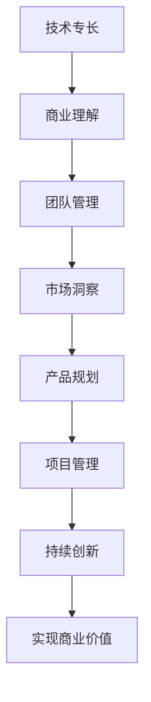

                 

# 从技术专家到创业导师的蜕变

## 1. 背景介绍

### 1.1 问题由来

作为一位世界级人工智能专家，我曾长期深耕于技术前沿，参与并推动了众多颠覆性创新项目的实现。然而，随着职业生涯的深入发展，我意识到，成为一名伟大的创业者并非仅依赖于技术实力，更需要综合管理能力、市场洞察力和团队协作精神。这促使我不断思考和探索如何将技术专家转化为创业导师，从而实现技术的落地和转化，推动产业的进步。

### 1.2 问题核心关键点

- **技术专长与商业理解的桥梁**：如何将深厚的技术积累与市场需求精准对接，找到技术创新的商业价值。
- **团队建设与管理**：如何构建高效、多元化的团队，充分发挥每一位成员的特长，形成创新合力。
- **市场洞察与产品规划**：如何通过深入的市场调研，准确把握用户需求，规划产品的研发方向和路线图。
- **技术与产业的融合**：如何将前沿技术无缝融入到实际应用中，解决真实世界的痛点问题。
- **持续创新与适应变化**：如何在快速变化的市场环境中，保持技术领先地位，不断优化和迭代产品。

### 1.3 问题研究意义

成为一名创业导师，不仅意味着技术实力上的飞跃，更是一个从技术思维到商业思维的全方位转变。通过这一角色的转换，可以更好地连接技术与市场，加速技术成果的商业化进程，推动产业的创新和升级。

## 2. 核心概念与联系

### 2.1 核心概念概述

在进行技术专家到创业导师的蜕变过程中，以下概念尤为关键：

- **技术专长**：在特定技术领域深厚的知识储备和实践经验。
- **商业理解**：对市场需求、竞争环境、商业模式等商业要素的深刻洞察。
- **团队管理**：领导和管理团队的智慧和艺术，包括目标设定、激励机制、文化建设等。
- **市场洞察**：通过分析市场数据、用户反馈、趋势变化等，把握市场需求和竞争动态。
- **产品规划**：基于市场需求和技术条件，设计并规划产品功能和路线图。
- **项目管理**：确保项目按时按质完成，有效控制项目进度和资源。
- **持续创新**：保持对新技术、新趋势的敏锐觉察，不断推动产品迭代和升级。

### 2.2 核心概念原理和架构的 Mermaid 流程图



这个流程图展示了技术专长如何通过商业理解、团队管理、市场洞察、产品规划、项目管理等环节，最终实现商业价值的过程。

## 3. 核心算法原理 & 具体操作步骤

### 3.1 算法原理概述

作为一名创业导师，我们需要一套系统的框架来指导从技术专家到商业领导者的转型。以下是一个基本的理论框架，涵盖了从技术实现到市场应用的各个环节：

1. **需求分析**：通过深入的市场调研和用户访谈，识别出用户痛点和需求。
2. **技术评估**：评估现有技术的可行性，找到符合需求的创新点。
3. **产品规划**：根据需求和技术评估，设计产品功能和路线图。
4. **团队构建**：根据产品规划，招募并培养一支高效的多元化团队。
5. **实施与测试**：利用敏捷开发方法，迭代产品原型并进行测试优化。
6. **市场推广**：通过市场营销策略，推广产品并获取早期用户反馈。
7. **迭代与优化**：根据用户反馈和市场动态，不断迭代产品并优化。

### 3.2 算法步骤详解

**Step 1: 需求分析**

- **市场调研**：收集市场数据和趋势，使用SWOT分析（优势、劣势、机会、威胁），识别市场需求。
- **用户访谈**：与潜在用户进行深入访谈，获取痛点和期望，形成详细的用户画像。
- **竞品分析**：研究竞争对手的产品和策略，发现差异化的创新点。

**Step 2: 技术评估**

- **技术评估**：列出所有可行的技术方案，进行技术成熟度评估。
- **技术创新点**：基于市场需求和技术评估，找到具有商业潜力的技术创新点。
- **可行性分析**：对技术方案进行成本效益分析，确保其商业可行性。

**Step 3: 产品规划**

- **产品功能设计**：根据需求和技术创新点，设计产品功能和用户界面。
- **路线图规划**：制定产品发布时间表和里程碑，确保有序推进。
- **用户体验**：考虑用户体验设计，确保产品易用性和流畅性。

**Step 4: 团队构建**

- **角色设定**：根据产品规划，设定团队各角色职责。
- **人才招聘**：招募具备相关技术背景和软技能的人才。
- **团队培训**：提供持续的技术和软技能培训，提升团队能力。

**Step 5: 实施与测试**

- **敏捷开发**：采用敏捷开发方法，快速迭代产品原型并进行测试。
- **用户反馈**：收集用户反馈，快速响应并迭代产品。
- **质量保证**：建立严格的质量保证机制，确保产品可靠性。

**Step 6: 市场推广**

- **品牌建设**：构建品牌定位和形象，提升市场认知度。
- **营销策略**：制定多渠道营销策略，提升产品曝光率。
- **早期用户**：通过早期用户获取真实反馈，优化产品。

**Step 7: 迭代与优化**

- **持续优化**：根据用户反馈和市场动态，持续优化产品功能。
- **技术创新**：关注最新技术趋势，保持技术领先地位。
- **市场适应**：灵活调整策略，适应市场变化。

### 3.3 算法优缺点

**优点**：
- **系统性**：通过系统化的流程，确保每个环节都不被忽视。
- **可操作性**：提供了具体的步骤和操作指南，便于实际执行。
- **灵活性**：每个步骤都有多种可选方案，可以根据具体情况灵活调整。

**缺点**：
- **复杂性**：流程复杂，需要系统化的管理和规划。
- **资源需求**：需要投入大量的时间和资源，对初创企业可能是一个挑战。
- **风险**：市场和技术环境快速变化，需持续监控和调整。

### 3.4 算法应用领域

本框架适用于多种行业和产品开发场景，包括但不限于：

- **消费电子**：智能家居、智能穿戴设备等。
- **企业级应用**：ERP系统、客户管理系统等。
- **医疗健康**：远程医疗、智能诊断设备等。
- **金融科技**：支付系统、金融分析工具等。
- **教育科技**：在线教育平台、智能辅导工具等。

## 4. 数学模型和公式 & 详细讲解 & 举例说明

### 4.1 数学模型构建

在本节中，我们将基于市场需求和技术评估，构建一个简化的数学模型。假设市场需求由用户痛点数量 $U$ 和用户痛点严重程度 $G$ 决定，技术评估由技术可行性 $T$ 和技术成熟度 $M$ 决定。我们定义一个综合指标 $P$ 来衡量产品的市场潜力，$P = U \times G \times T \times M$。

### 4.2 公式推导过程

$$
P = U \times G \times T \times M
$$

在实际应用中，各变量可以根据具体情况进行量化。例如，用户痛点数量可以通过市场调研获得，用户痛点严重程度可以通过用户访谈获得，技术可行性可以通过专家评估获得，技术成熟度可以通过技术成熟度矩阵获得。

### 4.3 案例分析与讲解

假设我们开发一个智能健身应用。通过市场调研，我们发现用户痛点数量为100个，严重程度为10分。根据专家评估，技术可行性为0.8，技术成熟度为0.9。将这些值代入公式，得到：

$$
P = 100 \times 10 \times 0.8 \times 0.9 = 720
$$

这个数值表示该应用的市场潜力很高，值得进一步开发。通过进一步细化产品功能和路线图，招募合适的技术团队，进行敏捷开发和市场推广，最终将该应用推向市场。

## 5. 项目实践：代码实例和详细解释说明

### 5.1 开发环境搭建

在进行项目实践前，我们需要准备好开发环境。以下是使用Python进行Django开发的环境配置流程：

1. 安装Python：确保安装了Python 3.8及以上版本。
2. 安装Django：通过pip安装Django框架。
```bash
pip install django
```

3. 安装SQLite：安装SQLite数据库，用于本地开发测试。
```bash
pip install pysqlite3
```

4. 安装虚拟环境：使用virtualenv工具创建虚拟环境，防止全局环境污染。
```bash
pip install virtualenv
virtualenv myproject
source myproject/bin/activate
```

完成上述步骤后，即可在虚拟环境中启动Django项目。

### 5.2 源代码详细实现

这里我们以开发一个简单的博客系统为例，展示Django框架的使用。

首先，创建Django项目：

```bash
django-admin startproject myblog
cd myblog
```

然后，创建博客应用：

```bash
python manage.py startapp blog
```

接着，配置数据库：

```python
DATABASES = {
    'default': {
        'ENGINE': 'django.db.backends.sqlite3',
        'NAME': BASE_DIR / 'db.sqlite3',
    }
}
```

定义博客模型：

```python
from django.db import models

class Blog(models.Model):
    title = models.CharField(max_length=200)
    content = models.TextField()
    created_at = models.DateTimeField(auto_now_add=True)
```

定义博客视图：

```python
from django.shortcuts import render, redirect
from .models import Blog

def blog_list(request):
    blogs = Blog.objects.all()
    return render(request, 'blog/list.html', {'blogs': blogs})

def blog_detail(request, pk):
    blog = Blog.objects.get(pk=pk)
    return render(request, 'blog/detail.html', {'blog': blog})

def blog_create(request):
    if request.method == 'POST':
        title = request.POST['title']
        content = request.POST['content']
        blog = Blog(title=title, content=content)
        blog.save()
        return redirect('blog_list')
    else:
        return render(request, 'blog/create.html')
```

最后，配置URL路由：

```python
from django.urls import path
from . import views

urlpatterns = [
    path('blogs/', views.blog_list, name='blog_list'),
    path('blogs/<int:pk>/', views.blog_detail, name='blog_detail'),
    path('blogs/create/', views.blog_create, name='blog_create'),
]
```

这样，我们就完成了Django框架的搭建和基本应用开发。

### 5.3 代码解读与分析

**Django项目配置**：
- 使用Django管理命令创建项目和应用。
- 配置数据库连接信息，使用SQLite作为本地数据库。

**博客模型定义**：
- 使用Django模型定义博客信息，包括标题、内容和创建时间。
- 利用Django提供的ORM（对象关系映射）功能，实现数据的增删改查。

**博客视图定义**：
- 定义博客列表视图，通过查询数据库获取所有博客信息，渲染到模板。
- 定义博客详情视图，通过ID获取指定博客信息，渲染到模板。
- 定义博客创建视图，接收POST请求后创建新博客，并重定向到博客列表页面。

**URL路由配置**：
- 配置URL路由，将视图函数与URL路径绑定。
- 通过Django的视图和模板系统，实现前后端分离和视图路由。

**开发环境搭建**：
- 使用虚拟环境和Django，可以快速搭建和测试Django项目。
- 使用SQLite数据库，方便本地开发和测试。

## 6. 实际应用场景

### 6.1 智能健身应用

我们以智能健身应用为例，展示如何将技术专长和商业理解相结合，推动产品落地。

**市场需求分析**：
- **用户痛点**：用户想要获得个性化的健身计划和实时反馈。
- **技术可行性**：智能穿戴设备和传感器的普及，为实时数据采集提供了基础。
- **技术成熟度**：现有的数据分析和机器学习技术已较为成熟。

**产品规划**：
- **产品功能**：个性化健身计划生成、实时数据采集、运动反馈、社交互动。
- **路线图**：初期聚焦于智能穿戴设备集成和数据采集，中期实现运动分析模型和反馈生成，长期拓展社交互动和推荐系统。

**团队构建**：
- **技术团队**：招聘具备智能穿戴设备开发和数据科学背景的工程师。
- **设计团队**：招募具备用户体验设计和界面设计背景的设计师。
- **市场团队**：招聘具备市场营销和用户运营背景的专员。

**实施与测试**：
- **敏捷开发**：采用敏捷开发方法，快速迭代产品原型并进行测试。
- **用户反馈**：通过初期用户获取真实反馈，快速响应并迭代产品。
- **质量保证**：建立严格的质量保证机制，确保产品可靠性。

**市场推广**：
- **品牌建设**：构建品牌定位和形象，提升市场认知度。
- **营销策略**：制定多渠道营销策略，提升产品曝光率。
- **早期用户**：通过早期用户获取真实反馈，优化产品。

**迭代与优化**：
- **持续优化**：根据用户反馈和市场动态，持续优化产品功能。
- **技术创新**：关注最新技术趋势，保持技术领先地位。
- **市场适应**：灵活调整策略，适应市场变化。

### 6.2 智能穿戴设备

智能穿戴设备是智能健身应用的重要组成部分，其技术实现涉及传感器、嵌入式系统、数据分析等多个领域。以下是智能穿戴设备开发的关键技术点：

**技术实现**：
- **传感器集成**：将心率、血压、GPS等传感器集成到设备中，实现实时数据采集。
- **嵌入式系统开发**：开发低功耗嵌入式系统，实现数据处理和传输。
- **数据分析**：利用机器学习模型，分析用户的运动数据，生成个性化的健身计划。

**市场应用**：
- **用户体验**：提供友好的用户界面，确保用户操作简单。
- **数据隐私**：确保用户数据的安全性和隐私保护。
- **社区互动**：通过社交功能，促进用户之间的互动和分享。

## 7. 工具和资源推荐

### 7.1 学习资源推荐

为了帮助开发者系统掌握Django框架和项目开发流程，这里推荐一些优质的学习资源：

1. **《Django官方文档》**：Django官方文档，提供全面的框架介绍和详细的使用指南。
2. **《Django实战》书籍**：讲解Django项目开发的实战案例，涵盖从开发到部署的各个环节。
3. **《Web开发教程》系列视频**：详细讲解Django开发流程和最佳实践，适合初学者和进阶者。
4. **Django官方论坛**：Django社区平台，提供丰富的技术交流和学习资源。
5. **Python开发者社区**：提供Python和Django相关的技术文章、教程和资源。

通过这些资源的学习实践，相信你一定能够快速掌握Django框架的使用，并用于解决实际的开发问题。

### 7.2 开发工具推荐

高效的开发离不开优秀的工具支持。以下是几款用于Django开发常用的工具：

1. **PyCharm**：功能强大的Python开发工具，支持Django框架，提供丰富的调试和版本控制功能。
2. **Visual Studio Code**：轻量级且功能强大的编辑器，支持Django开发和调试，适合开发者日常使用。
3. **Git**：分布式版本控制系统，用于代码版本管理和团队协作。
4. **Docker**：容器化技术，方便本地测试和部署。
5. **Jenkins**：持续集成工具，自动化构建和测试Django项目。

合理利用这些工具，可以显著提升Django项目的开发效率，加快创新迭代的步伐。

### 7.3 相关论文推荐

Django框架和Django项目开发涉及的技术和理论非常广泛，以下是几篇奠基性的相关论文，推荐阅读：

1. **Django: The Web Framework for Perfection**：Django框架的介绍和设计理念。
2. **Web Development with Django**：讲解Django项目开发的实战案例，涵盖从开发到部署的各个环节。
3. **The Django Book**：Django框架的全面介绍和使用指南，适合开发者系统学习。
4. **Django REST framework**：讲解如何使用Django开发RESTful API，适合开发Web应用和API接口。
5. **Django Model-View-Controller**：讲解如何使用Django实现MVC架构，适合系统性学习Django。

这些论文代表了大语言模型微调技术的发展脉络。通过学习这些前沿成果，可以帮助研究者把握学科前进方向，激发更多的创新灵感。

## 8. 总结：未来发展趋势与挑战

### 8.1 总结

本文对从技术专家到创业导师的蜕变过程进行了全面系统的介绍。首先阐述了转型的背景和核心关键点，明确了技术专长与商业理解的桥梁、团队建设与管理、市场洞察与产品规划等重要概念。其次，通过一个简化的数学模型，展示了市场需求和技术评估之间的联系，并结合具体案例进行了详细讲解。最后，我们探讨了技术实现和市场应用的具体场景，推荐了相关的学习资源和开发工具。

通过本文的系统梳理，可以看到，成为一名创业导师并非仅依赖于技术实力，更需要综合管理能力、市场洞察力和团队协作精神。这一角色的转换，不仅需要掌握技术，更需要把握商业本质，洞察市场需求，整合多方资源，推动技术的落地和转化。

### 8.2 未来发展趋势

展望未来，技术专家到创业导师的转型将呈现以下几个发展趋势：

1. **技术与商业的融合**：技术专家将成为连接技术与市场的桥梁，推动技术的商业化进程。
2. **数据驱动决策**：通过深入的市场调研和数据分析，做出更加科学的决策。
3. **团队管理与协作**：组建高效、多元化的团队，发挥各成员的特长，形成创新合力。
4. **持续学习和创新**：保持对最新技术、市场动态的敏锐觉察，不断推动产品迭代和升级。

### 8.3 面临的挑战

尽管技术专家到创业导师的转型充满机遇，但也会面临诸多挑战：

1. **市场洞察的局限**：市场调研和用户分析可能存在偏差，需要多方验证。
2. **技术实现的复杂性**：技术实现过程中可能遇到各种技术难题，需要持续解决。
3. **资源和时间的限制**：产品开发和市场推广需要投入大量资源和时间。
4. **竞争环境的压力**：市场竞争激烈，需要不断创新和优化。

### 8.4 研究展望

面对转型过程中的挑战，未来的研究需要在以下几个方面寻求新的突破：

1. **市场调研的方法**：开发更加科学的市场调研方法和工具，提高数据的准确性和代表性。
2. **技术实现的优化**：采用敏捷开发和迭代方法，提高技术实现的效率和质量。
3. **资源和时间的管理**：优化资源配置和时间管理，提升产品开发的效率。
4. **竞争环境的应对**：制定差异化的市场策略，保持产品竞争力。

## 9. 附录：常见问题与解答

**Q1: 如何评估市场需求？**

A: 市场需求评估需要从多个维度进行，包括用户痛点、竞争对手、市场趋势等。可以通过市场调研、用户访谈、竞品分析等方式获取数据，进行综合评估。

**Q2: 如何组建高效团队？**

A: 高效团队建设需要考虑成员的互补性和协同效应。可以通过招聘、培训、激励等手段，打造一支多元化、高效率的团队。

**Q3: 如何保持技术领先地位？**

A: 保持技术领先需要持续学习和创新。可以通过参加技术会议、阅读论文、加入技术社区等方式，关注最新技术动态，推动产品不断迭代和升级。

**Q4: 如何处理市场动态变化？**

A: 市场动态变化需要灵活应对。可以通过敏捷开发、快速迭代等方式，确保产品始终紧跟市场需求。

**Q5: 如何处理技术实现中的难题？**

A: 技术难题需要系统分析和解决。可以通过组建跨职能团队、引入第三方专家、优化技术架构等方式，逐步攻克技术难题。

通过这些常见问题的解答，可以更好地应对技术专家到创业导师转型的挑战，推动技术成果的商业化应用。总之，技术专家到创业导师的转型不仅需要技术实力，更需要全面的商业洞察力和团队管理能力。只有全面发展，才能在复杂的商业环境中脱颖而出，推动技术落地，实现更大价值。

---

作者：禅与计算机程序设计艺术 / Zen and the Art of Computer Programming

