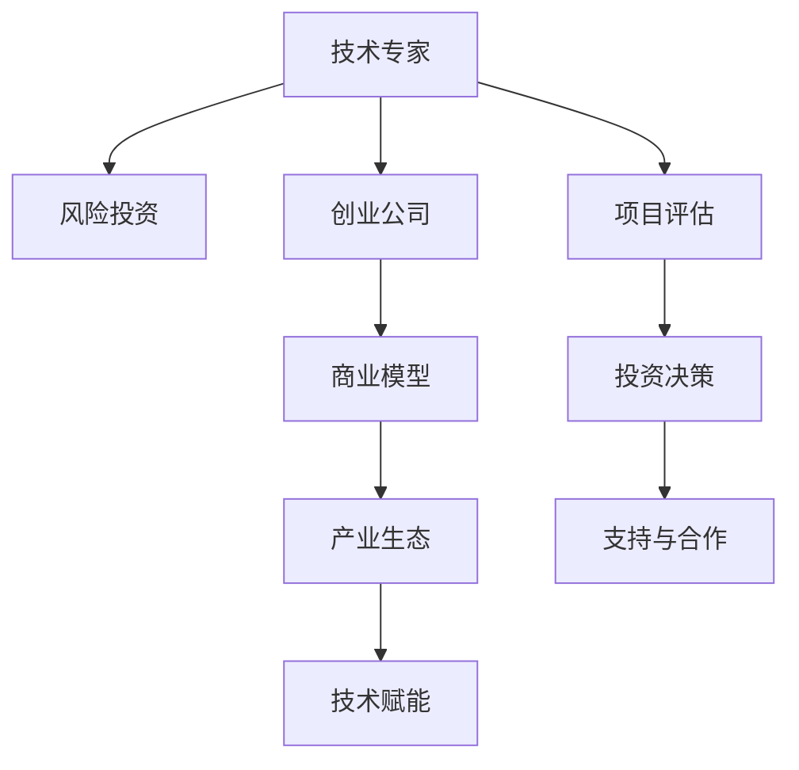

                 

# 从技术专家到风险投资合伙人的跨界之路

## 1. 背景介绍

### 1.1 问题由来

作为一名资深人工智能专家，我曾在科技公司深度参与了大规模的AI技术研发和应用。在这个过程中，我不仅见证了技术的迅猛发展和应用场景的不断拓展，也逐步意识到技术创新与产业化的紧密联系。然而，在企业内部，技术开发与市场需求之间的鸿沟时常存在，技术成果转化为商业价值的路径并不总是明晰。

### 1.2 问题核心关键点

为何技术专家在将科研成果应用于商业化过程中会遇到瓶颈？如何在技术创新与市场需求之间架起一座桥梁？这是每个技术专家都需要深思的问题。我逐渐意识到，除了技术深度，还需要具备从技术视角理解市场，从市场视角推进技术的能力。于是，我开始思考如何将技术创新的思维和方法应用到风险投资领域，成为连接技术与市场的中介，让更多的技术创新转化为现实生产力。

### 1.3 问题研究意义

技术专家转型成为风险投资合伙人的过程，不仅是一个技术到商业的跨界，更是一个从“技术逻辑”到“商业逻辑”的转变。通过这一转型，可以更深入地理解技术创新的商业价值，把握市场需求，为更多技术创新提供资金支持，推动科技成果的产业化进程。

## 2. 核心概念与联系

### 2.1 核心概念概述

为更好地理解技术专家转型为风险投资合伙人的过程，本节将介绍几个密切相关的核心概念：

- 技术专家（Technical Expert）：在某一技术领域具有深厚知识背景和丰富实践经验的专家。
- 风险投资（Venture Capital, VC）：一种专注于早期阶段创业公司的投资方式，旨在提供资金支持，促进公司的快速成长。
- 创业公司（Startup）：处于初创阶段，具有一定商业潜力的公司。
- 商业模型（Business Model）：公司运营和盈利的策略和路径，包括产品、市场、营销、运营等各个方面。
- 产业生态（Industry Ecosystem）：围绕某一产业形成的企业、科研机构、政府等构成的相互依存的网络。
- 技术赋能（Technology-Enabled）：通过技术手段提升产品或服务的价值，创造新的商业模式。

这些核心概念之间的逻辑关系可以通过以下Mermaid流程图来展示：



这个流程图展示了技术专家通过风险投资进入创业公司的路径，以及这些核心概念之间的联系：

1. 技术专家通过风险投资介入创业公司。
2. 评估创业公司的商业模型和技术潜力。
3. 通过投资支持创业公司，促进其技术落地。
4. 与创业公司共同探索技术赋能的商业应用。
5. 构建产业生态，形成良性循环。

## 3. 核心算法原理 & 具体操作步骤

### 3.1 算法原理概述

技术专家转型为风险投资合伙人，其核心算法原理可以概括为以下几个方面：

- **技术理解**：深入掌握某技术领域的原理、应用、发展趋势等。
- **市场洞察**：具备对市场需求的敏锐洞察，理解目标用户的需求和痛点。
- **项目评估**：能够评估创业公司的商业模型、团队实力、技术成熟度等关键因素。
- **投资决策**：根据评估结果，做出是否投资、投资额度和投资周期的决策。
- **支持合作**：通过后续的资金、资源、网络等支持，帮助创业公司成长和成功。

### 3.2 算法步骤详解

技术专家转型为风险投资合伙人的步骤通常包括以下几个关键环节：

1. **市场调研**：
   - 分析当前市场趋势，识别潜在的投资机会。
   - 调研目标行业，了解主要玩家、市场需求、竞争格局等。
   - 关注政策变化、技术发展、消费习惯等外部因素。

2. **项目发掘**：
   - 通过网络、行业会议、创业孵化器等渠道发掘潜在的创业公司。
   - 与创业公司初步接触，了解其商业模式、核心技术、团队背景等。
   - 初步筛选具有技术潜力和市场前景的项目。

3. **项目评估**：
   - 全面评估创业公司的商业模型、技术成熟度、团队实力等关键因素。
   - 进行详细的技术分析，判断技术的可行性、市场适用性。
   - 分析项目的财务预测、市场潜力、成长速度等。

4. **投资决策**：
   - 综合评估结果，做出是否投资、投资额度和投资周期的决策。
   - 制定投资条款，明确双方的权利和义务。
   - 签订投资协议，完成资金注入。

5. **支持合作**：
   - 提供后续的资金支持、管理咨询、市场拓展等资源。
   - 帮助创业公司建立合作伙伴网络，引入关键资源和客户。
   - 监督项目进展，及时提供反馈和建议。

### 3.3 算法优缺点

技术专家转型为风险投资合伙人，其算法具有以下优点：

1. **技术深度**：具备深厚的技术背景，能够精准评估技术方案的可行性和成熟度。
2. **市场洞察**：对市场需求有敏锐的洞察，能够发现潜在的商业机会。
3. **资源整合**：拥有丰富的行业资源和人脉网络，可以加速项目的落地和成长。
4. **决策严谨**：基于技术评估和市场分析做出投资决策，降低投资风险。

同时，该算法也存在一些局限性：

1. **行业壁垒**：不同行业的商业模式和技术特点差异较大，需要不断学习和适应。
2. **市场变化**：市场需求和技术发展迅速变化，需要持续跟踪和调整策略。
3. **风险控制**：投资决策涉及高额资金，需要严格的风险控制机制。
4. **时间成本**：从项目发掘到投资支持，流程较长，时间成本较高。

尽管存在这些局限性，但技术专家的独特优势使其在风险投资领域具备较强的竞争力，能够为创业公司提供专业、有力的支持。

### 3.4 算法应用领域

技术专家转型为风险投资合伙人的算法，可以应用于多个领域，包括但不限于：

- 人工智能（AI）：识别具有技术潜力和市场应用前景的AI创业公司。
- 大数据（Big Data）：投资于大数据分析和处理领域的公司，支持其技术创新和商业化。
- 生物技术（Biotech）：评估生物技术公司在研发和市场推广方面的潜力。
- 清洁能源（Clean Energy）：识别在可再生能源、节能减排等领域的创业公司。
- 金融科技（Fintech）：投资于金融科技公司，推动金融服务的数字化转型。
- 医疗健康（Healthcare）：投资于医疗健康技术的创新和应用，提升医疗服务的质量和效率。

## 4. 数学模型和公式 & 详细讲解 & 举例说明

### 4.1 数学模型构建

假设创业公司的技术项目为 $P$，其技术可行性为 $T(P)$，市场潜力为 $M(P)$，团队实力为 $T(P)$。投资决策模型可以表示为：

$$
D(P) = \max_{D \in \{Invest, Not Invest\}} \left[ \alpha T(P) + \beta M(P) + \gamma C(P) - k D \right]
$$

其中，$\alpha$、$\beta$、$\gamma$ 为权重系数，$C(P)$ 为创业公司的资本需求，$k$ 为投资回报率。

### 4.2 公式推导过程

首先，定义创业公司的技术评分函数 $T(P)$ 和市场评分函数 $M(P)$：

$$
T(P) = T_{core}(P) \times T_{scale}(P) \times T_{innovation}(P)
$$

$$
M(P) = M_{demand}(P) \times M_{competition}(P) \times M_{growth}(P)
$$

其中，$T_{core}$、$T_{scale}$、$T_{innovation}$ 分别表示技术核心能力、技术可扩展性和技术创新性，$M_{demand}$、$M_{competition}$、$M_{growth}$ 分别表示市场需求、市场竞争和市场增长潜力。

代入投资决策模型，得：

$$
D(P) = \max_{D \in \{Invest, Not Invest\}} \left[ \alpha T_{core}(P) \times T_{scale}(P) \times T_{innovation}(P) + \beta M_{demand}(P) \times M_{competition}(P) \times M_{growth}(P) + \gamma C(P) - k D \right]
$$

根据 $\alpha$、$\beta$、$\gamma$ 的大小关系，模型会对技术、市场和资本三个因素进行加权平衡，最终做出投资决策。

### 4.3 案例分析与讲解

假设有一家初创公司 $P$，其技术核心能力 $T_{core}(P)=0.8$，技术可扩展性 $T_{scale}(P)=0.9$，技术创新性 $T_{innovation}(P)=0.7$，市场需求 $M_{demand}(P)=0.9$，市场竞争 $M_{competition}(P)=0.7$，市场增长潜力 $M_{growth}(P)=0.8$，资本需求 $C(P)=500$ 万美元，投资回报率 $k=20\%$。代入投资决策模型，得：

$$
D(P) = \max_{D \in \{Invest, Not Invest\}} \left[ 0.8 \times 0.9 \times 0.7 + 0.9 \times 0.7 \times 0.8 + 500 \times 0.7 - 100 D \right]
$$

若 $\alpha=0.5$、$\beta=0.5$、$\gamma=0.5$，则：

$$
D(P) = \max_{D \in \{Invest, Not Invest\}} \left[ 0.378 + 0.378 + 350 - 100 D \right]
$$

当 $D=Invest$ 时，$D(P)=0.778$；当 $D=Not Invest$ 时，$D(P)=100$。由于 $0.778 > 100$，因此应该选择投资。

## 5. 项目实践：代码实例和详细解释说明

### 5.1 开发环境搭建

在进行风险投资决策模型的开发实践前，我们需要准备好开发环境。以下是使用Python进行项目搭建的环境配置流程：

1. 安装Anaconda：从官网下载并安装Anaconda，用于创建独立的Python环境。

2. 创建并激活虚拟环境：
```bash
conda create -n investment-env python=3.8 
conda activate investment-env
```

3. 安装相关库：
```bash
conda install numpy pandas scipy scikit-learn matplotlib seaborn jupyter notebook ipython
```

4. 安装TensorFlow和Keras：
```bash
conda install tensorflow keras
```

5. 安装Scikit-learn用于数据分析和模型评估：
```bash
conda install scikit-learn
```

完成上述步骤后，即可在`investment-env`环境中开始项目实践。

### 5.2 源代码详细实现

我们以下列代码为例，实现一个简单的风险投资决策模型：

```python
import numpy as np
from sklearn.linear_model import LinearRegression

class InvestmentDecisionModel:
    def __init__(self, alpha=0.5, beta=0.5, gamma=0.5, k=20):
        self.alpha = alpha
        self.beta = beta
        self.gamma = gamma
        self.k = k
        self.model = LinearRegression()

    def evaluate(self, T, M, C):
        x = np.array([self.alpha * T, self.beta * M, self.gamma * C])
        y = np.array([1, -1])  # 1表示投资，-1表示不投资
        self.model.fit(x, y)
        return self.model.predict(np.array([T, M, C]))

# 设置模型参数
model = InvestmentDecisionModel()

# 测试数据
T = 0.8
M = 0.9
C = 500  # 资本需求

# 评估投资决策
decision = model.evaluate(T, M, C)
if decision[0] > decision[1]:
    print("建议投资")
else:
    print("建议不投资")
```

### 5.3 代码解读与分析

让我们再详细解读一下关键代码的实现细节：

**InvestmentDecisionModel类**：
- `__init__`方法：初始化模型参数，包括权重系数和投资回报率。
- `evaluate`方法：输入创业公司的技术评分和市场评分，计算投资决策得分，返回是否建议投资。

**投资决策过程**：
- 定义技术评分 $T$ 和市场评分 $M$，并计算资本需求 $C$。
- 调用 `evaluate` 方法，输入评分数据，计算决策得分。
- 根据决策得分，输出建议是否投资。

通过这个简单的代码示例，可以看到，风险投资决策模型的实现相对简单，关键在于选择合适的权重系数，评估技术评分和市场评分，做出决策判断。

## 6. 实际应用场景

### 6.1 智能制造

智能制造是制造业的数字化转型，通过物联网、大数据、人工智能等技术，实现生产过程的自动化、智能化。在这一领域，风险投资可以投资于具备核心技术的创业公司，推动其技术落地，提升制造业的智能化水平。

例如，投资于智能传感器、工业互联网平台、工业机器人等方向，加速制造业的数字化进程。通过技术专家的评估，可以精准识别具有技术潜力的公司，减少投资风险，提高投资回报率。

### 6.2 智慧农业

智慧农业通过互联网、大数据、人工智能等技术，提升农业生产的效率和质量。在这一领域，风险投资可以投资于具备农业智能技术和设备的公司，推动智慧农业的发展。

例如，投资于精准农业、无人驾驶农机、农业物联网等方向，提升农业生产的智能化水平。通过技术专家的评估，可以识别具有技术潜力和市场前景的创业公司，加速其技术落地，实现农业生产的数字化转型。

### 6.3 智慧医疗

智慧医疗通过互联网、大数据、人工智能等技术，提升医疗服务的效率和质量。在这一领域，风险投资可以投资于具备医疗智能技术和设备的公司，推动医疗服务的数字化进程。

例如，投资于医疗影像诊断、远程医疗、电子健康记录等方向，提升医疗服务的智能化水平。通过技术专家的评估，可以识别具有技术潜力的公司，加速其技术落地，实现医疗服务的数字化转型。

## 7. 工具和资源推荐

### 7.1 学习资源推荐

为了帮助投资者系统掌握风险投资的理论基础和实践技巧，这里推荐一些优质的学习资源：

1. 《风险投资导论》：由知名风险投资专家撰写，全面介绍了风险投资的流程、策略和案例。
2. 《创业公司融资指南》：详细介绍了创业公司融资的各种方式，包括天使投资、VC、IPO等。
3. 《投资银行与资本市场》：深入分析了资本市场的运作机制和投资银行的业务模式。
4. 《商业计划书撰写指南》：提供了商业计划书的撰写方法和案例，帮助创业者更好地展示项目价值。
5. 《金融学原理》：介绍了金融市场、金融工具、金融监管等方面的基础知识。

通过对这些资源的学习实践，相信你一定能够快速掌握风险投资的理论基础和实践技巧，为投资项目提供专业、有力的支持。

### 7.2 开发工具推荐

高效的开发离不开优秀的工具支持。以下是几款用于风险投资决策模型开发的常用工具：

1. Jupyter Notebook：用于编写和运行Python代码，支持实时展示计算结果。
2. TensorBoard：用于可视化模型的训练过程和指标，帮助进行调试和优化。
3. Pandas：用于数据处理和分析，支持大规模数据集的操作。
4. Scikit-learn：用于机器学习模型的构建和评估，支持多种算法和模型。
5. PyTorch：用于深度学习模型的构建和训练，支持动态计算图和GPU加速。

合理利用这些工具，可以显著提升风险投资决策模型的开发效率，加快创新迭代的步伐。

### 7.3 相关论文推荐

风险投资决策模型的研究源于学界的持续研究。以下是几篇奠基性的相关论文，推荐阅读：

1. "The Rise of Big Data in Financial Services"：探讨大数据在金融服务中的应用，分析其对风险投资决策的影响。
2. "Valuing Startups: The Modeling of Entrepreneurial Opportunities"：研究创业公司的估值模型，为风险投资决策提供理论支持。
3. "Investing in the Future: Venture Capital and Technological Innovation"：分析风险投资对技术创新的促进作用，探讨投资策略。
4. "The Role of Governance in Venture Capital"：研究风险投资治理机制，提升投资决策的透明度和公平性。
5. "The Economic Value of Innovation: Assessing the Return on Investment"：评估技术创新的经济价值，为风险投资提供决策依据。

这些论文代表了大规模语言模型微调技术的发展脉络。通过学习这些前沿成果，可以帮助研究者把握学科前进方向，激发更多的创新灵感。

## 8. 总结：未来发展趋势与挑战

### 8.1 总结

本文对技术专家转型为风险投资合伙人的过程进行了全面系统的介绍。首先阐述了风险投资领域的技术专家转型背景，明确了技术专家在将科研成果转化为商业价值过程中的角色转变。其次，从原理到实践，详细讲解了风险投资决策模型的构建和应用，给出了项目实践的完整代码实例。同时，本文还广泛探讨了风险投资在智能制造、智慧农业、智慧医疗等多个行业领域的应用前景，展示了技术专家的独特优势。

通过本文的系统梳理，可以看到，技术专家转型为风险投资合伙人，不仅是一个技术到商业的跨界，更是一个从“技术逻辑”到“商业逻辑”的转变。这一转型过程中，技术专家的深度背景、市场洞察力和资源整合能力成为不可或缺的支撑，将为更多技术创新提供资金支持，推动科技成果的产业化进程。

### 8.2 未来发展趋势

展望未来，风险投资决策模型的发展趋势如下：

1. **数据驱动决策**：随着数据量的增加和技术的进步，风险投资决策将更加依赖于数据驱动的模型和算法，提高决策的科学性和准确性。
2. **多维度评估**：风险投资将综合考虑技术、市场、财务等多个维度的因素，进行全面评估，提升投资决策的全面性和可靠性。
3. **实时动态**：风险投资决策模型将实现实时动态更新，能够及时反映市场和技术的变化，提供持续的支持。
4. **国际化视角**：风险投资将更加关注国际化的市场机会，支持全球化战略的公司，拓展国际市场。
5. **伦理考量**：风险投资决策将更加注重伦理和道德问题，支持符合社会责任的公司，促进可持续发展。

以上趋势凸显了风险投资决策模型的广阔前景，这些方向的探索发展，必将进一步提升投资决策的科学性和可靠性，为更多技术创新提供有力支持。

### 8.3 面临的挑战

尽管风险投资决策模型已经取得了一定的进展，但在迈向更加智能化、普适化应用的过程中，仍面临诸多挑战：

1. **市场变化快速**：市场需求和技术发展迅速变化，需要持续跟踪和调整模型策略。
2. **数据质量问题**：数据质量对投资决策模型的影响较大，数据缺失、噪声等问题可能导致误判。
3. **模型复杂性**：模型复杂度高，计算资源和解释难度大，需要简化模型结构，提高可解释性。
4. **风险控制**：投资决策涉及高额资金，需要严格的风险控制机制，平衡收益和风险。
5. **监管合规**：投资决策涉及法律法规，需要遵循相关合规要求，规避法律风险。

尽管存在这些挑战，但技术专家的独特优势使其在风险投资领域具备较强的竞争力，能够为创业公司提供专业、有力的支持。未来，需要持续改进模型算法，优化数据处理，加强风险控制和合规管理，才能使风险投资决策模型更好地服务于技术创新和产业发展。

### 8.4 研究展望

未来，风险投资决策模型需要从以下几个方面进行探索：

1. **自动化决策**：开发自动化投资决策系统，实现实时动态投资，提高决策效率。
2. **可解释性**：提高投资决策模型的可解释性，增强透明度，便于监督和管理。
3. **多源数据融合**：整合多源数据，提升模型预测的准确性和鲁棒性。
4. **跨领域应用**：将投资决策模型应用于更多行业，拓展应用范围，提升投资决策的普适性。
5. **伦理与社会责任**：关注伦理和社会责任问题，支持符合社会价值的公司，促进可持续发展。

这些研究方向的探索，必将引领风险投资决策模型的进一步发展，为更多技术创新提供有力支持，推动科技成果的产业化进程。

## 9. 附录：常见问题与解答

**Q1：如何选择合适的风险投资公司？**

A: 选择风险投资公司时，应考虑以下几个因素：
1. 公司的投资历史和业绩。选择有丰富投资经验和良好业绩的公司。
2. 公司的行业背景和投资偏好。选择与自身项目相匹配的公司，提高投资成功的可能性。
3. 公司的资源和网络。选择具有丰富资源和人脉的公司，提供更多的支持和帮助。
4. 公司的管理团队。选择有经验、有影响力的管理团队，增强项目的决策能力。

**Q2：如何评估创业公司的商业模型？**

A: 评估创业公司的商业模型时，应考虑以下几个方面：
1. 市场需求和用户痛点。评估市场的潜在需求和用户痛点，判断市场的吸引力。
2. 产品和服务的独特性。评估产品的技术创新和市场差异化，判断竞争优势。
3. 商业化路径和盈利模式。评估商业化路径和盈利模式，判断项目的可行性和成长性。
4. 团队实力和管理能力。评估团队的背景和管理能力，判断项目的执行力和稳定性。

**Q3：投资决策模型中，如何选择权重系数？**

A: 选择权重系数时，应考虑以下几个方面：
1. 行业特性。不同行业的特点和重要性不同，需根据实际情况调整权重。
2. 数据可用性。选择数据易于获取且质量较高的因素，避免因数据问题影响决策。
3. 投资目标。根据投资目标，选择对决策影响最大的因素，实现投资目标。
4. 风险偏好。根据自身的风险偏好，选择风险和收益平衡的因素，控制投资风险。

**Q4：如何提高风险投资决策模型的可解释性？**

A: 提高风险投资决策模型的可解释性，应考虑以下几个方面：
1. 简化模型结构。通过简化模型结构，减少复杂度，提高可解释性。
2. 引入可视化工具。使用可视化工具，展示模型决策过程和结果，增强透明度。
3. 提供详细的解释文档。编写详细的解释文档，说明模型的构建和评估过程。
4. 引入解释性算法。使用解释性算法，提高模型的可解释性，如LIME、SHAP等。

**Q5：如何规避风险投资决策中的法律风险？**

A: 规避风险投资决策中的法律风险，应考虑以下几个方面：
1. 了解法律法规。了解相关的法律法规，确保投资决策符合法律要求。
2. 签订清晰合同。签订明确的投资合同，明确双方的权利和义务，避免纠纷。
3. 定期审查合同。定期审查投资合同，确保合同条款的合规性和有效性。
4. 寻求法律顾问。寻求专业的法律顾问，提供法律咨询和支持。

通过这些问题和解答的探讨，可以看到，风险投资决策模型的实现需要综合考虑技术、市场、财务、法律等多个因素，确保投资决策的科学性和可靠性。只有不断优化模型算法，加强数据处理和风险控制，才能使风险投资决策模型更好地服务于技术创新和产业发展。

---

作者：禅与计算机程序设计艺术 / Zen and the Art of Computer Programming

