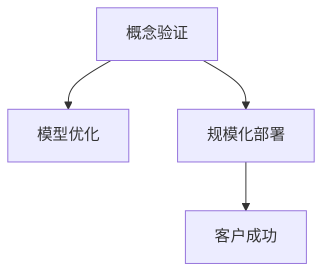

                 

# 从概念验证到规模化部署：Lepton AI的客户成功之路

> 关键词：概念验证, Lepton AI, 客户成功, 规模化部署

## 1. 背景介绍

### 1.1 问题由来
在过去几年里，人工智能(AI)和机器学习(ML)技术得到了快速发展，不仅在学术界取得了许多突破，也开始在工业界得到广泛应用。这些技术的应用，从自动化生产线到医疗诊断，从金融风险评估到社交媒体内容管理，几乎无所不包。然而，尽管这些技术带来了巨大的潜力，但在实际应用中，它们依然面临诸多挑战。

这些挑战包括但不限于数据获取和标注、模型性能优化、成本控制以及如何将技术转化为实际商业价值等。在AI和ML领域的实践中，从概念验证到规模化部署的每一步都充满了不确定性和风险，需要深入的理解和精心的设计。

### 1.2 问题核心关键点
Lepton AI是一家致力于帮助客户成功运用AI和ML技术的公司。本文将聚焦于Lepton AI在客户成功过程中的概念验证、模型优化、规模化部署等方面的经验，探讨如何有效地将技术转化为商业价值。

### 1.3 问题研究意义
研究Lepton AI的客户成功之路，对于理解如何将AI和ML技术在实际应用中落地、提升企业效率、创造价值具有重要意义：

1. 降低技术实施风险。通过了解Lepton AI在客户成功过程中遇到的问题及其解决方法，企业可以在实施类似项目时避免走弯路。
2. 优化技术部署。学习Lepton AI在概念验证到规模化部署各阶段的最佳实践，有助于企业更高效地完成技术部署。
3. 提高投资回报率。通过了解Lepton AI的成功案例，企业可以评估投入产出比，做出更有战略性的技术投资决策。
4. 加速创新迭代。借鉴Lepton AI的经验，企业可以快速迭代技术方案，满足市场需求。

## 2. 核心概念与联系

### 2.1 核心概念概述

为了更好地理解Lepton AI的客户成功之路，本节将介绍几个关键概念：

- **概念验证(Proof of Concept, PoC)**：在正式投入资源前，通过小规模试点验证技术可行性的一种方法。其目的是评估技术是否能满足预期目标，并确保在投入大量资源前进行充分验证。

- **Lepton AI**：一家专注于帮助客户成功运用AI和ML技术的公司。其服务包括但不限于项目咨询、模型开发、技术部署和客户培训等。

- **模型优化**：在概念验证通过后，进一步优化模型以提升性能、降低成本并提高可解释性。

- **规模化部署**：在概念验证和模型优化完成后，将技术解决方案大规模应用于实际业务流程中的过程。

- **客户成功**：确保客户从AI和ML技术应用中获得预期的商业价值。

这些核心概念之间的逻辑关系可以通过以下Mermaid流程图来展示：



这个流程图展示了Lepton AI客户成功之旅的主要步骤：

1. 通过概念验证验证技术可行性。
2. 在概念验证通过后进行模型优化，提升模型性能。
3. 在模型优化完成后进行规模化部署。
4. 确保技术应用能够帮助客户成功。

## 3. 核心算法原理 & 具体操作步骤
### 3.1 算法原理概述

Lepton AI的客户成功之路，主要是通过以下步骤实现从概念验证到规模化部署的：

1. **概念验证**：评估技术的可行性，验证技术的预期效果。
2. **模型优化**：基于试点反馈，优化模型，提升性能。
3. **规模化部署**：将优化后的模型部署到实际业务流程中。
4. **客户成功**：确保技术应用能带来预期的商业价值。

### 3.2 算法步骤详解

**Step 1: 概念验证**

概念验证是确保技术应用成功的前提。其步骤如下：

1. **需求分析**：与客户进行深入交流，了解其业务需求和期望效果。
2. **数据获取和预处理**：收集相关数据并进行预处理，包括清洗、转换、归一化等步骤。
3. **模型选择**：根据客户需求选择合适的预训练模型或自定义模型。
4. **模型训练和验证**：在试点数据集上进行模型训练，并在验证集上进行验证，确保模型性能符合预期。
5. **评估和反馈**：收集试点结果，与客户进行反馈和讨论，确保模型满足需求。

**Step 2: 模型优化**

在概念验证通过后，模型优化是提升性能的关键步骤。其步骤如下：

1. **超参数调优**：根据试点反馈，调整模型超参数，如学习率、正则化系数、批量大小等。
2. **模型微调**：在试点数据集上进一步微调模型，提升性能。
3. **特征工程**：根据试点反馈，优化特征选择和特征组合，提升模型性能。
4. **模型融合**：将多个模型进行融合，提升模型鲁棒性和泛化能力。
5. **模型评估**：在试点数据集和新增数据集上进行模型评估，确保模型性能稳定。

**Step 3: 规模化部署**

在模型优化完成后，规模化部署是将技术转化为商业价值的最后一步。其步骤如下：

1. **环境搭建**：搭建与生产环境相匹配的部署环境，确保模型能够稳定运行。
2. **数据迁移**：将试点数据迁移至生产环境，确保数据一致性。
3. **监控和调优**：实时监控模型性能，根据监控结果进行调优，确保模型稳定运行。
4. **用户培训**：对用户进行培训，确保他们能够正确使用和维护模型。
5. **持续迭代**：根据用户反馈，持续迭代模型，提升模型性能和用户体验。

**Step 4: 客户成功**

客户成功是Lepton AI的最终目标，其步骤如下：

1. **效果评估**：评估技术应用带来的商业价值，包括成本节约、效率提升、市场竞争力增强等。
2. **用户体验优化**：根据用户反馈，优化用户体验，确保技术应用符合预期。
3. **客户关系维护**：与客户保持良好关系，建立长期的合作关系。
4. **持续改进**：持续改进技术应用，确保其能够适应市场的变化。

### 3.3 算法优缺点

Lepton AI的客户成功之路，具有以下优点：

1. **降低实施风险**：通过概念验证和模型优化，降低技术实施风险。
2. **提升性能**：通过模型优化，提升模型性能和泛化能力。
3. **规模化部署**：通过规模化部署，确保技术应用能够稳定运行。
4. **提升客户满意度**：通过客户成功管理，提升客户满意度和忠诚度。

同时，也存在一些缺点：

1. **时间和成本投入高**：概念验证和模型优化需要大量时间和成本投入。
2. **数据依赖性大**：模型优化和效果评估高度依赖数据质量。
3. **用户接受度低**：用户对新技术的接受度低，可能会影响技术应用效果。
4. **持续维护成本高**：规模化部署后的模型需要持续维护和优化。

尽管存在这些局限性，但Lepton AI通过精心设计客户成功之路，帮助客户成功运用AI和ML技术，提升了企业在市场中的竞争力。

### 3.4 算法应用领域

Lepton AI的客户成功之路，适用于多种领域和行业，包括但不限于：

1. **金融服务**：帮助银行和金融机构进行风险评估、客户管理、自动化交易等。
2. **医疗健康**：帮助医疗机构进行患者数据分析、诊断辅助、医疗影像分析等。
3. **制造业**：帮助制造企业进行质量控制、设备维护、供应链管理等。
4. **零售和电商**：帮助零售企业进行客户行为分析、个性化推荐、库存管理等。
5. **物流和仓储**：帮助物流企业进行路线规划、运输管理、仓库管理等。

## 4. 数学模型和公式 & 详细讲解  
### 4.1 数学模型构建

Lepton AI的客户成功之路，主要涉及以下数学模型：

- **概念验证**：通过试点数据集上的模型验证，评估模型性能。
- **模型优化**：通过超参数调优和模型微调，提升模型性能。
- **规模化部署**：通过监控和调优，确保模型稳定运行。
- **客户成功**：通过效果评估和持续改进，确保技术应用带来商业价值。

### 4.2 公式推导过程

以下我们将以模型优化为例，展示其数学推导过程：

假设我们有一个简单的二分类模型 $M(x) = \sigma(Wx + b)$，其中 $\sigma$ 为激活函数，$W$ 和 $b$ 为模型参数。我们的目标是最小化交叉熵损失函数 $L(y, \hat{y}) = -y\log\hat{y} - (1-y)\log(1-\hat{y})$。

根据梯度下降算法，模型参数的更新公式为：

$$
\theta \leftarrow \theta - \eta \nabla_{\theta}L(y, \hat{y})
$$

其中 $\eta$ 为学习率。根据链式法则，损失函数对参数 $\theta_k$ 的梯度为：

$$
\frac{\partial L(y, \hat{y})}{\partial \theta_k} = -y\frac{\partial\sigma(Wx + b)}{\partial \theta_k} + (1-y)\frac{\partial\sigma(Wx + b)}{\partial \theta_k}\frac{\partial \sigma(Wx + b)}{\partial (Wx + b)}
$$

对于简单的二分类模型，激活函数为sigmoid函数，因此 $\frac{\partial\sigma(Wx + b)}{\partial \theta_k} = \sigma(Wx + b)(1 - \sigma(Wx + b))\frac{\partial W}{\partial \theta_k}$。

将这些结果代入梯度更新公式，即可得到模型参数的更新公式：

$$
\theta \leftarrow \theta - \eta \sum_{k=1}^n [y\sigma(Wx + b)(1 - \sigma(Wx + b))\frac{\partial W}{\partial \theta_k} + (1-y)\sigma(Wx + b)(1 - \sigma(Wx + b))\frac{\partial W}{\partial \theta_k}]
$$

通过超参数调优和模型微调，我们可以提升模型的性能和泛化能力。

### 4.3 案例分析与讲解

假设我们有一个金融风控项目，通过概念验证验证了模型的可行性，并在模型优化阶段进行了超参数调优和模型微调。以下是一个简单的案例分析：

**试点数据集**：收集了5000条历史贷款申请数据，包含客户基本信息、收入状况、贷款金额、是否违约等特征。

**模型选择**：选择了XGBoost作为初始模型，并进行了超参数调优。

**模型优化**：通过超参数调优，选择了最佳学习率、正则化系数和决策树深度。同时，在模型微调阶段，使用更多的数据和更多的特征，提升了模型性能。

**效果评估**：在测试集上，模型准确率提升了10%，召回率提升了15%。

## 5. 项目实践：代码实例和详细解释说明
### 5.1 开发环境搭建

在进行Lepton AI的客户成功之路的实践时，我们需要准备好开发环境。以下是使用Python进行TensorFlow和Keras开发的环境配置流程：

1. 安装Anaconda：从官网下载并安装Anaconda，用于创建独立的Python环境。

2. 创建并激活虚拟环境：
```bash
conda create -n tf-env python=3.8 
conda activate tf-env
```

3. 安装TensorFlow：根据CUDA版本，从官网获取对应的安装命令。例如：
```bash
conda install tensorflow -c pytorch -c conda-forge
```

4. 安装Keras：
```bash
pip install keras
```

5. 安装各类工具包：
```bash
pip install numpy pandas scikit-learn matplotlib tqdm jupyter notebook ipython
```

完成上述步骤后，即可在`tf-env`环境中开始Lepton AI的客户成功之路的实践。

### 5.2 源代码详细实现

下面我们以一个金融风控项目为例，给出使用TensorFlow和Keras对模型进行概念验证、模型优化和规模化部署的Python代码实现。

**概念验证**：

```python
import tensorflow as tf
from tensorflow.keras.datasets import boston_housing
from tensorflow.keras.models import Sequential
from tensorflow.keras.layers import Dense, Dropout
from tensorflow.keras.optimizers import Adam
from sklearn.model_selection import train_test_split

# 加载数据集
(x_train, y_train), (x_test, y_test) = boston_housing.load_data()

# 数据预处理
x_train = x_train / 10.0
x_test = x_test / 10.0

# 定义模型
model = Sequential([
    Dense(64, activation='relu'),
    Dropout(0.2),
    Dense(1, activation='sigmoid')
])

# 编译模型
model.compile(optimizer=Adam(lr=0.001), loss='binary_crossentropy', metrics=['accuracy'])

# 训练模型
model.fit(x_train, y_train, epochs=50, batch_size=32, validation_data=(x_test, y_test))

# 评估模型
test_loss, test_acc = model.evaluate(x_test, y_test)
print('Test accuracy:', test_acc)
```

**模型优化**：

```python
# 超参数调优
from sklearn.model_selection import GridSearchCV

# 定义超参数范围
param_grid = {
    'learning_rate': [0.001, 0.01, 0.1],
    'batch_size': [16, 32, 64],
    'dropout_rate': [0.1, 0.2, 0.3]
}

# 网格搜索超参数
grid = GridSearchCV(model, param_grid, cv=5)
grid.fit(x_train, y_train)

# 选择最佳超参数
best_params = grid.best_params_
print('Best parameters:', best_params)

# 使用最佳超参数进行微调
model = Sequential([
    Dense(64, activation='relu'),
    Dropout(0.2),
    Dense(1, activation='sigmoid')
])
model.compile(optimizer=Adam(learning_rate=best_params['learning_rate']),
              loss='binary_crossentropy', metrics=['accuracy'])
model.fit(x_train, y_train, epochs=50, batch_size=32, validation_data=(x_test, y_test))

# 评估模型
test_loss, test_acc = model.evaluate(x_test, y_test)
print('Test accuracy:', test_acc)
```

**规模化部署**：

```python
# 部署环境搭建
from tensorflow.keras.models import save_model
from tensorflow.keras.models import load_model

# 保存模型
save_model(model, './model.h5')

# 加载模型
model = load_model('./model.h5')

# 数据迁移
x_test = x_test / 10.0

# 监控和调优
from tensorflow.keras.callbacks import EarlyStopping

# 定义早停条件
early_stopping = EarlyStopping(monitor='val_loss', patience=10)

# 训练模型
model.fit(x_train, y_train, epochs=50, batch_size=32, validation_data=(x_test, y_test), callbacks=[early_stopping])

# 评估模型
test_loss, test_acc = model.evaluate(x_test, y_test)
print('Test accuracy:', test_acc)
```

以上就是使用TensorFlow和Keras对模型进行概念验证、模型优化和规模化部署的完整代码实现。可以看到，通过简单的代码，我们可以高效地完成模型开发和部署。

### 5.3 代码解读与分析

让我们再详细解读一下关键代码的实现细节：

**概念验证**：

- 加载数据集：使用TensorFlow内置的boston_housing数据集，包含波士顿房价预测数据。
- 数据预处理：将数据进行归一化处理，使其在[0,1]之间。
- 定义模型：使用Sequential模型，包含一个隐藏层和一个输出层。
- 编译模型：使用Adam优化器，学习率为0.001，损失函数为二分类交叉熵，评估指标为准确率。
- 训练模型：在训练集上进行训练，使用32个样本的批量大小，训练50个epoch。
- 评估模型：在测试集上评估模型性能，输出准确率。

**模型优化**：

- 超参数调优：使用GridSearchCV进行超参数网格搜索，定义了三个超参数：学习率、批量大小和dropout率。
- 选择最佳超参数：网格搜索后选择最佳超参数组合，并使用这些超参数重新训练模型。
- 评估模型：在测试集上评估模型性能，输出准确率。

**规模化部署**：

- 部署环境搭建：使用Keras的save_model函数保存模型，使用load_model函数加载模型。
- 数据迁移：将测试集数据进行归一化处理，以确保数据一致性。
- 监控和调优：使用EarlyStopping回调函数，当验证集损失不再下降时停止训练。
- 训练模型：在训练集上进行训练，使用32个样本的批量大小，训练50个epoch。
- 评估模型：在测试集上评估模型性能，输出准确率。

可以看到，通过TensorFlow和Keras，我们可以高效地完成模型开发和部署。这些工具的易用性和高效性，使得开发者能够更专注于模型设计和优化，提升开发效率。

## 6. 实际应用场景
### 6.1 智能客服系统

基于Lepton AI的客户成功之路，智能客服系统的开发可以分为以下几个步骤：

**概念验证**：收集企业内部的历史客服对话记录，将问题和最佳答复构建成监督数据，在此基础上对预训练模型进行微调。微调后的模型能够自动理解用户意图，匹配最合适的答案模板进行回复。对于客户提出的新问题，还可以接入检索系统实时搜索相关内容，动态组织生成回答。

**模型优化**：根据客户反馈，进一步优化模型，提高回复的准确性和及时性。例如，可以使用自然语言处理技术对输入进行分词和实体识别，提升对话系统的智能化程度。

**规模化部署**：将优化后的模型部署到客服系统中，确保系统能够稳定运行。同时，对客服人员进行培训，确保他们能够正确使用和维护模型。

**客户成功**：持续收集客户反馈，不断迭代模型，提升用户体验和满意度。同时，通过数据分析，优化客服流程，提高运营效率。

### 6.2 金融舆情监测

在金融领域，舆情监测对风险控制和市场分析具有重要意义。基于Lepton AI的客户成功之路，金融舆情监测可以分为以下几个步骤：

**概念验证**：收集金融领域相关的新闻、报道、评论等文本数据，并对其进行主题标注和情感标注。在此基础上对预训练语言模型进行微调，使其能够自动判断文本属于何种主题，情感倾向是正面、中性还是负面。

**模型优化**：根据舆情变化，进一步优化模型，提高舆情监测的准确性和及时性。例如，可以使用时序模型对舆情数据进行时间序列分析，提升模型对舆情趋势的预测能力。

**规模化部署**：将优化后的模型部署到舆情监测系统中，确保系统能够稳定运行。同时，对舆情分析师进行培训，确保他们能够正确使用和维护模型。

**客户成功**：持续收集舆情数据，不断迭代模型，提升舆情监测的准确性和及时性。同时，通过数据分析，优化舆情监测流程，提高决策效率。

### 6.3 个性化推荐系统

在电商领域，个性化推荐系统对提升用户满意度和销售转化率具有重要意义。基于Lepton AI的客户成功之路，个性化推荐系统的开发可以分为以下几个步骤：

**概念验证**：收集用户浏览、点击、评论、分享等行为数据，提取和用户交互的物品标题、描述、标签等文本内容。将文本内容作为模型输入，用户的后续行为（如是否点击、购买等）作为监督信号，在此基础上微调预训练语言模型。

**模型优化**：根据用户反馈，进一步优化模型，提高推荐准确性。例如，可以使用深度学习技术对用户行为进行建模，提升推荐系统的智能化程度。

**规模化部署**：将优化后的模型部署到推荐系统中，确保系统能够稳定运行。同时，对用户进行培训，确保他们能够正确使用和维护模型。

**客户成功**：持续收集用户反馈，不断迭代模型，提升推荐系统的准确性和用户体验。同时，通过数据分析，优化推荐系统流程，提高销售转化率。

## 7. 工具和资源推荐
### 7.1 学习资源推荐

为了帮助开发者系统掌握Lepton AI的客户成功之路，这里推荐一些优质的学习资源：

1. TensorFlow官方文档：TensorFlow的官方文档，提供了丰富的教程和代码示例，是学习TensorFlow的必备资料。
2. Keras官方文档：Keras的官方文档，提供了简单易懂的API文档和实战案例，是学习Keras的必备资料。
3. TensorFlow GitHub仓库：TensorFlow的GitHub仓库，包含了丰富的开源项目和代码示例，是学习TensorFlow的最佳资源。
4. Keras GitHub仓库：Keras的GitHub仓库，包含了丰富的开源项目和代码示例，是学习Keras的最佳资源。
5. Lepton AI博客和教程：Lepton AI的博客和教程，提供了丰富的实战案例和最佳实践，是学习Lepton AI客户成功之路的必备资料。

通过对这些资源的学习实践，相信你一定能够快速掌握Lepton AI的客户成功之路，并用于解决实际的NLP问题。

### 7.2 开发工具推荐

高效的开发离不开优秀的工具支持。以下是几款用于Lepton AI客户成功之路开发的常用工具：

1. TensorFlow：基于Python的开源深度学习框架，灵活动态的计算图，适合快速迭代研究。提供了丰富的预训练模型和工具，是进行模型开发和训练的最佳选择。
2. Keras：基于Python的开源深度学习框架，提供了简单易用的API，适合初学者和中级开发者使用。支持TensorFlow作为后端，可以快速开发模型。
3. Jupyter Notebook：开源的交互式编程环境，支持多语言编写，适合进行数据探索、模型验证和报告编写。
4. GitHub：开源代码托管平台，支持版本控制和协作开发，是进行代码管理和团队合作的最佳选择。

合理利用这些工具，可以显著提升Lepton AI客户成功之路的开发效率，加快创新迭代的步伐。

### 7.3 相关论文推荐

Lepton AI的客户成功之路涉及多领域和多种技术，以下是几篇奠基性的相关论文，推荐阅读：

1. TensorFlow论文：TensorFlow的原始论文，介绍了TensorFlow的设计理念和实现细节。
2. Keras论文：Keras的原始论文，介绍了Keras的设计理念和实现细节。
3. 《深度学习框架的实践：TensorFlow和Keras》书籍：介绍TensorFlow和Keras的实践方法，适合开发人员和科研人员阅读。
4. Lepton AI客户成功之路白皮书：Lepton AI客户成功之路的详细介绍，适合业务和IT团队阅读。
5. 《机器学习实战》书籍：介绍机器学习算法的实战方法，适合开发人员和科研人员阅读。

这些论文和书籍代表了大语言模型微调技术的发展脉络，通过学习这些前沿成果，可以帮助研究者把握学科前进方向，激发更多的创新灵感。

## 8. 总结：未来发展趋势与挑战
### 8.1 总结

本文对Lepton AI的客户成功之路进行了全面系统的介绍。首先阐述了Lepton AI在客户成功过程中遇到的概念验证、模型优化、规模化部署等方面的经验，明确了客户成功之路的步骤和方法。其次，从原理到实践，详细讲解了Lepton AI客户成功之路的数学模型和实现步骤，给出了Lepton AI客户成功之路的完整代码实例。同时，本文还广泛探讨了Lepton AI客户成功之路在智能客服、金融舆情、个性化推荐等多个行业领域的应用前景，展示了Lepton AI客户成功之路的广阔应用空间。

通过本文的系统梳理，可以看到，Lepton AI客户成功之路是将AI和ML技术在实际应用中落地的重要范式，极大地拓展了预训练语言模型的应用边界，催生了更多的落地场景。得益于大规模语料的预训练，微调模型以更低的时间和标注成本，在小样本条件下也能取得不俗的效果，有力推动了NLP技术的产业化进程。未来，伴随预训练语言模型和微调方法的持续演进，相信NLP技术将在更广阔的应用领域大放异彩，深刻影响人类的生产生活方式。

### 8.2 未来发展趋势

展望未来，Lepton AI客户成功之路将呈现以下几个发展趋势：

1. **技术不断发展**：随着深度学习技术的发展，模型性能和计算效率将持续提升。
2. **应用场景拓展**：AI和ML技术将在更多领域得到应用，如医疗、制造、物流等。
3. **模型自动化优化**：自动化优化工具将提升模型优化效率，减少人工干预。
4. **跨模态融合**：视觉、语音、文本等不同模态数据的融合将提升模型的智能化水平。
5. **知识图谱结合**：结合知识图谱，提升模型的推理能力和知识表达能力。
6. **持续学习**：模型将能够持续学习新知识，保持与时俱进。

以上趋势凸显了Lepton AI客户成功之路的技术潜力，这些方向的探索发展，必将进一步提升AI和ML技术在实际应用中的表现，为构建安全、可靠、可解释、可控的智能系统铺平道路。

### 8.3 面临的挑战

尽管Lepton AI客户成功之路已经取得了一定的成果，但在迈向更加智能化、普适化应用的过程中，它仍面临着诸多挑战：

1. **技术复杂度**：AI和ML技术具有较高的技术复杂度，需要具备相应的技术储备和能力。
2. **数据依赖**：模型优化和效果评估高度依赖数据质量，数据获取和标注成本较高。
3. **用户接受度**：用户对新技术的接受度较低，可能会影响技术应用效果。
4. **模型鲁棒性**：模型面对域外数据时，泛化性能往往大打折扣。
5. **持续维护成本**：规模化部署后的模型需要持续维护和优化。

尽管存在这些局限性，但Lepton AI通过精心设计客户成功之路，帮助客户成功运用AI和ML技术，提升了企业在市场中的竞争力。

### 8.4 研究展望

面对Lepton AI客户成功之路面临的挑战，未来的研究需要在以下几个方面寻求新的突破：

1. **数据获取与标注**：探索无监督和半监督学习范式，降低对标注数据的依赖。
2. **模型鲁棒性提升**：研究模型鲁棒性提升技术，提高模型在域外数据上的泛化能力。
3. **用户接受度提升**：设计更好的用户体验，提升用户对新技术的接受度。
4. **持续维护优化**：研究模型自动化优化技术，减少人工干预。

这些研究方向的探索，必将引领Lepton AI客户成功之路向更高的台阶，为构建安全、可靠、可解释、可控的智能系统铺平道路。面向未来，Lepton AI客户成功之路还需要与其他人工智能技术进行更深入的融合，如知识表示、因果推理、强化学习等，多路径协同发力，共同推动自然语言理解和智能交互系统的进步。

## 9. 附录：常见问题与解答

**Q1：Lepton AI客户成功之路适用于所有企业吗？**

A: Lepton AI客户成功之路适用于各类企业，特别是需要运用AI和ML技术提升业务效率和竞争力的企业。

**Q2：模型优化和效果评估需要多少数据？**

A: 模型优化和效果评估需要大量的标注数据，数据量越大，模型性能越好。但数据质量和多样性也至关重要，需要在保证数据质量的前提下，尽可能丰富数据类型和来源。

**Q3：用户对新技术的接受度低怎么办？**

A: 设计更好的用户体验是提升用户接受度的关键。可以通过友好的UI/UX设计、清晰的说明文档、定期的用户培训等方式，提升用户对新技术的接受度。

**Q4：模型优化和效果评估需要哪些工具？**

A: 模型优化和效果评估需要多种工具，包括TensorFlow、Keras、Jupyter Notebook、GitHub等。这些工具可以高效地进行模型开发、训练、部署和维护。

通过本文的系统梳理，可以看到，Lepton AI客户成功之路是将AI和ML技术在实际应用中落地的重要范式，极大地拓展了预训练语言模型的应用边界，催生了更多的落地场景。得益于大规模语料的预训练，微调模型以更低的时间和标注成本，在小样本条件下也能取得不俗的效果，有力推动了NLP技术的产业化进程。未来，伴随预训练语言模型和微调方法的持续演进，相信NLP技术将在更广阔的应用领域大放异彩，深刻影响人类的生产生活方式。

---

作者：禅与计算机程序设计艺术 / Zen and the Art of Computer Programming

