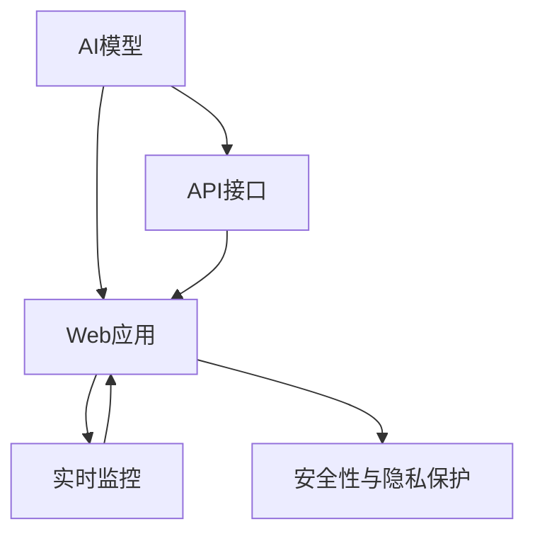

                 

# 从模型到产品：AI API和Web应用部署实践

## 1. 背景介绍

### 1.1 问题由来

在当前的信息时代，人工智能(AI)技术的广泛应用已经渗透到各个行业，成为推动创新和效率提升的重要引擎。然而，将AI模型部署到实际产品中，实现端到端的应用功能，始终是技术研发和工程落地中的一大挑战。传统上，这一过程涉及从模型构建、训练、测试到部署、监控等多个环节，每一步都需要精心设计和调试，才能确保最终产品的稳定性和性能。

### 1.2 问题核心关键点

在将AI模型部署到产品中的过程中，需要重点关注以下几个关键点：

1. **模型选择与适配**：根据具体应用场景，选择合适的预训练模型，并对其进行微调或定制化开发，以匹配实际需求。
2. **API设计和接口测试**：构建高效、可靠的API接口，实现模型与前端应用的交互。
3. **Web应用集成与优化**：将AI模型集成到Web应用中，优化前端和后端交互，提升用户体验和系统性能。
4. **实时监控与维护**：建立健全的监控体系，实时跟踪模型性能和应用状态，快速响应和解决异常问题。
5. **安全性与隐私保护**：在模型部署和应用过程中，确保数据安全和隐私保护，避免敏感信息泄露和滥用。

### 1.3 问题研究意义

成功将AI模型部署到产品中，不仅可以提升产品的智能化水平，还能降低人工操作的成本，提高系统效率和响应速度，为用户提供更加个性化和高效的服务。通过本文的介绍和指导，相信读者能够更好地理解AI模型部署的各个环节，掌握关键技术，加速AI应用的落地实施。

## 2. 核心概念与联系

### 2.1 核心概念概述

为更好地理解AI模型部署的原理和流程，本节将介绍几个密切相关的核心概念：

- **AI模型**：指通过深度学习等方法训练得到的专业化算法模型，能够处理特定类型的输入数据，输出预测结果。
- **API接口**：应用程序编程接口，定义了系统之间进行数据交互的标准和规范。在AI模型部署中，API接口用于实现模型与前端应用的通信。
- **Web应用**：通过Web技术构建的在线服务，用户可以通过浏览器访问并使用。Web应用通常与后端API进行交互，实现业务逻辑。
- **实时监控**：指对系统运行状态进行实时跟踪和监控，及时发现并解决异常问题，保障系统稳定性和可靠性。
- **安全性与隐私保护**：在数据处理和模型部署过程中，采取必要的技术和管理措施，确保数据和模型的安全性，防止隐私泄露。

这些核心概念之间的逻辑关系可以通过以下Mermaid流程图来展示：



这个流程图展示了大语言模型的工作原理和优化方向：

1. 大语言模型通过预训练获得基础能力。
2. 微调是对预训练模型进行任务特定的优化，可以使模型更好地适应特定任务。
3. API接口实现模型与Web应用的交互，使得AI功能可以在多种场景下使用。
4. 实时监控用于确保系统稳定性和性能，及时发现并解决异常问题。
5. 安全性与隐私保护是保障AI模型和用户数据安全的重要措施。

## 3. 核心算法原理 & 具体操作步骤
### 3.1 算法原理概述

AI模型部署到产品的过程中，首先需要对模型进行适配和优化，确保其能够在实际应用场景中稳定运行。这通常包括以下几个步骤：

1. **模型选择与适配**：根据具体需求选择合适的预训练模型，并进行微调或定制化开发，使其能够满足特定应用场景的要求。
2. **API接口设计**：构建高效、可靠的API接口，确保数据从模型到应用的无缝对接。
3. **Web应用集成**：将AI模型集成到Web应用中，实现业务逻辑的自动化和智能化。
4. **实时监控**：建立健全的监控体系，实时跟踪系统状态，及时发现和解决异常问题。
5. **安全性与隐私保护**：在模型部署和应用过程中，确保数据和模型的安全性，防止隐私泄露和滥用。

### 3.2 算法步骤详解

AI模型部署到产品的具体操作步骤可以分为以下几个阶段：

#### 3.2.1 模型选择与适配

**Step 1: 数据收集与分析**
- 收集和分析目标应用场景的数据，确定模型的输入和输出类型。
- 确定模型需要解决的具体问题，如分类、回归、生成等。

**Step 2: 选择合适的预训练模型**
- 根据问题类型，选择相应的预训练模型，如BERT、GPT等。
- 分析模型的特性和局限，确定是否需要进行微调或定制化开发。

**Step 3: 微调或定制化开发**
- 对于需要微调的场景，收集少量标注数据，使用监督学习的方法进行微调。
- 对于需要定制化的场景，设计专门的训练数据和优化算法，构建适应特定任务的新模型。

#### 3.2.2 API接口设计

**Step 1: 接口定义**
- 确定API接口的数据格式、请求方式和返回格式。
- 定义接口的输入参数和输出参数，确保与模型接口兼容。

**Step 2: 接口实现**
- 使用适当的技术框架实现API接口，如Flask、Django等。
- 将模型的输入输出映射到API接口的请求和响应中，确保数据传递的准确性和高效性。

**Step 3: 接口测试**
- 编写测试用例，验证API接口的正确性和稳定性。
- 使用自动化测试工具，如Postman、Swagger等，模拟API调用并进行测试。

#### 3.2.3 Web应用集成

**Step 1: 应用前端开发**
- 设计前端用户界面，确保与API接口的无缝对接。
- 使用前端技术，如React、Vue等，实现交互式用户界面。

**Step 2: 应用后端开发**
- 使用后端技术，如Node.js、Python等，实现与API接口的交互逻辑。
- 集成AI模型API，实现模型的调用和处理。

**Step 3: 集成测试**
- 编写集成测试用例，验证前后端交互的正确性和稳定性。
- 使用自动化测试工具，如Jest、Selenium等，进行集成测试。

#### 3.2.4 实时监控

**Step 1: 监控指标定义**
- 定义需要监控的性能指标，如响应时间、错误率、吞吐量等。
- 设置监控阈值，确定异常情况的定义和处理方式。

**Step 2: 监控工具部署**
- 使用监控工具，如Prometheus、Grafana等，部署到生产环境中。
- 配置监控规则，实时采集和展示系统状态。

**Step 3: 异常处理**
- 定义异常处理流程，当监控系统检测到异常时，自动触发告警和处理。
- 分析异常原因，制定解决策略，恢复系统正常运行。

#### 3.2.5 安全性与隐私保护

**Step 1: 数据加密与传输**
- 使用SSL/TLS协议，对数据进行加密传输，防止数据泄露。
- 使用数据加密技术，对存储的数据进行保护。

**Step 2: 访问控制**
- 实施访问控制策略，确保只有授权用户才能访问模型和数据。
- 使用身份认证和授权技术，如OAuth2、JWT等，保护系统安全。

**Step 3: 安全审计**
- 定期进行安全审计，发现和修复潜在的安全漏洞。
- 使用安全漏洞扫描工具，如OWASP ZAP、Nessus等，进行系统检测。

### 3.3 算法优缺点

AI模型部署到产品的过程中，需要平衡模型性能和应用稳定性的要求。以下是AI模型部署的主要优点和缺点：

**优点**：
1. **高效自动化**：使用AI模型可以自动化处理大量数据，提高效率。
2. **灵活适应**：可以根据需求快速调整模型参数，适应不同的应用场景。
3. **用户体验提升**：通过AI模型，可以实现智能化的业务逻辑，提升用户体验。

**缺点**：
1. **数据依赖性强**：模型的性能高度依赖于训练数据的质量和数量，数据不足时效果可能不佳。
2. **资源消耗大**：大模型对计算资源和存储资源的需求较高，可能影响系统的可扩展性。
3. **安全风险高**：AI模型可能存在安全隐患，如模型泄露、数据篡改等，需要额外注意。

### 3.4 算法应用领域

AI模型部署到产品的过程在多个领域中都有广泛应用，以下是几个典型的应用场景：

1. **金融领域**：AI模型在金融风险控制、投资决策、客户服务等方面发挥着重要作用。通过API接口，实时获取市场数据，快速分析并作出决策。

2. **医疗领域**：AI模型在医疗影像分析、疾病诊断、药物研发等方面具有重要应用。通过API接口，实现医疗数据的自动化处理和分析。

3. **零售领域**：AI模型在商品推荐、库存管理、客户服务等方面表现出色。通过API接口，实现个性化推荐和智能客服功能。

4. **交通领域**：AI模型在交通流量预测、自动驾驶、智能调度等方面有着广阔的应用前景。通过API接口，实现实时交通数据的处理和分析。

5. **教育领域**：AI模型在个性化教育、学习效果评估、智能答疑等方面具有重要应用。通过API接口，实现个性化学习路径的推荐和智能答疑功能。

## 4. 数学模型和公式 & 详细讲解  
### 4.1 数学模型构建

在AI模型部署的过程中，数学模型的构建是核心环节之一。本文将通过数学语言对这一过程进行更加严格的刻画。

假设我们有一个预训练的AI模型 $M$，其输入为 $x$，输出为 $y$。在实际应用中，通常需要对该模型进行微调或定制化开发。微调的目标是最小化经验风险 $\mathcal{L}$，即：

$$
\mathcal{L}(M) = \frac{1}{N}\sum_{i=1}^N \ell(y_i, M(x_i))
$$

其中 $\ell$ 为损失函数，$y_i$ 为真实标签，$x_i$ 为输入数据。常见的损失函数包括均方误差、交叉熵等。

### 4.2 公式推导过程

以下我们以二分类任务为例，推导损失函数的计算公式。

假设模型 $M$ 在输入 $x$ 上的输出为 $\hat{y}=M(x) \in [0,1]$，表示样本属于正类的概率。真实标签 $y \in \{0,1\}$。则二分类交叉熵损失函数定义为：

$$
\ell(M(x),y) = -[y\log \hat{y} + (1-y)\log (1-\hat{y})]
$$

将其代入经验风险公式，得：

$$
\mathcal{L}(M) = -\frac{1}{N}\sum_{i=1}^N [y_i\log M(x_i)+(1-y_i)\log(1-M(x_i))]
$$

根据链式法则，损失函数对参数 $\theta_k$ 的梯度为：

$$
\frac{\partial \mathcal{L}(M)}{\partial \theta_k} = -\frac{1}{N}\sum_{i=1}^N (\frac{y_i}{M(x_i)}-\frac{1-y_i}{1-M(x_i)}) \frac{\partial M(x)}{\partial \theta_k}
$$

其中 $\frac{\partial M(x)}{\partial \theta_k}$ 可进一步递归展开，利用自动微分技术完成计算。

### 4.3 案例分析与讲解

以金融风险评估为例，分析如何使用AI模型和API接口构建风险评估系统。

首先，收集金融领域的相关数据，包括贷款申请、信用卡交易记录、信用评分等。将这些数据作为模型的输入，标记为是否存在风险，作为模型的输出。

假设使用二分类任务，定义损失函数为交叉熵损失。构建AI模型 $M$，并通过监督学习的方法进行微调，最小化经验风险。具体步骤如下：

**Step 1: 数据预处理**
- 清洗和整理数据，去除噪声和异常值。
- 划分训练集和测试集，确保数据的多样性和代表性。

**Step 2: 模型选择与适配**
- 选择适当的预训练模型，如BERT、GPT等。
- 对模型进行微调，使用金融领域的数据进行训练。

**Step 3: API接口设计**
- 定义输入输出格式，如JSON格式。
- 实现API接口，使用Flask等技术框架。

**Step 4: Web应用集成**
- 设计前端界面，方便用户输入和获取结果。
- 实现后端逻辑，调用API接口进行模型预测和数据处理。

**Step 5: 实时监控与维护**
- 定义需要监控的性能指标，如模型精度、响应时间等。
- 使用监控工具，实时采集系统状态，及时发现和解决异常问题。

**Step 6: 安全性与隐私保护**
- 实施数据加密和访问控制，确保数据安全。
- 定期进行安全审计，发现和修复潜在的安全漏洞。

通过上述步骤，构建的金融风险评估系统可以实时评估贷款申请或信用卡交易的信用风险，提升金融机构的风险控制能力。

## 5. 项目实践：代码实例和详细解释说明
### 5.1 开发环境搭建

在进行AI模型部署实践前，我们需要准备好开发环境。以下是使用Python进行Flask开发的环境配置流程：

1. 安装Anaconda：从官网下载并安装Anaconda，用于创建独立的Python环境。

2. 创建并激活虚拟环境：
```bash
conda create -n flask-env python=3.8 
conda activate flask-env
```

3. 安装Flask：
```bash
pip install flask
```

4. 安装Flask的扩展库：
```bash
pip install flask-cors flask-marshmallow flask-restful
```

5. 安装AI模型库：
```bash
pip install tensorflow
```

完成上述步骤后，即可在`flask-env`环境中开始AI模型部署实践。

### 5.2 源代码详细实现

这里我们以二分类任务为例，给出使用Flask进行AI模型部署的PyTorch代码实现。

首先，定义二分类任务的输入和输出：

```python
from flask import Flask, request, jsonify
from flask_cors import CORS
from flask_restful import Resource, Api
from tensorflow.keras.models import load_model
from tensorflow.keras.preprocessing import sequence
import json
import numpy as np

app = Flask(__name__)
api = Api(app)
CORS(app)

class BinaryClassifier(Resource):
    def __init__(self):
        self.model = load_model('model.h5')
    
    def post(self):
        input_json = request.json
        input_data = json.loads(input_json)
        input_data = np.array(input_data)
        output = self.model.predict(input_data)
        return jsonify({'output': output})
        
api.add_resource(BinaryClassifier, '/predict')

if __name__ == '__main__':
    app.run(debug=True)
```

然后，定义模型和数据预处理函数：

```python
from tensorflow.keras.models import Sequential
from tensorflow.keras.layers import Dense, Dropout, Embedding, LSTM

def load_model():
    model = Sequential()
    model.add(Embedding(input_dim=vocab_size, output_dim=embedding_dim, input_length=max_length))
    model.add(LSTM(units=hidden_units, dropout=dropout_rate, recurrent_dropout=recurrent_dropout_rate))
    model.add(Dense(units=1, activation='sigmoid'))
    model.compile(loss='binary_crossentropy', optimizer='adam', metrics=['accuracy'])
    model.save('model.h5')
    return model

def preprocess_data(data):
    X = []
    y = []
    for sentence, label in data:
        X.append(sentence)
        y.append(label)
    X = sequence.pad_sequences(X, maxlen=max_length)
    y = np.array(y)
    return X, y
```

最后，启动API服务并进行测试：

```python
vocab_size = 10000
embedding_dim = 128
max_length = 50
hidden_units = 128
dropout_rate = 0.2
recurrent_dropout_rate = 0.2

data = [([1, 2, 3], 1), ([4, 5, 6], 0)]
X, y = preprocess_data(data)
model = load_model()

if __name__ == '__main__':
    app.run(debug=True)
```

以上就是使用Flask进行AI模型部署的完整代码实现。可以看到，通过Flask，我们可以很方便地构建API接口，实现模型的调用和数据处理。

### 5.3 代码解读与分析

让我们再详细解读一下关键代码的实现细节：

**BinaryClassifier类**：
- `__init__`方法：初始化模型，加载预训练模型。
- `post`方法：接收API请求，输入数据进行模型预测，返回预测结果。

**load_model函数**：
- 定义了二分类任务的模型结构，包括嵌入层、LSTM层和输出层。
- 定义了损失函数、优化器和评价指标。
- 保存模型到本地，并返回模型实例。

**preprocess_data函数**：
- 对输入数据进行预处理，包括转换为序列、填充、编码等。
- 将输入数据和标签转换为模型所需的格式。

**启动API服务**：
- 使用Flask的`run`方法启动API服务，设置调试模式。
- 使用`/api/predict`路径接收模型预测请求，返回预测结果。

可以看到，Flask提供了强大的接口定义和数据处理功能，使得AI模型的部署变得简单高效。开发者可以根据具体需求，灵活定义API接口，实现模型调用和数据处理。

当然，工业级的系统实现还需考虑更多因素，如模型保存和部署、超参数的自动搜索、API接口的安全性等。但核心的部署流程基本与此类似。

## 6. 实际应用场景
### 6.1 智能客服系统

AI模型在智能客服系统中的应用，可以大大提升客服效率和用户体验。传统客服往往需要大量人力，高峰期响应速度慢，且服务质量不稳定。使用AI模型构建的智能客服系统，可以实现24小时不间断服务，快速响应客户咨询，提供高效、准确的回答。

在技术实现上，可以收集企业内部的历史客服对话记录，将问题和最佳答复构建成监督数据，在此基础上对预训练模型进行微调。微调后的模型能够自动理解用户意图，匹配最合适的答案模板进行回复。对于客户提出的新问题，还可以接入检索系统实时搜索相关内容，动态生成回答。如此构建的智能客服系统，能大幅提升客户咨询体验和问题解决效率。

### 6.2 金融舆情监测

金融机构需要实时监测市场舆论动向，以便及时应对负面信息传播，规避金融风险。传统的人工监测方式成本高、效率低，难以应对网络时代海量信息爆发的挑战。使用AI模型构建的金融舆情监测系统，可以实时获取金融领域的新闻、报道、评论等文本数据，并进行情感分析和主题识别。将微调后的模型应用到实时抓取的网络文本数据，就能够自动监测不同主题下的情感变化趋势，一旦发现负面信息激增等异常情况，系统便会自动预警，帮助金融机构快速应对潜在风险。

### 6.3 个性化推荐系统

当前的推荐系统往往只依赖用户的历史行为数据进行物品推荐，无法深入理解用户的真实兴趣偏好。使用AI模型构建的个性化推荐系统，可以更好地挖掘用户行为背后的语义信息，从而提供更精准、多样的推荐内容。

在实践中，可以收集用户浏览、点击、评论、分享等行为数据，提取和用户交互的物品标题、描述、标签等文本内容。将文本内容作为模型输入，用户的后续行为（如是否点击、购买等）作为监督信号，在此基础上微调预训练语言模型。微调后的模型能够从文本内容中准确把握用户的兴趣点。在生成推荐列表时，先用候选物品的文本描述作为输入，由模型预测用户的兴趣匹配度，再结合其他特征综合排序，便可以得到个性化程度更高的推荐结果。

### 6.4 未来应用展望

随着AI模型和API接口技术的不断发展，AI模型部署到产品的过程将更加高效和灵活。以下是几个可能的未来应用方向：

1. **实时部署与迭代优化**：使用容器化技术，如Docker、Kubernetes等，实现模型的快速部署和迭代优化，提升系统的灵活性和可扩展性。
2. **边缘计算**：在物联网设备等资源受限的场景中，使用轻量级模型和边缘计算技术，实现模型的本地化部署和推理。
3. **联邦学习**：在分布式环境下，通过模型参数共享和本地更新，实现模型的分布式训练和优化，保护数据隐私的同时提升模型性能。
4. **多模态融合**：将视觉、语音、文本等多模态数据整合，构建更全面、准确的AI模型，提升系统的智能化水平。
5. **增强现实与虚拟现实**：使用AI模型构建增强现实和虚拟现实系统，实现对真实世界的模拟和交互，提升用户体验。

## 7. 工具和资源推荐
### 7.1 学习资源推荐

为了帮助开发者系统掌握AI模型部署的理论基础和实践技巧，这里推荐一些优质的学习资源：

1. **《深度学习》系列书籍**：由杨立昆等教授著作，全面介绍了深度学习的理论基础和应用实践，适合深入学习和参考。
2. **Coursera《深度学习》课程**：由吴恩达教授主讲，涵盖了深度学习的基础理论和实践技巧，是入门深度学习的优秀资源。
3. **Flask官方文档**：提供了Flask框架的详细教程和示例，帮助开发者快速上手API接口开发。
4. **TensorFlow官方文档**：提供了TensorFlow框架的详细教程和示例，是构建AI模型的强大工具。
5. **《TensorFlow实战》书籍**：由徐湘明等作者编写，详细介绍了TensorFlow的实践技巧和应用案例，适合实战学习。

通过对这些资源的学习实践，相信你一定能够快速掌握AI模型部署的精髓，并用于解决实际的NLP问题。

### 7.2 开发工具推荐

高效的开发离不开优秀的工具支持。以下是几款用于AI模型部署开发的常用工具：

1. **Jupyter Notebook**：用于编写和执行Python代码，支持数据可视化、代码片段保存等功能，是数据科学和机器学习的首选工具。
2. **Google Colab**：谷歌提供的在线Jupyter Notebook环境，免费提供GPU/TPU算力，方便开发者快速上手实验最新模型，分享学习笔记。
3. **AWS SageMaker**：亚马逊提供的云服务，支持模型训练、部署和实时推理，是构建大规模AI系统的强大工具。
4. **Google Cloud AI Platform**：谷歌提供的云服务，支持模型训练、部署和集成，是构建分布式AI系统的有力支持。

合理利用这些工具，可以显著提升AI模型部署的开发效率，加速AI应用的创新迭代。

### 7.3 相关论文推荐

AI模型部署到产品的过程涉及诸多前沿技术，以下是几篇奠基性的相关论文，推荐阅读：

1. **《深度学习》（Deep Learning）**：由Ian Goodfellow等作者撰写，全面介绍了深度学习的理论基础和应用实践，是AI模型部署的理论基础。
2. **《TensorFlow: A System for Large-Scale Machine Learning》**：由J. Zhang等作者撰写，详细介绍了TensorFlow的架构和实现细节，是构建AI模型的强大工具。
3. **《Distributed Deep Learning: A Long Journey in the Quest for Diversity and Generalization》**：由A. Kara等作者撰写，探讨了分布式深度学习在AI模型部署中的应用，提供了丰富的实践经验。

这些论文代表了大语言模型部署的最新进展，通过学习这些前沿成果，可以帮助研究者把握学科前进方向，激发更多的创新灵感。

## 8. 总结：未来发展趋势与挑战
### 8.1 总结

本文对AI模型部署到产品的过程进行了全面系统的介绍。首先阐述了AI模型部署的背景和意义，明确了模型选择与适配、API接口设计、Web应用集成、实时监控、安全性与隐私保护等关键技术环节。其次，从原理到实践，详细讲解了AI模型部署的数学模型构建、公式推导过程和案例分析，给出了API接口的代码实现和解释。同时，本文还广泛探讨了AI模型部署在多个行业领域的应用前景，展示了AI模型部署的广阔前景。

通过本文的系统梳理，可以看到，AI模型部署到产品的过程涉及模型选择与适配、API接口设计、Web应用集成、实时监控等多个环节，需要多方面的技术支持和优化。只有在数据、模型、API接口、Web应用等各个环节进行全面优化，才能确保系统的稳定性和性能，实现AI模型的落地应用。

### 8.2 未来发展趋势

展望未来，AI模型部署到产品的过程将呈现以下几个发展趋势：

1. **模型规模持续增大**：随着算力成本的下降和数据规模的扩张，AI模型的参数量还将持续增长。超大规模模型蕴含的丰富知识，有望支撑更加复杂多变的下游任务。
2. **模型轻量化与推理优化**：针对资源受限的场景，开发轻量级模型和优化推理速度的技术将进一步发展，如模型剪枝、量化加速等。
3. **多模态数据融合**：将视觉、语音、文本等多模态数据整合，构建更全面、准确的AI模型，提升系统的智能化水平。
4. **实时部署与边缘计算**：使用容器化技术和边缘计算技术，实现模型的快速部署和本地化推理，提升系统的灵活性和可扩展性。
5. **分布式训练与联邦学习**：在分布式环境下，通过模型参数共享和本地更新，实现模型的分布式训练和优化，保护数据隐私的同时提升模型性能。
6. **增强现实与虚拟现实**：使用AI模型构建增强现实和虚拟现实系统，实现对真实世界的模拟和交互，提升用户体验。

这些趋势将推动AI模型部署到产品的过程不断进步，提升系统的智能化水平和应用范围。

### 8.3 面临的挑战

尽管AI模型部署到产品的过程取得了一定的进展，但在迈向更加智能化、普适化应用的过程中，仍面临诸多挑战：

1. **数据质量和多样性**：模型的性能高度依赖于训练数据的质量和多样性，数据不足或数据质量差会导致模型性能下降。
2. **计算资源需求**：大模型对计算资源的需求较高，资源受限的场景下，模型的部署和推理速度可能受到影响。
3. **系统安全性与隐私保护**：在模型部署和应用过程中，需要确保数据和模型的安全性，防止数据泄露和滥用。
4. **模型可解释性与透明性**：AI模型往往缺乏可解释性和透明性，难以理解和调试，需要更多工具和方法来提升模型的可解释性。
5. **跨领域应用**：将AI模型应用于不同领域的任务时，需要考虑模型的泛化能力和适用性，避免模型在特定领域失效。

### 8.4 研究展望

面对AI模型部署到产品所面临的挑战，未来的研究需要在以下几个方面寻求新的突破：

1. **数据增强与扩充**：通过数据增强和扩充技术，提升训练数据的质量和多样性，提升模型的泛化能力。
2. **模型轻量化与压缩**：开发轻量化模型和压缩技术，提升模型的计算效率和资源利用率。
3. **增强模型可解释性**：开发可解释性工具和方法，提升模型的透明性和可解释性，便于理解和调试。
4. **多模态数据融合**：将视觉、语音、文本等多模态数据整合，构建更全面、准确的AI模型，提升系统的智能化水平。
5. **分布式训练与联邦学习**：在分布式环境下，通过模型参数共享和本地更新，实现模型的分布式训练和优化，保护数据隐私的同时提升模型性能。
6. **增强现实与虚拟现实**：使用AI模型构建增强现实和虚拟现实系统，实现对真实世界的模拟和交互，提升用户体验。

这些研究方向将推动AI模型部署到产品的过程不断进步，提升系统的智能化水平和应用范围。

## 9. 附录：常见问题与解答

**Q1：AI模型部署到产品中需要考虑哪些因素？**

A: AI模型部署到产品中需要考虑以下因素：
1. **模型选择与适配**：根据具体应用场景，选择合适的预训练模型，并进行微调或定制化开发，以匹配实际需求。
2. **API接口设计**：构建高效、可靠的API接口，实现模型与前端应用的交互。
3. **Web应用集成与优化**：将AI模型集成到Web应用中，优化前端和后端交互，提升用户体验和系统性能。
4. **实时监控与维护**：建立健全的监控体系，实时跟踪系统状态，及时发现和解决异常问题。
5. **安全性与隐私保护**：在模型部署和应用过程中，确保数据和模型的安全性，防止数据泄露和滥用。

**Q2：AI模型部署过程中常见的数据问题有哪些？**

A: AI模型部署过程中常见的数据问题包括：
1. **数据质量差**：数据存在噪声、缺失或异常值，影响模型的训练效果。
2. **数据量不足**：数据量过少，模型可能出现过拟合或欠拟合的情况。
3. **数据分布不均衡**：数据中某些类别样本过少，模型可能对少数类别预测效果不佳。
4. **数据多样性不足**：数据来源单一，模型可能对新数据泛化能力不足。
5. **数据敏感性**：数据中包含敏感信息，需要考虑隐私保护和数据安全。

**Q3：如何优化AI模型部署的资源消耗？**

A: 优化AI模型部署的资源消耗，可以从以下几个方面进行：
1. **模型剪枝与量化**：通过剪枝和量化技术，去除冗余参数和减少计算量，提升模型的计算效率和资源利用率。
2. **分布式训练与推理**：使用分布式计算技术，实现模型的并行训练和推理，提高系统性能。
3. **缓存与优化算法**：使用缓存和优化算法，减少数据读取和计算过程中的资源消耗。
4. **边缘计算与本地推理**：使用边缘计算技术，在资源受限的设备上进行本地推理，降低对计算资源的依赖。

**Q4：AI模型部署过程中需要注意哪些安全性问题？**

A: AI模型部署过程中需要注意以下安全性问题：
1. **数据隐私保护**：确保数据在传输和存储过程中的安全性，防止数据泄露和滥用。
2. **模型安全防护**：防止模型被恶意攻击和篡改，确保模型安全和稳定运行。
3. **访问控制与身份认证**：实现严格的访问控制和身份认证，防止未授权用户访问模型和数据。
4. **安全审计与监控**：定期进行安全审计和监控，发现和修复潜在的安全漏洞。
5. **数据脱敏与加密**：对敏感数据进行脱敏和加密处理，确保数据在处理过程中的安全性。

**Q5：AI模型部署过程中如何保证系统的可扩展性？**

A: AI模型部署过程中保证系统的可扩展性，可以从以下几个方面进行：
1. **模型轻量化与压缩**：开发轻量化模型和压缩技术，提升模型的计算效率和资源利用率。
2. **分布式计算与存储**：使用分布式计算和存储技术，提升系统的处理能力和扩展性。
3. **微服务架构**：采用微服务架构，实现系统的模块化和可扩展性。
4. **容器化与容器编排**：使用容器化技术，实现模型的快速部署和扩展，提升系统的灵活性。
5. **边缘计算**：在资源受限的场景中，使用轻量级模型和边缘计算技术，实现模型的本地化部署和推理。

**Q6：AI模型部署到产品中需要注意哪些性能指标？**

A: AI模型部署到产品中需要注意以下性能指标：
1. **响应时间**：模型的推理速度，即从输入数据到输出结果的时间。
2. **吞吐量**：模型在单位时间内处理的请求数量。
3. **错误率**：模型在推理过程中出现错误的概率。
4. **精度**：模型对真实标签的预测准确率。
5. **召回率**：模型对真实标签的召回率，即正确预测的样本占所有真实样本的比例。

这些指标可以反映模型的性能和可靠性，帮助开发者评估模型的部署效果，并进行优化改进。

---

作者：禅与计算机程序设计艺术 / Zen and the Art of Computer Programming

