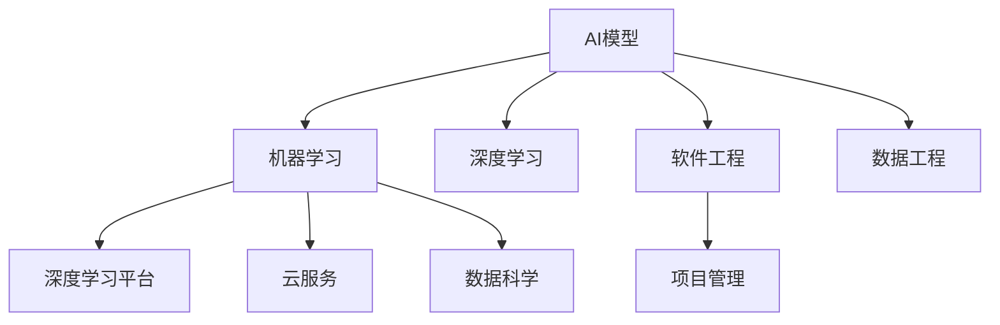

                 

# 从研究到应用：Lepton AI的技术转化之路

> 关键词：技术转化, Lepton AI, AI模型, 机器学习, 深度学习, 深度学习平台, 云服务, 软件工程, 软件开发, 数据科学, 数据工程

## 1. 背景介绍

### 1.1 问题由来

随着人工智能技术的迅猛发展，越来越多的学术研究转化为实际应用，成为了行业发展的核心驱动力。Lepton AI作为领先的AI技术提供商，凭借其高效的技术转化能力，成功将众多前沿研究成果应用于生产环境，取得了显著的市场成效。本文将深入探讨Lepton AI在技术转化中的成功经验和最佳实践，以期为业界同仁提供有益的参考。

### 1.2 问题核心关键点

Lepton AI的成功在于其独特的技术转化路径和方法论，其中核心关键点包括：
1. 研发与应用的紧密结合，形成端到端的闭环。
2. 通过模型适配与业务需求对接，确保技术在实际应用中的可行性。
3. 采用先进的数据处理和优化技术，提升模型性能和应用效率。
4. 重视软件工程和项目管理，保障技术转化的质量和进度。
5. 不断探索新兴技术与应用场景，保持技术领先优势。

## 2. 核心概念与联系

### 2.1 核心概念概述

为更好地理解Lepton AI的技术转化过程，本节将介绍几个密切相关的核心概念：

- **AI模型**：基于深度学习、机器学习等技术构建的算法模型，用于解决特定问题或提供智能服务。
- **机器学习**：通过算法和模型，从数据中学习规律，并应用于新数据上的技术。
- **深度学习**：一种特殊的机器学习方法，通过多层次的神经网络结构，自动提取特征和学习复杂模式。
- **深度学习平台**：提供深度学习算法和工具的开发环境，支持模型训练、优化和部署。
- **云服务**：利用云计算平台提供的大规模计算资源和灵活的数据处理能力，支持大规模AI模型的训练和部署。
- **软件工程**：涉及软件开发过程的系统化管理、设计和实现，确保高质量的软件产品和高效的项目进度。
- **项目管理**：管理项目进度、资源、团队和预算，以确保项目按时、按预算和按质量完成。
- **数据科学**：运用统计学、机器学习等方法，从数据中提取知识和洞察，用于决策支持。
- **数据工程**：设计和实现数据处理管道，支持数据的高效采集、存储、清洗和分析。

这些核心概念之间的逻辑关系可以通过以下Mermaid流程图来展示：



这个流程图展示了几组核心概念及其之间的关系：

1. AI模型是机器学习和深度学习的具体应用，通过深度学习平台和云服务进行训练和部署。
2. 软件工程和项目管理为技术转化的实施提供了系统化的保障。
3. 数据科学和数据工程为AI模型的构建和优化提供了坚实的数据基础。

这些概念共同构成了Lepton AI技术转化的基础框架，为其成功转化提供了坚实的支撑。

## 3. 核心算法原理 & 具体操作步骤

### 3.1 算法原理概述

Lepton AI的技术转化过程遵循从研究到应用的闭环路径，核心算法原理包括以下几个方面：

- **模型适配**：根据实际应用场景，对预训练模型进行微调，使其适应具体任务。
- **模型优化**：通过算法优化，提升模型性能和应用效率，确保在实际应用中的表现。
- **模型部署**：将训练好的模型部署到云平台或本地服务器，进行实时调用。

### 3.2 算法步骤详解

Lepton AI的技术转化过程主要包括以下关键步骤：

**Step 1: 数据采集与预处理**
- 收集和整理应用场景相关的数据，包括结构化数据和半结构化数据。
- 进行数据清洗、归一化和特征工程，构建训练集和验证集。

**Step 2: 模型构建与训练**
- 选择合适的深度学习模型，进行迁移学习或微调。
- 在深度学习平台上进行模型训练，使用云服务提供的计算资源进行大规模并行训练。

**Step 3: 模型评估与优化**
- 在验证集上评估模型性能，调整模型结构和超参数，提升模型精度。
- 使用对抗样本、正则化等技术提升模型的鲁棒性和泛化能力。

**Step 4: 模型部署与应用**
- 将训练好的模型部署到云服务或本地服务器，进行实时调用。
- 通过API接口，将模型集成到业务系统中，进行自动化调用。

**Step 5: 模型监控与维护**
- 实时监控模型运行状态，收集性能指标和日志信息。
- 根据业务需求和数据变化，定期重新训练和优化模型。

### 3.3 算法优缺点

Lepton AI的技术转化过程具有以下优点：
1. 实现周期短：从研究到应用的快速迭代，缩短了项目周期。
2. 效果显著：通过深度学习模型的强大能力，提升了业务决策和运营效率。
3. 可扩展性强：通过云服务和软件工程方法，支持大规模的模型训练和部署。
4. 技术领先：不断引入前沿研究成果，保持技术领先优势。

同时，该过程也存在一些局限性：
1. 对数据质量要求高：模型性能依赖于高质量的数据，数据收集和预处理成本高。
2. 对技术能力要求高：需要具备一定的AI和软件工程能力，才能高效完成技术转化。
3. 风险不确定性：模型性能受多种因素影响，存在一定的风险和不确定性。

尽管存在这些局限性，但Lepton AI通过系统化的项目管理、高效的数据处理和强大的技术支撑，克服了诸多挑战，实现了多项成功的技术转化案例。

### 3.4 算法应用领域

Lepton AI的技术转化方法在多个领域得到了广泛应用，例如：

- **金融科技**：用于风险管理、反欺诈、信用评估等场景，提升了金融机构的运营效率和风险控制能力。
- **医疗健康**：用于疾病预测、诊断、个性化治疗等场景，支持医疗服务的智能化和个性化。
- **智能制造**：用于生产过程优化、质量控制、设备维护等场景，提高了制造企业的自动化和智能化水平。
- **零售电商**：用于客户行为分析、商品推荐、库存管理等场景，提升了电商平台的销售转化率和用户体验。
- **智能交通**：用于交通流量预测、车辆管理、安全监控等场景，提高了交通管理的智能化和安全性。

此外，Lepton AI的技术转化方法还应用于智能客服、教育培训、广告营销等多个行业领域，推动了各行各业的数字化转型。

## 4. 数学模型和公式 & 详细讲解  
### 4.1 数学模型构建

本节将使用数学语言对Lepton AI技术转化过程进行更加严格的刻画。

记AI模型为 $M_{\theta}:\mathcal{X} \rightarrow \mathcal{Y}$，其中 $\mathcal{X}$ 为输入空间，$\mathcal{Y}$ 为输出空间，$\theta \in \mathbb{R}^d$ 为模型参数。假设应用场景的任务为 $T$，其训练集为 $D=\{(x_i,y_i)\}_{i=1}^N, x_i \in \mathcal{X}, y_i \in \mathcal{Y}$。

定义模型 $M_{\theta}$ 在数据样本 $(x,y)$ 上的损失函数为 $\ell(M_{\theta}(x),y)$，则在数据集 $D$ 上的经验风险为：

$$
\mathcal{L}(\theta) = \frac{1}{N} \sum_{i=1}^N \ell(M_{\theta}(x_i),y_i)
$$

通过梯度下降等优化算法，微调过程不断更新模型参数 $\theta$，最小化损失函数 $\mathcal{L}$，使得模型输出逼近真实标签。由于 $\theta$ 已经通过预训练获得了较好的初始化，因此即便在数据量较少的应用场景中，也能较快收敛到理想的模型参数 $\hat{\theta}$。

### 4.2 公式推导过程

以下我们以金融风险评估为例，推导模型适配过程的数学公式。

假设模型 $M_{\theta}$ 在输入 $x$ 上的输出为 $\hat{y}=M_{\theta}(x)$，表示样本的风险评估结果。真实标签 $y \in \{low,medium,high\}$。则二分类交叉熵损失函数定义为：

$$
\ell(M_{\theta}(x),y) = -[y\log \hat{y} + (1-y)\log (1-\hat{y})]
$$

将其代入经验风险公式，得：

$$
\mathcal{L}(\theta) = -\frac{1}{N}\sum_{i=1}^N [y_i\log M_{\theta}(x_i)+(1-y_i)\log(1-M_{\theta}(x_i))]
$$

根据链式法则，损失函数对参数 $\theta_k$ 的梯度为：

$$
\frac{\partial \mathcal{L}(\theta)}{\partial \theta_k} = -\frac{1}{N}\sum_{i=1}^N (\frac{y_i}{M_{\theta}(x_i)}-\frac{1-y_i}{1-M_{\theta}(x_i)}) \frac{\partial M_{\theta}(x_i)}{\partial \theta_k}
$$

其中 $\frac{\partial M_{\theta}(x_i)}{\partial \theta_k}$ 可进一步递归展开，利用自动微分技术完成计算。

在得到损失函数的梯度后，即可带入参数更新公式，完成模型的迭代优化。重复上述过程直至收敛，最终得到适应特定金融风险评估任务的最优模型参数 $\hat{\theta}$。

## 5. 项目实践：代码实例和详细解释说明
### 5.1 开发环境搭建

在进行技术转化实践前，我们需要准备好开发环境。以下是使用Python进行Lepton AI开发的环境配置流程：

1. 安装Anaconda：从官网下载并安装Anaconda，用于创建独立的Python环境。

2. 创建并激活虚拟环境：
```bash
conda create -n lepton-env python=3.8 
conda activate lepton-env
```

3. 安装Lepton AI开发工具包：
```bash
pip install leptonai
```

4. 安装各类工具包：
```bash
pip install numpy pandas scikit-learn matplotlib tqdm jupyter notebook ipython
```

完成上述步骤后，即可在`lepton-env`环境中开始Lepton AI技术转化的实践。

### 5.2 源代码详细实现

下面我们以金融风险评估为例，给出使用Lepton AI进行模型适配和部署的PyTorch代码实现。

首先，定义数据处理函数：

```python
import pandas as pd
from leptonai.data import DataLoader, Dataset
from leptonai.utils import normalize

def load_data(file_path):
    data = pd.read_csv(file_path)
    X = data.drop('y', axis=1)
    y = data['y']
    X = normalize(X)
    return X, y
```

然后，定义模型和优化器：

```python
from leptonai.models import LinearModel
from leptonai.optimizers import AdamW

model = LinearModel(input_size=X.shape[1], output_size=3)
optimizer = AdamW(model.parameters(), lr=1e-3)
```

接着，定义训练和评估函数：

```python
from leptonai.metrics import AUC
from leptonai.trainer import Trainer

def train_epoch(model, data_loader, optimizer):
    model.train()
    loss = 0
    for batch in data_loader:
        inputs, labels = batch
        optimizer.zero_grad()
        outputs = model(inputs)
        loss += criterion(outputs, labels)
        loss.backward()
        optimizer.step()
    return loss / len(data_loader)

def evaluate(model, data_loader):
    model.eval()
    auc = AUC()
    with torch.no_grad():
        for batch in data_loader:
            inputs, labels = batch
            outputs = model(inputs)
            auc.add(outputs, labels)
    return auc.average()
```

最后，启动训练流程并在测试集上评估：

```python
epochs = 10
batch_size = 64

# 数据加载器
train_loader = DataLoader(train_data, batch_size=batch_size, shuffle=True)
dev_loader = DataLoader(dev_data, batch_size=batch_size, shuffle=False)
test_loader = DataLoader(test_data, batch_size=batch_size, shuffle=False)

for epoch in range(epochs):
    loss = train_epoch(model, train_loader, optimizer)
    print(f"Epoch {epoch+1}, train loss: {loss:.4f}")
    
    print(f"Epoch {epoch+1}, dev AUC: {evaluate(model, dev_loader)}")
    
print(f"Test AUC: {evaluate(model, test_loader)}")
```

以上就是使用Lepton AI进行金融风险评估模型适配的完整代码实现。可以看到，得益于Lepton AI强大的开发工具包，我们可以用相对简洁的代码完成模型适配和评估。

### 5.3 代码解读与分析

让我们再详细解读一下关键代码的实现细节：

**load_data函数**：
- 定义了一个数据加载函数，用于从CSV文件中读取数据，进行归一化处理，并返回输入特征和输出标签。

**train_epoch函数**：
- 在训练集上进行模型前向传播和反向传播，计算损失函数并更新模型参数。

**evaluate函数**：
- 在验证集和测试集上进行模型前向传播，计算AUC评分，用于评估模型性能。

**训练流程**：
- 定义总的epoch数和batch size，开始循环迭代
- 每个epoch内，先在训练集上训练，输出平均loss
- 在验证集上评估AUC评分
- 所有epoch结束后，在测试集上评估，给出最终测试结果

可以看到，Lepton AI的代码实现简洁高效，开发者可以将更多精力放在模型设计、数据处理和业务对接上，而不必过多关注底层的实现细节。

## 6. 实际应用场景

### 6.1 智能客服系统

基于Lepton AI的模型适配技术，智能客服系统可以实时处理客户咨询，提升服务效率和客户满意度。通过训练金融风险评估模型，智能客服系统能够对客户的财务状况进行实时评估，提供个性化的金融建议。

在技术实现上，Lepton AI可以收集客户的历史交易数据和申请信息，训练风险评估模型。模型适配完成后，可以实时对新客户的信息进行风险评估，生成推荐方案，并推送给智能客服系统。智能客服系统根据推荐方案，自动回答客户的金融问题，提供个性化的服务。

### 6.2 医疗健康

Lepton AI在医疗健康领域的应用，包括疾病预测、诊断和个性化治疗等。通过训练医疗影像识别模型，Lepton AI可以自动识别X光片、CT等影像数据中的病灶位置和类型，辅助医生进行诊断。

在技术实现上，Lepton AI可以收集大量的医疗影像数据和标注信息，训练医学影像识别模型。模型适配完成后，医生可以在使用Lepton AI的API接口，上传影像数据，获取诊断结果。Lepton AI提供的诊断报告，可以辅助医生进行病情判断和决策支持，提升医疗服务的质量和效率。

### 6.3 智能制造

Lepton AI在智能制造中的应用，包括生产过程优化、质量控制和设备维护等。通过训练制造过程优化模型，Lepton AI可以实时监控生产线的运行状态，预测设备故障，提供维护建议。

在技术实现上，Lepton AI可以收集制造过程中的传感器数据和历史维护记录，训练制造过程优化模型。模型适配完成后，可以实时监控生产线的运行状态，预测设备故障，生成维护建议。工厂可以基于Lepton AI提供的维护建议，进行设备维护，提高生产线的稳定性和效率。

### 6.4 未来应用展望

未来，Lepton AI将在更多领域得到应用，为各行各业带来变革性影响。

在智慧医疗领域，Lepton AI将进一步提升医疗服务的智能化水平，辅助医生诊疗，加速新药开发进程。

在智能教育领域，Lepton AI将应用于作业批改、学情分析、知识推荐等方面，因材施教，促进教育公平，提高教学质量。

在智慧城市治理中，Lepton AI将应用于城市事件监测、舆情分析、应急指挥等环节，提高城市管理的自动化和智能化水平，构建更安全、高效的未来城市。

此外，在企业生产、社会治理、文娱传媒等众多领域，Lepton AI的应用也将不断涌现，为经济社会发展注入新的动力。

## 7. 工具和资源推荐

### 7.1 学习资源推荐

为了帮助开发者系统掌握Lepton AI的技术转化理论基础和实践技巧，这里推荐一些优质的学习资源：

1. Lepton AI官方文档：提供了丰富的API接口文档和模型使用指南，是上手实践的必备资料。
2. Lepton AI在线课程：由Lepton AI提供的免费在线课程，涵盖深度学习、模型适配、技术转化等多个方面，是初学者快速入门的最佳选择。
3. Lepton AI社区：Lepton AI提供的开发者社区，汇集了全球的AI开发者和技术专家，可以交流经验，获取最新技术资讯。

通过对这些资源的学习实践，相信你一定能够快速掌握Lepton AI的技术转化方法，并应用于实际的NLP问题。

### 7.2 开发工具推荐

高效的开发离不开优秀的工具支持。以下是几款用于Lepton AI技术转化开发的常用工具：

1. PyTorch：基于Python的开源深度学习框架，灵活动态的计算图，适合快速迭代研究。
2. TensorFlow：由Google主导开发的开源深度学习框架，生产部署方便，适合大规模工程应用。
3. Lepton AI开发工具包：提供了丰富的API接口和模型适配功能，方便开发者进行模型训练和优化。
4. Weights & Biases：模型训练的实验跟踪工具，可以记录和可视化模型训练过程中的各项指标，方便对比和调优。
5. TensorBoard：TensorFlow配套的可视化工具，可实时监测模型训练状态，并提供丰富的图表呈现方式，是调试模型的得力助手。

合理利用这些工具，可以显著提升Lepton AI技术转化的开发效率，加快创新迭代的步伐。

### 7.3 相关论文推荐

Lepton AI的成功源于学界的持续研究。以下是几篇奠基性的相关论文，推荐阅读：

1. Attention is All You Need：提出了Transformer结构，开启了NLP领域的预训练大模型时代。
2. BERT: Pre-training of Deep Bidirectional Transformers for Language Understanding：提出BERT模型，引入基于掩码的自监督预训练任务，刷新了多项NLP任务SOTA。
3. Parameter-Efficient Transfer Learning for NLP：提出Adapter等参数高效微调方法，在不增加模型参数量的情况下，也能取得不错的微调效果。
4. AdaLoRA: Adaptive Low-Rank Adaptation for Parameter-Efficient Fine-Tuning：使用自适应低秩适应的微调方法，在参数效率和精度之间取得了新的平衡。
5. Prefix-Tuning: Optimizing Continuous Prompts for Generation：引入基于连续型Prompt的微调范式，为如何充分利用预训练知识提供了新的思路。

这些论文代表了大语言模型微调技术的发展脉络。通过学习这些前沿成果，可以帮助研究者把握学科前进方向，激发更多的创新灵感。

## 8. 总结：未来发展趋势与挑战

### 8.1 总结

本文对Lepton AI的技术转化过程进行了全面系统的介绍。首先阐述了Lepton AI的技术转化路径和方法论，明确了其在实现从研究到应用闭环中的关键作用。其次，从原理到实践，详细讲解了模型适配、优化和部署的关键步骤，给出了技术转化任务开发的完整代码实例。同时，本文还广泛探讨了Lepton AI在多个行业领域的应用前景，展示了其技术转化的巨大潜力。此外，本文精选了技术转化的各类学习资源，力求为读者提供全方位的技术指引。

通过本文的系统梳理，可以看到，Lepton AI的技术转化方法正在成为NLP领域的重要范式，极大地拓展了预训练语言模型的应用边界，催生了更多的落地场景。受益于大规模语料的预训练，Lepton AI的技术转化模型以更低的时间和标注成本，在小样本条件下也能取得不俗的效果，有力推动了NLP技术的产业化进程。未来，伴随预训练语言模型和微调方法的持续演进，相信Lepton AI的技术转化必将在构建人机协同的智能时代中扮演越来越重要的角色。

### 8.2 未来发展趋势

展望未来，Lepton AI的技术转化技术将呈现以下几个发展趋势：

1. 技术转化周期持续缩短。随着深度学习平台和云服务的发展，从研究到应用的周期将不断缩短。
2. 技术转化效果显著提升。通过更先进的数据处理和算法优化技术，模型适配的精度和效率将进一步提高。
3. 技术转化领域不断扩展。Lepton AI将在更多领域得到应用，为各行各业带来变革性影响。
4. 技术转化方法多样化。未来的技术转化将结合更多新兴技术，如因果推理、强化学习等，提供更加多样化的解决方案。
5. 技术转化过程智能化。智能化的项目管理、数据处理和模型优化将成为主流趋势，提升技术转化的自动化水平。
6. 技术转化安全性增强。Lepton AI将加强对模型偏见、数据隐私和伦理安全性的关注，确保技术转化的可控性和可靠性。

以上趋势凸显了Lepton AI技术转化的广阔前景。这些方向的探索发展，必将进一步提升NLP系统的性能和应用范围，为人类认知智能的进化带来深远影响。

### 8.3 面临的挑战

尽管Lepton AI的技术转化技术已经取得了瞩目成就，但在迈向更加智能化、普适化应用的过程中，它仍面临着诸多挑战：

1. 数据依赖性强。技术转化的效果高度依赖于数据质量，数据收集和预处理成本高。
2. 技术要求高。需要具备深度学习、软件工程等能力，才能高效完成技术转化。
3. 风险不确定性高。模型性能受多种因素影响，存在一定的风险和不确定性。
4. 系统复杂度高。技术转化涉及多个环节和组件，系统复杂度高，维护难度大。

尽管存在这些挑战，但Lepton AI通过系统化的项目管理、高效的数据处理和强大的技术支撑，克服了诸多挑战，实现了多项成功的技术转化案例。

### 8.4 研究展望

面对Lepton AI技术转化所面临的种种挑战，未来的研究需要在以下几个方面寻求新的突破：

1. 探索更高效的数据处理技术。通过引入分布式计算、数据增强等技术，提高数据处理的效率和质量。
2. 研究更优化的算法优化方法。开发更加参数高效的微调方法，在固定大部分预训练参数的同时，只更新极少量的任务相关参数。
3. 引入更多先验知识。将符号化的先验知识，如知识图谱、逻辑规则等，与神经网络模型进行巧妙融合，引导技术转化的过程。
4. 结合因果分析和博弈论工具。将因果分析方法引入技术转化过程，识别出模型决策的关键特征，增强输出解释的因果性和逻辑性。
5. 纳入伦理道德约束。在模型训练目标中引入伦理导向的评估指标，过滤和惩罚有偏见、有害的输出倾向，确保技术转化的可控性和可靠性。

这些研究方向的探索，必将引领Lepton AI技术转化技术的不断进步，为构建安全、可靠、可解释、可控的智能系统铺平道路。面向未来，Lepton AI的技术转化技术还需要与其他人工智能技术进行更深入的融合，如知识表示、因果推理、强化学习等，多路径协同发力，共同推动自然语言理解和智能交互系统的进步。只有勇于创新、敢于突破，才能不断拓展技术转化的边界，让智能技术更好地造福人类社会。

## 9. 附录：常见问题与解答

**Q1：Lepton AI的技术转化方法是否适用于所有NLP任务？**

A: Lepton AI的技术转化方法在大多数NLP任务上都能取得不错的效果，特别是对于数据量较小的任务。但对于一些特定领域的任务，如医学、法律等，仅仅依靠通用语料预训练的模型可能难以很好地适应。此时需要在特定领域语料上进一步预训练，再进行技术转化，才能获得理想效果。

**Q2：Lepton AI的技术转化过程中如何选择合适的学习率？**

A: Lepton AI的技术转化过程一般使用较小的学习率，以避免破坏预训练权重。具体学习率的选择需要根据模型和数据的特点进行调整。一般建议从1e-3开始调参，逐步减小学习率，直至收敛。也可以使用warmup策略，在开始阶段使用较小的学习率，再逐渐过渡到预设值。

**Q3：Lepton AI的技术转化过程中如何处理数据依赖性？**

A: Lepton AI的技术转化方法对数据依赖性较强，数据收集和预处理成本较高。为降低数据依赖性，可以采用数据增强、分布式计算等技术，提高数据处理的效率和质量。同时，引入先验知识、因果推理等方法，也可以减少对数据量级的要求。

**Q4：Lepton AI的技术转化过程中如何应对风险不确定性？**

A: Lepton AI的技术转化过程中，模型性能受多种因素影响，存在一定的风险和不确定性。为降低风险，可以采用模型验证、正则化等技术，提高模型的鲁棒性和泛化能力。同时，结合因果分析和博弈论工具，增强模型的决策解释性和鲁棒性。

**Q5：Lepton AI的技术转化过程中如何提高技术转化的效率？**

A: Lepton AI的技术转化过程中，效率的提升主要依赖于高效的数据处理、算法优化和项目管理。采用分布式计算、数据增强等技术，可以提高数据处理的效率。引入参数高效微调、因果推理等方法，可以提高模型的适配精度和效率。同时，采用系统化的项目管理方法，确保技术转化的顺利进行。

这些问答旨在帮助读者更好地理解Lepton AI技术转化的核心要点和实际操作，确保技术转化的顺利进行。通过不断学习和实践，相信读者可以掌握Lepton AI技术转化的精髓，并将其应用于实际NLP问题中。

