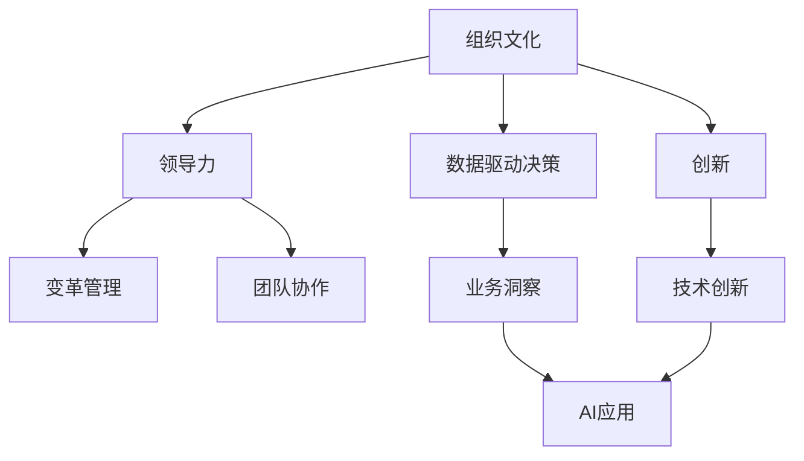

                 

# 从经典书籍中汲取管理智慧

> 关键词：管理智慧, 经典书籍, 组织文化, 领导力, 创新, 数据驱动决策, 人工智能与管理, 商业洞察

## 1. 背景介绍

### 1.1 问题由来

在当今快速变化和高度竞争的商业环境中，管理智慧成为了企业成功的关键。经典书籍作为管理学的知识宝库，为现代企业提供了宝贵的洞见和实践指南。从泰勒的《科学管理原理》到德鲁克的《管理实践》，再到吉姆·柯林斯的《从优秀到卓越》，这些经典著作不仅影响了管理学的理论发展，更成为实践中的重要参考。

随着科技的迅猛发展，人工智能（AI）与管理学的结合正成为新的热门话题。如何从经典书籍中汲取智慧，并将其应用于AI和数字化转型，是企业需要深思的问题。本文将探讨如何利用经典管理智慧来指导现代企业的AI和数字化转型。

### 1.2 问题核心关键点

本文的核心在于探讨经典书籍中的管理智慧如何被应用于AI和数字化转型。具体来说，我们将从以下几个方面进行探讨：

1. **组织文化建设**：如何通过培养开放、创新的企业文化来支持AI和数字化转型。
2. **领导力与变革管理**：如何通过有效的领导力推动组织内的技术变革。
3. **数据驱动决策**：如何将数据科学和商业洞察结合，以支持AI的部署与应用。
4. **创新与持续改进**：如何在管理实践中引入创新思维，推动AI技术的持续优化。

## 2. 核心概念与联系

### 2.1 核心概念概述

为更好地理解如何将经典管理智慧应用于AI和数字化转型，本节将介绍几个密切相关的核心概念：

- **组织文化**：指组织内部的价值观、行为规范和工作氛围，对员工的工作态度和行为产生深远影响。
- **领导力**：指领导者通过其行为和决策对组织产生的影响力。
- **数据驱动决策**：指基于数据分析和洞察进行决策，而非仅凭直觉或经验。
- **创新**：指在管理实践中引入新的思维方式和解决方案，推动组织不断进步。

这些核心概念之间的逻辑关系可以通过以下Mermaid流程图来展示：



这个流程图展示的核心概念及其之间的关联：

1. **组织文化**：作为基础，影响领导力的发挥，推动数据驱动决策和创新。
2. **领导力**：在组织文化的基础上，通过变革管理，驱动团队协作和数据驱动决策。
3. **数据驱动决策**：在领导力的指导下，利用业务洞察，进行数据驱动的决策。
4. **创新**：在领导力的推动下，引入技术创新，支持AI应用和数据驱动决策。

这些概念共同构成了AI和数字化转型中的管理框架，使得组织能够更好地利用AI技术推动变革。

## 3. 核心算法原理 & 具体操作步骤
### 3.1 算法原理概述

将经典管理智慧应用于AI和数字化转型，其核心思想是通过理解和应用经典管理理论，构建适合AI和数字化转型的组织结构和领导力模型，推动组织内数据驱动决策和创新的实现。

形式化地，假设一个组织希望通过AI和数字化转型提升其竞争力和效率，其过程可以表示为：

$$
\text{Goal} = \max_{O, L, D, I} \left\{ \text{Performance Improvement} \times \text{Cultural Alignment} \right\}
$$

其中：
- $O$ 为组织结构，$L$ 为领导力，$D$ 为数据驱动决策，$I$ 为创新。

目标函数$\text{Performance Improvement}$表示组织的性能提升，包括营收增长、市场份额提升、客户满意度提高等。$\text{Cultural Alignment}$表示组织文化与AI和数字化转型的契合度，确保文化的开放性和创新性。

### 3.2 算法步骤详解

基于经典管理智慧的AI和数字化转型，一般包括以下几个关键步骤：

**Step 1: 理解组织文化**
- 分析组织现有文化的特点和优势，识别出需要改进的领域。
- 识别组织中支持创新和数据驱动决策的文化元素。

**Step 2: 设计和实施领导力**
- 确定领导层的人员组成和职能分工，确保领导力能覆盖所有关键业务领域。
- 培养领导层的变革管理能力，推动组织的转型和适应。

**Step 3: 制定数据驱动决策流程**
- 构建数据收集、清洗、分析和应用的全流程框架。
- 建立跨部门的协作机制，确保数据的整合和使用。

**Step 4: 引入和培养创新思维**
- 设立创新实验室或团队，鼓励员工提出和测试新想法。
- 引入敏捷和精益方法，快速迭代和优化AI技术的应用。

**Step 5: 持续监测和优化**
- 建立定期评估机制，监控AI应用的效果和组织文化的契合度。
- 根据评估结果调整策略，不断优化组织结构和领导力。

### 3.3 算法优缺点

经典管理智慧应用于AI和数字化转型的优点：
1. **系统性思考**：经典管理理论提供了系统性的思考框架，有助于全面评估和规划AI和数字化转型的各个环节。
2. **可持续性**：经典管理智慧强调文化建设和长期价值，有助于组织持续地利用AI技术推动进步。
3. **适应性强**：经典管理理论适用于各种规模和行业的组织，具有广泛的适用性。

其缺点：
1. **理论与实践脱节**：经典管理理论有时过于理想化，难以直接应用于复杂多变的现实环境。
2. **变化缓慢**：文化和领导力的改变需要时间，可能难以应对快速变化的商业环境。
3. **技术依赖**：经典管理理论往往忽视技术细节，可能难以应对AI技术带来的新挑战。

尽管存在这些局限性，经典管理智慧仍是大规模AI和数字化转型的重要理论基础，能够提供稳健的管理框架和实践指导。

### 3.4 算法应用领域

经典管理智慧在AI和数字化转型的多个应用领域中都能发挥重要作用，例如：

- **制造行业**：通过AI和数字化转型提升生产效率和产品质量，采用数据驱动的决策制定制造流程。
- **金融服务**：利用AI进行风险评估和客户服务优化，通过数据驱动的洞察优化金融产品的设计和推广。
- **零售和电商**：通过数据分析和AI驱动的个性化推荐，提升用户体验和销售效率。
- **医疗健康**：利用AI进行疾病预测和个性化治疗方案制定，通过数据驱动的洞察优化医疗服务。
- **公共服务**：利用AI进行城市管理和社会治理，通过数据驱动的决策提升公共服务的效率和公平性。

这些领域中，经典管理智慧的应用不仅能够推动AI技术的深入应用，还能够提升组织的整体管理和运营效率。

## 4. 数学模型和公式 & 详细讲解 & 举例说明

### 4.1 数学模型构建

本节将使用数学语言对经典管理智慧的应用进行更加严格的刻画。

假设一个组织的目标是通过AI和数字化转型提升其整体性能，目标函数为：

$$
\text{Performance Improvement} = f(O, L, D, I)
$$

其中 $f$ 为性能提升的函数，依赖于组织结构 $O$、领导力 $L$、数据驱动决策 $D$ 和创新 $I$。

### 4.2 公式推导过程

以数据驱动决策为例，其公式推导如下：

假设组织拥有历史数据 $\{D_t\}_{t=1}^T$，其中 $D_t$ 为第 $t$ 天的数据，$x_t$ 为需要预测的指标。目标是通过AI模型 $M$ 对 $D_t$ 进行预测，最小化预测误差 $\epsilon$。数学模型为：

$$
\epsilon = \left\| M(D_t) - x_t \right\|
$$

优化目标为：

$$
\min_{M} \epsilon
$$

通过梯度下降等优化算法，模型不断更新权重，使得预测误差最小化。

### 4.3 案例分析与讲解

以制造业中的生产调度优化为例。假设一个工厂的生产过程受多个因素影响，如设备状态、原材料供应、工人效率等。通过数据分析和AI模型，工厂可以实时监测和预测生产过程中的瓶颈和风险。

**案例分析**：
1. **组织结构**：工厂通过设置生产调度中心，集中管理和监控生产过程。
2. **领导力**：工厂领导层负责制定生产策略，并通过有效的变革管理推动实施。
3. **数据驱动决策**：工厂通过传感器和监控系统收集实时数据，利用AI模型进行生产调度和优化。
4. **创新**：工厂引入物联网技术，实时监测设备状态和原材料供应，提高生产调度的精确度。

**案例讲解**：
1. **数据收集**：工厂安装传感器和监控系统，收集生产过程中的各类数据。
2. **数据处理**：对数据进行清洗和预处理，构建数据仓库。
3. **模型建立**：利用机器学习算法建立生产调度和预测模型。
4. **模型应用**：在生产调度中心实时应用模型，进行生产调度和风险预测。
5. **持续优化**：定期评估模型性能，根据实际情况调整模型参数，持续优化生产调度过程。

## 5. 项目实践：代码实例和详细解释说明
### 5.1 开发环境搭建

在进行AI和数字化转型项目实践前，我们需要准备好开发环境。以下是使用Python进行TensorFlow开发的环境配置流程：

1. 安装Anaconda：从官网下载并安装Anaconda，用于创建独立的Python环境。

2. 创建并激活虚拟环境：
```bash
conda create -n ai-env python=3.8 
conda activate ai-env
```

3. 安装TensorFlow：根据CUDA版本，从官网获取对应的安装命令。例如：
```bash
conda install tensorflow=2.7 -c tensorflow
```

4. 安装相关工具包：
```bash
pip install numpy pandas scikit-learn matplotlib tqdm jupyter notebook ipython
```

完成上述步骤后，即可在`ai-env`环境中开始AI和数字化转型实践。

### 5.2 源代码详细实现

下面我们以制造业中的生产调度优化为例，给出使用TensorFlow进行AI模型开发的PyTorch代码实现。

首先，定义生产调度问题的数学模型：

```python
import tensorflow as tf
import numpy as np

# 定义生产调度问题的数学模型
def model_loss(y_true, y_pred):
    loss = tf.reduce_mean(tf.square(y_true - y_pred))
    return loss
```

然后，定义数据准备和模型训练函数：

```python
# 定义数据准备函数
def prepare_data(data_path):
    data = np.loadtxt(data_path, delimiter=',')
    X = data[:, :5]  # 前5个特征作为输入
    y = data[:, 5]  # 第6个特征作为输出
    return X, y

# 定义模型训练函数
def train_model(X_train, y_train, batch_size=32, epochs=100):
    model = tf.keras.Sequential([
        tf.keras.layers.Dense(64, activation='relu', input_shape=(X_train.shape[1],)),
        tf.keras.layers.Dense(1, activation='sigmoid')
    ])
    optimizer = tf.keras.optimizers.Adam(learning_rate=0.01)
    loss_fn = model_loss

    model.compile(optimizer=optimizer, loss=loss_fn, metrics=['mae'])
    model.fit(X_train, y_train, batch_size=batch_size, epochs=epochs, verbose=2)

    return model
```

最后，启动模型训练：

```python
# 加载数据
X_train, y_train = prepare_data('production_data.csv')

# 训练模型
model = train_model(X_train, y_train)

# 输出模型参数
print(model.get_weights())
```

以上就是使用TensorFlow进行制造业生产调度优化模型的代码实现。可以看到，TensorFlow提供了丰富的API和工具，可以高效地构建、训练和优化AI模型。

### 5.3 代码解读与分析

让我们再详细解读一下关键代码的实现细节：

**model_loss函数**：
- 定义损失函数，使用均方误差来衡量模型预测值和真实值之间的差异。

**prepare_data函数**：
- 准备数据集，将数据读入NumPy数组，并将前5个特征作为输入，第6个特征作为输出。

**train_model函数**：
- 定义神经网络模型，包括一个全连接层和一个输出层。
- 定义优化器（Adam）和损失函数。
- 编译模型，指定优化器、损失函数和评估指标（平均绝对误差MAE）。
- 训练模型，指定训练数据、批大小、迭代次数和训练过程中的输出（verbose）。

**启动训练流程**：
- 加载训练数据集。
- 训练模型，输出模型的权重参数。

在实际应用中，需要根据具体问题调整模型的结构和超参数，以获得更好的性能。

## 6. 实际应用场景
### 6.1 智能制造
在智能制造中，AI和数字化转型可以极大地提升生产效率和产品质量。通过数据驱动的决策和创新的生产调度优化，工厂能够实现更灵活、更高效的运作。

**实际应用**：
- **数据收集与处理**：通过传感器和监控系统收集生产过程中的各类数据，构建实时数据流。
- **模型建立与训练**：利用机器学习算法建立生产调度和预测模型，对数据进行训练和优化。
- **模型应用**：在生产调度中心实时应用模型，进行生产调度和风险预测。
- **持续优化**：定期评估模型性能，根据实际情况调整模型参数，持续优化生产调度过程。

### 6.2 金融服务
金融服务行业可以利用AI进行风险评估和客户服务优化，通过数据驱动的洞察优化金融产品的设计和推广。

**实际应用**：
- **数据收集与处理**：收集客户的交易数据、行为数据和市场数据，构建多维度的数据仓库。
- **模型建立与训练**：利用机器学习算法建立风险评估模型和客户行为预测模型，对数据进行训练和优化。
- **模型应用**：在风险控制和客户服务中实时应用模型，进行风险评估和客户服务优化。
- **持续优化**：定期评估模型性能，根据市场变化调整模型参数，持续优化金融服务。

### 6.3 零售和电商
通过数据分析和AI驱动的个性化推荐，零售和电商行业能够提升用户体验和销售效率。

**实际应用**：
- **数据收集与处理**：收集用户的浏览、点击、购买等行为数据，构建用户画像。
- **模型建立与训练**：利用机器学习算法建立个性化推荐模型，对数据进行训练和优化。
- **模型应用**：在电商平台上实时应用模型，进行个性化推荐和营销。
- **持续优化**：定期评估模型性能，根据用户反馈调整模型参数，持续优化推荐系统。

### 6.4 医疗健康
利用AI进行疾病预测和个性化治疗方案制定，通过数据驱动的洞察优化医疗服务。

**实际应用**：
- **数据收集与处理**：收集患者的病历数据、基因数据和生理数据，构建患者档案。
- **模型建立与训练**：利用机器学习算法建立疾病预测和个性化治疗方案制定模型，对数据进行训练和优化。
- **模型应用**：在医院中实时应用模型，进行疾病预测和个性化治疗方案制定。
- **持续优化**：定期评估模型性能，根据患者反馈调整模型参数，持续优化医疗服务。

### 6.5 公共服务
利用AI进行城市管理和社会治理，通过数据驱动的决策提升公共服务的效率和公平性。

**实际应用**：
- **数据收集与处理**：收集城市运行的各种数据，如交通流量、环境监测数据、公共服务数据等，构建数据仓库。
- **模型建立与训练**：利用机器学习算法建立城市管理和公共服务优化模型，对数据进行训练和优化。
- **模型应用**：在城市管理和社会治理中实时应用模型，进行交通优化、环境监测和公共服务优化。
- **持续优化**：定期评估模型性能，根据城市发展调整模型参数，持续优化公共服务。

## 7. 工具和资源推荐
### 7.1 学习资源推荐

为了帮助开发者系统掌握AI和数字化转型的理论基础和实践技巧，这里推荐一些优质的学习资源：

1. **《Python数据科学手册》**：介绍Python在数据科学中的应用，包括数据处理、机器学习、数据可视化等。
2. **《TensorFlow官方文档》**：提供TensorFlow的详细介绍和使用指南，包括API文档、案例分析和实战项目。
3. **《深度学习实战》**：介绍深度学习在各个领域的应用，包括计算机视觉、自然语言处理、强化学习等。
4. **《机器学习实战》**：通过实战项目讲解机器学习算法的应用，适合初学者上手实践。
5. **Coursera和edX课程**：提供各类AI和数据科学的在线课程，包括理论和实践的全面讲解。

通过对这些资源的学习实践，相信你一定能够快速掌握AI和数字化转型的精髓，并用于解决实际的业务问题。

### 7.2 开发工具推荐

高效的开发离不开优秀的工具支持。以下是几款用于AI和数字化转型开发的常用工具：

1. **Python**：作为数据科学和AI开发的主流语言，Python提供了丰富的科学计算和机器学习库，如NumPy、Pandas、Scikit-Learn、TensorFlow等。
2. **TensorFlow**：由Google主导开发的深度学习框架，提供灵活的API和工具，支持分布式训练和模型部署。
3. **PyTorch**：由Facebook开发的深度学习框架，以动态计算图和易用性著称，适合研究和快速迭代。
4. **Jupyter Notebook**：用于数据科学和AI开发的交互式编程环境，支持代码编写、数据可视化和结果展示。
5. **Docker和Kubernetes**：用于容器化部署和管理AI模型的工具，支持跨平台和自动伸缩。
6. **AWS和Google Cloud**：提供云平台服务，支持AI模型的训练、部署和监控，适合大规模应用。

合理利用这些工具，可以显著提升AI和数字化转型的开发效率，加快创新迭代的步伐。

### 7.3 相关论文推荐

AI和数字化转型领域的研究非常活跃，以下是几篇奠基性的相关论文，推荐阅读：

1. **《深度学习》（Goodfellow等著）**：介绍深度学习的基本概念、算法和应用，是深度学习的经典教材。
2. **《机器学习》（Tom Mitchell著）**：介绍机器学习的基本概念、算法和应用，是机器学习的经典教材。
3. **《AI superpowers》（Marcus等著）**：介绍AI技术的进展和应用，探讨AI对社会和科技的影响。
4. **《数据科学实战》（Steven D. Miller等著）**：通过实战项目讲解数据科学在各行各业中的应用，适合实战学习。
5. **《大数据分析与数据挖掘》（Wu等著）**：介绍大数据分析与数据挖掘的基本概念、算法和应用，适合数据科学入门。

这些论文代表了大数据和AI技术的发展脉络，通过学习这些前沿成果，可以帮助研究者把握学科前进方向，激发更多的创新灵感。

## 8. 总结：未来发展趋势与挑战
### 8.1 总结

本文对AI和数字化转型中经典管理智慧的应用进行了全面系统的介绍。首先阐述了经典管理智慧在AI和数字化转型中的重要性，明确了如何通过组织文化、领导力、数据驱动决策和创新实现管理目标。其次，从原理到实践，详细讲解了经典管理智慧的应用流程，并给出了完整的AI模型开发代码实例。同时，本文还广泛探讨了经典管理智慧在多个行业领域的应用前景，展示了其在AI和数字化转型中的巨大潜力。

通过本文的系统梳理，可以看到，经典管理智慧是AI和数字化转型的重要理论基础，能够提供稳健的管理框架和实践指导。未来，随着AI技术的不断发展，经典管理智慧的应用将更加广泛，为企业管理和技术创新提供坚实的支撑。

### 8.2 未来发展趋势

展望未来，AI和数字化转型的管理智慧将呈现以下几个发展趋势：

1. **数据驱动决策的普及**：随着数据采集和处理技术的进步，数据驱动决策将渗透到各个行业，成为企业管理的重要手段。
2. **AI技术的多样化应用**：AI技术的应用将更加广泛，涵盖数据分析、图像识别、自然语言处理、智能推荐等诸多领域，带来更多商业机会。
3. **持续学习与优化**：AI系统将具备持续学习的能力，通过不断优化模型参数和改进算法，提升决策的精确性和鲁棒性。
4. **智能制造与自动化**：智能制造和自动化将成为制造业的重要方向，通过AI和数字化转型提升生产效率和产品质量。
5. **个性化服务**：零售和电商行业将通过AI驱动的个性化推荐和营销，提升用户体验和销售效率。
6. **医疗健康智能化**：AI在医疗健康领域的应用将更加深入，通过疾病预测和个性化治疗方案制定，优化医疗服务。
7. **智能城市建设**：AI在公共服务中的应用将推动智能城市建设，通过数据驱动的决策提升城市管理的效率和公平性。

这些趋势凸显了AI和数字化转型在各个行业中的重要地位，经典管理智慧将帮助企业更好地利用AI技术推动变革。

### 8.3 面临的挑战

尽管AI和数字化转型技术在不断发展，但在实际应用中也面临诸多挑战：

1. **数据隐私与安全**：AI系统依赖大量数据，如何保护数据隐私和安全，避免数据泄露和滥用，是重要挑战。
2. **模型可解释性**：AI模型往往是"黑盒"系统，如何赋予模型更强的可解释性，理解其决策逻辑，是亟待解决的问题。
3. **技术复杂性**：AI技术的实现复杂度高，需要跨学科的知识，对企业的技术积累提出了更高要求。
4. **伦理与道德**：AI系统可能产生偏见和歧视，如何确保系统的公平性和伦理道德，是必须面对的课题。
5. **资源与成本**：AI系统的部署和维护需要大量资源和成本，如何降低成本，提升效率，是企业管理的重要任务。

这些挑战需要企业在实践中不断探索和克服，才能真正实现AI和数字化转型的价值。

### 8.4 研究展望

面对AI和数字化转型所面临的挑战，未来的研究需要在以下几个方面寻求新的突破：

1. **隐私保护与数据安全**：开发隐私保护技术，如差分隐私、联邦学习等，保护数据隐私和安全。
2. **模型可解释性**：引入可解释性技术，如LIME、SHAP等，增强模型的可解释性，提高系统的透明度和可信度。
3. **技术简化**：开发更简单、更易用的AI工具和框架，降低技术门槛，促进AI技术的应用。
4. **伦理与道德**：引入伦理与道德评估指标，建立AI系统的伦理审查机制，确保系统的公平性和道德性。
5. **资源优化**：优化AI系统的资源使用，如模型压缩、稀疏化等技术，降低部署和维护成本。

这些研究方向将有助于克服AI和数字化转型的挑战，推动AI技术在企业中的应用和落地。

## 9. 附录：常见问题与解答
**Q1：AI和数字化转型中的组织文化建设应该如何进行？**

A: 组织文化建设是AI和数字化转型的基础，可以通过以下步骤进行：
1. **愿景与价值观**：明确企业的愿景和价值观，推动文化认同。
2. **领导力**：培养开放、创新的领导力，引导员工接受和支持变革。
3. **员工参与**：通过培训、交流等方式，提高员工对AI和数字化转型的认识和参与度。
4. **持续改进**：建立持续改进机制，定期评估和优化组织文化。

**Q2：AI和数字化转型中如何引入数据驱动决策？**

A: 引入数据驱动决策，可以按照以下步骤进行：
1. **数据收集与清洗**：构建数据仓库，收集和清洗数据。
2. **数据分析**：利用数据分析技术，提取有价值的信息和洞察。
3. **模型建立**：建立预测和优化模型，如机器学习模型、优化算法等。
4. **模型应用**：在业务决策中应用模型，进行数据分析和预测。
5. **持续优化**：根据实际效果，调整模型参数和优化算法，不断提升决策效果。

**Q3：AI和数字化转型中的创新如何实现？**

A: 实现创新，可以按照以下步骤进行：
1. **建立创新机制**：设立创新实验室或团队，鼓励员工提出和测试新想法。
2. **引入敏捷与精益方法**：采用敏捷和精益方法，快速迭代和优化AI技术的应用。
3. **跨部门协作**：建立跨部门的协作机制，促进技术和业务的无缝对接。
4. **激励机制**：建立激励机制，鼓励员工提出和实现创新。

**Q4：AI和数字化转型中的数据隐私与安全问题如何解决？**

A: 解决数据隐私与安全问题，可以采用以下措施：
1. **隐私保护技术**：采用差分隐私、联邦学习等技术，保护数据隐私。
2. **数据加密**：对数据进行加密存储和传输，防止数据泄露。
3. **访问控制**：设置严格的访问控制机制，确保数据访问权限的安全。
4. **合规审查**：遵循相关法律法规，进行合规审查，确保数据处理合法合规。

**Q5：AI和数字化转型中的模型可解释性如何提升？**

A: 提升模型可解释性，可以采用以下方法：
1. **可解释性技术**：引入LIME、SHAP等可解释性技术，增强模型的可解释性。
2. **可视化工具**：利用可视化工具，如t-SNE、热力图等，展示模型的决策过程和特征重要性。
3. **特征工程**：通过特征工程，选择和优化模型特征，提升模型的可解释性。
4. **业务对接**：将模型输出与业务需求对接，增强模型的业务相关性和透明度。

通过以上措施，可以有效提升AI和数字化转型中的模型可解释性，增强系统的透明度和可信度。

---

作者：禅与计算机程序设计艺术 / Zen and the Art of Computer Programming

