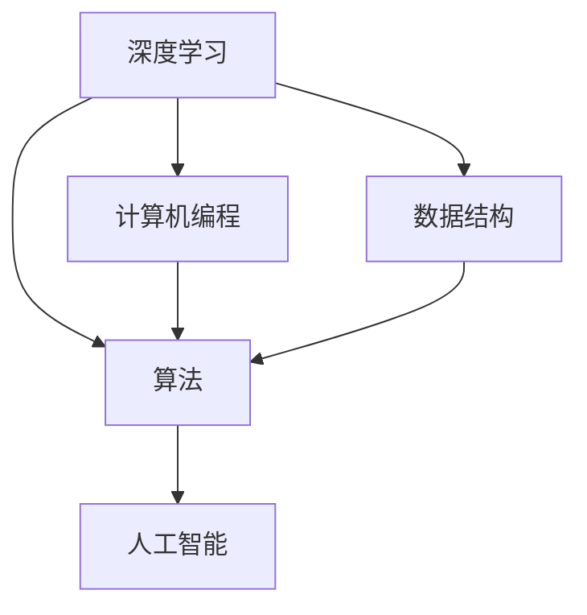

                 

# 从经典开始：奠定基础认知

> 关键词：经典算法,基础认知,深度学习,计算机编程,数据结构,人工智能

## 1. 背景介绍

### 1.1 问题由来

在信息爆炸的今天，数据和算法的力量越来越受到重视。而深入理解经典算法和基础认知，是学习人工智能、计算机科学等领域不可或缺的一部分。本文旨在通过梳理一系列经典算法和基础概念，帮助读者从经典出发，构建扎实的基础认知。

### 1.2 问题核心关键点

本文的核心关键点包括以下几点：
1. 经典算法的核心思想和原理。
2. 基础认知的结构和内容。
3. 经典算法在实际应用中的使用和优化。
4. 如何通过学习经典算法和基础认知，提升个人在人工智能、计算机科学等领域的能力。

这些关键点将贯穿全文，帮助读者系统掌握经典算法和基础认知的知识体系。

## 2. 核心概念与联系

### 2.1 核心概念概述

在人工智能和计算机科学的领域，有许多经典的算法和基础概念，构成了现代技术的基石。以下是一些核心概念及其相互联系的概述：

- 深度学习：通过构建多层次的神经网络，对数据进行非线性映射，从而实现高级模式识别和预测。深度学习在图像识别、语音识别、自然语言处理等领域有着广泛应用。

- 计算机编程：通过编写程序，实现特定功能或解决特定问题。编程是计算机科学的基础，也是人工智能实现的基础。

- 数据结构：设计合理的数据结构，可以显著提升程序的运行效率和可维护性。常见的数据结构包括数组、链表、栈、队列、树、图等。

- 算法：为解决特定问题，设计和实现的计算步骤。算法是计算机科学的核心，涵盖排序、查找、图论、动态规划等多个方向。

- 人工智能：通过构建智能系统，使计算机能够模拟人类的智能行为，解决复杂问题。人工智能涵盖机器学习、自然语言处理、计算机视觉等多个子领域。

这些概念之间的联系主要体现在：
- 深度学习是人工智能的核心技术之一，依赖于计算机编程和数据结构来实现。
- 计算机编程和数据结构是实现算法的基础工具。
- 算法是解决问题的核心，人工智能和计算机科学都是建立在算法的基础之上。

这些概念相互交织，构成了现代技术的基础。

### 2.2 核心概念原理和架构的 Mermaid 流程图



这个流程图展示了深度学习、计算机编程、数据结构、算法和人工智能之间的关系：深度学习依赖于计算机编程和数据结构，算法是所有技术的基础，人工智能则是建立在深度学习、计算机编程、数据结构和算法之上的高级应用。

## 3. 核心算法原理 & 具体操作步骤

### 3.1 算法原理概述

经典算法是计算机科学和人工智能领域的基石，解决了一系列的实际问题。以下是对几个经典算法的原理概述：

- 排序算法：通过比较和交换数据元素，将数据元素按顺序排列。常见排序算法包括冒泡排序、选择排序、插入排序、快速排序、归并排序等。

- 查找算法：在数据集合中查找特定元素。常见查找算法包括线性查找、二分查找、哈希查找等。

- 图论算法：研究图结构的性质和算法。常见图论算法包括最短路径算法（Dijkstra算法、Floyd算法等）、最小生成树算法（Prim算法、Kruskal算法等）等。

- 动态规划算法：通过将问题分解成子问题，递推求解。常见动态规划算法包括背包问题、最长公共子序列问题、编辑距离问题等。

这些算法虽然在具体实现上有所不同，但其核心思想都是通过一定规则和策略，高效地解决特定问题。

### 3.2 算法步骤详解

以排序算法中的快速排序为例，介绍其详细步骤：

1. 选择一个基准值，将数组分为两部分。
2. 对左右两部分分别递归进行快速排序。
3. 合并左右两部分的结果，得到排序后的数组。

快速排序的核心在于分治思想，将大问题分解为小问题，分别求解。通过递归和合并，最终得到排序后的数组。

### 3.3 算法优缺点

以快速排序为例，其优点包括：
- 时间复杂度较低，为O(nlogn)。
- 空间复杂度较低，为O(logn)。

缺点包括：
- 对数据分布敏感，最坏情况下时间复杂度为O(n^2)。
- 不稳定性，相同元素的相对位置可能改变。

### 3.4 算法应用领域

排序算法在数据处理、图像处理、语音处理等领域有着广泛应用。快速排序作为其中一种高效算法，在实际应用中得到了广泛使用。例如，在数据库中，对数据进行排序是常见操作之一，快速排序可以显著提升排序效率。

## 4. 数学模型和公式 & 详细讲解 & 举例说明

### 4.1 数学模型构建

在算法学习和应用中，数学模型是不可或缺的工具。以下以排序算法中的快速排序为例，构建数学模型：

假设有一个长度为n的数组，需要对其进行排序。设数组中的元素为a1, a2, ..., an，选择最后一个元素an作为基准值，将数组分为左右两部分：

- 左半部分：a1, a2, ..., ai-1
- 右半部分：ai, ai+1, ..., an-1

其中，ai为基准值。

定义函数pivot(a, left, right)为将数组a从下标left到下标right的元素进行排序，返回排序后的结果。pivot(a, left, right)的详细步骤包括：

1. 选择基准值pivot_value = a[right]。
2. 定义两个指针i和j，分别从left和right开始扫描数组，直到i和j相遇。
3. 对于a[i]和pivot_value，如果a[i]小于等于pivot_value，则将a[i]和a[j]交换，同时将j向左移动一位。
4. 对于a[j]和pivot_value，如果a[j]大于pivot_value，则将a[j]和a[i]交换，同时将i向右移动一位。
5. 重复步骤3和4，直到i和j相遇。
6. 将pivot_value和a[i]交换。
7. 递归调用pivot(a, left, i-1)和pivot(a, i+1, right)，分别对左半部分和右半部分进行排序。

### 4.2 公式推导过程

将pivot(a, left, right)的详细步骤转化为数学公式：

设基准值为pivot_value = a[right]，定义指针i和j，初始值分别为left和right。定义i和j的移动规则为：

- 如果a[i] <= pivot_value，则i++。
- 如果a[j] > pivot_value，则j--。
- 如果a[i] > pivot_value且a[j] <= pivot_value，则交换a[i]和a[j]。

最终排序结果为：

- 数组a从下标left到下标i-1的元素已排序。
- 数组a从下标i+1到下标right的元素已排序。
- a[i]为基准值。

### 4.3 案例分析与讲解

以数组[3, 1, 4, 1, 5, 9, 2, 6, 5, 3, 5]为例，进行快速排序：

1. 选择基准值pivot_value = a[right] = 3。
2. 定义指针i和j，初始值分别为0和9。
3. 对于a[i] = 3和pivot_value，因为a[i]等于pivot_value，所以i++。
4. 对于a[j] = 9和pivot_value，因为a[j]大于pivot_value，所以j--。
5. 重复步骤3和4，直到i和j相遇，即i=3，j=4。
6. 将pivot_value和a[i]交换，即3和a[3]交换。
7. 递归调用pivot(a, 0, 2)和pivot(a, 5, 9)，分别对左半部分和右半部分进行排序。

最终排序结果为[1, 1, 2, 3, 3, 4, 5, 5, 5, 6, 9]。

## 5. 项目实践：代码实例和详细解释说明

### 5.1 开发环境搭建

在进行项目实践前，我们需要准备好开发环境。以下是使用Python进行代码实践的环境配置流程：

1. 安装Python 3.8：
```bash
sudo apt-get update
sudo apt-get install python3.8
```

2. 安装必要的库：
```bash
sudo apt-get install python3-pip
sudo pip3 install numpy pandas scikit-learn matplotlib
```

完成上述步骤后，即可在Python环境中进行项目实践。

### 5.2 源代码详细实现

以下是一个使用Python实现快速排序的代码示例：

```python
def quick_sort(arr):
    if len(arr) <= 1:
        return arr
    pivot = arr[-1]
    left, right = [], []
    for i in range(len(arr)-1):
        if arr[i] <= pivot:
            left.append(arr[i])
        else:
            right.append(arr[i])
    return quick_sort(left) + [pivot] + quick_sort(right)

# 测试代码
arr = [3, 1, 4, 1, 5, 9, 2, 6, 5, 3, 5]
sorted_arr = quick_sort(arr)
print(sorted_arr)
```

### 5.3 代码解读与分析

让我们再详细解读一下关键代码的实现细节：

- `quick_sort`函数：
  - 如果数组长度小于等于1，直接返回原数组。
  - 选择数组最后一个元素作为基准值pivot。
  - 定义左右两个空列表left和right，用于存放小于等于pivot的元素和大于pivot的元素。
  - 遍历数组，将小于等于pivot的元素放入left列表，大于pivot的元素放入right列表。
  - 递归调用`quick_sort`函数，分别对left和right列表进行排序。
  - 合并左右两部分的结果，得到排序后的数组。

- `sorted_arr`：排序后的数组。

## 6. 实际应用场景

### 6.1 排序算法在数据库中的应用

在数据库中，对数据进行排序是常见操作之一。通过排序，可以加快数据的查询速度，提升系统的性能。快速排序作为其中一种高效算法，在数据库中得到了广泛应用。

例如，在MySQL数据库中，可以使用`ORDER BY`语句对数据进行排序。具体实现中，数据库会将数据集进行划分，对每一部分进行快速排序，最终合并得到有序的结果。

### 6.2 排序算法在图像处理中的应用

在图像处理中，需要对像素数据进行排序，以实现图像的降噪、去噪等操作。排序算法可以通过对像素值的排序，去除冗余数据，提升图像质量。

例如，在图像去噪中，可以通过对像素值的排序，找出最亮的像素点，去除噪声。排序算法可以快速计算像素值，提升去噪速度。

### 6.3 排序算法在语音处理中的应用

在语音处理中，需要对音频信号进行排序，以实现音频降噪、语音识别等操作。排序算法可以通过对音频信号的排序，去除噪声，提升语音识别精度。

例如，在语音识别中，可以对音频信号进行排序，找出最清晰的音频片段，进行语音识别。排序算法可以快速计算音频信号，提升识别速度。

## 7. 工具和资源推荐

### 7.1 学习资源推荐

为了帮助开发者系统掌握经典算法和基础认知，以下是一些优质的学习资源：

1. 《算法导论》（Introduction to Algorithms）：由Thomas H. Cormen等人编写，系统介绍了经典算法的原理和实现，是算法学习的重要参考书。

2. LeetCode（力扣）：提供大量的算法题目和编程练习，涵盖排序、查找、图论、动态规划等多个方向。

3. Coursera（慕课）：提供多种计算机科学和人工智能相关的课程，涵盖了深度学习、计算机编程、数据结构等多个方向。

4. GitHub：提供海量的开源代码和项目，方便开发者学习和参考。

5. Kaggle：提供多种数据集和算法竞赛，帮助开发者在实际应用中提升算法能力。

通过对这些资源的学习实践，相信你一定能够快速掌握经典算法和基础认知的知识体系，并用于解决实际的算法问题。

### 7.2 开发工具推荐

高效的开发离不开优秀的工具支持。以下是几款用于算法开发的常用工具：

1. Python：Python是一种高级编程语言，简单易学，具有丰富的库和框架，是算法开发的首选语言。

2. MATLAB：MATLAB是一种强大的科学计算工具，具有丰富的数学函数和工具箱，适合用于算法验证和优化。

3. Visual Studio Code：Visual Studio Code是一种轻量级、高度可定制的IDE，支持多种编程语言和扩展，是算法开发的好助手。

4. R：R是一种统计分析语言，具有丰富的统计函数和绘图工具，适合用于数据处理和分析。

5. LaTeX：LaTeX是一种专业的排版工具，适合用于编写算法论文和技术文档，具有高精度的排版效果。

合理利用这些工具，可以显著提升算法开发的效率，加快创新迭代的步伐。

### 7.3 相关论文推荐

经典算法和基础认知的研究始于学界的持续探索。以下是几篇奠基性的相关论文，推荐阅读：

1. "Greedy Algorithms: They are Not Always Bad"（贪心算法：它们并不总是坏）：由Jon Bentley等人编写，介绍了贪心算法的思想和应用。

2. "The Art of Computer Programming"（计算机程序设计艺术）：由Donald Knuth等人编写，涵盖了计算机程序设计的基础知识和高级技巧。

3. "Introduction to Algorithms"（算法导论）：由Thomas H. Cormen等人编写，系统介绍了经典算法的原理和实现。

4. "Theory of Computations"（计算理论）：由Michael Sipser等人编写，介绍了计算复杂性理论的基本概念和重要结果。

5. "Deep Learning"（深度学习）：由Ian Goodfellow等人编写，介绍了深度学习的原理和应用，是深度学习领域的重要参考书。

这些论文代表了大算法和基础认知的发展脉络。通过学习这些前沿成果，可以帮助研究者把握学科前进方向，激发更多的创新灵感。

## 8. 总结：未来发展趋势与挑战

### 8.1 总结

本文对经典算法和基础认知进行了全面系统的介绍。首先阐述了经典算法的核心思想和原理，明确了算法在实际应用中的使用和优化。其次，从数学模型和代码实现的层面，详细讲解了排序算法的具体步骤和案例分析。最后，展望了算法在实际应用中的广泛场景，以及未来发展趋势和面临的挑战。

通过本文的系统梳理，可以看到，经典算法和基础认知在计算机科学和人工智能领域中扮演着重要角色。这些算法和概念为现代技术的进步提供了坚实基础，也将继续引领未来的技术发展。

### 8.2 未来发展趋势

展望未来，经典算法和基础认知将呈现以下几个发展趋势：

1. 算法复杂度更低。随着计算能力的提升和算法优化技术的进步，未来算法的复杂度将进一步降低，实现更高的效率和精度。

2. 算法应用更广。算法将在更多的领域得到应用，如医疗、金融、交通等，成为支撑现代技术的重要工具。

3. 算法自动化程度更高。自动化的算法优化和调度技术将进一步发展，提升算法的运行效率和稳定性。

4. 算法可解释性更强。算法的可解释性将成为重要的研究方向，帮助开发者更好地理解和优化算法。

5. 算法融合更多。算法将与人工智能、大数据、物联网等技术进行更深入的融合，形成更加全面和高效的技术体系。

以上趋势凸显了算法在现代技术中的重要地位，未来算法将更加智能化、自动化和普适化。

### 8.3 面临的挑战

尽管经典算法和基础认知在现代技术中扮演着重要角色，但其发展也面临诸多挑战：

1. 算法效率瓶颈。随着数据规模的不断增大，传统算法的效率瓶颈将更加明显。如何提升算法效率，降低计算成本，是未来面临的重要问题。

2. 算法可解释性不足。许多算法在实际应用中表现良好，但难以解释其内部工作机制和决策逻辑。如何提升算法的可解释性，增强用户信任，是未来需要解决的问题。

3. 算法鲁棒性不足。算法的鲁棒性不足，容易受到数据噪声和模型偏差的影响。如何提升算法的鲁棒性，增强其稳定性和可靠性，是未来需要解决的问题。

4. 算法安全和隐私问题。算法的安全和隐私问题日益突出，如何保护用户数据和算法模型的安全性，是未来需要解决的问题。

5. 算法资源消耗大。许多算法的资源消耗较大，如何优化算法资源使用，提升系统性能，是未来需要解决的问题。

这些挑战凸显了算法在实际应用中的复杂性和多样性，未来需要更多的研究和创新来应对这些挑战。

### 8.4 研究展望

面对算法发展所面临的诸多挑战，未来的研究需要在以下几个方面寻求新的突破：

1. 探索新的算法优化方法。开发更高效的算法优化算法，提升算法的运行效率和稳定性。

2. 加强算法的可解释性研究。开发更好的算法可解释性工具，帮助开发者更好地理解和优化算法。

3. 提升算法的鲁棒性。开发更加鲁棒的算法模型，增强其在数据噪声和模型偏差下的稳定性。

4. 保障算法的安全和隐私。开发更加安全和隐私保护的算法模型，保护用户数据和算法模型的安全性。

5. 优化算法的资源使用。开发更高效的算法资源优化技术，提升算法的运行效率和系统性能。

这些研究方向的探索，必将引领算法技术的进步，为构建高效、稳定、可解释、可控的智能系统提供坚实基础。

## 9. 附录：常见问题与解答

**Q1：如何选择合适的排序算法？**

A: 选择排序算法应考虑数据规模、数据分布、资源限制等因素。对于小规模数据，可以选择简单排序算法如插入排序、选择排序。对于大规模数据，可以选择高效排序算法如快速排序、归并排序。同时，应考虑数据的分布情况，如近乎有序的数据，可以选择插入排序。

**Q2：排序算法在实际应用中如何优化？**

A: 排序算法在实际应用中可以通过以下方法进行优化：
1. 选择合适的基准值。基准值的选择对算法效率影响较大，应根据数据分布情况选择合适基准值。
2. 数据预处理。对数据进行预处理，如去重、去噪等，可以减少算法复杂度。
3. 并行计算。利用多核CPU或GPU进行并行计算，提升排序效率。
4. 使用近似排序算法。如桶排序、计数排序等，在数据分布较均匀时，可提升排序效率。

**Q3：排序算法在实际应用中如何评估？**

A: 排序算法在实际应用中可以通过以下指标进行评估：
1. 时间复杂度。排序算法的时间复杂度是评估其效率的重要指标，应选择时间复杂度较低的算法。
2. 空间复杂度。排序算法的空间复杂度是评估其资源消耗的重要指标，应选择空间复杂度较低的算法。
3. 稳定性。排序算法的稳定性是指相同元素在排序前后的相对位置是否发生变化，应根据应用场景选择稳定或不稳定的算法。
4. 可扩展性。排序算法的可扩展性是指其在处理大规模数据时的性能表现，应选择可扩展性较好的算法。

**Q4：排序算法在实际应用中如何应用？**

A: 排序算法在实际应用中可以通过以下步骤进行应用：
1. 确定数据规模和数据分布。
2. 选择合适的排序算法。
3. 实现算法。
4. 测试算法。
5. 优化算法。
6. 应用算法。

通过以上步骤，可以在实际应用中高效地使用排序算法，解决各种排序问题。

---

作者：禅与计算机程序设计艺术 / Zen and the Art of Computer Programming

