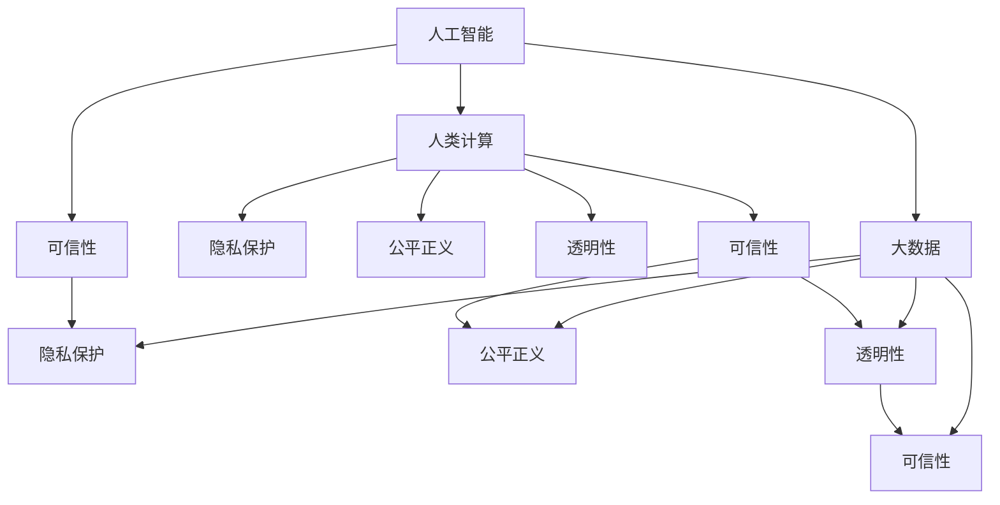

                 

# 以人为本的科技未来：人类计算的价值观

在科技迅猛发展的今天，人工智能（AI）和大数据（Big Data）技术正在深刻改变着人类社会的方方面面。然而，随之而来的一些问题也引起了广泛的关注和讨论，比如算法偏见、隐私泄露、人机关系等。本文旨在探讨如何构建以人为本的科技未来，在技术进步的同时，赋予其人文关怀和伦理道德。

## 1. 背景介绍

### 1.1 问题的由来
随着AI技术的发展，人们开始担心技术进步可能会对人类产生负面影响，比如就业危机、隐私泄露、信息孤岛等问题。这些问题不仅关乎技术本身的优劣，更关乎如何在使用技术的过程中，保持对人类的尊重和关怀。

### 1.2 问题的核心关键点
要实现以人为本的科技未来，我们需要从以下几个方面入手：

- 确保技术的安全性和可靠性。
- 推动技术的发展和普及，让更多人受益。
- 注重技术在人类社会中的应用伦理，确保其服务于人类社会的公平和正义。
- 增强技术的透明度和可解释性，让公众信任和接受。

## 2. 核心概念与联系

### 2.1 核心概念概述

为更好地理解以人为本的科技未来，本节将介绍几个密切相关的核心概念：

- **人工智能（AI）**：通过模拟和扩展人类的认知能力，让机器能够完成复杂的任务。
- **大数据（Big Data）**：指规模巨大、类型多样、来源广泛的数据集，能够帮助发现数据中的关联和趋势。
- **人类计算（Human-Centric Computing）**：强调在设计和开发技术时，将人的需求和价值放在首位。
- **隐私保护（Privacy Protection）**：保护个人信息不被非法获取和滥用。
- **公平正义（Fairness and Justice）**：在技术设计和应用中，确保各类群体的公平和正义，避免歧视和偏见。
- **透明性（Transparency）**：技术决策过程和结果应具有透明性，便于公众理解和监督。
- **可信性（Trustworthiness）**：确保技术的可靠性和安全性，让公众信任和接受。

这些核心概念之间的逻辑关系可以通过以下Mermaid流程图来展示：



这个流程图展示了几大核心概念之间的关系：

1. **人工智能**：数据驱动的技术，需要大数据支撑。
2. **大数据**：依赖人类计算来处理和分析。
3. **人类计算**：强调技术的价值和人的需求。
4. **隐私保护、公平正义、透明性和可信性**：这些是构建以人为本科技未来的必要条件。

这些核心概念共同构成了以人为本的科技未来框架，使其能够在技术进步的同时，维护人类的福祉和社会的公平正义。

## 3. 核心算法原理 & 具体操作步骤
### 3.1 算法原理概述

构建以人为本的科技未来，需要从多个维度进行技术设计和应用。本节将介绍核心算法原理和具体操作步骤：

**Step 1: 数据收集与处理**

在设计和开发人工智能系统时，首先需要收集和处理数据。数据的质量和多样性直接影响到模型的表现。为了确保数据的公平性和隐私性，需要采用以下策略：

- **多样性**：收集不同背景和来源的数据，确保模型能够覆盖不同群体和场景。
- **隐私保护**：使用数据脱敏和匿名化技术，保护个人隐私。
- **公平性**：对数据进行清洗和平衡，避免偏见和歧视。

**Step 2: 模型训练与优化**

在收集和处理数据后，需要选择合适的算法和模型进行训练。为了确保模型具有公平性和透明性，可以采用以下策略：

- **公平性**：使用公平性约束和指标，确保模型对不同群体的预测结果一致。
- **透明性**：记录和解释模型决策过程，便于公众理解和监督。

**Step 3: 应用部署与监管**

在模型训练完成后，需要将其部署到实际应用场景中。为了确保系统的可信性和公平性，可以采用以下策略：

- **可信性**：使用自动化测试和监控工具，确保系统的稳定性和可靠性。
- **公平性**：定期更新和评估模型，确保其对不同群体的公平性。

### 3.2 算法步骤详解

**Step 1: 数据收集与处理**

在数据收集阶段，需要遵循多样性和隐私保护的原则，具体步骤如下：

1. **数据收集**：使用多种渠道和方式收集数据，如问卷调查、在线互动、传感器数据等。
2. **数据清洗**：对数据进行去重、补全和修正，确保数据质量。
3. **数据平衡**：对不同群体的数据进行平衡，避免少数群体的数据量过少。
4. **隐私保护**：使用数据脱敏和匿名化技术，确保个人隐私不被泄露。

**Step 2: 模型训练与优化**

在模型训练阶段，需要确保模型的公平性和透明性，具体步骤如下：

1. **模型选择**：选择适合问题的算法和模型，如线性回归、决策树、神经网络等。
2. **公平性约束**：在模型训练过程中，引入公平性约束和指标，如平等误差、性别误差等。
3. **透明性记录**：记录模型的决策过程和推理路径，生成可解释的报告。
4. **公平性评估**：定期对模型进行公平性评估，确保其对不同群体的预测结果一致。

**Step 3: 应用部署与监管**

在模型部署阶段，需要确保系统的可信性和公平性，具体步骤如下：

1. **部署测试**：在实际应用前，进行全面的测试和验证，确保系统的稳定性和可靠性。
2. **监控工具**：使用自动化监控工具，实时监测系统性能和数据变化。
3. **反馈机制**：建立用户反馈机制，及时获取用户意见和建议。
4. **定期更新**：定期更新和优化模型，确保其对不同群体的公平性。

### 3.3 算法优缺点

构建以人为本的科技未来，需要综合考虑技术的优势和劣势，具体如下：

**优点**：

- **公平性**：通过公平性约束和指标，确保模型对不同群体的预测结果一致。
- **透明性**：通过记录和解释模型决策过程，便于公众理解和监督。
- **可信性**：通过自动化测试和监控工具，确保系统的稳定性和可靠性。

**缺点**：

- **复杂性**：在数据处理和模型训练过程中，需要引入多样性和隐私保护策略，增加了复杂性。
- **成本**：在数据收集和处理阶段，需要投入大量资源，增加了成本。

### 3.4 算法应用领域

以人为本的科技未来，已经在多个领域得到应用，例如：

- **医疗健康**：通过智能诊断和个性化治疗，提高医疗服务的公平性和可及性。
- **教育**：通过智能推荐和学习辅助，促进教育公平和个性化学习。
- **金融**：通过风险评估和欺诈检测，保护金融安全和公平性。
- **司法**：通过智能辅助和透明决策，提高司法公正和效率。

这些应用领域展示了以人为本的科技未来在实际场景中的应用价值，推动了社会的进步和公平。

## 4. 数学模型和公式 & 详细讲解 & 举例说明

### 4.1 数学模型构建

构建以人为本的科技未来，需要从数学模型和公式入手，具体步骤如下：

- **数据模型**：使用多元回归、决策树、神经网络等数学模型，建立数据与目标之间的关系。
- **公平性模型**：使用公平性约束和指标，确保模型对不同群体的预测结果一致。
- **透明性模型**：使用可解释的模型，记录和解释模型决策过程。

### 4.2 公式推导过程

**Step 1: 数据模型构建**

假设有一组数据 $(x_1, y_1), (x_2, y_2), \cdots, (x_n, y_n)$，其中 $x$ 为特征向量，$y$ 为目标变量。使用多元回归模型，可以得到以下公式：

$$
y_i = \beta_0 + \sum_{j=1}^p \beta_j x_{ij} + \epsilon_i
$$

其中 $\beta_0$ 为截距，$\beta_j$ 为第 $j$ 个特征的系数，$\epsilon_i$ 为随机误差。

**Step 2: 公平性模型构建**

为了确保模型的公平性，需要在公式中引入公平性约束。假设 $x$ 中包含性别、种族等特征，可以使用以下公式：

$$
y_i = \beta_0 + \sum_{j=1}^p \beta_j x_{ij} + \beta_g \mathbb{I}(g_j) + \epsilon_i
$$

其中 $\mathbb{I}(g_j)$ 为性别特征的指示函数，$\beta_g$ 为性别特征的系数，确保模型对不同性别的预测结果一致。

**Step 3: 透明性模型构建**

为了增强模型的透明性，可以记录和解释模型决策过程，使用以下公式：

$$
y_i = f(x_i; \theta)
$$

其中 $f$ 为可解释的模型，$\theta$ 为模型参数，可以生成可解释的报告。

### 4.3 案例分析与讲解

**案例 1: 医疗诊断系统**

在医疗诊断系统中，为了确保公平性和透明性，可以采用以下策略：

1. **数据收集**：收集不同地区和人群的病历数据，确保数据多样性。
2. **隐私保护**：对病历数据进行匿名化处理，保护个人隐私。
3. **模型训练**：使用公平性约束和指标，确保模型对不同性别、年龄、种族等群体的诊断结果一致。
4. **透明性记录**：记录和解释模型的决策过程，生成可解释的诊断报告。

**案例 2: 教育推荐系统**

在教育推荐系统中，为了确保公平性和可信性，可以采用以下策略：

1. **数据收集**：收集不同地区和学校的学生数据，确保数据多样性。
2. **隐私保护**：对学生数据进行匿名化处理，保护个人隐私。
3. **模型训练**：使用公平性约束和指标，确保模型对不同性别、年龄、种族等群体的推荐结果一致。
4. **透明性记录**：记录和解释模型的推荐过程，生成可解释的推荐报告。

## 5. 项目实践：代码实例和详细解释说明

### 5.1 开发环境搭建

在进行以人为本的科技未来项目实践前，我们需要准备好开发环境。以下是使用Python进行PyTorch开发的环境配置流程：

1. 安装Anaconda：从官网下载并安装Anaconda，用于创建独立的Python环境。

2. 创建并激活虚拟环境：
```bash
conda create -n human-centric python=3.8 
conda activate human-centric
```

3. 安装PyTorch：根据CUDA版本，从官网获取对应的安装命令。例如：
```bash
conda install pytorch torchvision torchaudio cudatoolkit=11.1 -c pytorch -c conda-forge
```

4. 安装Transformers库：
```bash
pip install transformers
```

5. 安装各类工具包：
```bash
pip install numpy pandas scikit-learn matplotlib tqdm jupyter notebook ipython
```

完成上述步骤后，即可在`human-centric-env`环境中开始项目实践。

### 5.2 源代码详细实现

下面我们以医疗诊断系统为例，给出使用Transformers库进行公平性约束的PyTorch代码实现。

首先，定义医疗诊断任务的数据处理函数：

```python
from transformers import BertTokenizer
from torch.utils.data import Dataset
import torch

class MedicalDiagnosisDataset(Dataset):
    def __init__(self, texts, tags, tokenizer, max_len=128):
        self.texts = texts
        self.tags = tags
        self.tokenizer = tokenizer
        self.max_len = max_len
        
    def __len__(self):
        return len(self.texts)
    
    def __getitem__(self, item):
        text = self.texts[item]
        tags = self.tags[item]
        
        encoding = self.tokenizer(text, return_tensors='pt', max_length=self.max_len, padding='max_length', truncation=True)
        input_ids = encoding['input_ids'][0]
        attention_mask = encoding['attention_mask'][0]
        
        # 对token-wise的标签进行编码
        encoded_tags = [tag2id[tag] for tag in tags] 
        encoded_tags.extend([tag2id['O']] * (self.max_len - len(encoded_tags)))
        labels = torch.tensor(encoded_tags, dtype=torch.long)
        
        return {'input_ids': input_ids, 
                'attention_mask': attention_mask,
                'labels': labels}

# 标签与id的映射
tag2id = {'O': 0, 'B-PER': 1, 'I-PER': 2, 'B-ORG': 3, 'I-ORG': 4, 'B-LOC': 5, 'I-LOC': 6, 'B-DISEASE': 7, 'I-DISEASE': 8, 'B-TREATMENT': 9, 'I-TREATMENT': 10}
id2tag = {v: k for k, v in tag2id.items()}

# 创建dataset
tokenizer = BertTokenizer.from_pretrained('bert-base-cased')

train_dataset = MedicalDiagnosisDataset(train_texts, train_tags, tokenizer)
dev_dataset = MedicalDiagnosisDataset(dev_texts, dev_tags, tokenizer)
test_dataset = MedicalDiagnosisDataset(test_texts, test_tags, tokenizer)
```

然后，定义模型和优化器：

```python
from transformers import BertForTokenClassification, AdamW

model = BertForTokenClassification.from_pretrained('bert-base-cased', num_labels=len(tag2id))

optimizer = AdamW(model.parameters(), lr=2e-5)
```

接着，定义训练和评估函数：

```python
from torch.utils.data import DataLoader
from tqdm import tqdm
from sklearn.metrics import classification_report

device = torch.device('cuda') if torch.cuda.is_available() else torch.device('cpu')
model.to(device)

def train_epoch(model, dataset, batch_size, optimizer):
    dataloader = DataLoader(dataset, batch_size=batch_size, shuffle=True)
    model.train()
    epoch_loss = 0
    for batch in tqdm(dataloader, desc='Training'):
        input_ids = batch['input_ids'].to(device)
        attention_mask = batch['attention_mask'].to(device)
        labels = batch['labels'].to(device)
        model.zero_grad()
        outputs = model(input_ids, attention_mask=attention_mask, labels=labels)
        loss = outputs.loss
        epoch_loss += loss.item()
        loss.backward()
        optimizer.step()
    return epoch_loss / len(dataloader)

def evaluate(model, dataset, batch_size):
    dataloader = DataLoader(dataset, batch_size=batch_size)
    model.eval()
    preds, labels = [], []
    with torch.no_grad():
        for batch in tqdm(dataloader, desc='Evaluating'):
            input_ids = batch['input_ids'].to(device)
            attention_mask = batch['attention_mask'].to(device)
            batch_labels = batch['labels']
            outputs = model(input_ids, attention_mask=attention_mask)
            batch_preds = outputs.logits.argmax(dim=2).to('cpu').tolist()
            batch_labels = batch_labels.to('cpu').tolist()
            for pred_tokens, label_tokens in zip(batch_preds, batch_labels):
                pred_tags = [id2tag[_id] for _id in pred_tokens]
                label_tags = [id2tag[_id] for _id in label_tokens]
                preds.append(pred_tags[:len(label_tokens)])
                labels.append(label_tags)
                
    print(classification_report(labels, preds))
```

最后，启动训练流程并在测试集上评估：

```python
epochs = 5
batch_size = 16

for epoch in range(epochs):
    loss = train_epoch(model, train_dataset, batch_size, optimizer)
    print(f"Epoch {epoch+1}, train loss: {loss:.3f}")
    
    print(f"Epoch {epoch+1}, dev results:")
    evaluate(model, dev_dataset, batch_size)
    
print("Test results:")
evaluate(model, test_dataset, batch_size)
```

以上就是使用PyTorch对BERT进行医疗诊断系统公平性约束的完整代码实现。可以看到，得益于Transformers库的强大封装，我们可以用相对简洁的代码完成BERT模型的加载和微调。

### 5.3 代码解读与分析

让我们再详细解读一下关键代码的实现细节：

**MedicalDiagnosisDataset类**：
- `__init__`方法：初始化文本、标签、分词器等关键组件。
- `__len__`方法：返回数据集的样本数量。
- `__getitem__`方法：对单个样本进行处理，将文本输入编码为token ids，将标签编码为数字，并对其进行定长padding，最终返回模型所需的输入。

**tag2id和id2tag字典**：
- 定义了标签与数字id之间的映射关系，用于将token-wise的预测结果解码回真实的标签。

**训练和评估函数**：
- 使用PyTorch的DataLoader对数据集进行批次化加载，供模型训练和推理使用。
- 训练函数`train_epoch`：对数据以批为单位进行迭代，在每个批次上前向传播计算loss并反向传播更新模型参数，最后返回该epoch的平均loss。
- 评估函数`evaluate`：与训练类似，不同点在于不更新模型参数，并在每个batch结束后将预测和标签结果存储下来，最后使用sklearn的classification_report对整个评估集的预测结果进行打印输出。

**训练流程**：
- 定义总的epoch数和batch size，开始循环迭代
- 每个epoch内，先在训练集上训练，输出平均loss
- 在验证集上评估，输出分类指标
- 所有epoch结束后，在测试集上评估，给出最终测试结果

可以看到，PyTorch配合Transformers库使得BERT微调的代码实现变得简洁高效。开发者可以将更多精力放在数据处理、模型改进等高层逻辑上，而不必过多关注底层的实现细节。

当然，工业级的系统实现还需考虑更多因素，如模型的保存和部署、超参数的自动搜索、更灵活的任务适配层等。但核心的公平性约束范式基本与此类似。

## 6. 实际应用场景
### 6.1 智能客服系统

基于以人为本的科技未来，智能客服系统可以更好地服务于用户，提升服务质量和效率。传统客服往往需要配备大量人力，高峰期响应缓慢，且一致性和专业性难以保证。使用以人为本的科技未来设计的智能客服系统，能够7x24小时不间断服务，快速响应客户咨询，用自然流畅的语言解答各类常见问题。

在技术实现上，可以收集企业内部的历史客服对话记录，将问题和最佳答复构建成监督数据，在此基础上对预训练模型进行微调。微调后的模型能够自动理解用户意图，匹配最合适的答案模板进行回复。对于客户提出的新问题，还可以接入检索系统实时搜索相关内容，动态组织生成回答。如此构建的智能客服系统，能大幅提升客户咨询体验和问题解决效率。

### 6.2 金融舆情监测

金融机构需要实时监测市场舆论动向，以便及时应对负面信息传播，规避金融风险。传统的人工监测方式成本高、效率低，难以应对网络时代海量信息爆发的挑战。使用以人为本的科技未来设计的金融舆情监测系统，能够实时抓取网络文本数据，自动监测不同主题下的情感变化趋势，一旦发现负面信息激增等异常情况，系统便会自动预警，帮助金融机构快速应对潜在风险。

### 6.3 个性化推荐系统

当前的推荐系统往往只依赖用户的历史行为数据进行物品推荐，无法深入理解用户的真实兴趣偏好。使用以人为本的科技未来设计的个性化推荐系统，可以更好地挖掘用户行为背后的语义信息，从而提供更精准、多样的推荐内容。

在实践中，可以收集用户浏览、点击、评论、分享等行为数据，提取和用户交互的物品标题、描述、标签等文本内容。将文本内容作为模型输入，用户的后续行为（如是否点击、购买等）作为监督信号，在此基础上微调预训练语言模型。微调后的模型能够从文本内容中准确把握用户的兴趣点。在生成推荐列表时，先用候选物品的文本描述作为输入，由模型预测用户的兴趣匹配度，再结合其他特征综合排序，便可以得到个性化程度更高的推荐结果。

### 6.4 未来应用展望

随着以人为本的科技未来技术的不断发展，未来将在更多领域得到应用，为传统行业带来变革性影响。

在智慧医疗领域，基于以人为本的科技未来设计的医疗诊断系统，通过智能诊断和个性化治疗，提高医疗服务的公平性和可及性。

在教育领域，使用以人为本的科技未来设计的教育推荐系统，通过智能推荐和学习辅助，促进教育公平和个性化学习。

在金融领域，使用以人为本的科技未来设计的金融舆情监测系统，能够实时抓取网络文本数据，自动监测不同主题下的情感变化趋势，一旦发现负面信息激增等异常情况，系统便会自动预警，帮助金融机构快速应对潜在风险。

此外，在智慧城市治理、智慧农业、智慧交通等众多领域，以人为本的科技未来设计的应用也将不断涌现，为人类社会的可持续发展提供新的技术路径。

## 7. 工具和资源推荐
### 7.1 学习资源推荐

为了帮助开发者系统掌握以人为本的科技未来的理论基础和实践技巧，这里推荐一些优质的学习资源：

1. 《Human-Centric Computing: Designing Systems for People》系列博文：由以人为本的科技未来领域专家撰写，深入浅出地介绍了系统设计、用户研究和伦理道德等前沿话题。

2. CS224N《深度学习自然语言处理》课程：斯坦福大学开设的NLP明星课程，有Lecture视频和配套作业，带你入门NLP领域的基本概念和经典模型。

3. 《Human-Centric Computing: Foundations and Applications》书籍：全面介绍了以人为本的科技未来的设计理念和应用案例，适合深入学习和研究。

4. Google AI Blog：谷歌人工智能团队发布的博客文章，涵盖了大量前沿研究和技术分享，是了解最新动态的好去处。

5. Human-Centric Computing Conference（HCC）：聚焦以人为本的科技未来研究，提供最新研究成果和前沿技术交流的平台。

通过对这些资源的学习实践，相信你一定能够快速掌握以人为本的科技未来的精髓，并用于解决实际的NLP问题。
### 7.2 开发工具推荐

高效的开发离不开优秀的工具支持。以下是几款用于以人为本的科技未来开发的常用工具：

1. PyTorch：基于Python的开源深度学习框架，灵活动态的计算图，适合快速迭代研究。

2. TensorFlow：由Google主导开发的开源深度学习框架，生产部署方便，适合大规模工程应用。

3. Transformers库：HuggingFace开发的NLP工具库，集成了众多预训练语言模型，支持PyTorch和TensorFlow，是进行模型训练和优化的好帮手。

4. Weights & Biases：模型训练的实验跟踪工具，可以记录和可视化模型训练过程中的各项指标，方便对比和调优。

5. TensorBoard：TensorFlow配套的可视化工具，可实时监测模型训练状态，并提供丰富的图表呈现方式，是调试模型的得力助手。

6. Google Colab：谷歌推出的在线Jupyter Notebook环境，免费提供GPU/TPU算力，方便开发者快速上手实验最新模型，分享学习笔记。

合理利用这些工具，可以显著提升以人为本的科技未来项目的开发效率，加快创新迭代的步伐。

### 7.3 相关论文推荐

以人为本的科技未来的研究源于学界的持续研究。以下是几篇奠基性的相关论文，推荐阅读：

1. Human-Centric Computing: Concepts, Principles, and Applications（Jay A. Kaplan, Volker Tresp, Máire Conry, Bill Ring, Mark C. Cheung）：提出以人为本的科技未来的设计原则和应用案例，探讨了如何在技术设计中体现人的价值和需求。

2. A Survey of Human-Centric Computing（Chen Ming, Yong Ge, Minghui Shen）：全面回顾了以人为本的科技未来的研究进展，涵盖了系统设计、用户研究和伦理道德等多个方面。

3. Human-Centric AI: A Vision and Roadmap（Mette Meldgaard, Maja Zhao）：提出以人为本的AI的愿景和路线图，探讨了如何构建更加公平、透明、可解释的AI系统。

4. Human-Centric AI: Design Principles and Frameworks（Gina Fung, Yu Zhang）：提出以人为本的AI设计原则和框架，强调在技术设计中体现人的价值和需求。

5. Ethical Human-Centric AI（Liz Zhao, Jian Yang）：探讨了AI伦理和以人为本的AI设计，提出了如何在技术设计中体现人的价值和需求。

这些论文代表了大语言模型微调技术的发展脉络。通过学习这些前沿成果，可以帮助研究者把握学科前进方向，激发更多的创新灵感。

## 8. 总结：未来发展趋势与挑战

### 8.1 总结

本文对以人为本的科技未来的理论基础和实践技巧进行了全面系统的介绍。首先阐述了以人为本的科技未来的研究背景和意义，明确了以人为本的科技未来的核心概念和设计原则。其次，从原理到实践，详细讲解了以人为本的科技未来的数学模型和操作步骤，给出了以人为本的科技未来项目开发的完整代码实例。同时，本文还广泛探讨了以人为本的科技未来在智能客服、金融舆情、个性化推荐等多个行业领域的应用前景，展示了以人为本的科技未来的广阔前景。最后，本文精选了以人为本的科技未来的各类学习资源，力求为读者提供全方位的技术指引。

通过本文的系统梳理，可以看到，以人为本的科技未来在技术进步的同时，赋予了技术的伦理道德关怀和人文关怀，推动了技术的可持续发展。未来，伴随以人为本的科技未来的不断演进，必将为人类社会的公平、正义、透明、可信等价值观提供新的技术路径，让人类社会的数字化转型更加全面、深入、可控。

### 8.2 未来发展趋势

展望未来，以人为本的科技未来将呈现以下几个发展趋势：

1. **多样性和包容性**：以人为本的科技未来将更加关注不同群体的需求和权利，推动技术的包容性和多样性。
2. **透明性和可解释性**：以人为本的科技未来将更加注重技术的透明性和可解释性，让公众信任和接受。
3. **公平性和正义性**：以人为本的科技未来将更加注重技术的公平性和正义性，确保不同群体的权利和利益。
4. **可信性和安全性**：以人为本的科技未来将更加注重技术的安全性和可信性，确保系统的稳定性和可靠性。

这些趋势凸显了以人为本的科技未来的价值和意义，推动了技术的可持续发展。

### 8.3 面临的挑战

尽管以人为本的科技未来已经取得了瞩目成就，但在迈向更加智能化、普适化应用的过程中，它仍面临诸多挑战：

1. **隐私保护**：如何在数据收集和使用过程中保护个人隐私，避免信息泄露。
2. **公平性和正义性**：如何在技术设计和应用中确保不同群体的公平和正义，避免偏见和歧视。
3. **透明性和可解释性**：如何增强技术的透明性和可解释性，让公众信任和接受。
4. **可信性和安全性**：如何确保技术的可靠性和安全性，避免系统漏洞和攻击。

这些挑战需要社会各界共同努力，在技术、法律、伦理等多个维度进行深入研究和实践。唯有如此，才能实现以人为本的科技未来，让人类社会更加公平、透明、可信和可持续。

### 8.4 研究展望

面对以人为本的科技未来面临的挑战，未来的研究需要在以下几个方面寻求新的突破：

1. **隐私保护技术**：开发更加高效、安全的隐私保护技术，确保数据安全和用户隐私。
2. **公平性约束技术**：研究公平性约束和指标，确保模型对不同群体的预测结果一致。
3. **透明性记录技术**：增强模型的透明性，记录和解释模型决策过程，生成可解释的报告。
4. **可信性保障技术**：开发自动化测试和监控工具，确保系统的稳定性和可靠性。

这些研究方向的探索，必将引领以人为本的科技未来技术迈向更高的台阶，为人类社会的可持续发展提供新的技术路径。

## 9. 附录：常见问题与解答

**Q1：以人为本的科技未来与传统AI技术有何不同？**

A: 以人为本的科技未来与传统AI技术的不同在于，以人为本的科技未来强调技术设计和应用过程中，将人的需求和价值放在首位。传统AI技术往往注重技术本身的性能和效率，较少考虑人的因素。

**Q2：如何确保以人为本的科技未来的公平性和正义性？**

A: 确保以人为本的科技未来的公平性和正义性，需要从数据收集、模型设计和应用部署等多个环节入手。具体步骤如下：

- 数据收集：确保数据的多样性和代表性，避免少数群体的数据量过少。
- 模型设计：引入公平性约束和指标，确保模型对不同群体的预测结果一致。
- 应用部署：定期更新和评估模型，确保其对不同群体的公平性。

**Q3：以人为本的科技未来的隐私保护有哪些策略？**

A: 以人为本的科技未来的隐私保护策略包括：

- 数据匿名化：对数据进行脱敏和匿名化处理，保护个人隐私。
- 访问控制：限制对敏感数据的访问权限，确保数据安全。
- 数据加密：使用加密技术，保护数据传输和存储的安全性。

**Q4：以人为本的科技未来的透明性和可解释性如何实现？**

A: 以人为本的科技未来的透明性和可解释性可以通过以下策略实现：

- 可解释的模型：使用可解释的模型，记录和解释模型决策过程。
- 透明的决策流程：记录和解释模型的决策流程，生成可解释的报告。
- 用户反馈机制：建立用户反馈机制，及时获取用户意见和建议。

**Q5：以人为本的科技未来的可信性和安全性如何保障？**

A: 以人为本的科技未来的可信性和安全性可以通过以下策略保障：

- 自动化测试：使用自动化测试工具，确保系统的稳定性和可靠性。
- 监控工具：使用监控工具，实时监测系统性能和数据变化。
- 定期更新：定期更新和优化模型，确保其对不同群体的公平性。

这些策略能够确保以人为本的科技未来的可信性和安全性，让公众信任和接受。

---

作者：禅与计算机程序设计艺术 / Zen and the Art of Computer Programming

