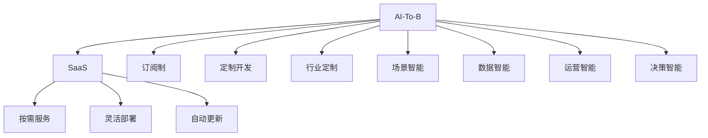

                 

# 企业服务创业：To B市场的蓝海

## 1. 背景介绍

### 1.1 问题由来

在企业服务领域，传统的以企业内部IT部门为主导的软件开发模式面临诸多挑战。企业IT需求复杂多样，规模较大且变化频繁，导致定制化开发成本高、周期长，难以快速响应业务变化。同时，企业内部IT人才匮乏，技能老化，难以满足快速迭代的IT需求。

近年来，云计算、人工智能等新兴技术发展迅速，为企业服务市场带来了新的机遇。云计算服务厂商通过按需、弹性的服务模式，为传统企业IT需求提供了更灵活、高效的解决方案。而人工智能技术的涌现，更是为企业服务市场注入了强大的技术动能。

人工智能企业服务，简称为AI-To-B，通过提供基于人工智能技术的SaaS（软件即服务）产品，为企业解决各类IT需求，提升企业数字化转型的效率和效果。AI-To-B市场正处于高速发展阶段，根据IDC预测，到2025年全球AI-To-B市场规模将达到3350亿美元。

### 1.2 问题核心关键点

AI-To-B市场具有以下关键特点：

1. **技术壁垒高**：AI-To-B涉及多种前沿AI技术，包括机器学习、深度学习、自然语言处理、计算机视觉等，技术复杂度较高。
2. **需求多样化**：企业服务需求场景复杂，每个行业、企业的需求各不相同，对AI-To-B解决方案提出了多样化的定制化需求。
3. **数据依赖性强**：AI-To-B解决方案依赖于企业内部业务数据，数据质量、隐私和安全成为重要考量。
4. **客户关系管理**：To B市场与To C市场不同，客户关系管理至关重要，客户续约率、口碑传播效应直接影响到企业的长期发展。
5. **商业模式复杂**：AI-To-B市场涉及订阅、定制开发、咨询服务等多种商业模式，如何平衡收入和成本成为企业关注的重点。

这些关键点决定了AI-To-B创业公司需要具备较强的技术能力、行业洞察力、客户管理能力以及商业运营能力。

## 2. 核心概念与联系

### 2.1 核心概念概述

为了更好地理解AI-To-B市场，我们首先介绍几个核心概念：

- **AI-To-B**：基于人工智能技术的To B解决方案，包括但不限于AI数据智能、AI运营智能、AI决策智能等。
- **SaaS**：软件即服务，通过网络提供可按需使用的应用服务，降低企业使用成本，提升使用效率。
- **订阅制**：客户按月或按年支付使用费，获取服务的模式。
- **定制开发**：根据客户需求量身定制AI-To-B解决方案的模式。
- **行业定制**：根据特定行业特点进行定制化的AI-To-B解决方案。
- **场景智能**：根据特定业务场景定制的AI-To-B解决方案。

### 2.2 核心概念原理和架构的 Mermaid 流程图



这个流程图展示了AI-To-B的核心概念和它们之间的联系。AI-To-B通过SaaS模式，提供按需服务、灵活部署和自动更新等特性，以应对企业多样化的需求。订阅制、定制开发、行业定制和场景智能则进一步细化了AI-To-B的应用场景，使其更加贴近企业的实际需求。数据智能、运营智能和决策智能作为AI-To-B的核心能力，进一步提升了AI-To-B的价值。

## 3. 核心算法原理 & 具体操作步骤

### 3.1 算法原理概述

AI-To-B的算法原理基于以下几个核心模块：

1. **数据智能**：通过机器学习、深度学习等技术，对企业内部业务数据进行分析和挖掘，提取有价值的信息和洞察。
2. **运营智能**：利用自然语言处理、计算机视觉等技术，自动化企业日常运营任务，如客户服务、文档处理等。
3. **决策智能**：通过强化学习、推理等技术，提供基于数据的决策支持，提升企业决策效率和效果。

### 3.2 算法步骤详解

AI-To-B的算法步骤大致如下：

1. **数据采集**：收集企业内部业务数据，如客户信息、销售数据、产品信息等。
2. **数据预处理**：清洗、归一化数据，准备数据模型训练。
3. **模型训练**：选择适当的AI模型，如决策树、神经网络等，在数据集上进行训练。
4. **模型评估**：使用验证集评估模型性能，进行超参数调优。
5. **模型部署**：将训练好的模型部署到SaaS平台，提供按需服务。
6. **持续优化**：根据用户反馈和业务需求，持续优化模型，提升服务质量。

### 3.3 算法优缺点

AI-To-B算法具有以下优点：

1. **灵活性**：根据企业需求，提供定制化的解决方案。
2. **高效性**：自动化日常运营任务，提升效率。
3. **预测性**：基于数据分析提供决策支持，提升决策效果。

同时，AI-To-B算法也存在以下缺点：

1. **高技术门槛**：需要具备较强的AI技术能力。
2. **数据依赖性强**：依赖企业内部业务数据，数据质量、隐私和安全问题需重点关注。
3. **定制化成本高**：根据企业需求量身定制，成本较高。
4. **持续优化难度大**：需要持续优化模型，提升服务质量。

### 3.4 算法应用领域

AI-To-B算法主要应用于以下几个领域：

1. **客户服务**：提供智能客服、聊天机器人等自动化服务，提升客户满意度。
2. **销售管理**：利用数据分析预测销售趋势，提供客户流失预警、销售推荐等功能。
3. **运营管理**：自动化文档处理、流程管理等，提升运营效率。
4. **风险管理**：通过数据分析和预测，提供风险预警和控制功能。
5. **产品推荐**：基于用户行为和偏好，提供个性化产品推荐。

## 4. 数学模型和公式 & 详细讲解 & 举例说明

### 4.1 数学模型构建

AI-To-B算法中的数据智能部分，主要涉及分类、回归等模型。以客户流失预测为例，构建数学模型如下：

$$
\hat{y} = \mathbb{P}(\text{客户流失}) = \sigma(\mathbf{W}[\mathbf{x} + \mathbf{b}])
$$

其中，$\mathbf{x}$ 为输入特征向量，$\mathbf{W}$ 和 $\mathbf{b}$ 为模型参数，$\sigma$ 为sigmoid函数，$\hat{y}$ 为模型预测的概率。

### 4.2 公式推导过程

以二分类任务为例，假设数据集为 $\{(\mathbf{x}_i, y_i)\}_{i=1}^N$，其中 $\mathbf{x}_i$ 为输入特征向量，$y_i \in \{0, 1\}$ 为标签。构建模型并使用交叉熵损失函数，最小化损失函数：

$$
\mathcal{L}(\mathbf{W}, \mathbf{b}) = -\frac{1}{N}\sum_{i=1}^N y_i\log(\hat{y}_i) + (1-y_i)\log(1-\hat{y}_i)
$$

采用梯度下降法最小化损失函数，得到模型参数的更新公式：

$$
\mathbf{W} \leftarrow \mathbf{W} - \eta\nabla_{\mathbf{W}}\mathcal{L}(\mathbf{W}, \mathbf{b}), \mathbf{b} \leftarrow \mathbf{b} - \eta\nabla_{\mathbf{b}}\mathcal{L}(\mathbf{W}, \mathbf{b})
$$

其中，$\eta$ 为学习率。

### 4.3 案例分析与讲解

以客户流失预测为例，数据分析步骤如下：

1. **数据预处理**：清洗客户数据，提取特征，如年龄、性别、购买频率等。
2. **模型训练**：使用逻辑回归模型训练客户流失预测模型，得到模型参数 $\mathbf{W}$ 和 $\mathbf{b}$。
3. **模型评估**：使用验证集评估模型性能，如准确率、召回率等。
4. **模型部署**：将训练好的模型部署到SaaS平台，实时计算客户流失概率。
5. **持续优化**：根据用户反馈和业务需求，持续优化模型，提升预测准确度。

## 5. 项目实践：代码实例和详细解释说明

### 5.1 开发环境搭建

为了进行AI-To-B项目的开发，需要准备以下开发环境：

1. **编程语言**：Python，基于Python的开源深度学习框架PyTorch或TensorFlow。
2. **开发工具**：Jupyter Notebook、PyCharm、Git等。
3. **数据集**：企业内部业务数据集，如客户信息、销售数据等。
4. **云计算平台**：AWS、Azure、阿里云等，提供云计算服务支持。
5. **模型库**：TensorFlow、PyTorch、Keras等，提供常用的AI模型和算法库。

### 5.2 源代码详细实现

以客户流失预测为例，以下是使用PyTorch实现的代码：

```python
import torch
import torch.nn as nn
import torch.optim as optim
from torch.utils.data import Dataset, DataLoader

class Customer流失预测数据集(Dataset):
    def __init__(self, data, labels):
        self.data = data
        self.labels = labels
        
    def __len__(self):
        return len(self.data)
    
    def __getitem__(self, item):
        return self.data[item], self.labels[item]

class 预测模型(nn.Module):
    def __init__(self, input_dim, output_dim):
        super(预测模型, self).__init__()
        self.fc1 = nn.Linear(input_dim, 128)
        self.fc2 = nn.Linear(128, 64)
        self.fc3 = nn.Linear(64, output_dim)
        self.sigmoid = nn.Sigmoid()
        
    def forward(self, x):
        x = self.fc1(x)
        x = self.sigmoid(x)
        x = self.fc2(x)
        x = self.sigmoid(x)
        x = self.fc3(x)
        x = self.sigmoid(x)
        return x
    
def 训练模型(模型, 训练集, 验证集, 学习率, 迭代次数):
    criterion = nn.BCELoss()
    optimizer = optim.Adam(模型.parameters(), lr=学习率)
    for epoch in range(迭代次数):
        model.train()
        for inputs, labels in DataLoader(训练集, batch_size=64):
            optimizer.zero_grad()
            outputs = 模型(inputs)
            loss = criterion(outputs, labels)
            loss.backward()
            optimizer.step()
        
        model.eval()
        with torch.no_grad():
            val_loss = 0
            for inputs, labels in DataLoader(验证集, batch_size=64):
                outputs = 模型(inputs)
                loss = criterion(outputs, labels)
                val_loss += loss.item()
            val_loss /= len(验证集)
        
        print(f"Epoch {epoch+1}, Loss: {val_loss:.4f}")

# 使用示例
train_data = ...
train_labels = ...
test_data = ...
test_labels = ...
input_dim = 10  # 输入特征维度
output_dim = 1  # 输出标签维度
model = 预测模型(input_dim, output_dim)
train_model(model, train_data, test_data, 0.001, 100)
```

### 5.3 代码解读与分析

以下是关键代码的解读和分析：

1. **数据集类**：`Customer流失预测数据集`类，实现了数据集的加载和批处理。
2. **模型类**：`预测模型`类，定义了模型的结构，包括输入层、隐层和输出层。
3. **损失函数**：使用二分类交叉熵损失函数。
4. **优化器**：使用Adam优化器，支持自适应学习率。
5. **训练过程**：通过前向传播和反向传播更新模型参数，在训练集和验证集上交替训练。

## 6. 实际应用场景

### 6.1 智能客服系统

智能客服系统是AI-To-B市场的一个重要应用场景。通过AI-To-B技术，企业可以构建自动化客服系统，提升客户服务体验和效率。

具体而言，可以使用自然语言处理技术，训练智能客服模型，通过输入用户问题，模型自动生成回答。通过持续优化模型，提升回答的准确性和质量。此外，还可以结合语音识别、图像识别等技术，提升多模态客服能力。

### 6.2 销售管理

销售管理是AI-To-B技术的另一个重要应用场景。通过AI-To-B技术，企业可以实时监测销售数据，预测销售趋势，提供客户流失预警、销售推荐等功能。

具体而言，可以使用时间序列分析、推荐系统等技术，对销售数据进行建模，预测未来的销售趋势和客户流失情况。根据预测结果，提供个性化的销售推荐和客户挽留策略。

### 6.3 运营管理

运营管理是AI-To-B技术的另一个重要应用场景。通过AI-To-B技术，企业可以自动化日常运营任务，提升运营效率。

具体而言，可以使用自动化文档处理、流程管理等技术，减少人力成本，提升运营效率。通过数据分析和预测，提供风险预警和控制功能，提升运营决策的科学性。

### 6.4 未来应用展望

未来，AI-To-B技术将在更多领域得到应用，为传统行业带来变革性影响。以下是几个重要的发展方向：

1. **行业定制化**：针对不同行业特点，定制化AI-To-B解决方案，提升行业应用的精准性和有效性。
2. **多模态融合**：结合图像、语音、视频等多样化的数据类型，提供更加丰富和全面的AI-To-B服务。
3. **实时性**：通过边缘计算等技术，提升AI-To-B服务的实时性和响应速度。
4. **自动化管理**：通过自动化任务管理、异常检测等技术，提升AI-To-B系统的自主管理和运营能力。
5. **伦理和安全性**：注重AI-To-B系统的伦理和安全性，确保数据隐私和算法透明性。

## 7. 工具和资源推荐

### 7.1 学习资源推荐

为了帮助开发者系统掌握AI-To-B技术的理论基础和实践技巧，这里推荐一些优质的学习资源：

1. **AI-To-B技术白皮书**：详细介绍了AI-To-B技术的原理、应用场景和开发方法，是理解AI-To-B技术的入门读物。
2. **TensorFlow官方文档**：提供了TensorFlow的详细介绍和丰富的教程，帮助开发者快速上手深度学习开发。
3. **PyTorch官方文档**：提供了PyTorch的详细介绍和丰富的教程，帮助开发者快速上手深度学习开发。
4. **Kaggle竞赛平台**：提供了丰富的数据集和竞赛任务，帮助开发者实践和提升AI-To-B技术能力。
5. **AI-To-B技术社区**：提供了丰富的技术交流和资源分享，帮助开发者获取最新的AI-To-B技术动态和解决方案。

通过对这些资源的学习实践，相信你一定能够快速掌握AI-To-B技术的精髓，并用于解决实际的IT需求。

### 7.2 开发工具推荐

高效的开发离不开优秀的工具支持。以下是几款用于AI-To-B开发的常用工具：

1. **Jupyter Notebook**：提供交互式编程环境，支持Python、R等多种语言，是AI-To-B开发的常用工具。
2. **PyCharm**：支持多种编程语言，提供了丰富的开发工具和插件，提升开发效率。
3. **Git**：提供版本控制和协作开发功能，帮助团队更好地管理代码和数据。
4. **AWS、Azure、阿里云**：提供云计算服务支持，帮助企业快速搭建AI-To-B系统。
5. **TensorFlow、PyTorch、Keras**：提供常用的AI模型和算法库，帮助开发者快速实现AI-To-B应用。

合理利用这些工具，可以显著提升AI-To-B应用的开发效率，加快创新迭代的步伐。

### 7.3 相关论文推荐

AI-To-B技术的发展源于学界的持续研究。以下是几篇奠基性的相关论文，推荐阅读：

1. **《Customer Churn Prediction Using Data Mining Techniques》**：详细介绍了客户流失预测的机器学习方法。
2. **《A Survey on AI-To-B: Applications, Architectures, and Challenges》**：全面总结了AI-To-B技术的当前研究现状和未来发展方向。
3. **《Natural Language Processing with Transformers》**：介绍了Transformer模型在自然语言处理中的应用，为AI-To-B技术提供了新的参考。
4. **《Deep Learning for Customer Service》**：介绍了深度学习在智能客服中的应用，为AI-To-B技术提供了新的思路。
5. **《AI-To-B: Beyond AI Applications》**：探讨了AI-To-B技术的伦理和安全性问题，为AI-To-B技术的应用提供了指导。

这些论文代表了大语言模型微调技术的发展脉络。通过学习这些前沿成果，可以帮助研究者把握学科前进方向，激发更多的创新灵感。

## 8. 总结：未来发展趋势与挑战

### 8.1 总结

本文对AI-To-B市场的背景、核心概念、算法原理和操作步骤进行了系统介绍，详细讲解了AI-To-B市场的应用场景和发展方向，并提供了项目实践的代码示例。通过本文的系统梳理，可以看到，AI-To-B市场正在高速发展，为传统行业带来新的变革机会。

### 8.2 未来发展趋势

AI-To-B市场具有以下发展趋势：

1. **行业定制化**：针对不同行业特点，定制化AI-To-B解决方案，提升行业应用的精准性和有效性。
2. **多模态融合**：结合图像、语音、视频等多样化的数据类型，提供更加丰富和全面的AI-To-B服务。
3. **实时性**：通过边缘计算等技术，提升AI-To-B服务的实时性和响应速度。
4. **自动化管理**：通过自动化任务管理、异常检测等技术，提升AI-To-B系统的自主管理和运营能力。
5. **伦理和安全性**：注重AI-To-B系统的伦理和安全性，确保数据隐私和算法透明性。

### 8.3 面临的挑战

AI-To-B市场面临以下挑战：

1. **技术复杂度高**：AI-To-B技术涉及多种前沿AI技术，技术复杂度较高，需要具备较强的技术能力。
2. **数据依赖性强**：依赖企业内部业务数据，数据质量、隐私和安全问题需重点关注。
3. **定制化成本高**：根据企业需求量身定制，成本较高。
4. **持续优化难度大**：需要持续优化模型，提升服务质量。
5. **伦理和安全性**：注重AI-To-B系统的伦理和安全性，确保数据隐私和算法透明性。

### 8.4 研究展望

未来，AI-To-B市场需要在以下几个方面进行深入研究：

1. **行业定制化**：针对不同行业特点，定制化AI-To-B解决方案，提升行业应用的精准性和有效性。
2. **多模态融合**：结合图像、语音、视频等多样化的数据类型，提供更加丰富和全面的AI-To-B服务。
3. **实时性**：通过边缘计算等技术，提升AI-To-B服务的实时性和响应速度。
4. **自动化管理**：通过自动化任务管理、异常检测等技术，提升AI-To-B系统的自主管理和运营能力。
5. **伦理和安全性**：注重AI-To-B系统的伦理和安全性，确保数据隐私和算法透明性。

## 9. 附录：常见问题与解答

**Q1: 如何选择合适的AI-To-B解决方案？**

A: 选择合适的AI-To-B解决方案，需要考虑以下几个方面：

1. **业务需求**：明确企业的业务需求和目标，选择合适的解决方案。
2. **数据质量**：评估企业内部数据的质量和可用性，选择适合的解决方案。
3. **技术能力**：评估企业内部的技术能力和团队实力，选择适合的技术方案。
4. **成本预算**：考虑企业的成本预算和投入，选择适合的解决方案。
5. **安全性**：考虑数据隐私和安全问题，选择符合伦理和法律要求的解决方案。

**Q2: AI-To-B解决方案如何提升企业效率？**

A: AI-To-B解决方案可以通过以下几个方面提升企业效率：

1. **自动化任务**：自动化企业日常运营任务，如客户服务、文档处理等，提升效率。
2. **数据分析**：通过数据分析，提供决策支持，提升决策效率和效果。
3. **预测能力**：通过预测模型，预测销售趋势、客户流失等，提升运营决策的科学性。
4. **客户管理**：通过客户分析，提升客户满意度和忠诚度，增加客户留存率。
5. **风险管理**：通过数据分析和预测，提供风险预警和控制功能，提升风险管理能力。

**Q3: 如何评估AI-To-B解决方案的效果？**

A: 评估AI-To-B解决方案的效果，需要考虑以下几个方面：

1. **性能指标**：使用准确率、召回率、F1-score等性能指标，评估模型效果。
2. **业务影响**：评估AI-To-B解决方案对业务流程的影响，提升业务效率。
3. **用户反馈**：收集用户反馈，了解用户对AI-To-B解决方案的满意度。
4. **成本效益**：评估AI-To-B解决方案的成本和收益，评估投入产出比。
5. **数据隐私**：评估AI-To-B解决方案的数据隐私和安全问题，确保合规性。

**Q4: AI-To-B解决方案的开发和部署过程中需要注意哪些问题？**

A: 开发和部署AI-To-B解决方案，需要注意以下几个问题：

1. **数据采集**：收集企业内部业务数据，确保数据质量和完整性。
2. **数据预处理**：清洗、归一化数据，准备数据模型训练。
3. **模型训练**：选择适当的AI模型，训练模型，进行超参数调优。
4. **模型评估**：使用验证集评估模型性能，进行模型选择和优化。
5. **模型部署**：将训练好的模型部署到SaaS平台，提供按需服务。
6. **持续优化**：根据用户反馈和业务需求，持续优化模型，提升服务质量。
7. **安全性**：注重数据隐私和算法透明性，确保系统安全和合规性。

通过本文的系统梳理，可以看到，AI-To-B市场正处于高速发展阶段，为传统行业带来新的变革机会。开发者需要具备较强的技术能力、行业洞察力、客户管理能力和商业运营能力，才能开发出高品质的AI-To-B解决方案。相信随着技术的不断进步和市场的不断成熟，AI-To-B市场将迎来更多的发展机遇和应用前景。

---

作者：禅与计算机程序设计艺术 / Zen and the Art of Computer Programming

