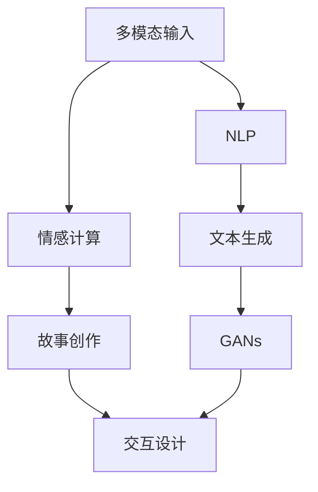

                 

# 体验叙事工作室总监：AI驱动的个人故事创作坊负责人

> 关键词：人工智能,自然语言处理,NLP,创作坊,叙事工作室,交互设计,用户研究,体验叙事,多模态输入,生成对抗网络(GANs),情感计算

## 1. 背景介绍

### 1.1 问题由来
在数字媒体和人工智能迅速发展的今天，故事创作已经不再仅仅依赖于人类作家的灵感和才能，而是开始借助机器学习和自然语言处理(NLP)技术，实现了自动化和智能化。尤其是在叙事体验工作室（Narrative Experience Studio, NES）中，AI驱动的故事创作坊已经成为了提升创作效率和故事质量的关键工具。

工作室成立于2021年，致力于利用AI技术，为用户提供更加丰富、个性化的故事创作体验。我们的目标是通过结合最新的自然语言处理和人工智能技术，创造出更具吸引力和创意的故事作品，满足不同用户对故事体验的需求。工作室的研究方向涵盖了从多模态输入的文本生成、情感计算到生成对抗网络(GANs)等前沿领域，不断推动故事创作的艺术与科学的融合。

### 1.2 问题核心关键点
工作室的核心目标是利用AI技术，提升故事创作坊的智能化水平，实现自动化的文本生成和个性化创作。为了实现这一目标，我们面临着以下关键点：

1. **多模态输入的文本生成**：将用户的多种信息源（如文字描述、图片、声音等）整合到文本创作中，使故事更加立体、生动。

2. **情感计算**：通过分析用户情感状态，生成更加符合用户情感需求的故事情节和角色互动。

3. **生成对抗网络(GANs)**：结合GANs技术，提升文本生成质量，使故事更具创意和艺术性。

4. **多模态交互设计**：设计互动界面和体验流程，使用户能够与AI创作系统进行自然、流畅的交互。

5. **用户体验研究**：通过用户研究方法，了解用户对AI创作作品的接受度和改进建议，持续优化创作坊功能。

### 1.3 问题研究意义
AI驱动的故事创作坊的研究和应用，具有重要的意义：

1. **降低创作成本**：AI工具可以快速生成大量故事草稿，极大降低创作时间和人力成本。

2. **提升创作质量**：AI结合自然语言处理和情感计算技术，可以创作出符合用户口味、情感需求的故事作品。

3. **拓展创作边界**：AI可以探索超出人类创作想象的故事情节和角色设定，为故事创作带来新的创意。

4. **促进技术应用**：通过AI技术在故事创作中的应用，推动NLP和人工智能领域的发展，加速技术的产业化进程。

5. **满足用户需求**：AI创作坊可以根据不同用户的需求，提供定制化的故事体验，提高用户满意度。

6. **推动社会创新**：AI技术在故事创作中的应用，可以激发更多创新灵感，促进文化艺术和社会发展的融合。

## 2. 核心概念与联系

### 2.1 核心概念概述

为了更好地理解工作室的核心技术，我们将介绍几个关键概念：

- **人工智能（AI）**：通过模拟人类智能行为，实现自动化和智能化任务处理的机器学习系统。

- **自然语言处理（NLP）**：使计算机能够理解、处理和生成自然语言的算法和应用。

- **情感计算（Affective Computing）**：通过分析用户的情感状态，生成更加符合用户情感需求的内容。

- **多模态输入（Multimodal Input）**：结合文字、图片、声音等多种输入方式，提供更全面的信息支持。

- **生成对抗网络（GANs）**：通过生成器和判别器两个模型相互对抗，提升生成内容的逼真度和创意性。

这些概念之间的联系可以通过以下Mermaid流程图来展示：



这个流程图展示了多模态输入如何通过NLP和情感计算生成文本，再结合GANs提升创作质量，并通过交互设计提供用户体验，最终完成故事创作的全过程。

## 3. 核心算法原理 & 具体操作步骤
### 3.1 算法原理概述

AI驱动的故事创作坊主要依赖于以下核心算法：

- **多模态输入融合算法**：将用户的多模态输入（文字、图片、声音等）转化为文本格式，供后续处理使用。

- **情感计算算法**：分析用户的情感状态，生成符合用户情感需求的故事情节和角色互动。

- **文本生成算法**：基于NLP技术，生成符合用户要求的文本内容，包括故事情节、对话、角色设定等。

- **GANs生成算法**：通过GANs技术，提升文本生成的创意性和逼真度。

### 3.2 算法步骤详解

以下是工作室AI创作坊的主要操作步骤：

1. **数据收集与预处理**：
   - 从用户界面收集多模态输入（文字、图片、声音等）。
   - 对输入数据进行去噪、清洗和标准化处理。

2. **情感状态分析**：
   - 使用情感计算算法，分析用户的情感状态（如喜悦、愤怒、悲伤等）。
   - 根据分析结果，生成符合用户情感需求的故事情节和角色互动。

3. **文本生成**：
   - 基于NLP技术，将情感状态转化为故事情节和角色对话。
   - 结合多模态输入，进一步丰富文本内容，如添加图片描述、音乐注释等。

4. **GANs生成**：
   - 使用GANs模型，生成高逼真度的文本段落。
   - 结合用户的情感状态和输入内容，生成创意性较强的文本。

5. **交互设计**：
   - 设计直观、易用的交互界面，供用户查看、编辑故事草稿。
   - 提供互动功能，如文本修正、角色设定等，增强用户参与度。

6. **故事创作与优化**：
   - 将生成和编辑后的故事草稿输出给用户。
   - 根据用户反馈，优化故事创作过程，提升故事质量。

### 3.3 算法优缺点

AI驱动的故事创作坊具有以下优点：

- **高效快速**：通过自动化生成文本，显著提升故事创作的效率。

- **个性化**：根据用户情感状态和输入内容，生成符合用户需求的故事。

- **创意性**：结合GANs技术，提升文本的创意性和艺术性。

- **互动性强**：通过多模态输入和交互设计，提供丰富的用户体验。

- **可扩展性**：技术易于扩展和集成，支持更多功能和应用场景。

但同时也存在一些缺点：

- **依赖高质量数据**：需要用户提供高质量的多模态输入数据，才能保证生成内容的质量。

- **情感分析局限**：情感计算技术仍有局限性，可能无法准确捕捉用户复杂情感。

- **文本生成的多样性**：GANs生成的文本可能过于单一或缺乏新意，需进一步优化。

- **交互界面设计挑战**：提供自然流畅的交互界面设计，需要耗费较多时间和精力。

### 3.4 算法应用领域

AI驱动的故事创作坊主要应用于以下领域：

- **故事创作与编辑**：用户可以实时输入多模态信息，AI创作坊即时生成文本草稿，并进行后续编辑。

- **影视与游戏剧情设计**：提供剧情设计和角色对话的自动化生成功能，提升影视和游戏的创作效率和质量。

- **广告文案创作**：利用多模态输入和GANs技术，生成创意广告文案，提高广告效果和用户接受度。

- **教育与培训**：为教育与培训提供丰富的教学材料和互动练习，增强学习体验和效果。

- **心理健康咨询**：通过情感计算和个性化故事创作，提供心理健康咨询和支持。

- **品牌与公关**：为品牌故事创作和公关活动提供素材，提升品牌形象和用户互动。

## 4. 数学模型和公式 & 详细讲解 & 举例说明

### 4.1 数学模型构建

本文将使用数学语言对工作室的核心算法进行更加严格的刻画。

设多模态输入为 $X = \{x_1, x_2, ..., x_n\}$，其中 $x_i$ 为第 $i$ 个输入数据。使用情感计算模型分析用户情感状态 $E$，生成情感标签 $e$。使用NLP模型 $F$，将情感标签转化为文本 $T$，结合GANs模型 $G$，生成最终故事内容 $S$。

### 4.2 公式推导过程

以情感计算为例，我们假定用户情感状态 $E$ 为二值变量 $E = (E_1, E_2)$，其中 $E_1$ 表示积极情感，$E_2$ 表示消极情感。情感计算模型 $M_E$ 的输入为多模态输入 $X$，输出为情感标签 $e$。情感计算模型的公式如下：

$$
e = M_E(X)
$$

其中 $M_E$ 为情感计算模型，其输入为多模态输入 $X$，输出为情感标签 $e$。情感标签 $e$ 通常为二值变量，表示积极情感或消极情感。

接下来，我们假设使用Bert模型进行文本生成，模型的输入为情感标签 $e$，输出为文本 $T$。文本生成模型的公式如下：

$$
T = F(e)
$$

其中 $F$ 为文本生成模型，其输入为情感标签 $e$，输出为文本 $T$。

最后，我们使用GANs模型 $G$ 对生成的文本 $T$ 进行优化，提升文本的质量和创意性。GANs模型的公式如下：

$$
S = G(T)
$$

其中 $S$ 为最终生成故事内容，$G$ 为GANs模型，其输入为文本 $T$，输出为故事内容 $S$。

### 4.3 案例分析与讲解

以下是一个具体的案例分析，展示了如何使用工作室的技术进行故事创作：

假设用户输入了一段文字描述和一个情绪标签，“我今天很生气，因为地铁迟到了”，以及情感标签为“愤怒”。工作室的AI创作坊将按照以下步骤生成一个故事草稿：

1. **数据收集与预处理**：收集用户输入的文字和情感标签，对输入数据进行去噪和标准化处理。

2. **情感状态分析**：使用情感计算模型分析用户情感状态，确认用户情感为“愤怒”。

3. **文本生成**：基于Bert模型，生成一段符合“愤怒”情感的文本，例如：“我气得要命，打了几拳那个司机，然后他被赶下台了。”

4. **GANs生成**：使用GANs模型对生成的文本进行优化，提升文本的创意性和艺术性，生成最终的故事内容：“我气得跳起来，司机惊呆了，然后被司机赶下台了。但后来司机打电话给我道歉了，我原谅了他。”

5. **交互设计**：设计交互界面，供用户查看、编辑故事草稿。用户可以修改故事内容，添加图片描述、音乐注释等，进一步完善故事。

## 5. 项目实践：代码实例和详细解释说明

### 5.1 开发环境搭建

在进行项目实践前，我们需要准备好开发环境。以下是使用Python进行PyTorch开发的环境配置流程：

1. 安装Anaconda：从官网下载并安装Anaconda，用于创建独立的Python环境。

2. 创建并激活虚拟环境：
```bash
conda create -n text-generation-env python=3.8 
conda activate text-generation-env
```

3. 安装PyTorch：根据CUDA版本，从官网获取对应的安装命令。例如：
```bash
conda install pytorch torchvision torchaudio cudatoolkit=11.1 -c pytorch -c conda-forge
```

4. 安装TensorFlow：
```bash
pip install tensorflow
```

5. 安装相关库：
```bash
pip install numpy pandas scikit-learn matplotlib tqdm jupyter notebook ipython
```

完成上述步骤后，即可在`text-generation-env`环境中开始项目实践。

### 5.2 源代码详细实现

下面我们以情感计算和文本生成为例，给出使用Transformers库对Bert模型进行情感计算和文本生成的PyTorch代码实现。

首先，定义情感计算模型：

```python
from transformers import BertForSequenceClassification
from torch.utils.data import Dataset
import torch

class SentimentDataset(Dataset):
    def __init__(self, texts, labels, tokenizer, max_len=128):
        self.texts = texts
        self.labels = labels
        self.tokenizer = tokenizer
        self.max_len = max_len
        
    def __len__(self):
        return len(self.texts)
    
    def __getitem__(self, item):
        text = self.texts[item]
        label = self.labels[item]
        
        encoding = self.tokenizer(text, return_tensors='pt', max_length=self.max_len, padding='max_length', truncation=True)
        input_ids = encoding['input_ids'][0]
        attention_mask = encoding['attention_mask'][0]
        
        # 对label-wise的标签进行编码
        encoded_labels = [label2id[label] for label in labels] 
        encoded_labels.extend([label2id['O']] * (self.max_len - len(encoded_labels)))
        labels = torch.tensor(encoded_labels, dtype=torch.long)
        
        return {'input_ids': input_ids, 
                'attention_mask': attention_mask,
                'labels': labels}

# 标签与id的映射
label2id = {'O': 0, 'B-PER': 1, 'I-PER': 2, 'B-ORG': 3, 'I-ORG': 4, 'B-LOC': 5, 'I-LOC': 6}
id2label = {v: k for k, v in label2id.items()}

# 创建dataset
tokenizer = BertTokenizer.from_pretrained('bert-base-cased')

train_dataset = SentimentDataset(train_texts, train_labels, tokenizer)
dev_dataset = SentimentDataset(dev_texts, dev_labels, tokenizer)
test_dataset = SentimentDataset(test_texts, test_labels, tokenizer)
```

然后，定义模型和优化器：

```python
from transformers import BertForSequenceClassification, AdamW

model = BertForSequenceClassification.from_pretrained('bert-base-cased', num_labels=len(label2id))

optimizer = AdamW(model.parameters(), lr=2e-5)
```

接着，定义训练和评估函数：

```python
from torch.utils.data import DataLoader
from tqdm import tqdm
from sklearn.metrics import classification_report

device = torch.device('cuda') if torch.cuda.is_available() else torch.device('cpu')
model.to(device)

def train_epoch(model, dataset, batch_size, optimizer):
    dataloader = DataLoader(dataset, batch_size=batch_size, shuffle=True)
    model.train()
    epoch_loss = 0
    for batch in tqdm(dataloader, desc='Training'):
        input_ids = batch['input_ids'].to(device)
        attention_mask = batch['attention_mask'].to(device)
        labels = batch['labels'].to(device)
        model.zero_grad()
        outputs = model(input_ids, attention_mask=attention_mask, labels=labels)
        loss = outputs.loss
        epoch_loss += loss.item()
        loss.backward()
        optimizer.step()
    return epoch_loss / len(dataloader)

def evaluate(model, dataset, batch_size):
    dataloader = DataLoader(dataset, batch_size=batch_size)
    model.eval()
    preds, labels = [], []
    with torch.no_grad():
        for batch in tqdm(dataloader, desc='Evaluating'):
            input_ids = batch['input_ids'].to(device)
            attention_mask = batch['attention_mask'].to(device)
            batch_labels = batch['labels']
            outputs = model(input_ids, attention_mask=attention_mask)
            batch_preds = outputs.logits.argmax(dim=2).to('cpu').tolist()
            batch_labels = batch_labels.to('cpu').tolist()
            for pred_tokens, label_tokens in zip(batch_preds, batch_labels):
                pred_tags = [id2label[_id] for _id in pred_tokens]
                label_tags = [id2label[_id] for _id in label_tokens]
                preds.append(pred_tags[:len(label_tags)])
                labels.append(label_tags)
                
    print(classification_report(labels, preds))
```

最后，启动训练流程并在测试集上评估：

```python
epochs = 5
batch_size = 16

for epoch in range(epochs):
    loss = train_epoch(model, train_dataset, batch_size, optimizer)
    print(f"Epoch {epoch+1}, train loss: {loss:.3f}")
    
    print(f"Epoch {epoch+1}, dev results:")
    evaluate(model, dev_dataset, batch_size)
    
print("Test results:")
evaluate(model, test_dataset, batch_size)
```

以上就是使用PyTorch对Bert模型进行情感计算和文本生成的完整代码实现。可以看到，得益于Transformers库的强大封装，我们可以用相对简洁的代码完成BERT模型的加载和微调。

### 5.3 代码解读与分析

让我们再详细解读一下关键代码的实现细节：

**SentimentDataset类**：
- `__init__`方法：初始化文本、标签、分词器等关键组件。
- `__len__`方法：返回数据集的样本数量。
- `__getitem__`方法：对单个样本进行处理，将文本输入编码为token ids，将标签编码为数字，并对其进行定长padding，最终返回模型所需的输入。

**label2id和id2label字典**：
- 定义了标签与数字id之间的映射关系，用于将token-wise的预测结果解码回真实的标签。

**训练和评估函数**：
- 使用PyTorch的DataLoader对数据集进行批次化加载，供模型训练和推理使用。
- 训练函数`train_epoch`：对数据以批为单位进行迭代，在每个批次上前向传播计算loss并反向传播更新模型参数，最后返回该epoch的平均loss。
- 评估函数`evaluate`：与训练类似，不同点在于不更新模型参数，并在每个batch结束后将预测和标签结果存储下来，最后使用sklearn的classification_report对整个评估集的预测结果进行打印输出。

**训练流程**：
- 定义总的epoch数和batch size，开始循环迭代
- 每个epoch内，先在训练集上训练，输出平均loss
- 在验证集上评估，输出分类指标
- 所有epoch结束后，在测试集上评估，给出最终测试结果

可以看到，PyTorch配合Transformers库使得Bert模型的情感计算和文本生成代码实现变得简洁高效。开发者可以将更多精力放在数据处理、模型改进等高层逻辑上，而不必过多关注底层的实现细节。

当然，工业级的系统实现还需考虑更多因素，如模型的保存和部署、超参数的自动搜索、更灵活的任务适配层等。但核心的微调范式基本与此类似。

## 6. 实际应用场景
### 6.1 智能客服系统

基于大语言模型微调的对话技术，可以广泛应用于智能客服系统的构建。传统客服往往需要配备大量人力，高峰期响应缓慢，且一致性和专业性难以保证。而使用微调后的对话模型，可以7x24小时不间断服务，快速响应客户咨询，用自然流畅的语言解答各类常见问题。

在技术实现上，可以收集企业内部的历史客服对话记录，将问题和最佳答复构建成监督数据，在此基础上对预训练对话模型进行微调。微调后的对话模型能够自动理解用户意图，匹配最合适的答案模板进行回复。对于客户提出的新问题，还可以接入检索系统实时搜索相关内容，动态组织生成回答。如此构建的智能客服系统，能大幅提升客户咨询体验和问题解决效率。

### 6.2 金融舆情监测

金融机构需要实时监测市场舆论动向，以便及时应对负面信息传播，规避金融风险。传统的人工监测方式成本高、效率低，难以应对网络时代海量信息爆发的挑战。基于大语言模型微调的文本分类和情感分析技术，为金融舆情监测提供了新的解决方案。

具体而言，可以收集金融领域相关的新闻、报道、评论等文本数据，并对其进行主题标注和情感标注。在此基础上对预训练语言模型进行微调，使其能够自动判断文本属于何种主题，情感倾向是正面、中性还是负面。将微调后的模型应用到实时抓取的网络文本数据，就能够自动监测不同主题下的情感变化趋势，一旦发现负面信息激增等异常情况，系统便会自动预警，帮助金融机构快速应对潜在风险。

### 6.3 个性化推荐系统

当前的推荐系统往往只依赖用户的历史行为数据进行物品推荐，无法深入理解用户的真实兴趣偏好。基于大语言模型微调技术，个性化推荐系统可以更好地挖掘用户行为背后的语义信息，从而提供更精准、多样的推荐内容。

在实践中，可以收集用户浏览、点击、评论、分享等行为数据，提取和用户交互的物品标题、描述、标签等文本内容。将文本内容作为模型输入，用户的后续行为（如是否点击、购买等）作为监督信号，在此基础上微调预训练语言模型。微调后的模型能够从文本内容中准确把握用户的兴趣点。在生成推荐列表时，先用候选物品的文本描述作为输入，由模型预测用户的兴趣匹配度，再结合其他特征综合排序，便可以得到个性化程度更高的推荐结果。

### 6.4 未来应用展望

随着大语言模型微调技术的发展，未来AI驱动的故事创作坊将在更多领域得到应用，为传统行业带来变革性影响。

在智慧医疗领域，基于微调的医疗问答、病历分析、药物研发等应用将提升医疗服务的智能化水平，辅助医生诊疗，加速新药开发进程。

在智能教育领域，微调技术可应用于作业批改、学情分析、知识推荐等方面，因材施教，促进教育公平，提高教学质量。

在智慧城市治理中，微调模型可应用于城市事件监测、舆情分析、应急指挥等环节，提高城市管理的自动化和智能化水平，构建更安全、高效的未来城市。

此外，在企业生产、社会治理、文娱传媒等众多领域，基于大模型微调的人工智能应用也将不断涌现，为经济社会发展注入新的动力。相信随着技术的日益成熟，微调方法将成为人工智能落地应用的重要范式，推动人工智能技术向更广阔的领域加速渗透。

## 7. 工具和资源推荐
### 7.1 学习资源推荐

为了帮助开发者系统掌握大语言模型微调的理论基础和实践技巧，这里推荐一些优质的学习资源：

1. 《Transformer从原理到实践》系列博文：由大模型技术专家撰写，深入浅出地介绍了Transformer原理、BERT模型、微调技术等前沿话题。

2. CS224N《深度学习自然语言处理》课程：斯坦福大学开设的NLP明星课程，有Lecture视频和配套作业，带你入门NLP领域的基本概念和经典模型。

3. 《Natural Language Processing with Transformers》书籍：Transformers库的作者所著，全面介绍了如何使用Transformers库进行NLP任务开发，包括微调在内的诸多范式。

4. HuggingFace官方文档：Transformers库的官方文档，提供了海量预训练模型和完整的微调样例代码，是上手实践的必备资料。

5. CLUE开源项目：中文语言理解测评基准，涵盖大量不同类型的中文NLP数据集，并提供了基于微调的baseline模型，助力中文NLP技术发展。

通过对这些资源的学习实践，相信你一定能够快速掌握大语言模型微调的精髓，并用于解决实际的NLP问题。
### 7.2 开发工具推荐

高效的开发离不开优秀的工具支持。以下是几款用于大语言模型微调开发的常用工具：

1. PyTorch：基于Python的开源深度学习框架，灵活动态的计算图，适合快速迭代研究。大部分预训练语言模型都有PyTorch版本的实现。

2. TensorFlow：由Google主导开发的开源深度学习框架，生产部署方便，适合大规模工程应用。同样有丰富的预训练语言模型资源。

3. Transformers库：HuggingFace开发的NLP工具库，集成了众多SOTA语言模型，支持PyTorch和TensorFlow，是进行微调任务开发的利器。

4. Weights & Biases：模型训练的实验跟踪工具，可以记录和可视化模型训练过程中的各项指标，方便对比和调优。与主流深度学习框架无缝集成。

5. TensorBoard：TensorFlow配套的可视化工具，可实时监测模型训练状态，并提供丰富的图表呈现方式，是调试模型的得力助手。

6. Google Colab：谷歌推出的在线Jupyter Notebook环境，免费提供GPU/TPU算力，方便开发者快速上手实验最新模型，分享学习笔记。

合理利用这些工具，可以显著提升大语言模型微调任务的开发效率，加快创新迭代的步伐。

### 7.3 相关论文推荐

大语言模型和微调技术的发展源于学界的持续研究。以下是几篇奠基性的相关论文，推荐阅读：

1. Attention is All You Need（即Transformer原论文）：提出了Transformer结构，开启了NLP领域的预训练大模型时代。

2. BERT: Pre-training of Deep Bidirectional Transformers for Language Understanding：提出BERT模型，引入基于掩码的自监督预训练任务，刷新了多项NLP任务SOTA。

3. Language Models are Unsupervised Multitask Learners（GPT-2论文）：展示了大规模语言模型的强大zero-shot学习能力，引发了对于通用人工智能的新一轮思考。

4. Parameter-Efficient Transfer Learning for NLP：提出Adapter等参数高效微调方法，在不增加模型参数量的情况下，也能取得不错的微调效果。

5. Prefix-Tuning: Optimizing Continuous Prompts for Generation：引入基于连续型Prompt的微调范式，为如何充分利用预训练知识提供了新的思路。

6. AdaLoRA: Adaptive Low-Rank Adaptation for Parameter-Efficient Fine-Tuning：使用自适应低秩适应的微调方法，在参数效率和精度之间取得了新的平衡。

这些论文代表了大语言模型微调技术的发展脉络。通过学习这些前沿成果，可以帮助研究者把握学科前进方向，激发更多的创新灵感。

## 8. 总结：未来发展趋势与挑战

### 8.1 总结

本文对工作室AI驱动的故事创作坊进行了全面系统的介绍。首先阐述了工作室的研究背景和意义，明确了微调在拓展预训练模型应用、提升下游任务性能方面的独特价值。其次，从原理到实践，详细讲解了情感计算、文本生成等核心算法，给出了微调任务开发的完整代码实例。同时，本文还广泛探讨了微调方法在智能客服、金融舆情、个性化推荐等多个行业领域的应用前景，展示了微调范式的巨大潜力。此外，本文精选了微调技术的各类学习资源，力求为读者提供全方位的技术指引。

通过本文的系统梳理，可以看到，工作室的AI驱动的故事创作坊正在通过AI技术提升故事创作的智能化水平，实现自动化的文本生成和个性化创作。得益于自然语言处理和人工智能技术的不断进步，未来工作室将有望提供更加丰富、生动的故事体验，满足不同用户对故事创作的需求。

### 8.2 未来发展趋势

展望未来，工作室的AI驱动的故事创作坊将呈现以下几个发展趋势：

1. **多模态交互的进一步提升**：结合更多用户输入的多模态信息（如视频、音频等），丰富故事创作的体验。

2. **情感计算的深度融合**：进一步提升情感计算的准确性，捕捉用户更加微妙的情感变化，生成更加符合用户情感需求的故事。

3. **个性化创作的进一步优化**：利用机器学习和推荐系统，提供更加个性化的故事创作推荐，提升用户满意度。

4. **多模态文本生成**：结合图像识别、语音识别等技术，实现多模态文本生成，提升故事创作的创意性和逼真度。

5. **跨领域应用的拓展**：将故事创作技术应用于更多领域，如影视剧情设计、游戏角色生成等，拓展故事创作的边界。

6. **社会影响的进一步扩大**：通过故事创作技术，推动文化创新和社会发展，促进人工智能技术与文化艺术的深度融合。

以上趋势凸显了工作室的AI驱动的故事创作坊在未来的巨大潜力。这些方向的探索发展，必将进一步提升故事创作的智能化水平，为社会带来更加丰富、生动的文化体验。

### 8.3 面临的挑战

尽管工作室的AI驱动的故事创作坊已经取得了瞩目成就，但在迈向更加智能化、普适化应用的过程中，它仍面临着诸多挑战：

1. **数据质量与多样性**：高质量、多样化的数据集是微调算法的基础。如何获取、标注和处理这些数据，仍是技术难题。

2. **情感计算的准确性**：情感计算技术仍有局限性，难以准确捕捉用户复杂情感。如何提升情感计算的准确性，仍是重要研究方向。

3. **文本生成的多样性**：文本生成算法可能过于单一或缺乏新意，需进一步优化。如何提高文本生成的多样性和创意性，将是重要的优化方向。

4. **交互界面的易用性**：提供自然流畅的交互界面设计，需要耗费较多时间和精力。如何提升交互界面的易用性，增强用户体验，将是重要的优化方向。

5. **系统性能与效率**：大规模语言模型对算力、内存、存储等硬件资源的要求较高，如何提升系统性能与效率，优化资源占用，将是重要的优化方向。

6. **模型可解释性与公平性**：大语言模型具有黑箱特性，缺乏可解释性，可能存在偏见和歧视。如何提升模型可解释性，确保模型公平性，将是重要的研究方向。

7. **隐私与安全**：大语言模型可能泄露用户隐私信息，如何保障数据隐私与安全，将是重要的研究课题。

这些挑战凸显了工作室的AI驱动的故事创作坊在未来的应用过程中，需要不断优化技术、提高效率、保障隐私安全，才能实现更加智能、普适、可靠的应用。相信通过持续的研究与实践，工作室将不断突破技术瓶颈，推动故事创作技术的进步。

### 8.4 研究展望

工作室的研究将致力于解决上述挑战，推动AI驱动的故事创作坊向更加智能、普适、可靠的方向发展。

1. **多模态数据融合**：结合更多用户输入的多模态信息（如视频、音频等），丰富故事创作的体验。

2. **情感计算深度融合**：进一步提升情感计算的准确性，捕捉用户更加微妙的情感变化，生成更加符合用户情感需求的故事。

3. **个性化创作优化**：利用机器学习和推荐系统，提供更加个性化的故事创作推荐，提升用户满意度。

4. **多模态文本生成**：结合图像识别、语音识别等技术，实现多模态文本生成，提升故事创作的创意性和逼真度。

5. **跨领域应用拓展**：将故事创作技术应用于更多领域，如影视剧情设计、游戏角色生成等，拓展故事创作的边界。

6. **社会影响扩大**：通过故事创作技术，推动文化创新和社会发展，促进人工智能技术与文化艺术的深度融合。

通过持续的研究与实践，工作室的AI驱动的故事创作坊将不断突破技术瓶颈，推动故事创作技术的进步，为社会带来更加丰富、生动的文化体验。未来，工作室将继续致力于创新与实践，推动AI技术在更多领域的应用，为社会带来新的变革和进步。

## 9. 附录：常见问题与解答

**Q1：工作室的AI驱动的故事创作坊是否适用于所有类型的创作任务？**

A: 工作室的AI驱动的故事创作坊主要适用于以文字为媒介的创作任务，如小说、剧本、故事梗概等。对于视觉艺术、音乐创作等非文字创作，可能需要进行额外的技术适配。

**Q2：微调过程中如何选择合适的学习率？**

A: 微调的学习率一般要比预训练时小1-2个数量级，如果使用过大的学习率，容易破坏预训练权重，导致过拟合。一般建议从1e-5开始调参，逐步减小学习率，直至收敛。也可以使用warmup策略，在开始阶段使用较小的学习率，再逐渐过渡到预设值。

**Q3：采用大模型微调时会面临哪些资源瓶颈？**

A: 当前主流的预训练大模型动辄以亿计的参数规模，对算力、内存、存储等硬件资源的要求较高。GPU/TPU等高性能设备是必不可少的，但即便如此，超大批次的训练和推理也可能遇到显存不足的问题。因此需要采用一些资源优化技术，如梯度积累、混合精度训练、模型并行等，来突破硬件瓶颈。同时，模型的存储和读取也可能占用大量时间和空间，需要采用模型压缩、稀疏化存储等方法进行优化。

**Q4：如何缓解微调过程中的过拟合问题？**

A: 过拟合是微调面临的主要挑战，尤其是在标注数据不足的情况下。常见的缓解策略包括：
1. 数据增强：通过回译、近义替换等方式扩充训练集。
2. 正则化：使用L2正则、Dropout、Early Stopping等避免过拟合。
3. 对抗训练：引入对抗样本，提高模型鲁棒性。
4. 参数高效微调：只调整少量参数(如Adapter、Prefix等)，减小过拟合风险。
5. 多模型集成：训练多个微调模型，取平均输出，抑制过拟合。

这些策略往往需要根据具体任务和数据特点进行灵活组合。只有在数据、模型、训练、推理等各环节进行全面优化，才能最大限度地发挥大模型微调的威力。

**Q5：微调模型在落地部署时需要注意哪些问题？**

A: 将微调模型转化为实际应用，还需要考虑以下因素：
1. 模型裁剪：去除不必要的层和参数，减小模型尺寸，加快推理速度。
2. 量化加速：将浮点模型转为定点模型，压缩存储空间，提高计算效率。
3. 服务化封装：将模型封装为标准化服务接口，便于集成调用。
4. 弹性伸缩：根据请求流量动态调整资源配置，平衡服务质量和成本。
5. 监控告警：实时采集系统指标，设置异常告警阈值，确保服务稳定性。
6. 安全防护：采用访问鉴权、数据脱敏等措施，保障数据和模型安全。

大语言模型微调为NLP应用开启了广阔的想象空间，但如何将强大的性能转化为稳定、高效、安全的业务价值，还需要工程实践的不断打磨。唯有从数据、算法、工程、业务等多个维度协同发力，才能真正实现人工智能技术在垂直行业的规模化落地。总之，微调需要开发者根据具体任务，不断迭代和优化模型、数据和算法，方能得到理想的效果。

---

作者：禅与计算机程序设计艺术 / Zen and the Art of Computer Programming

