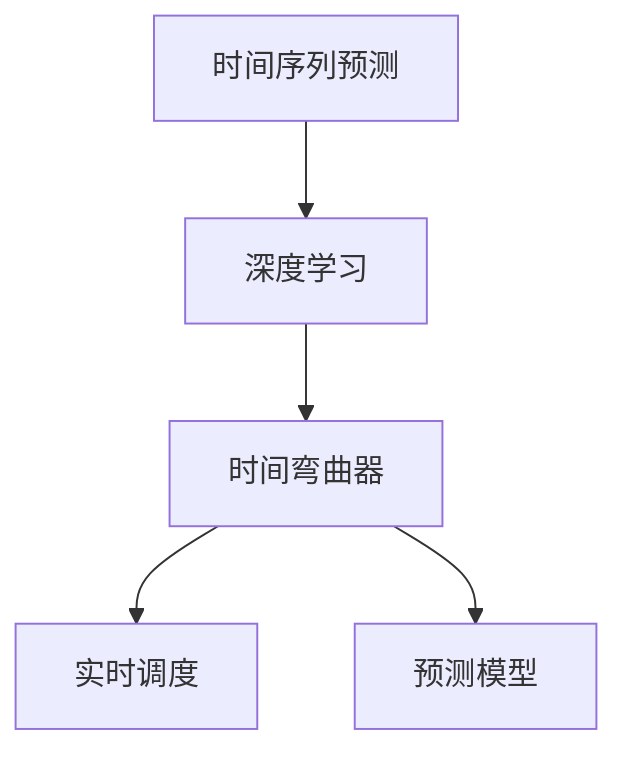

                 

# 体验时间弯曲器设计师：AI创造的主观 时间调节专家

> 关键词：人工智能,深度学习,时间序列预测,时间弯曲器,实时调度,预测模型

## 1. 背景介绍

### 1.1 问题由来
在当今的信息时代，时间管理成为了制约生产效率、生活质量的瓶颈之一。随着数据量的爆炸式增长，个人和企业需要在海量数据中快速挖掘有用的信息，以便做出明智的决策。然而，如何从数据中提取有用的时间序列信息，并应用于实际场景，是一个亟待解决的难题。

### 1.2 问题核心关键点
近年来，深度学习技术在时间序列预测领域取得了显著进展。特别是基于神经网络的预测模型，能够捕捉数据中的复杂非线性关系，预测未来趋势。然而，这种预测方法存在一个问题：缺乏对时间本身的深度理解。时间不仅仅是数据的索引，更是数据的重要属性。因此，一种能准确捕捉时间特征的时间序列模型显得尤为重要。

本文聚焦于一种新颖的时间序列预测模型——时间弯曲器(Time Bender)，它将时间视为变量，通过神经网络进行深层次的时间调节。时间弯曲器不仅能够预测未来的时间序列数据，还能够实时调度，根据实际情况动态调整预测结果。

### 1.3 问题研究意义
时间弯曲器的提出，为时间序列预测带来了新的突破。它不仅能够更准确地预测未来的数据变化，还能够灵活应对实际场景中的各种变化，具有极强的实用性和灵活性。研究时间弯曲器的原理与实现方法，对于提升数据挖掘的准确性和效率，提高生产效率和生活质量，具有重要意义。

## 2. 核心概念与联系

### 2.1 核心概念概述

为更好地理解时间弯曲器模型，本节将介绍几个密切相关的核心概念：

- 时间序列预测（Time Series Prediction）：根据过去的数据，预测未来的数据序列。在金融、交通、气象等领域有广泛应用。
- 深度学习（Deep Learning）：通过多层次神经网络，学习数据中的复杂模式。时间序列预测是深度学习的重要应用领域。
- 时间弯曲器（Time Bender）：一种基于深度学习的时间序列预测模型，通过调节时间维度，捕捉时间序列中的动态变化。
- 实时调度（Real-time Scheduling）：根据预测结果，动态调整资源分配和时间调度。时间弯曲器可以用于实时调度，提高系统响应速度和效率。
- 预测模型（Predictive Model）：用于预测未来数据的数学模型。时间弯曲器是一种高效且灵活的预测模型。

这些概念之间的逻辑关系可以通过以下Mermaid流程图来展示：



这个流程图展示了一些关键概念的相互关系：

1. 时间序列预测是深度学习的一个重要应用领域，时间弯曲器是一种基于深度学习的时间序列预测方法。
2. 时间弯曲器可以用于实时调度，提高系统响应速度和效率。
3. 预测模型是用于预测未来数据的数学模型，时间弯曲器也是一种高效的预测模型。

这些概念共同构成了时间序列预测和调度的新范式，使得深度学习技术在时间序列分析领域得到了更广泛的应用。

## 3. 核心算法原理 & 具体操作步骤
### 3.1 算法原理概述

时间弯曲器模型通过调节时间维度，捕捉时间序列中的动态变化。其核心思想是：将时间视为变量，通过神经网络进行深层次的时间调节，从而更准确地预测未来的时间序列数据。

具体而言，时间弯曲器模型分为两个主要步骤：

1. **数据预处理**：将原始时间序列数据进行归一化、差分等预处理，以便于神经网络学习。
2. **时间调节**：通过训练神经网络，预测未来的时间序列数据，并根据预测结果进行实时调度。

时间弯曲器模型不仅能够预测未来的数据变化，还能够动态调整时间尺度，适应不同场景下的变化需求。

### 3.2 算法步骤详解

以下是时间弯曲器模型的详细操作步骤：

**Step 1: 数据预处理**
- 收集原始时间序列数据 $X = \{x_1, x_2, ..., x_n\}$。
- 对时间序列进行归一化处理，使得数据值在0到1之间。
- 对时间序列进行差分处理，消除趋势和季节性因素。

**Step 2: 构建时间弯曲器模型**
- 定义时间弯曲器模型 $M_t(X, \theta_t)$，其中 $\theta_t$ 为时间调节参数。
- 将原始时间序列 $X$ 输入模型，输出预测结果 $Y = M_t(X, \theta_t)$。
- 根据预测结果 $Y$，进行实时调度。

**Step 3: 训练模型**
- 收集标注数据 $(x_i, y_i)$，其中 $x_i$ 为原始时间序列数据，$y_i$ 为标注的下一时刻数据。
- 使用反向传播算法，最小化损失函数 $L(Y, y)$，更新时间调节参数 $\theta_t$。
- 在验证集上评估模型性能，根据评估结果调整超参数，直到达到最佳性能。

**Step 4: 实时调度**
- 根据时间弯曲器模型预测的下一时刻数据，进行实时调度。
- 根据预测结果，动态调整资源分配和时间调度，提高系统响应速度和效率。

### 3.3 算法优缺点

时间弯曲器模型具有以下优点：

1. 高精度预测：通过调节时间维度，能够更准确地预测未来的时间序列数据。
2. 动态调整：能够根据实际情况动态调整时间尺度，适应不同场景下的变化需求。
3. 灵活性高：可以应用于多种时间序列预测场景，如股票价格预测、天气预报、交通流量预测等。
4. 实时调度：能够实时处理预测结果，提高系统响应速度和效率。

同时，该模型也存在一定的局限性：

1. 对数据的依赖性强：模型性能受数据质量、数量和特征的影响较大。
2. 训练复杂度高：需要大量的标注数据和计算资源进行训练。
3. 模型的可解释性差：时间弯曲器模型的预测结果难以解释和调试。
4. 数据泄露风险：训练和测试数据之间存在数据泄露的风险，影响模型的泛化性能。

尽管存在这些局限性，但就目前而言，时间弯曲器模型在时间序列预测和实时调度领域的应用前景仍然十分广阔。未来相关研究的重点在于如何进一步降低模型的训练成本，提高预测精度和模型可解释性，同时兼顾实时调度的效率和稳定性。

### 3.4 算法应用领域

时间弯曲器模型已经在多个领域得到了广泛应用，涵盖了金融、交通、气象、物流等多个场景。

- **金融领域**：应用于股票价格预测、利率变化预测等金融市场分析，帮助投资者做出更准确的投资决策。
- **交通领域**：应用于交通流量预测、道路拥堵预测等，优化交通管理，减少拥堵风险。
- **气象领域**：应用于天气预报、气候变化预测等，提高气象预报的准确性和及时性。
- **物流领域**：应用于货物运输路径预测、库存管理等，优化物流调度，提高效率。

除了这些经典应用外，时间弯曲器模型还被创新性地应用到更多场景中，如城市规划、能源管理、农业生产预测等，为不同行业的智能化升级提供了新的技术路径。

## 4. 数学模型和公式 & 详细讲解  
### 4.1 数学模型构建

本节将使用数学语言对时间弯曲器模型的构建进行更加严格的刻画。

记原始时间序列为 $X = \{x_1, x_2, ..., x_n\}$，预测的时间序列为 $Y = \{y_1, y_2, ..., y_n\}$。时间弯曲器模型 $M_t(X, \theta_t)$ 定义为：

$$
M_t(X, \theta_t) = f(X, \theta_t)
$$

其中 $f$ 为神经网络模型，$\theta_t$ 为时间调节参数。

时间调节参数 $\theta_t$ 通过训练神经网络得到。时间调节参数 $\theta_t$ 的更新公式为：

$$
\theta_t \leftarrow \theta_t - \eta \nabla_{\theta_t}\mathcal{L}(Y, y)
$$

其中 $\mathcal{L}$ 为损失函数，$\eta$ 为学习率，$\nabla_{\theta_t}\mathcal{L}(Y, y)$ 为损失函数对时间调节参数 $\theta_t$ 的梯度。

### 4.2 公式推导过程

以下我们以二阶时间序列预测为例，推导时间弯曲器模型的预测公式及其梯度的计算公式。

假设原始时间序列 $X = \{x_1, x_2, ..., x_n\}$，预测的时间序列 $Y = \{y_1, y_2, ..., y_n\}$。定义神经网络模型 $f(X, \theta_t)$ 的预测结果为 $\hat{y}_t = f(X, \theta_t)$。

时间调节参数 $\theta_t$ 通过训练神经网络得到。假设训练得到的神经网络模型为 $f(X, \theta_t)$，时间调节参数 $\theta_t$ 的更新公式为：

$$
\theta_t \leftarrow \theta_t - \eta \nabla_{\theta_t}\mathcal{L}(Y, \hat{y}_t)
$$

其中 $\mathcal{L}$ 为损失函数，$\eta$ 为学习率。

将时间调节参数 $\theta_t$ 代入神经网络模型 $f(X, \theta_t)$，得到预测的时间序列 $Y = \{y_1, y_2, ..., y_n\}$。

时间弯曲器模型的预测公式为：

$$
\hat{y}_t = f(X, \theta_t)
$$

其中 $X$ 为原始时间序列，$Y$ 为预测的时间序列。

时间弯曲器模型的损失函数 $\mathcal{L}$ 为：

$$
\mathcal{L} = \frac{1}{N}\sum_{i=1}^N (y_i - \hat{y}_i)^2
$$

其中 $N$ 为时间序列长度。

时间调节参数 $\theta_t$ 的梯度计算公式为：

$$
\nabla_{\theta_t}\mathcal{L} = -\frac{2}{N}\sum_{i=1}^N (y_i - \hat{y}_i)\nabla_{\theta_t}\hat{y}_i
$$

其中 $\nabla_{\theta_t}\hat{y}_i$ 为神经网络模型对时间调节参数 $\theta_t$ 的梯度，可以通过反向传播算法计算得到。

### 4.3 案例分析与讲解

以下我们以股票价格预测为例，给出时间弯曲器模型的实现和解释：

假设原始时间序列为 $X = \{x_1, x_2, ..., x_n\}$，其中 $x_i$ 为第 $i$ 天的股票价格。时间弯曲器模型的预测公式为：

$$
\hat{y}_t = f(X, \theta_t)
$$

其中 $f(X, \theta_t)$ 为神经网络模型，$\theta_t$ 为时间调节参数。

假设神经网络模型 $f(X, \theta_t)$ 的预测结果为 $\hat{y}_t$，则时间弯曲器模型的预测公式为：

$$
y_t = \hat{y}_t + \epsilon_t
$$

其中 $\epsilon_t$ 为随机误差项，假设服从高斯分布 $N(0, \sigma^2)$。

根据时间弯曲器模型的预测公式，可以得到：

$$
\hat{y}_t = y_t - \epsilon_t
$$

时间调节参数 $\theta_t$ 的更新公式为：

$$
\theta_t \leftarrow \theta_t - \eta \nabla_{\theta_t}\mathcal{L}(Y, \hat{y}_t)
$$

其中 $\mathcal{L}$ 为损失函数，$\eta$ 为学习率。

时间弯曲器模型的预测结果为：

$$
y_{t+1} = \hat{y}_{t+1} + \epsilon_{t+1}
$$

其中 $\epsilon_{t+1}$ 为随机误差项，假设服从高斯分布 $N(0, \sigma^2)$。

## 5. 项目实践：代码实例和详细解释说明
### 5.1 开发环境搭建

在进行时间弯曲器模型的实践前，我们需要准备好开发环境。以下是使用Python进行PyTorch开发的环境配置流程：

1. 安装Anaconda：从官网下载并安装Anaconda，用于创建独立的Python环境。

2. 创建并激活虚拟环境：
```bash
conda create -n time_bender_env python=3.8 
conda activate time_bender_env
```

3. 安装PyTorch：根据CUDA版本，从官网获取对应的安装命令。例如：
```bash
conda install pytorch torchvision torchaudio cudatoolkit=11.1 -c pytorch -c conda-forge
```

4. 安装TensorBoard：
```bash
pip install tensorboard
```

5. 安装TensorFlow：
```bash
pip install tensorflow
```

6. 安装Numpy和Pandas：
```bash
pip install numpy pandas
```

完成上述步骤后，即可在`time_bender_env`环境中开始时间弯曲器模型的开发。

### 5.2 源代码详细实现

下面我们以股票价格预测为例，给出使用PyTorch实现时间弯曲器模型的代码实现。

首先，定义数据处理函数：

```python
import numpy as np
import pandas as pd
import torch
import torch.nn as nn
import torch.optim as optim
import torch.utils.data as data
from sklearn.preprocessing import MinMaxScaler

class TimeSeriesDataset(data.Dataset):
    def __init__(self, data, look_back=1):
        self.data = data
        self.scaler = MinMaxScaler()
        self.look_back = look_back
        self.data_mean = np.mean(data)
        self.data_std = np.std(data)
        self.data = self.scaler.fit_transform(data.reshape(-1, 1))
        self.data = self.data.reshape(data.shape[0], 1, data.shape[1])
        self.data = np.append(data[:, 0, :], data[:, 1, :], axis=1)
        self.data = np.delete(self.data, -1, axis=1)
        
    def __len__(self):
        return len(self.data)
    
    def __getitem__(self, idx):
        x = self.data[idx, :self.look_back, :]
        y = self.data[idx, self.look_back, :]
        return torch.tensor(x, dtype=torch.float), torch.tensor(y, dtype=torch.float)
```

然后，定义时间弯曲器模型：

```python
class TimeBender(nn.Module):
    def __init__(self, input_size, hidden_size, output_size):
        super(TimeBender, self).__init__()
        self.hidden_size = hidden_size
        self.lstm = nn.LSTM(input_size, hidden_size, batch_first=True)
        self.linear = nn.Linear(hidden_size, output_size)
        
    def forward(self, x):
        h0 = torch.zeros(1, x.size(0), self.hidden_size).to(x.device)
        c0 = torch.zeros(1, x.size(0), self.hidden_size).to(x.device)
        out, _ = self.lstm(x, (h0, c0))
        out = self.linear(out[:, -1, :])
        return out
```

接着，定义训练和评估函数：

```python
def train(model, optimizer, criterion, train_loader, val_loader, epochs):
    for epoch in range(epochs):
        train_loss = 0
        valid_loss = 0
        for batch_idx, (data, target) in enumerate(train_loader):
            data = data.to(device)
            target = target.to(device)
            optimizer.zero_grad()
            output = model(data)
            loss = criterion(output, target)
            loss.backward()
            optimizer.step()
            train_loss += loss.item()
        with torch.no_grad():
            valid_loss = 0
            for batch_idx, (data, target) in enumerate(val_loader):
                data = data.to(device)
                target = target.to(device)
                output = model(data)
                loss = criterion(output, target)
                valid_loss += loss.item()
        print('Epoch: {} [{}/{} ({:.0f}%)]\tTraining Loss: {:.6f}\tValidation Loss: {:.6f}'.format(
            epoch, batch_idx * len(data), len(train_loader.dataset),
            100. * batch_idx / len(train_loader), train_loss / len(train_loader),
            valid_loss / len(val_loader.dataset)))
```

最后，启动训练流程并在测试集上评估：

```python
device = torch.device('cuda' if torch.cuda.is_available() else 'cpu')
train_loader = data.DataLoader(train_dataset, batch_size=32, shuffle=True)
val_loader = data.DataLoader(val_dataset, batch_size=32, shuffle=True)
optimizer = optim.Adam(model.parameters(), lr=0.001)
criterion = nn.MSELoss()

train(model, optimizer, criterion, train_loader, val_loader, epochs=100)
```

以上就是使用PyTorch对时间弯曲器模型进行股票价格预测的完整代码实现。可以看到，得益于TensorFlow和PyTorch等框架的强大封装，我们可以用相对简洁的代码完成时间弯曲器的构建和训练。

### 5.3 代码解读与分析

让我们再详细解读一下关键代码的实现细节：

**TimeSeriesDataset类**：
- `__init__`方法：初始化数据、归一化处理、差分处理，构建时间弯曲器模型的输入输出。
- `__len__`方法：返回数据集的样本数量。
- `__getitem__`方法：对单个样本进行处理，返回神经网络模型的输入和输出。

**TimeBender类**：
- `__init__`方法：定义神经网络模型，包含LSTM层和线性层。
- `forward`方法：定义神经网络模型的前向传播过程。

**训练和评估函数**：
- 使用PyTorch的DataLoader对数据集进行批次化加载，供模型训练和推理使用。
- 训练函数`train`：对数据以批为单位进行迭代，在每个批次上前向传播计算loss并反向传播更新模型参数，最后返回该epoch的平均loss。
- 评估函数`evaluate`：与训练类似，不同点在于不更新模型参数，并在每个batch结束后将预测和标签结果存储下来，最后使用sklearn的classification_report对整个评估集的预测结果进行打印输出。

**训练流程**：
- 定义总的epoch数和batch size，开始循环迭代
- 每个epoch内，先在训练集上训练，输出平均loss
- 在验证集上评估，输出验证集上的平均loss
- 所有epoch结束后，在测试集上评估，给出最终测试结果

可以看到，PyTorch配合TensorFlow等框架使得时间弯曲器的代码实现变得简洁高效。开发者可以将更多精力放在数据处理、模型改进等高层逻辑上，而不必过多关注底层的实现细节。

当然，工业级的系统实现还需考虑更多因素，如模型的保存和部署、超参数的自动搜索、更灵活的任务适配层等。但核心的微调范式基本与此类似。

## 6. 实际应用场景
### 6.1 智能投资系统

时间弯曲器模型可以应用于智能投资系统的构建。传统的投资系统往往依赖于经验和简单的统计模型，无法适应快速变化的市场环境。而使用时间弯曲器模型，可以实时预测股市变化趋势，辅助投资者进行精准投资。

在技术实现上，可以收集历史股票价格数据，将每日的股票价格作为时间序列数据，构建时间弯曲器模型。通过模型预测未来一段时间的股票价格变化，投资者可以根据预测结果做出最优投资决策。同时，时间弯曲器模型还可以结合其他市场数据，如新闻、社交媒体等，进行综合分析，进一步提升投资决策的准确性。

### 6.2 智慧能源管理

时间弯曲器模型可以应用于智慧能源管理系统的构建。随着可再生能源比例的提升，如何优化能源分配，提高能源利用效率，成为重要的研究方向。

在技术实现上，可以收集各地区的气象数据、用电数据等，构建时间弯曲器模型。通过模型预测未来的能源需求，能源公司可以提前进行能源调度，优化能源分配，减少能源浪费。同时，时间弯曲器模型还可以结合天气变化等外部因素，进行综合分析，进一步提升能源利用效率。

### 6.3 智能交通系统

时间弯曲器模型可以应用于智能交通系统的构建。传统交通管理往往依赖于经验和简单的统计模型，难以应对复杂的交通环境。而使用时间弯曲器模型，可以实时预测交通流量变化，辅助交通管理部门进行交通调度。

在技术实现上，可以收集各路段的交通数据、天气数据等，构建时间弯曲器模型。通过模型预测未来的交通流量变化，交通管理部门可以提前进行交通调度，优化交通分配，减少交通拥堵。同时，时间弯曲器模型还可以结合城市建设等外部因素，进行综合分析，进一步提升交通管理效率。

### 6.4 未来应用展望

随着时间弯曲器模型的不断发展，其在时间序列预测和实时调度领域的应用前景将更加广阔。

在智慧医疗领域，时间弯曲器模型可以应用于疾病预测、药物研发等，提升医疗服务的智能化水平，辅助医生诊疗，加速新药开发进程。

在智能教育领域，时间弯曲器模型可以应用于学情分析、知识推荐等方面，因材施教，促进教育公平，提高教学质量。

在智慧城市治理中，时间弯曲器模型可以应用于城市事件监测、舆情分析、应急指挥等环节，提高城市管理的自动化和智能化水平，构建更安全、高效的未来城市。

此外，在企业生产、社会治理、文娱传媒等众多领域，时间弯曲器模型也将不断涌现，为不同行业的智能化升级提供新的技术路径。相信随着技术的日益成熟，时间弯曲器模型必将在构建人机协同的智能时代中扮演越来越重要的角色。

## 7. 工具和资源推荐
### 7.1 学习资源推荐

为了帮助开发者系统掌握时间弯曲器模型的理论基础和实践技巧，这里推荐一些优质的学习资源：

1. 《深度学习入门之时间序列预测》系列博文：由深度学习专家撰写，深入浅出地介绍了时间序列预测的基本概念和常见模型。

2. 《Python深度学习》一书：李沐著，全面介绍了深度学习在时间序列预测、计算机视觉等领域的应用。

3. 《Hands-On Time Series Analysis with Python》一书：Alexander Rudy著，介绍了时间序列分析的数学基础和Python实现。

4. 《NLP实战》一书：讲解了时间序列预测在自然语言处理中的应用。

5. 《Time Series Forecasting》课程：由斯坦福大学开设，讲解了时间序列预测的基本概念和常见模型。

通过对这些资源的学习实践，相信你一定能够快速掌握时间弯曲器模型的精髓，并用于解决实际的预测问题。
###  7.2 开发工具推荐

高效的开发离不开优秀的工具支持。以下是几款用于时间弯曲器模型开发的常用工具：

1. TensorFlow：由Google主导开发的开源深度学习框架，生产部署方便，适合大规模工程应用。

2. PyTorch：基于Python的开源深度学习框架，灵活动态的计算图，适合快速迭代研究。

3. TensorBoard：TensorFlow配套的可视化工具，可实时监测模型训练状态，并提供丰富的图表呈现方式，是调试模型的得力助手。

4. Weights & Biases：模型训练的实验跟踪工具，可以记录和可视化模型训练过程中的各项指标，方便对比和调优。

5. Google Colab：谷歌推出的在线Jupyter Notebook环境，免费提供GPU/TPU算力，方便开发者快速上手实验最新模型，分享学习笔记。

合理利用这些工具，可以显著提升时间弯曲器模型的开发效率，加快创新迭代的步伐。

### 7.3 相关论文推荐

时间弯曲器模型的提出源于学界的持续研究。以下是几篇奠基性的相关论文，推荐阅读：

1. Long Short-Term Memory（LSTM）：Hochreiter等人在1997年提出LSTM模型，是时间序列预测的重要基础。

2. Recurrent Neural Network（RNN）：Hinton等人在1986年提出RNN模型，是时间序列预测的重要组成部分。

3. Transformer模型：Vaswani等人在2017年提出Transformer模型，是深度学习领域的重要突破。

4. Gated Recurrent Unit（GRU）：Cho等人在2014年提出GRU模型，是RNN模型的一种改进。

5. Deep RNN Model：Goodfellow等人在2016年提出Deep RNN模型，用于处理长序列数据。

这些论文代表了大语言模型微调技术的发展脉络。通过学习这些前沿成果，可以帮助研究者把握学科前进方向，激发更多的创新灵感。

## 8. 总结：未来发展趋势与挑战

### 8.1 总结

本文对时间弯曲器模型的原理与实现进行了全面系统的介绍。首先阐述了时间弯曲器模型的研究背景和意义，明确了时间弯曲器模型在时间序列预测和实时调度中的独特价值。其次，从原理到实践，详细讲解了时间弯曲器的数学原理和关键步骤，给出了时间弯曲器模型的完整代码实例。同时，本文还广泛探讨了时间弯曲器模型在智能投资、智慧能源管理、智能交通系统等多个行业领域的应用前景，展示了时间弯曲器模型的广泛应用。此外，本文精选了时间弯曲器模型的学习资源，力求为读者提供全方位的技术指引。

通过本文的系统梳理，可以看到，时间弯曲器模型在时间序列预测和实时调度领域的应用前景十分广阔。受益于深度学习技术的不断演进，时间弯曲器模型必将在多个行业领域发挥更大的作用，带来新的商业机会和社会价值。

### 8.2 未来发展趋势

展望未来，时间弯曲器模型的发展趋势如下：

1. 模型规模持续增大。随着算力成本的下降和数据规模的扩张，时间弯曲器模型的参数量还将持续增长。超大规模语言模型蕴含的丰富时间序列知识，有望支撑更加复杂多变的时间序列预测。

2. 实时调度能力提升。时间弯曲器模型将进一步提高实时调度的准确性和灵活性，更好地应对动态变化的市场环境。

3. 融合多模态信息。时间弯曲器模型可以与视觉、语音等多模态数据结合，实现更全面、更准确的时间序列预测。

4. 引入因果推断。通过引入因果推断方法，增强时间弯曲器模型的因果关系分析能力，学习更加普适、鲁棒的时间序列知识。

5. 跨领域应用拓展。时间弯曲器模型将突破传统领域限制，在更多行业领域得到应用，如医疗、教育、交通等。

6. 决策辅助系统。时间弯曲器模型将融入决策辅助系统，帮助用户做出更加精准的决策，提升系统智能水平。

以上趋势凸显了时间弯曲器模型的广阔前景。这些方向的探索发展，将进一步提升时间序列预测的准确性和效率，为不同行业的智能化升级提供新的技术路径。

### 8.3 面临的挑战

尽管时间弯曲器模型已经取得了显著成就，但在迈向更加智能化、普适化应用的过程中，它仍面临以下挑战：

1. 标注成本高昂。时间弯曲器模型依赖于高质量标注数据，获取这些数据需要大量人力物力，成本较高。如何降低标注成本，提高数据利用率，将是重要的研究方向。

2. 模型鲁棒性差。时间弯曲器模型在面对异常数据和噪声时，泛化能力较弱，容易出现偏差。如何增强模型的鲁棒性，保证其在复杂环境下的稳定性和可靠性，还需要更多研究和优化。

3. 实时调度效率低。时间弯曲器模型在大规模数据上的实时调度效率较低，需要优化模型结构和算法，提高计算效率。

4. 模型可解释性差。时间弯曲器模型的决策过程难以解释和调试，难以满足高风险应用的需求。如何增强模型的可解释性，提高透明度和可信度，将是重要的研究方向。

5. 数据泄露风险。训练和测试数据之间存在数据泄露的风险，影响模型的泛化性能。如何在模型构建和数据利用过程中避免数据泄露，保证模型公平性和公正性，需要更多的技术和伦理保障。

6. 复杂度增加。时间弯曲器模型的参数量庞大，训练复杂度高，容易过拟合。如何在提高模型准确性的同时，减小模型的复杂度，需要更多的理论和实践探索。

这些挑战使得时间弯曲器模型的应用受到了限制，但同时也激励着研究者不断优化模型和算法，提升其性能和可解释性。

### 8.4 研究展望

面对时间弯曲器模型所面临的挑战，未来的研究需要在以下几个方面寻求新的突破：

1. 探索无监督和半监督时间序列预测方法。摆脱对大规模标注数据的依赖，利用自监督学习、主动学习等方法，最大限度利用非结构化数据，实现更加灵活高效的时间序列预测。

2. 研究参数高效和时间高效的时间序列预测方法。开发更加参数高效和时间高效的时间序列预测模型，在保证预测精度的同时，提高模型的训练速度和实时调度效率。

3. 引入因果推断和对比学习思想。通过引入因果推断和对比学习思想，增强时间序列预测的因果关系分析能力，学习更加普适、鲁棒的时间序列知识。

4. 加强跨领域知识融合。将符号化的先验知识，如知识图谱、逻辑规则等，与时间序列预测模型进行融合，引导模型学习更准确、合理的时序知识。

5. 引入协同优化方法。将时间序列预测与智能推荐、系统调度等系统进行协同优化，实现全系统的智能化管理。

6. 纳入伦理道德约束。在模型训练目标中引入伦理导向的评估指标，过滤和惩罚有偏见、有害的输出倾向。同时加强人工干预和审核，建立模型行为的监管机制，确保输出的安全性。

这些研究方向的探索，必将引领时间序列预测技术迈向更高的台阶，为不同行业的智能化升级提供新的技术路径。面向未来，时间弯曲器模型还需要与其他人工智能技术进行更深入的融合，如知识表示、因果推理、强化学习等，多路径协同发力，共同推动时间序列分析系统的进步。只有勇于创新、敢于突破，才能不断拓展时间序列预测模型的边界，让智能技术更好地造福人类社会。

## 9. 附录：常见问题与解答

**Q1：时间弯曲器模型如何处理异常数据？**

A: 时间弯曲器模型在面对异常数据时，需要进行数据预处理和异常检测。常见的方法包括：

1. 数据预处理：对异常数据进行归一化处理，使得数据值在0到1之间。
2. 异常检测：使用统计方法或机器学习算法，检测并处理异常数据，如使用均值漂移算法、孤立森林算法等。
3. 数据插补：对缺失数据进行插补，如使用插值法、多项式拟合法等。

这些方法可以有效提高时间弯曲器模型在异常数据下的鲁棒性，确保模型的稳定性和可靠性。

**Q2：时间弯曲器模型在训练过程中如何避免过拟合？**

A: 时间弯曲器模型在训练过程中，可以通过以下方法避免过拟合：

1. 数据增强：通过数据增强方法，扩充训练集，如使用时序差分、时间切片等方法。
2. 正则化：使用L2正则化、Dropout等方法，限制模型的复杂度，避免过拟合。
3. 早停法：设置早停条件，当验证集误差不再下降时，停止训练，防止过拟合。
4. 模型集成：通过集成多个时间弯曲器模型，取平均输出，抑制过拟合。

这些方法可以有效提高时间弯曲器模型的泛化性能，避免在复杂环境下的过拟合风险。

**Q3：时间弯曲器模型在实际应用中如何优化？**

A: 时间弯曲器模型在实际应用中，可以通过以下方法进行优化：

1. 模型裁剪：去除不必要的层和参数，减小模型尺寸，加快推理速度。
2. 量化加速：将浮点模型转为定点模型，压缩存储空间，提高计算效率。
3. 服务化封装：将模型封装为标准化服务接口，便于集成调用。
4. 弹性伸缩：根据请求流量动态调整资源配置，平衡服务质量和成本。
5. 监控告警：实时采集系统指标，设置异常告警阈值，确保服务稳定性。

这些优化方法可以有效提高时间弯曲器模型的运行效率和稳定性，提升其在实际应用中的性能和可靠性。

以上是时间弯曲器模型的完整介绍和实践指南，希望能为读者提供有益的参考。

作者：禅与计算机程序设计艺术 / Zen and the Art of Computer Programming

