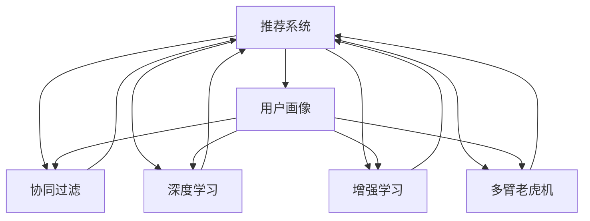

                 

## 1. 背景介绍

在数字化时代，个性化体验成为各行各业争夺用户的重要武器。从电子商务到社交媒体，从金融服务到医疗健康，企业和用户之间的互动越来越多地依赖于AI驱动的定制化服务。传统的“一刀切”服务模式正逐渐被富有弹性和智能的个性化服务所取代。然而，如何从数据中提取和应用有效的用户行为特征，构建高效、个性化的推荐引擎，成为一个亟待解决的挑战。

本文将深入探讨AI驱动的个性化定制服务，从理论到实践，阐述如何利用AI技术构建高效的个性化推荐系统，并结合实际应用场景，展示其应用价值和未来发展趋势。

## 2. 核心概念与联系

### 2.1 核心概念概述

为更好地理解个性化定制服务，我们首先介绍几个关键概念：

- **推荐系统(Recommendation System)**：通过收集用户行为数据，分析用户偏好和需求，为用户推荐个性化产品或服务。推荐系统广泛应用于电商、社交媒体、视频流媒体等领域。

- **用户画像(User Profile)**：根据用户的历史行为、兴趣、社交关系等数据，构建用户的多维度特征描述。用户画像用于指导推荐系统，提升推荐精度。

- **协同过滤(Collaborative Filtering)**：通过分析用户间的相似性，推荐相似用户喜欢的物品。协同过滤分为基于用户的协同过滤和基于物品的协同过滤。

- **深度学习(Deep Learning)**：一种模拟人脑神经网络结构的技术，适用于大规模数据和非线性问题的建模。深度学习在个性化推荐中发挥着重要作用。

- **增强学习(Reinforcement Learning)**：通过与环境的互动，动态调整推荐策略，以最大化推荐效果。增强学习适用于实时推荐系统的迭代优化。

- **多臂老虎机(Multi-Armed Bandit)**：一种强化学习范式，用于优化资源分配策略，提高推荐系统的点击率和转化率。多臂老虎机在个性化推荐中广泛应用。

这些概念通过协同作用，共同构建了个性化定制服务的理论基础和实践框架。下面，我们将通过Mermaid流程图展示这些概念的联系：



该流程图展示了推荐系统如何利用用户画像、协同过滤、深度学习、增强学习和多臂老虎机等技术，构建个性化推荐服务。

## 3. 核心算法原理 & 具体操作步骤

### 3.1 算法原理概述

个性化定制服务的核心在于构建用户画像，并通过推荐系统为用户推荐个性化内容。推荐系统的算法原理可以分为两个主要部分：

- **用户画像构建**：通过分析用户的历史行为数据，如浏览记录、购买记录、评价信息等，构建用户的多维度特征描述。常见的用户画像特征包括兴趣偏好、行为模式、社交关系等。

- **推荐算法设计**：根据用户画像，选择合适的推荐算法为用户推荐个性化内容。常见的推荐算法包括协同过滤、深度学习模型、增强学习模型等。

### 3.2 算法步骤详解

个性化推荐系统的构建步骤如下：

1. **数据采集**：收集用户的历史行为数据，包括浏览记录、购买记录、评价信息等。数据格式可能包括网页访问日志、订单记录、评论等。

2. **用户画像构建**：通过分析用户的历史行为数据，构建用户画像。用户画像包括用户的基本信息、兴趣偏好、行为模式等。

3. **推荐算法选择**：根据用户画像，选择合适的推荐算法。常见的推荐算法包括协同过滤、深度学习模型、增强学习模型等。

4. **推荐结果生成**：根据选择的推荐算法，为用户生成推荐结果。推荐结果可以是产品、内容、服务等。

5. **反馈与优化**：收集用户对推荐结果的反馈，根据反馈调整推荐策略，优化推荐效果。

### 3.3 算法优缺点

个性化推荐系统具有以下优点：

- **提升用户体验**：通过个性化推荐，用户可以快速找到感兴趣的内容或产品，提升用户体验。

- **增加用户粘性**：个性化推荐可以增加用户对平台的访问频率和停留时间，提高用户粘性。

- **增加销售额**：个性化推荐可以增加用户的购买意愿和转化率，提高销售额。

然而，个性化推荐系统也存在以下缺点：

- **数据隐私问题**：用户行为数据可能包含隐私信息，如何保护用户隐私成为一个重要问题。

- **冷启动问题**：对于新用户，缺乏足够的行为数据，难以构建准确的推荐画像。

- **过拟合问题**：推荐系统容易过拟合用户的历史行为，忽视新趋势和新需求。

- **动态变化问题**：用户兴趣和需求是动态变化的，推荐系统需要实时调整，才能保持推荐效果。

### 3.4 算法应用领域

个性化推荐系统在多个领域得到广泛应用，例如：

- **电商推荐**：根据用户浏览和购买历史，推荐个性化商品。电商推荐可以显著提高用户的购物体验和购买转化率。

- **内容推荐**：根据用户的历史阅读记录，推荐个性化文章、视频等。内容推荐可以提高用户的满意度和平台粘性。

- **社交推荐**：根据用户的社交关系和互动行为，推荐个性化朋友、群组等。社交推荐可以增加用户的社交活跃度和平台粘性。

- **金融推荐**：根据用户的历史交易记录，推荐个性化金融产品。金融推荐可以提高用户的金融产品和服务的满意度。

- **医疗推荐**：根据用户的历史就医记录，推荐个性化医疗服务。医疗推荐可以提高用户的医疗体验和服务质量。

## 4. 数学模型和公式 & 详细讲解 & 举例说明

### 4.1 数学模型构建

个性化推荐系统的数学模型构建包括以下步骤：

1. **用户-物品交互矩阵**：构建用户和物品的交互矩阵 $R_{U\times I}$，其中 $R_{ui}$ 表示用户 $u$ 对物品 $i$ 的评分。

2. **用户画像向量**：构建用户 $u$ 的特征向量 $\boldsymbol{p}_u \in \mathbb{R}^d$，其中 $d$ 为用户画像的维度。

3. **物品特征向量**：构建物品 $i$ 的特征向量 $\boldsymbol{q}_i \in \mathbb{R}^d$。

4. **用户画像和物品特征向量的内积**：计算用户画像 $\boldsymbol{p}_u$ 和物品特征向量 $\boldsymbol{q}_i$ 的内积 $s_{ui} = \boldsymbol{p}_u \cdot \boldsymbol{q}_i$，作为用户对物品的预测评分。

### 4.2 公式推导过程

基于协同过滤的个性化推荐系统，可以通过矩阵分解技术，将用户-物品交互矩阵 $R_{U\times I}$ 分解为用户画像矩阵 $P_{U\times d}$ 和物品特征矩阵 $Q_{I\times d}$，其中 $d$ 为隐向量维度。

具体推导如下：

$$
\min_{P,Q} \Vert R - P Q^T \Vert_F^2
$$

其中 $\Vert \cdot \Vert_F$ 表示矩阵的Frobenius范数。

通过求解上述优化问题，可以得到用户画像矩阵 $P$ 和物品特征矩阵 $Q$，从而实现推荐。

### 4.3 案例分析与讲解

以电商推荐系统为例，展示矩阵分解的实际应用：

1. **数据采集**：收集用户的历史浏览记录、购买记录、评价信息等，构建用户-物品交互矩阵 $R_{U\times I}$。

2. **用户画像构建**：通过分析用户的历史行为数据，构建用户画像向量 $\boldsymbol{p}_u$。

3. **物品特征向量**：为每个物品 $i$ 构建特征向量 $\boldsymbol{q}_i$。

4. **推荐结果生成**：计算用户画像向量 $\boldsymbol{p}_u$ 和物品特征向量 $\boldsymbol{q}_i$ 的内积，得到用户对物品的预测评分 $s_{ui}$，根据预测评分进行推荐。

## 5. 项目实践：代码实例和详细解释说明

### 5.1 开发环境搭建

在进行推荐系统开发前，我们需要准备好开发环境。以下是使用Python进行TensorFlow开发的环境配置流程：

1. 安装Anaconda：从官网下载并安装Anaconda，用于创建独立的Python环境。

2. 创建并激活虚拟环境：
```bash
conda create -n recommendation-env python=3.8 
conda activate recommendation-env
```

3. 安装TensorFlow：根据CUDA版本，从官网获取对应的安装命令。例如：
```bash
conda install tensorflow
```

4. 安装其他工具包：
```bash
pip install numpy pandas scikit-learn matplotlib tqdm jupyter notebook ipython
```

完成上述步骤后，即可在`recommendation-env`环境中开始推荐系统开发。

### 5.2 源代码详细实现

这里我们以基于协同过滤的电商推荐系统为例，展示使用TensorFlow实现推荐系统的代码实现。

首先，定义推荐系统的训练数据：

```python
import numpy as np
import tensorflow as tf

# 生成随机数据
num_users = 1000
num_items = 5000
R = np.random.randn(num_users, num_items)
R = np.clip(R, 0, 5)
```

然后，定义用户画像向量 $\boldsymbol{p}_u$ 和物品特征向量 $\boldsymbol{q}_i$：

```python
d = 10  # 隐向量维度
P = np.random.randn(num_users, d)
Q = np.random.randn(num_items, d)
```

接着，定义推荐模型的优化目标函数：

```python
def loss_function(R, P, Q):
    R_pred = np.dot(P, Q.T)
    loss = tf.reduce_mean(tf.square(R_pred - R))
    return loss
```

最后，使用TensorFlow的优化器进行模型训练：

```python
optimizer = tf.keras.optimizers.Adam(learning_rate=0.01)
for epoch in range(100):
    loss = loss_function(R, P, Q)
    optimizer.minimize(loss)
```

以上代码实现了基于协同过滤的电商推荐系统的基本逻辑。可以看到，通过TensorFlow的自动微分机制，可以方便地实现模型的构建和训练。

### 5.3 代码解读与分析

让我们再详细解读一下关键代码的实现细节：

**R生成和定义**：
- 生成随机数据，模拟用户对物品的评分。

**P和Q定义**：
- 定义用户画像和物品特征向量，初始化为随机值。

**损失函数**：
- 计算预测评分和真实评分的差异，使用平方误差作为损失函数。

**模型训练**：
- 使用Adam优化器进行模型训练，逐步减小损失函数。

## 6. 实际应用场景

### 6.1 电商平台个性化推荐

基于协同过滤的电商推荐系统可以广泛应用于电商平台，根据用户的历史浏览和购买行为，推荐个性化商品。例如，亚马逊、淘宝等电商巨头都采用了类似的技术，为用户提供个性化的购物建议。

具体实现上，可以通过收集用户的浏览记录、购买记录、评价信息等数据，构建用户-物品交互矩阵 $R_{U\times I}$。然后，利用协同过滤技术，将矩阵分解为用户画像矩阵 $P_{U\times d}$ 和物品特征矩阵 $Q_{I\times d}$，计算预测评分 $s_{ui}$，生成推荐结果。

### 6.2 视频流媒体个性化推荐

视频流媒体平台可以根据用户的历史观看记录，推荐个性化视频内容。例如，Netflix、YouTube等平台都采用了类似的推荐算法。

具体实现上，可以收集用户的观看记录、评分信息等数据，构建用户-物品交互矩阵 $R_{U\times I}$。然后，利用协同过滤技术，将矩阵分解为用户画像矩阵 $P_{U\times d}$ 和物品特征矩阵 $Q_{I\times d}$，计算预测评分 $s_{ui}$，生成推荐结果。

### 6.3 社交网络个性化推荐

社交网络平台可以根据用户的社交关系和互动行为，推荐个性化朋友、群组等。例如，Facebook、微信等平台都采用了类似的推荐算法。

具体实现上，可以收集用户的社交关系数据、互动行为数据等，构建用户-物品交互矩阵 $R_{U\times I}$。然后，利用协同过滤技术，将矩阵分解为用户画像矩阵 $P_{U\times d}$ 和物品特征矩阵 $Q_{I\times d}$，计算预测评分 $s_{ui}$，生成推荐结果。

## 7. 工具和资源推荐

### 7.1 学习资源推荐

为了帮助开发者系统掌握个性化推荐系统的理论基础和实践技巧，这里推荐一些优质的学习资源：

1. 《推荐系统实践》书籍：详细介绍了推荐系统的理论基础和实际应用，涵盖了协同过滤、深度学习等多种推荐算法。

2. CS-6476《推荐系统》课程：由斯坦福大学开设的推荐系统课程，涵盖推荐系统的核心算法和优化技术，是推荐系统学习的重要资源。

3. Coursera《个性化推荐》课程：由加州大学伯克利分校开设的推荐系统课程，涵盖协同过滤、深度学习等多种推荐算法。

4. Kaggle竞赛平台：提供丰富的推荐系统竞赛数据集和竞赛平台，通过实际比赛锻炼推荐系统开发能力。

5. arXiv论文库：提供大量推荐系统的经典论文和最新研究成果，是推荐系统学习的重要参考。

通过对这些资源的学习实践，相信你一定能够快速掌握个性化推荐系统的精髓，并用于解决实际的推荐问题。

### 7.2 开发工具推荐

高效的开发离不开优秀的工具支持。以下是几款用于推荐系统开发的常用工具：

1. TensorFlow：基于Python的开源深度学习框架，灵活动态的计算图，适合快速迭代研究。大部分推荐系统算法都有TensorFlow版本的实现。

2. PyTorch：基于Python的开源深度学习框架，灵活易用，适合科研和生产应用。部分推荐系统算法有PyTorch版本的实现。

3. Spark MLlib：Apache Spark的机器学习库，支持大规模数据处理和分布式训练，适合大数据环境下的推荐系统开发。

4. Jupyter Notebook：交互式笔记本，支持Python代码的编写和运行，是推荐系统开发和研究的理想工具。

5. Scikit-learn：Python的机器学习库，提供丰富的推荐算法实现和工具支持，适合推荐系统的基础研究和应用开发。

合理利用这些工具，可以显著提升推荐系统开发的效率，加快创新迭代的步伐。

### 7.3 相关论文推荐

推荐系统的研究历史悠久，涉及众多前沿技术。以下是几篇奠基性的相关论文，推荐阅读：

1. "Collaborative Filtering for Implicit Feedback Datasets"（2008）：提出基于矩阵分解的协同过滤算法，奠定了协同过滤算法的基础。

2. "Word2Vec: Exploring the Semantic Structure of the Vocabulary"（2013）：提出Word2Vec算法，使用神经网络模型处理文本数据，为深度学习推荐系统提供重要参考。

3. "Deep Interest Evolution Networks for Online Interest Prediction"（2018）：提出深度兴趣演化网络，使用深度神经网络进行兴趣预测，显著提高推荐精度。

4. "Playing Websites: What Users Want, What Sites Should Show"（2002）：提出多臂老虎机算法，用于优化推荐策略，提高点击率和转化率。

5. "TensorFlow: A System for Large-Scale Machine Learning"（2015）：介绍TensorFlow框架，支持大规模深度学习模型的构建和训练，适用于推荐系统开发。

这些论文代表了大规模推荐系统的发展脉络。通过学习这些前沿成果，可以帮助研究者把握学科前进方向，激发更多的创新灵感。

## 8. 总结：未来发展趋势与挑战

### 8.1 总结

本文对基于协同过滤的个性化推荐系统进行了全面系统的介绍。首先阐述了推荐系统的背景和意义，明确了推荐系统在提升用户体验、增加用户粘性、提高销售额等方面的价值。其次，从原理到实践，详细讲解了推荐系统的构建步骤，给出了推荐系统开发的完整代码实例。同时，本文还广泛探讨了推荐系统在电商平台、视频流媒体、社交网络等领域的实际应用，展示了其广泛的应用价值和未来发展趋势。此外，本文精选了推荐系统的各类学习资源，力求为读者提供全方位的技术指引。

通过本文的系统梳理，可以看到，基于协同过滤的个性化推荐系统已经广泛应用于多个领域，极大地提升了用户的体验和满意度。未来，伴随推荐算法的不断演进和优化，推荐系统将能够更加智能化、个性化地为用户服务，进一步推动各行各业的数字化转型。

### 8.2 未来发展趋势

展望未来，个性化推荐系统将呈现以下几个发展趋势：

1. **深度学习的应用推广**：深度学习在推荐系统中的应用将越来越广泛，利用神经网络模型处理用户画像和物品特征，可以提升推荐精度和泛化能力。

2. **多模态推荐系统的崛起**：推荐系统将从单一的文本数据，扩展到图像、视频、语音等多模态数据。多模态信息的融合，将显著提升推荐系统的用户体验和效果。

3. **实时推荐系统的普及**：随着实时数据流处理技术的发展，实时推荐系统将成为主流，能够动态调整推荐策略，及时响应用户需求。

4. **增强学习的深入应用**：增强学习在推荐系统中的应用将更加广泛，利用增强学习模型优化推荐策略，提升推荐效果和用户满意度。

5. **用户隐私保护技术的发展**：用户隐私保护技术的发展，将推动推荐系统更加透明、可解释，确保用户数据的安全性和隐私性。

6. **跨领域推荐系统的拓展**：跨领域推荐系统将进一步拓展，利用不同领域的知识，为同一用户提供更加全面、个性化的服务。

以上趋势凸显了个性化推荐系统的广阔前景。这些方向的探索发展，必将进一步提升推荐系统的性能和应用范围，为人类社会带来更丰富的数字化体验。

### 8.3 面临的挑战

尽管个性化推荐系统已经取得了瞩目成就，但在迈向更加智能化、普适化应用的过程中，它仍面临诸多挑战：

1. **数据隐私问题**：用户行为数据可能包含隐私信息，如何保护用户隐私成为一个重要问题。

2. **冷启动问题**：对于新用户，缺乏足够的行为数据，难以构建准确的推荐画像。

3. **动态变化问题**：用户兴趣和需求是动态变化的，推荐系统需要实时调整，才能保持推荐效果。

4. **模型复杂性问题**：深度学习模型具有复杂的非线性结构，难以解释推荐结果的决策机制。

5. **资源消耗问题**：大规模推荐系统需要大量的计算资源和时间，如何优化模型结构和算法，减少资源消耗，是未来的重要课题。

6. **可解释性问题**：推荐系统的决策过程缺乏可解释性，难以对其推理逻辑进行分析和调试。

正视推荐系统面临的这些挑战，积极应对并寻求突破，将是个性化推荐系统走向成熟的必由之路。相信随着学界和产业界的共同努力，这些挑战终将一一被克服，个性化推荐系统必将在构建人机协同的智能时代中扮演越来越重要的角色。

### 8.4 研究展望

面对个性化推荐系统所面临的种种挑战，未来的研究需要在以下几个方面寻求新的突破：

1. **数据隐私保护技术**：开发更加先进的数据隐私保护技术，确保用户数据的安全性和隐私性。

2. **多模态推荐系统**：探索多模态数据融合技术，提升推荐系统的用户体验和效果。

3. **实时推荐系统**：研究实时推荐系统的构建方法，提高推荐策略的动态调整能力。

4. **增强学习推荐**：开发更加高效、可解释的增强学习推荐算法，提升推荐系统的稳定性和性能。

5. **深度学习优化**：探索深度学习模型的优化方法，提升推荐系统的泛化能力和精度。

6. **跨领域推荐系统**：研究跨领域推荐系统的构建方法，利用不同领域的知识，提供更加全面、个性化的服务。

这些研究方向将推动个性化推荐系统不断进步，为人类社会带来更加智能、便捷的数字化体验。总之，个性化推荐系统需要在数据、模型、工程、业务等多个维度协同发力，才能实现更加高效、可解释、可控的推荐服务。

## 9. 附录：常见问题与解答

**Q1：如何缓解推荐系统中的冷启动问题？**

A: 冷启动问题可以通过以下方法缓解：

1. **新用户推荐**：为新用户提供推荐列表，引导其逐步建立画像。

2. **兴趣引导**：通过用户引导，收集新用户的基本信息，引导其建立兴趣偏好。

3. **数据增强**：利用用户反馈和新数据，动态调整推荐策略，提高推荐精度。

4. **协同过滤**：利用其他用户的行为数据，为新用户提供推荐。

5. **混合推荐**：结合协同过滤和基于内容的推荐，提高推荐效果。

这些方法可以根据具体应用场景进行选择和组合，以解决推荐系统中的冷启动问题。

**Q2：推荐系统的可解释性如何解决？**

A: 推荐系统的可解释性可以通过以下方法解决：

1. **特征重要性分析**：分析用户画像和物品特征的重要性，理解推荐系统的决策机制。

2. **用户反馈机制**：收集用户反馈，分析推荐结果的错误和偏差，优化推荐策略。

3. **可解释性模型**：使用可解释性模型，如线性回归、逻辑回归等，提升推荐系统的可解释性。

4. **多臂老虎机分析**：分析推荐系统的资源分配策略，优化推荐效果。

这些方法可以根据具体应用场景进行选择和组合，以解决推荐系统的可解释性问题。

**Q3：推荐系统如何平衡个性化和多样性？**

A: 推荐系统可以通过以下方法平衡个性化和多样性：

1. **多样性优先**：在个性化推荐中加入多样性约束，保证推荐结果的多样性。

2. **推荐多样性**：通过多样化推荐，提升用户对不同内容的兴趣。

3. **兴趣多样性**：收集用户的多样化兴趣，提高推荐的多样性。

4. **混合推荐**：结合个性化推荐和多样化推荐，平衡个性化和多样性。

这些方法可以根据具体应用场景进行选择和组合，以平衡推荐系统中的个性化和多样性问题。

**Q4：推荐系统如何应对用户兴趣变化？**

A: 推荐系统可以通过以下方法应对用户兴趣变化：

1. **动态调整推荐策略**：根据用户行为数据，动态调整推荐策略，保持推荐结果的及时性和准确性。

2. **用户画像更新**：定期更新用户画像，保持用户画像的时效性。

3. **用户引导**：通过用户引导，收集新兴趣偏好，更新推荐策略。

4. **协同过滤**：利用其他用户的行为数据，动态调整推荐策略。

这些方法可以根据具体应用场景进行选择和组合，以应对用户兴趣的变化。

**Q5：推荐系统如何应对恶意行为？**

A: 推荐系统可以通过以下方法应对恶意行为：

1. **异常检测**：检测推荐系统中的异常行为，及时发现和处理。

2. **用户引导**：通过用户引导，过滤恶意行为，提升推荐系统的安全性。

3. **模型优化**：优化推荐模型，减少恶意行为的影响。

4. **用户反馈机制**：收集用户反馈，及时发现和处理恶意行为。

这些方法可以根据具体应用场景进行选择和组合，以应对推荐系统中的恶意行为。

---

作者：禅与计算机程序设计艺术 / Zen and the Art of Computer Programming

