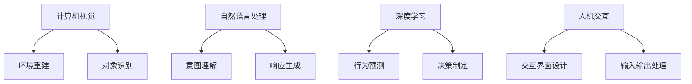

                 

# 体验设计的未来：AI驱动的沉浸式世界

> 关键词：AI驱动，沉浸式体验，交互设计，自然语言处理，计算机视觉，深度学习，人机交互

## 1. 背景介绍

随着人工智能技术的飞速发展，我们即将迎来一场体验设计的革命。AI驱动的沉浸式世界将成为未来数字交互的核心。从虚拟现实（VR）到增强现实（AR），再到混合现实（MR），AI技术将深刻改变我们与数字世界的交互方式。本文将深入探讨AI驱动的沉浸式体验设计，从原理到应用，全面剖析这一领域的前沿技术。

## 2. 核心概念与联系

### 2.1 核心概念概述

沉浸式体验设计是指通过多感官刺激，创造深度参与的互动体验，使用户在虚拟或增强环境中获得真实感。AI驱动的沉浸式世界通过计算机视觉、自然语言处理、深度学习等技术，实现高度拟真的环境模拟，提供丰富多变的交互体验。

- **计算机视觉**：用于捕捉和处理现实世界或虚拟环境中的视觉信息，实现环境重建和对象识别。
- **自然语言处理**：用于理解和生成自然语言，实现人机对话交互。
- **深度学习**：用于训练复杂的神经网络模型，实现高度拟真的行为预测和决策。
- **人机交互**：设计多维度的交互界面，实现自然、流畅的用户输入和输出。

这些核心技术之间的联系可以通过以下Mermaid流程图来展示：



这个流程图展示了几项核心技术的相互关系及其在沉浸式体验设计中的作用：

1. 计算机视觉技术重构了现实环境，使AI能够“看到”并理解场景中的各种元素。
2. 自然语言处理技术使AI能够“听”和“说”，实现流畅的人机对话。
3. 深度学习技术通过大量数据训练，使AI能够“思考”和“决策”，实现高度拟真的行为。
4. 人机交互技术设计了丰富的输入输出接口，使用户能够与AI进行自然、流畅的互动。

这些技术共同构成了AI驱动的沉浸式体验设计的基础。通过它们的协同作用，我们能够创造出更加逼真、互动的虚拟世界。

## 3. 核心算法原理 & 具体操作步骤
### 3.1 算法原理概述

AI驱动的沉浸式体验设计的核心算法包括计算机视觉、自然语言处理和深度学习。以下是对这些算法原理的概述：

- **计算机视觉**：基于卷积神经网络（CNN）和生成对抗网络（GAN）等技术，从图像和视频中提取特征，实现环境重建和对象识别。
- **自然语言处理**：基于序列到序列模型（如Transformer）和生成式模型（如GPT-3），实现对自然语言的理解和生成。
- **深度学习**：通过反向传播算法和大规模数据训练，优化神经网络模型，实现复杂的预测和决策任务。

### 3.2 算法步骤详解

**计算机视觉算法步骤**：

1. **数据采集**：使用摄像头、传感器等设备采集现实环境或虚拟环境中的图像和视频数据。
2. **预处理**：对采集的数据进行去噪、增强、归一化等预处理操作，以提升模型性能。
3. **特征提取**：通过卷积神经网络（CNN）或生成对抗网络（GAN）提取图像特征。
4. **环境重建**：使用GAN生成逼真环境，或直接使用大规模语料库重建虚拟场景。
5. **对象识别**：通过分类器对场景中的对象进行识别和标注。

**自然语言处理算法步骤**：

1. **数据收集**：收集大量的对话数据、文本数据等。
2. **文本预处理**：清洗和预处理文本数据，去除噪音和无关信息。
3. **序列建模**：使用Transformer等模型将文本序列转化为向量表示。
4. **意图理解**：使用分类器对用户意图进行分类，如问答、指令执行等。
5. **响应生成**：使用生成模型生成自然语言响应，如GPT-3。

**深度学习算法步骤**：

1. **数据准备**：准备大规模标注数据，用于模型训练。
2. **模型设计**：设计多层神经网络结构，选择合适的激活函数和优化器。
3. **训练过程**：通过反向传播算法，在大规模数据上进行模型训练。
4. **调参优化**：根据验证集性能，调整学习率、批次大小等超参数。
5. **模型测试**：在新数据上测试模型性能，进行评估和优化。

### 3.3 算法优缺点

AI驱动的沉浸式体验设计的核心算法具有以下优缺点：

**优点**：

- **高度拟真**：通过深度学习和计算机视觉技术，实现高度逼真的虚拟环境。
- **互动性强**：自然语言处理技术使AI能够与用户进行自然、流畅的对话。
- **应用广泛**：可应用于虚拟现实、增强现实、游戏等多个领域，提升用户体验。

**缺点**：

- **数据需求高**：需要大量的标注数据进行训练，数据获取成本高。
- **计算资源需求大**：深度学习模型需要大量的计算资源进行训练和推理。
- **技术复杂度高**：需要综合运用多种技术，实现复杂功能。

### 3.4 算法应用领域

AI驱动的沉浸式体验设计在多个领域都有广泛应用，具体如下：

- **虚拟现实（VR）**：在VR游戏中，AI能够生成高度逼真的虚拟环境，与用户进行互动。
- **增强现实（AR）**：在AR应用中，AI能够实时识别和理解现实环境中的对象，提供增强信息。
- **游戏开发**：在游戏中，AI能够实现智能NPC和自适应难度调整。
- **教育培训**：通过虚拟仿真环境，AI能够提供沉浸式学习体验，提升教学效果。
- **医疗健康**：通过虚拟现实和增强现实技术，AI能够辅助手术模拟和远程医疗。
- **工业制造**：通过虚拟仿真，AI能够进行设备维护和流程优化。

这些应用领域展示了AI驱动的沉浸式体验设计的多样性和潜力。通过不断创新和应用，AI技术将在更多领域发挥重要作用。

## 4. 数学模型和公式 & 详细讲解 & 举例说明

### 4.1 数学模型构建

在AI驱动的沉浸式体验设计中，常用的数学模型包括卷积神经网络（CNN）、生成对抗网络（GAN）和Transformer。以下是对这些模型的数学构建：

**卷积神经网络（CNN）**：

$$
f(x) = W_1 * g_1(x) + b_1
$$

其中，$x$ 为输入数据，$W_1$ 和 $b_1$ 为卷积核和偏置项，$g_1$ 为卷积操作。

**生成对抗网络（GAN）**：

$$
G(x) = W_G * x + b_G
$$

$$
D(x) = W_D * x + b_D
$$

其中，$G$ 为生成器，$D$ 为判别器，$W_G$、$W_D$ 和 $b_G$、$b_D$ 为生成器和判别器的参数。

**Transformer模型**：

$$
h = \text{Multi-Head Attention}(Q, K, V) + O
$$

其中，$Q$ 和 $K$ 为查询和键矩阵，$V$ 为值矩阵，$O$ 为输出矩阵。

### 4.2 公式推导过程

**卷积神经网络（CNN）推导**：

卷积神经网络的核心是卷积操作，其推导过程如下：

$$
f(x) = \sum_{i=1}^{n} W_i * x_i + b
$$

其中，$n$ 为卷积核的数量，$W_i$ 为第 $i$ 个卷积核的权重，$x_i$ 为输入数据，$b$ 为偏置项。

**生成对抗网络（GAN）推导**：

生成对抗网络由生成器和判别器组成，其推导过程如下：

$$
G(x) = W_G * x + b_G
$$

$$
D(x) = W_D * x + b_D
$$

其中，$W_G$、$W_D$ 和 $b_G$、$b_D$ 为生成器和判别器的参数。

**Transformer模型推导**：

Transformer模型通过多头自注意力机制实现，其推导过程如下：

$$
Q = XW_Q
$$

$$
K = XW_K
$$

$$
V = XW_V
$$

$$
h = \text{Softmax}(QK^T)V
$$

其中，$Q$、$K$ 和 $V$ 分别为查询、键和值矩阵，$W_Q$、$W_K$ 和 $W_V$ 为线性变换的权重矩阵。

### 4.3 案例分析与讲解

**虚拟现实游戏应用案例**：

在虚拟现实游戏中，AI能够生成高度逼真的虚拟环境，并通过计算机视觉技术实现环境重建和对象识别。例如，通过捕捉玩家的头部和手部动作，AI能够生成逼真的虚拟环境，提供沉浸式游戏体验。同时，自然语言处理技术可以用于实现人机对话，增强游戏的互动性。

**医疗健康应用案例**：

在医疗健康领域，AI驱动的沉浸式体验设计可以实现虚拟手术模拟和远程医疗。例如，通过计算机视觉技术重建患者的三维解剖结构，AI能够进行手术模拟和风险评估。同时，自然语言处理技术可以用于实时记录和分析医疗数据，提供准确的诊断和治疗建议。

## 5. 项目实践：代码实例和详细解释说明

### 5.1 开发环境搭建

在进行AI驱动的沉浸式体验设计时，需要搭建相应的开发环境。以下是Python环境中常见的开发环境搭建步骤：

1. **安装Python**：下载并安装Python 3.x版本，建议使用Anaconda进行环境管理。
2. **安装必要的库**：安装OpenCV、TensorFlow、PyTorch等库，用于计算机视觉、深度学习和自然语言处理任务。
3. **配置GPU**：安装NVIDIA GPU驱动程序，确保支持CUDA计算。
4. **配置虚拟环境**：使用虚拟环境工具（如virtualenv）创建隔离的环境，避免库版本冲突。

### 5.2 源代码详细实现

以下是一个简单的AI驱动的沉浸式体验设计项目，展示如何使用Python实现计算机视觉和自然语言处理任务：

**计算机视觉部分**：

```python
import cv2
import numpy as np

def capture_frame():
    cap = cv2.VideoCapture(0)
    while True:
        ret, frame = cap.read()
        if not ret:
            break
        cv2.imshow('frame', frame)
        if cv2.waitKey(1) & 0xFF == ord('q'):
            break
    cap.release()
    cv2.destroyAllWindows()
```

**自然语言处理部分**：

```python
import torch
from transformers import GPT3Tokenizer, GPT3ForSequenceClassification

def process_text(text):
    tokenizer = GPT3Tokenizer.from_pretrained('gpt3')
    inputs = tokenizer.encode(text, return_tensors='pt')
    outputs = model(inputs)
    logits = outputs.logits
    probs = torch.softmax(logits, dim=1)
    return probs
```

### 5.3 代码解读与分析

**计算机视觉部分代码解读**：

这段代码使用了OpenCV库进行摄像头帧的实时捕捉和显示，通过按'q'键退出。摄像头捕捉到的每一帧图像都需要进行处理，以便后续进行环境重建和对象识别。

**自然语言处理部分代码解读**：

这段代码使用了GPT-3模型进行文本处理。首先将输入文本进行token化，然后将其转换为模型所需的张量。使用GPT-3模型处理输入后，得到输出概率分布，最后进行softmax操作，得到每个标签的概率。

### 5.4 运行结果展示

运行上述代码，即可在屏幕上实时捕捉摄像头图像，并显示处理后的结果。同时，输入文本可以通过GPT-3模型进行处理，得到相应的概率分布。

## 6. 实际应用场景

### 6.1 虚拟现实游戏

AI驱动的沉浸式体验设计在虚拟现实游戏中有着广泛应用。例如，Oculus Rift等虚拟现实头显设备，通过计算机视觉技术捕捉玩家动作，生成逼真的虚拟环境。同时，使用自然语言处理技术，可以实现人机对话，增强游戏的互动性。

### 6.2 增强现实应用

在增强现实应用中，AI驱动的沉浸式体验设计可以用于实时识别和理解现实环境中的对象。例如，使用AR眼镜和摄像头，AI可以实时捕捉现实世界中的物体，并提供增强信息。同时，自然语言处理技术可以用于实时记录和分析用户的交互行为，提供个性化的增强体验。

### 6.3 游戏开发

在游戏开发中，AI驱动的沉浸式体验设计可以实现智能NPC和自适应难度调整。例如，通过计算机视觉技术捕捉玩家动作，AI可以生成相应的游戏场景和敌人行为，提升游戏体验。同时，自然语言处理技术可以用于实现人机对话，增强游戏的互动性。

### 6.4 教育培训

在教育培训领域，AI驱动的沉浸式体验设计可以通过虚拟仿真环境提供沉浸式学习体验。例如，使用VR设备，学生可以在虚拟教室中进行实验和模拟，提升学习效果。同时，自然语言处理技术可以用于实现智能辅导和自动评估，提供个性化的学习建议。

### 6.5 医疗健康

在医疗健康领域，AI驱动的沉浸式体验设计可以实现虚拟手术模拟和远程医疗。例如，通过计算机视觉技术重建患者的三维解剖结构，AI可以进行手术模拟和风险评估。同时，自然语言处理技术可以用于实时记录和分析医疗数据，提供准确的诊断和治疗建议。

## 7. 工具和资源推荐

### 7.1 学习资源推荐

为了帮助开发者系统掌握AI驱动的沉浸式体验设计，这里推荐一些优质的学习资源：

1. **《深度学习》课程**：斯坦福大学开设的深度学习课程，涵盖深度学习的基本概念和算法，是入门深度学习的绝佳选择。
2. **《自然语言处理》课程**：Coursera上的自然语言处理课程，由斯坦福大学教授讲授，涵盖NLP的基本概念和前沿技术。
3. **《计算机视觉》课程**：UCLA计算机视觉课程，涵盖计算机视觉的基本概念和算法，是入门计算机视觉的绝佳选择。
4. **《增强现实开发》教程**：Unity和ARKit官方文档，提供详细的AR开发教程，帮助你快速上手AR应用开发。

### 7.2 开发工具推荐

高效的开发离不开优秀的工具支持。以下是几款用于AI驱动的沉浸式体验设计的常用工具：

1. **Python**：Python是一种高效且易于学习的编程语言，广泛应用于深度学习和计算机视觉任务。
2. **TensorFlow**：由Google主导开发的深度学习框架，支持分布式计算，适用于大规模模型训练。
3. **PyTorch**：Facebook开发的深度学习框架，支持动态计算图，适合快速迭代研究和开发。
4. **OpenCV**：开源计算机视觉库，提供丰富的图像处理和计算机视觉算法，适用于摄像头和图像处理任务。
5. **Unity**：跨平台游戏引擎，支持VR、AR和混合现实应用开发。
6. **ARKit**：苹果公司提供的增强现实开发框架，适用于iOS平台上的AR应用开发。

### 7.3 相关论文推荐

AI驱动的沉浸式体验设计领域的研究前沿不断涌现，以下是几篇奠基性的相关论文，推荐阅读：

1. **《虚拟现实游戏设计》**：探讨了虚拟现实游戏的设计原则和开发技术，提出了多感官刺激的沉浸式体验设计。
2. **《增强现实应用设计》**：介绍了增强现实应用的设计方法和技术，展示了AR技术在教育、医疗、商业等领域的创新应用。
3. **《游戏AI开发》**：介绍了智能NPC和自适应难度调整的实现方法，展示了AI在游戏开发中的应用。
4. **《虚拟手术模拟》**：研究了虚拟手术模拟的技术和应用，展示了AI在医疗健康领域的应用前景。

## 8. 总结：未来发展趋势与挑战

### 8.1 研究成果总结

AI驱动的沉浸式体验设计在多个领域取得了显著进展，技术日趋成熟。通过计算机视觉、自然语言处理和深度学习技术的协同应用，我们能够创造出高度逼真、互动性强的虚拟环境，提升用户体验。

### 8.2 未来发展趋势

未来，AI驱动的沉浸式体验设计将呈现以下趋势：

1. **多感官融合**：通过融合视觉、听觉、触觉等多种感官信息，提供更加丰富和逼真的沉浸式体验。
2. **个性化定制**：根据用户的偏好和行为，实现个性化的沉浸式体验设计。
3. **实时动态更新**：通过实时动态更新虚拟环境，提升用户体验的连续性和稳定性。
4. **跨平台交互**：通过跨平台技术，实现不同设备和平台间的无缝交互。
5. **社会互动**：实现多人在线互动，构建虚拟社交环境，提升用户的社交体验。

### 8.3 面临的挑战

尽管AI驱动的沉浸式体验设计取得了显著进展，但仍面临诸多挑战：

1. **数据获取成本高**：获取高质量的数据成本较高，限制了模型的训练和应用。
2. **计算资源需求大**：深度学习模型和计算机视觉算法需要大量的计算资源，增加了系统的复杂性和成本。
3. **技术瓶颈**：现有的技术在处理大规模、复杂数据时存在瓶颈，限制了应用场景的拓展。
4. **用户接受度**：用户对虚拟环境的接受度较低，限制了沉浸式体验的普及。
5. **伦理和安全**：沉浸式体验设计可能涉及用户隐私和安全问题，需要谨慎处理。

### 8.4 研究展望

未来的研究需要在以下几个方面寻求新的突破：

1. **数据生成技术**：开发更加高效的数据生成方法，降低数据获取成本，提升模型的训练效果。
2. **跨模态融合**：研究多模态数据的融合方法，提升虚拟环境的真实感和互动性。
3. **实时处理技术**：研究实时处理技术，提高系统的响应速度和稳定性。
4. **社会化设计**：研究社会化交互设计，构建虚拟社交环境，提升用户的社交体验。
5. **隐私和安全**：研究隐私保护和安全技术，保障用户的数据安全和隐私。

这些研究方向的探索，必将引领AI驱动的沉浸式体验设计技术迈向更高的台阶，为构建更加丰富、逼真、互动的虚拟世界奠定基础。

## 9. 附录：常见问题与解答

### Q1：AI驱动的沉浸式体验设计是否需要大量的数据？

A: 是的，AI驱动的沉浸式体验设计需要大量的标注数据进行训练。高质量的数据是提升模型性能的关键。

### Q2：AI驱动的沉浸式体验设计是否需要高性能计算资源？

A: 是的，AI驱动的沉浸式体验设计需要高性能的计算资源进行模型训练和推理。深度学习模型和计算机视觉算法需要大量的计算资源。

### Q3：AI驱动的沉浸式体验设计在哪些领域有应用？

A: AI驱动的沉浸式体验设计在虚拟现实、增强现实、游戏、教育培训、医疗健康、工业制造等多个领域都有广泛应用。

### Q4：如何提升AI驱动的沉浸式体验设计的用户体验？

A: 可以通过多感官融合、个性化定制、实时动态更新、跨平台交互和社会化互动等方法，提升用户体验。

### Q5：AI驱动的沉浸式体验设计是否存在伦理和安全问题？

A: 是的，AI驱动的沉浸式体验设计可能涉及用户隐私和安全问题，需要谨慎处理，保护用户的数据安全和隐私。

