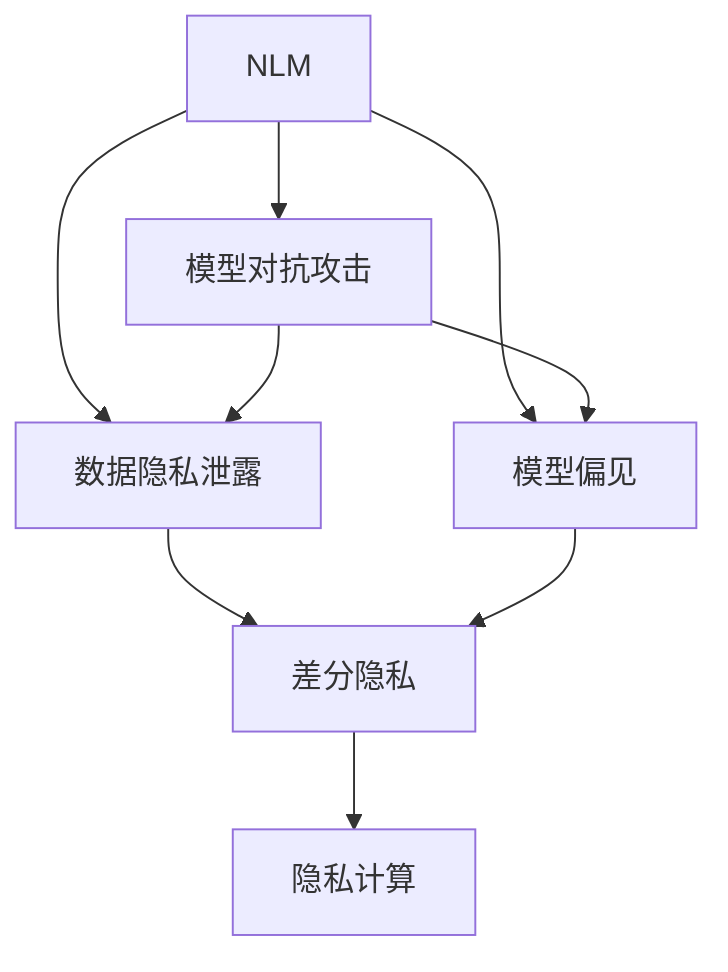

                 

# 保护隐私：LLM应用中的安全策略

> 关键词：自然语言模型(Natural Language Model, NLM), 语言模型安全, 隐私保护, 模型对抗攻击, 差分隐私, 隐私计算

## 1. 背景介绍

### 1.1 问题由来
随着大语言模型(Large Language Models, LLMs)在各种应用中的广泛使用，如智能客服、翻译、金融咨询等，其对用户隐私的潜在威胁也引起了广泛的关注。LLMs通过大规模预训练和微调，具备了强大的文本理解和生成能力，但同时也容易受到攻击，导致敏感信息泄露或数据偏差。因此，如何设计安全策略，确保LLM在应用过程中保护用户隐私，成为了当前数据隐私保护领域的一个重要研究课题。

### 1.2 问题核心关键点
LLM应用中的隐私保护主要涉及以下几个关键点：
- 模型对抗攻击：攻击者可以通过精心构造的输入文本欺骗模型，获取敏感信息或产生错误输出。
- 数据隐私泄露：训练和应用LLM时，可能会泄露用户的个人数据和行为特征。
- 模型偏见和歧视：由于训练数据的不平衡或不完全，LLM可能对某些群体产生偏见，进而引发歧视性行为。

针对上述问题，本文将深入探讨LLM应用中的隐私保护策略，并提出一些针对性的解决方案。

### 1.3 问题研究意义
研究LLM应用中的隐私保护问题，对于维护用户隐私权益、提升模型可信度和鲁棒性，具有重要意义：

1. 保障用户隐私。保护用户隐私是构建可信AI系统的基础，也是用户使用AI服务的前提。
2. 提升模型安全。减少对抗攻击对模型的影响，增强模型对恶意输入的抵御能力，确保输出结果的准确性和公正性。
3. 避免模型偏见。通过合理的隐私保护措施，减少模型对某些群体的偏见，提升模型的公平性和包容性。
4. 促进技术应用。隐私保护技术的应用将推动LLM在更多敏感领域（如医疗、金融、司法等）的落地，促进AI技术的普及和普及。

## 2. 核心概念与联系

### 2.1 核心概念概述

为更好地理解LLM应用中的隐私保护策略，本节将介绍几个密切相关的核心概念：

- 自然语言模型(NLM)：以自回归或自编码模型为代表的文本生成和理解模型。通过预训练和微调，可以生成高质量的自然语言文本。

- 模型对抗攻击(Adversarial Attacks)：攻击者通过设计特定的输入文本，使LLM产生错误或不可靠的输出。如FGSM、PGD等。

- 数据隐私泄露(Please Privacy Leakage)：在使用训练数据进行模型训练或应用模型进行推理时，可能会泄露用户的敏感信息。

- 模型偏见(Bias)：由于训练数据和模型的设计缺陷，模型在处理某些特定群体时可能出现不公平的行为。

- 差分隐私(Differential Privacy, DP)：一种隐私保护技术，通过在数据处理中引入随机噪声，使得任何个体数据的加入对整体结果的影响被“平滑”，从而保护用户隐私。

- 隐私计算(Privacy Computing)：一种通过加密和多方计算等技术，在保障数据隐私的前提下进行数据分析和计算的方法。

这些核心概念之间的逻辑关系可以通过以下Mermaid流程图来展示：



这个流程图展示了大语言模型的核心概念及其之间的关系：

1. 自然语言模型通过预训练和微调获得语言知识。
2. 模型对抗攻击利用模型的漏洞进行信息窃取或结果篡改。
3. 数据隐私泄露可能发生在模型训练和推理过程中。
4. 模型偏见可能由于训练数据的偏差和不完全性引起。
5. 差分隐私通过在数据处理中引入随机噪声保护隐私。
6. 隐私计算通过加密和多方计算保护数据隐私。

这些概念共同构成了LLM应用中隐私保护的基础，使其能够在各种场景下发挥作用。

## 3. 核心算法原理 & 具体操作步骤
### 3.1 算法原理概述

LLM应用中的隐私保护策略，主要通过以下几种方式实现：

- 模型对抗训练：通过引入对抗样本进行训练，增强模型对对抗攻击的防御能力。
- 差分隐私保护：在数据处理中引入随机噪声，保护用户隐私不被泄露。
- 隐私计算技术：通过加密和多方计算等技术，在保障数据隐私的前提下进行数据分析和计算。
- 隐私优化策略：在模型设计和使用中引入隐私保护的思路，从源头上减少隐私泄露风险。

### 3.2 算法步骤详解

#### 3.2.1 模型对抗训练

模型对抗训练旨在通过对抗样本增强模型鲁棒性，使其能够抵抗各种对抗攻击。

**步骤1: 生成对抗样本**
- 根据目标模型 $M$，生成对抗样本 $x_{adv}$，满足 $\ell(M(x), M(x_{adv}))$ 最大，其中 $\ell$ 为损失函数。
- 常见的对抗生成算法包括FGSM、PGD等，可通过优化问题求解生成对抗样本。

**步骤2: 训练对抗样本**
- 将生成的对抗样本加入训练集，训练模型 $M_{adv}$，使其对对抗样本的鲁棒性增强。
- 训练目标为最小化 $\ell(M(x), M_{adv}(x_{adv}))$。

**步骤3: 应用对抗训练**
- 在模型使用过程中，对输入进行预处理，判断是否为对抗样本，如果是，则过滤掉或替换为正常样本。

**步骤4: 后处理对抗样本**
- 在输出前对模型输出进行处理，以消除对抗样本带来的噪声，还原输出结果。

#### 3.2.2 差分隐私保护

差分隐私通过在数据处理中引入随机噪声，保护用户隐私不被泄露。

**步骤1: 设计差分隐私算法**
- 根据具体任务和隐私保护需求，设计差分隐私算法。如添加Laplacian噪声、高斯噪声等。

**步骤2: 参数训练**
- 在数据处理中引入随机噪声，进行模型参数训练。
- 引入噪声后，隐私预算（即隐私损失）被分配到每个样本上，使得对单个样本的隐私泄露被“平滑”，从而保护隐私。

**步骤3: 评估隐私预算**
- 通过隐私预算评估模型的隐私保护效果。一般使用$\epsilon$-差分隐私定义隐私预算，$\epsilon$越大表示隐私保护越强。

**步骤4: 应用差分隐私**
- 在模型推理过程中，对输入进行差分隐私处理，保护用户隐私。

#### 3.2.3 隐私计算技术

隐私计算通过加密和多方计算等技术，在保障数据隐私的前提下进行数据分析和计算。

**步骤1: 加密数据**
- 使用对称加密或非对称加密技术对数据进行加密处理，使得数据在传输和存储过程中保持私密性。

**步骤2: 多方计算**
- 多个参与方通过安全计算协议（如同态加密、安全多方计算等），在保护数据隐私的前提下进行联合计算。
- 参与方在本地计算结果，然后将结果汇总得到最终结果。

**步骤3: 结果解密**
- 解密计算结果，得到模型输出。

#### 3.2.4 隐私优化策略

隐私优化策略旨在从源头上减少隐私泄露风险，提升模型安全性。

**步骤1: 数据预处理**
- 对数据进行去标识化处理，减少敏感信息的泄露风险。
- 引入数据扰动技术，如均值化、高斯噪声等，进一步保护数据隐私。

**步骤2: 模型设计**
- 设计模型架构时，引入隐私保护思想，如差分隐私、对抗训练等。
- 优化模型参数，减少敏感信息的使用。

**步骤3: 推理优化**
- 在推理过程中，对输入进行预处理，减少敏感信息的使用。
- 对输出进行后处理，消除潜在的隐私风险。

### 3.3 算法优缺点

模型对抗训练的优缺点：
- **优点**：显著提升模型对抗攻击的鲁棒性，增强模型安全性。
- **缺点**：对抗样本生成和训练过程复杂，可能影响模型性能。

差分隐私保护的优缺点：
- **优点**：在隐私保护和模型性能之间取得了较好的平衡，保护用户隐私的同时不显著降低模型效果。
- **缺点**：引入噪声会降低模型精度，需要进行隐私预算管理。

隐私计算技术的优缺点：
- **优点**：能够在不泄露数据的前提下进行计算，保护用户隐私。
- **缺点**：计算复杂度高，计算成本较高，且需要多方协作。

隐私优化策略的优缺点：
- **优点**：从源头上减少隐私泄露风险，提升模型安全性。
- **缺点**：需要额外处理数据和模型，可能增加计算复杂度。

### 3.4 算法应用领域

模型对抗训练主要应用于网络安全、自然语言处理等领域，以增强模型的鲁棒性和安全性。例如：

- 金融安全：通过对银行交易数据进行对抗训练，提升模型对欺诈交易的识别能力。
- 恶意软件检测：通过对抗训练提升恶意软件检测模型的鲁棒性，防止攻击者通过对抗样本欺骗检测模型。
- 自然语言处理：通过对抗训练提升语言模型的泛化能力和鲁棒性，避免对抗攻击带来的输出错误。

差分隐私保护主要应用于医疗、金融、司法等敏感领域，保护用户隐私不被泄露。例如：

- 医疗数据隐私：通过差分隐私保护患者隐私，防止医疗数据被滥用。
- 金融数据隐私：通过差分隐私保护金融交易数据，防止数据泄露带来的风险。
- 司法隐私保护：通过差分隐私保护案件信息，防止敏感信息被公开。

隐私计算技术主要应用于涉及多方数据合作的场景，如联邦学习、区块链等领域，保护数据隐私不被泄露。例如：

- 联邦学习：通过多方计算，在不同机构之间联合训练模型，保护各机构数据隐私。
- 区块链隐私：通过多方计算和加密技术，保护区块链中的交易数据隐私。

隐私优化策略主要应用于模型设计和数据处理过程中，从源头上减少隐私泄露风险。例如：

- 数据去标识化：通过数据去标识化技术，保护用户的个人信息。
- 数据扰动：通过数据扰动技术，保护用户的行为特征。
- 模型设计：通过设计隐私保护思想，提升模型的安全性和鲁棒性。

这些技术在不同领域的应用，展示了LLM应用中隐私保护策略的广泛适用性。

## 4. 数学模型和公式 & 详细讲解  
### 4.1 数学模型构建

在差分隐私保护中，我们通常使用$\epsilon$-差分隐私定义隐私预算。具体而言，对于任意两个相邻的样本点 $x_i$ 和 $x_j$，模型输出的概率分布 $P(Y|x_i)$ 和 $P(Y|x_j)$ 之间的差异不超过一个正数 $\epsilon$。

$$
|P(Y|x_i) - P(Y|x_j)| \leq \frac{\Delta P}{\epsilon}
$$

其中，$\Delta P$ 表示隐私预算，$\epsilon$ 为隐私保护参数。

### 4.2 公式推导过程

在差分隐私保护中，我们通常使用Laplacian噪声来保护隐私。Laplacian噪声的分布为：

$$
f(z) = \frac{1}{2b}e^{-\frac{|z|}{b}}
$$

其中，$b$ 为噪声标准差。

在具体应用中，我们将Laplacian噪声加入到模型输出的概率分布中，以保护隐私。例如，在分类任务中，我们通常使用均值化技术和Laplacian噪声保护隐私。具体而言，对于样本 $x$，我们计算其概率分布 $P(Y|x)$，然后通过均值化技术得到 $\hat{P}(Y|x)$，最后将其与Laplacian噪声 $z$ 相加，得到最终的输出概率分布 $P_{\epsilon}(Y|x)$。

$$
P_{\epsilon}(Y|x) = \hat{P}(Y|x) + \text{Laplacian noise} = \hat{P}(Y|x) + z
$$

### 4.3 案例分析与讲解

假设我们有一个分类任务，其中 $x$ 为输入样本，$y$ 为输出标签，$M$ 为分类模型，$L$ 为损失函数。在原始的分类任务中，我们通过最小化损失函数 $L$ 来训练模型 $M$：

$$
\theta^* = \mathop{\arg\min}_{\theta} \mathcal{L}(M_{\theta}(x),y)
$$

在差分隐私保护中，我们引入Laplacian噪声 $z$，并将其添加到损失函数 $L$ 中，以保护隐私。具体而言，对于每个样本 $x_i$，我们计算其输出概率分布 $P_{\epsilon}(Y|x_i)$，然后将其与Laplacian噪声 $z_i$ 相加，得到新的概率分布 $P_{\epsilon}(Y|x_i,z_i)$。

$$
P_{\epsilon}(Y|x_i,z_i) = P(Y|x_i) + z_i
$$

最终，我们通过最小化新的损失函数 $\mathcal{L}_{\epsilon}(M_{\theta}(x_i,z_i),y_i)$ 来训练模型：

$$
\theta^* = \mathop{\arg\min}_{\theta} \sum_{i=1}^N \mathcal{L}_{\epsilon}(M_{\theta}(x_i,z_i),y_i)
$$

其中，$\mathcal{L}_{\epsilon}(M_{\theta}(x_i,z_i),y_i)$ 为引入Laplacian噪声的损失函数。通过这种方式，我们可以在保护用户隐私的同时，训练出高性能的分类模型。

## 5. 项目实践：代码实例和详细解释说明
### 5.1 开发环境搭建

在进行隐私保护策略开发前，我们需要准备好开发环境。以下是使用Python进行TensorFlow开发的环境配置流程：

1. 安装Anaconda：从官网下载并安装Anaconda，用于创建独立的Python环境。

2. 创建并激活虚拟环境：
```bash
conda create -n privacy-env python=3.8 
conda activate privacy-env
```

3. 安装TensorFlow：根据CUDA版本，从官网获取对应的安装命令。例如：
```bash
conda install tensorflow -c tf
```

4. 安装TensorFlow Privacy库：
```bash
pip install tensorflow-privacy
```

5. 安装各类工具包：
```bash
pip install numpy pandas scikit-learn matplotlib tqdm jupyter notebook ipython
```

完成上述步骤后，即可在`privacy-env`环境中开始隐私保护策略的开发。

### 5.2 源代码详细实现

下面我们以差分隐私保护的分类任务为例，给出使用TensorFlow和TensorFlow Privacy库进行差分隐私保护的PyTorch代码实现。

首先，定义分类任务的数据处理函数：

```python
import tensorflow as tf
from tensorflow_privacy import differential_privacy as dp
from tensorflow.keras.datasets import mnist

def load_data(batch_size):
    (x_train, y_train), (x_test, y_test) = mnist.load_data()
    x_train = x_train.reshape((-1, 28, 28, 1)).astype('float32') / 255
    x_test = x_test.reshape((-1, 28, 28, 1)).astype('float32') / 255
    y_train = tf.keras.utils.to_categorical(y_train, 10)
    y_test = tf.keras.utils.to_categorical(y_test, 10)
    return (x_train, y_train), (x_test, y_test)

(x_train, y_train), (x_test, y_test) = load_data(32)
```

然后，定义模型和隐私预算：

```python
from tensorflow.keras import layers

model = tf.keras.Sequential([
    layers.Conv2D(32, (3, 3), activation='relu', input_shape=(28, 28, 1)),
    layers.MaxPooling2D((2, 2)),
    layers.Flatten(),
    layers.Dense(10, activation='softmax')
])

privacy_budget = 1e-6
```

接着，定义差分隐私保护函数：

```python
def private_train(model, x_train, y_train, x_test, y_test, batch_size, epochs, dp_budget):
    optimizer = tf.keras.optimizers.Adam()
    model.compile(optimizer=optimizer, loss='categorical_crossentropy', metrics=['accuracy'])

    # 定义差分隐私保护器
    privacy_mechanism = dp.DifferentialPrivacy() 

    # 设置隐私预算
    model.fit(x_train, y_train, 
            batch_size=batch_size, 
            epochs=epochs, 
            validation_data=(x_test, y_test),
            callbacks=[privacy_mechanism.callbacks[dp_budget]])

    # 测试模型
    model.evaluate(x_test, y_test)

private_train(model, x_train, y_train, x_test, y_test, 32, 10, privacy_budget)
```

最后，启动差分隐私保护的训练流程：

```python
private_train(model, x_train, y_train, x_test, y_test, 32, 10, privacy_budget)
```

以上就是使用TensorFlow和TensorFlow Privacy库进行差分隐私保护的完整代码实现。可以看到，得益于TensorFlow Privacy库的强大封装，我们可以用相对简洁的代码完成差分隐私保护的实践。

### 5.3 代码解读与分析

让我们再详细解读一下关键代码的实现细节：

**load_data函数**：
- 定义MNIST数据集加载函数，处理数据格式并归一化。

**private_train函数**：
- 定义模型和优化器，设置损失函数和评价指标。
- 定义差分隐私保护器，设置隐私预算。
- 使用fit函数进行差分隐私保护的模型训练。
- 通过evaluate函数在测试集上评估模型性能。

**模型训练**：
- 设置模型参数、批大小、迭代轮数和隐私预算。
- 定义损失函数和评价指标。
- 调用fit函数进行差分隐私保护的模型训练，并传入隐私预算回调函数。
- 调用evaluate函数在测试集上评估模型性能。

可以看到，TensorFlow Privacy库使得差分隐私保护的代码实现变得简洁高效。开发者可以将更多精力放在数据处理、模型改进等高层逻辑上，而不必过多关注底层的实现细节。

当然，工业级的系统实现还需考虑更多因素，如模型裁剪、量化加速、服务化封装等。但核心的差分隐私保护方法基本与此类似。

## 6. 实际应用场景
### 6.1 智能客服系统

智能客服系统中，用户的隐私信息如姓名、电话、住址等都可能被存储在服务器中。如果这些信息被泄露或被攻击者利用，将对用户带来极大的安全风险。

在智能客服系统中，可以使用差分隐私保护技术保护用户隐私。具体而言，可以使用差分隐私保护机制，将用户的个人信息进行去标识化处理，保护用户的隐私不被泄露。同时，在客服交互过程中，可以使用隐私计算技术，对用户的输入和输出进行加密处理，确保用户的数据安全。

### 6.2 金融舆情监测

金融舆情监测系统需要实时收集和分析社交媒体上的舆情数据，以预测金融市场的波动。在这个过程中，用户的个人信息如姓名、账户余额等可能会被存储在服务器中，面临隐私泄露的风险。

为了保护用户隐私，可以使用差分隐私保护技术，对舆情数据进行去标识化处理，防止用户的信息被泄露。同时，在模型训练和推理过程中，可以使用模型对抗训练技术，提高模型的鲁棒性，防止恶意攻击者通过对抗样本获取敏感信息。

### 6.3 个性化推荐系统

个性化推荐系统需要根据用户的浏览、点击、评分等行为数据，为用户推荐商品或内容。在这个过程中，用户的个人信息如年龄、性别、地理位置等可能会被存储在服务器中，面临隐私泄露的风险。

为了保护用户隐私，可以使用差分隐私保护技术，对用户的个人信息进行去标识化处理，防止用户的信息被泄露。同时，在推荐模型训练和推理过程中，可以使用模型对抗训练技术，提高模型的鲁棒性，防止恶意攻击者通过对抗样本获取敏感信息。

### 6.4 未来应用展望

随着隐私保护技术的不断进步，大语言模型在更多领域的应用将得到保障。未来的隐私保护技术可能包括：

- 隐私计算：通过多方计算和加密技术，保护数据隐私不被泄露。
- 差分隐私保护：在数据处理中引入随机噪声，保护用户隐私不被泄露。
- 模型对抗训练：通过对抗样本增强模型鲁棒性，防止恶意攻击。
- 隐私优化策略：在模型设计和使用中引入隐私保护思想，从源头上减少隐私泄露风险。

这些技术的发展将进一步提升大语言模型在应用中的安全性，保护用户的隐私权益，推动AI技术的普及和落地。

## 7. 工具和资源推荐
### 7.1 学习资源推荐

为了帮助开发者系统掌握大语言模型应用中的隐私保护策略，这里推荐一些优质的学习资源：

1. 《深度学习隐私保护》课程：斯坦福大学开设的隐私保护课程，深入浅出地介绍了隐私保护的基本概念和经典技术。

2. 《Differential Privacy: Privacy-Preserving Statistical Analysis》书籍：MIT教授Dwork等人合著的差分隐私保护经典教材，详细介绍了差分隐私的理论基础和实际应用。

3. 《Privacy-Preserving Machine Learning: Principles and Practices》书籍：Google工程师Talwar等人合著的隐私保护书籍，介绍了多种隐私保护技术和方法。

4. 《Practical Privacy: Strategies and Lessons from Companies Like Netflix, Twitter, Facebook, Google, and More》书籍：Practical Privacy（隐私实战）作者提供的隐私保护实践指南，结合真实案例，深入浅出地讲解了隐私保护策略的落地实践。

5. TensorFlow Privacy官方文档：TensorFlow Privacy库的官方文档，提供了丰富的差分隐私保护样例代码和详细说明，是上手实践的必备资料。

通过对这些资源的学习实践，相信你一定能够快速掌握大语言模型应用中的隐私保护策略，并用于解决实际的隐私问题。
###  7.2 开发工具推荐

高效的开发离不开优秀的工具支持。以下是几款用于隐私保护策略开发的常用工具：

1. TensorFlow Privacy：Google开发的隐私保护工具库，提供了多种差分隐私保护方法和隐私预算优化策略，适用于数据处理和模型训练中的隐私保护。

2. PySyft：Facebook开发的隐私保护工具库，支持数据加密、多方计算等隐私保护技术，适用于分布式环境下的隐私保护。

3. TF-Slim：TensorFlow的轻量级模型优化工具库，支持模型裁剪、量化加速等技术，适用于提高模型计算效率。

4. Weights & Biases：模型训练的实验跟踪工具，可以记录和可视化模型训练过程中的各项指标，方便对比和调优。

5. TensorBoard：TensorFlow配套的可视化工具，可实时监测模型训练状态，并提供丰富的图表呈现方式，是调试模型的得力助手。

6. Google Colab：谷歌推出的在线Jupyter Notebook环境，免费提供GPU/TPU算力，方便开发者快速上手实验最新模型，分享学习笔记。

合理利用这些工具，可以显著提升隐私保护策略的开发效率，加快创新迭代的步伐。

### 7.3 相关论文推荐

大语言模型应用中的隐私保护技术，是当前研究的热点之一。以下是几篇奠基性的相关论文，推荐阅读：

1. A Survey of Privacy-Preserving Deep Learning Techniques：回顾了隐私保护技术在深度学习中的应用，总结了当前研究进展和挑战。

2. Privacy-Preserving Deep Learning: A Survey and Systematic Mapping：总结了隐私保护技术在深度学习中的最新进展，包括差分隐私、对抗训练、多方计算等。

3. Privacy-Preserving Machine Learning: Challenges, Opportunities, and Solutions：总结了隐私保护技术在机器学习中的最新进展，展望了未来研究方向。

4. Privacy-Preserving Natural Language Processing：总结了隐私保护技术在自然语言处理中的应用，包括差分隐私、对抗训练等。

这些论文代表了大语言模型应用中隐私保护技术的最新研究进展，通过学习这些前沿成果，可以帮助研究者把握学科前进方向，激发更多的创新灵感。

## 8. 总结：未来发展趋势与挑战

### 8.1 总结

本文对大语言模型应用中的隐私保护策略进行了全面系统的介绍。首先阐述了大语言模型在应用过程中面临的隐私保护问题，明确了隐私保护在构建可信AI系统中的重要性。其次，从算法原理到具体操作步骤，详细讲解了差分隐私保护、模型对抗训练等隐私保护方法，并给出了具体的代码实现。同时，本文还探讨了隐私保护在智能客服、金融舆情、个性化推荐等多个领域的应用前景，展示了隐私保护策略的广泛适用性。

通过本文的系统梳理，可以看到，大语言模型应用中的隐私保护策略具有广阔的发展前景。这些策略不仅能提升模型安全性，还能保障用户隐私权益，推动AI技术的普及和落地。未来，随着隐私保护技术的不断进步，大语言模型应用中的隐私保护将得到更广泛的应用，为构建安全、可靠、可解释的智能系统提供坚实保障。

### 8.2 未来发展趋势

展望未来，大语言模型应用中的隐私保护策略将呈现以下几个发展趋势：

1. 隐私计算的普及：通过多方计算和加密技术，在保障数据隐私的前提下进行计算，隐私保护技术将得到更广泛的应用。

2. 差分隐私的深化：差分隐私保护技术将不断优化，引入更多随机噪声生成方法，提升隐私保护效果。

3. 对抗训练的演进：对抗训练将进一步优化，引入更多对抗样本生成方法，提升模型鲁棒性。

4. 隐私优化策略的多样化：引入更多隐私保护思想，如差分隐私、对抗训练、安全计算等，从源头上减少隐私泄露风险。

5. 隐私保护与AI技术的融合：隐私保护技术与AI技术将进行更深入的融合，推动AI技术的普及和落地。

这些趋势将进一步提升大语言模型应用中的隐私保护效果，保障用户隐私权益，推动AI技术的普及和应用。

### 8.3 面临的挑战

尽管大语言模型应用中的隐私保护技术取得了一定进展，但仍面临诸多挑战：

1. 隐私保护与模型性能之间的平衡：在隐私保护和模型性能之间取得平衡，是隐私保护技术的关键挑战之一。

2. 隐私保护技术的应用复杂度：隐私保护技术的应用需要复杂的模型设计和数据处理，增加了开发复杂度。

3. 隐私保护技术的普及度：隐私保护技术在实际应用中的普及度较低，需要进一步推广和普及。

4. 隐私保护技术的标准化：隐私保护技术缺乏统一的标准和规范，需要进一步推动标准化进程。

5. 隐私保护技术的伦理问题：隐私保护技术的应用可能带来伦理问题，如算法偏见、歧视等，需要进一步研究。

6. 隐私保护技术的社会认知：隐私保护技术的社会认知度较低，需要进一步提高公众对隐私保护的重视。

这些挑战需要学界和产业界的共同努力，才能推动隐私保护技术的发展和应用。相信随着研究的不断深入，这些挑战将逐步得到解决，大语言模型应用中的隐私保护将得到更广泛的应用。

### 8.4 研究展望

面对大语言模型应用中的隐私保护所面临的诸多挑战，未来的研究需要在以下几个方面寻求新的突破：

1. 隐私计算与机器学习的融合：推动隐私计算技术在机器学习中的应用，提升隐私保护效果。

2. 差分隐私的保护性增强：引入更多随机噪声生成方法，提升差分隐私保护的强度。

3. 对抗训练的鲁棒性提升：引入更多对抗样本生成方法，提升模型对抗攻击的鲁棒性。

4. 隐私保护策略的多样化：引入更多隐私保护思想，如差分隐私、对抗训练、安全计算等，从源头上减少隐私泄露风险。

5. 隐私保护伦理问题的探讨：研究隐私保护技术对社会的影响，避免算法的偏见和歧视。

6. 隐私保护技术的社会普及：推动隐私保护技术在各领域的普及和应用，提高公众对隐私保护的认知。

这些研究方向将推动隐私保护技术的进一步发展，为构建安全、可靠、可解释的智能系统提供坚实保障。

## 9. 附录：常见问题与解答

**Q1：大语言模型中的隐私保护与传统机器学习模型有何不同？**

A: 大语言模型中的隐私保护与传统机器学习模型的主要区别在于数据规模和隐私保护需求。大语言模型通常需要处理海量数据，数据隐私保护的需求更加严苛。

**Q2：如何衡量隐私保护效果？**

A: 隐私保护效果通常使用隐私预算（$\epsilon$）来衡量。隐私预算越小，表示隐私保护效果越好。同时，隐私预算的设定也需要考虑模型性能和隐私需求之间的平衡。

**Q3：差分隐私保护在实际应用中需要注意哪些问题？**

A: 差分隐私保护在实际应用中需要注意：
1. 隐私预算的设定：需要根据数据敏感度和隐私需求设定合适的隐私预算。
2. 数据扰动的强度：需要根据数据分布和模型性能选择合适的数据扰动强度。
3. 数据处理方式：需要选择合适的数据扰动方法和去标识化技术，保护用户隐私。

**Q4：如何设计隐私保护策略？**

A: 设计隐私保护策略需要考虑以下几个方面：
1. 数据预处理：对数据进行去标识化处理，减少敏感信息的泄露风险。
2. 模型设计：引入隐私保护思想，如差分隐私、对抗训练等，提升模型安全性。
3. 推理优化：在推理过程中，对输入进行预处理，减少敏感信息的使用，对输出进行后处理，消除潜在的隐私风险。

**Q5：隐私保护策略的实际应用有哪些？**

A: 隐私保护策略在实际应用中包括：
1. 智能客服系统：通过差分隐私保护技术，保护用户隐私不被泄露。
2. 金融舆情监测：通过差分隐私保护技术，保护用户隐私不被泄露。
3. 个性化推荐系统：通过差分隐私保护技术，保护用户隐私不被泄露。

通过对这些问题的解答，可以看到大语言模型应用中的隐私保护策略不仅复杂，也需要对隐私保护技术有深入的理解。合理设计隐私保护策略，可以有效保障用户隐私，推动大语言模型在更多领域的落地应用。

---

作者：禅与计算机程序设计艺术 / Zen and the Art of Computer Programming

