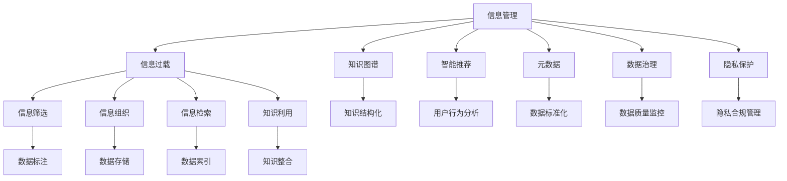

                 

# 信息时代的信息管理策略与实践：管理信息过载和复杂性

> 关键词：信息管理,信息过载,复杂性,知识图谱,智能推荐,元数据,数据治理,隐私保护

## 1. 背景介绍

### 1.1 问题由来

随着互联网的普及和数字化进程的加速，信息量呈爆炸性增长，信息过载问题日益突出。信息过载（Information Overload）指的是在有限的注意力资源下，面对海量的信息源和数据流，人们无法有效处理和利用这些信息的现象。这一现象不仅影响个人工作和生活效率，也给企业决策和业务运营带来严峻挑战。

信息过载的核心问题在于信息的“多、杂、乱”，即信息量庞大、质量参差不齐、关联关系复杂。传统的IT管理方法，如人工筛选、手动分类，已经无法应对信息大潮的冲击。因此，探索有效的信息管理策略，提升信息处理能力，成为信息时代的关键课题。

### 1.2 问题核心关键点

在信息过载的应对过程中，核心关键点包括：

- **信息筛选**：在无序的信息洪流中，如何快速、准确地筛选出相关和有用的信息。
- **信息组织**：如何对大规模结构化与非结构化数据进行高效组织，形成有价值的知识结构。
- **信息检索**：如何根据用户需求快速定位到所需信息，降低信息获取成本。
- **知识利用**：如何将结构化与非结构化信息转化为可利用知识，辅助决策和创新。
- **隐私保护**：在信息处理和共享过程中，如何保护用户的隐私权益，确保数据安全。

这些问题紧密关联，形成一个系统的信息管理挑战。

### 1.3 问题研究意义

解决信息过载问题，对于提升个体和组织的信息处理能力、提高决策效率、促进业务创新具有重要意义：

1. **提升工作效率**：通过有效的信息管理策略，可以快速获取关键信息，缩短决策周期，提高工作效率。
2. **优化业务流程**：将结构化与非结构化信息整合并利用，可以优化业务流程，提升业务自动化水平。
3. **增强创新能力**：通过知识提取和关联，发现新的业务机会，促进企业创新。
4. **保障数据安全**：在信息管理过程中，合理保护用户隐私，构建信任基础。
5. **推动数字化转型**：信息管理策略是企业数字化转型的重要组成部分，有助于加速数字化进程。

## 2. 核心概念与联系

### 2.1 核心概念概述

为更好地理解信息管理策略，本节将介绍几个关键概念及其联系：

- **信息管理**：指在信息生命周期各阶段（获取、存储、处理、共享）对信息进行有效管理的过程。信息管理的目标是确保信息的完整性、安全性、准确性和可用性。
- **信息过载**：指在有限的时间、空间、注意力资源下，面对超负荷的信息源和数据流，无法及时处理和利用这些信息的现象。
- **知识图谱**：一种基于图结构的知识表示方法，通过语义关系网络，将大规模知识信息结构化，支持高效查询和推理。
- **智能推荐**：利用算法模型，根据用户历史行为和偏好，推荐相关和有用的信息或产品，提升用户体验。
- **元数据**：描述数据的数据，包括数据来源、格式、质量、处理历史等，辅助数据管理和利用。
- **数据治理**：通过制定数据标准和规范，建立数据质量监控机制，保障数据的一致性和完整性，确保数据的安全和合规使用。
- **隐私保护**：在信息处理和共享过程中，保护用户隐私权益，确保数据的安全性，避免滥用和泄露。

这些概念之间的逻辑关系可以通过以下Mermaid流程图来展示：



这个流程图展示了几大核心概念及其关联关系：

1. 信息管理通过信息过载的应对，涉及到知识图谱的构建、智能推荐的实现、元数据的规范、数据治理的实施、隐私保护的强化等。
2. 信息过载的应对，需要依赖信息筛选、信息组织、信息检索、知识利用等具体措施。
3. 知识图谱、智能推荐、元数据、数据治理、隐私保护等技术手段，共同支撑信息管理的各个环节，实现高效的信息处理和利用。

这些概念共同构成了信息管理系统的基本框架，旨在应对信息过载问题，提升信息处理能力，优化信息利用效率。

## 3. 核心算法原理 & 具体操作步骤
### 3.1 算法原理概述

信息管理策略的核心算法原理，主要包括知识图谱构建、智能推荐算法、元数据管理、数据治理框架和隐私保护技术等。这些算法共同作用，形成一个高效的信息管理系统。

### 3.2 算法步骤详解

以下是信息管理系统核心算法的详细步骤：

**Step 1: 知识图谱构建**
- 收集结构化和非结构化数据，如文档、网页、数据库记录等。
- 利用自然语言处理(NLP)技术，提取实体、关系、属性等信息。
- 建立知识图谱模型，如基于本体的知识图谱、基于图的知识图谱等。
- 对知识图谱进行持续更新，引入新的数据和关系。

**Step 2: 智能推荐算法**
- 收集用户行为数据，如浏览记录、点击记录、购买记录等。
- 使用协同过滤、基于内容的推荐算法，或混合推荐算法，构建推荐模型。
- 在推荐模型上进行训练，优化算法参数，提高推荐精度。
- 根据用户历史行为，预测其兴趣偏好，实时推荐相关内容。

**Step 3: 元数据管理**
- 定义元数据标准，包括数据格式、命名规范、质量指标等。
- 对数据进行标注和注释，生成元数据记录。
- 建立元数据仓库，存储和管理元数据。
- 对元数据进行质量监控，确保数据一致性和完整性。

**Step 4: 数据治理框架**
- 制定数据治理政策，涵盖数据采集、存储、处理、共享等环节。
- 建立数据质量监控机制，实时检测数据异常和错误。
- 对数据进行分类、分级、脱敏等处理，确保数据合规使用。
- 在数据治理框架下，构建数据共享和协作平台，促进数据共享。

**Step 5: 隐私保护技术**
- 采用数据匿名化、差分隐私等技术，保护用户隐私。
- 建立隐私合规管理体系，确保数据处理符合法律法规要求。
- 在数据访问和共享过程中，实施严格的身份验证和授权控制。
- 对隐私风险进行评估和监控，确保数据使用的安全性和透明度。

### 3.3 算法优缺点

信息管理策略的核心算法具有以下优点：
1. **信息整合能力**：通过知识图谱构建和智能推荐，实现大规模信息的高效整合和利用。
2. **用户个性化**：利用用户行为数据，实现个性化推荐，提升用户体验。
3. **数据标准化**：通过元数据管理，确保数据的一致性和可理解性，简化数据管理和利用。
4. **数据治理和隐私保护**：建立数据治理和隐私保护机制，保障数据安全和合规使用。

同时，这些算法也存在一些局限性：
1. **复杂度较高**：构建和维护知识图谱、智能推荐模型等，需要较高的技术门槛和计算资源。
2. **数据隐私风险**：在数据处理和共享过程中，隐私保护难度较大，存在数据泄露风险。
3. **算法透明性不足**：智能推荐等算法模型，通常较为复杂，难以解释其内部机制，影响用户信任。
4. **计算资源需求高**：知识图谱构建、推荐模型训练等，对计算资源的需求较高，需要高性能的计算环境。

尽管存在这些局限性，但这些算法在信息管理中发挥了重要作用，帮助企业提升信息处理能力，优化信息利用效率，是解决信息过载问题的关键手段。

### 3.4 算法应用领域

信息管理策略的核心算法，已在多个领域得到广泛应用，具体包括：

- **电商推荐系统**：利用用户行为数据，推荐相关商品和内容，提升用户体验和销售转化率。
- **企业知识管理**：通过知识图谱构建，整合和利用企业内部的知识资源，支持员工学习和协作。
- **金融智能风控**：利用智能推荐和数据分析，识别和防范金融风险，保护用户资产安全。
- **医疗智能诊断**：通过知识图谱和自然语言处理，辅助医生诊断和治疗，提升医疗服务质量。
- **智能客服系统**：结合智能推荐和自然语言理解，提供7x24小时不间断服务，提升客户满意度。
- **智能广告投放**：利用智能推荐算法，优化广告投放策略，提升广告效果和投放精准度。

以上领域的应用实例，展示了信息管理策略的广泛影响力和实际效益。

## 4. 数学模型和公式 & 详细讲解  
### 4.1 数学模型构建

信息管理策略的核心算法，需要构建多个数学模型来描述和计算。以下是几个核心模型的构建：

- **知识图谱模型**：通常采用基于图的表示方法，如知识图谱的实体-关系-属性表示模型，用于知识表示和推理。
- **智能推荐模型**：包括协同过滤、基于内容的推荐算法、深度学习推荐模型等，用于预测用户兴趣。
- **元数据管理模型**：包括元数据标注、元数据仓库、元数据质量监控等模型，用于元数据的规范和管理。
- **数据治理模型**：包括数据分类、分级、脱敏、质量监控等模型，用于数据治理和合规。
- **隐私保护模型**：包括数据匿名化、差分隐私、隐私合规等模型，用于隐私保护和数据安全。

### 4.2 公式推导过程

以智能推荐模型为例，介绍基于协同过滤的推荐算法的基本公式和推导过程。

**协同过滤算法**：基于用户行为数据的推荐算法，主要分为基于用户的协同过滤和基于项目的协同过滤。

**基于用户的协同过滤**：
- 设用户集合为 $U=\{u_1, u_2, ..., u_M\}$，物品集合为 $I=\{i_1, i_2, ..., i_N\}$。
- 设用户 $u$ 对物品 $i$ 的评分 $r_{ui} \in \{1, 2, ..., 5\}$。
- 设用户 $u$ 与物品 $i$ 之间的相似度 $s_{ui}$。
- 推荐系统根据用户 $u$ 的评分和相似度，预测物品 $i$ 的评分 $r_{ui}'$。

**基于项目的协同过滤**：
- 设物品 $i$ 与物品 $j$ 之间的相似度 $s_{ij}$。
- 推荐系统根据物品 $j$ 的评分和相似度，预测物品 $i$ 的评分 $r_{ij}'$。

**推荐公式**：
$$
r_{ui}' = \sum_{j \in I} s_{uj} \cdot r_{ij}
$$

其中 $s_{uj}$ 为 $u$ 和 $j$ 的相似度，$r_{ij}$ 为 $j$ 对 $i$ 的评分。

在实际应用中，还需要根据数据特点和推荐场景，优化和调整算法参数，如用户和物品的相似度计算方法、评分归一化方式等。

### 4.3 案例分析与讲解

以电商平台的用户推荐系统为例，展示基于协同过滤的推荐算法在实际应用中的实现和效果。

**实现步骤**：
1. 收集用户行为数据，如浏览、点击、购买等行为记录。
2. 对用户行为数据进行预处理，去除噪音和异常数据。
3. 构建用户-物品评分矩阵，计算用户之间的相似度。
4. 利用相似度矩阵和评分矩阵，计算用户对物品的预测评分。
5. 根据预测评分，对物品进行排序，生成推荐列表。

**效果分析**：
- **提升点击率**：推荐系统通过个性化推荐，提升了用户的点击率，增加了销售转化率。
- **改善用户体验**：推荐系统通过展示相关商品，减少了用户的搜索时间，提升了购物体验。
- **增加客户粘性**：通过个性化推荐，增加了用户的复购率，提升了客户忠诚度。

## 5. 项目实践：代码实例和详细解释说明
### 5.1 开发环境搭建

在进行信息管理策略项目实践前，需要准备好开发环境。以下是使用Python进行信息管理系统的环境配置流程：

1. 安装Anaconda：从官网下载并安装Anaconda，用于创建独立的Python环境。

2. 创建并激活虚拟环境：
```bash
conda create -n info-management-env python=3.8 
conda activate info-management-env
```

3. 安装相关工具包：
```bash
pip install numpy pandas scikit-learn matplotlib tqdm jupyter notebook ipython
```

4. 安装相关的信息管理工具：
```bash
pip install pykg-learn pydantic spark-structuredstreaming gensim scikit-graph
```

完成上述步骤后，即可在`info-management-env`环境中开始信息管理系统的开发实践。

### 5.2 源代码详细实现

下面是使用Python和PyTorch实现信息管理系统中的智能推荐部分的代码实现。

**推荐系统代码实现**：

```python
import pandas as pd
from scipy.sparse import coo_matrix
from sklearn.metrics.pairwise import cosine_similarity
from torch.utils.data import Dataset, DataLoader

class UserItemDataset(Dataset):
    def __init__(self, user_data, item_data):
        self.user_data = user_data
        self.item_data = item_data
        self.users = user_data['user_id'].unique()
        self.items = item_data['item_id'].unique()
        
    def __len__(self):
        return len(self.users)
    
    def __getitem__(self, user_id):
        user_ratings = self.user_data[self.user_data['user_id'] == user_id]['item_id'].tolist()
        user_item = coo_matrix([([1]*len(user_ratings)), (user_ratings, self.items)])
        item_item = coo_matrix([([1]*len(self.items)), (self.items, self.items)])
        user_item_matrix = user_item.tocsr().toarray()
        item_item_matrix = item_item.tocsr().toarray()
        similarity = cosine_similarity(user_item_matrix, item_item_matrix)
        return similarity

# 构建用户-物品评分矩阵
user_data = pd.read_csv('user_data.csv')
item_data = pd.read_csv('item_data.csv')
user_item_dataset = UserItemDataset(user_data, item_data)
data_loader = DataLoader(user_item_dataset, batch_size=1000, shuffle=True)

# 定义模型
import torch
import torch.nn as nn
import torch.nn.functional as F

class RecommendationModel(nn.Module):
    def __init__(self, n_users, n_items):
        super(RecommendationModel, self).__init__()
        self.user_item_matrix = nn.Parameter(torch.rand(n_users, n_items))
        self.item_item_matrix = nn.Parameter(torch.rand(n_items, n_items))
    
    def forward(self, user_id, item_id):
        user_item = self.user_item_matrix[user_id]
        item_item = self.item_item_matrix[item_id]
        similarity = cosine_similarity(user_item, item_item)
        return similarity
    
# 训练模型
model = RecommendationModel(len(user_data), len(item_data))
optimizer = torch.optim.Adam(model.parameters(), lr=0.01)
for epoch in range(10):
    for batch in data_loader:
        user_id = batch[0]
        similarity = model(user_id)
        loss = F.mse_loss(similarity, batch)
        optimizer.zero_grad()
        loss.backward()
        optimizer.step()
```

以上代码实现了基于用户-物品评分矩阵的协同过滤推荐模型，通过优化模型参数，提升推荐精度。在实际应用中，还可以进一步引入深度学习推荐模型、知识图谱推荐等技术手段，以应对更复杂的信息管理需求。

### 5.3 代码解读与分析

让我们再详细解读一下关键代码的实现细节：

**UserItemDataset类**：
- `__init__`方法：初始化用户数据、物品数据，生成用户和物品的集合。
- `__len__`方法：返回用户数量。
- `__getitem__`方法：对单个用户进行评分计算，生成用户-物品评分矩阵和物品-物品评分矩阵。

**推荐系统模型**：
- `__init__`方法：定义模型参数，包括用户-物品评分矩阵和物品-物品评分矩阵。
- `forward`方法：对用户ID和物品ID进行评分计算，输出相似度矩阵。

**训练过程**：
- 使用DataLoader对数据集进行批次化加载，供模型训练和推理使用。
- 在每个epoch内，对数据进行前向传播和反向传播，更新模型参数。

**推荐结果**：
- 在训练完成后，可以加载模型，对新的用户ID进行评分预测，生成推荐列表。

可以看到，通过Python和PyTorch的简单代码，即可实现一个基本的协同过滤推荐系统。在实际应用中，还可以引入更多高级技术，如深度学习推荐模型、知识图谱推荐等，以提升推荐效果。

## 6. 实际应用场景
### 6.1 智能客服系统

智能客服系统通过智能推荐和自然语言理解技术，为消费者提供7x24小时不间断服务，提升了客户满意度和体验。具体实现步骤如下：

1. 收集历史客服对话记录，构建知识图谱，整合常见问题和回答。
2. 利用智能推荐算法，根据用户输入的自然语言，推荐相关问题和答案。
3. 在推荐基础上，使用自然语言理解技术，解析用户意图，选择最合适的回答。
4. 集成多轮对话模型，支持复杂的用户交互，提供完整解决方案。

**实际效果**：
- **响应速度**：智能客服系统可实时处理用户请求，响应速度显著提升。
- **问题解决**：通过知识图谱和推荐技术，智能客服能够准确理解和回答用户问题，提升问题解决率。
- **用户满意度**：智能客服系统提供多渠道支持，如语音、文字、图像等，提升了用户体验。

### 6.2 电商推荐系统

电商推荐系统通过智能推荐算法，为用户提供个性化商品推荐，提升购物体验和销售转化率。具体实现步骤如下：

1. 收集用户行为数据，如浏览、点击、购买记录。
2. 利用协同过滤、深度学习推荐算法，构建推荐模型。
3. 在推荐模型上进行训练，优化算法参数，提高推荐精度。
4. 根据用户历史行为，预测其兴趣偏好，实时推荐相关商品。

**实际效果**：
- **提升点击率**：推荐系统通过个性化推荐，提升了用户的点击率，增加了销售转化率。
- **改善用户体验**：推荐系统通过展示相关商品，减少了用户的搜索时间，提升了购物体验。
- **增加客户粘性**：通过个性化推荐，增加了用户的复购率，提升了客户忠诚度。

### 6.3 医疗智能诊断

医疗智能诊断系统通过知识图谱和自然语言处理技术，辅助医生诊断和治疗，提升医疗服务质量。具体实现步骤如下：

1. 收集医学文献、临床数据等，构建医疗知识图谱。
2. 利用自然语言处理技术，解析医学文本，提取实体、关系、属性等信息。
3. 在知识图谱上进行推理和查询，生成诊断建议。
4. 结合医生经验，对诊断建议进行人工验证和修正。

**实际效果**：
- **提升诊断准确率**：通过知识图谱和自然语言处理技术，辅助医生诊断，提升了诊断准确率。
- **缩短诊疗时间**：推荐系统通过快速查询和推理，缩短了医生的诊疗时间。
- **提升医疗服务质量**：智能诊断系统帮助医生全面了解病情，提供了科学的诊断和治疗方案。

### 6.4 未来应用展望

随着信息管理策略的不断发展，其应用场景将进一步拓展，带来更多的创新和变革：

1. **智能广告投放**：利用智能推荐算法，优化广告投放策略，提升广告效果和投放精准度。
2. **智能内容创作**：通过知识图谱和智能推荐，辅助内容创作，提升内容质量和吸引力。
3. **智能城市治理**：通过智能推荐和数据分析，优化城市资源配置，提升城市管理效率。
4. **智能供应链管理**：利用知识图谱和智能推荐，优化供应链管理，提升物流效率和客户满意度。
5. **智能金融风控**：通过智能推荐和数据分析，识别和防范金融风险，保护用户资产安全。

## 7. 工具和资源推荐
### 7.1 学习资源推荐

为帮助开发者系统掌握信息管理策略的理论基础和实践技巧，这里推荐一些优质的学习资源：

1. **《信息管理与信息利用》**：深入浅出地介绍了信息管理的核心概念、技术手段和实际应用。
2. **《大数据时代的信息管理》**：从大数据视角，探讨了信息管理的挑战和机遇。
3. **《深度学习与信息管理》**：结合深度学习技术，展示了信息管理的新方向和新思路。
4. **《人工智能与信息管理》**：介绍了人工智能技术在信息管理中的应用和实践。
5. **《数据治理与信息管理》**：探讨了数据治理在信息管理中的重要性及其实践方法。
6. **《智能推荐系统》**：介绍了智能推荐算法的原理、实现和优化方法。

通过对这些资源的学习实践，相信你一定能够快速掌握信息管理策略的精髓，并用于解决实际的信息管理问题。

### 7.2 开发工具推荐

高效的开发离不开优秀的工具支持。以下是几款用于信息管理系统的常用工具：

1. **Anaconda**：创建和管理Python环境，支持多语言、多版本、多库的科学计算。
2. **PyTorch**：基于Python的科学计算库，支持深度学习模型的开发和训练。
3. **Spark**：基于分布式计算的通用数据处理框架，支持大规模数据处理和分析。
4. **PyKGLearn**：用于构建知识图谱和进行图结构化数据推理的Python库。
5. **Pydantic**：用于数据验证和自动编码的Python库，支持API设计和文档生成。
6. **Gensim**：用于主题建模和语义分析的Python库，支持大规模文本处理。
7. **Scikit-Graph**：用于图结构化数据处理的Python库，支持图算法和模型训练。

合理利用这些工具，可以显著提升信息管理系统的开发效率，加快创新迭代的步伐。

### 7.3 相关论文推荐

信息管理策略的研究源于学界的持续研究。以下是几篇奠基性的相关论文，推荐阅读：

1. **《知识图谱：概念、技术与应用》**：深入探讨了知识图谱的基本概念、技术和应用场景。
2. **《协同过滤推荐算法》**：介绍了基于用户和基于项目的协同过滤算法，并展示了其实际应用效果。
3. **《智能推荐系统综述》**：全面综述了智能推荐系统的现状、挑战和未来方向。
4. **《信息管理与隐私保护》**：探讨了信息管理中的隐私保护问题和解决策略。
5. **《数据治理与信息利用》**：介绍了数据治理的基本框架和技术手段，展示了其对信息管理的重要性。
6. **《大数据与信息管理》**：从大数据视角，探讨了信息管理的挑战和机遇。

这些论文代表了大数据时代信息管理策略的研究前沿，通过学习这些前沿成果，可以帮助研究者把握学科前进方向，激发更多的创新灵感。

## 8. 总结：未来发展趋势与挑战

### 8.1 总结

本文对信息管理策略进行了全面系统的介绍。首先阐述了信息过载问题的背景和核心关键点，明确了信息管理策略在应对信息过载中的重要性。其次，从原理到实践，详细讲解了信息管理策略的核心算法原理和具体操作步骤，给出了信息管理系统开发的完整代码实例。同时，本文还广泛探讨了信息管理策略在电商、医疗、智能客服等多个领域的应用前景，展示了信息管理策略的广泛影响力和实际效益。此外，本文精选了信息管理策略的学习资源和工具推荐，力求为读者提供全方位的技术指引。

通过本文的系统梳理，可以看到，信息管理策略在信息时代具有重要价值，通过有效的信息管理，可以提升信息处理能力，优化信息利用效率，实现数据的价值最大化。

### 8.2 未来发展趋势

展望未来，信息管理策略将呈现以下几个发展趋势：

1. **自动化与智能化**：通过自动化和智能化技术，提升信息管理系统的处理效率和精准度。
2. **跨领域融合**：将信息管理策略与其他技术手段，如人工智能、区块链、物联网等，进行深度融合，实现更广泛的应用场景。
3. **实时化与边缘计算**：通过实时化技术和边缘计算，提升信息管理的响应速度和资源利用率。
4. **安全与隐私保护**：在信息管理过程中，加强数据安全和隐私保护，保障数据的安全性和合规性。
5. **知识图谱与推理**：利用知识图谱技术，构建更全面、更准确的知识结构，提升信息管理的智能化水平。
6. **跨模态信息整合**：融合多种模态的信息，如文本、图像、语音等，实现更全面的信息管理。

以上趋势凸显了信息管理策略的广阔前景，这些方向的探索发展，必将进一步提升信息管理系统的性能和应用范围，为信息时代的数字化转型提供新的技术动力。

### 8.3 面临的挑战

尽管信息管理策略已经取得了瞩目成就，但在迈向更加智能化、普适化应用的过程中，仍面临诸多挑战：

1. **数据质量问题**：信息管理策略依赖高质量的数据，但实际应用中数据质量参差不齐，可能影响模型效果。
2. **算法复杂度**：知识图谱构建、推荐算法优化等技术复杂，需要较高的技术门槛和计算资源。
3. **隐私保护难度**：在数据处理和共享过程中，隐私保护难度较大，存在数据泄露风险。
4. **模型透明性不足**：智能推荐等算法模型，通常较为复杂，难以解释其内部机制，影响用户信任。
5. **计算资源需求高**：知识图谱构建、推荐模型训练等，对计算资源的需求较高，需要高性能的计算环境。

尽管存在这些挑战，但通过技术创新和优化，可以逐步克服这些难题，提升信息管理策略的实际应用效果。

### 8.4 研究展望

面对信息管理策略所面临的挑战，未来的研究需要在以下几个方面寻求新的突破：

1. **自动化与智能化**：开发更高效的自动化技术，提升信息管理的自动化水平。
2. **跨领域融合**：将信息管理策略与其他技术手段进行深度融合，实现更广泛的应用场景。
3. **实时化与边缘计算**：利用实时化技术和边缘计算，提升信息管理的响应速度和资源利用率。
4. **数据质量控制**：建立数据质量监控和治理机制，确保数据的一致性和完整性。
5. **隐私保护技术**：开发更有效的隐私保护技术，保障数据安全和用户隐私。
6. **算法透明性**：探索更透明、可解释的算法模型，增强用户对信息管理系统的信任。

这些研究方向的探索，必将引领信息管理策略迈向更高的台阶，为构建智能、高效、安全的信息管理系统提供新的技术手段。面向未来，信息管理策略还将与人工智能、大数据、物联网等技术深度融合，推动信息时代的技术创新和应用变革。

## 9. 附录：常见问题与解答

**Q1：信息管理策略的核心算法包括哪些？**

A: 信息管理策略的核心算法包括知识图谱构建、智能推荐算法、元数据管理、数据治理框架和隐私保护技术等。这些算法共同作用，形成一个高效的信息管理系统。

**Q2：智能推荐算法有哪些实现方式？**

A: 智能推荐算法主要包括以下几种实现方式：
1. 协同过滤算法，基于用户和物品的行为数据，进行推荐。
2. 基于内容的推荐算法，利用物品的属性信息，进行推荐。
3. 深度学习推荐算法，如矩阵分解、神经协同过滤等，进行推荐。
4. 混合推荐算法，结合多种推荐技术，进行推荐。

**Q3：如何提高智能推荐算法的推荐效果？**

A: 提高智能推荐算法的推荐效果，可以采取以下策略：
1. 增加数据量，扩大数据来源，提高算法的训练效果。
2. 引入更多特征，如用户的人口统计特征、行为特征等，增强推荐模型的表现力。
3. 优化算法参数，如用户和物品的相似度计算方法、评分归一化方式等。
4. 引入高级技术，如深度学习推荐模型、知识图谱推荐等，提升推荐效果。

**Q4：数据治理和隐私保护的重要意义是什么？**

A: 数据治理和隐私保护在信息管理中具有重要意义：
1. 数据治理可以确保数据的一致性和完整性，避免数据冲突和冗余。
2. 数据治理可以规范数据质量，提升数据利用效率，减少数据处理成本。
3. 隐私保护可以保护用户隐私，确保数据的安全性和合规使用，避免数据滥用和泄露。

**Q5：如何实现跨领域融合？**

A: 实现跨领域融合，可以采取以下策略：
1. 数据融合，将不同领域的数据进行整合，形成统一的语义空间。
2. 技术融合，将不同领域的技术手段进行结合，提升信息管理系统的综合能力。
3. 业务融合，将不同领域的信息管理策略进行整合，实现跨领域的知识共享和协作。

这些问题的解答，展示了信息管理策略在实际应用中的关键问题和解决方案，为信息管理的系统设计和实践提供了重要参考。

---

作者：禅与计算机程序设计艺术 / Zen and the Art of Computer Programming

