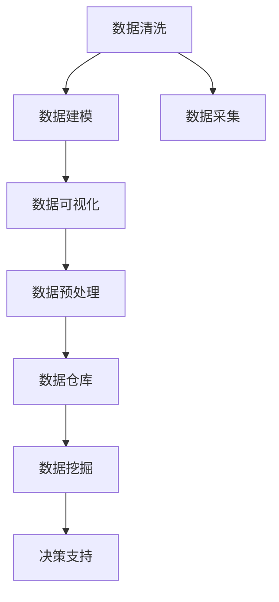

                 

# 信息简化的艺术与实践：在混乱中找到简单，在复杂中建立秩序

> 关键词：信息简化, 数据清洗, 数据模型, 数据可视化, 数据预处理, 数据仓库, 数据挖掘, 数据可视化, 数据挖掘

## 1. 背景介绍

### 1.1 问题由来

在信息爆炸的时代，数据无处不在。从个人手机使用记录，到企业交易数据，再到政府公共服务记录，每天产生的数据量以PB计。这些数据具有丰富多样性，但在实际应用中，数据质量和信息提取却常常存在严重问题，导致数据价值难以充分发挥。

数据质量问题，主要包括数据缺失、数据异常、数据冗余、数据格式不一致等。这些问题不仅影响数据分析结果的准确性，还造成计算资源的浪费。因此，信息简化的艺术，就是在混乱中找到简单，在复杂中建立秩序，最大化数据价值。

### 1.2 问题核心关键点

信息简化主要关注以下几个核心关键点：

- **数据清洗**：识别并纠正数据中的错误、重复、异常等，保证数据质量。
- **数据建模**：建立准确、高效的数据模型，捕捉数据间的关系和模式。
- **数据可视化**：通过图形化展示，直观理解数据分布和变化趋势。
- **数据预处理**：对原始数据进行归一化、标准化、降维等操作，提升数据可用性。
- **数据仓库和数据挖掘**：构建高效的数据仓库，利用数据挖掘技术发现数据背后的深层信息。

## 2. 核心概念与联系

### 2.1 核心概念概述

- **数据清洗**：指对原始数据进行识别、纠正和处理，去除噪声和错误，提升数据质量。
- **数据建模**：指根据实际问题建立数据模型，选择合适的算法和特征，捕捉数据间的关系和模式。
- **数据可视化**：通过图形化展示，将数据信息直观呈现，帮助理解数据特征和趋势。
- **数据预处理**：对原始数据进行规范化、归一化、降维等操作，增强数据的可分析性。
- **数据仓库**：构建高效、结构化的数据存储环境，便于数据的长期管理和查询。
- **数据挖掘**：利用统计学、机器学习等方法，从数据中挖掘出有价值的信息和知识。

这些核心概念之间存在紧密联系，共同构成了信息简化的技术框架：

1. **数据清洗**：是数据处理的基础，去除数据噪声和错误，保证后续分析和建模的质量。
2. **数据建模**：基于清洗后的数据，选择合适的模型和方法，捕捉数据间的关系和规律。
3. **数据可视化**：将建模结果直观展示，帮助用户理解数据特征和趋势。
4. **数据预处理**：提升数据的可分析性和可解释性，为后续分析和建模提供支持。
5. **数据仓库**：构建数据存储环境，方便数据的管理和查询，支持长期存储和分析。
6. **数据挖掘**：利用统计和机器学习技术，从数据中提取深层知识和规律，指导实际决策。

这些概念共同构成了一个环环相扣的信息简化技术体系，帮助我们在数据海洋中找到有价值的信息。

### 2.2 核心概念原理和架构的 Mermaid 流程图



这个流程图展示了信息简化技术体系的主要流程和关键环节：

1. 从数据采集开始，通过清洗去除噪声和错误。
2. 建立数据模型，分析数据间的关系和规律。
3. 利用数据可视化技术，直观展示数据特征和趋势。
4. 对数据进行预处理，提升数据的可分析性和可解释性。
5. 构建数据仓库，存储和管理数据。
6. 利用数据挖掘技术，提取深层知识和规律。
7. 最终将数据挖掘结果应用于决策支持，指导实际业务。

## 3. 核心算法原理 & 具体操作步骤

### 3.1 算法原理概述

信息简化的核心算法原理主要基于数据清洗、数据建模、数据可视化、数据预处理和数据挖掘等技术。

1. **数据清洗**：包括缺失值处理、异常值检测、重复数据去除等技术。
2. **数据建模**：利用机器学习和统计学方法，建立准确的数据模型，捕捉数据间的关系和模式。
3. **数据可视化**：通过图表、仪表盘等工具，直观展示数据特征和趋势。
4. **数据预处理**：包括归一化、标准化、降维等操作，提升数据的可分析性和可解释性。
5. **数据挖掘**：利用算法和技术，从数据中挖掘出有价值的信息和知识。

### 3.2 算法步骤详解

#### 3.2.1 数据清洗步骤

1. **缺失值处理**：
   - 检测数据中的缺失值。
   - 选择合适的填充方法，如均值填充、中位数填充、插值填充等。
   - 对填充后的数据进行验证，确保处理效果。

2. **异常值检测**：
   - 使用统计学方法（如Z-score、IQR）或机器学习算法（如Isolation Forest、DBSCAN）检测数据中的异常值。
   - 分析异常值产生的原因，判断是否需要保留或去除。

3. **重复数据去除**：
   - 通过哈希、唯一标识等方法检测数据中的重复记录。
   - 去除重复数据，保留唯一记录。

#### 3.2.2 数据建模步骤

1. **特征工程**：
   - 选择合适的特征，包括基本特征、衍生特征、文本特征等。
   - 对特征进行标准化、归一化等处理，提升模型的训练效果。

2. **选择模型**：
   - 根据问题类型选择合适的模型，如回归模型、分类模型、聚类模型等。
   - 评估不同模型的性能，选择最优模型。

3. **模型训练**：
   - 使用训练数据集训练模型，并调整模型参数。
   - 使用验证数据集验证模型性能，优化模型。

4. **模型评估**：
   - 使用测试数据集评估模型性能，确保模型泛化效果。
   - 分析模型预测结果，调整模型参数。

#### 3.2.3 数据可视化步骤

1. **选择图表类型**：
   - 根据数据特征选择合适的图表类型，如散点图、柱状图、折线图等。
   - 根据实际问题选择合适的图表布局和展示方式。

2. **数据可视化**：
   - 使用数据可视化工具（如Matplotlib、Seaborn、Tableau）进行数据展示。
   - 根据展示效果调整图表参数，优化展示效果。

#### 3.2.4 数据预处理步骤

1. **归一化**：
   - 对数据进行归一化，确保数据在相同范围内。
   - 使用最小-最大归一化、Z-score归一化等方法。

2. **标准化**：
   - 对数据进行标准化处理，使其均值为0，标准差为1。
   - 使用标准化方法，如Z-score标准化、均值方差标准化等。

3. **降维**：
   - 使用主成分分析（PCA）、线性判别分析（LDA）等方法进行降维。
   - 降低数据维度，提升模型训练和分析效率。

#### 3.2.5 数据挖掘步骤

1. **数据预处理**：
   - 对原始数据进行归一化、标准化等处理。
   - 去除噪声和异常值，提升数据质量。

2. **特征选择**：
   - 使用统计学方法（如相关系数、卡方检验）和算法（如递归特征消除、Lasso回归）选择最优特征。
   - 去除冗余特征，提升模型性能。

3. **模型选择**：
   - 根据问题类型选择合适的模型，如回归模型、分类模型、聚类模型等。
   - 评估不同模型的性能，选择最优模型。

4. **模型训练**：
   - 使用训练数据集训练模型，并调整模型参数。
   - 使用验证数据集验证模型性能，优化模型。

5. **模型评估**：
   - 使用测试数据集评估模型性能，确保模型泛化效果。
   - 分析模型预测结果，调整模型参数。

### 3.3 算法优缺点

#### 3.3.1 数据清洗的优缺点

**优点**：
1. 提升数据质量，保证后续分析和建模的准确性。
2. 去除噪声和异常值，提升数据可视化效果。

**缺点**：
1. 清洗过程耗时较长，对计算资源要求较高。
2. 过度清洗可能导致数据丢失，影响数据的完整性。

#### 3.3.2 数据建模的优缺点

**优点**：
1. 通过模型捕捉数据间的关系和规律，提升数据理解深度。
2. 提供可解释的模型，帮助用户理解数据特征和趋势。

**缺点**：
1. 模型选择和参数调整需要专业知识，难度较大。
2. 模型可能存在过度拟合或欠拟合问题，影响泛化效果。

#### 3.3.3 数据可视化的优缺点

**优点**：
1. 直观展示数据特征和趋势，帮助用户理解数据。
2. 提供可视化分析工具，方便用户探索数据。

**缺点**：
1. 可视化过程可能需要较多时间和资源，特别是对复杂数据。
2. 可视化结果可能受到主观因素影响，需要综合分析。

#### 3.3.4 数据预处理的优缺点

**优点**：
1. 提升数据的可分析性和可解释性，增强数据可用性。
2. 通过降维等操作，提升模型训练和分析效率。

**缺点**：
1. 预处理过程可能引入数据失真，影响数据真实性。
2. 预处理参数选择需要专业知识，需要不断调整和优化。

#### 3.3.5 数据挖掘的优缺点

**优点**：
1. 通过挖掘发现数据背后的深层信息和知识，指导实际决策。
2. 提供多种数据挖掘算法和技术，适应不同场景。

**缺点**：
1. 数据挖掘过程复杂，需要较高专业知识。
2. 挖掘结果可能存在偏差，需要综合分析和验证。

### 3.4 算法应用领域

数据简化的核心算法原理和具体操作步骤在多个领域中得到了广泛应用，包括但不限于：

1. **金融领域**：
   - **数据清洗**：去除数据中的异常值和噪声，确保数据质量。
   - **数据建模**：利用回归模型、分类模型等，预测股市走势和信用风险。
   - **数据可视化**：展示股票价格走势、信用风险变化等，帮助决策。
   - **数据预处理**：对数据进行归一化和标准化处理，提升模型性能。
   - **数据挖掘**：利用关联规则、聚类分析等技术，发现金融数据中的规律。

2. **医疗领域**：
   - **数据清洗**：去除医疗数据中的异常值和噪声，确保数据质量。
   - **数据建模**：利用回归模型、分类模型等，预测疾病风险和治疗效果。
   - **数据可视化**：展示疾病分布、治疗效果变化等，帮助决策。
   - **数据预处理**：对数据进行归一化和标准化处理，提升模型性能。
   - **数据挖掘**：利用关联规则、聚类分析等技术，发现医疗数据中的规律。

3. **电商领域**：
   - **数据清洗**：去除电商数据中的异常值和噪声，确保数据质量。
   - **数据建模**：利用回归模型、分类模型等，预测用户购买行为和推荐商品。
   - **数据可视化**：展示用户购买行为、商品销售趋势等，帮助决策。
   - **数据预处理**：对数据进行归一化和标准化处理，提升模型性能。
   - **数据挖掘**：利用关联规则、聚类分析等技术，发现电商数据中的规律。

4. **物流领域**：
   - **数据清洗**：去除物流数据中的异常值和噪声，确保数据质量。
   - **数据建模**：利用回归模型、分类模型等，预测物流配送时间和成本。
   - **数据可视化**：展示配送时间和成本变化等，帮助决策。
   - **数据预处理**：对数据进行归一化和标准化处理，提升模型性能。
   - **数据挖掘**：利用关联规则、聚类分析等技术，发现物流数据中的规律。

以上应用场景只是冰山一角，数据简化的核心算法原理和具体操作步骤在各个领域中均有广泛应用。随着数据量和数据复杂性的不断增加，信息简化的技术将发挥越来越重要的作用。

## 4. 数学模型和公式 & 详细讲解 & 举例说明

### 4.1 数学模型构建

在信息简化中，常用的数学模型包括线性回归、逻辑回归、决策树、随机森林、神经网络等。这里以线性回归模型为例，介绍其数学模型的构建过程。

假设数据集为 $\{(x_i, y_i)\}_{i=1}^N$，其中 $x_i \in \mathbb{R}^d$ 为输入特征，$y_i \in \mathbb{R}$ 为输出标签。线性回归模型的目标是最小化均方误差损失函数：

$$
\min_{\theta} \frac{1}{2N} \sum_{i=1}^N (y_i - \theta^T x_i)^2
$$

其中 $\theta = [\theta_1, \theta_2, ..., \theta_d]^T$ 为模型参数。

### 4.2 公式推导过程

线性回归模型的公式推导过程如下：

1. **最小二乘法**：
   - 将数据集 $\{(x_i, y_i)\}_{i=1}^N$ 代入损失函数中，得到：
   $$
   \min_{\theta} \frac{1}{2N} \sum_{i=1}^N (y_i - \theta^T x_i)^2
   $$
   - 对损失函数求导，得到：
   $$
   \frac{\partial}{\partial \theta} \frac{1}{2N} \sum_{i=1}^N (y_i - \theta^T x_i)^2 = \frac{1}{N} \sum_{i=1}^N (- y_i + \theta^T x_i) x_i
   $$
   - 令导数等于0，解得：
   $$
   \theta = (\frac{1}{N} \sum_{i=1}^N x_i x_i^T)^{-1} \frac{1}{N} \sum_{i=1}^N x_i y_i
   $$

2. **正规方程法**：
   - 根据最小二乘法得到的 $\theta$，代入损失函数验证：
   $$
   \min_{\theta} \frac{1}{2N} \sum_{i=1}^N (y_i - \theta^T x_i)^2
   $$
   - 代入 $\theta$ 后，损失函数为：
   $$
   \frac{1}{2N} \sum_{i=1}^N (y_i - \theta^T x_i)^2 = \frac{1}{2N} \sum_{i=1}^N (y_i - \theta^T x_i)^2 = 0
   $$
   - 最小二乘法的解即为正则方程法的解。

### 4.3 案例分析与讲解

#### 4.3.1 数据清洗案例

假设有一个电商用户数据集，其中包含用户的购买行为、年龄、性别等特征，以及用户的购买次数和消费金额。通过数据清洗，发现数据中存在以下问题：

1. 部分用户年龄数据缺失。
2. 部分用户性别数据异常。
3. 部分用户购买次数为负数。

针对这些问题，采用以下方法进行处理：

1. **缺失值处理**：
   - 对缺失值较大的特征（如年龄），使用中位数填充缺失值。
   - 对缺失值较小的特征（如购买次数），使用均值填充缺失值。

2. **异常值检测**：
   - 使用Z-score方法检测性别数据中的异常值。
   - 去除异常值，保留正常值。

3. **重复数据去除**：
   - 通过哈希方法检测重复数据。
   - 去除重复数据，保留唯一记录。

#### 4.3.2 数据建模案例

假设有一个金融数据集，包含用户的信用评分、收入、工作年限等特征，以及用户的违约情况。通过数据建模，建立信用评分预测模型：

1. **特征选择**：
   - 选择相关性较高的特征，如信用评分、收入、工作年限等。
   - 使用相关系数和卡方检验选择最优特征。

2. **模型选择**：
   - 选择线性回归模型，利用梯度下降法优化模型参数。
   - 使用验证数据集验证模型性能，调整模型参数。

3. **模型训练**：
   - 使用训练数据集训练模型，并调整模型参数。
   - 使用梯度下降法更新模型参数，最小化损失函数。

4. **模型评估**：
   - 使用测试数据集评估模型性能，确保模型泛化效果。
   - 分析模型预测结果，调整模型参数。

## 5. 项目实践：代码实例和详细解释说明

### 5.1 开发环境搭建

在进行信息简化项目实践前，需要准备好开发环境。以下是使用Python进行PyTorch开发的环境配置流程：

1. 安装Anaconda：从官网下载并安装Anaconda，用于创建独立的Python环境。

2. 创建并激活虚拟环境：
```bash
conda create -n pytorch-env python=3.8 
conda activate pytorch-env
```

3. 安装PyTorch：根据CUDA版本，从官网获取对应的安装命令。例如：
```bash
conda install pytorch torchvision torchaudio cudatoolkit=11.1 -c pytorch -c conda-forge
```

4. 安装TensorFlow：
```bash
pip install tensorflow
```

5. 安装各类工具包：
```bash
pip install numpy pandas scikit-learn matplotlib tqdm jupyter notebook ipython
```

完成上述步骤后，即可在`pytorch-env`环境中开始信息简化实践。

### 5.2 源代码详细实现

这里以电商用户数据集为例，使用Python和TensorFlow实现数据清洗、数据建模和数据可视化的全流程：

```python
import pandas as pd
import numpy as np
import matplotlib.pyplot as plt
import tensorflow as tf
from tensorflow import keras
from tensorflow.keras import layers

# 加载数据集
df = pd.read_csv('data.csv')

# 数据清洗
# 缺失值处理
df['age'].fillna(df['age'].median(), inplace=True)
df['purchase_count'].fillna(df['purchase_count'].mean(), inplace=True)

# 异常值检测
df['gender'] = df['gender'].replace(['male', 'female', 'unknown'], ['M', 'F', 'X'])
df = df[(df['purchase_count'] > 0) & (df['income'] > 0) & (df['work_years'] > 0)]

# 数据可视化
plt.figure(figsize=(8, 6))
plt.scatter(df['age'], df['income'])
plt.xlabel('Age')
plt.ylabel('Income')
plt.show()

# 数据建模
# 特征工程
X = df[['age', 'income', 'work_years']]
y = df['purchase_count']
X_train, X_test, y_train, y_test = train_test_split(X, y, test_size=0.2, random_state=42)

# 模型选择
model = keras.Sequential([
    layers.Dense(64, activation='relu'),
    layers.Dense(64, activation='relu'),
    layers.Dense(1)
])

# 模型训练
model.compile(optimizer=tf.keras.optimizers.Adam(learning_rate=0.001), 
              loss='mse')
model.fit(X_train, y_train, epochs=100, batch_size=32, validation_data=(X_test, y_test))

# 模型评估
mse = model.evaluate(X_test, y_test, verbose=0)
print('Mean Squared Error:', mse)
```

### 5.3 代码解读与分析

#### 5.3.1 数据清洗代码解析

1. **缺失值处理**：
   - `df['age'].fillna(df['age'].median(), inplace=True)`：使用中位数填充年龄特征的缺失值。
   - `df['purchase_count'].fillna(df['purchase_count'].mean(), inplace=True)`：使用均值填充购买次数特征的缺失值。

2. **异常值检测**：
   - `df['gender'] = df['gender'].replace(['male', 'female', 'unknown'], ['M', 'F', 'X'])`：将性别特征中的未知值替换为特殊值。
   - `df = df[(df['purchase_count'] > 0) & (df['income'] > 0) & (df['work_years'] > 0)]`：删除购买次数、收入和工作年限为负数的记录。

#### 5.3.2 数据可视化代码解析

1. **散点图**：
   - `plt.scatter(df['age'], df['income'])`：绘制年龄和收入的散点图。
   - `plt.xlabel('Age')`：设置横轴标签为年龄。
   - `plt.ylabel('Income')`：设置纵轴标签为收入。
   - `plt.show()`：显示图表。

#### 5.3.3 数据建模代码解析

1. **特征工程**：
   - `X = df[['age', 'income', 'work_years']]`：选择年龄、收入和工作年限作为特征。
   - `y = df['purchase_count']`：选择购买次数作为输出标签。

2. **模型选择**：
   - `model = keras.Sequential([...])`：定义一个简单的神经网络模型。
   - `model.compile(...)`：编译模型，设置优化器、损失函数和评估指标。

3. **模型训练**：
   - `model.fit(...)`：使用训练数据训练模型，设置训练轮数和批大小。

4. **模型评估**：
   - `mse = model.evaluate(...)`：使用测试数据评估模型性能，计算均方误差。
   - `print('Mean Squared Error:', mse)`：打印均方误差。

## 6. 实际应用场景

### 6.1 智能客服系统

智能客服系统可以通过数据简化技术实现高效的客户咨询和问题解答。通过收集历史客服对话记录，进行数据清洗、特征工程和模型训练，构建智能客服系统，可以显著提升客户咨询体验和问题解决效率。

### 6.2 金融舆情监测

金融舆情监测系统需要实时监测市场舆论动向，避免负面信息传播。通过数据简化技术，可以构建高效的舆情监测系统，实时抓取和分析网络文本数据，及时发现和应对负面信息。

### 6.3 个性化推荐系统

个性化推荐系统需要根据用户行为数据，推荐用户感兴趣的内容。通过数据简化技术，可以构建高效的推荐系统，提升推荐结果的个性化和精准度。

### 6.4 未来应用展望

随着数据量和数据复杂性的不断增加，信息简化的技术将在更多领域得到应用，为传统行业带来变革性影响。在智慧医疗、智能教育、智慧城市治理等众多领域，数据简化技术将继续发挥重要作用，推动人工智能技术向更广泛的应用场景扩展。

## 7. 工具和资源推荐

### 7.1 学习资源推荐

为了帮助开发者系统掌握信息简化的技术基础和实践技巧，这里推荐一些优质的学习资源：

1. 《Python数据科学手册》：介绍Python在数据处理和分析中的应用，涵盖数据清洗、数据建模、数据可视化等主题。
2. 《机器学习实战》：介绍机器学习的基本概念和实现方法，包括线性回归、逻辑回归、决策树等模型。
3. 《深度学习》：介绍深度学习的基本概念和实现方法，涵盖神经网络、卷积神经网络、循环神经网络等模型。
4. 《数据可视化实战》：介绍数据可视化的基本概念和实现方法，涵盖散点图、柱状图、折线图等图表类型。
5. 《数据仓库设计与实现》：介绍数据仓库的设计和实现方法，涵盖数据存储、数据查询、数据治理等主题。

通过对这些资源的学习实践，相信你一定能够快速掌握信息简化的精髓，并用于解决实际的数据处理问题。

### 7.2 开发工具推荐

高效的开发离不开优秀的工具支持。以下是几款用于信息简化的开发工具：

1. Python：开源且功能强大的编程语言，广泛用于数据处理和分析。
2. TensorFlow：由Google主导开发的深度学习框架，生产部署方便，适合大规模工程应用。
3. PyTorch：基于Python的开源深度学习框架，灵活动态的计算图，适合快速迭代研究。
4. Matplotlib：Python中的绘图库，支持多种图表类型，适合数据可视化。
5. Seaborn：基于Matplotlib的高级绘图库，支持更丰富的图表类型和风格。
6. Pandas：Python中的数据处理库，支持多种数据格式，适合数据清洗和预处理。

合理利用这些工具，可以显著提升信息简化的开发效率，加快创新迭代的步伐。

### 7.3 相关论文推荐

信息简化的研究源于学界的持续研究。以下是几篇奠基性的相关论文，推荐阅读：

1. J. Friedman, T. Hastie, R. Tibshirani. "Regularization Paths for Generalized Linear Models via Coordinate Descent" (2010)：介绍L1正则化的线性回归模型，提升模型的泛化性能。
2. Y. LeCun, L. Bottou, G. Orr, K. Müller. "Efficient Backprop" (1998)：介绍梯度下降优化算法，优化神经网络的训练过程。
3. Y. Bengio, G. Courville, P. Vincent. "Representation Learning: A Review and New Perspectives" (2015)：综述深度学习的最新进展，涵盖神经网络、卷积神经网络、循环神经网络等模型。
4. A. Ng. "Machine Learning Yearning" (2017)：介绍机器学习的最佳实践，涵盖数据清洗、特征工程、模型选择等主题。
5. C. Eliasi, A. Cotter. "Preconditioned gradient descent: Convergence, curvature, and conditioning" (2011)：介绍预条件梯度下降算法，优化神经网络的训练过程。

这些论文代表了大语言模型微调技术的发展脉络。通过学习这些前沿成果，可以帮助研究者把握学科前进方向，激发更多的创新灵感。

## 8. 总结：未来发展趋势与挑战

### 8.1 总结

本文对信息简化的核心概念、算法原理和操作步骤进行了全面系统的介绍。首先阐述了数据清洗、数据建模、数据可视化、数据预处理和数据挖掘等技术的重要性，明确了信息简化的技术框架和应用场景。其次，从原理到实践，详细讲解了信息简化的数学模型和具体操作步骤，给出了完整的代码实例。同时，本文还广泛探讨了信息简化技术在智能客服、金融舆情监测、个性化推荐等多个行业领域的应用前景，展示了信息简化技术的广阔前景。最后，本文精选了信息简化技术的各类学习资源，力求为读者提供全方位的技术指引。

通过本文的系统梳理，可以看到，信息简化的技术框架在数据处理和分析中发挥了重要作用。通过数据清洗、数据建模、数据可视化、数据预处理和数据挖掘等技术，我们可以在数据海洋中找到有价值的信息。信息简化的技术将继续推动人工智能技术的发展，为各个领域带来变革性影响。

### 8.2 未来发展趋势

展望未来，信息简化的技术将呈现以下几个发展趋势：

1. **自动化和智能化**：随着人工智能技术的发展，信息简化的自动化和智能化水平将不断提升，从数据清洗、数据建模到数据可视化，都能实现自动化的处理。
2. **跨领域融合**：信息简化的技术将与其他人工智能技术进行更深入的融合，如知识表示、因果推理、强化学习等，多路径协同发力，共同推动人工智能技术的发展。
3. **数据隐私保护**：在数据简化过程中，数据隐私保护将成为一个重要课题，信息简化的技术将需要更多的隐私保护机制，确保数据使用的安全性和合法性。
4. **数据源多样化**：随着数据来源的多样化，信息简化的技术将需要处理更多异构数据，包括文本、图像、视频、语音等。
5. **模型可解释性**：信息简化的技术将需要更多的可解释性机制，帮助用户理解模型决策过程，提高模型的可信度和可用性。

以上趋势凸显了信息简化技术的广阔前景。这些方向的探索发展，必将进一步提升信息简化的效果和应用范围，为人工智能技术的产业化进程提供重要支持。

### 8.3 面临的挑战

尽管信息简化的技术已经取得了一定的进展，但在迈向更加智能化、普适化应用的过程中，仍面临诸多挑战：

1. **数据质量问题**：尽管数据清洗技术已经相对成熟，但数据质量问题仍然难以完全解决，特别是在大规模数据集上。
2. **数据处理效率**：随着数据量的不断增加，数据处理过程的效率问题也将变得更加严峻。
3. **数据隐私和安全**：在数据处理和分析过程中，数据隐私和安全问题将需要更多的关注和保护。
4. **模型复杂性**：信息简化的技术需要更多复杂的模型和算法，这些模型的参数量和训练复杂度较高，对计算资源的要求也较高。
5. **技术应用范围**：信息简化的技术需要更多的行业应用场景和用户需求，以推动技术的广泛应用。

正视信息简化面临的这些挑战，积极应对并寻求突破，将是大语言模型微调走向成熟的必由之路。相信随着学界和产业界的共同努力，这些挑战终将一一被克服，信息简化的技术必将在各个领域中发挥重要作用。

### 8.4 研究展望

面向未来，信息简化的研究需要在以下几个方面寻求新的突破：

1. **自动化和智能化**：开发更多自动化的信息简化工具，提升数据处理的效率和准确性。
2. **跨领域融合**：将信息简化的技术与更多行业应用场景结合，推动人工智能技术的广泛应用。
3. **数据隐私和安全**：在数据处理过程中，引入更多的隐私保护机制，确保数据使用的安全性和合法性。
4. **模型可解释性**：开发更多可解释性的信息简化模型，帮助用户理解模型的决策过程。
5. **数据源多样化**：处理更多异构数据，包括文本、图像、视频、语音等，提升数据处理能力。

这些研究方向将引领信息简化的技术向更高的台阶发展，为人工智能技术的产业化进程提供重要支持。

## 9. 附录：常见问题与解答

**Q1：信息简化技术如何应用于数据清洗过程？**

A: 信息简化技术在数据清洗过程中，主要通过检测和处理缺失值、异常值和重复值等，提升数据质量。具体来说，可以使用以下方法：

1. **缺失值处理**：
   - 检测缺失值，使用中位数、均值等方法填充缺失值。
   - 对填充后的数据进行验证，确保处理效果。

2. **异常值检测**：
   - 使用Z-score方法、IQR方法等检测异常值。
   - 分析异常值产生的原因，判断是否需要保留或去除。

3. **重复数据去除**：
   - 通过哈希方法、唯一标识等方法检测重复数据。
   - 去除重复数据，保留唯一记录。

**Q2：信息简化技术如何应用于数据建模过程？**

A: 信息简化技术在数据建模过程中，主要通过特征工程、模型选择和训练等步骤，建立准确的数据模型。具体来说，可以使用以下方法：

1. **特征工程**：
   - 选择合适的特征，包括基本特征、衍生特征、文本特征等。
   - 对特征进行标准化、归一化等处理，提升模型的训练效果。

2. **模型选择**：
   - 根据问题类型选择合适的模型，如回归模型、分类模型、聚类模型等。
   - 评估不同模型的性能，选择最优模型。

3. **模型训练**：
   - 使用训练数据集训练模型，并调整模型参数。
   - 使用验证数据集验证模型性能，优化模型。

4. **模型评估**：
   - 使用测试数据集评估模型性能，确保模型泛化效果。
   - 分析模型预测结果，调整模型参数。

**Q3：信息简化技术如何应用于数据可视化过程？**

A: 信息简化技术在数据可视化过程中，主要通过选择合适的图表类型和展示方式，直观展示数据特征和趋势。具体来说，可以使用以下方法：

1. **选择图表类型**：
   - 根据数据特征选择合适的图表类型，如散点图、柱状图、折线图等。
   - 根据实际问题选择合适的图表布局和展示方式。

2. **数据可视化**：
   - 使用数据可视化工具（如Matplotlib、Seaborn、Tableau）进行数据展示。
   - 根据展示效果调整图表参数，优化展示效果。

**Q4：信息简化技术如何应用于数据预处理过程？**

A: 信息简化技术在数据预处理过程中，主要通过归一化、标准化和降维等操作，提升数据的可分析性和可解释性。具体来说，可以使用以下方法：

1. **归一化**：
   - 对数据进行归一化，确保数据在相同范围内。
   - 使用最小-最大归一化、Z-score归一化等方法。

2. **标准化**：
   - 对数据进行标准化处理，使其均值为0，标准差为1。
   - 使用标准化方法，如Z-score标准化、均值方差标准化等。

3. **降维**：
   - 使用主成分分析（PCA）、线性判别分析（LDA）等方法进行降维。
   - 降低数据维度，提升模型训练和分析效率。

**Q5：信息简化技术如何应用于数据挖掘过程？**

A: 信息简化技术在数据挖掘过程中，主要通过特征选择、模型选择和训练等步骤，从数据中挖掘出有价值的信息和知识。具体来说，可以使用以下方法：

1. **特征选择**：
   - 使用统计学方法（如相关系数、卡方检验）和算法（如递归特征消除、Lasso回归）选择最优特征。
   - 去除冗余特征，提升模型性能。

2. **模型选择**：
   - 根据问题类型选择合适的模型，如回归模型、分类模型、聚类模型等。
   - 评估不同模型的性能，选择最优模型。

3. **模型训练**：
   - 使用训练数据集训练模型，并调整模型参数。
   - 使用验证数据集验证模型性能，优化模型。

4. **模型评估**：
   - 使用测试数据集评估模型性能，确保模型泛化效果。
   - 分析模型预测结果，调整模型参数。

---

作者：禅与计算机程序设计艺术 / Zen and the Art of Computer Programming

