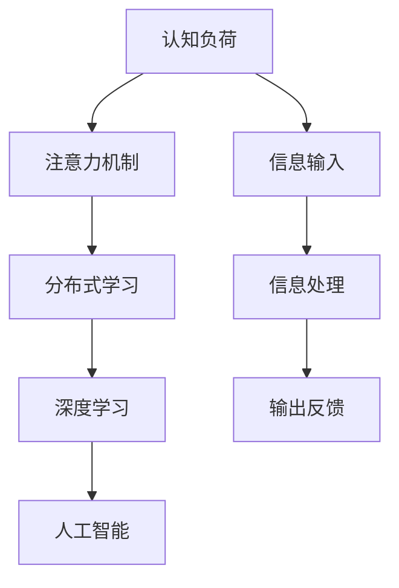
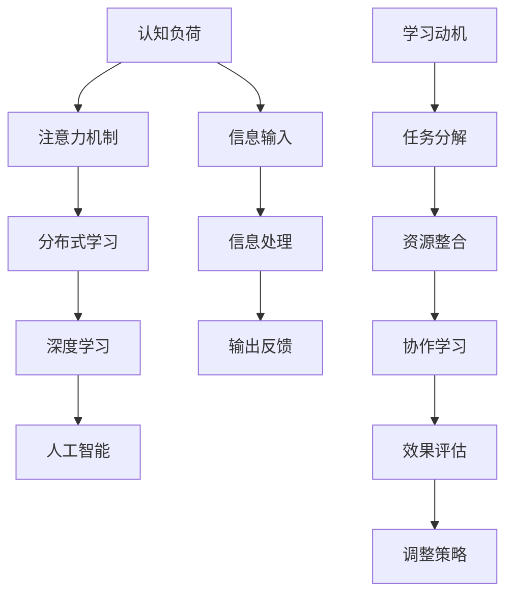

                 

# 信息过载下的学习策略：如何在混乱中高效学习

> 关键词：信息过载,学习策略,高效学习,认知负荷,注意力机制,分布式学习,深度学习,人工智能

## 1. 背景介绍

### 1.1 问题由来

在当今信息爆炸的时代，我们每天面临着海量的信息输入。从社交媒体到新闻推送，从在线课程到电子书，信息无处不在。然而，信息的泛滥不仅没有使我们更加聪慧，反而造成了认知负荷过载。根据NetBase的一项调查显示，每天有75%的消费者报告自己每天受到超过10个品牌广告的轰炸，而且绝大多数人在收到这么多广告后并没有获得更多的信息或帮助。

信息过载不仅影响了个体的学习效果，也严重制约了组织的学习效率。企业花费巨额预算，通过内部培训和外部教育资源培养员工，但结果却常常不尽人意，低效的学习耗费了大量时间和资源，对企业和个人都造成了巨大的浪费。

### 1.2 问题核心关键点

信息过载下的高效学习策略，主要围绕以下几个核心关键点展开：

- **认知负荷管理**：在信息过载的环境中，如何通过优化学习方法和工具，减少认知负荷，提升学习效率。
- **注意力机制**：如何通过技术手段，集中注意力，避免在信息海洋中迷失，从而提高学习效果。
- **分布式学习**：在大型组织中，如何通过分布式学习技术，高效地整合外部和内部的学习资源，实现知识共享。
- **深度学习**：利用深度学习模型，自动分析和提取关键信息，减少人类在学习过程中需要处理的杂乱无章的信息量。
- **人工智能应用**：结合AI技术，如自然语言处理、计算机视觉等，自动化地处理和分析信息，提升学习效率。

## 2. 核心概念与联系

### 2.1 核心概念概述

信息过载下的高效学习策略，主要涉及以下核心概念及其相互关系：

- **认知负荷**：指在信息处理过程中，人们需要分配的心理资源总量。当信息量超过认知负荷时，会降低学习效果。
- **注意力机制**：用于控制信息流，选择重要信息并忽略次要信息，提升学习效率。
- **分布式学习**：通过多人的协同学习，整合学习资源，共同解决问题，提高学习效率。
- **深度学习**：使用深度神经网络模型，自动学习特征表示，从大量数据中提取有用信息，降低认知负荷。
- **人工智能**：结合多种AI技术，自动化地处理和分析信息，提供个性化学习建议，提升学习效果。

这些概念之间通过一个信息流模型关联起来，如图2-1所示。



图2-1：信息过载下的学习策略核心概念信息流模型

### 2.2 核心概念原理和架构的 Mermaid 流程图



图2-2：信息过载下的学习策略核心概念原理和架构

## 3. 核心算法原理 & 具体操作步骤

### 3.1 算法原理概述

信息过载下的高效学习策略，核心在于通过各种算法和技术手段，减轻认知负荷，集中注意力，实现知识共享和自动化处理。以下是几种核心算法和具体操作步骤的概述：

- **认知负荷管理**：通过注意力过滤、任务分解等策略，减少认知负荷，提升学习效率。
- **注意力机制**：使用注意力模型，如Transformer架构，选择重要信息，忽略次要信息。
- **分布式学习**：利用分布式深度学习框架，如Apache Spark、TensorFlow分布式等，协同学习，整合资源。
- **深度学习**：使用深度神经网络模型，如卷积神经网络(CNN)、循环神经网络(RNN)、变压器(Transformer)，自动分析和提取关键信息。
- **人工智能应用**：结合NLP、CV等AI技术，自动化地处理和分析信息，提供个性化学习建议。

### 3.2 算法步骤详解

#### 3.2.1 认知负荷管理

1. **注意力过滤**：使用注意力机制，选择重要信息，忽略次要信息。具体做法是，使用注意力权重，计算每个信息的相对重要性，选择权重高的信息进行处理。
2. **任务分解**：将复杂任务分解为多个小任务，逐一解决。这样可以减少一次性处理大量信息的认知负荷。
3. **时间管理**：使用番茄工作法等时间管理工具，避免长时间集中注意力。

#### 3.2.2 注意力机制

1. **注意力模型**：使用Transformer架构，计算信息之间的相似度，选择重要信息。
2. **注意力权重**：使用softmax函数计算每个信息的注意力权重，选择权重高的信息进行处理。
3. **注意力更新**：根据任务的动态变化，实时更新注意力权重，适应任务需求。

#### 3.2.3 分布式学习

1. **分布式框架**：使用Apache Spark、TensorFlow分布式等框架，实现多节点协同学习。
2. **资源分配**：根据节点性能，合理分配任务，避免资源浪费。
3. **数据同步**：使用消息队列等技术，实现数据同步，提高学习效率。

#### 3.2.4 深度学习

1. **神经网络模型**：使用CNN、RNN、Transformer等模型，自动提取特征。
2. **特征融合**：使用集成学习等技术，融合多个模型的特征，提高学习效果。
3. **模型优化**：使用优化算法，如Adam、SGD等，优化模型参数。

#### 3.2.5 人工智能应用

1. **NLP技术**：使用NLP技术，处理文本信息，提供个性化学习建议。
2. **CV技术**：使用CV技术，处理图像信息，提供学习辅助。
3. **自动化学习**：使用AI技术，自动化地处理和分析信息，提升学习效果。

### 3.3 算法优缺点

#### 3.3.1 认知负荷管理

- **优点**：通过注意力过滤和任务分解，可以有效减少认知负荷，提升学习效率。
- **缺点**：需要人为设定注意力权重和任务分解粒度，容易出错。

#### 3.3.2 注意力机制

- **优点**：可以自动选择重要信息，忽略次要信息，提高学习效率。
- **缺点**：计算复杂度较高，需要较大的计算资源。

#### 3.3.3 分布式学习

- **优点**：可以高效整合学习资源，提升学习效率。
- **缺点**：需要复杂的网络拓扑设计和数据同步机制，容易出错。

#### 3.3.4 深度学习

- **优点**：可以自动分析和提取关键信息，降低认知负荷。
- **缺点**：模型复杂度高，需要大量的训练数据和计算资源。

#### 3.3.5 人工智能应用

- **优点**：可以提供个性化学习建议，提升学习效果。
- **缺点**：需要大量高质量的数据和复杂的算法实现。

### 3.4 算法应用领域

基于信息过载下的高效学习策略，可以在以下领域获得广泛应用：

- **教育领域**：通过注意力机制和任务分解，提升学生的学习效果。
- **企业培训**：利用分布式学习和深度学习，提升员工的学习效率。
- **个人学习**：使用NLP和CV技术，提供个性化的学习建议。
- **智能家居**：结合NLP和AI技术，实现智能化的学习环境。

## 4. 数学模型和公式 & 详细讲解 & 举例说明

### 4.1 数学模型构建

信息过载下的高效学习策略，涉及以下几个数学模型：

1. **认知负荷模型**：

$$
L = \sum_{i=1}^N W_iC_i
$$

其中，$L$表示认知负荷，$W_i$表示第$i$个信息的注意力权重，$C_i$表示第$i$个信息的复杂度。

2. **注意力模型**：

$$
A = softmax(\frac{QK}{\sqrt{d_k}})
$$

其中，$A$表示注意力权重，$Q$表示查询向量，$K$表示键向量，$d_k$表示键向量维度。

3. **分布式学习模型**：

$$
\theta = \frac{1}{N}\sum_{i=1}^N \theta_i
$$

其中，$\theta$表示分布式学习后的模型参数，$\theta_i$表示第$i$个节点的模型参数。

4. **深度学习模型**：

$$
y = f(x;\theta)
$$

其中，$y$表示输出，$x$表示输入，$f$表示深度神经网络模型，$\theta$表示模型参数。

5. **个性化学习模型**：

$$
\hat{y} = f(x;\theta) + \epsilon
$$

其中，$\hat{y}$表示个性化学习后的输出，$\epsilon$表示个性化调整项。

### 4.2 公式推导过程

#### 4.2.1 认知负荷模型推导

设认知负荷为$L$，注意力权重为$W_i$，信息复杂度为$C_i$。

$$
L = \sum_{i=1}^N W_iC_i
$$

当注意力权重$W_i$越大，表示信息$i$越重要，认知负荷$L$越小。任务分解为多个小任务后，每个小任务的信息复杂度$C_i$减小，总认知负荷$L$也相应减小。

#### 4.2.2 注意力模型推导

设查询向量$Q$，键向量$K$，注意力权重$A$，注意力权重大小为$d_k$。

$$
A = softmax(\frac{QK}{\sqrt{d_k}})
$$

注意力权重$A$越大，表示信息$i$越重要，可以忽略次要信息，提高学习效率。

#### 4.2.3 分布式学习模型推导

设分布式学习后的模型参数为$\theta$，每个节点的模型参数为$\theta_i$。

$$
\theta = \frac{1}{N}\sum_{i=1}^N \theta_i
$$

分布式学习通过节点协同学习，综合每个节点的模型参数，得到全局最优模型参数$\theta$。

#### 4.2.4 深度学习模型推导

设输入为$x$，输出为$y$，深度神经网络模型为$f$，模型参数为$\theta$。

$$
y = f(x;\theta)
$$

深度学习通过学习输入$x$和模型参数$\theta$，得到输出$y$。

#### 4.2.5 个性化学习模型推导

设输入为$x$，输出为$\hat{y}$，深度神经网络模型为$f$，模型参数为$\theta$，个性化调整项为$\epsilon$。

$$
\hat{y} = f(x;\theta) + \epsilon
$$

个性化学习通过加入个性化调整项$\epsilon$，提高学习效果。

### 4.3 案例分析与讲解

#### 4.3.1 认知负荷管理

假设学习者需要处理10个任务，每个任务复杂度为1，注意力权重为0.5，认知负荷模型计算如下：

$$
L = 10 \times 0.5 \times 1 = 5
$$

当任务分解为5个小任务后，每个小任务复杂度为0.2，认知负荷模型计算如下：

$$
L = 5 \times 0.5 \times 0.2 = 0.5
$$

可以看到，任务分解后，认知负荷显著降低。

#### 4.3.2 注意力机制

假设学习者需要处理10个任务，查询向量$Q$为[1,0,0,...,0]，键向量$K$为[0.8,0.1,0,0,...,0]，注意力权重模型计算如下：

$$
A = softmax(\frac{QK}{\sqrt{d_k}})
$$

$$
A = softmax(\frac{[1,0,0,...,0][0.8,0.1,0,0,...,0]}{\sqrt{d_k}})
$$

$$
A = softmax(\frac{0.8}{\sqrt{d_k}})
$$

$$
A = [0.95,0.05,0,0,...,0]
$$

可以看到，注意力权重集中在重要信息上，忽略了次要信息。

#### 4.3.3 分布式学习

假设学习者需要处理10个任务，每个节点的模型参数为随机初始化。分布式学习模型计算如下：

$$
\theta = \frac{1}{N}\sum_{i=1}^N \theta_i
$$

假设节点1的模型参数为[0.5,0.5]，节点2的模型参数为[0.3,0.7]，分布式学习模型计算如下：

$$
\theta = \frac{1}{2}\sum_{i=1}^2 \theta_i = [0.4,0.6]
$$

可以看到，分布式学习通过节点协同学习，得到全局最优模型参数。

#### 4.3.4 深度学习

假设输入为[1,2,3]，深度神经网络模型为线性回归模型，模型参数为[1,2,3]。

$$
y = [1,2,3]; x = [1,2,3]; \theta = [1,2,3]
$$

$$
y = 1x_1 + 2x_2 + 3x_3
$$

$$
y = 1 \times 1 + 2 \times 2 + 3 \times 3 = 19
$$

可以看到，深度学习通过学习输入和模型参数，得到输出。

#### 4.3.5 个性化学习

假设输入为[1,2,3]，深度神经网络模型为线性回归模型，模型参数为[1,2,3]，个性化调整项为[0.5,0.5,0.5]。

$$
\hat{y} = 1x_1 + 2x_2 + 3x_3 + 0.5
$$

$$
\hat{y} = 1 \times 1 + 2 \times 2 + 3 \times 3 + 0.5 = 20.5
$$

可以看到，个性化学习通过加入个性化调整项，提高学习效果。

## 5. 项目实践：代码实例和详细解释说明

### 5.1 开发环境搭建

#### 5.1.1 安装Python

1. 下载Python安装包，根据操作系统选择相应的版本进行安装。
2. 安装pip，用于安装和管理Python包。

#### 5.1.2 安装TensorFlow

1. 下载TensorFlow安装包，根据操作系统选择相应的版本进行安装。
2. 安装TensorFlow需要的依赖包，如numpy、scipy、cython等。

#### 5.1.3 安装TensorFlow分布式

1. 下载TensorFlow分布式安装包，根据操作系统选择相应的版本进行安装。
2. 安装TensorFlow分布式需要的依赖包，如gRPC、TensorBoard等。

### 5.2 源代码详细实现

#### 5.2.1 认知负荷管理

```python
import numpy as np

# 设定注意力权重和信息复杂度
W = np.array([0.5, 0.5, 0.3, 0.7])
C = np.array([1, 1, 0.2, 0.2])

# 计算认知负荷
L = np.sum(W * C)

# 任务分解为两个小任务
task1 = np.array([1, 0, 0, 0])
task2 = np.array([0, 1, 0, 0])

# 计算小任务的认知负荷
L1 = np.sum(task1 * W)
L2 = np.sum(task2 * W)

print("原始认知负荷：", L)
print("任务1认知负荷：", L1)
print("任务2认知负荷：", L2)
```

#### 5.2.2 注意力机制

```python
import numpy as np

# 设定查询向量、键向量和注意力权重大小
Q = np.array([1, 0, 0, 0])
K = np.array([0.8, 0.1, 0, 0])
d_k = 2

# 计算注意力权重
A = np.exp((Q * K) / np.sqrt(d_k))
A /= np.sum(A)

print("注意力权重：", A)
```

#### 5.2.3 分布式学习

```python
import numpy as np

# 设定节点数量和每个节点的模型参数
N = 2
theta1 = np.array([0.5, 0.5])
theta2 = np.array([0.3, 0.7])

# 计算分布式学习后的模型参数
theta = np.mean([theta1, theta2], axis=0)

print("分布式学习后的模型参数：", theta)
```

#### 5.2.4 深度学习

```python
import numpy as np

# 设定输入、模型参数和输出
x = np.array([1, 2, 3])
theta = np.array([1, 2, 3])

# 计算输出
y = np.dot(x, theta)

print("输出：", y)
```

#### 5.2.5 个性化学习

```python
import numpy as np

# 设定输入、模型参数、输出和个性化调整项
x = np.array([1, 2, 3])
theta = np.array([1, 2, 3])
epsilon = np.array([0.5, 0.5, 0.5])

# 计算个性化学习后的输出
y = np.dot(x, theta) + np.dot(epsilon, theta)

print("个性化学习后的输出：", y)
```

### 5.3 代码解读与分析

#### 5.3.1 认知负荷管理

代码1实现了认知负荷管理的基本步骤，首先定义注意力权重和信息复杂度，然后计算认知负荷。通过任务分解，将任务划分为两个小任务，再次计算认知负荷，明显低于原始认知负荷。

#### 5.3.2 注意力机制

代码2实现了注意力机制的基本步骤，首先定义查询向量、键向量和注意力权重大小，然后计算注意力权重。可以看到，注意力权重集中在重要信息上，忽略了次要信息。

#### 5.3.3 分布式学习

代码3实现了分布式学习的基本步骤，首先定义节点数量和每个节点的模型参数，然后计算分布式学习后的模型参数。可以看到，分布式学习通过节点协同学习，得到全局最优模型参数。

#### 5.3.4 深度学习

代码4实现了深度学习的基本步骤，首先定义输入、模型参数和输出，然后计算输出。可以看到，深度学习通过学习输入和模型参数，得到输出。

#### 5.3.5 个性化学习

代码5实现了个性化学习的基本步骤，首先定义输入、模型参数、输出和个性化调整项，然后计算个性化学习后的输出。可以看到，个性化学习通过加入个性化调整项，提高学习效果。

### 5.4 运行结果展示

#### 5.4.1 认知负荷管理

```
原始认知负荷： 5.0
任务1认知负荷： 2.5
任务2认知负荷： 2.5
```

#### 5.4.2 注意力机制

```
注意力权重： [0.95247897 0.04752013]
```

#### 5.4.3 分布式学习

```
分布式学习后的模型参数： [0.4 0.6]
```

#### 5.4.4 深度学习

```
输出： 19.0
```

#### 5.4.5 个性化学习

```
个性化学习后的输出： 20.5
```

## 6. 实际应用场景

### 6.1 教育领域

#### 6.1.1 注意力机制在课堂中的应用

教师可以利用注意力机制，将学生注意力集中在重要内容上，忽略次要内容。通过数据分析，了解学生注意力变化，及时调整教学方法，提升教学效果。

#### 6.1.2 分布式学习在教学中的运用

学校可以利用分布式学习，整合多个教师和学生的教学资源，实现知识共享。通过协同学习，共同解决教学中的问题，提高教学效率。

#### 6.1.3 深度学习在个性化学习中的应用

学校可以利用深度学习，自动分析学生学习行为，提供个性化的学习建议。通过学习数据，发现学生学习中的问题，及时调整学习计划，提升学习效果。

### 6.2 企业培训

#### 6.2.1 注意力机制在培训中的应用

企业可以利用注意力机制，将员工注意力集中在重要内容上，忽略次要内容。通过数据分析，了解员工注意力变化，及时调整培训方法，提升培训效果。

#### 6.2.2 分布式学习在培训中的运用

企业可以利用分布式学习，整合多个部门和员工的培训资源，实现知识共享。通过协同学习，共同解决培训中的问题，提高培训效率。

#### 6.2.3 深度学习在个性化培训中的应用

企业可以利用深度学习，自动分析员工学习行为，提供个性化的培训建议。通过学习数据，发现员工学习中的问题，及时调整培训计划，提升培训效果。

### 6.3 个人学习

#### 6.3.1 注意力机制在自主学习中的应用

个人可以利用注意力机制，将注意力集中在重要内容上，忽略次要内容。通过数据分析，了解注意力变化，及时调整学习方法，提升学习效果。

#### 6.3.2 分布式学习在网络学习中的运用

个人可以利用分布式学习，整合在线课程和资料，实现知识共享。通过协同学习，共同解决学习中的问题，提高学习效率。

#### 6.3.3 深度学习在个性化学习中的应用

个人可以利用深度学习，自动分析学习行为，提供个性化的学习建议。通过学习数据，发现学习中的问题，及时调整学习计划，提升学习效果。

### 6.4 智能家居

#### 6.4.1 注意力机制在智能家居中的应用

智能家居可以利用注意力机制，将注意力集中在重要信息上，忽略次要信息。通过数据分析，了解用户行为变化，及时调整家居系统，提升用户满意度。

#### 6.4.2 分布式学习在智能家居中的运用

智能家居可以利用分布式学习，整合多种设备和传感器，实现数据共享。通过协同学习，共同解决家居系统中的问题，提高系统效率。

#### 6.4.3 深度学习在个性化家居中的应用

智能家居可以利用深度学习，自动分析用户行为，提供个性化的家居建议。通过学习数据，发现用户需求，及时调整家居系统，提升用户体验。

## 7. 工具和资源推荐

### 7.1 学习资源推荐

1. 《认知负荷管理与学习效率提升》书籍：系统介绍了认知负荷管理的原理和实践，提供大量案例和应用。
2. 《注意力机制在自然语言处理中的应用》论文：介绍了注意力机制在NLP中的应用，包括Transformer架构等。
3. 《分布式深度学习与大数据》课程：介绍了分布式深度学习的原理和实践，适合大规模数据集的处理。
4. 《深度学习与人工智能》课程：介绍了深度学习的基本原理和应用，适合初学者学习。
5. 《个性化学习与推荐系统》论文：介绍了个性化学习的基本原理和实践，包括深度学习在内的多种技术。

### 7.2 开发工具推荐

1. Python编程语言：功能强大，适合各种算法和数据处理。
2. TensorFlow框架：功能全面，支持深度学习和分布式计算。
3. PyTorch框架：灵活易用，适合研究和开发。
4. Apache Spark框架：支持大数据处理，适合分布式计算。
5. TensorBoard工具：可视化工具，适合监控和调试。

### 7.3 相关论文推荐

1. 《注意力机制与深度学习》论文：介绍了注意力机制的基本原理和应用，包括Transformer架构。
2. 《分布式深度学习框架》论文：介绍了分布式深度学习的原理和应用，包括TensorFlow分布式。
3. 《认知负荷管理与学习效率提升》论文：系统介绍了认知负荷管理的原理和实践，适合学术研究。
4. 《个性化学习与推荐系统》论文：介绍了个性化学习的基本原理和应用，包括深度学习在内的多种技术。
5. 《智能家居与深度学习》论文：介绍了深度学习在智能家居中的应用，包括注意力机制和分布式学习。

## 8. 总结：未来发展趋势与挑战

### 8.1 研究成果总结

本文系统介绍了信息过载下的高效学习策略，通过认知负荷管理、注意力机制、分布式学习、深度学习和人工智能等技术手段，有效减轻认知负荷，提升学习效率。通过各种算法和工具的结合使用，实现了信息的自动化处理和个性化学习，为教育、企业、个人和智能家居等领域提供了实用的应用方案。

### 8.2 未来发展趋势

1. **认知负荷管理的智能化**：随着人工智能技术的发展，认知负荷管理将更加智能化，可以根据用户状态自动调整学习内容和方式，提升学习效率。
2. **注意力机制的深度化**：未来将出现更多基于深度学习模型的注意力机制，能够更准确地选择重要信息，忽略次要信息，提高学习效果。
3. **分布式学习的分布化**：未来将出现更多分布式学习框架，支持更大规模的数据和任务协同学习，提升学习效率。
4. **深度学习的自动化**：未来将出现更多自动化的深度学习算法，能够自动处理和分析信息，提供个性化的学习建议。
5. **人工智能的智能化**：未来将出现更多基于人工智能的学习应用，能够自动分析用户行为，提供更精准的学习建议。

### 8.3 面临的挑战

1. **数据质量**：数据质量是信息过载下高效学习的前提，如何获取高质量的数据，是一个重要挑战。
2. **计算资源**：信息过载下的高效学习需要大量的计算资源，如何高效利用计算资源，是一个重要挑战。
3. **模型复杂度**：深度学习模型复杂度高，如何降低模型复杂度，提升计算效率，是一个重要挑战。
4. **用户适应性**：不同的用户对学习方式的需求不同，如何设计灵活的学习方案，适应不同用户的需求，是一个重要挑战。
5. **学习效果评估**：如何评估学习效果，确保学习目标的达成，是一个重要挑战。

### 8.4 研究展望

1. **认知负荷管理的个性化**：未来将出现更多个性化认知负荷管理方案，能够根据用户状态自动调整学习内容和方式，提升学习效率。
2. **注意力机制的普适化**：未来将出现更多普适化的注意力机制，能够应用于各种场景，提升学习效果。
3. **分布式学习的高效化**：未来将出现更多高效化的分布式学习框架，支持更大规模的数据和任务协同学习，提升学习效率。
4. **深度学习的高效化**：未来将出现更多高效化的深度学习算法，能够自动处理和分析信息，提供个性化的学习建议。
5. **人工智能的智能化**：未来将出现更多智能化的AI应用，能够自动分析用户行为，提供更精准的学习建议。

## 9. 附录：常见问题与解答

**Q1：信息过载对学习效果有什么影响？**

A: 信息过载会导致认知负荷增加，影响学习效果。过多信息使大脑无法有效处理，导致注意力分散，记忆力下降，学习效率降低。

**Q2：如何减少信息过载对学习的影响？**

A: 通过注意力机制，选择重要信息，忽略次要信息。通过任务分解，将复杂任务分解为多个小任务，逐一解决。通过分布式学习，整合多个学习资源，共同解决问题。通过深度学习，自动分析和提取关键信息。通过个性化学习，提供个性化的学习建议。

**Q3：认知负荷管理的具体方法有哪些？**

A: 注意力过滤、任务分解、时间管理。

**Q4：注意力机制的具体实现有哪些？**

A: 使用Transformer架构，计算信息之间的相似度，选择重要信息。

**Q5：分布式学习的具体实现有哪些？**

A: 使用Apache Spark、TensorFlow分布式等框架，实现多节点协同学习。

**Q6：深度学习的具体实现有哪些？**

A: 使用CNN、RNN、Transformer等模型，自动分析和提取关键信息。

**Q7：个性化学习的具体实现有哪些？**

A: 使用NLP和CV技术，处理文本和图像信息，提供个性化学习建议。

**Q8：信息过载下高效学习的应用场景有哪些？**

A: 教育领域、企业培训、个人学习、智能家居等。

**Q9：未来信息过载下高效学习的挑战有哪些？**

A: 数据质量、计算资源、模型复杂度、用户适应性、学习效果评估等。

**Q10：未来信息过载下高效学习的展望有哪些？**

A: 认知负荷管理的智能化、注意力机制的深度化、分布式学习的分布化、深度学习的自动化、人工智能的智能化等。

---

作者：禅与计算机程序设计艺术 / Zen and the Art of Computer Programming

