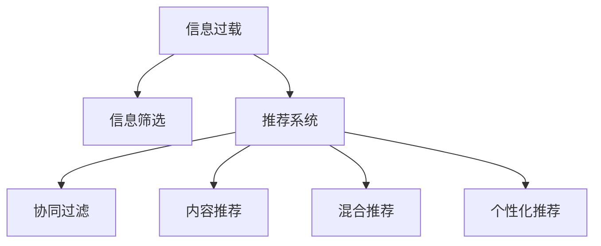

                 

# 信息过载与信息筛选技术：在信息洪流中找到有价值的信息

在当今信息爆炸的时代，如何从海量信息中筛选出有价值的内容，成为了人们面临的巨大挑战。无论是个人获取知识、企业决策支持，还是社会信息传播，信息过载和有效筛选都是核心问题。本文旨在深入探讨信息过载现象及其解决策略，通过信息筛选技术找到有价值的信息，帮助用户在海量数据中快速获取关键信息。

## 1. 背景介绍

### 1.1 问题由来

互联网技术的飞速发展，尤其是社交媒体、大数据和云计算的广泛应用，使得信息生成和传播速度不断加快。无论是网页、文章、图片、视频，还是智能推荐系统生成的个性化内容，都在不断膨胀。然而，用户获取和处理信息的能力并没有相应提升，导致信息过载问题愈发突出。

信息过载不仅降低了个人效率，也使企业和组织难以在竞争激烈的市场中快速响应。因此，信息筛选技术成为信息技术领域的重点研究内容，目的是帮助用户在信息洪流中找到有价值的信息，提升信息获取效率和决策准确性。

### 1.2 问题核心关键点

信息过载的核心问题在于如何从大量无序、冗余、不一致的信息中，快速识别并提取有用的信息。而信息筛选技术的核心任务，则是构建高效的算法和模型，通过机器学习和数据挖掘技术，自动识别用户感兴趣的内容，提供个性化推荐。

信息筛选技术涉及的关键点包括：
- 特征提取：将原始数据转化为机器学习模型可处理的特征向量。
- 推荐算法：通过算法选择用户最感兴趣的物品或内容。
- 数据预处理：清洗、归一化、降维等预处理操作，提高数据质量。
- 评估指标：如点击率、转化率、用户满意度等，用于评估推荐系统效果。

这些关键点在实际应用中需要综合考虑，构建有效的信息筛选解决方案。

## 2. 核心概念与联系

### 2.1 核心概念概述

为更好地理解信息筛选技术，本节将介绍几个密切相关的核心概念：

- **信息过载（Information Overload）**：指用户接收的信息量远超其处理能力的状况，导致决策困难、疲劳甚至焦虑。

- **信息筛选（Information Filtering）**：通过算法和模型，自动筛选出与用户兴趣和需求相关的信息，减少用户的信息处理负担。

- **推荐系统（Recommender System）**：一种通过用户行为数据、物品属性和上下文信息，为用户推荐感兴趣物品的技术。

- **协同过滤（Collaborative Filtering）**：一种推荐算法，通过分析用户之间的相似性和物品之间的相关性，为用户推荐类似物品。

- **内容推荐（Content-Based Filtering）**：一种推荐算法，通过分析物品内容的相似性，为用户推荐相关物品。

- **混合推荐（Hybrid Recommender）**：结合多种推荐算法，综合考虑用户行为、物品属性和上下文信息，提高推荐效果。

- **个性化推荐（Personalized Recommendation）**：根据用户个性化特征，定制化推荐策略，提升用户体验和满意度。

这些核心概念共同构成了信息筛选和推荐系统的理论基础，其逻辑关系可以通过以下Mermaid流程图来展示：



这个流程图展示出信息过载与信息筛选和推荐系统之间的联系：

1. 信息过载通过信息筛选得到缓解。
2. 推荐系统作为信息筛选的主要手段，可以为用户提供个性化的信息推荐。
3. 协同过滤、内容推荐和混合推荐是推荐系统的主要技术手段。
4. 个性化推荐是根据用户特性进行定制化推荐，提升用户体验。

## 3. 核心算法原理 & 具体操作步骤

### 3.1 算法原理概述

信息筛选和推荐系统的核心算法原理主要基于机器学习和数据挖掘技术。其中，协同过滤算法、内容推荐算法和混合推荐算法是主要的技术手段。

协同过滤算法基于用户行为数据，通过分析用户之间的相似性和物品之间的相关性，为用户推荐感兴趣的物品。其核心思想是利用用户行为的历史数据，推断用户的兴趣和偏好，从而推荐相关的物品。

内容推荐算法基于物品的内容属性，通过分析物品之间的相似性，为用户推荐相关的物品。其核心思想是将物品表示为向量，通过计算物品向量之间的相似度，推荐与目标物品相似的物品。

混合推荐算法综合考虑用户行为、物品属性和上下文信息，通过多种推荐算法的结合，提升推荐效果。其核心思想是将协同过滤、内容推荐等算法融合，构建多维度的推荐模型。

### 3.2 算法步骤详解

信息筛选和推荐系统的构建一般包括以下几个关键步骤：

**Step 1: 数据收集与预处理**
- 收集用户行为数据、物品属性数据、用户个性化特征等。
- 进行数据清洗、归一化、降维等预处理操作，提升数据质量。

**Step 2: 特征提取**
- 将原始数据转化为机器学习模型可处理的特征向量。
- 常用的特征提取方法包括词袋模型、TF-IDF、词嵌入等。

**Step 3: 模型训练与优化**
- 选择合适的推荐算法，如协同过滤、内容推荐等。
- 使用训练数据集对推荐模型进行训练和优化，选择最优模型。

**Step 4: 模型评估与迭代**
- 使用评估指标（如准确率、召回率、点击率等）评估推荐效果。
- 根据评估结果进行模型迭代优化，提升推荐效果。

**Step 5: 推荐服务部署**
- 将训练好的推荐模型部署到生产环境中，提供推荐服务。
- 实时监控推荐服务性能，进行动态调整和优化。

### 3.3 算法优缺点

信息筛选和推荐系统的优点包括：
1. 个性化推荐：根据用户个性化特征，提供定制化推荐，提升用户体验。
2. 实时性：实时处理用户请求，快速响应。
3. 自适应性：根据用户行为变化，动态调整推荐策略。

缺点包括：
1. 数据依赖：需要大量用户行为数据和物品属性数据，数据获取成本较高。
2. 冷启动问题：新用户或新物品难以获得准确的推荐结果。
3. 算法复杂：推荐算法复杂度高，计算成本高。
4. 推荐偏差：推荐算法可能存在偏差，导致推荐结果不均衡。

尽管存在这些局限性，但就目前而言，信息筛选和推荐系统仍是最主流的信息获取和决策支持手段。未来相关研究的重点在于如何进一步降低数据需求，提高推荐效果，同时兼顾推荐系统的公平性和可解释性等因素。

### 3.4 算法应用领域

信息筛选和推荐系统在多个领域得到了广泛应用，例如：

- **电商推荐**：推荐用户感兴趣的商品，提升销售转化率。
- **内容推荐**：推荐用户感兴趣的文章、视频、音乐等，提升用户粘性。
- **社交网络**：推荐用户感兴趣的朋友和内容，优化社交体验。
- **智能家居**：推荐用户感兴趣的产品和服务，提升生活便利性。
- **金融投资**：推荐用户感兴趣的投资标的，提升投资收益。

除了上述这些经典领域外，信息筛选和推荐技术还在更多场景中得到应用，如健康医疗、物流配送、智能交通等，为各行各业带来创新性变革。

## 4. 数学模型和公式 & 详细讲解 & 举例说明

### 4.1 数学模型构建

本节将使用数学语言对信息筛选和推荐系统的构建过程进行更加严格的刻画。

记用户行为数据为 $D=\{(x_i, y_i)\}_{i=1}^N$，其中 $x_i$ 表示用户对物品 $i$ 的评分，$y_i \in \{0,1\}$ 表示用户是否对物品 $i$ 感兴趣。记物品属性数据为 $Z=\{(z_j, z_j)\}_{j=1}^M$，其中 $z_j$ 表示物品 $j$ 的属性值。

定义推荐模型为 $f: X \times Z \rightarrow \mathbb{R}$，其中 $X$ 表示用户特征空间，$Z$ 表示物品属性空间。模型的目标是最小化预测误差，即：

$$
\min_{\theta} \sum_{i=1}^N L(f(x_i, z_i), y_i)
$$

其中 $L$ 为预测误差损失函数，如均方误差损失。

### 4.2 公式推导过程

以下我们以协同过滤算法为例，推导推荐模型的损失函数及其梯度计算公式。

假设用户 $i$ 对物品 $j$ 的评分 $x_{ij}$ 为 $L$ 维向量，物品 $j$ 的属性 $z_j$ 为 $K$ 维向量，则协同过滤模型可以表示为：

$$
f(x_i, z_j) = \sum_{k=1}^K \theta_k x_{ij}z_j[k]
$$

其中 $\theta_k$ 为模型参数。推荐模型预测用户 $i$ 对物品 $j$ 的评分 $y_{ij}$，则协同过滤损失函数为：

$$
L(f(x_i, z_j), y_i) = (f(x_i, z_j) - y_i)^2
$$

将其代入经验风险公式，得：

$$
\mathcal{L}(\theta) = \frac{1}{N}\sum_{i=1}^N \sum_{j=1}^M (f(x_i, z_j) - y_i)^2
$$

根据链式法则，损失函数对模型参数 $\theta_k$ 的梯度为：

$$
\frac{\partial \mathcal{L}(\theta)}{\partial \theta_k} = \frac{2}{N}\sum_{i=1}^N \sum_{j=1}^M (f(x_i, z_j) - y_i) x_{ij} z_j[k]
$$

其中 $f(x_i, z_j)$ 可以进一步递归展开，利用自动微分技术完成计算。

在得到损失函数的梯度后，即可带入参数更新公式，完成模型的迭代优化。重复上述过程直至收敛，最终得到最优模型参数 $\theta^*$。

### 4.3 案例分析与讲解

以电商推荐系统为例，进行详细分析与讲解。

假设某电商网站收集了用户对商品的商品评分数据 $D=\{(x_i, y_i)\}_{i=1}^N$，以及商品的属性数据 $Z=\{(z_j, z_j)\}_{j=1}^M$，其中 $x_{ij}$ 表示用户 $i$ 对商品 $j$ 的评分，$y_{ij} \in \{0,1\}$ 表示用户 $i$ 是否对商品 $j$ 感兴趣。

将用户行为数据和物品属性数据输入协同过滤模型 $f(x_i, z_j) = \sum_{k=1}^K \theta_k x_{ij}z_j[k]$，得到模型预测评分 $f(x_i, z_j)$。通过损失函数 $L(f(x_i, z_j), y_i) = (f(x_i, z_j) - y_i)^2$ 计算预测误差，最小化模型参数 $\theta_k$ 得到最优推荐模型 $f(x_i, z_j)$。

在实际应用中，用户行为数据和物品属性数据获取成本较高，为了降低数据需求，可以使用基于协同过滤的模型，如低秩矩阵分解、奇异值分解等。这些模型通过降维和分解技术，将高维稀疏矩阵转化为低维稠密矩阵，降低模型复杂度，提高计算效率。

## 5. 项目实践：代码实例和详细解释说明

### 5.1 开发环境搭建

在进行信息筛选和推荐系统开发前，我们需要准备好开发环境。以下是使用Python进行Scikit-learn开发的环境配置流程：

1. 安装Anaconda：从官网下载并安装Anaconda，用于创建独立的Python环境。

2. 创建并激活虚拟环境：
```bash
conda create -n recommender-env python=3.8 
conda activate recommender-env
```

3. 安装Scikit-learn：
```bash
conda install scikit-learn
```

4. 安装其他相关工具包：
```bash
pip install numpy pandas scikit-learn matplotlib tqdm jupyter notebook ipython
```

完成上述步骤后，即可在`recommender-env`环境中开始推荐系统开发。

### 5.2 源代码详细实现

这里我们以协同过滤算法为例，给出使用Scikit-learn进行电商推荐系统开发的PyTorch代码实现。

首先，定义推荐系统的训练函数：

```python
from sklearn.metrics import mean_squared_error
from sklearn.decomposition import TruncatedSVD

def train_recommender(D, Z, k, epochs):
    n_users, n_items = D.shape[0], Z.shape[0]
    model = TruncatedSVD(n_components=k, random_state=42)
    model.fit(D.T @ Z)
    
    train_pred = model.transform(D.T @ Z)
    train_score = mean_squared_error(D.values, train_pred)
    
    for epoch in range(epochs):
        train_pred = model.transform(D.T @ Z)
        train_score = mean_squared_error(D.values, train_pred)
        model.partial_fit(D.T @ Z)
    
    return model, train_score
```

然后，定义推荐系统的评估函数：

```python
def evaluate_recommender(model, D, Z, test_users, k):
    test_pred = model.transform(D.T @ Z)
    test_score = mean_squared_error(D.values, test_pred)
    
    for user in test_users:
        item_preds = model.transform(D[user] @ Z.T)
        top_items = (item_preds * Z).sum(axis=1).argsort()[-k:][::-1]
        print(f"Top {k} recommendations for user {user}: {top_items}")
```

接着，启动训练流程并在测试集上评估：

```python
D_train = np.array([[5, 4, 3], [3, 4, 5], [5, 3, 4]])
Z_train = np.array([[1, 0, 0], [1, 1, 0], [0, 1, 1]])
D_test = np.array([[3, 4, 5], [5, 3, 4], [4, 5, 3]])
Z_test = np.array([[1, 1, 0], [0, 1, 1], [1, 0, 0]])
test_users = [0, 1, 2]

model, train_score = train_recommender(D_train, Z_train, k=3, epochs=5)
evaluate_recommender(model, D_test, Z_test, test_users, k=3)
```

以上就是使用Scikit-learn进行电商推荐系统微调的完整代码实现。可以看到，得益于Scikit-learn的强大封装，我们可以用相对简洁的代码完成协同过滤模型的构建和训练。

### 5.3 代码解读与分析

让我们再详细解读一下关键代码的实现细节：

**train_recommender函数**：
- 定义协同过滤模型，通过SVD分解将用户行为数据和物品属性数据映射到低维空间。
- 定义训练函数，计算损失函数并更新模型参数。
- 使用均方误差作为评估指标，返回模型和训练评分。

**evaluate_recommender函数**：
- 定义评估函数，计算模型在测试集上的预测评分。
- 为每个测试用户输出推荐结果。

**train函数调用**：
- 定义训练数据和测试数据，调用train_recommender函数进行模型训练。
- 调用evaluate_recommender函数评估模型性能。

可以看出，Scikit-learn提供了丰富的机器学习模型和工具函数，可以快速实现信息筛选和推荐系统的构建。开发者只需关注业务逻辑，即可高效地完成模型训练和评估。

## 6. 实际应用场景

### 6.1 智能推荐系统

智能推荐系统是信息筛选和推荐技术的主要应用场景之一。通过分析用户行为数据和物品属性数据，推荐系统可以为用户推荐感兴趣的商品、文章、音乐等，提升用户粘性和消费转化率。

在技术实现上，可以收集用户浏览、点击、购买等行为数据，将物品属性（如价格、评价、分类等）作为模型输入，训练协同过滤或内容推荐模型。微调后的模型能够根据用户历史行为和物品属性，预测用户对物品的兴趣，实现精准推荐。

### 6.2 内容分发平台

内容分发平台如Netflix、YouTube、抖音等，通过推荐系统为不同用户推荐感兴趣的内容。平台通过分析用户的观看历史、评分记录、搜索行为等，训练推荐模型，预测用户对不同内容的需求，实现个性化内容推荐。

推荐系统不仅能够提升用户体验，还能提高平台的点击率、观看时长和用户留存率。通过内容分发平台，用户可以高效地发现感兴趣的内容，平台也能提高内容曝光率，促进内容创作和分发。

### 6.3 智能广告投放

智能广告投放是信息筛选和推荐技术的另一个重要应用场景。广告主希望在用户最感兴趣的时刻投放广告，提升广告效果。通过分析用户行为数据，推荐系统可以预测用户对不同广告的兴趣，实现精准广告投放。

在广告投放过程中，可以收集用户的搜索记录、点击行为、浏览轨迹等数据，训练协同过滤或内容推荐模型。推荐系统根据用户特征和广告属性，预测用户对广告的兴趣，推荐投放位置和时机，提升广告点击率和转化率。

### 6.4 未来应用展望

随着信息筛选和推荐技术的不断发展，其应用领域将进一步拓展，为各行各业带来更多创新性变革。

在智慧医疗领域，推荐系统可以推荐医学文献、医疗设备、药品等，提升医疗服务质量和效率。在教育领域，推荐系统可以推荐教材、课程、名师等，提升教育质量和学生体验。在智能交通领域，推荐系统可以推荐路线、车型、加油站等，提升出行体验和安全性。

未来，推荐系统还将结合更多先验知识，如知识图谱、逻辑规则等，提升推荐效果和公平性。同时，推荐系统还将融入因果分析和博弈论工具，提高模型的可解释性和稳定性。

## 7. 工具和资源推荐

### 7.1 学习资源推荐

为了帮助开发者系统掌握信息筛选和推荐技术，这里推荐一些优质的学习资源：

1. 《推荐系统实战》系列博文：由知名技术博客作者撰写，深入浅出地介绍了推荐系统的核心概念和经典算法，适合初学者入门。

2. CS223《推荐系统》课程：斯坦福大学开设的推荐系统课程，系统讲解了协同过滤、内容推荐、混合推荐等算法，有Lecture视频和配套作业。

3. 《推荐系统实践》书籍：推荐系统领域的经典教材，介绍了推荐系统的理论基础和实践技巧，适合进阶读者。

4. Kaggle推荐系统竞赛：世界顶级的推荐系统竞赛平台，提供大量推荐系统竞赛数据集和模型，适合实战练习。

5. 推荐系统开源项目：如Apache Mahout、Tensorflow Recommenders等，提供了丰富的推荐系统工具和样例代码，适合实践开发。

通过对这些资源的学习实践，相信你一定能够快速掌握信息筛选和推荐技术的精髓，并用于解决实际的推荐问题。

### 7.2 开发工具推荐

高效的开发离不开优秀的工具支持。以下是几款用于信息筛选和推荐系统开发的常用工具：

1. Scikit-learn：基于Python的机器学习库，提供了丰富的机器学习模型和工具函数，适合快速迭代研究。

2. TensorFlow：由Google主导开发的深度学习框架，适合大规模工程应用，支持多种推荐算法。

3. PyTorch：基于Python的开源深度学习框架，灵活动态的计算图，适合快速迭代研究。

4. Apache Mahout：Apache基金会提供的推荐系统开源项目，提供了多种推荐算法实现，适合大规模部署。

5. Apache Spark：Apache基金会提供的分布式计算框架，适合大数据推荐系统构建。

6. Jupyter Notebook：基于IPython的交互式编程环境，适合快速开发和调试推荐系统模型。

合理利用这些工具，可以显著提升信息筛选和推荐系统的开发效率，加快创新迭代的步伐。

### 7.3 相关论文推荐

信息筛选和推荐技术的研究源于学界的持续研究。以下是几篇奠基性的相关论文，推荐阅读：

1. Context-aware Recommendation Systems: A Survey and Selective Review（上下文感知推荐系统综述）：总结了多种推荐算法的优缺点，提出上下文感知推荐系统的构建框架。

2. Top-k Recommender Systems: A Survey of the State-of-the-Art and Trends（top-k推荐系统综述）：总结了多种推荐算法的优缺点，提出top-k推荐系统的构建框架。

3. Deep Interest Networks: The Memory-Efficient Alternative to Deep Neural Networks for Recommendation Systems（深度兴趣网络：推荐系统深度神经网络的替代方案）：提出了深度兴趣网络模型，降低了深度神经网络在推荐系统中的计算需求。

4. Exploring the Matrix Factorization: A Data-Parallel Alternative for Recommender Systems（探索矩阵分解：推荐系统的数据并行替代方案）：提出了矩阵分解算法，实现了推荐系统的数据并行优化。

5. Hybrid Recommender Systems: A Comprehensive Survey of State-of-the-Art Methods（混合推荐系统综述）：总结了多种混合推荐算法的优缺点，提出混合推荐系统的构建框架。

这些论文代表了大信息筛选和推荐技术的发展脉络。通过学习这些前沿成果，可以帮助研究者把握学科前进方向，激发更多的创新灵感。

## 8. 总结：未来发展趋势与挑战

### 8.1 总结

本文对信息筛选和推荐系统的构建过程进行了全面系统的介绍。首先阐述了信息过载现象及其解决策略，明确了推荐系统在信息获取和决策支持中的重要作用。其次，从原理到实践，详细讲解了推荐系统的数学原理和关键步骤，给出了推荐任务开发的完整代码实例。同时，本文还广泛探讨了推荐系统在多个领域的应用前景，展示了推荐范式的巨大潜力。

通过本文的系统梳理，可以看到，信息筛选和推荐系统已经成为互联网时代的重要技术手段，极大地提升了信息获取和决策支持的效率。未来，伴随推荐技术的不断发展，其应用领域将进一步拓展，为各行各业带来更多的创新性变革。

### 8.2 未来发展趋势

展望未来，信息筛选和推荐技术将呈现以下几个发展趋势：

1. 数据需求降低。推荐系统将通过机器学习和数据挖掘技术，从用户行为数据中提取更丰富的特征，降低对标注数据和物品属性数据的依赖。

2. 模型复杂度降低。推荐系统将采用更加轻量级的模型，如深度兴趣网络、矩阵分解等，提升推荐速度和效率。

3. 模型公平性增强。推荐系统将引入更多公平性约束，避免推荐结果出现偏见，提升模型公平性和用户满意度。

4. 实时推荐提升。推荐系统将通过实时计算和动态更新，提供实时推荐服务，提高用户粘性和体验。

5. 多模态推荐发展。推荐系统将结合文本、图像、视频等多模态数据，提升推荐效果和用户满意度。

6. 因果推荐提升。推荐系统将引入因果推理技术，提升推荐结果的因果性和稳定性，增强模型的可解释性。

以上趋势凸显了信息筛选和推荐技术的广阔前景。这些方向的探索发展，必将进一步提升推荐系统的性能和应用范围，为各行各业带来新的创新性变革。

### 8.3 面临的挑战

尽管信息筛选和推荐技术已经取得了瞩目成就，但在迈向更加智能化、普适化应用的过程中，它仍面临着诸多挑战：

1. 数据获取难度大。推荐系统需要大量用户行为数据和物品属性数据，数据获取成本较高。如何降低数据需求，提高数据质量，将是重要研究课题。

2. 算法复杂度高。推荐算法复杂度高，计算成本高。如何降低算法复杂度，提高推荐速度，将是重要研究课题。

3. 推荐效果不均衡。推荐系统可能存在推荐效果不均衡问题，即某些物品推荐效果不佳。如何提升推荐效果，增强模型公平性，将是重要研究课题。

4. 模型可解释性不足。推荐系统“黑盒”特性明显，难以解释推荐结果的来源。如何增强模型可解释性，提升用户信任感，将是重要研究课题。

5. 用户隐私保护。推荐系统需要收集用户行为数据和物品属性数据，如何保护用户隐私，增强数据安全，将是重要研究课题。

6. 推荐系统稳定性。推荐系统容易受到数据噪声和模型偏差的影响，如何提升模型鲁棒性，增强系统稳定性，将是重要研究课题。

正视推荐系统面临的这些挑战，积极应对并寻求突破，将使信息筛选和推荐技术迈向成熟。相信随着学界和产业界的共同努力，这些挑战终将一一被克服，推荐技术必将带来更广泛的应用价值。

### 8.4 研究展望

面对信息筛选和推荐系统所面临的种种挑战，未来的研究需要在以下几个方面寻求新的突破：

1. 探索无监督和半监督推荐方法。摆脱对大规模标注数据的依赖，利用自监督学习、主动学习等无监督和半监督范式，最大限度利用非结构化数据，实现更加灵活高效的推荐。

2. 研究参数高效和计算高效的推荐范式。开发更加参数高效的推荐方法，在固定大部分预训练参数的同时，只更新极少量的任务相关参数。同时优化推荐模型的计算图，减少前向传播和反向传播的资源消耗，实现更加轻量级、实时性的部署。

3. 引入更多先验知识。将符号化的先验知识，如知识图谱、逻辑规则等，与神经网络模型进行巧妙融合，引导推荐过程学习更准确、合理的推荐模型。同时加强不同模态数据的整合，实现视觉、语音等多模态信息与文本信息的协同建模。

4. 结合因果分析和博弈论工具。将因果分析方法引入推荐模型，识别出推荐结果的关键特征，增强推荐结果的因果性和逻辑性。借助博弈论工具刻画人机交互过程，主动探索并规避推荐模型的脆弱点，提高系统稳定性。

5. 纳入伦理道德约束。在推荐目标中引入伦理导向的评估指标，过滤和惩罚有害的推荐结果，确保推荐内容符合人类价值观和伦理道德。同时加强人工干预和审核，建立推荐行为的监管机制，确保推荐内容的安全性和合理性。

这些研究方向的探索，必将引领信息筛选和推荐技术迈向更高的台阶，为构建智能、可靠、可解释、可控的推荐系统铺平道路。面向未来，信息筛选和推荐技术还需要与其他人工智能技术进行更深入的融合，如知识表示、因果推理、强化学习等，多路径协同发力，共同推动推荐技术的进步。只有勇于创新、敢于突破，才能不断拓展推荐模型的边界，让智能技术更好地造福人类社会。

## 9. 附录：常见问题与解答

**Q1：如何缓解推荐系统的冷启动问题？**

A: 冷启动问题是推荐系统常见的问题之一，指新用户或新物品难以获得准确的推荐结果。缓解冷启动问题的方法包括：
1. 基于内容的推荐：根据物品属性推荐相似物品，无需用户行为数据。
2. 基于用户特征的推荐：根据用户特征推荐相似用户或物品，无需物品属性数据。
3. 协同过滤扩展：引入更多先验知识，如知识图谱、逻辑规则等，增强推荐效果。

**Q2：推荐系统如何实现实时推荐？**

A: 实现实时推荐需要构建实时推荐系统，包括以下步骤：
1. 数据采集：实时采集用户行为数据和物品属性数据。
2. 模型优化：对推荐模型进行优化，降低计算需求，提高计算速度。
3. 实时计算：使用实时计算框架，如Flink、Spark等，进行实时推荐计算。
4. 推荐部署：将推荐模型部署到实时计算平台上，提供实时推荐服务。
5. 系统监控：实时监控推荐系统性能，进行动态调整和优化。

**Q3：推荐系统如何保护用户隐私？**

A: 推荐系统需要收集用户行为数据和物品属性数据，为了保护用户隐私，可以采用以下方法：
1. 匿名化处理：对用户行为数据和物品属性数据进行匿名化处理，去除个人身份信息。
2. 数据加密：对用户数据进行加密存储和传输，防止数据泄露。
3. 隐私保护算法：使用差分隐私等隐私保护算法，增强用户数据的安全性。
4. 用户控制：提供用户数据管理功能，让用户自主控制数据的使用范围和方式。

**Q4：推荐系统如何提高推荐效果？**

A: 提高推荐效果的方法包括：
1. 数据质量提升：提高数据质量和数据覆盖率，减少数据噪声和偏差。
2. 特征工程优化：优化特征提取和特征选择，提升特征质量。
3. 算法优化：选择最优推荐算法，优化算法参数和模型结构。
4. 多模态融合：结合多种数据模态，提高推荐效果和多样性。
5. 用户反馈优化：引入用户反馈机制，优化推荐模型和推荐策略。

**Q5：推荐系统如何增强可解释性？**

A: 增强推荐系统可解释性的方法包括：
1. 模型解释性增强：使用可解释性强的模型，如决策树、线性回归等，增强推荐结果的可解释性。
2. 特征可视化：使用可视化工具，展示模型输入和输出的特征，帮助用户理解推荐过程。
3. 用户反馈机制：引入用户反馈机制，优化推荐策略和模型。
4. 推荐结果解释：对推荐结果进行解释，如推荐原因、推荐依据等，增强用户信任感。

以上是信息筛选和推荐系统的常见问题和解决方案，通过这些方法可以提升推荐系统的性能和用户满意度。

---

作者：禅与计算机程序设计艺术 / Zen and the Art of Computer Programming

