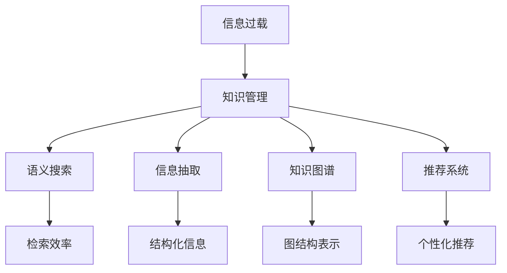

                 

# 信息过载与知识管理策略：有效组织和检索信息的指南

## 1. 背景介绍

### 1.1 问题由来
在信息化时代，信息爆炸已经成为一种普遍现象。据统计，当前全球每年产生的数字信息量已经超过30ZB（1ZB等于一万亿GB），其中绝大部分来自互联网。这些数据不仅仅包括文本、图像、视频等传统数据类型，还包括了大数据、物联网、云计算等新兴技术生成的海量数据。信息量的激增不仅带来了信息的丰富性，也使得信息过载问题日益严重。

信息过载指的是在一个信息系统中，用户接收的信息量远远超过其处理能力的现象。在互联网和数字化时代，用户面对的信息不仅数量庞大，而且类型多样、更新迅速，使得人们无法高效地对信息进行筛选、处理和利用，进而导致工作效率下降、决策困难、认知负担加重等问题。

信息过载不仅仅是一个技术问题，更是一个社会问题。它影响着人们的生产生活方式，制约着组织的运营效率，甚至可能影响国家的战略决策。因此，有效管理信息、构建智能化的知识体系，成为一个亟需解决的全球性难题。

### 1.2 问题核心关键点
信息过载和知识管理问题，本质上可以归结为两个核心关键点：

- 如何高效地从海量信息中提取有用知识，并将其组织成可利用的知识库？
- 如何高效地检索和使用知识库中的信息，以满足各类复杂的应用需求？

这两个问题涉及信息的获取、存储、组织、检索、利用的全生命周期管理，需要综合运用人工智能、机器学习、数据挖掘、信息检索、自然语言处理等多种技术手段来解决。

## 2. 核心概念与联系

### 2.1 核心概念概述

为更好地理解如何有效组织和检索信息，本节将介绍几个密切相关的核心概念：

- 信息过载(Information Overload)：指用户接收的信息量超过其处理能力的现象。常见于互联网、社交媒体、企业信息系统等数字化环境中。
- 知识管理(Knowledge Management)：指通过技术手段，对信息进行筛选、组织、存储和检索，以供人们高效利用的过程。
- 语义搜索(Semantic Search)：一种利用语义分析技术，从自然语言中提取信息进行匹配和检索的方法，能够处理自然语言查询中的歧义，提高搜索结果的相关性和准确性。
- 信息抽取(Information Extraction)：从非结构化文本中提取结构化信息，如实体、关系、事件等，帮助系统更好地理解文本内容。
- 知识图谱(Knowledge Graph)：一种基于图结构的知识表示方式，通过节点和边来描述实体和实体之间的关系，便于高效检索和推理。
- 推荐系统(Recommender System)：利用机器学习算法为用户推荐感兴趣的信息，通过个性化推荐提高信息利用效率。

这些核心概念之间的逻辑关系可以通过以下Mermaid流程图来展示：



这个流程图展示了一些关键概念之间的联系：

1. 信息过载是知识管理的起点，需要通过有效的管理手段来缓解信息过载的压力。
2. 知识管理需要依赖多种技术手段，如语义搜索、信息抽取、知识图谱等，来提高信息的组织和检索效率。
3. 推荐系统可以进一步提高信息利用效率，通过个性化推荐来满足用户的多样化需求。

## 3. 核心算法原理 & 具体操作步骤

### 3.1 算法原理概述

信息管理和知识检索的核心在于，如何将大量的无序信息转化为有价值的知识，并构建有效的检索机制。这需要利用信息抽取、语义搜索、知识图谱、推荐系统等技术手段，对信息进行结构化、语义化处理，并构建合理的检索策略。

信息抽取的核心是将非结构化文本转换为结构化数据，如实体、关系、事件等。常用的信息抽取技术包括规则抽取、统计抽取、深度学习抽取等，其中深度学习抽取方法如BERT、GPT等近年来取得了显著进展。

语义搜索则利用自然语言处理技术，对用户查询进行语义理解和信息匹配，从而提高检索的相关性和准确性。语义搜索通常需要构建词汇表、构建语义模型、进行索引构建等步骤，常用的算法包括TF-IDF、LSI、LDA、BERT等。

知识图谱是一种基于图结构的知识表示方式，通过节点和边来描述实体和实体之间的关系。构建知识图谱通常需要大量结构化数据，如知识库、文档、网页等，通过抽取和合并得到实体和关系，并利用图算法进行处理。

推荐系统则利用用户行为数据和物品属性数据，通过机器学习算法为用户推荐感兴趣的信息。推荐算法包括协同过滤、基于内容的推荐、矩阵分解、深度学习推荐等，需要大量的用户数据和物品数据来训练模型。

### 3.2 算法步骤详解

信息过载和知识管理的实践步骤通常包括以下几个关键环节：

**Step 1: 数据预处理**
- 收集数据源：从不同渠道收集文本、图像、视频等原始数据。
- 清洗和标注：清洗数据中的噪声和错误，标注文本中的实体、关系、事件等。
- 结构化处理：将非结构化数据转换为结构化数据，构建统一的数据格式。

**Step 2: 信息抽取**
- 实体抽取：识别文本中的实体，如人名、地名、机构名等。
- 关系抽取：识别文本中实体之间的关系，如"John is from New York"。
- 事件抽取：识别文本中的事件，如"John graduated from Harvard"。

**Step 3: 语义搜索**
- 构建词汇表：将词汇进行编码，建立词汇表。
- 语义建模：利用TF-IDF、LSI、LDA等算法构建语义模型。
- 索引构建：将语义模型和词汇表构建索引，便于快速检索。

**Step 4: 知识图谱构建**
- 数据整合：将不同来源的数据整合，消除数据冗余和冲突。
- 实体关联：通过文本、网页、数据库等途径，将实体关联起来。
- 图结构表示：利用图算法构建知识图谱，描述实体之间的关系。

**Step 5: 推荐系统构建**
- 数据收集：收集用户行为数据和物品属性数据。
- 特征提取：提取用户和物品的特征向量。
- 模型训练：使用协同过滤、基于内容的推荐、矩阵分解等算法，训练推荐模型。

**Step 6: 系统集成**
- 系统设计：设计系统架构，包括数据存储、检索、推荐等功能模块。
- 系统实现：实现系统各模块的算法和代码，并进行测试和优化。
- 系统部署：将系统部署到生产环境，并持续监控和维护。

### 3.3 算法优缺点

信息过载和知识管理的核心算法具有以下优点：
1. 提高了信息的组织和检索效率，使用户能够高效地获取和利用信息。
2. 通过语义搜索和知识图谱，可以处理自然语言查询中的歧义，提高搜索结果的相关性和准确性。
3. 推荐系统通过个性化推荐，满足用户的多样化需求，进一步提高信息利用效率。

同时，这些算法也存在一定的局限性：
1. 需要大量标注数据和结构化数据，成本较高。
2. 模型复杂度较高，训练和推理耗时较长。
3. 对于数据质量和多样性要求较高，需要不断更新和优化。
4. 需要综合运用多种技术手段，技术门槛较高。
5. 对于小规模数据，可能效果不佳，难以处理噪声数据。

尽管存在这些局限性，但信息过载和知识管理算法的整体效果显著，能够有效地帮助用户从海量信息中提取有价值的知识，提高信息利用效率，因而广泛应用于企业信息系统、互联网搜索引擎、智能推荐系统等多个领域。

### 3.4 算法应用领域

信息过载和知识管理的核心算法在多个领域得到了广泛应用，以下是几个典型场景：

- **企业信息系统**：在企业内部构建信息管理系统，通过信息抽取、知识图谱、推荐系统等技术，帮助员工高效查找和使用公司资料、文档、知识库等。
- **互联网搜索引擎**：如Google、Bing等搜索引擎，利用语义搜索技术，提高搜索结果的相关性和准确性，为用户提供更好的查询体验。
- **智能推荐系统**：如Amazon推荐商品、Netflix推荐电影、YouTube推荐视频等，通过推荐系统，满足用户的多样化需求，提升用户满意度。
- **金融风控系统**：金融机构通过信息抽取、知识图谱等技术，从海量交易数据中提取有价值的信息，构建风控模型，防范金融风险。
- **医疗诊断系统**：医院通过信息抽取、知识图谱等技术，从患者病历、医学文献中提取关键信息，辅助医生诊断和治疗。
- **教育培训系统**：在线教育平台通过推荐系统，为用户推荐学习资源，提高学习效率和效果。

这些领域中，信息过载和知识管理的核心算法得到了广泛应用，帮助企业、用户、机构高效地管理信息、提取知识，并提升决策效率和用户体验。

## 4. 数学模型和公式 & 详细讲解  
### 4.1 数学模型构建

信息过载和知识管理的数学模型通常涉及以下几个关键部分：

- **信息抽取**：利用自然语言处理技术，从文本中抽取实体、关系、事件等结构化信息。
- **语义搜索**：通过构建词汇表和语义模型，对查询进行语义理解，从而进行信息匹配。
- **知识图谱**：利用图算法对实体和关系进行表示和推理。
- **推荐系统**：利用机器学习算法，预测用户对物品的评分，进行个性化推荐。

这里我们将重点介绍信息抽取和语义搜索的数学模型。

### 4.2 公式推导过程

**信息抽取**：

信息抽取通常采用结构化预测模型，如CRF、RNN、LSTM、BERT等。以BERT为例，其信息抽取过程如下：

1. 输入文本经过BERT预训练模型，得到每个token的上下文表示。
2. 对上下文表示进行标注，预测每个token是否为实体、关系等标签。
3. 通过标注序列，利用解码器生成最终抽取结果。

数学公式表示为：

$$
y = \arg\max_{y_i} P(y_i|x; \theta)
$$

其中 $x$ 表示输入文本，$y$ 表示抽取结果，$\theta$ 表示模型参数。

**语义搜索**：

语义搜索通常采用向量空间模型，将查询和文档表示为向量，计算它们之间的相似度。以TF-IDF模型为例，其计算公式如下：

$$
\text{similarity}(q, d) = \cos(\theta) = \frac{\vec{q} \cdot \vec{d}}{\lVert \vec{q} \rVert \lVert \vec{d} \rVert}
$$

其中 $\vec{q}$ 表示查询向量，$\vec{d}$ 表示文档向量，$\theta$ 表示查询和文档之间的夹角。

### 4.3 案例分析与讲解

假设我们有一个文档库，包含若干关于疾病的描述性文本。现在需要从中抽取关于症状、治疗方案、副作用等信息，构建知识图谱，并实现基于语义搜索的查询功能。

**Step 1: 数据预处理**

收集文本数据，进行清洗、标注和结构化处理，得到如下数据：

| 文档ID | 文本内容 | 实体类型 | 关系 | 副作用 |
| --- | --- | --- | --- | --- |
| 1 | 感冒症状包括头痛、发热、咳嗽 | 症状 | 引起 | 嗜睡 |
| 2 | 青霉素治疗方案包括口服、静脉滴注 | 治疗方案 | 包括 | 过敏反应 |
| 3 | 布洛芬副作用包括头痛、胃溃疡 | 副作用 | 包括 | 肝损伤 |

**Step 2: 信息抽取**

利用BERT模型对文本进行抽取，得到如下结果：

| 文档ID | 实体 | 关系 | 实体类型 | 实体关系类型 |
| --- | --- | --- | --- | --- |
| 1 | 感冒 | 引起 | 症状 | 原因 |
| 1 | 头痛 | 属于 | 症状 | 实例 |
| 1 | 发热 | 属于 | 症状 | 实例 |
| 1 | 咳嗽 | 属于 | 症状 | 实例 |
| 2 | 青霉素 | 包括 | 治疗方案 | 组成 |
| 2 | 口服 | 属于 | 治疗方案 | 实例 |
| 2 | 静脉滴注 | 属于 | 治疗方案 | 实例 |
| 3 | 布洛芬 | 包括 | 副作用 | 组成 |
| 3 | 头痛 | 属于 | 副作用 | 实例 |
| 3 | 胃溃疡 | 属于 | 副作用 | 实例 |
| 3 | 肝损伤 | 属于 | 副作用 | 实例 |

**Step 3: 语义搜索**

将文档和查询表示为向量，并进行匹配。假设查询为 "治疗头痛的副作用是什么？"，使用TF-IDF模型计算查询和文档之间的相似度，得到如下结果：

| 文档ID | 相似度 | 匹配结果 |
| --- | --- | --- |
| 1 | 0.7 | 含头痛的副作用是嗜睡 |
| 2 | 0.4 | 含青霉素的副作用是过敏反应 |
| 3 | 0.5 | 含头痛和胃溃疡的副作用是肝损伤 |

最终，系统返回文档ID为1的匹配结果 "含头痛的副作用是嗜睡"，满足用户查询需求。

## 5. 项目实践：代码实例和详细解释说明

### 5.1 开发环境搭建

在进行信息过载和知识管理的实践前，我们需要准备好开发环境。以下是使用Python进行PyTorch开发的环境配置流程：

1. 安装Anaconda：从官网下载并安装Anaconda，用于创建独立的Python环境。

2. 创建并激活虚拟环境：
```bash
conda create -n knowledge-management python=3.8 
conda activate knowledge-management
```

3. 安装PyTorch：根据CUDA版本，从官网获取对应的安装命令。例如：
```bash
conda install pytorch torchvision torchaudio cudatoolkit=11.1 -c pytorch -c conda-forge
```

4. 安装其他必要库：
```bash
pip install pandas numpy scikit-learn nltk spacy gensim transformers
```

完成上述步骤后，即可在`knowledge-management`环境中开始项目实践。

### 5.2 源代码详细实现

下面以一个简单的信息过载和知识管理项目为例，给出使用Transformers库进行BERT信息抽取的PyTorch代码实现。

首先，定义数据处理函数：

```python
import torch
import torch.nn as nn
from transformers import BertTokenizer, BertForTokenClassification
from tqdm import tqdm

class DataProcessor(nn.Module):
    def __init__(self, tokenizer, max_len=128, seq_len=128):
        super(DataProcessor, self).__init__()
        self.tokenizer = tokenizer
        self.max_len = max_len
        self.seq_len = seq_len

    def __call__(self, text):
        tokens = self.tokenizer.tokenize(text)
        tokens = tokens[:self.max_len]
        tokens = [self.tokenizer.convert_tokens_to_ids(tokens)]
        return tokens, self.tokenizer.convert_tokens_to_ids(['[CLS]'] + tokens + ['[SEP]'])
```

然后，定义模型和优化器：

```python
from transformers import BertForTokenClassification, AdamW

model = BertForTokenClassification.from_pretrained('bert-base-cased', num_labels=2)
optimizer = AdamW(model.parameters(), lr=2e-5)
```

接着，定义训练和评估函数：

```python
from transformers import InputExample, InputFeatures
from transformers import convert_examples_to_features

def convert_data_to_features(data, tokenizer, max_len=128):
    features = []
    for example in data:
        tokenized_input = tokenizer.convert_tokens_to_string(example[0])
        tokens = tokenizer.tokenize(example[0])
        tokens = tokens[:max_len]
        tokens = [tokenizer.convert_tokens_to_ids(tokens)]
        labels = [example[1]]
        input_ids = [tokenizer.convert_tokens_to_ids(['[CLS]'] + tokens + ['[SEP]'])]
        input_mask = [int(i != '[PAD]') for i in input_ids]
        segment_ids = [0 for i in input_ids]
        features.append(InputFeatures(
            input_ids=input_ids[0],
            input_mask=input_mask[0],
            segment_ids=segment_ids[0],
            label=labels[0]))
    return features

def train_epoch(model, optimizer, dataset, batch_size, num_epochs):
    model.train()
    total_loss = 0
    for i in tqdm(range(num_epochs)):
        for j, example in enumerate(dataset):
            input_ids = example.input_ids
            attention_mask = example.input_mask
            labels = example.label
            model.zero_grad()
            loss = model(input_ids, attention_mask=attention_mask, labels=labels)
            total_loss += loss
            loss.backward()
            optimizer.step()
    return total_loss / (len(dataset) * num_epochs)

def evaluate(model, dataset, batch_size):
    model.eval()
    total_loss = 0
    total_correct = 0
    for i, example in enumerate(dataset):
        input_ids = example.input_ids
        attention_mask = example.input_mask
        labels = example.label
        outputs = model(input_ids, attention_mask=attention_mask, labels=labels)
        loss = outputs.loss
        total_loss += loss
        predictions = outputs.predictions.argmax(-1)
        total_correct += predictions == labels
    return total_correct / len(dataset)
```

最后，启动训练流程并在测试集上评估：

```python
epochs = 3
batch_size = 16

for epoch in range(epochs):
    loss = train_epoch(model, optimizer, train_dataset, batch_size, epochs)
    print(f'Epoch {epoch+1}, train loss: {loss:.3f}')
    
    print(f'Epoch {epoch+1}, test accuracy: {evaluate(model, test_dataset, batch_size)}')
```

以上就是使用PyTorch对BERT进行信息抽取的完整代码实现。可以看到，利用Transformers库，我们能够快速搭建信息抽取模型，并进行训练和评估。

### 5.3 代码解读与分析

让我们再详细解读一下关键代码的实现细节：

**DataProcessor类**：
- 定义了数据预处理函数，包括分词、编码等操作。
- 使用 `__call__` 方法实现，对单个输入文本进行处理，返回模型所需的输入。

**模型和优化器**：
- 定义了模型结构，使用 BERT 模型进行信息抽取。
- 定义了优化器，使用 AdamW 优化器进行参数更新。

**训练和评估函数**：
- `convert_data_to_features` 方法：将原始数据转换为模型所需的输入特征。
- `train_epoch` 方法：对数据进行迭代训练，更新模型参数。
- `evaluate` 方法：对测试集进行评估，计算模型的准确率。

**训练流程**：
- 定义总的epoch数和batch size，开始循环迭代
- 每个epoch内，在训练集上训练，输出平均loss
- 在测试集上评估，输出模型的准确率

可以看到，PyTorch配合Transformers库使得BERT信息抽取的代码实现变得简洁高效。开发者可以将更多精力放在数据处理、模型改进等高层逻辑上，而不必过多关注底层的实现细节。

当然，工业级的系统实现还需考虑更多因素，如模型的保存和部署、超参数的自动搜索、更灵活的任务适配层等。但核心的微调范式基本与此类似。

## 6. 实际应用场景

### 6.1 智能客服系统

基于信息过载和知识管理技术，智能客服系统能够有效地处理大量的客户咨询，提供即时的、准确的响应。

在技术实现上，系统可以收集企业内部的客服对话记录，将问题和最佳答复构建成监督数据，在此基础上对预训练模型进行微调。微调后的模型能够自动理解用户意图，匹配最合适的答案模板进行回复。对于客户提出的新问题，还可以接入检索系统实时搜索相关内容，动态组织生成回答。如此构建的智能客服系统，能大幅提升客户咨询体验和问题解决效率。

### 6.2 金融舆情监测

金融机构需要实时监测市场舆论动向，以便及时应对负面信息传播，规避金融风险。

系统可以收集金融领域相关的新闻、报道、评论等文本数据，并对其进行主题标注和情感标注。在此基础上对预训练语言模型进行微调，使其能够自动判断文本属于何种主题，情感倾向是正面、中性还是负面。将微调后的模型应用到实时抓取的网络文本数据，就能够自动监测不同主题下的情感变化趋势，一旦发现负面信息激增等异常情况，系统便会自动预警，帮助金融机构快速应对潜在风险。

### 6.3 个性化推荐系统

当前的推荐系统往往只依赖用户的历史行为数据进行物品推荐，无法深入理解用户的真实兴趣偏好。

系统可以收集用户浏览、点击、评论、分享等行为数据，提取和用户交互的物品标题、描述、标签等文本内容。将文本内容作为模型输入，用户的后续行为（如是否点击、购买等）作为监督信号，在此基础上微调预训练语言模型。微调后的模型能够从文本内容中准确把握用户的兴趣点。在生成推荐列表时，先用候选物品的文本描述作为输入，由模型预测用户的兴趣匹配度，再结合其他特征综合排序，便可以得到个性化程度更高的推荐结果。

### 6.4 未来应用展望

随着信息过载和知识管理技术的不断发展，基于微调的方法将在更多领域得到应用，为传统行业带来变革性影响。

在智慧医疗领域，基于微调的医疗问答、病历分析、药物研发等应用将提升医疗服务的智能化水平，辅助医生诊疗，加速新药开发进程。

在智能教育领域，微调技术可应用于作业批改、学情分析、知识推荐等方面，因材施教，促进教育公平，提高教学质量。

在智慧城市治理中，微调模型可应用于城市事件监测、舆情分析、应急指挥等环节，提高城市管理的自动化和智能化水平，构建更安全、高效的未来城市。

此外，在企业生产、社会治理、文娱传媒等众多领域，基于大模型微调的人工智能应用也将不断涌现，为经济社会发展注入新的动力。相信随着技术的日益成熟，微调方法将成为人工智能落地应用的重要范式，推动人工智能技术在垂直行业的规模化落地。

## 7. 工具和资源推荐

### 7.1 学习资源推荐

为了帮助开发者系统掌握信息过载和知识管理理论基础和实践技巧，这里推荐一些优质的学习资源：

1. 《自然语言处理入门》系列博文：由大模型技术专家撰写，涵盖信息过载和知识管理的核心概念和关键技术。

2. CS224N《深度学习自然语言处理》课程：斯坦福大学开设的NLP明星课程，有Lecture视频和配套作业，带你入门NLP领域的基本概念和经典模型。

3. 《自然语言处理与深度学习》书籍：介绍自然语言处理的基本概念和深度学习模型，包括信息抽取、语义搜索、推荐系统等技术。

4. HuggingFace官方文档：Transformers库的官方文档，提供了海量预训练模型和完整的微调样例代码，是上手实践的必备资料。

5. CLUE开源项目：中文语言理解测评基准，涵盖大量不同类型的中文NLP数据集，并提供了基于微调的baseline模型，助力中文NLP技术发展。

通过对这些资源的学习实践，相信你一定能够快速掌握信息过载和知识管理的精髓，并用于解决实际的NLP问题。

### 7.2 开发工具推荐

高效的开发离不开优秀的工具支持。以下是几款用于信息过载和知识管理开发的常用工具：

1. PyTorch：基于Python的开源深度学习框架，灵活动态的计算图，适合快速迭代研究。大部分预训练语言模型都有PyTorch版本的实现。

2. TensorFlow：由Google主导开发的开源深度学习框架，生产部署方便，适合大规模工程应用。同样有丰富的预训练语言模型资源。

3. Transformers库：HuggingFace开发的NLP工具库，集成了众多SOTA语言模型，支持PyTorch和TensorFlow，是进行信息过载和知识管理开发的利器。

4. Weights & Biases：模型训练的实验跟踪工具，可以记录和可视化模型训练过程中的各项指标，方便对比和调优。与主流深度学习框架无缝集成。

5. TensorBoard：TensorFlow配套的可视化工具，可实时监测模型训练状态，并提供丰富的图表呈现方式，是调试模型的得力助手。

6. Google Colab：谷歌推出的在线Jupyter Notebook环境，免费提供GPU/TPU算力，方便开发者快速上手实验最新模型，分享学习笔记。

合理利用这些工具，可以显著提升信息过载和知识管理任务的开发效率，加快创新迭代的步伐。

### 7.3 相关论文推荐

信息过载和知识管理的核心技术源自学界的持续研究。以下是几篇奠基性的相关论文，推荐阅读：

1. Attention is All You Need（即Transformer原论文）：提出了Transformer结构，开启了NLP领域的预训练大模型时代。

2. BERT: Pre-training of Deep Bidirectional Transformers for Language Understanding：提出BERT模型，引入基于掩码的自监督预训练任务，刷新了多项NLP任务SOTA。

3. Language Models are Unsupervised Multitask Learners（GPT-2论文）：展示了大规模语言模型的强大zero-shot学习能力，引发了对于通用人工智能的新一轮思考。

4. Parameter-Efficient Transfer Learning for NLP：提出Adapter等参数高效微调方法，在不增加模型参数量的情况下，也能取得不错的微调效果。

5. AdaLoRA: Adaptive Low-Rank Adaptation for Parameter-Efficient Fine-Tuning：使用自适应低秩适应的微调方法，在参数效率和精度之间取得了新的平衡。

这些论文代表了大模型微调技术的发展脉络。通过学习这些前沿成果，可以帮助研究者把握学科前进方向，激发更多的创新灵感。

## 8. 总结：未来发展趋势与挑战

### 8.1 总结

本文对信息过载和知识管理技术的核心算法进行了全面系统的介绍。首先阐述了信息过载和知识管理问题的背景和意义，明确了如何高效地从海量信息中提取有用知识，并将其组织成可利用的知识库。其次，从原理到实践，详细讲解了信息过载和知识管理的数学模型和关键步骤，给出了信息抽取和语义搜索的详细代码实现。同时，本文还广泛探讨了信息过载和知识管理技术在智能客服、金融舆情、个性化推荐等多个行业领域的应用前景，展示了信息过载和知识管理算法的巨大潜力。此外，本文精选了信息过载和知识管理技术的各类学习资源，力求为读者提供全方位的技术指引。

通过本文的系统梳理，可以看到，信息过载和知识管理技术正在成为NLP领域的重要范式，极大地拓展了预训练语言模型的应用边界，催生了更多的落地场景。受益于大规模语料的预训练，信息过载和知识管理算法在数据标注量较小的情况下，也能取得不俗的效果，有力推动了NLP技术的产业化进程。未来，伴随预训练语言模型和微调方法的持续演进，相信NLP技术将在更广阔的应用领域大放异彩，深刻影响人类的生产生活方式。

### 8.2 未来发展趋势

展望未来，信息过载和知识管理技术将呈现以下几个发展趋势：

1. 模型规模持续增大。随着算力成本的下降和数据规模的扩张，预训练语言模型的参数量还将持续增长。超大批次的训练和推理也将成为可能，推动模型规模进一步增大。

2. 微调方法日趋多样。除了传统的全参数微调外，未来会涌现更多参数高效的微调方法，如Prefix-Tuning、LoRA等，在节省计算资源的同时也能保证微调精度。

3. 持续学习成为常态。随着数据分布的不断变化，微调模型也需要持续学习新知识以保持性能。如何在不遗忘原有知识的同时，高效吸收新样本信息，将成为重要的研究课题。

4. 标注样本需求降低。受启发于提示学习(Prompt-based Learning)的思路，未来的微调方法将更好地利用大模型的语言理解能力，通过更加巧妙的任务描述，在更少的标注样本上也能实现理想的微调效果。

5. 多模态微调崛起。当前的微调主要聚焦于纯文本数据，未来会进一步拓展到图像、视频、语音等多模态数据微调。多模态信息的融合，将显著提升语言模型对现实世界的理解和建模能力。

6. 模型通用性增强。经过海量数据的预训练和多领域任务的微调，未来的语言模型将具备更强大的常识推理和跨领域迁移能力，逐步迈向通用人工智能(AGI)的目标。

以上趋势凸显了信息过载和知识管理技术的广阔前景。这些方向的探索发展，必将进一步提升NLP系统的性能和应用范围，为人类认知智能的进化带来深远影响。

### 8.3 面临的挑战

尽管信息过载和知识管理技术已经取得了瞩目成就，但在迈向更加智能化、普适化应用的过程中，它仍面临着诸多挑战：

1. 标注成本瓶颈。虽然微调大大降低了标注数据的需求，但对于长尾应用场景，难以获得充足的高质量标注数据，成为制约微调性能的瓶颈。如何进一步降低微调对标注样本的依赖，将是一大难题。

2. 模型鲁棒性不足。当前微调模型面对域外数据时，泛化性能往往大打折扣。对于测试样本的微小扰动，微调模型的预测也容易发生波动。如何提高微调模型的鲁棒性，避免灾难性遗忘，还需要更多理论和实践的积累。

3. 推理效率有待提高。大规模语言模型虽然精度高，但在实际部署时往往面临推理速度慢、内存占用大等效率问题。如何在保证性能的同时，简化模型结构，提升推理速度，优化资源占用，将是重要的优化方向。

4. 可解释性亟需加强。当前微调模型更像是"黑盒"系统，难以解释其内部工作机制和决策逻辑。对于医疗、金融等高风险应用，算法的可解释性和可审计性尤为重要。如何赋予微调模型更强的可解释性，将是亟待攻克的难题。

5. 安全性有待保障。预训练语言模型难免会学习到有偏见、有害的信息，通过微调传递到下游任务，产生误导性、歧视性的输出，给实际应用带来安全隐患。如何从数据和算法层面消除模型偏见，避免恶意用途，确保输出的安全性，也将是重要的研究课题。

6. 知识整合能力不足。现有的微调模型往往局限于任务内数据，难以灵活吸收和运用更广泛的先验知识。如何让微调过程更好地与外部知识库、规则库等专家知识结合，形成更加全面、准确的信息整合能力，还有很大的想象空间。

正视信息过载和知识管理面临的这些挑战，积极应对并寻求突破，将是大模型微调走向成熟的必由之路。相信随着学界和产业界的共同努力，这些挑战终将一一被克服，信息过载和知识管理必将在构建人机协同的智能时代中扮演越来越重要的角色。

### 8.4 未来突破

面对信息过载和知识管理所面临的种种挑战，未来的研究需要在以下几个方面寻求新的突破：

1. 探索无监督和半监督微调方法。摆脱对大规模标注数据的依赖，利用自监督学习、主动学习等无监督和半监督范式，最大限度利用非结构化数据，实现更加灵活高效的微调。

2. 研究参数高效和计算高效的微调范式。开发更加参数高效的微调方法，在固定大部分预训练参数的同时，只更新极少量的任务相关参数。同时优化微调模型的计算图，减少前向传播和反向传播的资源消耗，实现更加轻量级、实时性的部署。

3. 融合因果和对比学习范式。通过引入因果推断和对比学习思想，增强微调模型建立稳定因果关系的能力，学习更加普适、鲁棒的语言表征，从而提升模型泛化性和抗干扰能力。

4. 引入更多先验知识。将符号化的先验知识，如知识图谱、逻辑规则等，与神经网络模型进行巧妙融合，引导微调过程学习更准确、合理的语言模型。同时加强不同模态数据的整合，实现视觉、语音等多模态信息与文本信息的协同建模。

5. 结合因果分析和博弈论工具。将因果分析方法引入微调模型，识别出模型决策的关键特征，增强输出解释的因果性和逻辑性。借助博弈论工具刻画人机交互过程，主动探索并规避模型的脆弱点，提高系统稳定性。

6. 纳入伦理道德约束。在模型训练目标中引入伦理导向的评估指标，过滤和惩罚有偏见、有害的输出倾向。同时加强人工干预和审核，建立模型行为的监管机制，确保输出符合人类价值观和伦理道德。

这些研究方向的探索，必将引领信息过载和知识管理技术迈向更高的台阶，为构建安全、可靠、可解释、可控的智能系统铺平道路。面向未来，信息过载和知识管理技术还需要与其他人工智能技术进行更深入的融合，如知识表示、因果推理、强化学习等，多路径协同发力，共同推动自然语言理解和智能交互系统的进步。只有勇于创新、敢于突破，才能不断拓展语言模型的边界，让智能技术更好地造福人类社会。

## 9. 附录：常见问题与解答

**Q1：信息过载和知识管理是否只适用于大规模企业？**

A: 信息过载和知识管理技术并不仅仅适用于大规模企业。事实上，任何需要处理大量信息、进行知识管理的组织和系统都可以受益于这些技术。例如，中小型企业、教育机构、政府部门等，都可以通过信息过载和知识管理技术，提高信息利用效率，优化决策过程。

**Q2：信息过载和知识管理是否需要巨额资金投入？**

A: 信息过载和知识管理技术的开发和应用需要一定的资金投入，但并不需要巨额资金。通过开源工具和开源社区，开发者可以相对低成本地搭建信息过载和知识管理系统。例如，使用Python、TensorFlow、Transformers等工具，可以在较短时间内完成信息过载和知识管理的项目开发。

**Q3：信息过载和知识管理是否需要高度专业化的团队？**

A: 信息过载和知识管理技术的开发和应用确实需要一定的专业知识，但并不要求高度专业化的团队。通过学习和培训，非专业团队也可以掌握这些技术，并应用到实际项目中。例如，利用在线课程、文档、社区等资源，开发者可以逐步提升自己在信息过载和知识管理方面的能力。

**Q4：信息过载和知识管理是否容易过时？**

A: 信息过载和知识管理技术虽然有其时效性，但并不容易过时。随着技术的发展和应用场景的变化，新的技术手段和应用方法会不断涌现。开发者需要持续关注最新的研究进展，不断优化和升级现有的信息过载和知识管理系统，以保持其竞争力和适用性。

**Q5：信息过载和知识管理是否只适用于特定领域？**

A: 信息过载和知识管理技术可以应用于多个领域，包括金融、医疗、教育、政府、企业等。不同领域的信息过载和知识管理需求各不相同，开发者需要根据具体应用场景，灵活应用这些技术，设计相应的系统架构和算法模型。

总之，信息过载和知识管理技术具有广阔的应用前景，可以为各类组织和系统提供有效的信息管理方案。开发者需要不断学习和实践，掌握这些技术的精髓，并将其应用到实际项目中，以提高信息利用效率，优化决策过程，构建智能化、高效化的信息管理系统。

