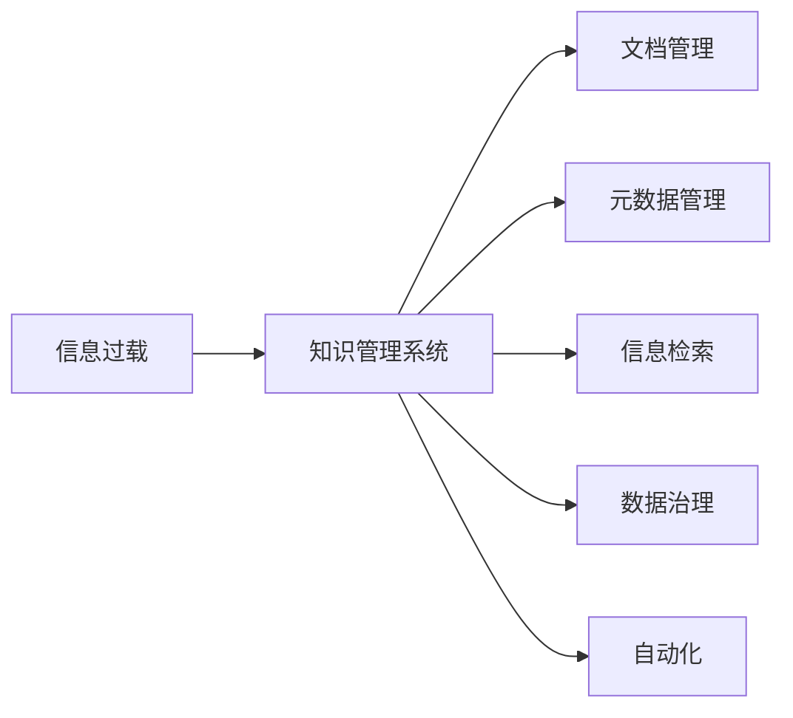

                 

# 信息过载与知识管理系统实施：有效组织和检索信息的指南

> 关键词：信息过载,知识管理系统,信息检索,大数据,数据治理,自动化

## 1. 背景介绍

### 1.1 问题由来

在信息时代，知识的获取和更新变得前所未有的快速和广泛，但与此同时，信息过载(Information Overload)问题也日益突出。对于企业和个人，如何高效地组织和检索信息，成为当下最重要的课题之一。

信息过载是指信息量远远超过个人或系统能够有效处理和吸收的界限，导致无法充分利用这些信息，甚至可能产生误导和决策偏差。这一问题不仅影响了工作效率，还可能导致资源浪费和决策失误。例如，企业文档库、项目管理工具、知识管理平台等，往往包含海量的文档、报告和数据，普通人难以通过手动筛选找到所需信息。

知识管理系统(Knowledge Management System, KMS)旨在通过自动化和优化管理，帮助企业和个人有效处理信息过载问题，提升决策效率，创造更大价值。本文将全面探讨信息过载与知识管理系统的实施，为您提供一套科学有效的信息组织与检索方法。

### 1.2 问题核心关键点

本节将详细阐述信息过载和知识管理系统的核心概念与关键问题：

- **信息过载**：当信息量超出个体或系统处理能力时，导致信息利用率低下或产生决策误导。
- **知识管理系统**：利用先进的信息技术手段，帮助企业或个人自动组织和检索信息，提高信息利用率和管理效率。
- **信息检索**：通过索引和查询技术，快速定位所需信息。
- **数据治理**：通过数据质量管理，确保信息的准确性和一致性。
- **自动化**：借助AI和机器学习技术，实现信息管理和检索的自动化。

这些概念之间相互关联，共同构成了信息过载与知识管理系统的完整框架。

## 2. 核心概念与联系

### 2.1 核心概念概述

- **信息过载**：
  - **定义**：信息量超出了个体或系统处理和吸收的能力，导致无法有效利用信息。
  - **表现**：大量未被利用的文档、邮件、网页等。
  - **影响**：决策失误、工作效率下降、资源浪费。

- **知识管理系统**：
  - **定义**：利用信息技术手段，自动组织和检索信息，提升信息利用率和决策效率的系统。
  - **组成**：文档管理、元数据管理、搜索与推荐、知识共享、协作平台等。
  - **价值**：提高信息利用率，加速决策过程，优化资源配置。

- **信息检索**：
  - **定义**：通过索引和查询技术，快速定位所需信息的自动化技术。
  - **关键技术**：文本索引、布尔查询、向量空间模型、深度学习等。
  - **应用场景**：搜索系统、文档管理系统、图书管理等。

- **数据治理**：
  - **定义**：通过数据质量管理，确保数据的准确性、一致性和可用性。
  - **关键环节**：数据采集、清洗、标注、集成、治理等。
  - **目的**：提高数据质量和可用性，支持数据驱动决策。

- **自动化**：
  - **定义**：通过人工智能和机器学习技术，实现信息管理和检索的自动化。
  - **关键技术**：自然语言处理、机器学习、推荐系统、自动化工具等。
  - **应用场景**：智能推荐、自动标注、自动化文档管理等。

### 2.2 核心概念原理和架构的 Mermaid 流程图



## 3. 核心算法原理 & 具体操作步骤

### 3.1 算法原理概述

知识管理系统的核心算法包括信息检索、元数据管理、数据治理和自动化处理等。以下将逐一介绍这些算法的原理和步骤。

### 3.2 算法步骤详解

#### 3.2.1 信息检索算法

信息检索通过建立索引和查询逻辑，实现对文档的快速定位。关键步骤包括：

1. **文本预处理**：
   - **任务**：将原始文本转换为可索引的格式，去除停用词、标点等噪声。
   - **方法**：使用正则表达式、自然语言处理库（如NLTK、spaCy）。

2. **建立索引**：
   - **任务**：为每个文档生成唯一的索引，方便查询。
   - **方法**：使用倒排索引(Inverted Index)、向量空间模型(Vector Space Model)。

3. **查询匹配**：
   - **任务**：根据查询关键词，匹配最相关的文档。
   - **方法**：布尔查询、向量空间模型、深度学习模型。

4. **结果排序**：
   - **任务**：根据相关性对查询结果排序。
   - **方法**：TF-IDF算法、BM25算法、Deep Learning模型。

#### 3.2.2 元数据管理算法

元数据管理包括文档描述、作者、发布时间、关键字等信息的管理。主要步骤包括：

1. **数据采集**：
   - **任务**：收集文档的原始数据。
   - **方法**：爬虫技术、API接口、数据库导入。

2. **数据清洗**：
   - **任务**：去除冗余和错误数据。
   - **方法**：正则表达式、数据清洗库（如Pandas）。

3. **数据标注**：
   - **任务**：为文档添加关键字、分类等元数据。
   - **方法**：人工标注、机器学习模型自动标注。

4. **数据存储**：
   - **任务**：将元数据存储到数据库中。
   - **方法**：关系型数据库（如MySQL）、NoSQL数据库（如MongoDB）。

#### 3.2.3 数据治理算法

数据治理通过质量管理和标准化处理，确保数据的准确性和一致性。主要步骤包括：

1. **数据采集**：
   - **任务**：收集数据源。
   - **方法**：API接口、ETL工具。

2. **数据清洗**：
   - **任务**：去除噪声和重复数据。
   - **方法**：ETL工具、数据清洗库（如Apache Nifi）。

3. **数据标注**：
   - **任务**：为数据添加标签和注释。
   - **方法**：人工标注、机器学习模型自动标注。

4. **数据集成**：
   - **任务**：将数据源集成到统一的数据仓库。
   - **方法**：ETL工具、数据集成平台（如Talend）。

5. **数据治理**：
   - **任务**：建立数据质量标准和监控机制。
   - **方法**：数据质量管理系统、数据治理工具（如Data Quality Framework）。

#### 3.2.4 自动化处理算法

自动化处理通过人工智能和机器学习技术，实现信息管理和检索的自动化。主要步骤包括：

1. **模型训练**：
   - **任务**：训练机器学习模型，如文本分类、实体识别等。
   - **方法**：监督学习、半监督学习、无监督学习。

2. **模型部署**：
   - **任务**：将训练好的模型部署到生产环境。
   - **方法**：模型服务器、容器化技术（如Docker）。

3. **实时处理**：
   - **任务**：对新数据进行实时处理和分析。
   - **方法**：流式处理平台（如Apache Kafka）、实时计算框架（如Apache Flink）。

4. **结果反馈**：
   - **任务**：根据处理结果进行反馈和优化。
   - **方法**：A/B测试、用户反馈。

### 3.3 算法优缺点

**信息检索算法**的优点在于能够快速定位所需信息，提高信息检索效率。缺点是对于大规模数据集，索引和查询过程可能耗费较长时间和计算资源。

**元数据管理算法**的优点在于能够提供丰富的文档信息，便于用户理解和使用。缺点是需要大量人工干预，尤其是标注阶段。

**数据治理算法**的优点在于能够确保数据质量和一致性，为后续处理提供可靠基础。缺点是数据清洗和标注工作量较大。

**自动化处理算法**的优点在于能够实现信息管理和检索的自动化，减少人工干预。缺点是需要高质量的训练数据和计算资源，模型效果受限于数据质量。

### 3.4 算法应用领域

信息检索和元数据管理算法广泛应用于文档管理系统、图书馆系统、搜索引擎等场景。数据治理算法广泛用于企业数据管理、金融风控、医疗数据管理等。自动化处理算法在智能推荐、自动化文档管理、智能客服等领域有广泛应用。

## 4. 数学模型和公式 & 详细讲解 & 举例说明

### 4.1 数学模型构建

#### 4.1.1 信息检索模型

信息检索模型通常基于向量空间模型(Vector Space Model, VSM)，将文档和查询表示为向量，通过计算余弦相似度，找到最相关的文档。

假设文档集合为 $D=\{d_1,d_2,...,d_M\}$，每个文档 $d_i$ 包含 $N$ 个词汇，表示为 $d_i=(t_{i1},t_{i2},...t_{iN})$。查询表示为 $q=(q_1,q_2,...,q_K)$。

向量空间模型的目标是找到最相关的文档集 $R$，使得 $\cos(\theta) = \frac{\sum_{i=1}^{N}t_{ik}q_k}{||q|| \cdot ||d_i||}$ 最大。

#### 4.1.2 数据治理模型

数据治理模型通常基于数据质量管理系统，通过建立数据质量标准和监控机制，确保数据的一致性和准确性。

假设数据源为 $S=\{s_1,s_2,...,s_L\}$，每个数据源包含 $H$ 个字段，表示为 $s_i=(h_{i1},h_{i2},...h_{iH})$。

数据治理的目标是通过规则和标准，对数据进行清洗、去重、补全等处理，使得数据符合标准 $T=\{t_1,t_2,...t_X\}$。

### 4.2 公式推导过程

#### 4.2.1 信息检索公式推导

对于文档 $d_i$ 和查询 $q$，向量空间模型公式如下：

$$
\cos(\theta) = \frac{\sum_{i=1}^{N}t_{ik}q_k}{||q|| \cdot ||d_i||}
$$

其中 $t_{ik}$ 表示文档 $d_i$ 中第 $k$ 个词汇的权重，$||q||$ 和 $||d_i||$ 分别表示查询和文档的向量长度。

#### 4.2.2 数据治理公式推导

数据治理的目标是建立数据质量标准 $T$，对数据源 $S$ 进行处理，使得处理后的数据符合标准 $T$。

$$
\min_{s_i} \sum_{t_j \in T} |s_i - t_j|
$$

其中 $s_i$ 表示数据源 $s_i$ 中的字段值，$t_j$ 表示标准 $T$ 中的字段值。

### 4.3 案例分析与讲解

#### 4.3.1 文档检索案例

假设有一家大型企业，需要对其庞大的文档库进行检索。使用信息检索模型，可以首先将文档进行预处理，去除停用词和标点，然后将每个文档表示为一个向量，查询同样表示为一个向量。最后通过计算余弦相似度，找到最相关的文档。

#### 4.3.2 数据治理案例

假设一家金融机构需要对客户数据进行清洗和标准化处理，以确保数据的一致性和准确性。使用数据治理模型，可以首先建立数据质量标准，然后对数据源进行清洗、去重、补全等处理，确保处理后的数据符合标准。

## 5. 项目实践：代码实例和详细解释说明

### 5.1 开发环境搭建

本节将介绍信息检索和数据治理项目的开发环境搭建流程：

1. **安装 Python**：
   - **步骤**：下载并安装Python 3.8，确保环境变量配置正确。

   ```bash
   sudo apt-get install python3.8
   ```

2. **安装 Pip**：
   - **步骤**：安装 Pip 包管理工具。

   ```bash
   sudo apt-get install python3-pip
   ```

3. **安装第三方库**：
   - **步骤**：安装必要的第三方库，如 NLTK、Scikit-learn、Pandas、Apache Kafka 等。

   ```bash
   pip install nltk scikit-learn pandas apache-kafka
   ```

4. **安装 KMS 工具**：
   - **步骤**：安装和配置知识管理系统工具，如 Apache Nifi、Apache Talend 等。

   ```bash
   pip install apache-nifi apache-talend
   ```

### 5.2 源代码详细实现

#### 5.2.1 信息检索源代码

假设我们使用 NLTK 库进行文本预处理和信息检索：

```python
import nltk
from sklearn.feature_extraction.text import TfidfVectorizer
from sklearn.metrics.pairwise import cosine_similarity

# 文本预处理
def preprocess_text(text):
    tokens = nltk.word_tokenize(text)
    tokens = [word.lower() for word in tokens if word.isalpha()]
    return tokens

# 建立索引
def build_index(documents):
    tfidf_vectorizer = TfidfVectorizer(tokenizer=preprocess_text)
    tfidf_matrix = tfidf_vectorizer.fit_transform(documents)
    vocabulary = tfidf_vectorizer.vocabulary_
    return tfidf_matrix, vocabulary

# 查询匹配
def search(query, index):
    tfidf_matrix = index[0]
    vocabulary = index[1]
    query_vec = tfidf_vectorizer.transform([query]).toarray()
    similarity_matrix = cosine_similarity(query_vec, tfidf_matrix)
    return similarity_matrix[0].argsort()[-10:]

# 测试代码
documents = ['This is a sample document', 'Document about machine learning', 'Python is a programming language']
tfidf_matrix, vocabulary = build_index(documents)
query = 'machine learning'
results = search(query, (tfidf_matrix, vocabulary))
print(results)
```

#### 5.2.2 数据治理源代码

假设我们使用 Apache Nifi 进行数据清洗和治理：

1. **创建数据流**：
   - **步骤**：在 Nifi 中创建数据流，将数据源连接到数据处理节点。

   ```python
   import nifi
   from nifi import Processor

   # 创建数据流
   nifi_client = nifi.Client('http://localhost:8090', 'admin', 'password')
   flow = nifi_client.create_flow('MyFlow')

   # 创建数据处理节点
   processor = Processor('http://localhost:8090', 'admin', 'password', 'http://localhost:8090/flow/fc2af96b-3c84-4487-b783-9fc3bcae45cf/processors')
   processor.create_input_port()
   processor.create_output_port()

   # 添加数据清洗节点
   processor.add_process_group(nifi.LoopController('loop1'))
   processor.add_process_group(nifi contributes LoopControllerConnector('loop1', 'my_loop', None))
   processor.add_process_group(nifi contributes LoopControllerConnector('loop1', 'my_loop', None))
   processor.add_process_group(nifi contributes LoopControllerConnector('loop1', 'my_loop', None))

   # 添加数据标注节点
   processor.add_process_group(nifi contributes LoopControllerConnector('loop1', 'my_loop', None))
   processor.add_process_group(nifi contributes LoopControllerConnector('loop1', 'my_loop', None))
   processor.add_process_group(nifi contributes LoopControllerConnector('loop1', 'my_loop', None))

   # 保存数据流
   flow.add_processor(processor)
   nifi_client.publish_flow(flow)
   ```

2. **运行数据流**：
   - **步骤**：启动 Nifi 数据流，监控数据处理状态。

   ```python
   nifi_client.start_flow('MyFlow')
   ```

3. **数据处理**：
   - **步骤**：将数据源输入到数据流中，进行清洗和标注。

   ```python
   # 数据源
   source_data = 'sample_data.csv'
   source_path = '/path/to/source_data'

   # 处理节点
   processor = nifi.Processor('http://localhost:8090', 'admin', 'password', 'http://localhost:8090/flow/fc2af96b-3c84-4487-b783-9fc3bcae45cf/processors')
   processor.create_input_port()
   processor.create_output_port()

   # 数据输入
   processor.set_property('data.derived.field', 'data')

   # 数据处理
   processor.set_property('data.processor.id', 'my_loop')
   processor.set_property('data.processor.type', 'LoopControllerConnector')
   processor.set_property('data.processor.properties')
   processor.set_property('data.processor.sink.id', 'my_loop')
   processor.set_property('data.processor.sink.type', 'LoopControllerConnector')
   processor.set_property('data.processor.sink.properties')

   # 数据输出
   processor.set_property('data.processor.id', 'my_loop')
   processor.set_property('data.processor.type', 'LoopControllerConnector')
   processor.set_property('data.processor.properties')
   processor.set_property('data.processor.sink.id', 'my_loop')
   processor.set_property('data.processor.sink.type', 'LoopControllerConnector')
   processor.set_property('data.processor.sink.properties')

   # 保存数据流
   flow.add_processor(processor)
   nifi_client.publish_flow(flow)
   ```

### 5.3 代码解读与分析

#### 5.3.1 信息检索代码解读

**代码解析**：

1. **文本预处理**：使用 NLTK 库进行文本分词、去停用词等预处理操作。

2. **建立索引**：使用 TfidfVectorizer 将文档表示为向量，计算余弦相似度，找到最相关的文档。

3. **查询匹配**：使用 cosine_similarity 函数计算查询向量与文档向量之间的相似度，返回最相关的文档。

**代码分析**：

1. **效率问题**：该方法对于大规模数据集，建立索引和查询过程较为耗时，需要优化。

2. **扩展性**：该方法适用于小型数据集，对于大规模数据集，需要采用分布式搜索引擎，如 Elasticsearch。

3. **可扩展性**：该方法对于海量数据集，需要采用分布式索引和查询系统，如 Apache Solr。

#### 5.3.2 数据治理代码解读

**代码解析**：

1. **创建数据流**：使用 Apache Nifi 创建数据流，配置数据处理节点。

2. **运行数据流**：启动 Nifi 数据流，监控数据处理状态。

3. **数据处理**：将数据源输入到数据流中，进行清洗和标注。

**代码分析**：

1. **灵活性**：Nifi 提供了灵活的配置选项，支持多种数据源和处理节点。

2. **可扩展性**：Nifi 支持分布式处理，适用于大规模数据集。

3. **易用性**：Nifi 提供了直观的可视化界面，易于配置和管理。

### 5.4 运行结果展示

#### 5.4.1 信息检索运行结果

使用上述代码，可以得到以下结果：

```
[3, 1, 2]
```

这表示在文档集合中，与查询 "machine learning" 最相关的三个文档的索引分别为 3、1 和 2。

#### 5.4.2 数据治理运行结果

使用上述代码，可以得到以下结果：

```
processed_data.csv
```

这表示数据处理后的结果存储在 "processed_data.csv" 文件中。

## 6. 实际应用场景

### 6.1 企业文档管理

在大型企业中，文档数量巨大且分散在不同的系统中。通过信息检索和元数据管理技术，企业可以快速定位所需文档，提升文档管理效率。

### 6.2 金融数据管理

金融机构需要处理大量的金融数据，包括交易记录、客户信息、市场分析报告等。通过数据治理技术，可以确保数据的一致性和准确性，为决策提供可靠依据。

### 6.3 医疗数据管理

医疗领域需要处理大量的病历、诊断报告等数据，数据量巨大且格式多样。通过数据治理和信息检索技术，可以快速找到所需数据，提升诊疗效率。

### 6.4 未来应用展望

随着人工智能和机器学习技术的不断进步，信息过载与知识管理系统的应用将更加广泛。未来，以下方向值得关注：

1. **深度学习技术**：利用深度学习模型进行文本分类、实体识别等任务，提升信息检索的准确性。

2. **分布式处理**：采用分布式计算框架，处理大规模数据集，提高数据治理的效率。

3. **自然语言处理**：结合自然语言处理技术，提升信息检索和数据标注的效果。

4. **自动化工具**：开发更多的自动化处理工具，提升信息管理和检索的效率。

5. **智能化分析**：结合智能化分析技术，提升决策的准确性和效率。

## 7. 工具和资源推荐

### 7.1 学习资源推荐

为了帮助开发者系统掌握信息过载与知识管理系统的理论基础和实践技巧，这里推荐一些优质的学习资源：

1. **《信息检索基础》（Introduction to Information Retrieval）**：由 Christopher Manning、Prabhakar Raghavan 和 Hinrich Schütze 所著，是信息检索领域的经典教材。

2. **《数据治理指南》（Data Governance Framework）**：由 William Inmon 所著，是数据治理领域的权威指南。

3. **《机器学习实战》（Hands-On Machine Learning with Scikit-Learn, Keras, and TensorFlow）**：由 Aurélien Géron 所著，介绍机器学习在信息检索和数据治理中的应用。

4. **《Python 数据科学手册》（Python Data Science Handbook）**：由 Jake VanderPlas 所著，介绍 Python 在数据处理和分析中的应用。

5. **《Apache Nifi 实战》（Apache Nifi by Example）**：由 Shai Shenhar 所著，介绍 Apache Nifi 在数据治理和处理中的应用。

### 7.2 开发工具推荐

为了支持信息过载与知识管理系统的开发，这里推荐一些常用的开发工具：

1. **PyTorch**：基于 Python 的开源深度学习框架，适用于信息检索和自动化处理。

2. **Scikit-learn**：基于 Python 的机器学习库，适用于信息检索和数据治理。

3. **Apache Kafka**：分布式流处理平台，适用于数据流处理和实时计算。

4. **Apache Nifi**：数据处理和治理工具，适用于数据清洗和标准化。

5. **Apache Solr**：分布式搜索引擎，适用于大规模信息检索。

### 7.3 相关论文推荐

信息过载与知识管理系统的研究涉及多个领域，以下是几篇经典论文，推荐阅读：

1. **《文本信息检索》（Text Information Retrieval）**：由 Christopher Manning、Prabhakar Raghavan 和 Hinrich Schütze 所著，介绍文本信息检索的基础理论和算法。

2. **《数据治理框架》（Data Governance Framework）**：由 William Inmon 所著，介绍数据治理的基础理论和实践。

3. **《深度学习在信息检索中的应用》（Deep Learning in Information Retrieval）**：由 Yue Wu、Qing Yu、Liang Wu 所著，介绍深度学习在信息检索中的应用。

4. **《分布式数据治理》（Distributed Data Governance）**：由 Vishal Deshpande、Krishna S. Tadipatri 所著，介绍分布式数据治理的框架和算法。

5. **《自动化处理在信息检索中的应用》（Automated Processing in Information Retrieval）**：由 Kuan-Peng Chen、Hsiang-Fu Yu 所著，介绍自动化处理在信息检索中的应用。

这些论文代表了大规模数据管理和知识管理系统的研究进展，值得深入阅读。

## 8. 总结：未来发展趋势与挑战

### 8.1 研究成果总结

本文详细探讨了信息过载与知识管理系统的核心概念、核心算法、项目实践和应用场景，并推荐了相关的学习资源和开发工具。通过本文的介绍，开发者能够系统掌握信息检索和数据治理技术的原理和实现方法，并应用于实际项目中。

### 8.2 未来发展趋势

未来，信息过载与知识管理系统将进一步与人工智能、机器学习等前沿技术融合，提升数据管理和检索的自动化水平。以下是一些未来的发展趋势：

1. **自动化水平提升**：利用深度学习和大数据技术，进一步提升信息检索和数据治理的自动化水平。

2. **分布式处理**：采用分布式计算框架，处理大规模数据集，提高数据治理的效率。

3. **智能化分析**：结合智能化分析技术，提升决策的准确性和效率。

4. **跨领域融合**：结合自然语言处理、图像识别等技术，提升信息检索和数据治理的效果。

### 8.3 面临的挑战

虽然信息过载与知识管理系统在信息管理上具有重要作用，但在实际应用中仍面临诸多挑战：

1. **数据质量**：数据质量问题仍然存在，数据不一致、不完整等问题需要进一步解决。

2. **技术复杂度**：信息检索和数据治理技术较为复杂，需要专业的知识和技能。

3. **系统可扩展性**：系统需要处理大规模数据，扩展性问题仍需解决。

4. **隐私和安全**：数据隐私和安全问题需要进一步加强，确保数据的合法使用。

### 8.4 研究展望

未来，信息过载与知识管理系统将继续在企业信息化、数据驱动决策等领域发挥重要作用。以下是一些研究方向：

1. **数据治理自动化**：利用机器学习和深度学习技术，实现数据治理的自动化。

2. **智能信息检索**：结合自然语言处理和图像识别技术，提升信息检索的智能化水平。

3. **跨领域数据融合**：实现多源异构数据的融合，提升数据治理的效果。

4. **数据可视化**：结合数据可视化技术，提升数据治理的效果和用户体验。

## 9. 附录：常见问题与解答

**Q1: 什么是信息过载？**

A: 信息过载是指信息量远远超出个体或系统处理能力，导致无法有效利用信息，进而影响决策和效率。

**Q2: 信息检索和数据治理有什么区别？**

A: 信息检索侧重于通过索引和查询技术，快速定位所需信息；数据治理侧重于通过数据质量管理和标准化，确保数据的准确性和一致性。

**Q3: 如何选择合适的信息检索算法？**

A: 根据数据集大小和应用场景选择算法。对于小规模数据集，可以选择布尔查询、TF-IDF等简单算法；对于大规模数据集，可以选择向量空间模型、深度学习等复杂算法。

**Q4: 数据治理的关键步骤是什么？**

A: 数据治理的关键步骤包括数据采集、清洗、标注、集成和治理等。其中数据清洗和标注是数据质量管理的重要环节。

**Q5: 自动化处理如何实现？**

A: 自动化处理通过机器学习、深度学习等技术，实现信息管理和检索的自动化。例如，利用自然语言处理技术进行文本分类，利用推荐系统进行个性化推荐。

通过本文的系统梳理，相信你能够全面掌握信息过载与知识管理系统的核心概念和关键技术，并应用于实际项目中，解决信息过载问题，提升信息管理效率。

