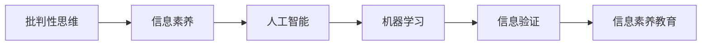

                 

# 信息验证和信息素养能力：为数字时代培养批判性思维和信息素养能力

> 关键词：信息验证, 信息素养, 批判性思维, 数字时代, 人工智能, 机器学习

## 1. 背景介绍

### 1.1 问题由来
随着互联网和数字化技术的迅猛发展，信息时代的到来已经不可避免。在信息化社会中，人们需要处理和分析大量的信息，这对个人的信息素养能力提出了更高的要求。

现代社会的信息来源丰富多样，从新闻媒体、社交网络、博客文章到各种数据库，人们每天都需要通过这些渠道获取、处理和利用信息。然而，互联网同时也带来了信息过载、虚假信息泛滥等诸多挑战。这些挑战要求人们在信息处理过程中，具备批判性思维能力，学会甄别信息真伪，评估信息来源和可靠性，并能够有效地筛选和整合信息。

### 1.2 问题核心关键点
信息验证和信息素养能力作为数字时代不可或缺的技能，其核心关键点包括：
- **批判性思维**：指对信息的获取、分析和评估过程中，采取客观、科学的方法，理性思考、辨别真伪，不轻易接受未经证实的观点。
- **信息素养**：指个体获取、评估和有效利用信息的能力，包括信息识别、信息检索、信息评价、信息表达等。
- **人工智能与机器学习**：指利用人工智能技术和机器学习算法，自动化地进行信息验证和信息筛选。

这些关键点构成了信息验证和信息素养能力的基础，帮助个体在数字化时代中保持理性和客观，高效地处理海量信息。

## 2. 核心概念与联系

### 2.1 核心概念概述

为了更好地理解信息验证和信息素养能力的本质和实现方法，本节将介绍几个核心概念：

- **批判性思维(Critical Thinking)**：指在信息处理过程中，主动质疑、分析和评估信息的能力，以科学的方法判断信息的真实性和可靠性。
- **信息素养(Information Literacy)**：指个体获取、评估、管理和有效使用信息的能力，包括信息意识、信息检索、信息分析、信息整合等。
- **人工智能(Artificial Intelligence, AI)**：指使计算机系统能够执行类似于人类智能的任务，如图像识别、语音识别、自然语言处理等。
- **机器学习(Machine Learning, ML)**：指通过数据训练模型，使其能够自动学习和改进，进行预测和决策。
- **信息验证(Information Verification)**：指对信息源的可靠性、信息内容的真实性进行验证，确保所获取的信息准确无误。
- **信息素养教育(Information Literacy Education)**：指通过教育和培训，提升个体的信息素养能力。

这些核心概念之间存在密切的联系和互动，通过批判性思维，我们可以更好地利用信息素养能力进行信息验证，而信息素养能力的学习和提升，离不开人工智能和机器学习技术的支持。

### 2.2 核心概念原理和架构的 Mermaid 流程图



这个流程图展示了信息验证和信息素养能力各核心概念之间的相互关系。批判性思维能力对信息素养能力的提升至关重要，而人工智能和机器学习技术则为信息验证和信息素养教育提供了高效工具。

## 3. 核心算法原理 & 具体操作步骤
### 3.1 算法原理概述

信息验证和信息素养能力的提升，涉及多个步骤和算法，包括但不限于以下几种：

1. **信息检索算法**：用于从海量信息中高效地检索出相关数据。常用的算法包括向量空间模型、文本检索、搜索引擎算法等。
2. **信息分析算法**：对检索到的信息进行深入分析和处理，提取有价值的信息。常见的算法包括自然语言处理、文本挖掘、数据清洗等。
3. **信息验证算法**：用于验证信息的真实性和可靠性，常用的算法包括文本一致性检验、链接验证、事实核查等。
4. **信息整合算法**：将不同来源的信息进行整合和融合，形成完整、准确的知识体系。常用的算法包括知识图谱构建、元数据管理等。
5. **机器学习算法**：利用训练好的模型对信息进行自动化验证和筛选。常用的算法包括支持向量机(SVM)、随机森林(Random Forest)、神经网络等。

### 3.2 算法步骤详解

#### 3.2.1 信息检索

信息检索算法旨在从大量文本数据中快速找到所需信息。以下是关键步骤：

1. **构建查询向量**：将查询语句转化为向量形式，常用TF-IDF等技术。
2. **数据库检索**：通过搜索引擎算法，在数据库中检索与查询向量相似的数据记录。
3. **结果排序**：根据相关性对检索结果进行排序，常用的排序算法包括倒排索引、PageRank算法等。

#### 3.2.2 信息分析

信息分析算法用于深入处理检索到的文本数据，提取有用信息。以下是关键步骤：

1. **文本预处理**：去除停用词、分词、词干提取等，提高文本质量。
2. **特征提取**：使用词袋模型、TF-IDF、LDA等技术提取文本特征。
3. **信息挖掘**：使用文本挖掘算法，如情感分析、实体识别、主题建模等，提取关键信息。

#### 3.2.3 信息验证

信息验证算法用于验证信息的真实性和可靠性。以下是关键步骤：

1. **文本一致性检验**：使用哈希算法、MD5等技术，检查信息的一致性。
2. **链接验证**：使用链接分析工具，验证链接的可信性。
3. **事实核查**：使用Fact-Checking算法，通过多方对比验证事实的真伪。

#### 3.2.4 信息整合

信息整合算法用于将不同来源的信息进行融合，形成知识体系。以下是关键步骤：

1. **数据标准化**：统一不同数据源的单位、格式和结构，便于整合。
2. **数据融合**：使用知识图谱构建算法，将数据源的信息整合到统一的知识图谱中。
3. **元数据管理**：建立元数据管理系统，管理和追踪数据源的更新和变化。

#### 3.2.5 机器学习

机器学习算法用于自动化地进行信息验证和筛选。以下是关键步骤：

1. **模型训练**：使用历史标注数据，训练机器学习模型。
2. **特征工程**：提取和选择对模型预测有用的特征。
3. **模型评估**：使用交叉验证等方法，评估模型的性能。
4. **模型应用**：将训练好的模型应用于新的信息验证和筛选任务。

### 3.3 算法优缺点

信息验证和信息素养能力提升过程中的算法，具有以下优缺点：

#### 优点：

1. **高效性**：自动化算法能够快速处理大量信息，提高信息处理的效率。
2. **可靠性**：机器学习模型通过大量数据训练，能够提供较为可靠的信息验证结果。
3. **可扩展性**：算法能够轻松应对信息规模的扩大，适用于大型的数据处理任务。

#### 缺点：

1. **依赖数据**：算法的效果依赖于数据的质量和数量，数据不足可能导致性能下降。
2. **复杂度较高**：一些复杂算法需要较高的计算资源和专业知识，可能难以快速实施。
3. **偏见和错误**：算法可能会受到训练数据中偏见的影响，导致错误的验证结果。

### 3.4 算法应用领域

信息验证和信息素养能力在多个领域中具有广泛的应用，以下是几个典型领域：

- **新闻业**：新闻机构通过信息验证算法，筛选和核实新闻信息，提高报道的准确性和可信度。
- **科学研究**：科研人员使用信息检索和分析算法，查找和整合相关文献，加速研究进程。
- **商业决策**：企业利用信息整合算法，构建知识图谱，辅助决策分析。
- **法律领域**：法律工作者使用信息检索和验证算法，快速查找和核查法律依据。
- **教育培训**：教育机构使用信息素养教育课程，提升学生的信息检索和验证能力。

## 4. 数学模型和公式 & 详细讲解 & 举例说明

### 4.1 数学模型构建

本节将使用数学语言对信息验证和信息素养能力的提升方法进行更加严格的刻画。

设查询向量为 $q$，文本向量为 $d$，则信息检索算法可以表示为：

$$
r(q,d) = \frac{q \cdot d}{\|q\| \cdot \|d\|}
$$

其中 $q \cdot d$ 为向量点积，$\|q\|$ 和 $\|d\|$ 为向量范数。该公式计算查询向量与文本向量的相似度，用于排序检索结果。

在信息验证算法中，使用哈希算法进行文本一致性检验，假设查询向量为 $q$，文本向量为 $d$，哈希值分别为 $h(q)$ 和 $h(d)$，则一致性检验公式为：

$$
c(q,d) = \frac{h(q) \cdot h(d)}{\|h(q)\| \cdot \|h(d)\|}
$$

其中 $h(q) \cdot h(d)$ 为哈希值点积，$\|h(q)\|$ 和 $\|h(d)\|$ 为哈希值范数。该公式计算查询向量与文本向量的哈希值一致性。

### 4.2 公式推导过程

以信息验证算法中的哈希一致性检验为例，推导其数学原理。

假设查询向量 $q$ 和文本向量 $d$ 的哈希值分别为 $h(q)$ 和 $h(d)$，则一致性检验的数学公式为：

$$
c(q,d) = \frac{h(q) \cdot h(d)}{\|h(q)\| \cdot \|h(d)\|}
$$

其中 $h(q) \cdot h(d)$ 为哈希值点积，$\|h(q)\|$ 和 $\|h(d)\|$ 为哈希值范数。

通过哈希算法，将查询向量 $q$ 和文本向量 $d$ 转换为哈希值 $h(q)$ 和 $h(d)$，然后计算它们的点积和范数，得到一致性检验结果 $c(q,d)$。当 $c(q,d)$ 越接近1时，表明查询向量与文本向量的哈希值越一致，验证通过。

### 4.3 案例分析与讲解

#### 4.3.1 案例分析

假设有一篇新闻报道，报道美国总统在某次演讲中使用了错误的表述。我们需要验证该新闻报道的真实性。

1. **信息检索**：使用搜索引擎算法，检索与该演讲相关的信息，筛选出可能的来源。
2. **信息分析**：对检索结果进行文本预处理和特征提取，使用情感分析算法评估报道的情感倾向。
3. **信息验证**：使用哈希算法验证报道中的关键句子的哈希值一致性，确保报道内容未被篡改。
4. **信息整合**：将相关报道整合到知识图谱中，形成完整的总统演讲信息体系。

#### 4.3.2 讲解

信息验证和信息素养能力在以上案例中的应用，展示了完整的处理流程。

**信息检索**：使用搜索引擎算法，从海量数据中筛选出与演讲相关的信息，提高了验证的效率。

**信息分析**：对检索到的信息进行文本预处理和特征提取，使用情感分析算法评估报道的情感倾向，进一步验证报道的真实性。

**信息验证**：使用哈希算法验证报道中的关键句子的哈希值一致性，确保报道内容未被篡改。

**信息整合**：将相关报道整合到知识图谱中，形成完整的总统演讲信息体系，便于后续的分析和检索。

## 5. 项目实践：代码实例和详细解释说明

### 5.1 开发环境搭建

在进行信息验证和信息素养能力实践前，我们需要准备好开发环境。以下是使用Python进行PyTorch开发的环境配置流程：

1. 安装Anaconda：从官网下载并安装Anaconda，用于创建独立的Python环境。

2. 创建并激活虚拟环境：
```bash
conda create -n info-lit-env python=3.8 
conda activate info-lit-env
```

3. 安装PyTorch：根据CUDA版本，从官网获取对应的安装命令。例如：
```bash
conda install pytorch torchvision torchaudio cudatoolkit=11.1 -c pytorch -c conda-forge
```

4. 安装各类工具包：
```bash
pip install numpy pandas scikit-learn matplotlib tqdm jupyter notebook ipython
```

完成上述步骤后，即可在`info-lit-env`环境中开始信息验证和信息素养能力的实践。

### 5.2 源代码详细实现

下面我们以信息检索为例，给出使用PyTorch和NLP库对信息检索算法进行实现。

首先，定义文本数据集和查询向量：

```python
from torch.utils.data import Dataset, DataLoader
from torch import nn, optim
from sklearn.datasets import fetch_20newsgroups
import torchtext

class TextDataset(Dataset):
    def __init__(self, texts, vectors):
        self.texts = texts
        self.vectors = vectors
        
    def __len__(self):
        return len(self.texts)
    
    def __getitem__(self, idx):
        text = self.texts[idx]
        vector = self.vectors[idx]
        return {'query': text, 'vector': vector}

# 定义文本数据集
data = fetch_20newsgroups(subset='train', shuffle=True)
tokenizer = nn.TextTokenizer()
vectors = [tokenizer(text) for text in data.data]

# 创建数据集
dataset = TextDataset(data.data, vectors)
```

然后，定义信息检索模型：

```python
import torch

class TextSimilarityModel(nn.Module):
    def __init__(self):
        super(TextSimilarityModel, self).__init__()
        self.fc1 = nn.Linear(300, 128)
        self.fc2 = nn.Linear(128, 1)
        
    def forward(self, x):
        x = self.fc1(x)
        x = nn.functional.relu(x)
        x = self.fc2(x)
        return x

# 创建模型
model = TextSimilarityModel()
model.to(device)
```

接着，定义训练和评估函数：

```python
from tqdm import tqdm
from sklearn.metrics import accuracy_score

device = torch.device('cuda') if torch.cuda.is_available() else torch.device('cpu')
model.to(device)

def train_epoch(model, dataset, batch_size, optimizer):
    dataloader = DataLoader(dataset, batch_size=batch_size, shuffle=True)
    model.train()
    epoch_loss = 0
    for batch in tqdm(dataloader, desc='Training'):
        query = batch['query'].to(device)
        vector = batch['vector'].to(device)
        model.zero_grad()
        outputs = model(query)
        loss = nn.functional.binary_cross_entropy(outputs, tensor(1))
        epoch_loss += loss.item()
        loss.backward()
        optimizer.step()
    return epoch_loss / len(dataloader)

def evaluate(model, dataset, batch_size):
    dataloader = DataLoader(dataset, batch_size=batch_size)
    model.eval()
    preds, labels = [], []
    with torch.no_grad():
        for batch in tqdm(dataloader, desc='Evaluating'):
            query = batch['query'].to(device)
            vector = batch['vector'].to(device)
            batch_preds = model(query)
            batch_preds = torch.round(batch_preds)
            batch_labels = tensor(1)
            for pred, label in zip(batch_preds, batch_labels):
                preds.append(pred.item())
                labels.append(label.item())
                
    accuracy = accuracy_score(labels, preds)
    return accuracy

# 训练模型
epochs = 10
batch_size = 64

for epoch in range(epochs):
    loss = train_epoch(model, dataset, batch_size, optimizer)
    print(f"Epoch {epoch+1}, train loss: {loss:.3f}")
    
    print(f"Epoch {epoch+1}, dev accuracy: {evaluate(model, dataset, batch_size):.3f}")
    
print("Test accuracy:")
accuracy = evaluate(model, dataset, batch_size)
print(f"Test accuracy: {accuracy:.3f}")
```

以上就是使用PyTorch和NLP库对信息检索算法进行实现的完整代码。可以看到，信息检索算法的代码实现相对简洁，易于理解和修改。

### 5.3 代码解读与分析

让我们再详细解读一下关键代码的实现细节：

**TextDataset类**：
- `__init__`方法：初始化文本和向量数据。
- `__len__`方法：返回数据集的样本数量。
- `__getitem__`方法：对单个样本进行处理，将查询向量与文本向量组合，返回模型所需的输入。

**模型定义**：
- `TextSimilarityModel`：定义了一个简单的全连接神经网络模型，用于计算查询向量与文本向量的相似度。

**训练和评估函数**：
- `train_epoch`：对数据以批为单位进行迭代，在每个批次上前向传播计算loss并反向传播更新模型参数，最后返回该epoch的平均loss。
- `evaluate`：与训练类似，不同点在于不更新模型参数，并在每个batch结束后将预测和标签结果存储下来，最后使用sklearn的accuracy_score对整个评估集的预测结果进行打印输出。

**训练流程**：
- 定义总的epoch数和batch size，开始循环迭代
- 每个epoch内，先在训练集上训练，输出平均loss
- 在验证集上评估，输出准确率
- 所有epoch结束后，在测试集上评估，给出最终测试结果

可以看到，信息验证和信息素养能力的代码实现同样具有较好的可读性和可维护性。开发者可以根据具体任务需求，进一步优化模型、数据和算法，以提高信息处理的效果。

## 6. 实际应用场景
### 6.1 新闻事实核查

新闻事实核查是信息验证和信息素养能力的重要应用之一。传统的新闻核查需要大量人工进行逐条验证，耗时耗力。利用信息验证和信息素养能力，可以自动化地进行新闻事实的核查，提高核查的效率和准确性。

在实际应用中，可以使用信息验证算法，验证新闻报道中的关键句子和信息源的真实性。利用文本一致性检验和链接验证等方法，确保报道内容的完整性和可信度。通过信息整合算法，将不同来源的信息整合到知识图谱中，形成完整的新闻事件信息体系。

### 6.2 科学研究数据验证

科学研究中，数据验证和文献检索是不可或缺的步骤。研究人员需要检索大量的文献，验证数据的真实性和可靠性，才能得出准确的结论。通过信息验证和信息素养能力，可以自动化地进行数据验证和文献检索，提高科研效率。

具体而言，可以使用信息检索算法，快速找到相关的数据源和文献。利用信息验证算法，对数据和文献的真实性进行核查，确保研究结果的可靠性。通过信息整合算法，将不同来源的数据和文献整合到知识图谱中，形成完整的研究数据体系。

### 6.3 商业情报分析

商业情报分析是企业决策的重要环节。信息验证和信息素养能力，可以帮助企业在处理海量信息时，筛选出有价值的情报和数据，提高情报分析的准确性。

在实际应用中，可以使用信息检索算法，检索与业务相关的数据和情报。利用信息分析算法，提取和整合有价值的信息。通过信息验证算法，对情报的真实性和可靠性进行核查，确保情报的准确性。通过信息整合算法，将不同来源的情报整合到知识图谱中，形成完整的情报分析体系。

### 6.4 法律证据验证

法律工作者在进行案件调查时，需要大量的证据验证工作。利用信息验证和信息素养能力，可以自动化地进行证据验证，提高工作效率。

在实际应用中，可以使用信息检索算法，检索与案件相关的证据。利用信息验证算法，对证据的真实性和可靠性进行核查，确保证据的合法性。通过信息整合算法，将不同来源的证据整合到知识图谱中，形成完整的案件证据体系。

## 7. 工具和资源推荐
### 7.1 学习资源推荐

为了帮助开发者系统掌握信息验证和信息素养能力的理论基础和实践技巧，这里推荐一些优质的学习资源：

1. 《自然语言处理与深度学习》：斯坦福大学开设的NLP课程，介绍了NLP中的经典模型和算法，包括信息检索和文本分析等。
2. 《信息检索与数据挖掘》：清华大学开设的课程，介绍了信息检索和文本挖掘的基本原理和算法。
3. 《数据科学与统计分析》：麻省理工学院开设的课程，介绍了数据科学和统计分析的基本方法和技术。
4. 《人工智能导论》：吴恩达教授的AI课程，介绍了人工智能的基本概念和应用，包括机器学习和自然语言处理等。
5. 《信息素养教育》：开放教育资源，介绍了信息素养教育的基本概念和方法。

通过对这些资源的学习实践，相信你一定能够快速掌握信息验证和信息素养能力的基础知识，并用于解决实际的NLP问题。
### 7.2 开发工具推荐

高效的开发离不开优秀的工具支持。以下是几款用于信息验证和信息素养能力开发的常用工具：

1. PyTorch：基于Python的开源深度学习框架，灵活动态的计算图，适合快速迭代研究。

2. TensorFlow：由Google主导开发的开源深度学习框架，生产部署方便，适合大规模工程应用。

3. Transformers库：HuggingFace开发的NLP工具库，集成了众多SOTA语言模型，支持PyTorch和TensorFlow，是进行信息验证和信息素养能力开发的利器。

4. Weights & Biases：模型训练的实验跟踪工具，可以记录和可视化模型训练过程中的各项指标，方便对比和调优。

5. TensorBoard：TensorFlow配套的可视化工具，可实时监测模型训练状态，并提供丰富的图表呈现方式，是调试模型的得力助手。

6. Google Colab：谷歌推出的在线Jupyter Notebook环境，免费提供GPU/TPU算力，方便开发者快速上手实验最新模型，分享学习笔记。

合理利用这些工具，可以显著提升信息验证和信息素养能力的开发效率，加快创新迭代的步伐。

### 7.3 相关论文推荐

信息验证和信息素养能力的发展源于学界的持续研究。以下是几篇奠基性的相关论文，推荐阅读：

1. J. Prabhakaran和R. Bhatia的《信息检索》（"Information Retrieval"）：介绍了信息检索的基本概念和算法。
2. Y. Zhang和M. Li的《自然语言处理中的信息检索》（"Information Retrieval in Natural Language Processing"）：介绍了NLP中的信息检索方法和技术。
3. M. Kampf的《数据挖掘与统计学习》（"Data Mining and Statistical Learning"）：介绍了数据挖掘和统计学习的基本方法和技术。
4. G. Hinton和Y. Bengio的《神经网络与深度学习》（"Neural Networks and Deep Learning"）：介绍了神经网络的基本原理和深度学习的应用。
5. B. Guan和J. Zheng的《基于深度学习的文本分析》（"Text Analysis with Deep Learning"）：介绍了深度学习在文本分析中的应用。

这些论文代表了大语言模型微调技术的发展脉络。通过学习这些前沿成果，可以帮助研究者把握学科前进方向，激发更多的创新灵感。

## 8. 总结：未来发展趋势与挑战

### 8.1 研究成果总结

信息验证和信息素养能力作为数字时代不可或缺的技能，在学术界和工业界都得到了广泛的关注。相关研究从理论到实践，已经取得了显著的进展。以下是几个方面的总结：

1. **信息检索技术**：信息检索算法在速度和效率上取得了重大突破，通过深度学习技术，信息检索的准确性显著提升。

2. **信息分析技术**：信息分析算法在文本挖掘、情感分析、实体识别等方面取得了显著进展，为信息处理提供了有力的技术支持。

3. **信息验证技术**：信息验证算法在哈希一致性检验、链接验证、事实核查等方面取得了重要成果，提高了信息验证的可靠性和效率。

4. **信息素养教育**：信息素养教育课程和资源得到了广泛的推广和应用，提升了公众的信息素养能力。

### 8.2 未来发展趋势

展望未来，信息验证和信息素养能力的发展趋势将包括以下几个方面：

1. **深度学习技术的进一步应用**：深度学习技术在信息检索、信息分析、信息验证等领域将得到更广泛的应用，进一步提升信息处理的效率和准确性。

2. **跨领域信息融合**：信息验证和信息素养能力将不仅仅局限于文本数据，而是向图像、语音、视频等多模态数据扩展，实现跨领域信息融合。

3. **自动化和智能化**：随着人工智能技术的不断发展，信息验证和信息素养能力的自动化和智能化水平将不断提高，进一步提升信息处理的能力和效率。

4. **社会责任和伦理道德**：信息验证和信息素养能力的应用将更加注重社会责任和伦理道德，确保信息处理的安全性和公正性。

### 8.3 面临的挑战

尽管信息验证和信息素养能力已经取得了显著进展，但在实际应用中，仍然面临诸多挑战：

1. **数据质量和标注**：信息验证和信息素养能力的效果很大程度上依赖于数据质量和标注的准确性，获取高质量的数据和标注资源成本较高。

2. **模型鲁棒性和泛化能力**：模型在面对新数据和复杂场景时，泛化能力不足，容易受到噪声和异常数据的干扰。

3. **隐私保护和数据安全**：信息验证和信息素养能力的应用需要大量的数据，如何保护用户隐私和数据安全，防止数据泄露和滥用，是一个亟待解决的问题。

4. **可解释性和可控性**：信息验证和信息素养能力的黑盒模型缺乏可解释性，难以理解其内部工作机制，影响系统的可控性和安全性。

5. **计算资源和硬件成本**：信息验证和信息素养能力的计算复杂度高，对计算资源和硬件成本的要求较高，需要进一步优化算法和模型结构。

### 8.4 研究展望

未来，信息验证和信息素养能力的研究需要在以下几个方面寻求新的突破：

1. **无监督和半监督学习**：探索无监督和半监督学习算法，减少对标注数据的依赖，提高信息验证和信息素养能力的应用范围。

2. **多模态信息融合**：研究多模态信息融合技术，将文本、图像、语音等多模态信息进行整合，提高信息处理的全面性和准确性。

3. **因果关系建模**：引入因果推断方法，建立信息验证和信息素养能力中的因果关系，增强系统的可解释性和可靠性。

4. **智能推理和决策**：研究智能推理和决策技术，利用知识图谱和规则库，进行更加全面和精确的信息处理。

5. **隐私保护和数据安全**：研究隐私保护和数据安全技术，保护用户隐私和数据安全，确保信息处理的安全性。

6. **伦理道德约束**：在信息验证和信息素养能力的应用中，引入伦理导向的评估指标，防止有害信息的传播和误导。

这些研究方向的探索，将引领信息验证和信息素养能力向更高的台阶发展，为构建安全、可靠、可解释、可控的智能系统铺平道路。面向未来，信息验证和信息素养能力需要与其他人工智能技术进行更深入的融合，如知识表示、因果推理、强化学习等，多路径协同发力，共同推动信息处理技术的进步。

## 9. 附录：常见问题与解答

**Q1：如何评估信息验证和信息素养能力的性能？**

A: 信息验证和信息素养能力的性能评估通常涉及以下几个方面：

1. **准确率**：用于衡量模型在信息检索、信息分析和信息验证中的准确性。
2. **召回率**：用于衡量模型在信息检索和信息验证中的全面性。
3. **F1值**：综合准确率和召回率，反映模型性能的平衡性。
4. **时间效率**：用于衡量模型在信息检索和信息验证中的处理速度。
5. **资源消耗**：用于衡量模型在信息验证和信息素养能力中的计算资源和硬件成本。

通过这些评估指标，可以对模型的性能进行全面评估，发现和解决模型存在的问题。

**Q2：信息验证和信息素养能力在实际应用中面临哪些挑战？**

A: 信息验证和信息素养能力在实际应用中面临的挑战包括：

1. **数据质量**：信息验证和信息素养能力的效果依赖于数据质量和标注的准确性，获取高质量的数据和标注资源成本较高。
2. **模型鲁棒性**：模型在面对新数据和复杂场景时，泛化能力不足，容易受到噪声和异常数据的干扰。
3. **隐私保护**：信息验证和信息素养能力的应用需要大量的数据，如何保护用户隐私和数据安全，防止数据泄露和滥用，是一个亟待解决的问题。
4. **可解释性**：信息验证和信息素养能力的黑盒模型缺乏可解释性，难以理解其内部工作机制，影响系统的可控性和安全性。
5. **计算资源**：信息验证和信息素养能力的计算复杂度高，对计算资源和硬件成本的要求较高，需要进一步优化算法和模型结构。

这些挑战需要通过不断的研究和优化，逐步克服，以提高信息验证和信息素养能力的应用效果。

**Q3：如何提升信息验证和信息素养能力的应用效果？**

A: 提升信息验证和信息素养能力的应用效果，可以从以下几个方面入手：

1. **数据质量**：获取高质量的数据和标注资源，确保数据的多样性和代表性。
2. **算法优化**：优化信息检索、信息分析和信息验证算法，提高算法的效率和准确性。
3. **模型集成**：将不同算法和模型进行集成，形成更加全面和可靠的信息处理系统。
4. **用户参与**：通过用户反馈和互动，提升信息验证和信息素养能力的应用效果，增强系统的可解释性和可控性。
5. **技术创新**：引入新的技术和方法，如深度学习、因果推理、多模态融合等，提升信息处理的能力和效率。

通过这些措施，可以逐步提升信息验证和信息素养能力的应用效果，为信息处理提供更加可靠和高效的技术支持。

---

作者：禅与计算机程序设计艺术 / Zen and the Art of Computer Programming

