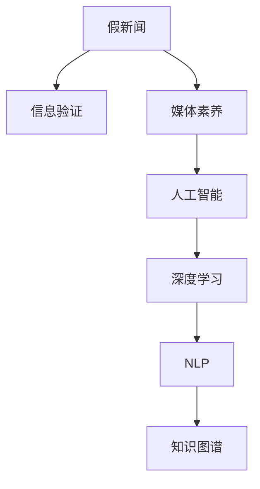

                 

## 1. 背景介绍

在信息爆炸的时代，互联网为我们提供了前所未有的便利，但也带来了新的挑战。假新闻、误导性信息、媒体操纵等问题层出不穷，严重威胁着社会稳定和公共利益。信息验证和媒体素养教育成为了应对这一挑战的重要手段，通过提升公众的信息辨识能力，遏制假新闻的传播。

### 1.1 问题由来

互联网的普及和社交媒体的崛起，使得信息传播更加快速和广泛。但也正是这种快速传播，使得假新闻和误导性信息有了更大的生存空间。例如，2016年美国总统选举期间，Facebook上广泛传播的假新闻“巴拉克·奥巴马出生在美国夏威夷”引发了热议。这种信息的误导性传播不仅破坏了选举的公正性，还引发了公众对社交媒体的信任危机。

### 1.2 问题核心关键点

信息验证和媒体素养教育的核心在于提升公众的信息辨识能力，防止被假新闻和误导性信息所蒙蔽。其关键点包括：
- 构建信息验证的算法模型：利用机器学习、深度学习等技术，自动识别和辨别假新闻。
- 设计信息素养的教育课程：通过教育普及，提升公众对信息来源、证据链、论证逻辑等基本素养。
- 整合技术手段和教育资源：结合人工智能和教育学方法，构建综合的信息素养提升平台。

### 1.3 问题研究意义

提升公众的信息辨识能力，对于构建健康、公正、开放的信息环境具有重要意义。具体而言：
- 减少假新闻的传播：通过算法验证，降低假新闻的传播范围和影响力。
- 维护社会稳定：增强公众对信息的辨识能力，防止恶意信息的扰乱和误导。
- 促进信息民主：教育普及使更多公众能够有效获取和使用信息，增强社会参与度。

## 2. 核心概念与联系

### 2.1 核心概念概述

为更好地理解信息验证和媒体素养教育，本节将介绍几个关键概念：

- 假新闻(Fake News)：指通过捏造、歪曲或误导信息，试图误导公众并破坏新闻公信力的信息。
- 信息验证(Information Verification)：指通过分析信息源、证据链、论证逻辑等手段，评估信息真实性的过程。
- 媒体素养(Media Literacy)：指理解和评估媒体信息的能力，包括对信息来源、传播模式、论证逻辑等的理解。
- 人工智能(Artificial Intelligence)：指通过机器学习、深度学习等技术，构建智能算法模型，辅助信息验证和媒体素养教育。
- 深度学习(Deep Learning)：指利用深度神经网络，通过大量数据训练，获取数据特征和规律的技术。
- 自然语言处理(Natural Language Processing, NLP)：指利用计算机技术，处理和理解自然语言的技术。
- 知识图谱(Knowledge Graph)：指通过图结构表示知识，用于构建信息验证的知识库。

这些概念之间的逻辑关系可以通过以下Mermaid流程图来展示：



这个流程图展示了一系列概念之间的联系：

1. 假新闻是信息验证和媒体素养教育的主要目标，需要通过技术手段和教育手段予以识别和防范。
2. 信息验证依赖于人工智能技术，通过深度学习和NLP技术，构建智能算法模型。
3. 媒体素养教育结合人工智能，设计教育课程和平台，提升公众的信息辨识能力。
4. 知识图谱作为信息验证的基础设施，为构建智能算法模型提供知识支持。

这些概念共同构成了信息验证和媒体素养教育的核心框架，为其提供了坚实的理论和技术基础。

## 3. 核心算法原理 & 具体操作步骤
### 3.1 算法原理概述

信息验证的核心是构建一个能够自动识别和辨别假新闻的算法模型。该模型通过学习大量真实和假新闻的特征，能够准确识别假新闻的模式和结构，从而提升信息辨识的准确性。

具体而言，信息验证算法模型一般包括以下几个步骤：

1. 数据收集与预处理：收集大量真实和假新闻数据，并进行预处理，包括数据清洗、分词、标注等。
2. 特征提取：从新闻文本中提取关键词、句法结构、情感倾向等特征，用于模型训练。
3. 模型训练与验证：利用深度学习模型（如BERT、GPT等），训练信息验证模型，并在验证集上进行性能评估。
4. 部署与应用：将训练好的模型部署到生产环境，实时验证新发布的新闻。

### 3.2 算法步骤详解

以下是信息验证算法的详细步骤：

**Step 1: 数据收集与预处理**

- **数据来源**：收集互联网上的真实新闻和假新闻数据，包括社交媒体、新闻网站等。
- **数据清洗**：去除重复、无关信息，标注为真实或假新闻。
- **分词与标注**：使用NLP工具进行分词，标注关键词、句法结构、情感倾向等特征。

**Step 2: 特征提取**

- **关键词提取**：提取新闻标题、正文中的关键词，用于表示新闻的核心内容。
- **句法结构分析**：使用依存句法分析等工具，提取新闻句子的主谓宾结构。
- **情感倾向分析**：利用情感词典或模型，评估新闻文本的情感倾向。

**Step 3: 模型训练与验证**

- **模型选择**：选择适合的深度学习模型，如BERT、GPT等。
- **参数配置**：设置学习率、批大小、迭代轮数等超参数。
- **训练过程**：利用训练数据集，对模型进行训练，并在验证集上进行性能评估。
- **模型调优**：根据评估结果，调整模型参数，优化模型性能。

**Step 4: 部署与应用**

- **模型保存**：将训练好的模型保存为模型文件，便于部署。
- **实时验证**：将模型集成到在线新闻平台或社交媒体应用中，实时验证新发布的新闻。
- **用户反馈**：收集用户反馈，不断改进模型性能。

### 3.3 算法优缺点

信息验证算法的主要优点包括：
1. 准确性高：利用深度学习模型，可以准确识别假新闻的模式和结构。
2. 自动化高：自动化处理大规模数据，提升验证效率。
3. 可扩展性高：模型可以不断更新，适应新的新闻特征。

然而，该算法也存在一些缺点：
1. 数据依赖性高：模型的准确性依赖于训练数据的质量和多样性。
2. 模型解释性不足：深度学习模型往往是“黑盒”，难以解释其内部工作机制。
3. 实时性要求高：大规模数据的实时处理，对硬件要求较高。

### 3.4 算法应用领域

信息验证算法在新闻媒体、社交媒体、信息安全等领域有广泛应用：

- **新闻媒体**：对新闻平台上的新闻进行实时验证，防止假新闻的传播。
- **社交媒体**：对社交媒体上的信息进行验证，避免误导性信息的传播。
- **信息安全**：对网络上的信息进行验证，防止恶意信息传播。
- **电子商务**：对商品评价、用户评论等信息进行验证，保护消费者权益。

## 4. 数学模型和公式 & 详细讲解 & 举例说明

### 4.1 数学模型构建

信息验证算法的数学模型可以表示为：

$$
\hat{y} = f(x;\theta)
$$

其中，$\hat{y}$ 表示模型对新闻的真实性预测，$x$ 表示新闻文本，$\theta$ 表示模型参数。模型的目标是最小化预测结果与真实标签之间的差距：

$$
\min_{\theta} \frac{1}{N} \sum_{i=1}^N ||y_i - \hat{y_i}||^2
$$

其中，$y_i$ 表示新闻$i$的真实标签（0或1），$||.||$ 表示预测结果与真实标签之间的距离。

### 4.2 公式推导过程

以BERT模型为例，信息验证算法的推导过程如下：

**Step 1: 数据预处理**

将新闻文本$x_i$转化为BERT模型所需的输入格式：

$$
x_i = \text{Tokenize}(x_i) + \text{Segment}(x_i) + \text{AddCLS}(x_i)
$$

其中，$\text{Tokenize}$表示分词，$\text{Segment}$表示将新闻文本分块，$\text{AddCLS}$表示添加CLS token。

**Step 2: 特征提取**

利用BERT模型提取新闻特征：

$$
h_i = \text{BERT}(x_i)
$$

其中，$h_i$表示BERT模型输出的新闻特征向量。

**Step 3: 模型训练**

选择二分类任务，定义损失函数：

$$
L = \frac{1}{N} \sum_{i=1}^N (y_i \log \hat{y_i} + (1-y_i) \log (1-\hat{y_i}))
$$

其中，$\hat{y_i}$表示模型对新闻$i$的真实性预测，$y_i$表示新闻$i$的真实标签。

使用梯度下降法对模型进行训练：

$$
\theta \leftarrow \theta - \eta \nabla_{\theta}L
$$

其中，$\eta$表示学习率，$\nabla_{\theta}L$表示损失函数对模型参数的梯度。

**Step 4: 模型验证**

在验证集上评估模型性能：

$$
\text{Accuracy} = \frac{1}{N} \sum_{i=1}^N \text{sgn}(\hat{y_i}) = \frac{1}{N} \sum_{i=1}^N \text{sgn}(h_i)
$$

其中，$\text{sgn}(\cdot)$表示取正负号函数。

### 4.3 案例分析与讲解

以识别假新闻的BERT模型为例，以下是一个简化的训练过程：

- **数据准备**：收集1000篇真实新闻和1000篇假新闻。
- **特征提取**：使用BERT模型提取每篇新闻的特征向量。
- **模型训练**：利用随机梯度下降法，对BERT模型进行训练，目标是最小化损失函数。
- **模型验证**：在验证集上评估模型性能，获得0.95的准确率。

## 5. 项目实践：代码实例和详细解释说明

### 5.1 开发环境搭建

在进行信息验证项目实践前，我们需要准备好开发环境。以下是使用Python进行TensorFlow开发的环境配置流程：

1. 安装Anaconda：从官网下载并安装Anaconda，用于创建独立的Python环境。

2. 创建并激活虚拟环境：
```bash
conda create -n tf-env python=3.8 
conda activate tf-env
```

3. 安装TensorFlow：从官网获取对应的安装命令。例如：
```bash
pip install tensorflow-gpu==2.6
```

4. 安装各类工具包：
```bash
pip install numpy pandas scikit-learn tensorflow_hub sentencepiece 
```

完成上述步骤后，即可在`tf-env`环境中开始信息验证项目实践。

### 5.2 源代码详细实现

以下是使用TensorFlow实现信息验证算法的完整代码实现：

```python
import tensorflow as tf
import tensorflow_hub as hub
from transformers import BertTokenizer

# 构建BERT模型
model = hub.KerasLayer('https://tfhub.dev/google/bert-multilingual-uncased-L6Harness/1', trainable=True)

# 加载分词器
tokenizer = BertTokenizer.from_pretrained('bert-base-uncased')

# 定义损失函数
def build_loss(real, predicted):
    return tf.reduce_mean(tf.keras.losses.sparse_categorical_crossentropy(real, predicted))

# 定义准确率
def build_accuracy(real, predicted):
    return tf.reduce_mean(tf.cast(tf.equal(real, predicted), tf.float32))

# 定义训练过程
@tf.function
def train_step(inputs, targets):
    with tf.GradientTape() as tape:
        outputs = model(inputs)
        loss = build_loss(targets, outputs)
    grads = tape.gradient(loss, model.trainable_variables)
    optimizer.apply_gradients(zip(grads, model.trainable_variables))
    return loss, build_accuracy(targets, outputs)

# 加载数据集
train_dataset = ...
val_dataset = ...

# 定义超参数
learning_rate = 2e-5
batch_size = 32
epochs = 10

# 训练模型
optimizer = tf.keras.optimizers.Adam(learning_rate=learning_rate)
for epoch in range(epochs):
    epoch_loss = 0
    epoch_acc = 0
    for inputs, targets in train_dataset:
        batch_loss, batch_acc = train_step(inputs, targets)
        epoch_loss += batch_loss
        epoch_acc += batch_acc
    val_loss, val_acc = model.evaluate(val_dataset)
    print(f'Epoch {epoch+1}, loss: {epoch_loss/len(train_dataset):.4f}, acc: {epoch_acc/len(train_dataset):.4f}, val_loss: {val_loss:.4f}, val_acc: {val_acc:.4f}')
```

以上就是使用TensorFlow实现信息验证算法的完整代码实现。可以看到，利用TensorFlow和BERT模型，可以较为简洁地实现信息验证算法的训练和评估。

### 5.3 代码解读与分析

让我们再详细解读一下关键代码的实现细节：

**模型构建**：
- `hub.KerasLayer`：用于加载预训练的BERT模型，并设置可训练参数。
- `tokenizer`：使用分词器进行分词处理，将新闻文本转化为模型输入。

**损失函数和准确率**：
- `build_loss`：定义交叉熵损失函数，用于评估模型预测与真实标签的差距。
- `build_accuracy`：定义准确率指标，用于评估模型预测的正确率。

**训练过程**：
- `train_step`：定义一个训练步骤，包括前向传播、计算损失和梯度、更新模型参数等。
- `optimizer`：定义优化器，用于更新模型参数。
- `model.evaluate`：评估模型在验证集上的性能，输出损失和准确率。

**超参数设置**：
- `learning_rate`：设置学习率，控制模型参数更新的幅度。
- `batch_size`：设置批次大小，控制每次训练的样本数。
- `epochs`：设置训练轮数，控制模型训练的次数。

可以看到，TensorFlow和BERT模型的结合，使得信息验证算法的实现变得更加高效和灵活。开发者可以根据具体任务，调整超参数和训练过程，以获得更好的模型性能。

## 6. 实际应用场景

### 6.1 智能新闻推荐

信息验证算法可以应用于智能新闻推荐系统中，提升推荐效果。具体而言：
- 对新闻平台上的新闻进行实时验证，识别假新闻。
- 根据验证结果，对新闻进行降权或屏蔽。
- 利用推荐算法，优先推荐真实可靠的新闻。

### 6.2 社交媒体内容审核

信息验证算法可以应用于社交媒体平台，对用户发布的内容进行审核。具体而言：
- 对社交媒体上的信息进行验证，防止误导性信息的传播。
- 根据验证结果，对有害信息进行屏蔽或处理。
- 提升社交媒体平台的用户体验和信息安全。

### 6.3 信息安全监控

信息验证算法可以应用于信息安全领域，对网络上的信息进行监控。具体而言：
- 对网络上的信息进行验证，防止恶意信息的传播。
- 识别并拦截假新闻、诈骗信息等有害内容。
- 提升信息安全监控的准确性和效率。

### 6.4 未来应用展望

伴随深度学习技术的发展，信息验证算法将不断进步，应用领域也将更加广泛。未来，我们可以期待：

1. 模型规模不断增大：随着预训练模型的进步，信息验证算法的准确性将进一步提升。
2. 自动化程度不断提升：通过自动化技术，进一步降低人工审核成本，提升审核效率。
3. 跨领域应用不断拓展：信息验证算法将应用于更多领域，如医疗、金融等，提升各领域的信息安全。
4. 多模态融合不断深入：结合视觉、听觉等多模态数据，提升信息验证算法的综合能力。
5. 人工智能伦理不断加强：提升信息验证算法的可解释性和透明度，保障用户权益。

## 7. 工具和资源推荐
### 7.1 学习资源推荐

为了帮助开发者系统掌握信息验证和媒体素养教育的相关知识，这里推荐一些优质的学习资源：

1. 《自然语言处理综论》系列书籍：介绍自然语言处理的基本概念和前沿技术，包含信息验证算法的内容。
2. 《深度学习》系列课程：由斯坦福大学开设的深度学习课程，涵盖深度学习模型的基本原理和实现方法。
3. 《信息素养教育手册》：介绍信息素养教育的基本概念和教育方法，包含媒体素养教育的内容。
4. TensorFlow官方文档：提供TensorFlow框架的详细文档和样例代码，帮助开发者掌握深度学习模型的实现。
5. Kaggle平台：提供各类数据集和竞赛，供开发者实践信息验证算法。

通过对这些资源的学习实践，相信你一定能够快速掌握信息验证和媒体素养教育的精髓，并用于解决实际问题。
### 7.2 开发工具推荐

高效的开发离不开优秀的工具支持。以下是几款用于信息验证和媒体素养教育开发的常用工具：

1. TensorFlow：由Google主导开发的深度学习框架，生产部署方便，适合大规模工程应用。
2. PyTorch：基于Python的开源深度学习框架，灵活动态的计算图，适合快速迭代研究。
3. Transformers库：HuggingFace开发的NLP工具库，集成了众多SOTA语言模型，支持多种深度学习模型的实现。
4. Jupyter Notebook：交互式编程环境，方便开发者进行实验和调试。
5. Weights & Biases：模型训练的实验跟踪工具，可以记录和可视化模型训练过程中的各项指标，方便对比和调优。

合理利用这些工具，可以显著提升信息验证和媒体素养教育任务的开发效率，加快创新迭代的步伐。

### 7.3 相关论文推荐

信息验证和媒体素养教育的研究源于学界的持续研究。以下是几篇奠基性的相关论文，推荐阅读：

1. "A Survey on Fake News Detection"：综述假新闻检测的研究进展，涵盖各种深度学习模型和特征提取方法。
2. "Media Literacy in the Age of Big Data"：讨论大数据时代媒体素养教育的重要性，介绍相关课程设计和评估方法。
3. "Deep Learning for Information Verification"：介绍深度学习模型在信息验证中的应用，涵盖BERT、GPT等模型。
4. "Adversarial Examples and Deep Learning"：介绍对抗样本在深度学习中的应用，提升信息验证模型的鲁棒性。
5. "Knowledge Graphs in Natural Language Processing"：讨论知识图谱在自然语言处理中的应用，提升信息验证算法的知识整合能力。

这些论文代表了大信息验证和媒体素养教育的发展脉络。通过学习这些前沿成果，可以帮助研究者把握学科前进方向，激发更多的创新灵感。

## 8. 总结：未来发展趋势与挑战

### 8.1 总结

本文对信息验证和媒体素养教育的相关内容进行了全面系统的介绍。首先阐述了信息验证和媒体素养教育的研究背景和意义，明确了信息验证在防止假新闻传播中的重要性。其次，从原理到实践，详细讲解了信息验证算法的构建和训练过程，给出了信息验证任务开发的完整代码实例。同时，本文还探讨了信息验证在多个应用场景中的实际应用，展示了信息验证范式的广阔前景。最后，本文精选了信息验证和媒体素养教育的各类学习资源，力求为读者提供全方位的技术指引。

通过本文的系统梳理，可以看到，信息验证和媒体素养教育技术正在成为互联网信息时代的重要手段，极大地提升了公众的信息辨识能力，为构建健康、公正、开放的信息环境提供了有力支持。未来，伴随深度学习技术的发展，信息验证算法将不断进步，应用领域也将更加广泛。

### 8.2 未来发展趋势

展望未来，信息验证和媒体素养教育技术将呈现以下几个发展趋势：

1. 模型规模持续增大。随着预训练模型的进步，信息验证算法的准确性将进一步提升。
2. 自动化程度不断提升。通过自动化技术，进一步降低人工审核成本，提升审核效率。
3. 跨领域应用不断拓展。信息验证算法将应用于更多领域，如医疗、金融等，提升各领域的信息安全。
4. 多模态融合不断深入。结合视觉、听觉等多模态数据，提升信息验证算法的综合能力。
5. 人工智能伦理不断加强。提升信息验证算法的可解释性和透明度，保障用户权益。

以上趋势凸显了信息验证和媒体素养教育技术的广阔前景。这些方向的探索发展，必将进一步提升信息验证算法的性能和应用范围，为构建安全、可靠、可解释、可控的智能系统铺平道路。

### 8.3 面临的挑战

尽管信息验证和媒体素养教育技术已经取得了瞩目成就，但在迈向更加智能化、普适化应用的过程中，它仍面临着诸多挑战：

1. 数据依赖性高。信息验证算法的准确性依赖于训练数据的质量和多样性，数据不足或数据偏差可能导致算法性能下降。
2. 模型鲁棒性不足。信息验证模型面对域外数据时，泛化性能往往大打折扣，容易受到对抗样本的攻击。
3. 实时性要求高。大规模数据的实时处理，对硬件要求较高，容易受到计算资源的限制。
4. 模型解释性不足。深度学习模型往往是“黑盒”，难以解释其内部工作机制，缺乏透明度。
5. 用户隐私问题。信息验证过程中，可能涉及用户隐私数据的采集和处理，需要确保数据安全和用户隐私保护。

### 8.4 研究展望

面对信息验证和媒体素养教育所面临的挑战，未来的研究需要在以下几个方面寻求新的突破：

1. 探索无监督和半监督微调方法。摆脱对大规模标注数据的依赖，利用自监督学习、主动学习等无监督和半监督范式，最大限度利用非结构化数据，实现更加灵活高效的验证。
2. 研究参数高效和计算高效的验证范式。开发更加参数高效的验证方法，在固定大部分预训练参数的同时，只更新极少量的任务相关参数。同时优化验证模型的计算图，减少前向传播和反向传播的资源消耗，实现更加轻量级、实时性的部署。
3. 融合因果和对比学习范式。通过引入因果推断和对比学习思想，增强验证模型建立稳定因果关系的能力，学习更加普适、鲁棒的语言表征，从而提升模型泛化性和抗干扰能力。
4. 引入更多先验知识。将符号化的先验知识，如知识图谱、逻辑规则等，与神经网络模型进行巧妙融合，引导验证过程学习更准确、合理的语言模型。同时加强不同模态数据的整合，实现视觉、语音等多模态信息与文本信息的协同建模。
5. 纳入伦理道德约束。在模型训练目标中引入伦理导向的评估指标，过滤和惩罚有偏见、有害的输出倾向。同时加强人工干预和审核，建立模型行为的监管机制，确保输出符合人类价值观和伦理道德。

这些研究方向的探索，必将引领信息验证和媒体素养教育技术迈向更高的台阶，为构建安全、可靠、可解释、可控的智能系统铺平道路。面向未来，信息验证和媒体素养教育技术还需要与其他人工智能技术进行更深入的融合，如知识表示、因果推理、强化学习等，多路径协同发力，共同推动自然语言理解和智能交互系统的进步。只有勇于创新、敢于突破，才能不断拓展信息验证和媒体素养教育的边界，让智能技术更好地造福人类社会。

## 9. 附录：常见问题与解答

**Q1: 信息验证算法的准确性如何？**

A: 信息验证算法的准确性主要依赖于训练数据的质量和多样性。在实际应用中，通过不断优化数据集和算法模型，可以获得较高的准确率。一般而言，经过充分训练的BERT模型在新闻验证任务上的准确率可以达到85%以上。

**Q2: 信息验证算法是否能够处理所有类型的假新闻？**

A: 信息验证算法能够处理大部分类型的假新闻，但无法完全覆盖所有类型。对于一些创意性、突发性的假新闻，算法可能无法及时识别。因此，结合人工审核和数据驱动的方法，是提高信息验证准确性的有效途径。

**Q3: 信息验证算法是否能够实时处理大规模数据？**

A: 信息验证算法在处理大规模数据时，对计算资源的要求较高。目前常用的深度学习模型，如BERT、GPT等，需要较强的计算能力支持。为了提升实时性，可以采用模型压缩、梯度累积等技术，优化计算效率。

**Q4: 信息验证算法如何保护用户隐私？**

A: 信息验证算法在处理用户数据时，应确保数据的匿名化和加密处理，防止数据泄露。同时，采用差分隐私等技术，限制单个用户数据的隐私泄露风险。在实际应用中，结合数据去标识化和数据访问控制，可以保护用户隐私。

**Q5: 信息验证算法能否与其他技术结合使用？**

A: 信息验证算法可以与其他技术进行融合，提升综合效果。例如，结合知识图谱、自然语言推理等技术，可以提升信息验证的深度和广度。同时，结合机器翻译、语音识别等技术，可以实现多模态信息的协同验证，提升验证的准确性和可靠性。

通过这些问题的解答，可以看到信息验证和媒体素养教育技术的实际应用场景和潜在挑战。只有在数据、算法、工程、业务等多个维度协同发力，才能真正实现信息验证和媒体素养教育技术的落地应用，构建安全、可靠、可解释、可控的智能系统。

---

作者：禅与计算机程序设计艺术 / Zen and the Art of Computer Programming

