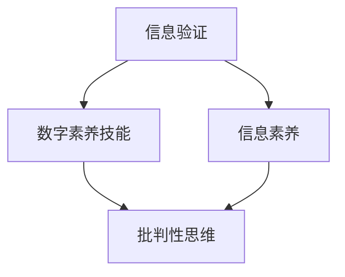

                 

# 信息验证和数字素养技能：为信息时代培养信息素养和批判性思维能力

> 关键词：信息验证, 数字素养技能, 信息素养, 批判性思维, 技术伦理, 教育创新, 人工智能, 网络安全, 数据科学

## 1. 背景介绍

### 1.1 问题由来
在信息时代，信息的爆炸式增长和传播使得人们面临前所未有的信息过载。海量的数据、快速的传播速度以及多元化的信息源，使得传统的基于经验和直觉的信息验证方式已经无法应对信息海洋中的各种真假并存的复杂局面。而数字素养技能（Digital Literacy）和批判性思维能力（Critical Thinking）则成为应对这一挑战的关键工具。

### 1.2 问题核心关键点
信息验证和数字素养技能的核心在于如何正确识别和判断信息的真伪，防止虚假信息的误导，以及如何在海量信息中寻找可靠的知识来源。这不仅关乎个人的认知能力，也关系到社会的健康发展。

批判性思维能力则是在面对复杂问题时，能够从多个角度思考、分析并评估信息，从而形成自己的独立判断。这一能力在人工智能、网络安全、数据科学等诸多领域至关重要。

## 2. 核心概念与联系

### 2.1 核心概念概述

为更好地理解信息验证和数字素养技能，本节将介绍几个密切相关的核心概念：

- **信息验证**：指通过一系列手段和方法，对信息的真伪进行鉴定和验证的过程。包括验证信息来源的可靠性、检查信息内容的准确性等。
- **数字素养技能**：指在数字环境下获取、评估、整合、创建和分享信息的能力。包括网络安全意识、数字设备操作、信息识别等。
- **信息素养**：指在信息社会中获取、评估、使用和管理信息的能力。包括信息搜索、信息分析、信息应用等。
- **批判性思维**：指在分析和解决问题时，能够客观、理性地评估信息的有效性和可靠性，并据此做出判断。

这些核心概念之间的逻辑关系可以通过以下Mermaid流程图来展示：



这个流程图展示了几者之间的联系：

1. 信息验证是数字素养技能的基础，通过识别信息的真伪，提升对信息的正确处理能力。
2. 信息素养是数字素养技能的重要组成部分，涉及信息获取、评估、应用等多个方面。
3. 批判性思维能力是在信息素养基础上，进一步提升的高级认知能力，影响信息处理和决策过程。

## 3. 核心算法原理 & 具体操作步骤

### 3.1 算法原理概述

信息验证和数字素养技能的核心在于识别信息源的可靠性、评估信息内容的准确性和完整性，以及根据已验证的信息做出合理的判断和决策。这一过程可以通过一系列算法和模型来实现，其核心算法包括：

1. **来源验证算法**：通过检查信息源的可信度、历史表现、专业性等因素，评估信息源的可靠性。
2. **内容验证算法**：通过对信息内容的逻辑、语法、数据等进行分析，识别出潜在的错误和偏差。
3. **关系验证算法**：通过分析和比较多个信息源之间的关系，判断信息的一致性和可信度。

这些算法往往依赖于自然语言处理（NLP）、数据挖掘和机器学习等技术，结合人工审阅和反馈，实现信息验证的目标。

### 3.2 算法步骤详解

信息验证和数字素养技能的操作过程可以分为以下几个步骤：

**Step 1: 收集和预处理信息**

- 使用网络爬虫、数据库查询等方式，收集相关信息的原始数据。
- 对原始数据进行预处理，包括去除无关信息、数据清洗、文本归一化等，为后续验证做准备。

**Step 2: 信息源评估**

- 使用来源验证算法，对信息源进行评估，获取其可信度得分。
- 检查信息源的历史记录、背景信息、专业性等因素，结合专家反馈，综合判断信息源的可靠性。

**Step 3: 内容验证**

- 使用内容验证算法，对信息内容进行逐项检查，包括语法错误、事实错误、逻辑漏洞等。
- 结合人工智能模型进行初步验证，如文本相似度分析、情感分析、事实核查等。

**Step 4: 关系验证**

- 使用关系验证算法，对多个信息源进行关系分析，判断其一致性和可信度。
- 对不一致的信息进行深入调查，结合多源验证结果，形成最终的判断。

**Step 5: 输出和反馈**

- 将验证结果以报告、标签等形式输出，供用户参考。
- 根据用户反馈，对模型进行调整和优化，提高验证的准确性和效率。

### 3.3 算法优缺点

信息验证和数字素养技能的方法具有以下优点：

1. 高效性：通过自动化手段和机器学习模型，能够快速处理和验证大量信息。
2. 系统性：结合多源验证和多模态数据，能够全面评估信息来源和内容。
3. 动态性：随着模型和数据的不断更新，验证能力可以不断提升。

同时，该方法也存在一定的局限性：

1. 数据质量依赖：算法的有效性很大程度上依赖于数据的质量，数据偏差可能导致误判。
2. 算法复杂性：高级算法如深度学习模型，需要大量的计算资源和专业知识。
3. 人工干预必要：算法不能完全取代人工判断，特别是在复杂和模糊的领域，需要结合人工审阅和反馈。

尽管存在这些局限性，但就目前而言，基于信息验证和数字素养技能的方法仍然是应对信息过载和虚假信息的有力工具。

### 3.4 算法应用领域

信息验证和数字素养技能的应用领域广泛，包括但不限于：

- 新闻媒体：通过信息验证，提高新闻报道的准确性和可信度。
- 教育培训：培养学生的信息素养和批判性思维能力，提高其学习效果和应用能力。
- 商业智能：在数据收集和处理过程中，保证数据的质量和准确性。
- 法律合规：确保信息披露和传播的合规性，避免法律风险。
- 公共安全：监控和验证网络上的信息传播，防止虚假信息的传播和扩散。

## 4. 数学模型和公式 & 详细讲解  
### 4.1 数学模型构建

本节将使用数学语言对信息验证和数字素养技能进行更加严格的刻画。

设信息源 $S_i$ 的可靠性评分为 $r_i \in [0,1]$，信息内容 $C$ 的准确性评分为 $a \in [0,1]$。则信息验证的总评分 $V$ 可以定义为：

$$
V = r_i \times a
$$

其中，$r_i$ 和 $a$ 的值由相应的算法和模型计算得出。

### 4.2 公式推导过程

以事实核查为例，假设有一个待验证的事实 $C$，有多个信息源 $S_1, S_2, ..., S_n$ 提供了关于这一事实的信息。假设每个信息源的可靠性评分为 $r_1, r_2, ..., r_n$，准确性评分为 $a_1, a_2, ..., a_n$。则通过信息源验证和内容验证的算法，可以得到每个信息源关于该事实的评分 $V_1, V_2, ..., V_n$。

结合信息源之间的关系验证，可以得到：

$$
V = \frac{1}{n} \sum_{i=1}^n \frac{V_i}{r_i}
$$

其中，$V_i$ 是信息源 $S_i$ 关于事实 $C$ 的评分，$r_i$ 是其可靠性评分。这一公式考虑了信息源的可靠性，避免了低可信度信息对整体评分的影响。

### 4.3 案例分析与讲解

假设我们验证的是关于新冠疫情的最新研究进展，有多个信息源提供了相关的研究数据。通过爬虫收集了以下数据：

| 信息源 | 可靠性评分 | 准确性评分 | 评分 |
| ------ | ---------- | ---------- | ---- |
| 新闻网站1 | 0.85       | 0.9        | 0.765 |
| 学术论文1 | 0.75       | 0.95       | 0.712 |
| 社交媒体1 | 0.5        | 0.7        | 0.35  |

根据信息验证的数学模型，可以得到该信息的综合评分：

$$
V = \frac{1}{3} \times \left( \frac{0.765}{0.85} + \frac{0.712}{0.75} + \frac{0.35}{0.5} \right) = 0.7282
$$

结合专家反馈和进一步的独立验证，可以得出最终的判断：该信息具有较高可信度，但仍需进一步核查。

## 5. 项目实践：代码实例和详细解释说明

### 5.1 开发环境搭建

在进行信息验证和数字素养技能的开发时，我们需要准备好开发环境。以下是使用Python进行相关开发的常见环境配置流程：

1. 安装Python：从官网下载并安装Python，确保版本稳定且支持多线程和异步编程。
2. 安装必要的库：如requests、BeautifulSoup、pandas、numpy等，用于网络爬取、数据处理和数学计算。
3. 安装机器学习框架：如scikit-learn、TensorFlow或PyTorch，用于构建和训练信息验证的模型。
4. 安装自然语言处理库：如NLTK、spaCy等，用于文本处理和语义分析。
5. 安装数据可视化库：如Matplotlib、Seaborn、Plotly等，用于数据可视化和结果展示。

完成上述步骤后，即可在开发环境中进行信息验证和数字素养技能的相关实践。

### 5.2 源代码详细实现

以下是一个使用Python进行信息验证的示例代码：

```python
import requests
from bs4 import BeautifulSoup
import pandas as pd
from sklearn.metrics import accuracy_score
from sklearn.model_selection import train_test_split

# 爬取网页
def scrape_page(url):
    response = requests.get(url)
    return BeautifulSoup(response.content, 'html.parser')

# 提取信息
def extract_info(soup):
    info = {}
    # 提取网页标题
    info['title'] = soup.title.string
    # 提取文本内容
    info['text'] = soup.get_text()
    return info

# 预处理数据
def preprocess_data(df):
    # 去除无关信息
    df = df.dropna(subset=['title', 'text'])
    # 文本归一化
    df['text'] = df['text'].apply(lambda x: x.lower())
    return df

# 训练模型
def train_model(df_train):
    # 提取特征
    X = df_train[['text']]
    y = df_train['label']
    # 划分训练集和测试集
    X_train, X_test, y_train, y_test = train_test_split(X, y, test_size=0.2, random_state=42)
    # 训练模型
    model = SVC(kernel='linear')
    model.fit(X_train, y_train)
    return model

# 验证模型
def validate_model(model, df_test):
    # 预测标签
    y_pred = model.predict(df_test[['text']])
    # 计算准确率
    accuracy = accuracy_score(y_test, y_pred)
    return accuracy

# 示例代码运行
if __name__ == '__main__':
    # 示例数据
    df = pd.read_csv('news_data.csv')
    # 预处理数据
    df = preprocess_data(df)
    # 训练模型
    model = train_model(df)
    # 验证模型
    accuracy = validate_model(model, df)
    print(f"模型准确率：{accuracy:.4f}")
```

在这个示例中，我们通过网络爬虫获取新闻网页的标题和内容，然后对文本进行预处理，并使用支持向量机（SVM）对新闻的真实性进行分类预测。代码中还包含了对模型进行训练和验证的过程。

### 5.3 代码解读与分析

让我们再详细解读一下关键代码的实现细节：

- `scrape_page` 函数：通过requests库和BeautifulSoup库，实现网页的爬取和内容提取。
- `extract_info` 函数：从爬取的网页中提取标题和文本内容，用于后续分析和训练。
- `preprocess_data` 函数：对提取的信息进行预处理，去除无关信息并进行文本归一化。
- `train_model` 函数：使用支持向量机（SVM）对信息进行分类训练，训练集和测试集按照8:2的比例划分。
- `validate_model` 函数：对训练好的模型进行验证，计算模型在测试集上的准确率。

这些函数和模型结合，可以实现基本的基于信息验证的自动化流程。当然，在实际应用中，还需要根据具体任务进行更深入的模型设计和数据处理。

## 6. 实际应用场景

### 6.1 网络新闻验证

在网络新闻验证中，信息验证和数字素养技能可以应用于新闻事实的准确性检查。例如，对于一篇关于疫情进展的新闻报道，可以通过信息验证算法，检查新闻源的可靠性、内容的真实性以及不同信息源之间的一致性。结合专家反馈和数据统计，对新闻进行全面评估，从而防止虚假信息的传播。

### 6.2 学术研究验证

在学术研究验证中，信息验证和数字素养技能可以应用于研究数据的验证和分析。例如，对于一篇关于新药物疗效的研究论文，可以通过信息验证算法，检查论文引用的数据来源、实验方法的可靠性和结果的准确性。结合多源验证和多模态数据，确保研究的可信度和有效性。

### 6.3 社交媒体监控

在社交媒体监控中，信息验证和数字素养技能可以应用于社交媒体上信息的真实性检查。例如，对于一条关于热门事件的推文，可以通过信息验证算法，检查推文内容的真实性、信息源的可靠性以及推文之间的关联性。结合多模态数据和多源验证，识别出虚假信息和误导性内容，防止其对公众造成误导。

### 6.4 未来应用展望

随着信息验证和数字素养技能的发展，未来的应用场景将更加广泛和深入：

1. **智能化新闻平台**：结合人工智能和大数据分析，实现新闻报道的实时验证和自动标注，提升新闻平台的内容质量和用户信任度。
2. **学术研究自动化**：使用信息验证和数字素养技能，自动化处理学术研究中的数据验证和结果评估，提高研究的可信度和效率。
3. **社交媒体治理**：通过信息验证和数字素养技能，自动监测和治理社交媒体上的虚假信息和误导性内容，维护公共信息的健康传播。
4. **智能客服系统**：结合信息验证和数字素养技能，构建智能客服系统的信息验证机制，提升客服的准确性和用户满意度。
5. **教育培训平台**：使用信息验证和数字素养技能，辅助教育培训平台的内容生成和质量评估，培养学生的数字素养和批判性思维能力。

## 7. 工具和资源推荐

### 7.1 学习资源推荐

为了帮助开发者系统掌握信息验证和数字素养技能的技术基础和应用技巧，这里推荐一些优质的学习资源：

1. 《数字素养技能：信息时代必备技能》系列博文：由数字素养专家撰写，深入浅出地介绍了数字素养技能的理论基础和实践技巧。
2. 《信息验证和批判性思维》在线课程：由知名大学和研究机构开设的公开课程，提供系统的课程内容和学习资料。
3. 《信息验证算法与实践》书籍：详细介绍了信息验证算法的原理和应用案例，是信息验证技术的权威指南。
4. 《数字素养技能提升指南》书籍：提供了系统的数字素养技能培训计划和学习路径，适合各个层次的学习者。
5. 《人工智能与数字素养技能》报告：由AI研究机构发布，探讨了人工智能与数字素养技能的关系和未来发展趋势。

通过对这些资源的学习实践，相信你一定能够快速掌握信息验证和数字素养技能的技术细节，并用于解决实际的数字素养问题。

### 7.2 开发工具推荐

高效的开发离不开优秀的工具支持。以下是几款用于信息验证和数字素养技能开发的常用工具：

1. Python：开源的高级编程语言，拥有丰富的数据处理、机器学习和自然语言处理库，适合信息验证和数字素养技能的开发。
2. Jupyter Notebook：交互式编程环境，支持代码运行和结果展示，适合开发和调试信息验证算法。
3. BeautifulSoup：Python库，用于解析HTML和XML文档，适合网页爬取和信息提取。
4. Pandas：Python库，用于数据处理和分析，适合数据预处理和特征提取。
5. Scikit-learn：Python库，用于机器学习和数据挖掘，适合构建和训练信息验证模型。
6. TensorFlow和PyTorch：深度学习框架，适合构建高级的信息验证模型。

合理利用这些工具，可以显著提升信息验证和数字素养技能开发的效率，加速创新迭代的步伐。

### 7.3 相关论文推荐

信息验证和数字素养技能的发展源于学界的持续研究。以下是几篇奠基性的相关论文，推荐阅读：

1. "A Survey on Information Verification Techniques for Deep Learning Models"：综述了当前信息验证技术的研究现状和应用案例。
2. "Digital Literacy Skills: An Overview of Current Practices and Future Directions"：探讨了数字素养技能的定义、应用和未来发展方向。
3. "Critical Thinking in AI: Opportunities and Challenges"：讨论了人工智能应用中的批判性思维能力，以及如何培养和应用这一能力。
4. "Information Verification Algorithms and Tools"：介绍了几种常用的信息验证算法和工具，包括文本分类、事实核查等。
5. "Machine Learning for Information Verification and Validation"：探讨了机器学习在信息验证中的应用，包括数据增强、多源验证等技术。

这些论文代表了大语言模型微调技术的发展脉络。通过学习这些前沿成果，可以帮助研究者把握学科前进方向，激发更多的创新灵感。

## 8. 总结：未来发展趋势与挑战

### 8.1 总结

本文对信息验证和数字素养技能进行了全面系统的介绍。首先阐述了信息验证和数字素养技能的研究背景和意义，明确了其在信息时代的重要性。其次，从原理到实践，详细讲解了信息验证和数字素养技能的数学模型和操作步骤，给出了具体的代码实例。同时，本文还广泛探讨了信息验证和数字素养技能在多个领域的应用前景，展示了其广阔的应用潜力。此外，本文精选了信息验证和数字素养技能的学习资源、开发工具和相关论文，力求为读者提供全方位的技术指引。

通过本文的系统梳理，可以看到，信息验证和数字素养技能在应对信息过载和虚假信息方面的关键作用。这些技能不仅能够提升个人的信息素养和批判性思维能力，也能够帮助社会构建更加健康、透明和可信的信息环境。未来，伴随技术的持续演进，信息验证和数字素养技能的应用范围将进一步拓展，成为信息时代不可或缺的重要工具。

### 8.2 未来发展趋势

展望未来，信息验证和数字素养技能将呈现以下几个发展趋势：

1. **智能化和自动化**：结合人工智能和大数据分析，实现信息验证的智能化和自动化，提高验证的效率和准确性。
2. **多模态融合**：将文本、图像、视频等多模态信息结合，实现更全面、更深入的信息验证。
3. **知识图谱应用**：结合知识图谱和自然语言处理技术，提高信息验证的深度和广度。
4. **实时性和交互性**：结合实时数据流和多用户交互，实现信息验证的实时性和互动性。
5. **跨领域应用**：信息验证和数字素养技能的应用范围将不断拓展，应用于更多领域和场景。

这些趋势凸显了信息验证和数字素养技能的发展方向，将推动其在更多领域的广泛应用，进一步提升社会的信息素养和认知水平。

### 8.3 面临的挑战

尽管信息验证和数字素养技能已经取得了一定的进展，但在迈向更加智能化、普适化应用的过程中，它仍面临着诸多挑战：

1. **数据质量和多样性**：算法的有效性很大程度上依赖于数据的质量和多样性，数据偏差可能导致误判。
2. **模型复杂性**：高级算法如深度学习模型，需要大量的计算资源和专业知识。
3. **伦理和安全问题**：信息验证和数字素养技能的应用可能涉及隐私保护和伦理道德问题，需要谨慎处理。
4. **用户接受度**：用户对信息验证和数字素养技能的理解和接受度不一，推广应用需要更多教育和引导。
5. **跨领域适应性**：不同领域的信息验证需求不同，需要针对具体领域进行定制化设计和优化。

尽管存在这些挑战，但信息验证和数字素养技能的应用前景广阔，相信随着技术的不断进步和社会的需求提升，这些问题将逐步得到解决。

### 8.4 研究展望

面向未来，信息验证和数字素养技能的研究需要在以下几个方面寻求新的突破：

1. **跨领域应用**：针对不同领域的信息验证需求，开发更具普适性的验证方法。
2. **多模态融合**：将文本、图像、视频等多模态信息结合，提升信息验证的深度和广度。
3. **自动化和智能化**：结合人工智能和大数据分析，实现信息验证的自动化和智能化。
4. **知识图谱应用**：结合知识图谱和自然语言处理技术，提高信息验证的深度和广度。
5. **跨学科合作**：与其他学科如心理学、伦理学、社会学等结合，探索信息验证和数字素养技能的更深层次应用。

这些研究方向的探索，必将引领信息验证和数字素养技能的发展方向，为构建健康、透明、可信的信息环境提供有力支持。面向未来，信息验证和数字素养技能需要不断创新和突破，才能在信息时代发挥更大的作用。

## 9. 附录：常见问题与解答

**Q1：信息验证和数字素养技能是否适用于所有信息类型？**

A: 信息验证和数字素养技能主要适用于结构化或半结构化的文本信息，对于非文本信息（如音频、视频、图像）可能效果有限。对于非结构化文本信息，需要结合领域知识和人工审核，进行更全面的验证。

**Q2：信息验证和数字素养技能是否需要大量的标注数据？**

A: 信息验证和数字素养技能的训练通常需要标注数据，但相比传统机器学习任务，其标注成本较低。可以通过人工审核和专家标注等方式，获得高质量的验证数据。

**Q3：信息验证和数字素养技能的应用场景有哪些？**

A: 信息验证和数字素养技能适用于多种应用场景，包括但不限于新闻报道验证、学术研究验证、社交媒体监控、智能客服系统、教育培训平台等。

**Q4：如何提高信息验证和数字素养技能的准确性？**

A: 提高信息验证和数字素养技能的准确性需要多方面的努力：

1. 数据质量：确保训练数据的多样性和质量，避免数据偏差。
2. 算法优化：不断优化信息验证算法，提高验证的准确性。
3. 多源验证：结合多源数据和多模态信息，提高验证的全面性和可靠性。
4. 专家参与：邀请领域专家进行审核和验证，提高验证的深度和准确性。
5. 用户反馈：结合用户反馈和交互，不断优化和改进验证算法。

这些措施可以显著提升信息验证和数字素养技能的准确性和可靠性。

**Q5：如何结合人工智能技术进行信息验证？**

A: 结合人工智能技术进行信息验证需要以下几个步骤：

1. 数据预处理：对原始数据进行清洗和预处理，提取有用的特征。
2. 模型训练：使用机器学习或深度学习模型，对信息进行分类或预测。
3. 多源验证：结合多源数据和多模态信息，进行全面验证。
4. 结果评估：结合专家审核和用户反馈，对验证结果进行评估和改进。

结合人工智能技术，可以实现信息验证的自动化和智能化，提高验证的效率和准确性。

---

作者：禅与计算机程序设计艺术 / Zen and the Art of Computer Programming

